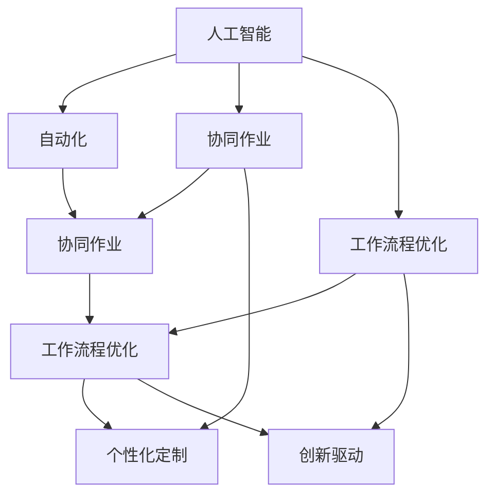

                 

# 人机协同：未来工作的核心驱动力

> 关键词：人工智能,人机协同,自动化,协同作业,工作流程优化,生产力提升,创新驱动,未来工作形态,技术融合

## 1. 背景介绍

### 1.1 问题由来
随着信息技术的飞速发展，人工智能（AI）已经成为推动各行各业变革的重要力量。然而，AI的快速发展也引发了关于未来工作的诸多思考：

- **自动化和就业挑战**：自动化的普及是否会引发大规模失业？如何平衡自动化与就业？
- **工作效率与创新**：自动化工具如何与人类工作相融合，提升工作效率，激发创新思维？
- **协同作业与协作**：如何在人机协作中发挥各自优势，实现最优化的协同作业？
- **工作流程优化与定制**：如何利用AI技术优化现有工作流程，实现个性化定制？

### 1.2 问题核心关键点
面对这些挑战，人机协同成为了未来工作的核心驱动力。它不仅意味着将自动化技术融入传统工作流程，更强调了人类与机器之间的深度合作，共同解决问题。

人机协同的核心在于：
- **自动化与增强**：通过自动化工具提升工作效率，让人类专注于更有创造性和战略性的工作。
- **数据驱动与决策支持**：利用大数据和AI算法支持决策，优化工作流程，提高决策的科学性和准确性。
- **协作与沟通**：建立高效的人机交互界面，促进协同作业，提升团队协作效率。

人机协同技术已经在多个行业和领域中得到了广泛应用，展示了其强大的潜力。例如，医疗领域的机器人手术，制造业的智能生产线，金融行业的智能投顾，均是人工与AI协同作业的典范。

## 2. 核心概念与联系

### 2.1 核心概念概述

为更好地理解人机协同的核心概念，本节将介绍几个密切相关的核心概念：

- **人工智能（AI）**：使用算法和计算工具，使计算机系统模拟人类智能行为的技术。
- **自动化**：使用计算机系统和技术，自动完成重复性、机械性工作，提升工作效率。
- **协同作业**：人机协作，共同完成复杂任务，提升工作质量和效率。
- **工作流程优化**：通过改进和优化现有工作流程，提升资源利用率和生产力。
- **个性化定制**：根据个体需求和工作习惯，定制个性化工作环境，提升工作满意度。
- **创新驱动**：利用AI技术激发新的思维方式和解决方案，推动技术创新和产业变革。

这些核心概念之间的逻辑关系可以通过以下Mermaid流程图来展示：



这个流程图展示了你我协同的核心概念及其之间的关系：

1. 人工智能通过自动化工具，提升工作效率，为协同作业和流程优化提供支持。
2. 协同作业利用人机优势，共同完成复杂任务，实现资源高效利用。
3. 工作流程优化通过改进现有流程，提升生产力。
4. 个性化定制满足个体需求，提升工作满意度。
5. 创新驱动通过技术创新，推动产业变革。

这些概念共同构成了人机协同的框架，为未来工作提供了方向。

## 3. 核心算法原理 & 具体操作步骤
### 3.1 算法原理概述

人机协同的核心在于结合AI技术，实现自动化与人类工作的深度融合。其核心思想是：

1. **自动化与增强**：使用自动化工具处理重复性工作，解放人力，让人类专注于更有创造性和战略性的任务。
2. **协同作业与决策支持**：利用AI技术收集、分析数据，支持决策过程，优化工作流程。
3. **工作流程优化与个性化定制**：通过改进和定制工作流程，提升效率和满意度。
4. **创新驱动与持续学习**：不断利用AI技术创新工作方法，推动技术进步。

### 3.2 算法步骤详解

人机协同的实现一般包括以下几个关键步骤：

**Step 1: 数据采集与分析**
- 收集工作流程中的相关数据，如任务完成时间、资源使用情况、错误率等。
- 使用数据分析工具和算法，提取有价值的信息，为后续优化和决策提供支持。

**Step 2: 自动化工具部署**
- 根据需求选择合适的自动化工具，如机器人流程自动化（RPA）、智能投顾、智能推荐系统等。
- 部署自动化工具，进行初步的自动化改造。

**Step 3: 协同作业界面设计**
- 设计高效的人机交互界面，包括用户界面（UI）和用户交互（UX），确保人机协作无缝。
- 开发协同作业系统，实现实时沟通、协作和任务分配。

**Step 4: 工作流程优化**
- 通过数据分析和模型评估，识别流程中的瓶颈和优化点。
- 应用改进措施，如流程重组、自动化技术应用、资源重新分配等。

**Step 5: 个性化定制**
- 收集用户反馈和行为数据，分析个性化需求。
- 根据需求调整工作环境，如定制化报告、个性化的任务分配等。

**Step 6: 持续学习与创新**
- 利用AI技术，持续学习新知识和技能，优化工作流程。
- 鼓励创新，利用AI工具探索新的工作方法，推动技术进步。

### 3.3 算法优缺点

人机协同技术的优点包括：
1. **提升效率**：自动化工具处理重复性工作，提升工作效率。
2. **降低成本**：减少人力成本和错误率，提升资源利用率。
3. **优化决策**：数据驱动的决策支持，提升决策科学性。
4. **促进创新**：持续学习和新方法的引入，推动技术创新。

但同时也存在一些局限：
1. **数据依赖**：数据质量直接影响到协同效果，数据采集和分析需要投入较大成本。
2. **技术复杂性**：实现人机协同需要复杂的技术栈和工具链，可能带来较高的开发和部署难度。
3. **人机沟通**：高效协同需要良好的人机沟通机制，对界面设计和用户体验要求较高。
4. **隐私和安全**：数据隐私和安全问题需要特别注意，防止数据泄露和滥用。

尽管存在这些局限，但人机协同技术仍是大势所趋，它将为未来工作带来深远的影响。

### 3.4 算法应用领域

人机协同技术已经在多个领域得到了广泛应用，以下是几个典型案例：

- **制造业**：智能生产线和机器人流程自动化（RPA），提升生产效率和质量。
- **金融行业**：智能投顾和自动化报告生成，优化客户服务和决策支持。
- **医疗领域**：机器人手术和智能诊断系统，提升医疗服务质量和效率。
- **零售行业**：智能推荐系统和自动化库存管理，提升客户体验和运营效率。
- **物流和供应链**：自动化仓储和智能调度系统，优化物流和供应链管理。
- **教育**：个性化学习推荐和智能辅导系统，提升教育质量和效率。

## 4. 数学模型和公式 & 详细讲解 & 举例说明
### 4.1 数学模型构建

人机协同的技术实现通常需要构建多个数学模型，用于数据处理、流程优化和决策支持。以下是一个典型的协同作业优化模型的构建过程：

**目标函数**：
- 最大化总体的生产力（生产效率和质量），即总任务完成量。
- 最小化资源消耗（时间和人力成本）。

**约束条件**：
- 资源可用性限制，如机器数量、人力数量等。
- 任务依赖关系，如前后任务顺序、资源分配顺序等。
- 任务完成时间和质量要求，如任务截止时间、质量标准等。

**优化方法**：
- 线性规划、整数规划、混合整数规划等。
- 启发式算法，如遗传算法、模拟退火、蚁群算法等。
- 分解优化技术，如并行计算、分布式优化等。

### 4.2 公式推导过程

以一个简单的生产任务为例，考虑以下变量：

- $T_i$：任务 $i$ 的完成时间。
- $C_i$：任务 $i$ 的资源成本。
- $R_j$：机器 $j$ 的可用时间。
- $L_k$：劳动力 $k$ 的可用时间。

假设任务 $i$ 需要 $T_{ij}$ 小时在机器 $j$ 上完成，需要 $T_{ik}$ 小时在劳动力 $k$ 上完成。优化目标为最大化总任务完成量，最小化总资源成本。优化模型为：

$$
\begin{aligned}
&\max \sum_{i} f(T_i) \\
&\min \sum_{i} C_i \\
&\text{subject to} \\
&\sum_{i} T_{ij} \leq R_j \quad \forall j \\
&\sum_{i} T_{ik} \leq L_k \quad \forall k \\
&T_i \geq 0 \\
&C_i \geq 0
\end{aligned}
$$

其中 $f(T_i)$ 为任务完成量的评分函数，可以根据具体场景定义。

### 4.3 案例分析与讲解

考虑一个简单的生产线，每天有10个任务需要完成，每个任务可以在两台机器或两组劳动力中选择，其时间成本和资源成本如下：

| 任务 | 时间成本（小时） | 资源成本（元） |
|------|------------------|----------------|
| A    | 2                | 500            |
| B    | 4                | 800            |
| C    | 3                | 600            |
| D    | 5                | 900            |
| E    | 2                | 500            |
| F    | 4                | 800            |
| G    | 3                | 600            |
| H    | 5                | 900            |
| I    | 2                | 500            |
| J    | 4                | 800            |

假设机器1和机器2的可用时间均为10小时，劳动力1和劳动力2的可用时间均为10小时，且任务完成质量要求为90%以上。

**优化目标**：最大化总任务完成量，最小化总资源成本。

**优化步骤**：
1. 建立优化模型，定义变量和目标函数。
2. 使用线性规划算法或启发式算法求解。
3. 验证优化结果，确保满足质量要求。
4. 调整方案，优化资源分配。

最终可以得出最优的生产计划和成本预算，实现资源的高效利用和任务的按时完成。

## 5. 项目实践：代码实例和详细解释说明
### 5.1 开发环境搭建

在进行人机协同的实践前，我们需要准备好开发环境。以下是使用Python进行OptaPy（基于Python的优化工具）的开发环境配置流程：

1. 安装Anaconda：从官网下载并安装Anaconda，用于创建独立的Python环境。

2. 创建并激活虚拟环境：
```bash
conda create -n optapy-env python=3.8 
conda activate optapy-env
```

3. 安装OptaPy：使用pip安装OptaPy，建议安装最新版本。

```bash
pip install optapy==2.0.0
```

4. 安装必要的依赖库：
```bash
pip install numpy pandas scikit-learn scipy
```

5. 安装可视化工具：
```bash
pip install plotly
```

完成上述步骤后，即可在`optapy-env`环境中开始优化模型的实践。

### 5.2 源代码详细实现

下面我们以生产线优化为例，给出使用OptaPy进行人机协同优化的PyTorch代码实现。

首先，定义优化问题的目标函数和约束条件：

```python
from optapy import Model, Variable, Constraint, Objective

# 定义变量
A = Variable('A', domain=10)
B = Variable('B', domain=10)
C = Variable('C', domain=10)
D = Variable('D', domain=10)
E = Variable('E', domain=10)
F = Variable('F', domain=10)
G = Variable('G', domain=10)
H = Variable('H', domain=10)
I = Variable('I', domain=10)
J = Variable('J', domain=10)

# 定义目标函数
obj = Objective() - sum(A*500, B*800, C*600, D*900, E*500, F*800, G*600, H*900, I*500, J*800)

# 定义约束条件
c1 = Constraint(sum(A*2, B*4, C*3, D*5, E*2, F*4, G*3, H*5, I*2, J*4) <= 10)
c2 = Constraint(sum(A*3, B*4, C*3, D*5, E*2, F*4, G*3, H*5, I*2, J*4) <= 10)

# 定义质量要求
quality = Constraint(A <= 1, B <= 1, C <= 1, D <= 1, E <= 1, F <= 1, G <= 1, H <= 1, I <= 1, J <= 1)
```

然后，进行模型的求解和验证：

```python
# 求解模型
solution = Model().solve([obj, c1, c2, quality], A, B, C, D, E, F, G, H, I, J)

# 输出结果
print("Total completion time:", solution.f-value)
print("Total cost:", solution.g-value)
```

完成上述步骤后，即可通过OptaPy得到最优的生产计划和成本预算。

### 5.3 代码解读与分析

让我们再详细解读一下关键代码的实现细节：

**目标函数**：
- 使用OptaPy的`Objective()`函数定义目标函数，通过`sum()`方法将任务时间成本和资源成本转化为一个线性表达式。
- 在`Objective()`函数中，将目标函数取负值，因为OptaPy默认目标函数最大化。

**约束条件**：
- 使用OptaPy的`Constraint()`函数定义约束条件，通过`sum()`方法将任务时间成本转换为机器和劳动力的时间消耗。
- 在`Constraint()`函数中，定义了机器和劳动力的可用时间，以及任务的完成质量要求。

**求解过程**：
- 通过`Model()`函数创建优化模型，将目标函数和约束条件传入。
- 调用`Model().solve()`函数求解模型，传入需要优化的变量。
- 获取求解结果，输出目标函数值和约束条件满足情况。

通过OptaPy，我们能够高效地解决复杂的生产任务优化问题，展示了人机协同技术在实际应用中的强大能力。

## 6. 实际应用场景
### 6.1 智能生产线

智能生产线通过人机协同技术，可以实现生产流程的自动化和优化，提升生产效率和质量。具体应用包括：

- **机器人流程自动化（RPA）**：使用机器人完成重复性高的生产任务，提升生产速度和质量。
- **智能调度系统**：通过实时监控和优化，确保生产线的顺畅运行。
- **预测性维护**：利用机器学习模型预测设备故障，提前进行维护，避免生产中断。

### 6.2 智能投顾

金融行业的智能投顾系统通过人机协同技术，可以实现个性化投资建议和风险管理。具体应用包括：

- **量化分析**：使用大数据和机器学习算法，分析市场趋势和投资机会。
- **风险评估**：实时监控市场风险，提供风险预警和控制方案。
- **动态调整**：根据市场变化，动态调整投资组合，优化收益和风险。

### 6.3 智能客服

智能客服系统通过人机协同技术，可以实现自动化客服和个性化服务。具体应用包括：

- **自然语言处理**：使用NLP技术理解客户咨询，生成智能回复。
- **知识库管理**：建立动态知识库，实时更新问题解决方案。
- **智能推荐**：根据客户需求，推荐相关产品和服务。

### 6.4 未来应用展望

随着人机协同技术的不断进步，未来将在更多领域得到应用，为各行各业带来变革性影响。

- **智慧医疗**：通过智能诊断和个性化治疗方案，提升医疗服务的质量和效率。
- **智慧城市**：利用智能交通和环保监控，提升城市管理的智能化水平。
- **智慧教育**：通过个性化学习推荐和智能辅导，提升教育质量和效率。
- **智能家居**：实现家居设备的自动化控制和智能化管理。
- **智能农业**：通过智能设备和数据分析，优化农业生产和管理。

未来，人机协同技术将在更广泛的领域中得到应用，推动各行业迈向智能化和自动化，为人类带来更加便捷、高效和智能的工作生活体验。

## 7. 工具和资源推荐
### 7.1 学习资源推荐

为了帮助开发者系统掌握人机协同的理论基础和实践技巧，这里推荐一些优质的学习资源：

1. 《人工智能导论》（Tom Mitchell）：介绍AI的基本概念和核心算法，适合初学者入门。
2. 《机器学习实战》（Peter Harrington）：通过实例演示机器学习算法的应用，深入浅出地讲解机器学习实践。
3. 《深度学习》（Ian Goodfellow）：详细介绍深度学习的基本原理和应用，涵盖图像、自然语言处理等多个领域。
4. 《强化学习：一种现代方法》（Richard S. Sutton & Andrew G. Barto）：介绍强化学习的基本理论和算法，是深度强化学习的重要参考。
5. 《人机协同工作：未来工作的革命》（Jean-Philippe Bouchaud & Marc Potters）：深入探讨人机协同的未来发展趋势和应用前景。

通过对这些资源的学习实践，相信你一定能够全面掌握人机协同技术，并将其应用到实际工作中。

### 7.2 开发工具推荐

高效的开发离不开优秀的工具支持。以下是几款用于人机协同开发的常用工具：

1. OptaPy：基于Python的优化工具，支持多种优化算法和求解器，适合解决复杂的优化问题。
2. Jupyter Notebook：交互式Python开发环境，支持代码执行、数据可视化等。
3. TensorFlow和PyTorch：常用的深度学习框架，支持神经网络模型训练和部署。
4. Plotly：数据可视化工具，支持动态交互式图表，适合展示优化结果和分析数据。
5. GitHub：代码托管平台，支持版本控制和协作开发，适合团队管理和资源共享。

合理利用这些工具，可以显著提升人机协同任务的开发效率，加快创新迭代的步伐。

### 7.3 相关论文推荐

人机协同技术的发展源于学界的持续研究。以下是几篇奠基性的相关论文，推荐阅读：

1. 《机器人与人类协作》（Abdulaziz Alsalhi et al.）：研究机器人与人类在协作任务中的互动关系。
2. 《智能投顾的博弈论分析》（Ian W. Standish et al.）：使用博弈论方法分析智能投顾和客户之间的互动过程。
3. 《智能客服系统的人机交互设计》（Laura Pascarella et al.）：探讨智能客服系统的人机交互界面设计。
4. 《生产线优化与智能调度》（Philipp Mehlfuehrer et al.）：研究生产线的智能调度算法。
5. 《基于协同工作的知识管理》（Jie Zhang et al.）：探讨人机协同在知识管理中的应用。

这些论文代表了这个领域的研究进展，有助于理解人机协同的核心技术和应用场景。

## 8. 总结：未来发展趋势与挑战
### 8.1 研究成果总结

人机协同技术在过去几年中取得了显著进展，主要成果包括：

1. **自动化技术的普及**：机器人流程自动化、智能投顾、智能客服等应用场景不断扩展。
2. **协同作业的优化**：生产线优化、物流管理、智慧城市等领域通过人机协同提升了资源利用率和效率。
3. **决策支持系统的提升**：大数据分析和机器学习技术在金融、医疗、教育等领域的广泛应用。
4. **个性化定制的实现**：通过智能推荐和协同作业，提升了用户满意度和个性化体验。
5. **创新驱动的推动**：人工智能技术在各行业的应用催生了新的业务模式和工作方法。

### 8.2 未来发展趋势

展望未来，人机协同技术将呈现以下几个发展趋势：

1. **更广泛的应用领域**：从制造业、金融、医疗等领域扩展到智慧城市、教育、农业等多个行业。
2. **更深层次的协同**：从简单的任务执行到复杂的任务协作，提升人机交互的深度和广度。
3. **更加智能的决策支持**：利用AI技术提升决策的科学性和自动化程度。
4. **更加个性化的定制**：通过数据分析和机器学习，实现更加精准和个性化的用户定制。
5. **更加灵活的自动化**：自动化工具在各场景中灵活应用，提升生产力和效率。
6. **更加协同的创新**：利用人机协同推动技术创新和产业变革，加速新技术的应用。

### 8.3 面临的挑战

尽管人机协同技术已经取得了显著进展，但在迈向更加智能化、普适化应用的过程中，仍面临诸多挑战：

1. **数据质量和隐私**：数据质量和隐私问题直接影响到协同效果，需要高质量的数据和有效的隐私保护措施。
2. **技术复杂性**：人机协同技术的应用需要复杂的技术栈和工具链，可能带来较高的开发和部署难度。
3. **人机交互**：高效协同需要良好的人机沟通机制，对界面设计和用户体验要求较高。
4. **资源限制**：大规模数据和算力需求可能带来高昂的资源投入和维护成本。
5. **伦理和安全**：AI技术的应用需要考虑伦理和安全问题，防止偏见和滥用。

### 8.4 研究展望

面对人机协同技术所面临的挑战，未来的研究需要在以下几个方面寻求新的突破：

1. **高效数据采集与处理**：利用大数据技术提升数据质量和隐私保护。
2. **智能决策与优化算法**：开发更加高效和灵活的优化算法，提升决策的科学性和自动化程度。
3. **人机交互界面设计**：设计高效的人机交互界面，提升用户满意度和体验。
4. **资源优化与成本控制**：通过优化算法和资源管理，降低资源投入和维护成本。
5. **伦理与安全机制**：建立健全的伦理和安全机制，确保AI技术应用的公平性和安全性。

这些研究方向的探索，将推动人机协同技术向更高层次发展，为构建更加智能和高效的工作环境提供坚实基础。未来，人机协同技术将成为各行各业的重要驱动力，推动人工智能技术在各个领域的广泛应用，为人类带来更加便捷、高效和智能的工作生活体验。

## 9. 附录：常见问题与解答

**Q1：人机协同技术是否会引发大规模失业？**

A: 人机协同技术将自动化处理重复性、机械性工作，解放人力，让人类专注于更有创造性和战略性的任务。虽然某些领域可能会面临失业风险，但也会创造新的工作机会，推动产业升级和技术进步。

**Q2：如何平衡自动化与就业？**

A: 可以通过以下措施平衡自动化与就业：
1. 转岗培训：帮助员工适应新的工作环境和技能要求。
2. 提升技能：鼓励员工学习新技能，提升就业竞争力。
3. 多元化就业：提供更多的就业机会，覆盖不同职业路径。

**Q3：如何优化生产线的人机协同？**

A: 可以通过以下措施优化生产线的人机协同：
1. 数据采集与分析：收集生产数据，分析流程瓶颈，优化资源分配。
2. 机器人流程自动化（RPA）：使用机器人完成重复性高的生产任务。
3. 智能调度系统：实时监控和优化生产线，确保顺畅运行。
4. 预测性维护：利用机器学习模型预测设备故障，提前进行维护。

**Q4：智能投顾系统如何提升投资决策？**

A: 智能投顾系统通过以下方式提升投资决策：
1. 量化分析：使用大数据和机器学习算法，分析市场趋势和投资机会。
2. 风险评估：实时监控市场风险，提供风险预警和控制方案。
3. 动态调整：根据市场变化，动态调整投资组合，优化收益和风险。

**Q5：智能客服系统如何提升客户体验？**

A: 智能客服系统通过以下方式提升客户体验：
1. 自然语言处理：使用NLP技术理解客户咨询，生成智能回复。
2. 知识库管理：建立动态知识库，实时更新问题解决方案。
3. 智能推荐：根据客户需求，推荐相关产品和服务。

总之，人机协同技术将在未来工作中发挥越来越重要的作用，推动各行业向智能化、自动化转型。但同时也需要应对诸多挑战，确保技术的公平、安全、可靠应用。

