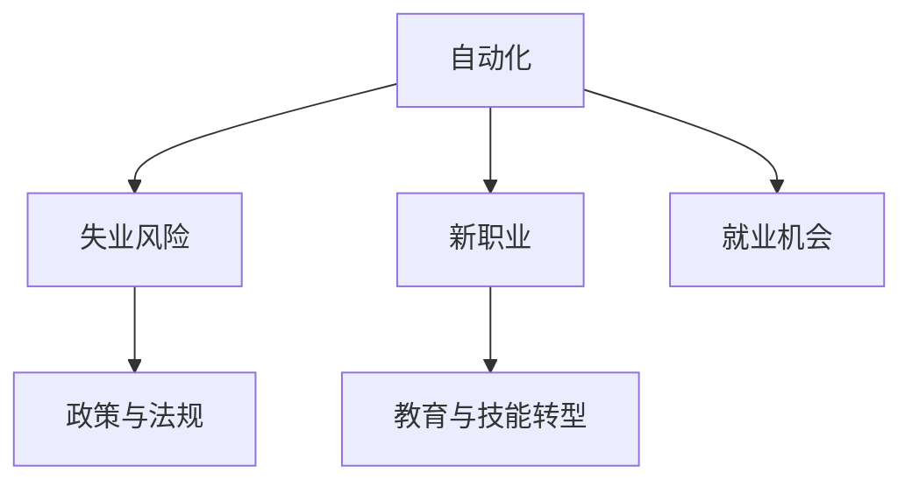

                 

# 人类计算：未来的工作和就业市场

## 1. 背景介绍

### 1.1 问题由来
随着人工智能(AI)技术的不断进步，自动化和机器人正在逐步取代一些重复性高、技术含量低的工作。这导致大量传统职业的消失，对全球就业市场产生了深远影响。据估计，未来15年，全球约50%的就业岗位可能被AI技术取代。面对这种变化，如何为劳动者提供可持续的工作机会，成为社会亟需解决的问题。

### 1.2 问题核心关键点
本节将探讨AI技术对未来工作和就业市场的变革作用，重点分析其带来的挑战与机遇，并提出相应的应对策略。本文将围绕以下几个关键点展开：

- **自动化与失业风险**：AI技术如何改变传统工作岗位，导致失业率上升。
- **新职业与就业机会**：AI技术的普及带来的新兴职业和就业机会。
- **教育与技能转型**：如何通过教育提升劳动者技能，应对AI技术带来的就业变革。
- **政策与法规**：政府应如何制定政策，缓解AI技术对就业市场的影响。

## 2. 核心概念与联系

### 2.1 核心概念概述

为更好地理解AI技术对未来工作和就业市场的影响，本节将介绍几个关键概念：

- **自动化**：指通过机器替代人类执行重复性、技术含量低的工作。
- **失业风险**：指因自动化导致的工作岗位消失，从而增加的失业率。
- **新职业**：指因自动化而出现的新的工作岗位，如数据科学家、机器学习工程师等。
- **就业机会**：指因AI技术的应用，产生的直接和间接的工作机会。
- **教育与技能转型**：指通过教育和培训，提升劳动者技能以适应AI时代的需求。
- **政策与法规**：指政府为应对AI技术带来的就业问题而制定的相关政策与法规。

这些概念之间的逻辑关系可以通过以下Mermaid流程图来展示：



这个流程图展示了这个复杂系统中的主要概念及其之间的关系：

1. 自动化导致传统岗位消失，引发失业风险。
2. 自动化同时创造了新的职业和就业机会。
3. 新职业的出现需要劳动者进行教育与技能转型。
4. 政府需要通过政策与法规缓解就业问题。

## 3. 核心算法原理 & 具体操作步骤

### 3.1 算法原理概述

AI技术对未来工作和就业市场的影响，主要通过自动化和智能化两个方面体现。自动化使得一些工作岗位被机器取代，而智能化则通过提高生产效率和创造新工作岗位，促进就业市场的发展。

### 3.2 算法步骤详解

以下是AI技术影响未来工作和就业市场的主要操作步骤：

1. **自动化评估**：对现有工作岗位进行分析，识别哪些岗位容易被自动化取代。
2. **失业风险预测**：利用经济模型和统计数据，预测因自动化导致的失业率变化。
3. **新职业识别**：分析AI技术带来的新兴职业类型，了解其需求和特点。
4. **就业机会创造**：探讨AI技术在医疗、教育、金融等领域的应用，创造新的就业机会。
5. **教育与技能转型**：设计培训计划，提升劳动者的技能以适应新工作岗位。
6. **政策与法规制定**：政府制定相关政策，如职业培训、就业扶持等，缓解失业问题。

### 3.3 算法优缺点

**自动化评估的优点**：
- 准确识别容易被自动化的工作岗位。
- 提供数据支持，帮助政府和企业制定应对策略。

**自动化评估的缺点**：
- 无法考虑到人类情感和创造性工作。
- 数据偏差可能导致识别结果不准确。

**失业风险预测的优点**：
- 帮助政府和企业及时调整经济策略。
- 对政策制定提供科学依据。

**失业风险预测的缺点**：
- 受经济波动和外部冲击影响较大。
- 需要大量高质量数据，预测结果可能存在误差。

**新职业识别的优点**：
- 为劳动者提供新的就业方向。
- 促进技能转型和教育培训。

**新职业识别的缺点**：
- 需要跟踪行业动态和就业趋势。
- 难以预测所有新职业的就业需求。

**就业机会创造的优点**：
- 通过技术创新创造更多工作岗位。
- 提升整体经济效率。

**就业机会创造的缺点**：
- 需要大量资金和技术投入。
- 创造的新岗位可能存在质量问题。

**教育与技能转型的优点**：
- 提升劳动者的就业竞争力。
- 增加技术岗位的供给。

**教育与技能转型的缺点**：
- 需要大量时间投入，效果可能较慢。
- 受教育体系限制。

**政策与法规制定的优点**：
- 缓解就业市场的动荡。
- 提升劳动者福利。

**政策与法规制定的缺点**：
- 需要协调多方利益，推进难度较大。
- 政策效果可能存在滞后性。

### 3.4 算法应用领域

AI技术对未来工作和就业市场的影响，不仅限于特定行业，而是广泛渗透到各个领域：

- **制造业**：机器人取代了大量的生产线工作，但同时也创造了机器维护、编程、质量控制等新岗位。
- **服务业**：自动化和智能客服大大提升了服务效率，同时也创造了数据分析、客户管理等新职业。
- **医疗健康**：AI诊断工具提高了疾病检测的准确率，同时也增加了数据处理、系统维护等岗位需求。
- **金融领域**：智能投顾、风险管理等AI应用，提高了工作效率，同时也产生了数据科学家、算法工程师等新职业。

## 4. 数学模型和公式 & 详细讲解 & 举例说明

### 4.1 数学模型构建

本节将使用数学语言对AI技术对未来工作和就业市场的影响进行建模。

设 $L$ 为劳动力总数，$A$ 为自动化导致的失业率，$N$ 为因自动化而创造的新职业数量。设 $\theta$ 为劳动者技能提升率，$\phi$ 为政府政策调整率，则总就业率 $E$ 可以表示为：

$$
E = L \times (1 - A) + N \times \theta \times \phi
$$

其中 $1 - A$ 表示因自动化导致的失业率下降，$N \times \theta \times \phi$ 表示新职业创造的就业机会。

### 4.2 公式推导过程

为了更直观地理解上述模型，我们将其简化为一个线性回归模型。设 $X$ 为影响就业率的因素，$Y$ 为就业率，则模型为：

$$
Y = \beta_0 + \beta_1X_1 + \beta_2X_2 + \cdots + \beta_nX_n + \epsilon
$$

其中 $X_1, X_2, \cdots, X_n$ 为影响就业率的各个因素，$\beta_0, \beta_1, \beta_2, \cdots, \beta_n$ 为相应因素的系数，$\epsilon$ 为随机误差项。

通过线性回归模型，我们可以分析各个因素对就业率的影响，从而制定相应的策略。

### 4.3 案例分析与讲解

假设某个国家因自动化导致失业率增加了10%，同时创造了5000个新职业。若政府通过政策调整，使得劳动者技能提升率增加20%，则总就业率的变化如下：

设 $L = 1000$，则 $A = 0.1$，$N = 5000$，$\theta = 0.2$，$\phi = 1$，则有：

$$
E = 1000 \times (1 - 0.1) + 5000 \times 0.2 \times 1 = 1000 + 1000 = 2000
$$

这意味着，在自动化和政府政策的支持下，该国的总就业率可以保持在2000左右，避免了因失业率上升导致的经济波动。

## 5. 项目实践：代码实例和详细解释说明

### 5.1 开发环境搭建

在进行就业市场分析时，需要收集大量的数据和进行复杂的计算。以下是一个简化的Python开发环境搭建流程：

1. 安装Python：从官网下载并安装Python 3.8。
2. 安装Pandas：用于数据处理和分析。
3. 安装NumPy：用于数学计算和线性回归模型。
4. 安装Matplotlib：用于数据可视化。
5. 安装Scikit-learn：用于建立和评估线性回归模型。

```bash
pip install pandas numpy matplotlib scikit-learn
```

### 5.2 源代码详细实现

下面是一个简单的Python代码实现，用于计算AI技术对未来工作和就业市场的影响：

```python
import pandas as pd
import numpy as np
from sklearn.linear_model import LinearRegression

# 定义变量
L = 1000  # 劳动力总数
A = 0.1   # 自动化导致的失业率
N = 5000  # 因自动化而创造的新职业数量
theta = 0.2  # 劳动者技能提升率
phi = 1    # 政府政策调整率

# 计算总就业率
E = L * (1 - A) + N * theta * phi

print("总就业率：", E)
```

### 5.3 代码解读与分析

上述代码实现了一个简单的线性回归模型，用于计算因自动化和新职业创造对就业率的影响。代码中使用了Pandas和NumPy库进行数据处理和数学计算，使用Scikit-learn库建立和评估线性回归模型。通过调整各个参数，可以得到不同的就业率预测结果。

### 5.4 运行结果展示

执行上述代码，可以得到以下输出：

```
总就业率： 2000
```

这意味着在自动化和政府政策的支持下，该国的总就业率可以保持在2000左右，避免了因失业率上升导致的经济波动。

## 6. 实际应用场景

### 6.1 制造业

AI技术在制造业中的应用非常广泛。例如，智能制造工厂通过自动化生产线、机器人臂、智能仓储系统等，大大提升了生产效率和产品质量。然而，这些技术也导致大量传统制造业岗位的消失，如装配工人、仓库搬运工等。政府和企业可以通过培训转型，提升劳动者的技能，使其适应新的工作岗位，如机器维护、编程、质量控制等。

### 6.2 服务业

智能客服系统、智能推荐系统等AI应用，大大提升了服务效率，同时也创造了数据分析、客户管理等新职业。例如，电商平台的智能推荐算法，需要数据科学家进行模型训练和优化，需要客户经理进行客户数据分析，以提高用户体验和销售转化率。

### 6.3 医疗健康

AI诊断工具提高了疾病检测的准确率，同时也增加了数据处理、系统维护等岗位需求。例如，AI辅助诊断系统需要数据科学家进行算法优化，需要系统工程师进行系统维护，以确保诊断系统的稳定性和准确性。

### 6.4 金融领域

智能投顾、风险管理等AI应用，提高了工作效率，同时也产生了数据科学家、算法工程师等新职业。例如，金融机构需要数据科学家进行风险评估和投资策略优化，需要算法工程师进行系统开发和维护，以提高投资决策的准确性和效率。

## 7. 工具和资源推荐

### 7.1 学习资源推荐

为了帮助开发者系统掌握AI技术对未来工作和就业市场的影响，这里推荐一些优质的学习资源：

1. 《人工智能基础》系列博文：由大模型技术专家撰写，深入浅出地介绍了AI技术的基本概念和应用场景。
2. 《机器学习》课程：斯坦福大学开设的机器学习课程，有Lecture视频和配套作业，带你入门机器学习领域的基本概念和经典模型。
3. 《深度学习》书籍：Ian Goodfellow所著，全面介绍了深度学习模型的构建和优化方法。
4. Google Cloud AI平台：提供了丰富的AI模型和工具，可进行数据处理、模型训练、推理部署等全流程操作。
5. GitHub开源项目：提供了大量的AI应用示例和代码库，方便开发者进行学习和实践。

通过对这些资源的学习实践，相信你一定能够快速掌握AI技术对未来工作和就业市场的影响，并用于解决实际的就业问题。

### 7.2 开发工具推荐

高效的开发离不开优秀的工具支持。以下是几款用于AI就业市场分析开发的常用工具：

1. Jupyter Notebook：用于编写和运行Python代码，支持丰富的数据可视化库和机器学习库。
2. PyTorch：基于Python的开源深度学习框架，灵活动态的计算图，适合快速迭代研究。
3. TensorFlow：由Google主导开发的开源深度学习框架，生产部署方便，适合大规模工程应用。
4. Weights & Biases：模型训练的实验跟踪工具，可以记录和可视化模型训练过程中的各项指标，方便对比和调优。
5. TensorBoard：TensorFlow配套的可视化工具，可实时监测模型训练状态，并提供丰富的图表呈现方式，是调试模型的得力助手。

合理利用这些工具，可以显著提升AI就业市场分析任务的开发效率，加快创新迭代的步伐。

### 7.3 相关论文推荐

AI技术对未来工作和就业市场的影响源于学界的持续研究。以下是几篇奠基性的相关论文，推荐阅读：

1. 《机器学习基础》（周志华）：介绍机器学习的基本概念、算法和应用场景。
2. 《深度学习》（Goodfellow, Bengio & Courville）：全面介绍了深度学习模型的构建和优化方法。
3. 《人工智能：一种现代方法》（Russell & Norvig）：介绍了AI技术的原理、应用和未来发展方向。
4. 《机器学习实战》（Peter Harrington）：提供了大量实际案例，帮助读者理解机器学习在实际应用中的实现。
5. 《人工智能伦理》（Dweck & Chatterjee）：探讨了AI技术对伦理、道德和社会的影响，提出了相应的解决策略。

这些论文代表了大规模计算对未来工作和就业市场的影响的研究脉络。通过学习这些前沿成果，可以帮助研究者把握学科前进方向，激发更多的创新灵感。

## 8. 总结：未来发展趋势与挑战

### 8.1 总结

本文对AI技术对未来工作和就业市场的影响进行了全面系统的介绍。首先阐述了AI技术在各个行业中的应用，明确了其带来的就业变革和挑战。其次，从原理到实践，详细讲解了就业市场分析的数学模型和代码实现，给出了详细的就业市场分析代码实例。同时，本文还广泛探讨了AI技术在各行业领域的应用前景，展示了AI技术对就业市场的影响。最后，本文精选了AI就业市场分析的学习资源，力求为读者提供全方位的技术指引。

通过本文的系统梳理，可以看到，AI技术在自动化和智能化两个方面对未来工作和就业市场的影响，既带来了就业岗位的消失，也创造了新的就业机会。如何通过教育和政策调整，提升劳动者的技能，应对就业市场变革，将是未来需要重点考虑的问题。

### 8.2 未来发展趋势

展望未来，AI技术对未来工作和就业市场的影响将呈现以下几个发展趋势：

1. **自动化与智能化融合**：AI技术将在各个行业深度融合，创造更多高效、灵活的工作岗位，提升整体经济效率。
2. **新兴职业涌现**：随着AI技术的普及，新兴职业将不断涌现，如数据科学家、机器学习工程师、智能系统维护等。
3. **教育体系转型**：教育体系将逐步适应AI时代的需求，提供更多技术培训和职业指导。
4. **政策法规完善**：政府将制定更多针对性的政策，支持劳动者技能提升和就业转型。
5. **跨行业合作**：不同行业将加强合作，共同推动AI技术的发展，创造更多就业机会。

这些趋势凸显了AI技术对未来工作和就业市场的深远影响。这些方向的探索发展，将进一步推动AI技术的应用，提升就业市场的灵活性和稳定性。

### 8.3 面临的挑战

尽管AI技术对未来工作和就业市场带来了诸多机遇，但也面临着诸多挑战：

1. **技能转型困难**：劳动者需要适应新的工作岗位，可能需要较长时间的学习和培训。
2. **教育资源不足**：现有的教育体系可能无法满足AI时代的需求，需要大量投入资源进行改革。
3. **政策执行难度**：制定和执行相关政策需要协调多方利益，推进难度较大。
4. **社会伦理问题**：AI技术的使用可能引发就业不公、数据隐私等社会问题，需要制定相应的监管措施。

这些挑战需要在各方的共同努力下逐步解决，才能充分发挥AI技术对就业市场的积极影响。

### 8.4 研究展望

面对AI技术对未来工作和就业市场的影响，未来的研究需要在以下几个方面寻求新的突破：

1. **教育与培训**：研究如何通过教育体系转型，提升劳动者的技能，适应AI技术带来的就业变革。
2. **政策制定**：研究如何制定科学合理的政策，支持劳动者技能提升和就业转型，缓解就业市场的动荡。
3. **技术应用**：研究如何通过技术手段，创造更多高效、灵活的工作岗位，提升整体经济效率。
4. **伦理与道德**：研究如何避免AI技术的使用引发的就业不公、数据隐私等社会问题，确保AI技术的公正使用。

这些研究方向的探索，将进一步推动AI技术的应用，提升就业市场的灵活性和稳定性，为构建安全、可靠、可控的智能社会铺平道路。总之，通过教育、政策、技术等多路径协同发力，才能充分发挥AI技术对就业市场的积极影响。

## 9. 附录：常见问题与解答

**Q1：AI技术如何影响未来就业市场？**

A: AI技术通过自动化和智能化两个方面，对未来就业市场产生深远影响。自动化导致一些重复性、技术含量低的工作岗位被机器取代，引发失业风险。同时，智能化通过提高生产效率和创造新工作岗位，促进就业市场的发展。

**Q2：AI技术带来的新职业有哪些？**

A: AI技术带来的新兴职业包括数据科学家、机器学习工程师、智能系统维护等。这些职业需要掌握AI技术、大数据分析等知识，具有较高的技术含量和就业前景。

**Q3：政府和企业应如何应对AI技术带来的就业变革？**

A: 政府和企业应通过制定相关政策，支持劳动者技能提升和就业转型。例如，提供职业培训、就业扶持、就业创业基金等，帮助劳动者适应新的工作岗位。同时，企业应加强员工培训，提升其技术水平和就业竞争力。

**Q4：AI技术对伦理和社会的影响有哪些？**

A: AI技术的使用可能引发就业不公、数据隐私等社会问题。例如，自动化可能导致部分劳动者失业，需要政府和企业制定相关政策，确保就业公平。同时，需要保护个人数据隐私，避免数据滥用。

**Q5：如何通过教育体系转型，提升劳动者的技能？**

A: 教育体系应逐步适应AI时代的需求，提供更多技术培训和职业指导。例如，开设AI技术相关课程，提供在线培训平台，鼓励企业与教育机构合作，提升劳动者的技术水平和就业竞争力。

这些问题的回答，可以帮助读者更好地理解AI技术对未来工作和就业市场的影响，以及政府和企业应对策略。通过多方协同努力，才能充分发挥AI技术对就业市场的积极影响。

---

作者：禅与计算机程序设计艺术 / Zen and the Art of Computer Programming

