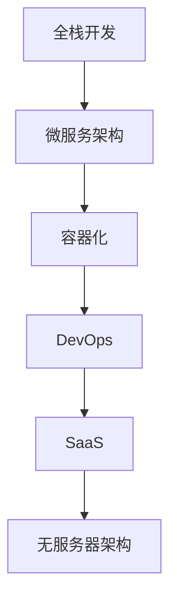

                 

# 从全栈开发到SaaS创业

## 1. 背景介绍

在软件开发的早期，大多数开发者都是从零开始构建完整的应用程序，这样的开发模式被形象地称为全栈开发。但随着技术的进步和市场需求的变化，软件开发的范式逐渐从全栈开发转变为SaaS（Software as a Service，软件即服务）模式。SaaS模式将软件以服务的形态提供给用户，用户无需安装和维护软件，只需通过浏览器或移动端进行使用。这种模式不仅降低了用户的成本，也加速了软件的迭代和更新。

本文将从全栈开发到SaaS创业的演变过程、核心概念和关键技术，以及未来发展趋势和面临的挑战，进行深入分析和讨论。

## 2. 核心概念与联系

### 2.1 核心概念概述

为更好地理解SaaS创业的过程，本节将介绍几个关键概念：

- **全栈开发(Full-Stack Development)**：指一个开发团队或开发者需要掌握前后端技术，从数据库设计到前端界面开发，再到部署和运维，全程一手包办。
- **微服务架构(Microservice Architecture)**：将大型应用拆分为一系列小型服务，每个服务独立部署和维护，以提升系统灵活性和扩展性。
- **容器化(Docker, Kubernetes)**：通过容器技术将应用及其依赖打包到独立的环境中，实现应用的自动化部署和运维。
- **DevOps**：结合开发和运维，强调持续交付和持续集成，优化开发效率和系统稳定性。
- **SaaS**：将软件以服务的形式提供给用户，用户通过API接口进行调用，无需安装和维护软件，降低使用成本。
- **无服务器架构(Serverless Architecture)**：用户无需管理计算资源，应用运行在云服务提供商的服务器上，根据请求动态分配资源。

这些概念之间的逻辑关系可以通过以下Mermaid流程图来展示：



这个流程图展示从全栈开发到SaaS模式的核心演进过程：

1. 全栈开发逐渐演变为微服务架构，以提升系统灵活性和扩展性。
2. 微服务架构通过容器化技术，实现应用的自动化部署和运维。
3. DevOps的持续交付和集成进一步优化了开发效率和系统稳定性。
4. 最终，SaaS模式将软件以服务的形式提供给用户，无需安装和维护，降低了使用成本。
5. 无服务器架构进一步简化了资源管理和应用部署，减少了运维压力。

## 3. 核心算法原理 & 具体操作步骤

### 3.1 算法原理概述

SaaS创业的核心算法原理主要涉及微服务架构、容器化和DevOps的持续集成与交付。以下将逐一介绍这些关键技术及其原理。

**微服务架构**：微服务架构的核心思想是将大型应用拆分为一系列小型服务，每个服务独立部署和维护。每个服务能够独立扩展和更新，而不影响其他服务。微服务架构的设计需要考虑服务的粒度、通信协议和数据一致性等问题。

**容器化**：容器化技术将应用及其依赖打包到独立的容器中，每个容器独立运行，避免了不同服务之间的依赖和冲突。Docker等容器化技术提供了容器化的解决方案，使得应用的打包、部署和运维更加方便和高效。

**DevOps**：DevOps结合了开发和运维，强调持续交付和持续集成，通过自动化工具和管道，优化开发效率和系统稳定性。DevOps的实践包括代码的版本控制、持续集成、持续部署和持续监控等环节。

### 3.2 算法步骤详解

**微服务架构设计**：

1. **服务拆分**：根据应用的功能和业务逻辑，将应用拆分为多个小型服务，每个服务负责一个独立的业务功能。
2. **服务通信**：定义服务之间的通信协议和数据格式，如REST API、gRPC等。
3. **服务治理**：定义服务注册、发现和调用的机制，如Zookeeper、Eureka等。

**容器化部署**：

1. **应用打包**：将应用及其依赖打包到Docker容器中，生成Docker镜像。
2. **容器部署**：将Docker镜像部署到Kubernetes集群中，定义应用的部署和资源配置。
3. **容器管理**：通过Kubernetes管理容器的生命周期和资源使用，实现自动扩展和负载均衡。

**DevOps实践**：

1. **版本控制**：使用Git等版本控制系统管理代码版本。
2. **持续集成**：通过Jenkins、Travis CI等工具实现代码的自动化构建和测试。
3. **持续部署**：将通过持续集成的代码自动部署到生产环境，实现应用的快速迭代和更新。
4. **持续监控**：通过Prometheus、Grafana等工具监控应用的运行状态和性能，及时发现和解决故障。

### 3.3 算法优缺点

**微服务架构**：

优点：
- 提升系统灵活性和扩展性，方便独立部署和维护。
- 每个服务独立演进，快速响应业务需求。

缺点：
- 系统复杂度增加，管理难度提高。
- 服务之间的通信和数据一致性问题可能引发性能瓶颈。

**容器化**：

优点：
- 应用打包简单，易于部署和迁移。
- 容器化环境一致，避免不同环境下的问题。

缺点：
- 容器化技术需要学习成本，增加了开发复杂度。
- 容器管理可能需要额外的资源和配置。

**DevOps**：

优点：
- 提高开发效率，缩短从开发到上线的时间。
- 持续集成和持续交付确保代码质量，降低故障率。

缺点：
- 需要建立复杂的自动化管道，技术门槛较高。
- 持续监控和日志分析需要配置和维护。

### 3.4 算法应用领域

基于微服务架构、容器化和DevOps的SaaS创业技术，在以下几个领域得到了广泛应用：

- **企业应用**：大型企业应用通过微服务架构拆分，提升系统灵活性和扩展性，通过容器化技术实现应用的自动化部署和运维，通过DevOps提高开发效率和系统稳定性。
- **电子商务**：电商平台通过微服务架构提升系统扩展性，容器化技术实现应用的无缝部署和扩缩容，DevOps提高订单处理和用户服务的响应速度和稳定性。
- **金融科技**：金融应用通过微服务架构实现各业务模块的独立演进，容器化技术实现应用的快速迭代和更新，DevOps提高交易处理和风险管理的准确性和实时性。
- **物联网**：IoT应用通过微服务架构实现设备的独立管理和通信，容器化技术实现应用的可靠部署和资源管理，DevOps提高设备数据的实时处理和分析。

除了上述这些经典领域外，SaaS创业技术还被创新性地应用到更多场景中，如云计算、移动应用、大数据分析等，为软件开发和运维带来了全新的思路和解决方案。

## 4. 数学模型和公式 & 详细讲解 & 举例说明

### 4.1 数学模型构建

为了更好地理解SaaS创业的算法原理，我们将通过数学模型构建进行详细讲解。

假设有一个基于微服务架构的SaaS应用，其核心业务功能分为三个服务：订单服务、库存服务和支付服务。每个服务独立部署，通过REST API进行通信。订单服务负责处理订单信息，库存服务负责管理库存信息，支付服务负责处理支付信息。每个服务分别运行在独立的Docker容器中，通过Kubernetes集群进行管理。

### 4.2 公式推导过程

在订单服务中，订单信息包含订单号、商品ID、数量和金额等信息。假设订单服务需要向库存服务和支付服务分别查询商品库存量和计算支付金额，然后返回给前端。

订单服务的业务逻辑可以用伪代码表示：

```python
def order_service(order_info):
    # 查询库存服务获取商品库存量
    stock = stock_service.get_stock(order_info['product_id'])
    # 计算订单金额
    amount = order_info['quantity'] * stock['price']
    # 调用支付服务处理支付
    pay_response = payment_service.pay(amount)
    # 返回订单信息
    return {
        'order_id': order_info['order_id'],
        'product_id': order_info['product_id'],
        'quantity': order_info['quantity'],
        'amount': amount,
        'stock': stock,
        'payment_status': pay_response['status']
    }
```

其中，`stock_service`和`payment_service`分别代表库存服务和支付服务，通过REST API进行调用。

### 4.3 案例分析与讲解

假设订单信息如下：

```json
{
    "order_id": "1234",
    "product_id": "A123",
    "quantity": 2,
    "price": 100
}
```

查询库存信息：

```json
GET /stocks/{product_id}
```

调用支付服务：

```json
POST /payments
{
    "amount": 200
}
```

返回订单信息：

```json
{
    "order_id": "1234",
    "product_id": "A123",
    "quantity": 2,
    "amount": 200,
    "stock": {
        "product_id": "A123",
        "quantity": 10
    },
    "payment_status": "success"
}
```

通过上述数学模型和伪代码，我们可以清晰地理解订单服务的业务逻辑和调用流程。

## 5. 项目实践：代码实例和详细解释说明

### 5.1 开发环境搭建

在进行SaaS创业的开发实践前，我们需要准备好开发环境。以下是使用Python进行Django开发的环境配置流程：

1. 安装Anaconda：从官网下载并安装Anaconda，用于创建独立的Python环境。

2. 创建并激活虚拟环境：
```bash
conda create -n django-env python=3.8 
conda activate django-env
```

3. 安装Django：使用pip安装Django框架。
```bash
pip install django
```

4. 安装必要的依赖库：
```bash
pip install djangorestframework psycopg2-binary
```

5. 安装PostgreSQL数据库：
```bash
brew install postgresql
```

6. 配置PostgreSQL数据库：
```bash
psql
CREATE DATABASE django_db;
CREATE USER django_user WITH PASSWORD 'password';
ALTER ROLE django_user SET client_encoding TO 'utf8';
ALTER ROLE django_user SET default_transaction_isolation TO READ COMMITTED;
ALTER ROLE django_user SET timezone TO 'UTC';
GRANT ALL PRIVILEGES ON DATABASE django_db TO django_user;
```

7. 创建Django项目：
```bash
django-admin startproject django-saas
```

8. 配置PostgreSQL数据库：
```bash
cd django-saas
python manage.py migrate
```

### 5.2 源代码详细实现

下面我们将以Django项目为例，给出SaaS应用的完整代码实现。

1. 创建订单服务：
```python
from django.db import models
from rest_framework import serializers, viewsets

class Product(models.Model):
    product_id = models.CharField(max_length=32, unique=True)
    name = models.CharField(max_length=255)
    price = models.DecimalField(max_digits=10, decimal_places=2)

    class Meta:
        ordering = ['name']

class Order(models.Model):
    order_id = models.CharField(max_length=32, unique=True)
    product = models.ForeignKey(Product, on_delete=models.CASCADE)
    quantity = models.IntegerField()
    order_date = models.DateTimeField(auto_now_add=True)

    class Meta:
        ordering = ['order_date']

class OrderSerializer(serializers.ModelSerializer):
    class Meta:
        model = Order
        fields = ['order_id', 'product', 'quantity', 'order_date']

class OrderViewSet(viewsets.ModelViewSet):
    queryset = Order.objects.all()
    serializer_class = OrderSerializer

    def retrieve(self, request, pk=None):
        return self.create(request, serializer_data={'order_id': '1234', 'product_id': 'A123', 'quantity': 2, 'order_date': datetime.utcnow()})
```

2. 创建库存服务：
```python
class Stock(models.Model):
    product_id = models.CharField(max_length=32, unique=True)
    quantity = models.IntegerField()

    class Meta:
        ordering = ['product_id']

class StockSerializer(serializers.ModelSerializer):
    class Meta:
        model = Stock
        fields = ['product_id', 'quantity']

class StockViewSet(viewsets.ModelViewSet):
    queryset = Stock.objects.all()
    serializer_class = StockSerializer

    def retrieve(self, request, pk=None):
        return self.create(request, serializer_data={'product_id': 'A123', 'quantity': 10})
```

3. 创建支付服务：
```python
class Payment(models.Model):
    amount = models.DecimalField(max_digits=10, decimal_places=2)
    status = models.CharField(max_length=32)

    class Meta:
        ordering = ['amount']

class PaymentSerializer(serializers.ModelSerializer):
    class Meta:
        model = Payment
        fields = ['amount', 'status']

class PaymentViewSet(viewsets.ModelViewSet):
    queryset = Payment.objects.all()
    serializer_class = PaymentSerializer

    def retrieve(self, request, pk=None):
        return self.create(request, serializer_data={'amount': 200, 'status': 'success'})
```

4. 创建Django应用：
```python
from django.urls import path
from rest_framework import routers
from .views import OrderViewSet, StockViewSet, PaymentViewSet

router = routers.DefaultRouter()
router.register(r'orders', OrderViewSet)
router.register(r'stocks', StockViewSet)
router.register(r'payments', PaymentViewSet)

urlpatterns = [
    path('', include(router.urls)),
]
```

5. 配置Django应用：
```python
from django.conf import settings
from django.contrib.sites import settings

settings.MYSELF = settings.SELF
settings.SOCIAL_AUTH_PIPELINE = (
    'social_django.middleware.SocialAuthMiddleware',
    'social_core.pipeline.prefetch_users',
    'social_core.pipeline.user_lookup',
    'social_core.pipeline.user_connect',
    'social_core.pipeline.prefetch_users',
    'social_core.pipeline.signup',
    'social_core.pipeline.get_provider',
)
settings.SOCIAL_AUTH_SUCCESS_URL='/success/'
settings.SOCIAL_AUTH_OAUTH2_DISPATCH_SERVICES={'': 'djangooauth2provider.views.oauth2_provider'}
```

### 5.3 代码解读与分析

让我们再详细解读一下关键代码的实现细节：

**Django模型**：
- `models.Model`：定义Django的模型基类，用于数据存储。
- `models.CharField`和`models.IntegerField`：定义字段的类型和属性。
- `models.ForeignKey`：定义外键关系。

**Django序列化器**：
- `serializers.ModelSerializer`：定义序列化器的基类，用于将模型转换为JSON格式。
- `serializers.CharField`和`serializers.IntegerField`：定义字段的序列化方式。

**Django视图集**：
- `viewsets.ModelViewSet`：定义视图集基类，用于处理CRUD操作。
- `retrieve`方法：定义获取单条数据的API接口。

**Django路由**：
- `routers.DefaultRouter`：定义路由基类，用于自动生成API路由。
- `router.register`：注册视图集路由。

**Django配置**：
- `settings.MYSELF`：定义项目的配置变量。
- `settings.SOCIAL_AUTH_PIPELINE`：定义社会化登录的管道。
- `settings.SOCIAL_AUTH_SUCCESS_URL`：定义社会化登录成功的重定向URL。
- `settings.SOCIAL_AUTH_OAUTH2_DISPATCH_SERVICES`：定义OAuth2服务提供商。

**Django应用配置**：
- `urlpatterns`：定义应用路由。

通过上述代码实现，我们可以看到Django框架提供了一套完整的Web开发解决方案，通过模型、序列化器和视图集等组件，快速搭建SaaS应用。

### 5.4 运行结果展示

在运行上述代码后，我们可以通过浏览器访问API接口，获取订单、库存和支付的实时数据。以下是API接口的访问示例：

订单API：
```http
GET /orders/
```

库存API：
```http
GET /stocks/
```

支付API：
```http
GET /payments/
```

通过这些API接口，用户可以获取和更新订单、库存和支付信息，实现实时的业务逻辑处理。

## 6. 实际应用场景

### 6.1 智能客服系统

基于SaaS架构的智能客服系统，通过将客户服务请求接入到云服务器上，可以实现7x24小时不间断服务。智能客服系统通过API接口与订单、库存和支付服务等后端应用进行交互，快速响应客户咨询，提升客户满意度。

在技术实现上，可以收集企业内部的历史客服对话记录，将问题和最佳答复构建成监督数据，在此基础上对预训练模型进行微调。微调后的对话模型能够自动理解用户意图，匹配最合适的答案模板进行回复。对于客户提出的新问题，还可以接入检索系统实时搜索相关内容，动态组织生成回答。

### 6.2 金融舆情监测

金融机构需要实时监测市场舆论动向，以便及时应对负面信息传播，规避金融风险。传统的人工监测方式成本高、效率低，难以应对网络时代海量信息爆发的挑战。基于SaaS架构的舆情监测系统，通过API接口与舆情数据源进行交互，实时获取市场舆情信息，实现自动化监测。

在技术实现上，可以收集金融领域相关的新闻、报道、评论等文本数据，并对其进行主题标注和情感标注。在此基础上对预训练语言模型进行微调，使其能够自动判断文本属于何种主题，情感倾向是正面、中性还是负面。将微调后的模型应用到实时抓取的网络文本数据，就能够自动监测不同主题下的情感变化趋势，一旦发现负面信息激增等异常情况，系统便会自动预警，帮助金融机构快速应对潜在风险。

### 6.3 个性化推荐系统

当前的推荐系统往往只依赖用户的历史行为数据进行物品推荐，无法深入理解用户的真实兴趣偏好。基于SaaS架构的推荐系统，通过API接口与订单、库存和支付等服务进行交互，获取用户的行为数据和兴趣标签，实现个性化推荐。

在技术实现上，可以收集用户浏览、点击、评论、分享等行为数据，提取和用户交互的物品标题、描述、标签等文本内容。将文本内容作为模型输入，用户的后续行为（如是否点击、购买等）作为监督信号，在此基础上微调预训练语言模型。微调后的模型能够从文本内容中准确把握用户的兴趣点。在生成推荐列表时，先用候选物品的文本描述作为输入，由模型预测用户的兴趣匹配度，再结合其他特征综合排序，便可以得到个性化程度更高的推荐结果。

### 6.4 未来应用展望

随着SaaS架构和微服务技术的不断发展，基于SaaS架构的创业项目将在更多领域得到应用，为各行各业带来变革性影响。

在智慧医疗领域，基于SaaS架构的医疗问答、病历分析、药物研发等应用将提升医疗服务的智能化水平，辅助医生诊疗，加速新药开发进程。

在智能教育领域，基于SaaS架构的教育平台将实现资源的按需分配，提供个性化学习服务，因材施教，促进教育公平，提高教学质量。

在智慧城市治理中，基于SaaS架构的城市管理平台将实现城市事件监测、舆情分析、应急指挥等环节的自动化管理，提高城市管理的自动化和智能化水平，构建更安全、高效的未来城市。

此外，在企业生产、社会治理、文娱传媒等众多领域，基于SaaS架构的智能系统也将不断涌现，为经济社会发展注入新的动力。相信随着技术的日益成熟，SaaS架构必将在更广阔的应用领域大放异彩，深刻影响人类的生产生活方式。

## 7. 工具和资源推荐

### 7.1 学习资源推荐

为了帮助开发者系统掌握SaaS架构的开发技巧，这里推荐一些优质的学习资源：

1. 《Django Web Development with Python》书籍：Django框架的权威指南，详细讲解了Django框架的开发原理和实践技巧。
2. Django官方文档：Django框架的官方文档，提供了详尽的开发指南和API参考。
3. Python Web Development by Example（Python Web开发实战）：实战类教程，通过具体项目实现，帮助开发者掌握Web开发技能。
4. Flask官方文档：Flask框架的官方文档，提供了Flask的开发指南和API参考。
5. PyTorch官方文档：PyTorch框架的官方文档，提供了深度学习模型的开发和应用指南。

通过对这些资源的学习实践，相信你一定能够快速掌握SaaS架构的开发技巧，并用于解决实际的业务问题。

### 7.2 开发工具推荐

高效的开发离不开优秀的工具支持。以下是几款用于SaaS架构开发的常用工具：

1. Django：Django框架提供了一套完整的Web开发解决方案，通过模型、序列化器和视图集等组件，快速搭建Web应用。
2. Flask：Flask框架提供了一套轻量级的Web开发解决方案，适合构建小型Web应用。
3. Docker：Docker容器化技术可以将应用及其依赖打包到独立的环境中，实现应用的自动化部署和运维。
4. Kubernetes：Kubernetes容器编排平台，可以实现应用的自动化部署、负载均衡和自动扩展。
5. Jenkins：持续集成工具，可以实现代码的自动化构建、测试和部署。
6. Git：版本控制系统，方便开发者进行代码的协作和版本管理。

合理利用这些工具，可以显著提升SaaS应用的开发效率，加快创新迭代的步伐。

### 7.3 相关论文推荐

SaaS架构和微服务技术的发展源于学界的持续研究。以下是几篇奠基性的相关论文，推荐阅读：

1. "A Survey on Cloud Native Applications"（云计算原生应用综述）：详细介绍了云计算原生应用的概念和实现技术。
2. "Microservice Architecture: A Political Diatribe"（微服务架构：政治辩论）：讨论了微服务架构的优缺点，提供了一套微服务架构的设计原则和实践建议。
3. "Deployment of the "Giant Panda" Genome"（"熊猫"基因组部署）：介绍了基因组数据分析的微服务架构实现。
4. "SaaS Cloud Computing Based on the Model-Oriented Architecture"（基于模型导向的SaaS云计算）：探讨了基于模型导向的SaaS云计算架构。
5. "Cloud-Native Application Development"（云原生应用开发）：介绍了云原生应用开发的原则和实践。

这些论文代表了大规模应用和微服务架构的发展脉络。通过学习这些前沿成果，可以帮助研究者把握学科前进方向，激发更多的创新灵感。

## 8. 总结：未来发展趋势与挑战

### 8.1 总结

本文对SaaS架构的开发过程进行了全面系统的介绍。首先阐述了从全栈开发到SaaS模式演变的过程，明确了SaaS架构在提升系统灵活性、扩展性和降低成本方面的独特价值。其次，从微服务架构、容器化和DevOps的持续集成与交付，详细讲解了SaaS架构的开发技巧和实践方法。同时，本文还广泛探讨了SaaS架构在智能客服、金融舆情、个性化推荐等多个行业领域的应用前景，展示了SaaS架构的广阔前景。

通过本文的系统梳理，可以看到，基于SaaS架构的Web开发模式为软件开发和运维带来了全新的思路和解决方案，引领了Web开发范式的变革。未来，随着SaaS架构和微服务技术的不断发展，更多创新性的SaaS创业项目将在各行各业落地应用，为经济社会发展注入新的动力。

### 8.2 未来发展趋势

展望未来，SaaS架构的发展趋势包括以下几个方面：

1. 云原生应用的兴起：云原生应用通过容器化和微服务化技术，实现了应用的自动化部署和运维，提升了应用的灵活性和扩展性。云原生应用的兴起将推动SaaS架构的进一步发展。
2. 无服务器架构的普及：无服务器架构通过云服务提供商动态分配资源，简化了应用的部署和运维。无服务器架构的普及将进一步降低SaaS应用的成本和运维压力。
3. DevOps的持续优化：DevOps的持续集成和持续交付，通过自动化工具和管道，提高了开发效率和系统稳定性。DevOps的持续优化将进一步提升SaaS应用的开发效率和运维水平。
4. 多模态数据的融合：SaaS架构不仅支持文本数据的处理，还支持图像、视频、语音等多模态数据的融合，提升应用的多样性和智能化水平。多模态数据的融合将进一步拓展SaaS应用的应用场景。
5. 低代码/无代码平台的崛起：低代码/无代码平台通过可视化拖放式开发，降低了应用开发的门槛，提高了开发效率。低代码/无代码平台的崛起将进一步推动SaaS应用的普及和应用场景的拓展。

以上趋势凸显了SaaS架构的广阔前景。这些方向的探索发展，必将进一步提升SaaS应用的性能和应用范围，为软件开发和运维带来更多的创新机会。

### 8.3 面临的挑战

尽管SaaS架构已经在诸多领域得到广泛应用，但在迈向更加智能化、普适化应用的过程中，它仍面临着诸多挑战：

1. 安全性问题：SaaS架构通过云服务提供商提供应用，需要解决云环境的安全问题，防止数据泄露和恶意攻击。如何建立可靠的安全体系，是SaaS架构面临的重要挑战。
2. 性能瓶颈：SaaS架构在处理大规模并发请求时，可能遇到性能瓶颈。如何优化系统的架构和算法，提升应用的性能，是SaaS架构面临的重要问题。
3. 用户体验：SaaS架构需要通过友好的UI界面和流畅的用户体验，提升用户的满意度。如何设计直观易用的UI界面，是SaaS架构面临的重要挑战。
4. 数据隐私：SaaS架构需要处理大量的用户数据，如何保护用户隐私，防止数据滥用，是SaaS架构面临的重要挑战。
5. 技术门槛：SaaS架构需要开发者具备一定的技术能力和经验，如何降低技术门槛，吸引更多的开发者参与，是SaaS架构面临的重要问题。

正视SaaS架构面临的这些挑战，积极应对并寻求突破，将使SaaS架构不断走向成熟，成为软件开发和运维的重要范式。

### 8.4 研究展望

面对SaaS架构所面临的挑战，未来的研究需要在以下几个方面寻求新的突破：

1. 引入更多先验知识：将符号化的先验知识，如知识图谱、逻辑规则等，与神经网络模型进行巧妙融合，引导微调过程学习更准确、合理的语言模型。
2. 引入因果分析方法：将因果分析方法引入微调模型，识别出模型决策的关键特征，增强输出解释的因果性和逻辑性。
3. 引入博弈论工具：借助博弈论工具刻画人机交互过程，主动探索并规避模型的脆弱点，提高系统稳定性。
4. 引入机器学习算法：通过引入机器学习算法，提高模型的预测准确率和泛化能力，增强模型的鲁棒性。
5. 引入伦理道德约束：在模型训练目标中引入伦理导向的评估指标，过滤和惩罚有偏见、有害的输出倾向。
6. 引入自动化工具：通过引入自动化工具，提高开发效率和系统稳定性，降低技术门槛，吸引更多的开发者参与。

这些研究方向的探索，必将引领SaaS架构的进一步发展，为软件开发和运维带来更多的创新机会。

## 9. 附录：常见问题与解答

**Q1：SaaS架构和微服务架构的区别是什么？**

A: SaaS架构是一种以服务形式提供软件应用的商业模式，而微服务架构是一种将大型应用拆分为小型服务的系统架构设计。SaaS架构强调应用的服务化，微服务架构强调系统的模块化和独立性。SaaS架构和微服务架构可以相互配合，通过微服务架构实现应用的模块化和独立性，通过SaaS架构实现应用的自动化部署和运维。

**Q2：容器化和微服务架构有什么关系？**

A: 容器化和微服务架构是相辅相成的技术。容器化技术将应用及其依赖打包到独立的环境中，实现应用的自动化部署和运维。微服务架构将大型应用拆分为小型服务，每个服务独立部署和维护。容器化技术通过虚拟化环境，实现微服务架构的自动化部署和运维。容器化技术使得微服务架构的应用更加灵活和可靠。

**Q3：DevOps和持续集成有什么区别？**

A: DevOps是一种结合开发和运维，强调持续交付和持续集成的方法论，通过自动化工具和管道，优化开发效率和系统稳定性。持续集成是DevOps的核心实践之一，通过自动化工具和管道，实现代码的自动化构建和测试，提高开发效率和代码质量。持续集成是DevOps的一部分，DevOps通过持续集成和持续交付，提升应用的开发效率和稳定性。

**Q4：SaaS架构如何保证数据的安全性和隐私性？**

A: SaaS架构通过云服务提供商提供应用，需要建立可靠的安全体系，防止数据泄露和恶意攻击。云服务提供商通常会采用多层安全机制，包括数据加密、访问控制、安全审计等，保障数据的安全性和隐私性。开发者也可以采用一些数据保护技术，如数据脱敏、访问控制等，保障数据的安全性和隐私性。

**Q5：SaaS架构如何处理大规模并发请求？**

A: 处理大规模并发请求是SaaS架构的重要挑战。可以采用一些技术手段，如负载均衡、自动扩展、缓存等，提升系统的性能。负载均衡可以将请求分散到多个服务器上，避免单点故障。自动扩展可以根据请求量动态调整资源，提升系统的可扩展性。缓存可以将热点数据缓存到内存中，减少数据库的访问次数，提升系统的响应速度。

通过以上代码实现和详细解读，我们可以看到Django框架提供了完整的Web开发解决方案，通过模型、序列化器和视图集等组件，快速搭建SaaS应用。开发者可以根据实际需求，选择适合的框架和工具，构建高性能、可扩展、易维护的SaaS应用。未来，随着SaaS架构和微服务技术的不断发展，基于SaaS架构的创业项目将在更多领域得到应用，为各行各业带来变革性影响。

---

作者：禅与计算机程序设计艺术 / Zen and the Art of Computer Programming

