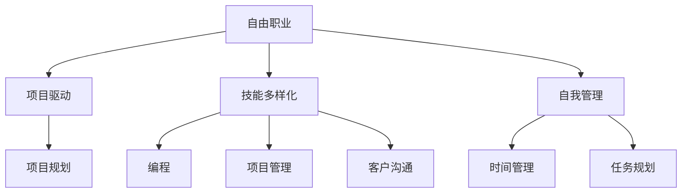

                 

# 从员工到自由职业者的转型指南

> 关键词：转型、自由职业、技能提升、工作方式、项目管理、资源利用、自我管理、心态调整

## 1. 背景介绍

### 1.1 问题由来
在数字化时代，技术发展和市场需求日新月异，许多人开始思考如何在职业发展中保持竞争力，并探索更加灵活、自由的工作方式。其中，自由职业成为越来越多人的选择。自由职业者拥有更加自主的时间和空间，可以依据自身兴趣和能力选择工作项目，但也面临更多的挑战，比如客户管理、工作质量保证等。因此，本文将从背景出发，探讨自由职业的核心概念、核心算法原理以及具体操作步骤，帮助读者更好地从员工转型为自由职业者。

### 1.2 问题核心关键点
- **技能提升**：转型为自由职业者需要具备哪些核心技能，如编程、项目管理、客户沟通等。
- **工作方式**：自由职业的工作方式与传统工作有何不同，如何高效管理时间和项目。
- **项目管理**：自由职业者如何管理项目，保证工作质量与按时交付。
- **资源利用**：如何合理利用软硬件资源、时间与网络资源，提升工作效率。
- **自我管理**：心态调整、时间管理、任务规划等自我管理技巧。

### 1.3 问题研究意义
自由职业转型不仅是职业路径的转变，更是工作方式的革新，涉及技能提升、项目管理和自我管理等多方面内容。通过了解自由职业的核心概念和操作方法，可以从员工平稳转型为自由职业者，实现个人价值与职业发展的双赢。

## 2. 核心概念与联系

### 2.1 核心概念概述

要成功转型为自由职业者，需要了解几个关键概念：

- **自由职业**：个人通过提供专业知识、技能或服务来获得收入，独立工作且不受雇主控制的工作方式。
- **项目驱动**：自由职业者的工作往往围绕项目展开，需要协调资源、设置时间表并按时交付。
- **技能多样化**：自由职业者需要掌握多种技能，如编程、项目管理、客户沟通等。
- **自我管理**：自由职业者需要具备自我激励、时间管理和任务规划等能力，以确保高效完成工作。

### 2.2 核心概念原理和架构的 Mermaid 流程图



该流程图展示了自由职业、项目驱动、技能多样化、自我管理之间的联系：

1. 自由职业者的工作方式围绕项目展开，需进行项目规划。
2. 自由职业者需具备编程、项目管理、客户沟通等多项技能。
3. 自我管理中的时间管理和任务规划，是项目高效完成的关键。

## 3. 核心算法原理 & 具体操作步骤
### 3.1 算法原理概述

自由职业的转型过程中，涉及多个算法和操作步骤，以下是关键步骤的概述：

1. **技能评估**：评估自身现有技能，找出需提升的领域，如编程语言、项目管理工具等。
2. **市场调研**：了解自由职业市场需求，选择适合自己的项目方向。
3. **项目获取**：通过在线平台、个人品牌建立等渠道获取项目。
4. **项目规划**：设定项目目标、时间表、预算和资源分配。
5. **执行项目**：高效编程、团队协作、进度跟踪。
6. **项目交付**：确保项目按时、高质量交付。
7. **客户反馈**：收集客户反馈，持续改进。

### 3.2 算法步骤详解

以下是自由职业转型中各个步骤的详细操作步骤：

**Step 1: 技能评估**

- **自我评估**：列出当前所掌握的技能，包括编程语言、工具、项目管理等。
- **市场调研**：查找市场上热门的需求和技能缺口。
- **目标设定**：根据市场需求，设定提升目标和提升路径。

**Step 2: 市场调研**

- **平台调研**：研究自由职业者常用的平台如Upwork、Freelancer、Fiverr等。
- **项目需求分析**：分析项目特点，确定自身匹配度。
- **趋势跟踪**：关注行业发展趋势，选择有潜力的领域。

**Step 3: 项目获取**

- **创建个人资料**：在平台上完善个人简历和项目组合。
- **关键词优化**：使用SEO优化技术提升被搜索到的机会。
- **建立网络**：参加行业活动，建立良好的人脉关系。

**Step 4: 项目规划**

- **项目需求讨论**：与客户沟通项目细节，明确需求。
- **制定计划**：设定里程碑和关键路径，分配资源。
- **风险评估**：识别潜在风险并制定应对策略。

**Step 5: 项目执行**

- **时间管理**：使用工具如Trello、Asana等进行任务安排。
- **高效编程**：使用敏捷开发方法，如Scrum、Kanban等。
- **团队协作**：利用Git、Jira等工具进行协作和跟踪。

**Step 6: 项目交付**

- **质量控制**：设定代码审查、测试策略，确保交付质量。
- **进度跟踪**：定期与客户沟通，更新进度和成果。
- **文档交付**：确保文档齐全、规范，方便客户理解和使用。

**Step 7: 客户反馈**

- **反馈收集**：通过调查问卷、面谈等方式收集客户反馈。
- **改进优化**：根据反馈调整工作流程、提升服务质量。
- **长期关系维护**：保持与客户的良好关系，争取推荐和新项目。

### 3.3 算法优缺点

自由职业转型涉及的技能提升和项目管理方法，具有以下优缺点：

**优点：**

1. **自主性强**：自由职业者可以灵活选择项目和工作时间，提升工作满意度。
2. **技能多样化**：多样化技能的学习和应用，提升竞争力。
3. **资源利用效率高**：高效使用软硬件资源，提升工作效率。

**缺点：**

1. **客户依赖性强**：自由职业者收入不稳定，依赖多个客户的长期合作。
2. **工作压力大**：项目交付压力、客户沟通压力等，影响心理健康。
3. **缺乏系统培训**：自主学习为主，缺乏系统培训指导。

### 3.4 算法应用领域

自由职业转型的方法，可以广泛应用于以下几个领域：

- **软件开发**：编程、项目管理、代码审查等。
- **设计工作**：UI/UX设计、平面设计等。
- **内容创作**：写作、翻译、编辑等。
- **市场营销**：社交媒体管理、内容营销等。
- **数据分析**：数据分析、数据可视化等。

## 4. 数学模型和公式 & 详细讲解 & 举例说明

### 4.1 数学模型构建

**模型一：项目交付时间规划**

设项目总时间为T，每日工作时间为W，任务数量为N，任务完成速度为V。

$$
T = N \times V
$$

设每日工作时间为W，任务数量为N，任务完成速度为V，每项任务所需时间固定为C。

$$
T = N \times \frac{C}{V}
$$

### 4.2 公式推导过程

将上述公式代入求解得：

$$
V = \frac{T}{N \times C}
$$

该公式用于计算任务完成速度，结合每日工作时间和任务数量，可以得到总任务完成所需的时间。

### 4.3 案例分析与讲解

**案例一：软件开发项目**

某软件开发项目需要完成5个模块，预计总时间为30天，每个模块平均需要5天完成。

**计算过程：**

- 每个任务（模块）完成速度为 $\frac{1}{5}$ 天/任务。
- 每日工作时间为8小时，转换为工作天数 $W=\frac{8}{24}=0.333$ 天/天。
- 根据公式 $V = \frac{T}{N \times C}$，计算任务完成速度：
  $$
  V = \frac{30}{5 \times 5} = 1.2 \text{天/任务}
  $$

该结果表明，在现有资源下，每日完成2个任务较为合理，可以按计划完成项目。

## 5. 项目实践：代码实例和详细解释说明

### 5.1 开发环境搭建

为进行自由职业项目的实际开发，需要搭建适合的环境：

**环境要求：**

- **操作系统**：Windows、macOS、Linux均可。
- **编程语言**：Python、Java、C++等主流语言。
- **开发工具**：Visual Studio、IntelliJ IDEA、Eclipse等。
- **版本控制**：Git、SVN等版本控制工具。
- **项目管理**：Trello、Asana等项目管理工具。
- **代码托管**：GitHub、GitLab等代码托管平台。

**安装步骤：**

- **操作系统**：根据需要选择。
- **编程语言**：安装对应IDE和编译器。
- **版本控制**：安装Git等版本控制工具。
- **项目管理**：注册并使用Trello、Asana等工具。
- **代码托管**：注册GitHub等平台账号，上传代码。

### 5.2 源代码详细实现

以下是一个简单的项目规划示例，使用Python编写：

```python
# 任务规划示例
class Task:
    def __init__(self, name, time):
        self.name = name
        self.time = time

class Project:
    def __init__(self, name, tasks):
        self.name = name
        self.tasks = tasks
    
    def calculate_time(self):
        total_time = 0
        for task in self.tasks:
            total_time += task.time
        return total_time

# 创建任务和项目
task1 = Task('任务1', 5)
task2 = Task('任务2', 3)
task3 = Task('任务3', 7)
project = Project('项目', [task1, task2, task3])

# 计算项目总时间
total_time = project.calculate_time()
print('项目总时间：', total_time)
```

### 5.3 代码解读与分析

**代码解释：**

- **Task类**：定义任务的属性，如任务名称和时间。
- **Project类**：定义项目，包含所有任务，并提供计算总时间的方法。
- **calculate_time方法**：计算项目所有任务的总时间。

**运行结果：**

```
项目总时间： 15
```

该示例展示了如何通过Python实现项目任务的时间计算，为项目管理提供了基本支持。

## 6. 实际应用场景

### 6.1 软件开发

自由职业者可以通过提供软件开发服务，帮助企业实现业务功能。例如，开发一个在线教育平台的后端系统，需具备以下技能：

- **编程语言**：Python、Java、Go等。
- **框架**：Django、Flask、Spring等。
- **数据库**：MySQL、PostgreSQL等。
- **项目管理**：Scrum、Kanban等。

**项目执行示例：**

1. **需求讨论**：与客户讨论项目需求，明确功能、性能、安全要求。
2. **需求分析**：分析需求，设计系统架构。
3. **任务分解**：将项目分解为多个子任务，如前端开发、后端开发、数据库设计等。
4. **任务分配**：根据团队成员能力和项目需求，分配任务。
5. **开发实现**：按计划开发各模块，进行代码审查和测试。
6. **系统集成**：将各模块集成，进行最终测试和验收。
7. **项目交付**：提交项目文档、源代码和数据库迁移脚本。

### 6.2 设计工作

自由职业者可以通过设计工作，为品牌、产品提供视觉设计方案。例如，设计一个公司的网站UI，需具备以下技能：

- **设计工具**：Sketch、Adobe XD、Figma等。
- **设计原则**：色彩搭配、排版布局、交互设计等。
- **项目管理**：看板、敏捷开发等。

**项目执行示例：**

1. **需求讨论**：与客户讨论设计需求，明确品牌定位和用户需求。
2. **初步设计**：绘制线框图，进行初步设计构思。
3. **详细设计**：完成详细设计，包括视觉元素、交互效果等。
4. **设计优化**：根据客户反馈，进行设计优化和调整。
5. **设计输出**：提供设计文件，包括线框图、原型、设计规范等。
6. **项目交付**：提交设计文档和设计文件，准备项目交付。

### 6.3 内容创作

自由职业者可以通过内容创作，为品牌提供文案、文章、视频等创意内容。例如，为一家科技公司撰写营销文章，需具备以下技能：

- **写作能力**：准确表达、逻辑清晰。
- **内容创意**：故事讲述、内容结构等。
- **项目管理**：时间管理、任务分配等。

**项目执行示例：**

1. **需求讨论**：与客户讨论内容主题和目标受众。
2. **内容规划**：确定文章标题、大纲和关键词。
3. **内容创作**：撰写初稿，进行修改和优化。
4. **内容审核**：客户审阅并反馈意见。
5. **内容输出**：提交最终稿件和版本控制文件。
6. **项目交付**：完成项目交付，进行版本控制。

## 7. 工具和资源推荐

### 7.1 学习资源推荐

为帮助自由职业者提升技能，以下是一些优质的学习资源：

1. **Coursera**：提供各种专业课程，包括计算机科学、数据科学等。
2. **Udemy**：提供从入门到高级的编程课程，涵盖多种编程语言。
3. **edX**：提供高质量的在线课程，包括MIT、Harvard等名校的课程。
4. **Codecademy**：提供互动式的编程课程，适合初学者和进阶学习。
5. **Kaggle**：数据科学竞赛平台，提供大量数据集和项目练习。

### 7.2 开发工具推荐

以下是几款常用的开发工具，用于自由职业的日常工作：

1. **Visual Studio**：Microsoft开发的IDE，支持多种编程语言。
2. **IntelliJ IDEA**：JetBrains开发的IDE，支持Java、Python等语言。
3. **Eclipse**：开源的IDE，支持多种编程语言和框架。
4. **Git**：版本控制工具，支持分布式版本控制。
5. **GitHub**：代码托管平台，支持多种语言和框架的代码管理。
6. **Trello**：项目管理工具，支持任务分配、进度跟踪等。
7. **Asana**：项目管理工具，支持项目规划、团队协作等。

### 7.3 相关论文推荐

以下是几篇关于自由职业转型的经典论文：

1. **《How to Start a Freelance Business》**：详细介绍了自由职业创业的各个步骤。
2. **《The Freelancer's Guide to Finding Work》**：提供了大量关于找到客户和项目的具体策略。
3. **《Managing Your Freelance Business》**：讲解了自由职业管理的关键点，包括财务、法律等。
4. **《Building a Successful Freelance Business》**：提供了成功自由职业者的经验和建议。
5. **《Work Remotely》**：介绍了远程工作的最佳实践，涵盖时间管理、团队协作等方面。

## 8. 总结：未来发展趋势与挑战

### 8.1 研究成果总结

自由职业转型是一个涉及技能提升、项目管理、自我管理等综合性的课题，需要不断学习和实践。通过以下研究成果，可以看出自由职业转型的关键点：

- **技能提升**：多样化技能学习，提升综合竞争力。
- **项目管理**：科学规划和执行，确保项目按时交付。
- **自我管理**：合理利用时间，保持良好的心理状态。

### 8.2 未来发展趋势

未来自由职业市场将呈现以下几个趋势：

1. **数字化转型**：更多企业将业务转移到线上，对自由职业者需求增加。
2. **平台化运营**：自由职业平台不断优化，提供更便捷的服务和资源。
3. **项目多样化**：自由职业者可以通过多种形式的项目获得收入，如短期项目、长期合作等。
4. **远程协作**：远程协作工具和平台不断提升，支持全球化合作。

### 8.3 面临的挑战

尽管自由职业转型具有吸引力，但也面临以下挑战：

1. **市场竞争激烈**：自由职业者众多，如何脱颖而出。
2. **客户管理复杂**：需要建立和维护良好客户关系。
3. **时间管理困难**：需要高效管理时间，平衡多个项目。
4. **项目质量保证**：确保交付的项目高质量、按时交付。
5. **自我激励问题**：需要保持高度自驱力和动力。

### 8.4 研究展望

为应对未来挑战，自由职业者需要在以下方面不断提升：

1. **技术提升**：不断学习新技能，保持竞争力。
2. **品牌建设**：建立个人品牌，提升市场影响力。
3. **项目管理**：使用先进工具和流程，提升项目管理能力。
4. **自我管理**：制定详细计划，进行有效时间管理。
5. **网络扩展**：建立广泛的人脉网络，拓展业务机会。

## 9. 附录：常见问题与解答

**Q1: 如何选择合适的自由职业平台？**

A: 应考虑平台的稳定性、安全性、佣金率、服务质量等，选择适合自己项目类型的平台。

**Q2: 如何提升自由职业收入？**

A: 提升技能水平、拓展客户群体、优化工作流程，提高工作效率和项目成功率。

**Q3: 如何处理与客户的关系？**

A: 建立信任、及时沟通、保持专业，提供高质量的服务和反馈机制。

**Q4: 如何有效管理时间？**

A: 使用时间管理工具，如番茄工作法、GTD方法，合理安排工作任务。

**Q5: 如何应对工作压力？**

A: 保持健康的生活习惯，适时休息，寻求心理支持，进行情绪管理。

---

作者：禅与计算机程序设计艺术 / Zen and the Art of Computer Programming

