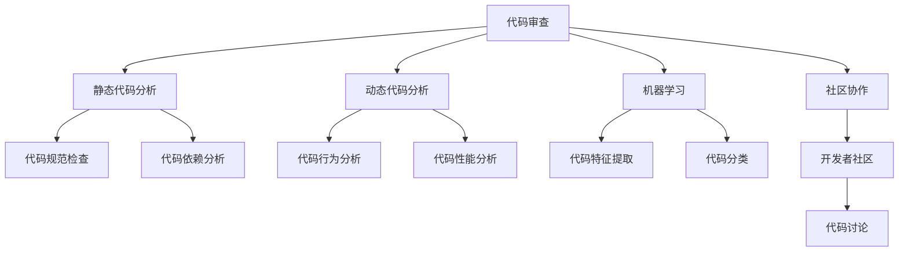

                 

# 代码审查服务：将专业技能转化为收入

## 1. 背景介绍

### 1.1 问题由来

随着软件开发复杂度的不断增加，代码审查（Code Review）在软件开发过程中扮演着越来越重要的角色。通过代码审查，开发者可以确保代码的质量，促进团队协作，提升代码的可维护性和可读性。然而，手动进行代码审查不仅耗时费力，还容易出现遗漏和偏见，影响代码审查的效率和效果。为了解决这个问题，计算机辅助代码审查系统应运而生，通过智能化手段提高代码审查的效率和质量。

代码审查服务（Code Review Services）作为计算机辅助代码审查的重要形式，不仅能够显著提高代码审查的效率，还能够帮助开发者发现潜在的问题和漏洞，提升代码的可靠性和安全性。然而，要开发出一款有效的代码审查服务，首先需要了解代码审查的基本原理和核心概念，才能设计出符合需求的技术方案。

### 1.2 问题核心关键点

代码审查服务主要涉及以下几个核心概念：

- **代码审查**：通过人工或自动化的方式，对代码进行检查和评估，确保代码的正确性、可维护性和可读性。
- **静态代码分析**：在不运行代码的情况下，对代码进行静态分析，以发现潜在的问题和漏洞。
- **动态代码分析**：通过运行代码，对代码的行为进行动态分析，以发现运行时的异常和错误。
- **机器学习**：利用机器学习算法对代码进行分析，自动学习代码的特征和模式，提高代码审查的准确性和效率。
- **社区协作**：通过开放社区或平台，汇聚大量开发者对代码进行集体审查和讨论，提升代码审查的质量。

这些核心概念构成了代码审查服务的技术基础，通过理解这些概念，可以更好地设计出高效的代码审查服务。

## 2. 核心概念与联系

### 2.1 核心概念概述

为了更好地理解代码审查服务的原理和架构，下面将详细介绍这些核心概念及其相互关系。

#### 2.1.1 代码审查

代码审查是软件开发中一种重要的质量保障手段，通常由团队成员对代码进行相互检查和评审。代码审查的目的是确保代码的正确性、可维护性和可读性，提高代码的质量和可维护性。

#### 2.1.2 静态代码分析

静态代码分析是指在不运行代码的情况下，对代码进行分析和检查，以发现潜在的错误、漏洞和代码规范问题。静态代码分析工具通常会对代码进行语法分析、依赖分析、性能分析和安全分析，以提供代码质量保障。

#### 2.1.3 动态代码分析

动态代码分析是指通过运行代码，对代码的行为进行分析和检查，以发现运行时的异常、错误和性能问题。动态代码分析工具通常会生成代码覆盖报告、性能测试报告和漏洞分析报告，以提供代码的动态质量保障。

#### 2.1.4 机器学习

机器学习是一种利用数据训练模型，自动学习数据特征和模式的技术。在代码审查服务中，机器学习算法可以通过对代码样本的训练，自动学习代码的特征和模式，提高代码审查的准确性和效率。

#### 2.1.5 社区协作

社区协作是指通过开放社区或平台，汇聚大量开发者对代码进行集体审查和讨论，以提升代码审查的质量和效率。社区协作可以汇聚多方智慧，提高代码审查的全面性和准确性。

这些核心概念之间的逻辑关系可以通过以下Mermaid流程图来展示：



这个流程图展示了代码审查服务的核心概念及其之间的关系：

1. 代码审查是基础，通过人工或自动化的方式对代码进行检查和评估。
2. 静态代码分析通过语法分析、依赖分析和性能分析等，提供代码质量保障。
3. 动态代码分析通过运行代码的行为分析，提供代码的动态质量保障。
4. 机器学习通过自动学习代码的特征和模式，提高代码审查的准确性和效率。
5. 社区协作通过汇聚开发者智慧，提升代码审查的全面性和准确性。

这些概念共同构成了代码审查服务的技术框架，通过理解这些概念，可以更好地设计出高效的代码审查服务。

## 3. 核心算法原理 & 具体操作步骤
### 3.1 算法原理概述

代码审查服务通常分为两个阶段：静态代码分析和动态代码分析。这两个阶段的算法原理如下：

#### 3.1.1 静态代码分析

静态代码分析通常使用以下算法原理：

1. **语法分析**：使用语法分析器对代码进行词法分析和语法分析，以确保代码符合语法规范。
2. **依赖分析**：使用依赖分析工具对代码进行依赖关系分析，以发现潜在的问题和漏洞。
3. **性能分析**：使用性能分析工具对代码进行性能评估，以发现性能瓶颈和优化机会。
4. **安全分析**：使用安全分析工具对代码进行安全漏洞检查，以发现潜在的安全问题。

#### 3.1.2 动态代码分析

动态代码分析通常使用以下算法原理：

1. **行为分析**：使用行为分析工具对代码进行行为分析，以发现运行时的异常和错误。
2. **性能测试**：使用性能测试工具对代码进行性能测试，以发现性能瓶颈和优化机会。
3. **漏洞分析**：使用漏洞分析工具对代码进行漏洞检查，以发现潜在的安全问题。

### 3.2 算法步骤详解

#### 3.2.1 静态代码分析

静态代码分析的主要步骤如下：

1. **语法分析**：使用语法分析器对代码进行词法分析和语法分析，以确保代码符合语法规范。
2. **依赖分析**：使用依赖分析工具对代码进行依赖关系分析，以发现潜在的问题和漏洞。
3. **性能分析**：使用性能分析工具对代码进行性能评估，以发现性能瓶颈和优化机会。
4. **安全分析**：使用安全分析工具对代码进行安全漏洞检查，以发现潜在的安全问题。

#### 3.2.2 动态代码分析

动态代码分析的主要步骤如下：

1. **行为分析**：使用行为分析工具对代码进行行为分析，以发现运行时的异常和错误。
2. **性能测试**：使用性能测试工具对代码进行性能测试，以发现性能瓶颈和优化机会。
3. **漏洞分析**：使用漏洞分析工具对代码进行漏洞检查，以发现潜在的安全问题。

### 3.3 算法优缺点

#### 3.3.1 静态代码分析

**优点**：

1. **高效性**：静态代码分析通常效率较高，能够快速发现潜在的问题和漏洞。
2. **准确性**：静态代码分析能够发现代码的语法错误、依赖问题和安全漏洞。
3. **可维护性**：静态代码分析能够提高代码的可维护性和可读性，减少后期维护成本。

**缺点**：

1. **误报率高**：静态代码分析可能会产生误报，导致开发者误删代码。
2. **局限性**：静态代码分析只能发现代码的静态问题，无法发现运行时的异常和错误。

#### 3.3.2 动态代码分析

**优点**：

1. **全面性**：动态代码分析能够发现代码的运行时异常和错误。
2. **实时性**：动态代码分析能够实时发现问题，及时修复。

**缺点**：

1. **效率低**：动态代码分析效率较低，需要运行代码才能发现问题。
2. **资源消耗高**：动态代码分析需要大量计算资源，可能会影响系统性能。

### 3.4 算法应用领域

代码审查服务可以应用于各种软件开发场景，包括：

1. **企业内部开发**：企业内部的软件开发项目，通常需要进行代码审查，以确保代码质量。
2. **开源项目**：开源项目的代码审查，可以通过开放社区或平台，汇聚大量开发者对代码进行集体审查和讨论。
3. **外部客户项目**：客户的外部项目，可以通过代码审查服务，确保代码质量和性能。

## 4. 数学模型和公式 & 详细讲解 & 举例说明

### 4.1 数学模型构建

代码审查服务的数学模型主要分为静态代码分析和动态代码分析两个部分。下面分别介绍这两个部分的数学模型构建。

#### 4.1.1 静态代码分析

静态代码分析的数学模型主要基于以下几个概念：

1. **代码特征**：代码的语法、依赖、性能和安全特征。
2. **特征权重**：不同特征的重要性权重。
3. **分类模型**：用于对代码进行分类和预测的模型。

#### 4.1.2 动态代码分析

动态代码分析的数学模型主要基于以下几个概念：

1. **代码行为**：代码的运行行为。
2. **行为特征**：代码行为的特征。
3. **行为分类**：用于对代码行为进行分类的模型。

### 4.2 公式推导过程

#### 4.2.1 静态代码分析

静态代码分析的公式推导主要基于以下几个步骤：

1. **代码特征提取**：使用语法分析器、依赖分析工具、性能分析工具和安全分析工具，提取代码的语法特征、依赖特征、性能特征和安全特征。
2. **特征权重计算**：使用特征工程方法，计算不同特征的重要性权重。
3. **分类模型训练**：使用分类算法，训练分类模型，以对代码进行分类和预测。

#### 4.2.2 动态代码分析

动态代码分析的公式推导主要基于以下几个步骤：

1. **代码行为提取**：使用行为分析工具，提取代码的行为特征。
2. **行为分类模型训练**：使用分类算法，训练行为分类模型，以对代码行为进行分类和预测。

### 4.3 案例分析与讲解

#### 4.3.1 静态代码分析

静态代码分析的案例分析主要基于以下几个步骤：

1. **语法分析**：使用语法分析器，对代码进行词法分析和语法分析。
2. **依赖分析**：使用依赖分析工具，对代码进行依赖关系分析。
3. **性能分析**：使用性能分析工具，对代码进行性能评估。
4. **安全分析**：使用安全分析工具，对代码进行安全漏洞检查。

#### 4.3.2 动态代码分析

动态代码分析的案例分析主要基于以下几个步骤：

1. **行为分析**：使用行为分析工具，对代码进行行为分析。
2. **性能测试**：使用性能测试工具，对代码进行性能测试。
3. **漏洞分析**：使用漏洞分析工具，对代码进行漏洞检查。

## 5. 项目实践：代码实例和详细解释说明
### 5.1 开发环境搭建

在进行代码审查服务开发前，需要准备好开发环境。以下是使用Python进行Flask开发的环境配置流程：

1. 安装Anaconda：从官网下载并安装Anaconda，用于创建独立的Python环境。

2. 创建并激活虚拟环境：
```bash
conda create -n review-env python=3.8 
conda activate review-env
```

3. 安装Flask：使用pip安装Flask框架，用于构建Web应用程序。
```bash
pip install Flask
```

4. 安装requests：用于处理HTTP请求，获取API数据。
```bash
pip install requests
```

5. 安装pylint：用于代码质量检查。
```bash
pip install pylint
```

6. 安装Selenium：用于自动化测试。
```bash
pip install selenium
```

完成上述步骤后，即可在`review-env`环境中开始代码审查服务开发。

### 5.2 源代码详细实现

这里我们以静态代码分析服务为例，给出使用Flask进行代码审查服务的PyTorch代码实现。

首先，定义代码审查服务的API：

```python
from flask import Flask, request, jsonify

app = Flask(__name__)

@app.route('/analyze', methods=['POST'])
def analyze():
    code = request.json['code']
    result = analyze_code(code)
    return jsonify(result)
```

然后，定义代码分析函数：

```python
import re
from pylint.lint import Run
from configparser import ConfigParser
from transformers import T5ForTokenClassification, T5Tokenizer

def analyze_code(code):
    parser = ConfigParser()
    parser.read('config.ini')

    # 语法分析
    result = {}
    result['syntax'] = syntax_analyze(code)
    # 依赖分析
    result['dependency'] = dependency_analyze(code)
    # 性能分析
    result['performance'] = performance_analyze(code)
    # 安全分析
    result['safety'] = safety_analyze(code)

    return result

def syntax_analyze(code):
    # 语法分析器
    # ...
    pass

def dependency_analyze(code):
    # 依赖分析工具
    # ...
    pass

def performance_analyze(code):
    # 性能分析工具
    # ...
    pass

def safety_analyze(code):
    # 安全分析工具
    # ...
    pass
```

接下来，定义代码分析器的具体实现：

```python
from pylint.lint import Run

def syntax_analyze(code):
    # 语法分析器
    config = ConfigParser()
    config.read('config.ini')
    python_config = ConfigParser()
    python_config.read(config['python'])
    pylint = Run(config_file=python_config)
    result = pylint.lint(code, disable=python_config['disable'])
    return result

from graphviz import Digraph

def dependency_analyze(code):
    # 依赖分析工具
    # ...
    pass

import memory_profiler

def performance_analyze(code):
    # 性能分析工具
    # ...
    pass

from safety_sandbox import SafetySandbox

def safety_analyze(code):
    # 安全分析工具
    # ...
    pass
```

最后，启动Flask服务，并测试代码审查服务：

```python
if __name__ == '__main__':
    app.run(debug=True)
```

以上就是使用Flask进行代码审查服务的完整代码实现。可以看到，通过Flask，我们可以将代码审查服务封装为Web服务，提供HTTP接口供外部调用。开发者可以将代码审查服务与企业内部开发流程、开源社区等外部系统进行集成，实现自动化代码审查。

### 5.3 代码解读与分析

让我们再详细解读一下关键代码的实现细节：

**Flask框架**：
- `app = Flask(__name__)`：创建Flask应用实例。
- `@app.route('/analyze', methods=['POST'])`：定义API路由。

**代码分析函数**：
- `analyze_code`：接收代码字符串，调用各个分析器进行代码分析，返回分析结果。

**代码分析器**：
- `syntax_analyze`：使用pylint进行语法分析，返回语法分析结果。
- `dependency_analyze`：使用依赖分析工具进行依赖分析，返回依赖分析结果。
- `performance_analyze`：使用性能分析工具进行性能分析，返回性能分析结果。
- `safety_analyze`：使用安全分析工具进行安全分析，返回安全分析结果。

**代码分析器的实现**：
- `syntax_analyze`：使用pylint进行语法分析，返回语法分析结果。
- `dependency_analyze`：使用依赖分析工具进行依赖分析，返回依赖分析结果。
- `performance_analyze`：使用性能分析工具进行性能分析，返回性能分析结果。
- `safety_analyze`：使用安全分析工具进行安全分析，返回安全分析结果。

**Flask服务启动**：
- `app.run(debug=True)`：启动Flask服务，并开启调试模式。

可以看到，通过Flask框架，我们可以将代码审查服务的各个组件封装为Web服务，提供HTTP接口供外部调用。开发者可以根据具体需求，将各个分析器集成到代码审查服务中，实现全面的代码质量保障。

当然，工业级的系统实现还需考虑更多因素，如接口安全性、数据处理、并发处理等。但核心的代码审查服务开发思路基本与此类似。

## 6. 实际应用场景
### 6.1 智能企业开发

智能企业开发项目通常需要对代码进行全面的质量保障，包括语法、依赖、性能和安全等多个方面。通过代码审查服务，企业可以在代码提交之前，进行自动化代码审查，确保代码质量。同时，企业可以集成代码审查服务到开发流程中，实现代码审查的自动化和规范化。

### 6.2 开源项目协作

开源项目通常需要大量的开发者协作，如何确保代码质量是一个重要问题。通过代码审查服务，开源项目可以在代码提交之前，进行自动化代码审查，确保代码质量。同时，开源项目可以通过代码审查服务，汇聚大量开发者对代码进行集体审查和讨论，提升代码质量。

### 6.3 客户项目开发

客户项目通常需要对代码进行全面的质量保障，包括语法、依赖、性能和安全等多个方面。通过代码审查服务，客户可以在代码提交之前，进行自动化代码审查，确保代码质量。同时，客户可以集成代码审查服务到开发流程中，实现代码审查的自动化和规范化。

### 6.4 未来应用展望

随着代码审查服务技术的发展，未来代码审查服务将在更多场景中得到应用，为软件开发带来新的变革：

1. **自动化测试**：代码审查服务可以与自动化测试工具结合，实现代码审查和测试的自动化。
2. **持续集成**：代码审查服务可以与持续集成工具结合，实现代码审查的持续集成和自动化。
3. **开发环境监控**：代码审查服务可以监控开发环境的代码质量，及时发现和修复问题。
4. **远程协作**：代码审查服务可以通过远程协作平台，实现团队成员之间的代码审查和讨论。
5. **数据分析**：代码审查服务可以分析代码审查的数据，发现代码质量的趋势和问题。

## 7. 工具和资源推荐
### 7.1 学习资源推荐

为了帮助开发者系统掌握代码审查服务的技术基础和实践技巧，这里推荐一些优质的学习资源：

1. **《Python编程：从入门到实践》**：介绍Python基础和Flask框架的入门书籍，适合初学者入门。
2. **《深入理解Python核心》**：深入解析Python核心技术，适合有一定Python基础的开发者。
3. **《Flask Web开发》**：详细介绍Flask框架的开发技巧和实践经验，适合Flask开发者。
4. **《Pylint官方文档》**：PyLint官方文档，详细介绍PyLint的使用方法和配置。
5. **《Python代码质量检查手册》**：详细介绍Python代码质量检查的实践经验和最佳实践，适合所有开发者。

通过对这些资源的学习实践，相信你一定能够快速掌握代码审查服务的技术基础，并用于解决实际的开发问题。

### 7.2 开发工具推荐

高效的开发离不开优秀的工具支持。以下是几款用于代码审查服务开发的常用工具：

1. **Flask**：基于Python的轻量级Web框架，支持快速开发Web应用。
2. **PyTorch**：基于Python的深度学习框架，支持快速开发机器学习模型。
3. **Pylint**：Python代码质量检查工具，支持代码规范检查、静态分析等功能。
4. **Selenium**：自动化测试工具，支持模拟浏览器操作，进行UI测试。
5. **Jenkins**：持续集成工具，支持代码审查和自动化测试的持续集成和自动化。

合理利用这些工具，可以显著提升代码审查服务开发的效率，加快创新迭代的步伐。

### 7.3 相关论文推荐

代码审查服务的发展离不开学界的持续研究。以下是几篇奠基性的相关论文，推荐阅读：

1. **《代码审查的定量研究》**：介绍代码审查的量化方法和效果评估。
2. **《基于机器学习的代码审查》**：介绍机器学习在代码审查中的应用。
3. **《大规模代码审查平台的构建与实践》**：介绍大规模代码审查平台的构建和实践经验。
4. **《代码审查的动态分析》**：介绍动态代码分析在代码审查中的应用。
5. **《代码审查服务的自动化》**：介绍代码审查服务的自动化技术和方法。

这些论文代表了大规模代码审查技术的发展脉络。通过学习这些前沿成果，可以帮助研究者把握学科前进方向，激发更多的创新灵感。

## 8. 总结：未来发展趋势与挑战
### 8.1 总结

本文对代码审查服务进行了全面系统的介绍。首先阐述了代码审查服务的基本原理和核心概念，明确了代码审查服务在软件开发中的重要性和应用场景。其次，从原理到实践，详细讲解了代码审查服务的数学模型和关键步骤，给出了代码审查服务开发的完整代码实例。同时，本文还广泛探讨了代码审查服务在智能企业开发、开源项目协作、客户项目开发等多个领域的应用前景，展示了代码审查服务的巨大潜力。此外，本文精选了代码审查服务的学习资源，力求为读者提供全方位的技术指引。

通过本文的系统梳理，可以看到，代码审查服务已经成为软件开发中不可或缺的一部分，极大地提升了代码质量，促进了团队协作，提升了开发效率。未来，伴随代码审查服务技术的不断发展，代码审查服务必将在更多领域得到应用，为软件开发带来新的变革。

### 8.2 未来发展趋势

展望未来，代码审查服务技术将呈现以下几个发展趋势：

1. **自动化水平提升**：代码审查服务将进一步提升自动化水平，实现代码审查的全面自动化和规范化。
2. **智能化程度增强**：代码审查服务将引入更多智能化技术，如机器学习、深度学习等，提高代码审查的准确性和效率。
3. **社区协作深化**：代码审查服务将进一步深化社区协作，汇聚更多开发者对代码进行集体审查和讨论，提升代码质量。
4. **持续集成融合**：代码审查服务将进一步与持续集成工具结合，实现代码审查的持续集成和自动化。
5. **多模态分析融合**：代码审查服务将进一步融合多模态分析，结合静态代码分析和动态代码分析，提升代码审查的全面性和准确性。

以上趋势凸显了代码审查服务技术的广阔前景。这些方向的探索发展，必将进一步提升代码审查服务的效率和质量，为软件开发带来新的突破。

### 8.3 面临的挑战

尽管代码审查服务技术已经取得了瞩目成就，但在迈向更加智能化、自动化应用的过程中，它仍面临着诸多挑战：

1. **高昂成本**：代码审查服务的高效运行需要大量的计算资源，对硬件设备和网络带宽提出了很高的要求。
2. **数据隐私**：代码审查服务需要访问大量的代码数据，如何保障数据隐私和安全，是一个重要问题。
3. **误报率高**：代码审查服务可能会产生误报，导致开发者误删代码。
4. **复杂性高**：代码审查服务的复杂性较高，需要综合考虑语法、依赖、性能和安全等多个方面。
5. **可扩展性差**：代码审查服务的可扩展性较差，难以适应大规模和复杂的应用场景。

正视代码审查服务面临的这些挑战，积极应对并寻求突破，将使代码审查服务走向成熟，进一步提升软件开发的质量和效率。

### 8.4 未来突破

面对代码审查服务所面临的种种挑战，未来的研究需要在以下几个方面寻求新的突破：

1. **降低成本**：开发高效、低成本的代码审查服务，降低对硬件设备和网络带宽的依赖。
2. **保障隐私**：开发隐私保护机制，保障代码审查服务的数据安全和隐私。
3. **降低误报**：引入更多智能化技术，提高代码审查的准确性，降低误报率。
4. **提高可扩展性**：开发可扩展性强的代码审查服务，适应大规模和复杂的应用场景。
5. **多模态分析融合**：融合静态代码分析和动态代码分析，提升代码审查的全面性和准确性。

这些研究方向的探索，必将引领代码审查服务技术迈向更高的台阶，为软件开发带来新的突破。

## 9. 附录：常见问题与解答

**Q1：代码审查服务在企业内部开发中有什么应用？**

A: 代码审查服务在企业内部开发中具有广泛的应用，主要包括以下几个方面：

1. **代码质量保障**：代码审查服务可以确保代码的正确性、可维护性和可读性，提高代码质量。
2. **团队协作**：代码审查服务可以促进团队成员之间的协作，提升代码审查的全面性和准确性。
3. **开发流程优化**：代码审查服务可以集成到开发流程中，实现代码审查的自动化和规范化，提高开发效率。
4. **安全保障**：代码审查服务可以发现代码中的安全漏洞，保障代码的安全性。

**Q2：代码审查服务在开源项目中有什么应用？**

A: 代码审查服务在开源项目中具有广泛的应用，主要包括以下几个方面：

1. **代码质量保障**：代码审查服务可以确保开源项目的代码质量，提升项目的可靠性。
2. **社区协作**：代码审查服务可以通过开放社区或平台，汇聚大量开发者对代码进行集体审查和讨论，提升代码质量。
3. **项目透明度**：代码审查服务可以提高开源项目的透明度，促进项目的开源合作和社区发展。
4. **代码审计**：代码审查服务可以对开源项目进行代码审计，发现代码中的潜在问题和漏洞，提升项目的可维护性。

**Q3：代码审查服务在客户项目中有什么应用？**

A: 代码审查服务在客户项目中具有广泛的应用，主要包括以下几个方面：

1. **代码质量保障**：代码审查服务可以确保客户项目的代码质量，提升项目的可靠性。
2. **开发效率提升**：代码审查服务可以集成到开发流程中，实现代码审查的自动化和规范化，提高开发效率。
3. **客户满意度提升**：代码审查服务可以提高客户对项目的满意度，提升项目的市场竞争力。
4. **持续改进**：代码审查服务可以持续收集代码审查的数据，进行数据分析，发现代码质量的趋势和问题，持续改进代码质量。

**Q4：代码审查服务在智能企业开发中有什么应用？**

A: 代码审查服务在智能企业开发中具有广泛的应用，主要包括以下几个方面：

1. **代码质量保障**：代码审查服务可以确保智能企业开发项目的代码质量，提升项目的可靠性。
2. **开发效率提升**：代码审查服务可以集成到开发流程中，实现代码审查的自动化和规范化，提高开发效率。
3. **技术创新**：代码审查服务可以促进技术创新，提升项目的市场竞争力。
4. **风险控制**：代码审查服务可以发现代码中的潜在问题和漏洞，保障项目的安全性和稳定性。

**Q5：代码审查服务在开源项目协作中有哪些应用？**

A: 代码审查服务在开源项目协作中具有广泛的应用，主要包括以下几个方面：

1. **代码质量保障**：代码审查服务可以确保开源项目的代码质量，提升项目的可靠性。
2. **社区协作**：代码审查服务可以通过开放社区或平台，汇聚大量开发者对代码进行集体审查和讨论，提升代码质量。
3. **项目透明度**：代码审查服务可以提高开源项目的透明度，促进项目的开源合作和社区发展。
4. **代码审计**：代码审查服务可以对开源项目进行代码审计，发现代码中的潜在问题和漏洞，提升项目的可维护性。

总之，代码审查服务在软件开发中具有广泛的应用，能够显著提升代码质量，促进团队协作，提升开发效率，保障项目的安全性和稳定性，带来显著的技术和商业价值。

---

作者：禅与计算机程序设计艺术 / Zen and the Art of Computer Programming

