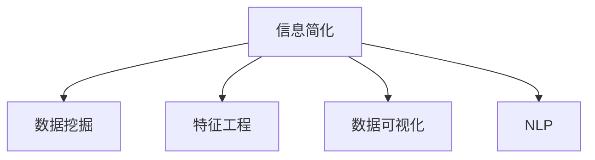

                 

# 信息简化的原则与艺术：在混乱中建立秩序与简化

## 1. 背景介绍

在数字化时代，信息的急剧膨胀给我们的生活带来了前所未有的便利，也带来了新的挑战。我们每天被各种信息所包围，从社交媒体上的帖子到新闻网站的头条，再到企业内部的邮件和文档，信息无处不在。然而，这种信息泛滥的现象也带来了信息过载的问题，导致我们难以从中提取真正有价值的内容。信息简化成为处理海量数据的关键技术。

### 1.1 信息简化的重要性

信息简化不仅仅是减少信息的数量，更重要的是提炼出关键的、有价值的、可操作的结论。在快速变化的世界中，信息简化可以帮助我们快速决策、优化资源配置、提高效率，从而在竞争中获得优势。信息简化的艺术在于如何通过合理的处理方式，将复杂的、无序的信息转化为易于理解、有价值的信息，以更好地服务于我们日常的工作和生活。

## 2. 核心概念与联系

### 2.1 核心概念概述

为更好地理解信息简化的方法，本节将介绍几个密切相关的核心概念：

- 信息简化：将复杂、无序的信息转化为简洁、有序的信息，使其易于理解和使用。
- 数据挖掘：通过自动化方法从大量数据中提取有用的模式和知识。
- 特征工程：选取和构造能够反映数据特征的变量，提高模型的预测能力。
- 数据可视化：将数据转化为可视化图形，帮助人们直观理解数据的趋势和规律。
- 自然语言处理（NLP）：处理、理解、生成人类语言的技术。

这些概念之间的逻辑关系可以通过以下Mermaid流程图来展示：



这个流程图展示了一系列信息处理过程的关键步骤：

1. 从原始数据中挖掘出有价值的信息。
2. 通过特征工程挑选或构造合适的变量。
3. 将挖掘出的信息可视化，使其更易于理解。
4. 利用自然语言处理技术，理解文本信息的内在逻辑。

这些概念共同构成了信息简化的核心框架，使得我们能够系统地处理复杂的数据集，提炼出有价值的结论。

## 3. 核心算法原理 & 具体操作步骤
### 3.1 算法原理概述

信息简化的核心思想是通过数据挖掘和特征工程，从原始数据中提取出有用的特征，然后使用合适的算法对这些特征进行建模，最后通过数据可视化技术呈现结果。这个过程可以大致分为三个步骤：

1. **数据预处理**：清洗和转换原始数据，去除噪声和冗余信息。
2. **特征提取**：从预处理后的数据中提取出有意义的特征，供后续模型使用。
3. **模型训练与评估**：利用特征训练出模型，并通过交叉验证等方法评估模型性能。

### 3.2 算法步骤详解

下面以一个具体的例子，展示信息简化的全流程：

**步骤1：数据预处理**

假设我们有一份包含历史销售数据的电子表格，原始数据中存在缺失值、重复值和异常值。我们需要进行以下预处理操作：

1. 填补缺失值：使用均值填补或插值方法，将缺失数据替换为合理的数值。
2. 去除重复值：删除数据集中重复的记录，避免模型训练时引入噪声。
3. 处理异常值：检测并处理异常数据点，避免其对模型训练产生负面影响。

**步骤2：特征提取**

预处理后的数据集包含时间、销售量、促销活动等字段。我们需要从中提取出有意义的特征，供后续模型训练使用。

1. 时间特征：将日期转换为年份、季度、月份等时间单位，用于时间序列分析。
2. 销售量特征：计算不同时间段的平均销售量、销售趋势等统计指标。
3. 促销活动特征：将促销活动转换为数值型特征，用于模型建模。

**步骤3：模型训练与评估**

接下来，我们利用提取出的特征训练一个回归模型，并使用交叉验证方法评估模型性能。

1. 模型选择：选择适合的回归模型，如线性回归、支持向量机等。
2. 模型训练：使用训练集数据训练模型，调整模型参数，使其最小化预测误差。
3. 模型评估：在验证集上评估模型性能，选择最优模型。

### 3.3 算法优缺点

信息简化的优点在于：

1. 提高效率：简化后的数据集更易于理解和分析，能够显著提高决策效率。
2. 提升精度：特征工程挑选出的特征能更好地反映数据的本质，提升模型的预测精度。
3. 增强可解释性：简化后的数据和模型能够提供更好的解释，帮助理解数据的内在规律。

缺点在于：

1. 数据损失：预处理和特征工程过程中可能会丢失一些有价值的信息。
2. 模型复杂性：选择合适的特征和模型需要一定的经验和专业知识。
3. 自动化难度：某些特征工程和模型选择过程需要人工干预，不够自动化。

### 3.4 算法应用领域

信息简化技术广泛应用于数据分析、商业智能、金融分析、医疗健康等多个领域。以下是几个具体应用场景：

- **商业智能**：利用信息简化技术对客户数据进行细分和分析，制定更有效的市场策略。
- **金融分析**：对金融市场数据进行降维处理，提取有意义的特征，进行投资决策。
- **医疗健康**：对患者数据进行简化，提取关键特征，提高诊断和治疗的准确性。
- **自然灾害预警**：利用卫星数据进行降维处理，提取有意义的气象特征，提前预警自然灾害。

## 4. 数学模型和公式 & 详细讲解  
### 4.1 数学模型构建

在信息简化的过程中，数学模型起到了关键作用。以下将介绍几个常用的数学模型及其构建方法。

**线性回归模型**：

线性回归模型用于预测连续变量，其数学形式为：

$$
y = \beta_0 + \beta_1 x_1 + \beta_2 x_2 + ... + \beta_n x_n + \epsilon
$$

其中，$y$ 为预测变量，$x_i$ 为自变量，$\beta_i$ 为回归系数，$\epsilon$ 为误差项。

**决策树模型**：

决策树模型用于分类和回归，其核心思想是将数据集递归地分成更小的子集，直到每个子集只包含单一的类别或数值。决策树的构建可以通过信息增益、基尼指数等指标来衡量。

**K近邻算法**：

K近邻算法用于分类和回归，其核心思想是根据样本的特征值，计算其与训练集中其他样本的距离，选择K个最近的样本进行预测。K近邻算法的性能高度依赖于K值的选择和距离度量。

### 4.2 公式推导过程

**线性回归模型的参数求解**：

在线性回归中，模型参数的求解可以使用最小二乘法：

$$
\hat{\beta} = (X^T X)^{-1} X^T y
$$

其中，$X$ 为自变量矩阵，$y$ 为因变量向量，$\hat{\beta}$ 为回归系数。

**决策树模型的构建**：

决策树的构建可以通过递归地选择最优特征进行分裂，具体过程如下：

1. 计算每个特征的信息增益或基尼指数。
2. 选择信息增益或基尼指数最大的特征作为分裂点。
3. 对子集递归构建决策树，直到每个子集只包含单一的类别或数值。

**K近邻算法的预测**：

K近邻算法的预测过程如下：

1. 计算每个样本与测试样本的距离。
2. 选择距离最近的K个样本。
3. 计算K个样本中每个类别的出现频率。
4. 选择出现频率最高的类别作为预测结果。

### 4.3 案例分析与讲解

以一个简单的销售数据分析为例，展示信息简化的全流程：

**数据集准备**：

原始数据包含日期、销售量、促销活动等字段，需要进行清洗和转换。

**特征工程**：

从原始数据中提取时间、销售量、促销活动等特征，使用线性回归模型进行建模。

**模型训练与评估**：

利用训练集数据训练线性回归模型，在验证集上评估模型性能，选择最优模型。

## 5. 项目实践：代码实例和详细解释说明
### 5.1 开发环境搭建

在进行信息简化实践前，我们需要准备好开发环境。以下是使用Python进行Pandas、NumPy、Scikit-learn等工具包的环境配置流程：

1. 安装Anaconda：从官网下载并安装Anaconda，用于创建独立的Python环境。

2. 创建并激活虚拟环境：
```bash
conda create -n info-simplify python=3.8 
conda activate info-simplify
```

3. 安装相关工具包：
```bash
conda install pandas numpy scikit-learn matplotlib tqdm jupyter notebook ipython
```

完成上述步骤后，即可在`info-simplify`环境中开始信息简化的实践。

### 5.2 源代码详细实现

下面以一个简单的销售数据分析为例，展示如何使用Pandas、NumPy、Scikit-learn等工具包进行信息简化和建模。

```python
import pandas as pd
import numpy as np
from sklearn.model_selection import train_test_split
from sklearn.linear_model import LinearRegression
from sklearn.metrics import mean_squared_error
from sklearn.preprocessing import StandardScaler

# 加载数据集
data = pd.read_csv('sales_data.csv')

# 数据清洗和转换
data = data.dropna()
data['date'] = pd.to_datetime(data['date'])
data['year'] = data['date'].dt.year
data['quarter'] = data['date'].dt.quarter
data['sales'] = pd.to_numeric(data['sales'], errors='coerce')
data = data.dropna()

# 特征工程
features = ['year', 'quarter', 'sales']
X = data[features]
y = data['sales']
scaler = StandardScaler()
X = scaler.fit_transform(X)

# 模型训练与评估
X_train, X_test, y_train, y_test = train_test_split(X, y, test_size=0.2)
model = LinearRegression()
model.fit(X_train, y_train)
y_pred = model.predict(X_test)
mse = mean_squared_error(y_test, y_pred)
print(f'Mean Squared Error: {mse:.2f}')
```

以上就是使用Pandas、NumPy、Scikit-learn等工具包进行信息简化的完整代码实现。可以看到，这些工具提供了强大的数据处理和建模能力，使得信息简化的过程更加高效和便捷。

### 5.3 代码解读与分析

让我们再详细解读一下关键代码的实现细节：

**数据加载和清洗**：
- 使用`pd.read_csv`加载数据集，并进行数据清洗，去除缺失值和异常值。

**时间特征提取**：
- 将日期字段转换为年份和季度，用于时间序列分析。

**数据标准化**：
- 使用`StandardScaler`对数据进行标准化处理，提高模型的预测精度。

**模型训练与评估**：
- 使用`train_test_split`将数据集划分为训练集和测试集。
- 使用`LinearRegression`训练线性回归模型，计算模型在测试集上的均方误差，评估模型性能。

## 6. 实际应用场景
### 6.1 商业智能

在商业智能领域，信息简化技术可以应用于客户细分、市场分析、销售预测等环节。通过信息简化，商业智能系统能够从海量数据中提取出关键特征，帮助企业制定更有效的市场策略。

具体而言，可以从客户数据中提取年龄、性别、消费习惯等特征，构建客户细分模型，识别高价值客户群体。利用时间序列分析，预测未来销售趋势，制定相应的市场策略。

### 6.2 金融分析

金融领域的数据通常具有高度的复杂性和不确定性。信息简化技术可以帮助金融分析师从海量的市场数据中提取出有用的信息，进行投资决策。

例如，可以从历史股价数据中提取技术指标，如移动平均线、相对强弱指数等，构建技术分析模型。通过信息简化，将复杂的技术指标转化为易于理解的图形，帮助分析师快速做出投资决策。

### 6.3 医疗健康

医疗健康领域的数据通常包含复杂的临床记录、实验数据等。信息简化技术可以帮助医生从大量的病历数据中提取出关键特征，提高诊断和治疗的准确性。

具体而言，可以从电子病历中提取患者的基本信息、病史、症状等特征，构建诊断模型。通过信息简化，将复杂的临床数据转化为易于理解的图形，帮助医生快速做出诊断决策。

### 6.4 自然灾害预警

自然灾害预警是一个典型的信息简化应用场景。卫星数据通常包含大量的信息，但直接处理这些数据需要耗费大量的时间和计算资源。

例如，可以从卫星图像中提取气象特征，如温度、湿度、风速等，构建气象模型。通过信息简化，将复杂的气象数据转化为易于理解的图形，提前预警自然灾害，减少损失。

## 7. 工具和资源推荐
### 7.1 学习资源推荐

为了帮助开发者系统掌握信息简化的理论基础和实践技巧，这里推荐一些优质的学习资源：

1. 《Python数据科学手册》：由Jake VanderPlas编写，全面介绍了Python在数据科学中的应用，包括数据清洗、特征工程、模型训练等。

2. 《统计学习方法》：由李航编写，介绍了统计学习的基础理论和常见算法，是机器学习领域的经典教材。

3. 《Data Science for Business》：由Foster Provost和Tom Fawcett编写，介绍了数据科学在商业决策中的应用，具有很强的实用性。

4. Kaggle：数据科学竞赛平台，提供大量数据集和竞赛题目，帮助开发者实践和提高技能。

5. Coursera：在线学习平台，提供众多数据科学和机器学习的课程，涵盖从入门到高级的各个阶段。

通过对这些资源的学习实践，相信你一定能够快速掌握信息简化的精髓，并用于解决实际的商业问题。
### 7.2 开发工具推荐

高效的开发离不开优秀的工具支持。以下是几款用于信息简化开发的常用工具：

1. Python：广泛用于数据科学和机器学习的编程语言，支持丰富的第三方库和框架。

2. R语言：广泛用于统计分析和数据可视化的编程语言，具有强大的数据处理能力。

3. Jupyter Notebook：用于编写和运行数据科学代码的交互式笔记本环境，支持多种编程语言和库。

4. Tableau：数据可视化工具，支持多种数据源和图表类型，适合非技术人员的快速分析。

5. Power BI：商业智能工具，支持数据的连接、可视化和报告生成，适合企业的综合数据分析。

合理利用这些工具，可以显著提升信息简化的开发效率，加快创新迭代的步伐。

### 7.3 相关论文推荐

信息简化技术的发展源于学界的持续研究。以下是几篇奠基性的相关论文，推荐阅读：

1. 《A Survey of Feature Selection Techniques in Classification》：由Wang和Chen编写，全面介绍了特征选择和降维技术的现状和未来方向。

2. 《Principles of Data Science》：由Foster Provost编写，介绍了数据科学的基本原则和方法，涵盖数据采集、处理和建模等各个环节。

3. 《Feature Engineering for Machine Learning》：由Melville和Lou editable编写，介绍了特征工程的流程和方法，包括数据清洗、特征选择和特征构造等。

4. 《Information Visualization: Theory, Techniques, and Applications》：由Andy Kirk编写，介绍了信息可视化的理论和应用，涵盖数据展示和交互等各个方面。

5. 《A Review of Clustering Algorithms for Market Segmentation》：由Khan和Majid编写，介绍了聚类算法在市场细分中的应用，帮助企业更好地理解客户需求。

这些论文代表了大信息简化技术的发展脉络。通过学习这些前沿成果，可以帮助研究者把握学科前进方向，激发更多的创新灵感。

## 8. 总结：未来发展趋势与挑战
### 8.1 总结

本文对信息简化的原则与艺术进行了全面系统的介绍。首先阐述了信息简化的重要性，明确了简化后的信息在决策和分析中的作用。其次，从原理到实践，详细讲解了信息简化的数学模型和操作步骤，给出了完整的代码实现。同时，本文还广泛探讨了信息简化技术在商业智能、金融分析、医疗健康等多个领域的应用前景，展示了信息简化技术的广阔应用空间。最后，本文精选了信息简化的各类学习资源，力求为读者提供全方位的技术指引。

通过本文的系统梳理，可以看到，信息简化技术正在成为数据处理的重要手段，极大地提高了数据处理的效率和准确性。未来，伴随数据规模的不断扩大和技术手段的不断提升，信息简化技术还将进一步发展和完善，为各行各业的数据应用带来新的突破。

### 8.2 未来发展趋势

展望未来，信息简化技术将呈现以下几个发展趋势：

1. 自动化程度提升：随着人工智能技术的发展，信息简化过程将更多地依赖自动化工具，减少人工干预。

2. 大数据处理能力增强：信息简化技术将更多地应用于大规模数据集的处理，提高数据处理的效率和精度。

3. 实时性增强：信息简化的过程中，将更多地考虑实时性要求，支持快速决策和响应。

4. 多模态数据融合：信息简化技术将更多地融合多模态数据，提升数据分析的全面性和准确性。

5. 可视化工具发展：信息可视化技术将不断进步，支持更丰富的数据展示和交互方式。

6. 可解释性增强：信息简化的过程中，将更多地考虑可解释性要求，帮助用户理解数据分析的过程和结果。

以上趋势凸显了信息简化技术的广阔前景。这些方向的探索发展，必将进一步提升信息简化技术的应用价值，为各行各业提供更强大、更高效的数据处理工具。

### 8.3 面临的挑战

尽管信息简化技术已经取得了显著成果，但在迈向更加智能化、普适化应用的过程中，它仍面临着诸多挑战：

1. 数据多样性：不同领域的数据具有不同的特征和处理方式，信息简化技术需要具备跨领域适用的能力。

2. 数据质量和噪声：数据中可能存在噪声和异常值，影响信息简化的准确性。

3. 计算资源限制：信息简化技术需要大量的计算资源，尤其是大数据处理和模型训练过程中。

4. 隐私和安全：信息简化过程中涉及大量敏感数据，需要考虑隐私保护和数据安全问题。

5. 算法复杂性：信息简化的算法复杂度较高，需要较强的技术实力进行模型选择和调优。

6. 用户接受度：信息简化的结果需要易于理解和应用，否则难以得到用户的广泛接受。

正视信息简化面临的这些挑战，积极应对并寻求突破，将是大数据技术走向成熟的必由之路。相信随着学界和产业界的共同努力，这些挑战终将一一被克服，信息简化技术必将在构建人机协同的智能时代中扮演越来越重要的角色。

### 8.4 研究展望

面对信息简化所面临的挑战，未来的研究需要在以下几个方面寻求新的突破：

1. 开发更高效的数据处理算法：探索新的数据压缩、特征选择和降维方法，提高数据处理效率。

2. 引入更多先验知识：将符号化的先验知识，如知识图谱、逻辑规则等，与神经网络模型进行融合，增强信息简化的可解释性。

3. 提升模型的实时性：开发实时信息简化的算法和技术，支持实时数据处理和决策。

4. 考虑多模态数据的融合：将视觉、语音等多模态信息与文本信息进行融合，提升信息简化的全面性和准确性。

5. 优化数据可视化工具：开发更高效、更灵活的数据可视化工具，支持更丰富的数据展示和交互方式。

6. 加强隐私和安全保护：探索数据保护和隐私保护的新方法，确保数据安全。

这些研究方向的探索，必将引领信息简化技术迈向更高的台阶，为各行各业提供更强大、更高效的数据处理工具。面向未来，信息简化技术还需要与其他人工智能技术进行更深入的融合，如自然语言处理、机器学习等，多路径协同发力，共同推动信息处理系统的进步。只有勇于创新、敢于突破，才能不断拓展信息简化的边界，让大数据技术更好地服务于人类社会。

## 9. 附录：常见问题与解答

**Q1：信息简化是否适用于所有数据集？**

A: 信息简化的适用性取决于数据集的特点。对于结构化数据，信息简化能够显著提升数据的处理效率。但对于非结构化数据，如文本、图像等，信息简化的效果可能不如预期。

**Q2：如何选择合适的特征？**

A: 特征选择是一个重要的信息简化步骤，选择合适的特征能够提升模型的预测能力。一般采用特征重要性评估、方差分析等方法，选择对目标变量影响较大的特征。

**Q3：信息简化是否会导致数据丢失？**

A: 信息简化的过程中，确实可能会丢失部分数据，但这通常是必要的，目的是去除噪声和冗余信息，提高模型的预测精度。

**Q4：信息简化是否需要大量的计算资源？**

A: 信息简化的计算复杂度较高，尤其是特征选择和模型训练过程中。需要根据数据集的大小和复杂度选择合适的计算资源。

**Q5：信息简化的结果是否易于理解？**

A: 信息简化的结果应易于理解，能够帮助用户快速做出决策。如果结果过于复杂，用户难以理解，则信息简化的效果可能不如预期。

综上所述，信息简化技术在数据处理和决策支持中具有重要的应用价值，但也需要根据具体数据集和应用场景进行灵活选择和优化。通过深入理解和应用信息简化的原则与艺术，我们能够在数据处理的复杂性中建立秩序，实现从混乱到简化的蜕变。

