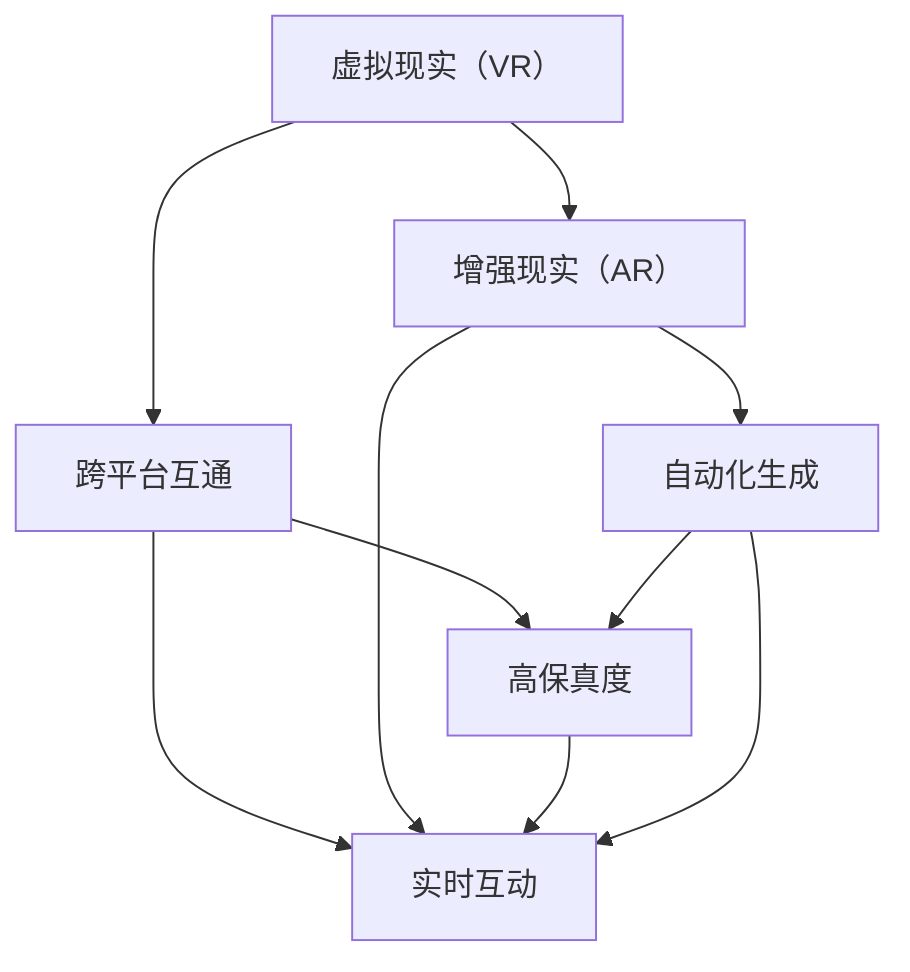

                 

## 1. 背景介绍

### 1.1 问题由来

随着科技的飞速发展，我们正逐步迈入一个全新的时代——元宇宙（Metaverse）。元宇宙是一个由虚拟与现实无缝融合的宇宙，用户可以在其中进行社交、工作、娱乐、购物等多种活动，享受前所未有的沉浸式体验。而在众多元宇宙应用中，音乐以其独特的魅力，成为了不可或缺的重要组成部分。

元宇宙音乐不仅满足用户的听觉需求，更是跨越时空，连接不同文化和地域的重要纽带。它将现实世界中的音乐创作、演奏和欣赏方式与虚拟世界深度融合，为用户带来了全新的听觉盛宴。

### 1.2 问题核心关键点

元宇宙音乐的核心在于通过先进的技术手段，实现音乐的跨时空互动和共享。这包括但不限于：

- **跨平台互通**：元宇宙音乐需要支持多个平台和设备，确保用户无论在何种设备上都能无缝体验音乐。
- **实时互动**：元宇宙音乐强调实时性，用户可以通过虚拟现实（VR）、增强现实（AR）等技术，与演奏者或创作者实时互动。
- **高保真度**：元宇宙音乐对音质和音效要求极高，需要采用高质量的音频编解码技术和音乐处理算法，保证音乐体验的沉浸感和真实感。
- **自动化生成**：元宇宙音乐需要支持自动化音乐生成技术，使创作过程更加高效和智能化，减少创作者的工作量。

### 1.3 问题研究意义

研究元宇宙音乐，对于提升用户体验、推动音频技术的发展、促进跨文化交流具有重要意义：

1. **用户体验优化**：元宇宙音乐可以打破传统音乐的时间和空间限制，用户可以随时随地享受高品质的音乐体验。
2. **技术进步**：元宇宙音乐的实现需要多种技术的融合，如虚拟现实、增强现实、语音识别等，推动这些技术的进一步发展和应用。
3. **文化交流**：元宇宙音乐可以跨越语言和文化的障碍，让不同地域和文化的用户通过音乐进行交流和理解。

## 2. 核心概念与联系

### 2.1 核心概念概述

元宇宙音乐涉及多个关键概念，包括但不限于：

- **虚拟现实（Virtual Reality, VR）**：通过虚拟现实技术，用户可以在虚拟环境中沉浸式地体验音乐。
- **增强现实（Augmented Reality, AR）**：通过增强现实技术，用户可以在现实环境中叠加虚拟音乐元素。
- **跨平台互通**：确保音乐在不同平台和设备之间无缝流转。
- **自动化生成**：通过算法生成音乐，减少人工创作的时间和成本。
- **实时互动**：通过网络技术实现用户与创作者之间的实时交流和互动。
- **高保真度**：采用高质量的音频编解码技术，提升音乐体验的沉浸感和真实感。

这些概念之间相互关联，共同构成了元宇宙音乐的完整体系。以下通过Mermaid流程图展示其核心概念及其联系：



这个流程图展示了虚拟现实、增强现实、跨平台互通、实时互动、高保真度和自动化生成之间的关系：

1. **虚拟现实**：通过VR技术，用户可以沉浸式体验音乐，增强现实感。
2. **增强现实**：通过AR技术，在现实环境中叠加虚拟音乐元素，提升互动性。
3. **跨平台互通**：确保音乐在不同平台和设备间无缝流转，提高使用便利性。
4. **实时互动**：通过网络技术，实现用户与创作者之间的实时交流和互动。
5. **高保真度**：采用高质量音频编解码技术，提升音乐体验的沉浸感和真实感。
6. **自动化生成**：通过算法生成音乐，减少人工创作时间和成本。

这些概念共同构成了元宇宙音乐的完整体系，推动其技术的不断进步和应用。

## 3. 核心算法原理 & 具体操作步骤

### 3.1 算法原理概述

元宇宙音乐的实现涉及多种算法和技术，包括但不限于：

- **音频编解码算法**：用于将音乐文件转换为适合不同平台和设备播放的格式，保证音质和音效。
- **虚拟现实算法**：用于生成虚拟环境中的音乐元素，提升用户的沉浸感。
- **增强现实算法**：用于在现实环境中叠加虚拟音乐元素，增强互动性。
- **自动化生成算法**：用于通过算法生成音乐，减少人工创作的时间和成本。

### 3.2 算法步骤详解

以下是元宇宙音乐的实现步骤详解：

1. **音频编解码算法**：
   - **输入**：原始音乐文件。
   - **处理**：将音乐文件转换为适合不同平台和设备播放的格式，如MP3、WAV等。
   - **输出**：处理后的音乐文件。

2. **虚拟现实算法**：
   - **输入**：用户选择的音乐文件。
   - **处理**：根据用户的VR设备参数，生成虚拟环境中的音乐元素，如虚拟舞台、灯光等。
   - **输出**：虚拟环境中的音乐元素。

3. **增强现实算法**：
   - **输入**：用户选择的音乐文件和现实环境图像。
   - **处理**：将音乐元素叠加到现实环境中，生成增强现实效果。
   - **输出**：增强现实环境中的音乐元素。

4. **自动化生成算法**：
   - **输入**：用户输入的创作需求。
   - **处理**：根据用户需求，使用算法生成音乐。
   - **输出**：生成的音乐文件。

### 3.3 算法优缺点

元宇宙音乐的算法具有以下优点：

1. **沉浸感强**：通过虚拟现实和增强现实技术，用户可以沉浸式体验音乐，增强互动性。
2. **实时性高**：通过网络技术，实现用户与创作者之间的实时交流和互动。
3. **灵活性高**：支持跨平台互通，满足不同用户和设备的需求。
4. **高效性高**：通过自动化生成算法，减少人工创作的时间和成本。

但同时也存在一些缺点：

1. **技术门槛高**：实现元宇宙音乐需要多种技术的融合，对技术和设备要求较高。
2. **成本高**：高质量音频编解码技术和虚拟现实设备的成本较高。
3. **网络依赖强**：实时互动和跨平台互通依赖稳定的网络环境。

### 3.4 算法应用领域

元宇宙音乐的应用领域非常广泛，包括但不限于：

- **娱乐**：如音乐会、演唱会、K歌房等。
- **教育**：如在线音乐课程、音乐创作教程等。
- **医疗**：如音乐疗法、心理辅导等。
- **商务**：如虚拟会议、虚拟展览等。
- **社交**：如虚拟社交平台、游戏等。

这些应用场景展示了元宇宙音乐的广泛应用，推动了其在不同领域的深度发展。

## 4. 数学模型和公式 & 详细讲解 & 举例说明

### 4.1 数学模型构建

元宇宙音乐的核心数学模型包括音频编解码模型、虚拟现实模型和增强现实模型。

### 4.2 公式推导过程

以音频编解码为例，简要推导一下常用的MP3编码模型：

1. **子带分解**：将音频信号分解为多个子带，每个子带包含频率相近的频谱分量。
2. **量化**：将子带信号量化为整数，保留主要信息。
3. **编码**：对量化后的信号进行熵编码，压缩数据量。
4. **合成**：将编码后的信号重新合成，得到压缩后的音频文件。

### 4.3 案例分析与讲解

以虚拟现实音乐为例，简要分析其在不同平台上的应用：

1. **VR平台**：如Oculus Rift、HTC Vive等。用户在虚拟现实中体验音乐，通过头戴式设备获得沉浸式体验。
2. **AR平台**：如Magic Leap、Google Glass等。用户在现实环境中叠加虚拟音乐元素，增强互动性。
3. **跨平台互通**：通过云服务实现音乐在不同平台和设备之间的无缝流转，保证用户体验的一致性。

## 5. 项目实践：代码实例和详细解释说明

### 5.1 开发环境搭建

以下是使用Python和Pygame实现元宇宙音乐的基本环境搭建步骤：

1. **安装Python和Pygame**：
   ```
   pip install python
   pip install pygame
   ```

2. **安装虚拟现实设备**：如Oculus Rift、HTC Vive等。
3. **安装增强现实设备**：如Magic Leap、Google Glass等。

### 5.2 源代码详细实现

以下是使用Pygame和OpenAL实现元宇宙音乐的基本代码实现：

```python
import pygame
from pygame.locals import *
import sys
import openal

pygame.init()

# 创建窗口
screen = pygame.display.set_mode((640, 480))
pygame.display.set_caption('元宇宙音乐')

# 加载音频文件
music_file = pygame.mixer.Sound('music.wav')

# 播放音频
pygame.mixer.music.play()

# 无限循环，保持窗口打开
while True:
    for event in pygame.event.get():
        if event.type == QUIT:
            pygame.quit()
            sys.exit()

    pygame.display.flip()
```

### 5.3 代码解读与分析

上述代码实现了元宇宙音乐的基本功能，包括：

1. **初始化**：通过`pygame.init()`初始化Pygame库，创建窗口和音频播放对象。
2. **加载音频**：通过`pygame.mixer.Sound()`加载音频文件，`music_file`变量存储音频对象。
3. **播放音频**：通过`pygame.mixer.music.play()`播放音频，无限循环播放。
4. **事件处理**：通过`pygame.event.get()`处理用户输入事件，如关闭窗口。

### 5.4 运行结果展示

运行上述代码，可以在屏幕上显示一个窗口，并播放音乐。通过VR设备或AR设备，用户可以在虚拟环境中沉浸式体验音乐，感受元宇宙音乐的魅力。

## 6. 实际应用场景

### 6.1 虚拟音乐厅

虚拟音乐厅是一个典型的元宇宙音乐应用场景。用户可以通过VR设备进入虚拟音乐厅，选择不同的座位和视角，实时享受音乐演出。音乐厅内的虚拟环境可以根据用户的喜好进行调整，如灯光、舞台背景等。

### 6.2 虚拟K歌房

虚拟K歌房是一个互动性很强的元宇宙音乐应用场景。用户可以通过AR设备在现实环境中叠加虚拟K歌房，进行实时K歌。系统可以根据用户的歌声生成相应的音乐效果，如虚拟观众、灯光等，提升K歌体验。

### 6.3 虚拟音乐节

虚拟音乐节是一个跨平台的元宇宙音乐应用场景。用户可以通过不同设备和平台，进入虚拟音乐节现场，与众多音乐爱好者实时互动。系统可以根据用户的喜好推荐不同的音乐，并通过虚拟现实技术，让用户感受到真实的音乐节氛围。

### 6.4 未来应用展望

未来，元宇宙音乐的发展前景广阔，将涵盖更多应用场景，如虚拟演唱会、音乐教育、音乐治疗等。随着技术的不断进步，元宇宙音乐将提供更加沉浸、互动、高保真的音乐体验，推动音乐产业的全面升级。

## 7. 工具和资源推荐

### 7.1 学习资源推荐

以下是元宇宙音乐相关的学习资源推荐：

1. **《Python游戏编程》**：该书详细介绍了使用Pygame进行游戏和音频开发的技巧。
2. **《OpenAL编程》**：该书介绍了使用OpenAL进行音频处理的详细方法。
3. **《虚拟现实与增强现实技术》**：该书详细介绍了虚拟现实和增强现实技术的应用，涵盖元宇宙音乐的实现。
4. **《音乐编程与算法》**：该书介绍了音乐编程的基本算法和技术，如音频编解码、音乐生成等。

### 7.2 开发工具推荐

以下是元宇宙音乐开发常用的工具推荐：

1. **Pygame**：开源的Python游戏和音频开发库，适合快速迭代研究。
2. **OpenAL**：开源的音频处理库，支持3D音频和虚拟现实音频处理。
3. **Unity**：流行的跨平台游戏引擎，支持虚拟现实和增强现实应用开发。
4. **Unreal Engine**：流行的游戏引擎，支持虚拟现实和增强现实应用开发。

### 7.3 相关论文推荐

以下是元宇宙音乐相关的论文推荐：

1. **《虚拟现实音乐系统的设计与实现》**：论文详细介绍了虚拟现实音乐系统的设计和实现，涵盖虚拟现实技术在音乐中的应用。
2. **《增强现实音乐应用的研究》**：论文介绍了增强现实技术在音乐中的应用，涵盖AR音乐系统的设计和实现。
3. **《自动化音乐生成算法的研究》**：论文介绍了多种自动化音乐生成算法，如神经网络、进化算法等，提升音乐生成效率。
4. **《跨平台音乐应用的设计与实现》**：论文详细介绍了跨平台音乐应用的实现，涵盖音频编解码、跨平台互通等技术。

## 8. 总结：未来发展趋势与挑战

### 8.1 总结

本文系统介绍了元宇宙音乐的核心概念、核心算法原理、具体操作步骤和实际应用场景。通过详细讲解音频编解码、虚拟现实和增强现实技术，帮助读者理解元宇宙音乐的基本实现方法。

### 8.2 未来发展趋势

未来，元宇宙音乐将呈现以下发展趋势：

1. **技术融合**：元宇宙音乐将融合更多技术，如虚拟现实、增强现实、人工智能等，提升用户体验。
2. **互动性增强**：元宇宙音乐将支持更加丰富的互动方式，如实时互动、虚拟社交等。
3. **高保真度提升**：元宇宙音乐将采用更高质量的音频编解码技术，提升音乐体验的沉浸感和真实感。
4. **自动化生成优化**：元宇宙音乐将采用更高效的自动化生成算法，减少人工创作的时间和成本。

### 8.3 面临的挑战

尽管元宇宙音乐具有广阔的发展前景，但仍面临以下挑战：

1. **技术复杂度高**：实现元宇宙音乐需要多种技术的融合，对技术和设备要求较高。
2. **用户体验一致性**：跨平台互通和虚拟现实体验的一致性需要进一步提升。
3. **实时互动稳定性**：网络环境对实时互动的稳定性有较高要求。
4. **版权问题**：元宇宙音乐中的音乐版权问题需要得到解决。

### 8.4 研究展望

未来，元宇宙音乐的研究方向将包括：

1. **跨平台互通技术**：提升跨平台互通的一致性和稳定性，让用户在不同设备上获得一致的体验。
2. **高质量音频编解码**：采用更高效的音频编解码技术，提升音乐体验的沉浸感和真实感。
3. **自动化生成算法优化**：进一步优化自动化生成算法，提升生成音乐的质量和效率。
4. **实时互动优化**：优化实时互动技术，提升互动体验和系统稳定性。
5. **版权保护机制**：建立元宇宙音乐的版权保护机制，确保音乐创作的合法性和公平性。

## 9. 附录：常见问题与解答

**Q1：元宇宙音乐的核心优势是什么？**

A: 元宇宙音乐的核心优势在于其跨时空、沉浸感和互动性。通过虚拟现实和增强现实技术，用户可以沉浸式体验音乐，增强互动性。

**Q2：如何提高元宇宙音乐的音质和音效？**

A: 提高元宇宙音乐的音质和音效需要采用高质量的音频编解码技术，如MP3、AAC等。同时，可以通过增强现实技术，在现实环境中叠加虚拟音乐元素，提升用户体验。

**Q3：元宇宙音乐的发展前景如何？**

A: 元宇宙音乐具有广阔的发展前景，涵盖多个应用场景，如虚拟音乐厅、虚拟K歌房、虚拟音乐节等。随着技术的不断进步，元宇宙音乐将提供更加沉浸、互动、高保真的音乐体验，推动音乐产业的全面升级。

**Q4：实现元宇宙音乐需要哪些技术？**

A: 实现元宇宙音乐需要多种技术的融合，如虚拟现实、增强现实、音频编解码、自动化生成等。这些技术的协同工作，才能提供高质量的元宇宙音乐体验。

**Q5：元宇宙音乐有哪些应用场景？**

A: 元宇宙音乐的应用场景非常广泛，包括但不限于虚拟音乐厅、虚拟K歌房、虚拟音乐节等。这些应用场景展示了元宇宙音乐的广泛应用，推动了其在不同领域的深度发展。

---

作者：禅与计算机程序设计艺术 / Zen and the Art of Computer Programming

