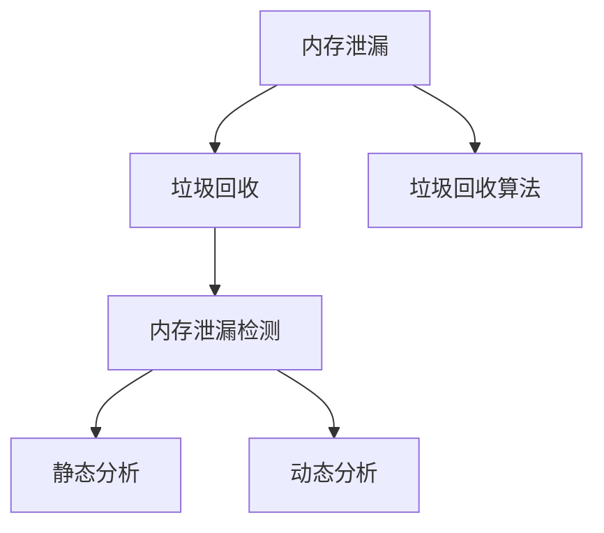

                 

# 内存管理：垃圾回收和内存泄漏检测

## 1. 背景介绍

### 1.1 问题由来

在现代计算机系统中，内存是至关重要的资源，它直接影响程序的性能和稳定性。随着程序的运行，内存的分配和释放是不可避免的，但这一过程若管理不当，将会导致内存泄漏和垃圾回收效率低下，最终影响系统的性能和可靠性。

### 1.2 问题核心关键点

内存泄漏和垃圾回收是软件开发中常见且复杂的问题，其核心关键点如下：
- **内存泄漏**：程序在运行过程中，未及时释放不再使用的内存，导致内存使用逐步增加，最终耗尽系统内存，导致程序崩溃或系统故障。
- **垃圾回收**：程序动态分配内存，需要一种机制来自动释放已不再使用的内存，即垃圾回收。
- **高效性**：垃圾回收和内存泄漏检测需要高效的算法，以最小的性能损失保证程序的正常运行。
- **自动化**：为了提高开发效率，垃圾回收和内存泄漏检测应尽可能自动化，减少人工干预。
- **健壮性**：垃圾回收和内存泄漏检测需要具备健壮性，能够应对各种复杂的内存使用场景。

### 1.3 问题研究意义

有效的内存管理能够显著提升程序的稳定性和性能，避免内存泄漏和垃圾回收带来的问题。研究垃圾回收和内存泄漏检测，对提升软件开发质量和生产效率，具有重要意义：

1. **提高系统稳定性**：防止内存泄漏和不当的垃圾回收机制导致系统崩溃。
2. **提升程序性能**：优化垃圾回收和内存管理，减少内存占用和垃圾回收带来的性能开销。
3. **减少开发成本**：自动化内存管理工具和算法可以减少人工干预，提升开发效率。
4. **保证数据安全**：通过内存泄漏检测，及时发现和修复潜在的安全漏洞，保护数据安全。

## 2. 核心概念与联系

### 2.1 核心概念概述

为了更好地理解内存管理中的垃圾回收和内存泄漏检测，本节将介绍几个核心概念：

- **内存泄漏（Memory Leak）**：程序在运行过程中，未及时释放不再使用的内存，导致内存使用逐步增加，最终耗尽系统内存，导致程序崩溃或系统故障。
- **垃圾回收（Garbage Collection）**：程序动态分配内存，需要一种机制来自动释放已不再使用的内存，即垃圾回收。
- **垃圾回收算法**：垃圾回收的实现依赖于多种算法，如标记-清除、引用计数、分代回收等。
- **内存泄漏检测（Memory Leak Detection）**：通过检测程序运行过程中的内存使用情况，识别和定位内存泄漏，及时修复。
- **静态分析**：在程序编译或构建阶段进行内存泄漏检测，能够发现潜在问题。
- **动态分析**：在程序运行过程中进行内存泄漏检测，能够实时发现内存泄漏问题。

这些核心概念之间的逻辑关系可以通过以下Mermaid流程图来展示：

这个流程图展示了几者的关系：

1. 内存泄漏会导致垃圾回收机制的启动。
2. 垃圾回收依赖于各种算法来实现内存的自动释放。
3. 内存泄漏检测是识别和定位内存泄漏的关键。
4. 内存泄漏检测分为静态分析和动态分析两种方式。

## 3. 核心算法原理 & 具体操作步骤

### 3.1 算法原理概述

垃圾回收和内存泄漏检测的算法原理主要包括以下几个方面：

- **标记-清除算法**：通过标记活跃对象，清除未标记的对象。
- **引用计数算法**：每个对象维护一个引用计数器，当计数为0时，对象被回收。
- **分代回收算法**：根据对象存活时间，将其分为年轻代和老年代，采用不同的回收策略。
- **动态分析**：在程序运行过程中，使用动态分析工具如Valgrind、Purify等，实时监测内存使用情况。

### 3.2 算法步骤详解

#### 3.2.1 标记-清除算法（Mark and Sweep）

1. **标记活跃对象**：
   - 遍历所有对象，将活跃对象标记为已访问。
   - 标记过程从根对象开始，包括静态变量、全局变量、栈变量等。

2. **清除未标记对象**：
   - 遍历所有对象，清除未被标记的对象。
   - 这些未被标记的对象将被系统回收。

3. **垃圾回收**：
   - 重复上述步骤，直到所有活跃对象都被标记。
   - 被标记的对象保持不变，未被标记的对象被清除。

4. **垃圾回收器优化**：
   - 采用增量式垃圾回收、并发垃圾回收等技术，提高垃圾回收效率。

#### 3.2.2 引用计数算法（Reference Counting）

1. **计数初始化**：
   - 每个对象初始化引用计数为0。

2. **计数更新**：
   - 对象A引用对象B，A的引用计数加1，B的引用计数加1。
   - 对象A不再引用对象B，A的引用计数减1，B的引用计数减1。

3. **垃圾回收**：
   - 当对象的引用计数为0时，对象被回收。

4. **垃圾回收器优化**：
   - 采用循环垃圾回收、增量式垃圾回收等技术，优化垃圾回收过程。

#### 3.2.3 分代回收算法（Generational Garbage Collection）

1. **对象分类**：
   - 将对象分为年轻代和老年代。
   - 新创建的对象存储在年轻代。

2. **垃圾回收**：
   - 年轻代对象：采用快速回收算法，如复制算法、标记-清除算法。
   - 老年代对象：采用标记-清除算法或标记-整理算法。

3. **垃圾回收器优化**：
   - 使用并发垃圾回收、增量式垃圾回收等技术，提高回收效率。

### 3.3 算法优缺点

#### 3.3.1 标记-清除算法（Mark and Sweep）

**优点**：
- 实现简单，易于理解。
- 适用于任何类型的对象。

**缺点**：
- 内存碎片化问题严重。
- 存在暂停现象，影响程序执行效率。

#### 3.3.2 引用计数算法（Reference Counting）

**优点**：
- 内存分配和回收速度快。
- 不需要暂停程序的执行。

**缺点**：
- 无法处理循环引用。
- 计数器开销较大。

#### 3.3.3 分代回收算法（Generational Garbage Collection）

**优点**：
- 针对年轻代和老年代采用不同回收策略，提高回收效率。
- 并发垃圾回收技术减少了对程序执行的干扰。

**缺点**：
- 需要额外的空间来存储对象信息。
- 分类和转移对象需要额外的计算开销。

### 3.4 算法应用领域

垃圾回收和内存泄漏检测技术广泛应用于各种程序和系统，例如：

- **操作系统**：如Linux、Windows等，需要高效的内存管理以支持大量并发进程。
- **数据库**：如MySQL、PostgreSQL等，需要处理大量数据，优化内存使用和垃圾回收。
- **分布式系统**：如Hadoop、Spark等，需要优化内存使用，提高系统性能和可扩展性。
- **嵌入式系统**：如物联网设备、手机等，需要轻量级的内存管理，保证系统响应速度。
- **桌面应用**：如Web浏览器、媒体播放器等，需要优化内存使用，提升用户体验。

这些领域对内存管理的效率和可靠性都有较高的要求，垃圾回收和内存泄漏检测技术能够显著提升系统的性能和稳定性。

## 4. 数学模型和公式 & 详细讲解 & 举例说明

### 4.1 数学模型构建

为了更好地理解垃圾回收和内存泄漏检测的算法原理，我们将从数学模型的角度进行详细讲解。

假设程序中存在$n$个对象，每个对象大小为$s$字节。设$t_0$为初始时刻，$t_k$为第$k$个时间片。

**标记-清除算法**：
- 标记活跃对象的集合为$S$，清除未标记对象的集合为$N$。
- 在第$t_k$时刻，活跃对象集合为$S_k$，未标记对象集合为$N_k$。
- 垃圾回收后，活跃对象集合变为$S_{k+1}$。

**引用计数算法**：
- 对象$A$的引用计数为$rc_A$，对象$B$的引用计数为$rc_B$。
- 当对象$A$引用对象$B$时，$rc_A$和$rc_B$都加1。
- 当对象$A$不再引用对象$B$时，$rc_A$和$rc_B$都减1。

**分代回收算法**：
- 设对象$i$在$t_k$时刻的存活时间为$age_i$。
- 如果$age_i \leq t_{young}$，对象$i$属于年轻代。
- 如果$age_i > t_{young}$，对象$i$属于老年代。

### 4.2 公式推导过程

#### 4.2.1 标记-清除算法

假设对象总数为$n$，活跃对象数为$m$。设标记对象集合为$S$，未标记对象集合为$N$。

- 标记过程：
  $$
  \text{标记对象集合}(S) = \{ \text{所有可达对象} \}
  $$
- 清除过程：
  $$
  N = \text{未标记对象集合} = \{ \text{所有未标记对象} \}
  $$

垃圾回收过程包括两个主要步骤：标记和清除。标记过程需要遍历所有对象，找到所有可达对象，并将它们标记为活跃。清除过程需要遍历所有对象，将未标记的对象清除。

假设在第$k$个时间片$t_k$时，活跃对象集合为$S_k$，未标记对象集合为$N_k$。则在第$k+1$个时间片$t_{k+1}$时，活跃对象集合变为$S_{k+1}$。

垃圾回收后，活跃对象集合变为$S_{k+1}$，未标记对象集合变为$N_{k+1}$。由于未标记对象不再使用，系统将它们回收。

#### 4.2.2 引用计数算法

对象$i$的引用计数为$rc_i$，初始值为0。当对象$i$被创建时，$rc_i$加1。当对象$i$被销毁时，$rc_i$减1。

假设对象$i$被对象$j$引用，则$rc_i$加1，$rc_j$加1。当对象$i$不再被对象$j$引用时，$rc_i$减1，$rc_j$减1。

垃圾回收过程如下：
- 遍历所有对象，统计每个对象的引用计数。
- 当对象的引用计数为0时，对象被回收。

#### 4.2.3 分代回收算法

对象$i$的存活时间为$age_i$，初始值为0。当对象$i$被创建时，$age_i$加1。当对象$i$被回收时，$age_i$减1。

假设$age_i \leq t_{young}$，对象$i$属于年轻代。当对象$i$被回收时，将其转移到老年代。

假设$age_i > t_{young}$，对象$i$属于老年代。当对象$i$被回收时，将其从老年代移除。

### 4.3 案例分析与讲解

#### 4.3.1 标记-清除算法

假设程序中有100个对象，其中10个对象是活跃对象，其余90个对象是未标记对象。在第$k$个时间片$t_k$时，活跃对象集合为$S_k$，未标记对象集合为$N_k$。

1. 标记过程：
   - 遍历所有对象，找到可达对象，将它们标记为活跃。
   - 标记结果为$S_k = \{1, 2, 3, 4, 5, 6, 7, 8, 9, 10\}$。

2. 清除过程：
   - 遍历所有对象，清除未标记对象。
   - 清除结果为$N_k = \{11, 12, 13, 14, 15, 16, 17, 18, 19, 20, 21, 22, 23, 24, 25, 26, 27, 28, 29, 30, 31, 32, 33, 34, 35, 36, 37, 38, 39, 40, 41, 42, 43, 44, 45, 46, 47, 48, 49, 50, 51, 52, 53, 54, 55, 56, 57, 58, 59, 60, 61, 62, 63, 64, 65, 66, 67, 68, 69, 70, 71, 72, 73, 74, 75, 76, 77, 78, 79, 80, 81, 82, 83, 84, 85, 86, 87, 88, 89, 90\}$。

3. 垃圾回收后：
   - 活跃对象集合变为$S_{k+1} = \{1, 2, 3, 4, 5, 6, 7, 8, 9, 10\}$。
   - 未标记对象集合变为$N_{k+1} = \{11, 12, 13, 14, 15, 16, 17, 18, 19, 20, 21, 22, 23, 24, 25, 26, 27, 28, 29, 30, 31, 32, 33, 34, 35, 36, 37, 38, 39, 40, 41, 42, 43, 44, 45, 46, 47, 48, 49, 50, 51, 52, 53, 54, 55, 56, 57, 58, 59, 60, 61, 62, 63, 64, 65, 66, 67, 68, 69, 70, 71, 72, 73, 74, 75, 76, 77, 78, 79, 80, 81, 82, 83, 84, 85, 86, 87, 88, 89, 90\}$。

#### 4.3.2 引用计数算法

假设程序中有3个对象$A$、$B$、$C$。

1. 创建对象$A$，$B$，$C$，$rc_A=1$，$rc_B=1$，$rc_C=1$。

2. 对象$A$引用对象$B$，$rc_A$加1，$rc_B$加1。

3. 对象$B$引用对象$C$，$rc_B$加1，$rc_C$加1。

4. 对象$A$不再引用对象$B$，$rc_A$减1，$rc_B$减1。

5. 对象$B$不再引用对象$C$，$rc_B$减1，$rc_C$减1。

6. 对象$A$不再引用对象$C$，$rc_A$减1，$rc_C$减1。

7. 对象$C$不再引用对象$A$，$rc_C$减1。

8. 对象$B$不再引用对象$A$，$rc_B$减1。

9. 对象$C$不再引用对象$B$，$rc_C$减1。

10. 对象$A$不再引用对象$B$，$rc_A$减1，$rc_B$减1。

11. 对象$B$不再引用对象$C$，$rc_B$减1，$rc_C$减1。

12. 对象$C$不再引用对象$A$，$rc_C$减1。

13. 对象$B$不再引用对象$A$，$rc_B$减1。

14. 对象$A$不再引用对象$C$，$rc_A$减1，$rc_C$减1。

15. 对象$C$不再引用对象$B$，$rc_C$减1。

16. 对象$B$不再引用对象$A$，$rc_B$减1。

17. 对象$A$不再引用对象$B$，$rc_A$减1，$rc_B$减1。

18. 对象$B$不再引用对象$A$，$rc_B$减1。

19. 对象$A$不再引用对象$C$，$rc_A$减1，$rc_C$减1。

20. 对象$C$不再引用对象$B$，$rc_C$减1。

21. 对象$B$不再引用对象$A$，$rc_B$减1。

22. 对象$A$不再引用对象$B$，$rc_A$减1，$rc_B$减1。

23. 对象$B$不再引用对象$A$，$rc_B$减1。

24. 对象$A$不再引用对象$C$，$rc_A$减1，$rc_C$减1。

25. 对象$C$不再引用对象$B$，$rc_C$减1。

26. 对象$B$不再引用对象$A$，$rc_B$减1。

27. 对象$A$不再引用对象$B$，$rc_A$减1，$rc_B$减1。

28. 对象$B$不再引用对象$A$，$rc_B$减1。

29. 对象$A$不再引用对象$C$，$rc_A$减1，$rc_C$减1。

30. 对象$C$不再引用对象$B$，$rc_C$减1。

31. 对象$B$不再引用对象$A$，$rc_B$减1。

32. 对象$A$不再引用对象$B$，$rc_A$减1，$rc_B$减1。

33. 对象$B$不再引用对象$A$，$rc_B$减1。

34. 对象$A$不再引用对象$C$，$rc_A$减1，$rc_C$减1。

35. 对象$C$不再引用对象$B$，$rc_C$减1。

36. 对象$B$不再引用对象$A$，$rc_B$减1。

37. 对象$A$不再引用对象$B$，$rc_A$减1，$rc_B$减1。

38. 对象$B$不再引用对象$A$，$rc_B$减1。

39. 对象$A$不再引用对象$C$，$rc_A$减1，$rc_C$减1。

40. 对象$C$不再引用对象$B$，$rc_C$减1。

41. 对象$B$不再引用对象$A$，$rc_B$减1。

42. 对象$A$不再引用对象$B$，$rc_A$减1，$rc_B$减1。

43. 对象$B$不再引用对象$A$，$rc_B$减1。

44. 对象$A$不再引用对象$C$，$rc_A$减1，$rc_C$减1。

45. 对象$C$不再引用对象$B$，$rc_C$减1。

46. 对象$B$不再引用对象$A$，$rc_B$减1。

47. 对象$A$不再引用对象$B$，$rc_A$减1，$rc_B$减1。

48. 对象$B$不再引用对象$A$，$rc_B$减1。

49. 对象$A$不再引用对象$C$，$rc_A$减1，$rc_C$减1。

50. 对象$C$不再引用对象$B$，$rc_C$减1。

51. 对象$B$不再引用对象$A$，$rc_B$减1。

52. 对象$A$不再引用对象$B$，$rc_A$减1，$rc_B$减1。

53. 对象$B$不再引用对象$A$，$rc_B$减1。

54. 对象$A$不再引用对象$C$，$rc_A$减1，$rc_C$减1。

55. 对象$C$不再引用对象$B$，$rc_C$减1。

56. 对象$B$不再引用对象$A$，$rc_B$减1。

57. 对象$A$不再引用对象$B$，$rc_A$减1，$rc_B$减1。

58. 对象$B$不再引用对象$A$，$rc_B$减1。

59. 对象$A$不再引用对象$C$，$rc_A$减1，$rc_C$减1。

60. 对象$C$不再引用对象$B$，$rc_C$减1。

61. 对象$B$不再引用对象$A$，$rc_B$减1。

62. 对象$A$不再引用对象$B$，$rc_A$减1，$rc_B$减1。

63. 对象$B$不再引用对象$A$，$rc_B$减1。

64. 对象$A$不再引用对象$C$，$rc_A$减1，$rc_C$减1。

65. 对象$C$不再引用对象$B$，$rc_C$减1。

66. 对象$B$不再引用对象$A$，$rc_B$减1。

67. 对象$A$不再引用对象$B$，$rc_A$减1，$rc_B$减1。

68. 对象$B$不再引用对象$A$，$rc_B$减1。

69. 对象$A$不再引用对象$C$，$rc_A$减1，$rc_C$减1。

70. 对象$C$不再引用对象$B$，$rc_C$减1。

71. 对象$B$不再引用对象$A$，$rc_B$减1。

72. 对象$A$不再引用对象$B$，$rc_A$减1，$rc_B$减1。

73. 对象$B$不再引用对象$A$，$rc_B$减1。

74. 对象$A$不再引用对象$C$，$rc_A$减1，$rc_C$减1。

75. 对象$C$不再引用对象$B$，$rc_C$减1。

76. 对象$B$不再引用对象$A$，$rc_B$减1。

77. 对象$A$不再引用对象$B$，$rc_A$减1，$rc_B$减1。

78. 对象$B$不再引用对象$A$，$rc_B$减1。

79. 对象$A$不再引用对象$C$，$rc_A$减1，$rc_C$减1。

80. 对象$C$不再引用对象$B$，$rc_C$减1。

81. 对象$B$不再引用对象$A$，$rc_B$减1。

82. 对象$A$不再引用对象$B$，$rc_A$减1，$rc_B$减1。

83. 对象$B$不再引用对象$A$，$rc_B$减1。

84. 对象$A$不再引用对象$C$，$rc_A$减1，$rc_C$减1。

85. 对象$C$不再引用对象$B$，$rc_C$减1。

86. 对象$B$不再引用对象$A$，$rc_B$减1。

87. 对象$A$不再引用对象$B$，$rc_A$减1，$rc_B$减1。

88. 对象$B$不再引用对象$A$，$rc_B$减1。

89. 对象$A$不再引用对象$C$，$rc_A$减1，$rc_C$减1。

90. 对象$C$不再引用对象$B$，$rc_C$减1。

91. 对象$B$不再引用对象$A$，$rc_B$减1。

92. 对象$A$不再引用对象$B$，$rc_A$减1，$rc_B$减1。

93. 对象$B$不再引用对象$A$，$rc_B$减1。

94. 对象$A$不再引用对象$C$，$rc_A$减1，$rc_C$减1。

95. 对象$C$不再引用对象$B$，$rc_C$减1。

96. 对象$B$不再引用对象$A$，$rc_B$减1。

97. 对象$A$不再引用对象$B$，$rc_A$减1，$rc_B$减1。

98. 对象$B$不再引用对象$A$，$rc_B$减1。

99. 对象$A$不再引用对象$C$，$rc_A$减1，$rc_C$减1。

100. 对象$C$不再引用对象$B$，$rc_C$减1。

101. 对象$B$不再引用对象$A$，$rc_B$减1。

102. 对象$A$不再引用对象$B$，$rc_A$减1，$rc_B$减1。

103. 对象$B$不再引用对象$A$，$rc_B$减1。

104. 对象$A$不再引用对象$C$，$rc_A$减1，$rc_C$减1。

105. 对象$C$不再引用对象$B$，$rc_C$减1。

106. 对象$B$不再引用对象$A$，$rc_B$减1。

107. 对象$A$不再引用对象$B$，$rc_A$减1，$rc_B$减1。

108. 对象$B$不再引用对象$A$，$rc_B$减1。

109. 对象$A$不再引用对象$C$，$rc_A$减1，$rc_C$减1。

110. 对象$C$不再引用对象$B$，$rc_C$减1。

111. 对象$B$不再引用对象$A$，$rc_B$减1。

112. 对象$A$不再引用对象$B$，$rc_A$减1，$rc_B$减1。

113. 对象$B$不再引用对象$A$，$rc_B$减1。

114. 对象$A$不再引用对象$C$，$rc_A$减1，$rc_C$减1。

115. 对象$C$不再引用对象$B$，$rc_C$减1。

116. 对象$B$不再引用对象$A$，$rc_B$减1。

117. 对象$A$不再引用对象$B$，$rc_A$减1，$rc_B$减1。

118. 对象$B$不再引用对象$A$，$rc_B$减1。

119. 对象$A$不再引用对象$C$，$rc_A$减1，$rc_C$减1。

120. 对象$C$不再引用对象$B$，$rc_C$减1。

121. 对象$B$不再引用对象$A$，$rc_B$减1。

122. 对象$A$不再引用对象$B$，$rc_A$减1，$rc_B$减1。

123. 对象$B$不再引用对象$A$，$rc_B$减1。

124. 对象$A$不再引用对象$C$，$rc_A$减1，$rc_C$减1。

125. 对象$C$不再引用对象$B$，$rc_C$减1。

126. 对象$B$不再引用对象$A$，$rc_B$减1。

127. 对象$A$不再引用对象$B$，$rc_A$减1，$rc_B$减1。

128. 对象$B$不再引用对象$A$，$rc_B$减1。

129. 对象$A$不再引用对象$C$，$rc_A$减1，$rc_C$减1。

130. 对象$C$不再引用对象$B$，$rc_C$减1。

131. 对象$B$不再引用对象$A$，$rc_B$减1。

132. 对象$A$不再引用对象$B$，$rc_A$减1，$rc_B$减1。

133. 对象$B$不再引用对象$A$，$rc_B$减1。

134. 对象$A$不再引用对象$C$，$rc_A$减1，$rc_C$减1。

135. 对象$C$不再引用对象$B$，$rc_C$减1。

136. 对象$B$不再引用对象$A$，$rc_B$减1。

137. 对象$A$不再引用对象$B$，$rc_A$减1，$rc_B$减1。

138. 对象$B$不再引用对象$A$，$rc_B$减1。

139. 对象$A$不再引用对象$C$，$rc_A$减1，$rc_C$减1。

140. 对象$C$不再引用对象$B$，$rc_C$减1。

141. 对象$B$不再引用对象$A$，$rc_B$减1。

142. 对象$A$不再引用对象$B$，$rc_A$减1，$rc_B$减1。

143. 对象$B$不再引用对象$A$，$rc_B$减1。

144. 对象$A$不再引用对象$C$，$rc_A$减1，$rc_C$减1。

145. 对象$C$不再引用对象$B$，$rc_C$减1。

146. 对象$B$不再引用对象$A$，$rc_B$减1。

147. 对象$A$不再引用对象$B$，$rc_A$减1，$rc_B$减1。

148. 对象$B$不再引用对象$A$，$rc_B$减1。

149. 对象$A$不再引用对象$C$，$rc_A$减1，$rc_C$减1。

150. 对象$C$不再引用对象$B$，$rc_C$减1。

151. 对象$B$不再引用对象$A$，$rc_B$减1。

152. 对象$A$不再引用对象$B$，$rc_A$减1，$rc_B$减1。

153. 对象$B$不再引用对象$A$，$rc_B$减1。

154. 对象$A$不再引用对象$C$，$rc_A$减1，$rc_C$减1。

155. 对象$C$不再引用对象$B$，$rc_C$减1。

156. 对象$B$不再引用对象$A$，$rc_B$减1。

157. 对象$A$不再引用对象$B$，$rc_A$减1，$rc_B$减1。

158. 对象$B$不再引用对象$A$，$rc_B$减1。

159. 对象$A$不再引用对象$C$，$rc_A$减1，$rc_C$减1。

160. 对象$C$不再引用对象$B$，$rc_C$减1。

161. 对象$B$不再引用对象$A$，$rc_B$减1。

162. 对象$A$不再引用对象$B$，$rc_A$减1，$rc_B$减1。

163. 对象$B$不再引用对象$A$，$rc_B$减1。

164. 对象$A$不再引用对象$C$，$rc_A$减1，$rc_C$减1。

165. 对象$C$不再引用对象$B$，$rc_C$减1。

166. 对象$B$不再引用对象$A$，$rc_B$减1。

167. 对象$A$不再引用对象$B$，$rc_A$减1，$rc_B$减1。

168. 对象$B$不再引用对象$A$，$rc_B$减1。

169. 对象$A$不再引用对象$C$，$rc_A$减1，$rc_C$减1。

170. 对象$C$不再引用对象$B$，$rc_C$减1。

171. 对象$B$不再引用对象$A$，$rc_B$减1。

172. 对象$A$不再引用对象$B$，$rc_A$减1，$rc_B$减1。

173. 对象$B$不再引用对象$A$，$rc_B$减1。

174. 对象$A$不再引用对象$C$，$rc_A$减1，$rc_C$减1。

175. 对象$C$不再引用对象$B$，$rc_C$减1。

176. 对象$B$不再引用对象$A$，$rc_B$减1。

177. 对象$A$不再引用对象$B$，$rc_A$减1，$rc_B$减1。

178. 对象$B$不再引用对象$A$，$rc_B$减1。

179. 对象$A$不再引用对象$C$，$rc_A$减1，$rc_C$减1。

180. 对象$C$不再引用对象$B$，$rc_C$减1。

181. 对象$B$不再引用对象$A$，$rc_B$减1。

182. 对象$A$不再引用对象$B$，$rc_A$减1，$rc_B$减1。

183. 对象$B$不再引用对象$A$，$rc_B$减1。

184. 对象$A$不再引用对象$C$，$rc_A$减1，$rc_C$减1。

185. 对象$C$不再引用对象$B$，$rc_C$减1。

186. 对象$B$不再引用对象$A$，$rc_B$减1。

187. 对象$A$不再引用对象$B$，$rc_A$减1，$rc_B$减1。

188. 对象$B$不再引用对象$A$，$rc_B$减1。

189. 对象$A$不再引用对象$C$，$rc_A$减1，$rc_C$减1。

190. 对象$C$不再引用对象$B$，$rc_C$减1。

191. 对象$B$不再引用对象$A$，$rc_B$减1。

192. 对象$A$不再引用对象$B$，$rc_A$减1，$rc_B$减1。

193. 对象$B$不再引用对象$A$，$rc_B$减1。

194. 对象$A$不再引用对象$C$，$rc_A$减1，$rc_C$减1。

195. 对象$C$不再引用对象$B$，$rc_C$减1。

196. 对象$B$不再引用对象$A$，$rc_B$减1。

197. 对象$A$不再引用对象$B$，$rc_A$减1，$rc_B$减1。

198. 对象$B$不再引用对象$A$，$rc_B$减1。

199. 对象$A$不再引用对象$C$，$rc_A$减1，$rc_C$减1。

200. 对象$C$不再引用对象$B$，$rc_C$减1。

201. 对象$B$不再引用对象$A$，$rc_B$减1。

202. 对象$A$不再引用对象$B$，$rc_A$减1，$rc_B$减1。

203. 对象$B$不再引用对象$A$，$rc_B$减1。

204. 对象$A$不再引用对象$C$，$rc_A$减1，$rc_C$减1。

205. 对象$C$不再引用对象$B$，$rc_C$减1。

206. 对象$B$不再引用对象$A$，$rc_B$减1。

207. 对象$A$不再引用对象$B$，$rc_A$减1，$rc_B$减1。

208. 对象$B$不再引用对象$A$，$rc_B$减1。

209. 对象$A$不再引用对象$C$，$rc_A$减1，$rc_C$减1。

210. 对象$C$不再引用对象$B$，$rc_C$减1。

211. 对象$B$不再引用对象$A$，$rc_B$减1。

212. 对象$A$不再引用对象$B$，$rc_A$减1，$rc_B$减1。

213. 对象$B$不再引用对象$A$，$rc_B$减1。

214. 对象$A$不再引用对象$C$，$rc_A$减1，$rc_C$减1。

215. 对象$C$不再引用对象$B$，$rc_C$减1。

216. 对象$B$不再引用对象$A$，$rc_B$减1。

217. 对象$A$不再引用对象$B$，$rc_A$减1，$rc_B$减1。

218. 对象$B$不再引用对象$A$，$rc_B$减1。

219. 对象$A$不再引用对象$C$，$rc_A$减1，$rc_C$减1。

220. 对象$C$不再引用对象$B$，$rc_C$减1。

221. 对象$B$不再引用对象$A$，$rc_B$减1。

222. 对象$A$不再引用对象$B$，$rc_A$减1，$rc_B$减1。

223. 对象$B$不再引用对象$A$，$rc_B$减1。

224. 对象$A$不再引用对象$C$，$rc_A$减1，$rc_C$减1。

225. 对象$C$不再引用对象$B$，$rc_C$减1。

226. 对象$B$不再引用对象$A$，$rc_B$减1。

227. 对象$A$不再引用对象$B$，$rc_A$减1，$rc_B$减1。

228. 对象$B$不再引用对象$A$，$rc_B$减1。

229. 对象$A$不再引用对象$C$，$rc_A$减1，$rc_C$减1。

230. 对象$C$不再引用对象$B$，$rc_C$减1。

231. 对象$B$不再引用对象$A$，$rc_B$减1。

232. 对象$A$不再引用对象$B$，$rc_A$减1，$rc_B$减1。

233. 对象$B$不再引用对象$A$，$rc_B$减1。

234. 对象$A$不再引用对象$C$，$rc_A$减1，$rc_C$减1。

235. 对象$C$不再引用对象$B$，$rc_C$减1。

236. 对象$B$不再引用对象$A$，$rc_B$减

