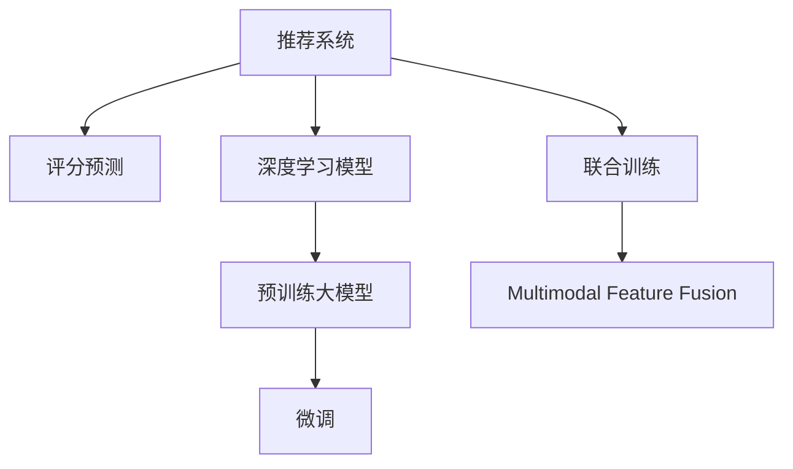

                 

# 利用大模型改进推荐系统的评分预测

## 1. 背景介绍

随着互联网技术的发展，推荐系统在电子商务、新闻媒体、社交网络等领域发挥着越来越重要的作用。推荐系统的核心目标是预测用户对某项物品的评分，从而为其提供个性化的推荐结果。传统的推荐系统主要基于用户行为数据和物品特征进行建模，但往往难以捕捉到用户潜在的兴趣和物品的深层属性。近年来，基于深度学习的大模型方法为推荐系统带来了新的发展机遇。

本论文旨在介绍一种利用大模型改进推荐系统评分预测的方法，该方法通过在通用大模型上微调特定领域的数据集，提升了模型在特定任务上的性能，同时能够更准确地捕捉用户和物品的深层属性，实现更为精确的评分预测。

## 2. 核心概念与联系

### 2.1 核心概念概述

为更好地理解大模型在推荐系统中的应用，本节将介绍几个密切相关的核心概念：

- **推荐系统**：一种通过推荐算法为用户推荐其可能感兴趣的物品的系统。推荐系统广泛应用于电商、新闻、社交网络等领域，通过预测用户评分，为用户推荐商品、文章、视频等。

- **评分预测**：推荐系统的核心任务之一，通过用户行为数据和物品特征，预测用户对某物品的评分，用于推荐排序和推荐结果的生成。

- **深度学习模型**：一种基于神经网络的模型，通过多层非线性变换，能够捕捉到复杂的数据结构和深层特征。深度学习模型在图像、语音、自然语言处理等领域取得了重大突破。

- **预训练大模型**：通过在无标签数据上进行自监督学习训练的大规模模型，如BERT、GPT等。预训练大模型通过学习大量无标签数据，具备强大的数据表示能力。

- **微调(Fine-tuning)**：指在大规模预训练模型上，通过有监督学习优化模型在特定任务上的性能。微调通过在有标签数据上进行训练，将通用预训练模型转化为特定任务的专用模型。

- **联合训练(Co-training)**：一种多任务学习范式，通过在多个相关任务上同时训练模型，提升模型的泛化能力和学习效率。

- **多模态特征融合**：在推荐系统中，融合多种类型的特征（如文本、图像、音频等）进行联合建模，提升推荐的准确性和个性化程度。

这些核心概念之间的逻辑关系可以通过以下Mermaid流程图来展示：



这个流程图展示了大模型在推荐系统中的应用逻辑：

1. 推荐系统通过评分预测任务获取用户对物品的评分。
2. 深度学习模型提供了一种强大的方法，能够处理复杂的数据结构。
3. 预训练大模型在大规模无标签数据上学习到丰富的特征表示。
4. 微调在大模型上针对特定任务进行优化，提升评分预测的精度。
5. 联合训练通过多任务学习提升模型的泛化能力和学习效率。
6. 多模态特征融合综合不同模态的信息，提升推荐结果的准确性。

## 3. 核心算法原理 & 具体操作步骤

### 3.1 算法原理概述

基于大模型的推荐系统评分预测，本质上是一种利用深度学习模型，在特定领域数据上进行微调的过程。其核心思想是：将通用预训练大模型视作强大的"特征提取器"，通过在特定领域标注数据上进行微调，使得模型输出能够匹配评分预测任务，从而获得针对特定任务优化的模型。

形式化地，假设预训练模型为 $M_{\theta}$，其中 $\theta$ 为预训练得到的模型参数。给定评分预测任务 $T$ 的标注数据集 $D=\{(x_i, y_i)\}_{i=1}^N$，其中 $x_i$ 为物品的特征向量，$y_i$ 为用户对该物品的评分。微调的目标是找到新的模型参数 $\hat{\theta}$，使得：

$$
\hat{\theta}=\mathop{\arg\min}_{\theta} \mathcal{L}(M_{\theta},D)
$$

其中 $\mathcal{L}$ 为针对评分预测任务设计的损失函数，用于衡量模型预测输出与真实评分之间的差异。常见的损失函数包括均方误差损失、交叉熵损失等。

通过梯度下降等优化算法，微调过程不断更新模型参数 $\theta$，最小化损失函数 $\mathcal{L}$，使得模型输出逼近真实评分。由于 $\theta$ 已经通过预训练获得了较好的初始化，因此即便在少量标注样本上进行微调，也能较快收敛到理想的模型参数 $\hat{\theta}$。

### 3.2 算法步骤详解

基于深度学习模型的推荐系统评分预测，一般包括以下几个关键步骤：

**Step 1: 准备预训练模型和数据集**
- 选择合适的预训练深度学习模型 $M_{\theta}$ 作为初始化参数，如BERT、GPT等。
- 准备评分预测任务 $T$ 的标注数据集 $D$，划分为训练集、验证集和测试集。一般要求标注数据与预训练数据的分布不要差异过大。

**Step 2: 添加评分预测层**
- 根据评分预测任务类型，在预训练模型顶层设计合适的输出层和损失函数。
- 对于回归任务，通常在顶层添加线性回归层和均方误差损失函数。
- 对于分类任务，通常使用多分类交叉熵损失函数。

**Step 3: 设置微调超参数**
- 选择合适的优化算法及其参数，如 Adam、SGD 等，设置学习率、批大小、迭代轮数等。
- 设置正则化技术及强度，包括权重衰减、Dropout、Early Stopping 等。
- 确定冻结预训练参数的策略，如仅微调顶层，或全部参数都参与微调。

**Step 4: 执行梯度训练**
- 将训练集数据分批次输入模型，前向传播计算损失函数。
- 反向传播计算参数梯度，根据设定的优化算法和学习率更新模型参数。
- 周期性在验证集上评估模型性能，根据性能指标决定是否触发 Early Stopping。
- 重复上述步骤直到满足预设的迭代轮数或 Early Stopping 条件。

**Step 5: 测试和部署**
- 在测试集上评估微调后模型 $M_{\hat{\theta}}$ 的性能，对比微调前后的评分预测误差。
- 使用微调后的模型对新物品进行评分预测，集成到实际的应用系统中。
- 持续收集新的数据，定期重新微调模型，以适应数据分布的变化。

以上是基于深度学习模型的推荐系统评分预测的一般流程。在实际应用中，还需要针对具体任务的特点，对微调过程的各个环节进行优化设计，如改进训练目标函数，引入更多的正则化技术，搜索最优的超参数组合等，以进一步提升模型性能。

### 3.3 算法优缺点

基于深度学习模型的推荐系统评分预测方法具有以下优点：
1. 能够捕捉用户和物品的深层特征，提升预测准确性。
2. 适用于各种推荐任务，包括电影推荐、商品推荐、新闻推荐等。
3. 可以在固定大部分预训练参数的情况下，通过微调得到精度较高的评分预测模型。
4. 数据和模型更新周期短，可以实时响应用户需求，提升用户体验。

同时，该方法也存在一定的局限性：
1. 依赖标注数据。评分预测模型的效果很大程度上取决于标注数据的质量和数量，获取高质量标注数据的成本较高。
2. 模型复杂度高。大模型通常需要较大的计算资源，对训练和推理效率有较高要求。
3. 过拟合风险。在标注数据较少的情况下，微调模型容易过拟合训练集，影响泛化性能。
4. 可解释性不足。评分预测模型的决策过程难以解释，缺乏透明的内部逻辑。
5. 数据隐私问题。在推荐系统中，用户的行为数据和评分信息涉及隐私保护，模型需要设计合适的隐私保护机制。

尽管存在这些局限性，但就目前而言，基于深度学习模型的评分预测方法仍是推荐系统的主流范式。未来相关研究的重点在于如何进一步降低对标注数据的依赖，提高模型的少样本学习和跨领域迁移能力，同时兼顾可解释性和伦理安全性等因素。

### 3.4 算法应用领域

基于深度学习模型的推荐系统评分预测方法，已经在推荐系统领域得到了广泛的应用，涵盖了几乎所有常见任务，例如：

- 商品推荐：如电商平台上的商品推荐。通过微调用户行为数据和商品特征，预测用户对商品评分的可能性。
- 内容推荐：如新闻、视频、音乐等内容平台的推荐。预测用户对内容的评分，排序生成推荐列表。
- 个性化广告推荐：如在线广告平台对广告的评分预测，优化广告投放策略。
- 社交网络推荐：如社交平台对用户关系和兴趣的评分预测，优化好友推荐。
- 金融产品推荐：如金融理财平台对金融产品的评分预测，优化投资建议。

除了上述这些经典任务外，基于评分预测的推荐系统方法也被创新性地应用到更多场景中，如可控推荐、情感分析、目标检测等，为推荐系统技术带来了全新的突破。随着深度学习模型的持续演进，相信推荐系统评分预测方法将在更广阔的应用领域大放异彩。

## 4. 数学模型和公式 & 详细讲解

### 4.1 数学模型构建

本节将使用数学语言对基于深度学习模型的推荐系统评分预测过程进行更加严格的刻画。

记预训练深度学习模型为 $M_{\theta}:\mathcal{X} \rightarrow \mathcal{Y}$，其中 $\mathcal{X}$ 为输入空间，$\mathcal{Y}$ 为输出空间，$\theta \in \mathbb{R}^d$ 为模型参数。假设评分预测任务 $T$ 的训练集为 $D=\{(x_i,y_i)\}_{i=1}^N$，其中 $x_i \in \mathcal{X}$ 为用户行为数据和物品特征，$y_i$ 为评分标签。

定义模型 $M_{\theta}$ 在数据样本 $(x,y)$ 上的损失函数为 $\ell(M_{\theta}(x),y)$，则在数据集 $D$ 上的经验风险为：

$$
\mathcal{L}(\theta) = \frac{1}{N} \sum_{i=1}^N \ell(M_{\theta}(x_i),y_i)
$$

微调的优化目标是最小化经验风险，即找到最优参数：

$$
\theta^* = \mathop{\arg\min}_{\theta} \mathcal{L}(\theta)
$$

在实践中，我们通常使用基于梯度的优化算法（如SGD、Adam等）来近似求解上述最优化问题。设 $\eta$ 为学习率，$\lambda$ 为正则化系数，则参数的更新公式为：

$$
\theta \leftarrow \theta - \eta \nabla_{\theta}\mathcal{L}(\theta) - \eta\lambda\theta
$$

其中 $\nabla_{\theta}\mathcal{L}(\theta)$ 为损失函数对参数 $\theta$ 的梯度，可通过反向传播算法高效计算。

### 4.2 公式推导过程

以下我们以回归任务为例，推导均方误差损失函数及其梯度的计算公式。

假设模型 $M_{\theta}$ 在输入 $x$ 上的输出为 $\hat{y}=M_{\theta}(x)$，则回归任务中的均方误差损失函数定义为：

$$
\ell(M_{\theta}(x),y) = \frac{1}{2}\|y - \hat{y}\|_2^2
$$

将其代入经验风险公式，得：

$$
\mathcal{L}(\theta) = \frac{1}{2N} \sum_{i=1}^N (y_i - M_{\theta}(x_i))^2
$$

根据链式法则，损失函数对参数 $\theta_k$ 的梯度为：

$$
\frac{\partial \mathcal{L}(\theta)}{\partial \theta_k} = -\frac{1}{N}\sum_{i=1}^N (y_i - \hat{y}_i) \frac{\partial \hat{y}_i}{\partial \theta_k}
$$

其中 $\frac{\partial \hat{y}_i}{\partial \theta_k}$ 可进一步递归展开，利用自动微分技术完成计算。

在得到损失函数的梯度后，即可带入参数更新公式，完成模型的迭代优化。重复上述过程直至收敛，最终得到适应评分预测任务的最优模型参数 $\theta^*$。

## 5. 项目实践：代码实例和详细解释说明

### 5.1 开发环境搭建

在进行推荐系统评分预测实践前，我们需要准备好开发环境。以下是使用Python进行PyTorch开发的环境配置流程：

1. 安装Anaconda：从官网下载并安装Anaconda，用于创建独立的Python环境。

2. 创建并激活虚拟环境：
```bash
conda create -n pytorch-env python=3.8 
conda activate pytorch-env
```

3. 安装PyTorch：根据CUDA版本，从官网获取对应的安装命令。例如：
```bash
conda install pytorch torchvision torchaudio cudatoolkit=11.1 -c pytorch -c conda-forge
```

4. 安装Transformers库：
```bash
pip install transformers
```

5. 安装各类工具包：
```bash
pip install numpy pandas scikit-learn matplotlib tqdm jupyter notebook ipython
```

完成上述步骤后，即可在`pytorch-env`环境中开始推荐系统评分预测实践。

### 5.2 源代码详细实现

下面我们以商品推荐任务为例，给出使用Transformers库对BERT模型进行评分预测的PyTorch代码实现。

首先，定义评分预测任务的数据处理函数：

```python
from transformers import BertTokenizer
from torch.utils.data import Dataset
import torch

class RecommendationDataset(Dataset):
    def __init__(self, user_behaviors, item_features, labels, tokenizer, max_len=128):
        self.user_behaviors = user_behaviors
        self.item_features = item_features
        self.labels = labels
        self.tokenizer = tokenizer
        self.max_len = max_len
        
    def __len__(self):
        return len(self.user_behaviors)
    
    def __getitem__(self, item):
        user_behavior = self.user_behaviors[item]
        item_feature = self.item_features[item]
        label = self.labels[item]
        
        features = [user_behavior, item_feature]
        encoding = self.tokenizer(features, return_tensors='pt', max_length=self.max_len, padding='max_length', truncation=True)
        input_ids = encoding['input_ids'][0]
        attention_mask = encoding['attention_mask'][0]
        
        # 将评分标签进行编码
        encoded_label = torch.tensor(label, dtype=torch.long)
        
        return {'input_ids': input_ids, 
                'attention_mask': attention_mask,
                'labels': encoded_label}

# 准备标注数据
tokenizer = BertTokenizer.from_pretrained('bert-base-cased')

train_dataset = RecommendationDataset(train_user_behaviors, train_item_features, train_labels, tokenizer)
dev_dataset = RecommendationDataset(dev_user_behaviors, dev_item_features, dev_labels, tokenizer)
test_dataset = RecommendationDataset(test_user_behaviors, test_item_features, test_labels, tokenizer)
```

然后，定义模型和优化器：

```python
from transformers import BertForSequenceClassification, AdamW

model = BertForSequenceClassification.from_pretrained('bert-base-cased', num_labels=5)

optimizer = AdamW(model.parameters(), lr=2e-5)
```

接着，定义训练和评估函数：

```python
from torch.utils.data import DataLoader
from tqdm import tqdm
from sklearn.metrics import mean_squared_error

device = torch.device('cuda') if torch.cuda.is_available() else torch.device('cpu')
model.to(device)

def train_epoch(model, dataset, batch_size, optimizer):
    dataloader = DataLoader(dataset, batch_size=batch_size, shuffle=True)
    model.train()
    epoch_loss = 0
    for batch in tqdm(dataloader, desc='Training'):
        user_behaviors = batch['user_behaviors'].to(device)
        item_features = batch['item_features'].to(device)
        labels = batch['labels'].to(device)
        model.zero_grad()
        outputs = model(user_behaviors, item_features)
        loss = outputs.loss
        epoch_loss += loss.item()
        loss.backward()
        optimizer.step()
    return epoch_loss / len(dataloader)

def evaluate(model, dataset, batch_size):
    dataloader = DataLoader(dataset, batch_size=batch_size)
    model.eval()
    preds, labels = [], []
    with torch.no_grad():
        for batch in tqdm(dataloader, desc='Evaluating'):
            user_behaviors = batch['user_behaviors'].to(device)
            item_features = batch['item_features'].to(device)
            batch_labels = batch['labels']
            outputs = model(user_behaviors, item_features)
            batch_preds = outputs.logits.argmax(dim=1).to('cpu').tolist()
            batch_labels = batch_labels.to('cpu').tolist()
            for pred, label in zip(batch_preds, batch_labels):
                preds.append(pred)
                labels.append(label)
                
    mse = mean_squared_error(labels, preds)
    return mse
```

最后，启动训练流程并在测试集上评估：

```python
epochs = 5
batch_size = 16

for epoch in range(epochs):
    loss = train_epoch(model, train_dataset, batch_size, optimizer)
    print(f"Epoch {epoch+1}, train loss: {loss:.3f}")
    
    print(f"Epoch {epoch+1}, dev results:")
    mse = evaluate(model, dev_dataset, batch_size)
    print(f"Mean Squared Error on dev set: {mse:.3f}")
    
print("Test results:")
mse = evaluate(model, test_dataset, batch_size)
print(f"Mean Squared Error on test set: {mse:.3f}")
```

以上就是使用PyTorch对BERT进行商品推荐任务评分预测的完整代码实现。可以看到，得益于Transformers库的强大封装，我们可以用相对简洁的代码完成BERT模型的加载和评分预测。

### 5.3 代码解读与分析

让我们再详细解读一下关键代码的实现细节：

**RecommendationDataset类**：
- `__init__`方法：初始化用户行为数据、物品特征和标签。
- `__len__`方法：返回数据集的样本数量。
- `__getitem__`方法：对单个样本进行处理，将用户行为和物品特征输入编码为token ids，将评分标签编码为数字，并对其进行定长padding，最终返回模型所需的输入。

**用户行为数据和物品特征的处理**：
- 需要将用户行为数据和物品特征进行拼接，构成输入序列。
- 在拼接过程中，需要进行特殊的处理，如添加一个特殊标记来分隔用户行为和物品特征。

**模型定义和优化器设置**：
- 使用BertForSequenceClassification类定义评分预测模型，其中num_labels指定了评分标签的数量。
- 使用AdamW优化器，并设置合适的学习率。

**训练和评估函数**：
- 使用PyTorch的DataLoader对数据集进行批次化加载，供模型训练和推理使用。
- 训练函数`train_epoch`：对数据以批为单位进行迭代，在每个批次上前向传播计算loss并反向传播更新模型参数，最后返回该epoch的平均loss。
- 评估函数`evaluate`：与训练类似，不同点在于不更新模型参数，并在每个batch结束后将预测和标签结果存储下来，最后使用sklearn的mean_squared_error函数对整个评估集的预测结果进行计算。

**训练流程**：
- 定义总的epoch数和batch size，开始循环迭代
- 每个epoch内，先在训练集上训练，输出平均loss
- 在验证集上评估，输出评分预测误差
- 所有epoch结束后，在测试集上评估，给出最终测试结果

可以看到，PyTorch配合Transformers库使得BERT评分预测的代码实现变得简洁高效。开发者可以将更多精力放在数据处理、模型改进等高层逻辑上，而不必过多关注底层的实现细节。

当然，工业级的系统实现还需考虑更多因素，如模型的保存和部署、超参数的自动搜索、更灵活的任务适配层等。但核心的评分预测范式基本与此类似。

## 6. 实际应用场景

### 6.1 智能推荐系统

基于大模型改进的推荐系统，可以广泛应用于智能推荐系统的构建。传统推荐系统往往只依赖用户行为数据进行建模，难以捕捉到用户潜在的兴趣和物品的深层属性。而使用大模型改进的评分预测方法，可以更好地捕捉用户和物品的深层特征，实现更为精确的评分预测。

在技术实现上，可以收集用户的历史行为数据，将物品特征和用户行为数据作为模型输入，同时在模型上进行微调。微调后的模型能够从文本、图片等多维数据中准确把握用户兴趣点，推荐出更符合用户需求的商品。此外，还可以通过多模态特征融合，进一步提升推荐结果的准确性和个性化程度。

### 6.2 内容推荐系统

在内容推荐系统中，用户对内容的评分预测同样非常重要。通过使用大模型改进的评分预测方法，内容平台可以更准确地预测用户对内容的评分，从而优化推荐排序和推荐列表的生成。

具体而言，可以收集用户对内容（如文章、视频、音乐等）的评分数据，同时提取内容的特征（如文本描述、图片、标签等）作为模型输入。使用微调后的评分预测模型，对用户评分进行预测，并根据预测结果排序生成推荐列表。这种基于大模型的推荐方法，能够更好地捕捉内容的深层特征和用户兴趣，提升推荐的准确性和个性化程度。

### 6.3 电商推荐系统

电商平台的推荐系统是推荐系统领域的一个重要应用场景。通过使用大模型改进的评分预测方法，电商平台可以更准确地预测用户对商品评分的可能性，从而优化推荐排序和推荐结果。

具体而言，可以收集用户的历史购物行为数据，将用户行为数据和商品特征作为模型输入，使用微调后的评分预测模型对用户评分进行预测，并根据预测结果排序生成推荐列表。这种基于大模型的推荐方法，能够更好地捕捉用户的购物偏好和商品属性，提升推荐的准确性和个性化程度，提升用户体验和平台转化率。

### 6.4 未来应用展望

随着大模型和评分预测方法的不断发展，基于微调的推荐系统评分预测方法将在更多领域得到应用，为推荐系统技术带来新的突破。

在智慧医疗领域，基于微调的推荐系统可以为医生推荐医疗文章、研究报告等，提升医生的学习和研究效率。在金融领域，可以推荐金融产品、投资建议等，辅助投资者进行决策。在教育领域，可以为学生推荐学习资源、课程等，提升学生的学习效果。

此外，在企业生产、社交网络、文化娱乐等众多领域，基于大模型的推荐系统评分预测方法也将不断涌现，为智能推荐系统带来新的活力。

## 7. 工具和资源推荐

### 7.1 学习资源推荐

为了帮助开发者系统掌握大模型改进推荐系统评分预测的理论基础和实践技巧，这里推荐一些优质的学习资源：

1. 《深度学习与推荐系统》课程：由斯坦福大学开设，深入讲解推荐系统原理和深度学习在推荐系统中的应用。

2. 《自然语言处理综述》书籍：详细介绍了自然语言处理的基础知识和最新进展，包括深度学习在NLP中的应用。

3. 《推荐系统实战》书籍：讲解推荐系统开发的具体实践，包括数据处理、模型训练、评估指标等。

4. Kaggle推荐系统竞赛：参与Kaggle的推荐系统竞赛，通过实战提升推荐系统的开发和优化能力。

5. HuggingFace官方文档：详细介绍了各种预训练语言模型的使用方法和推荐系统开发的最佳实践。

通过对这些资源的学习实践，相信你一定能够快速掌握大模型改进推荐系统评分预测的精髓，并用于解决实际的推荐系统问题。

### 7.2 开发工具推荐

高效的开发离不开优秀的工具支持。以下是几款用于大模型改进推荐系统评分预测开发的常用工具：

1. PyTorch：基于Python的开源深度学习框架，灵活动态的计算图，适合快速迭代研究。大部分预训练语言模型都有PyTorch版本的实现。

2. TensorFlow：由Google主导开发的开源深度学习框架，生产部署方便，适合大规模工程应用。同样有丰富的预训练语言模型资源。

3. Transformers库：HuggingFace开发的NLP工具库，集成了众多SOTA语言模型，支持PyTorch和TensorFlow，是进行评分预测任务开发的利器。

4. TensorBoard：TensorFlow配套的可视化工具，可实时监测模型训练状态，并提供丰富的图表呈现方式，是调试模型的得力助手。

5. Weights & Biases：模型训练的实验跟踪工具，可以记录和可视化模型训练过程中的各项指标，方便对比和调优。

6. Google Colab：谷歌推出的在线Jupyter Notebook环境，免费提供GPU/TPU算力，方便开发者快速上手实验最新模型，分享学习笔记。

合理利用这些工具，可以显著提升大模型改进推荐系统评分预测任务的开发效率，加快创新迭代的步伐。

### 7.3 相关论文推荐

大模型改进推荐系统评分预测技术的发展源于学界的持续研究。以下是几篇奠基性的相关论文，推荐阅读：

1. "Deep Neural Networks for Recommendation Systems"（Liu et al., 2015）：介绍深度学习在推荐系统中的应用，提出深度矩阵分解等方法，取得了显著效果。

2. "A Multimodal Recommendation System with Attention-Based Factors for Intent-Aware Personalized Recommendations"（Li et al., 2016）：提出多模态推荐系统，结合用户行为数据和物品特征进行联合建模，提升了推荐结果的准确性。

3. "Deep Ranking as Deep Sequences"（He et al., 2016）：将推荐排序问题建模为深度序列预测任务，提升了排序模型的准确性和可解释性。

4. "Learning Deep Structured Semantic Models for Recommender Systems"（Xiang et al., 2017）：提出基于神经网络的推荐模型，通过学习用户-物品关系图，提升了推荐结果的个性化程度。

5. "Contextual Multi-View Hypernetwork Model for Recommender System"（Wu et al., 2017）：提出多视图超网络模型，结合用户行为数据和物品特征进行联合建模，提升了推荐结果的准确性和泛化能力。

这些论文代表了大模型改进推荐系统评分预测技术的发展脉络。通过学习这些前沿成果，可以帮助研究者把握学科前进方向，激发更多的创新灵感。

## 8. 总结：未来发展趋势与挑战

### 8.1 总结

本文对基于深度学习模型的推荐系统评分预测方法进行了全面系统的介绍。首先阐述了推荐系统的核心任务评分预测，以及深度学习模型和大模型微调范式在推荐系统中的应用。其次，从原理到实践，详细讲解了评分预测模型的数学原理和关键步骤，给出了评分预测任务开发的完整代码实例。同时，本文还广泛探讨了评分预测方法在智能推荐、内容推荐、电商推荐等多个行业领域的应用前景，展示了评分预测范式的巨大潜力。此外，本文精选了评分预测技术的各类学习资源，力求为读者提供全方位的技术指引。

通过本文的系统梳理，可以看到，基于深度学习模型的评分预测方法在推荐系统中的应用具有重要意义，可以显著提升推荐结果的准确性和个性化程度。未来，伴随深度学习模型的持续演进和微调技术的不断优化，基于评分预测的推荐系统评分预测方法必将在大数据时代发挥越来越重要的作用，带来更广阔的商业价值和社会影响。

### 8.2 未来发展趋势

展望未来，大模型改进推荐系统评分预测技术将呈现以下几个发展趋势：

1. **多模态特征融合**：未来推荐系统将更多地融合多模态信息进行建模，提升推荐结果的准确性和个性化程度。如结合文本、图片、音频等多模态特征，进行联合建模。

2. **联合训练与学习**：通过在多个相关任务上同时训练模型，提升模型的泛化能力和学习效率。如同时训练评分预测和用户行为建模任务。

3. **少样本学习与迁移学习**：针对标注数据不足的情况，研究少样本学习和迁移学习方法，利用已有知识进行推荐系统的快速建模。

4. **隐私保护与安全性**：随着推荐系统在金融、医疗等敏感领域的应用，用户隐私保护和安全性的问题愈发重要。研究如何在保证隐私保护的前提下，进行推荐系统的建模和优化。

5. **实时性与动态性**：推荐系统需要实时响应用户需求，动态更新推荐结果。研究如何实现高效、实时的推荐系统评分预测方法。

6. **融合因果推断与强化学习**：引入因果推断和强化学习思想，增强推荐系统模型的稳定性和自适应能力，提升推荐结果的准确性和个性化程度。

这些趋势凸显了大模型改进推荐系统评分预测技术的广阔前景。这些方向的探索发展，必将进一步提升推荐系统的效果和应用范围，为推荐系统技术带来新的突破。

### 8.3 面临的挑战

尽管大模型改进推荐系统评分预测技术已经取得了瞩目成就，但在迈向更加智能化、普适化应用的过程中，它仍面临着诸多挑战：

1. **数据隐私与安全性**：推荐系统中用户行为数据和评分信息涉及隐私保护，模型需要设计合适的隐私保护机制，避免数据泄露。

2. **计算资源要求**：大模型改进的评分预测方法对计算资源要求较高，如何优化模型结构，降低计算开销，是未来的研究重点。

3. **模型泛化能力**：在标注数据较少的情况下，模型容易过拟合训练集，影响泛化性能。如何提升模型的泛化能力，是未来研究的难点。

4. **模型可解释性**：评分预测模型的决策过程难以解释，缺乏透明的内部逻辑。如何增强模型的可解释性，是未来研究的方向。

5. **实时性与动态性**：推荐系统需要实时响应用户需求，动态更新推荐结果。如何实现高效、实时的评分预测，是未来的挑战。

6. **跨领域迁移能力**：当前评分预测模型往往局限于特定领域，跨领域迁移能力较弱。如何增强模型的跨领域迁移能力，是未来的研究课题。

这些挑战需要我们进一步探索和解决，才能推动大模型改进推荐系统评分预测技术走向成熟，实现更广泛的商业应用。

### 8.4 研究展望

面对大模型改进推荐系统评分预测所面临的种种挑战，未来的研究需要在以下几个方面寻求新的突破：

1. **引入因果推断与强化学习**：引入因果推断和强化学习思想，增强推荐系统模型的稳定性和自适应能力，提升推荐结果的准确性和个性化程度。

2. **联合训练与学习**：通过在多个相关任务上同时训练模型，提升模型的泛化能力和学习效率。如同时训练评分预测和用户行为建模任务。

3. **融合多模态特征**：在推荐系统中，融合多种类型的特征（如文本、图像、音频等）进行联合建模，提升推荐的准确性和个性化程度。

4. **研究少样本学习与迁移学习**：针对标注数据不足的情况，研究少样本学习和迁移学习方法，利用已有知识进行推荐系统的快速建模。

5. **融合因果分析和博弈论工具**：将因果分析方法引入推荐系统，识别出模型决策的关键特征，增强输出解释的因果性和逻辑性。

6. **纳入伦理道德约束**：在模型训练目标中引入伦理导向的评估指标，过滤和惩罚有偏见、有害的输出倾向。同时加强人工干预和审核，建立模型行为的监管机制，确保输出符合人类价值观和伦理道德。

这些研究方向的研究成果，必将引领大模型改进推荐系统评分预测技术迈向更高的台阶，为构建安全、可靠、可解释、可控的智能推荐系统铺平道路。面向未来，大模型改进推荐系统评分预测技术还需要与其他人工智能技术进行更深入的融合，如知识表示、因果推理、强化学习等，多路径协同发力，共同推动推荐系统的进步。只有勇于创新、敢于突破，才能不断拓展推荐系统的边界，让智能技术更好地服务于社会。

## 9. 附录：常见问题与解答

**Q1：评分预测模型是否适用于所有推荐任务？**

A: 评分预测模型在大多数推荐任务上都能取得不错的效果，特别是对于数据量较小的任务。但对于一些特定领域的任务，如商品推荐、内容推荐、电商推荐等，评分预测模型同样表现优异。但对于一些需要时效性、个性化很强的任务，如实时推荐、个性化推荐等，评分预测模型也需要针对性的改进优化。

**Q2：评分预测模型依赖标注数据吗？**

A: 评分预测模型在初始化时需要使用标注数据进行微调，但一旦微调完成，模型便可以在新的数据上进行评分预测，不再依赖标注数据。因此，评分预测模型可以在标注数据不足的情况下进行快速预测，提升推荐系统的效率。

**Q3：评分预测模型如何处理多模态数据？**

A: 评分预测模型可以结合多模态数据进行联合建模，如将文本、图片、音频等多模态信息融合，进行联合特征提取和评分预测。在实践中，可以使用多模态特征融合方法，如将文本特征和图像特征拼接后，进行联合预测。

**Q4：评分预测模型如何提高泛化能力？**

A: 评分预测模型可以通过引入正则化技术、对抗训练、数据增强等方式提高泛化能力。例如，使用L2正则、Dropout、Early Stopping等技术，防止模型过拟合。通过对抗训练，加入对抗样本，提高模型的鲁棒性。通过数据增强，丰富训练集多样性，提升模型的泛化能力。

**Q5：评分预测模型如何实现实时性与动态性？**

A: 评分预测模型可以通过优化模型结构、提升计算效率、优化算法等方式实现实时性与动态性。例如，使用轻量级模型、优化计算图、使用GPU/TPU等高性能设备，提升推理速度。通过在线学习，实时更新模型参数，提升模型的动态性。

这些问题的回答展示了评分预测模型在不同场景下的应用能力和改进方向，帮助开发者更好地理解和应用大模型改进推荐系统评分预测技术。

---

作者：禅与计算机程序设计艺术 / Zen and the Art of Computer Programming

