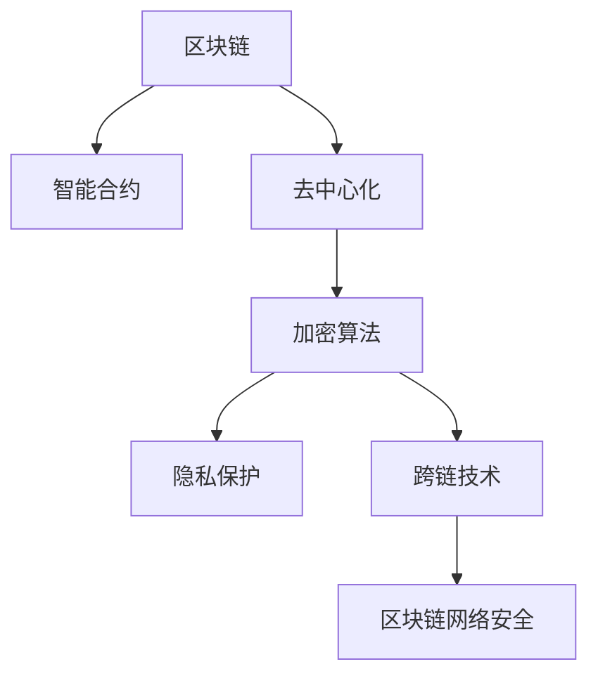

                 

# 区块链在金融科技中的创新应用

> 关键词：区块链, 金融科技, 智能合约, 去中心化, 加密算法, 隐私保护, 跨链技术, 区块链网络安全

## 1. 背景介绍

### 1.1 问题由来
随着金融科技的迅猛发展，传统的金融体系逐渐向数字化、智能化方向转变。金融科技的创新应用已经成为推动金融行业革新的重要力量。区块链技术的诞生，作为一种去中心化、安全可靠的数据记录技术，为金融科技带来了颠覆性的变革。

区块链最初被应用于比特币等加密货币的交易记录，其去中心化、不可篡改的特性，使得其天生具备金融科技应用的潜力。随着技术的不断进步，区块链技术在金融科技领域的应用逐渐拓展到智能合约、隐私保护、跨链技术等诸多方面，带来了诸多创新应用。

### 1.2 问题核心关键点
目前，区块链在金融科技中的应用主要包括：

- **智能合约**：通过区块链上的代码自动化执行合同条款，提升交易效率和透明度。
- **隐私保护**：利用区块链的匿名性和分布式账本，保护用户隐私。
- **跨链技术**：通过区块链间的互操作性，实现不同区块链之间的数据和资产互通。
- **网络安全**：通过区块链的共识机制和加密算法，提高系统的安全性和可靠性。

这些关键技术的应用，使得区块链在金融科技中能够更好地满足各种复杂场景的需求，提升金融服务的效率和安全性。

### 1.3 问题研究意义
研究区块链在金融科技中的应用，对于提升金融服务效率、增强金融安全、保护用户隐私具有重要意义：

1. **提高交易效率**：智能合约的自动执行简化了金融交易流程，大大提高了交易效率。
2. **增强金融安全**：区块链的去中心化和加密特性，有效防止了数据篡改和欺诈行为，提升了金融系统的安全性。
3. **保护用户隐私**：区块链的匿名性和分布式账本，使得用户交易信息得到了更好的保护。
4. **优化资产管理**：通过区块链的跨链技术，实现了不同资产之间的互通，优化了资产管理效率。
5. **促进金融创新**：区块链技术为金融创新提供了新的平台，推动了金融科技的发展。

通过深入研究区块链在金融科技中的应用，可以更好地指导实践，推动金融科技的普及和应用。

## 2. 核心概念与联系

### 2.1 核心概念概述

为更好地理解区块链在金融科技中的应用，本节将介绍几个密切相关的核心概念：

- **区块链(Blockchain)**：一种去中心化的分布式账本技术，通过共识机制和加密算法，确保数据的安全和不可篡改。
- **智能合约(Smart Contract)**：运行在区块链上的代码，通过自动化执行合同条款，实现金融交易的自动化。
- **去中心化(Decentralization)**：通过分布式账本和共识机制，去除中心化的中介机构，实现系统的高可靠性和透明性。
- **加密算法(Cryptography)**：利用公钥加密、哈希函数等技术，保障数据的安全性和隐私性。
- **隐私保护(Privacy Protection)**：通过区块链的匿名性和分布式账本，保护用户的隐私。
- **跨链技术(Cross-chain Technology)**：通过区块链间的互操作性，实现不同区块链之间的数据和资产互通。
- **区块链网络安全(Blockchain Network Security)**：通过共识机制和加密算法，保障区块链系统的安全性。

这些核心概念之间的逻辑关系可以通过以下Mermaid流程图来展示：



这个流程图展示了一些关键概念及其之间的关联关系：

1. 区块链作为基础，通过智能合约、去中心化、加密算法、隐私保护、跨链技术、区块链网络安全等多方面技术，共同构建了金融科技应用的复杂体系。
2. 智能合约通过区块链技术，自动化执行合同条款，提升了交易效率。
3. 去中心化和隐私保护，通过分布式账本和匿名性，增强了系统的安全性和用户隐私。
4. 跨链技术，通过区块链间的互操作性，实现了不同区块链之间的数据和资产互通。
5. 区块链网络安全，通过共识机制和加密算法，保障了区块链系统的安全性。

## 3. 核心算法原理 & 具体操作步骤
### 3.1 算法原理概述

区块链在金融科技中的应用主要基于以下几个核心算法：

1. **共识机制(Consensus Algorithm)**：确保网络中所有节点对交易记录达成一致。
2. **加密算法(Cryptography)**：保障数据的安全性和隐私性。
3. **智能合约(Smart Contract)**：自动执行合同条款，实现金融交易的自动化。
4. **跨链技术(Cross-chain Technology)**：实现不同区块链之间的数据和资产互通。
5. **分布式账本(Distributed Ledger)**：记录和验证交易记录的分布式账本技术。

这些算法共同构成了区块链在金融科技中的核心技术框架，使得区块链能够在复杂多样的金融场景中得到应用。

### 3.2 算法步骤详解

区块链在金融科技中的应用一般包括以下几个关键步骤：

**Step 1: 准备区块链网络**
- 选择适合的区块链平台，如Ethereum、Hyperledger等。
- 搭建区块链节点网络，配置网络参数和共识机制。

**Step 2: 设计智能合约**
- 根据金融应用需求，设计智能合约的逻辑和接口。
- 编写智能合约的Solidity代码，并测试其功能和安全性。

**Step 3: 部署智能合约**
- 将智能合约代码上传到区块链网络，并进行编译和部署。
- 设置智能合约的参数，如初始资金、合同条款等。

**Step 4: 进行交易操作**
- 发起交易请求，智能合约自动执行合同条款，完成金融操作。
- 接收和验证交易结果，进行账本更新和反馈。

**Step 5: 监控和优化**
- 实时监控智能合约的运行状态和交易结果。
- 根据业务需求，优化智能合约的参数和逻辑，提升系统效率和安全性。

### 3.3 算法优缺点

区块链在金融科技中的应用具有以下优点：

1. **高效性**：智能合约的自动化执行简化了金融交易流程，大大提高了交易效率。
2. **安全性**：区块链的去中心化和加密特性，有效防止了数据篡改和欺诈行为，提升了金融系统的安全性。
3. **透明性**：区块链的分布式账本，使得所有交易记录公开透明，提升了系统的信任度。
4. **可编程性**：智能合约的编程特性，使得金融应用具备更高的灵活性和定制性。

同时，该方法也存在一定的局限性：

1. **成本高**：搭建和维护区块链网络需要较高的初始投资和技术门槛。
2. **技术复杂**：区块链技术较为复杂，需要专业的技术团队进行开发和维护。
3. **扩展性差**：当前区块链的扩展性仍有限，无法满足大规模交易需求。
4. **法律合规性问题**：不同地区的法律法规对区块链的应用有不同的要求，需要谨慎考虑。

尽管存在这些局限性，但就目前而言，区块链在金融科技中的应用已经成为推动金融行业革新的重要力量。未来相关研究的重点在于如何进一步降低区块链应用的门槛，提高系统的扩展性和效率，同时兼顾法律合规性和用户隐私。

### 3.4 算法应用领域

区块链在金融科技中的应用已经涵盖了许多重要领域，例如：

- **供应链金融**：通过区块链的智能合约和去中心化特性，实现供应链上各方的信任和合作。
- **支付系统**：通过区块链的跨链技术和分布式账本，提升支付系统的效率和安全性。
- **保险业务**：利用区块链的隐私保护和智能合约，简化理赔流程，提升保险业务的服务质量。
- **数字身份认证**：通过区块链的分布式账本和加密算法，实现用户身份的数字化和验证。
- **证券交易**：利用区块链的智能合约和分布式账本，实现证券交易的去中介化和自动化。
- **资产管理**：通过区块链的跨链技术和分布式账本，实现资产的登记、转移和交易。

除了上述这些经典应用外，区块链技术还在票据交易、清算结算、数字资产等多个领域得到了广泛应用，为金融科技带来了全新的发展空间。

## 4. 数学模型和公式 & 详细讲解  
### 4.1 数学模型构建

区块链在金融科技中的应用涉及许多数学模型和算法，以下列举几个关键模型：

1. **共识机制模型**：如PoW（工作量证明）、PoS（权益证明）等，用于确保网络中所有节点对交易记录达成一致。
2. **加密算法模型**：如RSA算法、AES算法等，用于保障数据的安全性和隐私性。
3. **智能合约模型**：基于EVM（以太坊虚拟机）的智能合约模型，实现金融交易的自动化。
4. **跨链技术模型**：如Atomic Cross-chain Swaps、State Channels等，实现不同区块链之间的数据和资产互通。

这些数学模型和算法共同构成了区块链在金融科技中的核心技术框架，使得区块链能够在复杂多样的金融场景中得到应用。

### 4.2 公式推导过程

以下我们以智能合约的自动化交易为例，推导其数学原理和算法细节。

假设智能合约定义了一个简单金融操作，如资产转账，其逻辑和接口如下：

```python
def transfer(from, to, amount):
    # 检查资金余额
    if balance[from] < amount:
        return "Insufficient balance"
    # 扣除资金
    balance[from] -= amount
    # 增加资金
    balance[to] += amount
    # 记录交易记录
    records.append((from, to, amount))
    return "Transaction successful"
```

智能合约的执行步骤如下：

1. 智能合约通过区块链上的智能合约地址被调用。
2. 智能合约解析输入参数，检查资金余额。
3. 如果余额充足，智能合约执行转账操作。
4. 智能合约记录交易记录，并反馈交易结果。

根据智能合约的执行逻辑，可以设计一个基于Solidity的智能合约示例代码：

```solidity
pragma solidity ^0.8.0;

contract Token {
    uint256 public balance[256];
    uint256 public nonce;

    function transfer(address receiver, uint256 amount) public {
        require(balance[msg.sender] >= amount);
        balance[msg.sender] -= amount;
        balance[receiver] += amount;
        nonce++;
        emit Transfer(msg.sender, receiver, amount);
    }

    function withdraw(uint256 amount) public {
        require(balance[msg.sender] >= amount);
        balance[msg.sender] -= amount;
        balance[address(this)] += amount;
        nonce++;
        emit Withdraw(msg.sender, amount);
    }
}
```

通过智能合约的编程特性，可以自动化执行金融交易，大大提高了交易效率和安全性。

## 5. 项目实践：代码实例和详细解释说明
### 5.1 开发环境搭建

在进行区块链金融应用开发前，我们需要准备好开发环境。以下是使用Solidity进行区块链开发的环境配置流程：

1. 安装Node.js和npm：从官网下载并安装Node.js和npm，用于搭建开发环境和运行区块链智能合约。

2. 安装Truffle：Truffle是一个基于Web3.js的区块链开发框架，提供智能合约开发、测试、部署等工具，方便开发者快速迭代实验。

3. 创建并激活Truffle项目：
```bash
mkdir project
cd project
truffle init
```

4. 安装Web3.js：用于在Web3.js环境中编写智能合约和进行测试。

5. 安装以太坊测试网络：使用Ganache或Localhost等工具搭建以太坊测试网络，供开发者进行智能合约测试和调试。

完成上述步骤后，即可在Truffle环境中开始区块链金融应用的开发。

### 5.2 源代码详细实现

下面我们以数字资产交易为例，给出使用Solidity编写智能合约的完整代码实现。

首先，定义智能合约的接口和变量：

```solidity
pragma solidity ^0.8.0;

contract DigitalAsset {
    uint256 public supply;
    uint256 public balance[256];

    function DigitalAsset(uint256 initialSupply) public {
        supply = initialSupply;
        for (uint256 i = 0; i < 256; i++) {
            balance[i] = 0;
        }
    }

    function transfer(address receiver, uint256 amount) public {
        require(amount > 0);
        require(balance[msg.sender] >= amount);
        balance[msg.sender] -= amount;
        balance[receiver] += amount;
        emit Transfer(msg.sender, receiver, amount);
    }

    function mint(address receiver, uint256 amount) public {
        require(amount > 0);
        balance[receiver] += amount;
        supply += amount;
        emit Mint(msg.sender, amount);
    }
}
```

然后，定义智能合约的实现和测试函数：

```solidity
function DigitalAsset(uint256 initialSupply) public {
    supply = initialSupply;
    for (uint256 i = 0; i < 256; i++) {
        balance[i] = 0;
    }
}

function transfer(address receiver, uint256 amount) public {
    require(amount > 0);
    require(balance[msg.sender] >= amount);
    balance[msg.sender] -= amount;
    balance[receiver] += amount;
    emit Transfer(msg.sender, receiver, amount);
}

function mint(address receiver, uint256 amount) public {
    require(amount > 0);
    balance[receiver] += amount;
    supply += amount;
    emit Mint(msg.sender, amount);
}

function testTransfer(DigitalAsset asset) public {
    // 初始化资产
    asset.DigitalAsset(1000000);
    // 验证初始资产
    assert(asset.balance(0) == 1000000);
    // 进行转账操作
    asset.transfer(1, 10);
    // 验证转账结果
    assert(asset.balance(0) == 9990);
    assert(asset.balance(1) == 10);
    // 再次转账操作
    asset.transfer(0, 1);
    // 验证转账结果
    assert(asset.balance(0) == 10000);
    assert(asset.balance(1) == 11);
}

function testMint(DigitalAsset asset) public {
    // 初始化资产
    asset.DigitalAsset(10000);
    // 验证初始资产
    assert(asset.balance(0) == 10000);
    // 进行铸造操作
    asset.mint(1, 100);
    // 验证铸造结果
    assert(asset.balance(0) == 10000);
    assert(asset.balance(1) == 100);
}
```

最后，启动Truffle编译器，进行智能合约的编译和测试：

```bash
truffle compile
truffle test
```

以上就是一个基于Solidity的简单数字资产交易智能合约的实现过程。可以看到，利用Solidity的智能合约开发框架，可以轻松实现金融应用的核心功能。

### 5.3 代码解读与分析

让我们再详细解读一下关键代码的实现细节：

**DigitalAsset合同**：
- `supply`和`balance`分别表示资产的总供给和每个地址的资产余额。
- `DigitalAsset`构造函数初始化资产的总供给和每个地址的余额。
- `transfer`函数实现资产的转账操作，扣除发方资产并增加收方资产，并记录交易记录。
- `mint`函数实现资产的铸造操作，增加发方资产并记录铸造记录。

**测试函数**：
- `testTransfer`函数测试转账操作的正确性，包括初始化资产、转账操作和验证结果。
- `testMint`函数测试铸造操作的正确性，包括初始化资产、铸造操作和验证结果。

通过Solidity的智能合约开发框架，开发者可以轻松实现各种复杂的金融应用功能，并通过测试保证其正确性。

## 6. 实际应用场景
### 6.1 智能合约的金融应用

智能合约在金融科技中的应用非常广泛，以下列举几个典型场景：

**数字资产交易**：通过智能合约，实现数字资产的买卖和转移。用户可以在智能合约上发起交易请求，智能合约自动执行合同条款，完成资产的买卖和转移操作。

**去中心化借贷**：通过智能合约，实现点对点的借贷操作。借贷双方可以在智能合约上达成借贷协议，智能合约根据协议自动执行资金的借入和归还操作。

**自动索赔**：通过智能合约，实现自动化的索赔操作。在发生保险事故时，智能合约自动执行索赔流程，减少人为操作的复杂性和风险。

**供应链金融**：通过智能合约，实现供应链上各方的信任和合作。供应商、物流公司和金融机构可以在智能合约上达成合作协议，智能合约自动执行协议条款，简化供应链金融的操作流程。

### 6.2 未来应用展望

随着区块链技术的不断发展和完善，其在金融科技中的应用也将更加广泛。未来区块链将在以下几个方面取得突破：

1. **跨链互操作**：通过跨链技术，实现不同区块链之间的互操作性，提升数据和资产的流动性。
2. **去中心化交易所**：通过智能合约，实现去中心化交易所的功能，提升交易的效率和安全性。
3. **隐私保护**：通过零知识证明和隐私计算等技术，保护用户隐私，提升系统的安全性。
4. **智能合约自动化**：通过编程语言和智能合约框架，提升智能合约的灵活性和可扩展性。
5. **金融创新**：区块链技术为金融创新提供了新的平台，推动金融科技的发展。

区块链在金融科技中的应用，将进一步推动金融行业的数字化和智能化进程，为全球经济社会发展带来深远影响。

## 7. 工具和资源推荐
### 7.1 学习资源推荐

为了帮助开发者系统掌握区块链在金融科技中的应用，这里推荐一些优质的学习资源：

1. 《区块链技术与应用》系列博文：由区块链技术专家撰写，深入浅出地介绍了区块链原理、智能合约开发、去中心化应用等前沿话题。

2. CS224N《深度学习自然语言处理》课程：斯坦福大学开设的区块链明星课程，有Lecture视频和配套作业，带你入门区块链领域的基本概念和经典模型。

3. 《区块链原理与实践》书籍：系统介绍了区块链的原理、技术实现和应用案例，是区块链开发者的必备参考资料。

4. Web3.js官方文档：Web3.js的官方文档，提供了丰富的区块链开发示例和教程，适合初学者快速上手实验。

5. Ethereum官方文档：Ethereum的官方文档，详细介绍了Ethereum平台的开发环境和智能合约开发指南。

通过对这些资源的学习实践，相信你一定能够快速掌握区块链在金融科技中的应用精髓，并用于解决实际的区块链问题。

### 7.2 开发工具推荐

高效的开发离不开优秀的工具支持。以下是几款用于区块链金融应用开发的常用工具：

1. Truffle：Truffle是一个基于Solidity的区块链开发框架，集成了智能合约开发、测试、部署等功能，适合快速迭代研究。

2. Web3.js：Web3.js是一个用于与区块链进行交互的JavaScript库，支持多种区块链平台，方便开发者编写智能合约和进行测试。

3. Ganache：Ganache是一个轻量级的以太坊测试网络，可以方便地搭建本地测试环境，供开发者进行智能合约测试和调试。

4. MetaMask：MetaMask是一个基于Web3.js的浏览器插件，支持以太坊等区块链平台的智能合约调用和交易操作。

5. Remix：Remix是一个区块链智能合约编辑器，支持Solidity和Vyper等编程语言，提供丰富的测试工具和集成环境。

合理利用这些工具，可以显著提升区块链金融应用的开发效率，加快创新迭代的步伐。

### 7.3 相关论文推荐

区块链在金融科技中的应用源于学界的持续研究。以下是几篇奠基性的相关论文，推荐阅读：

1. Bitcoin: A Peer-to-Peer Electronic Cash System：提出比特币，并详细阐述了其去中心化特性和区块链技术。

2. Smart Contracts: Scripts for Blockchain Applications：提出了智能合约的概念，并描述了智能合约在区块链上的实现和应用。

3. State Channels for Ethereum Smart Contracts：介绍了State Channels技术，提升区块链的扩展性和隐私性。

4. Atomic Cross-chain Swaps and Decentralized Exchanges：提出了原子化跨链交换技术，实现不同区块链之间的资产互操作性。

5. Zero-knowledge Proofs: Simplifying Blockchains with Confidential Transactions：介绍了零知识证明技术，保护用户隐私，提升系统的安全性。

这些论文代表了大规模区块链应用的发展脉络。通过学习这些前沿成果，可以帮助研究者把握学科前进方向，激发更多的创新灵感。

## 8. 总结：未来发展趋势与挑战

### 8.1 总结

本文对区块链在金融科技中的应用进行了全面系统的介绍。首先阐述了区块链在金融科技中的创新应用背景和意义，明确了区块链技术在提升金融服务效率、增强金融安全、保护用户隐私方面的独特价值。其次，从原理到实践，详细讲解了智能合约的数学原理和关键步骤，给出了区块链金融应用的完整代码实例。同时，本文还广泛探讨了区块链在智能合约、去中心化借贷、自动索赔、供应链金融等诸多领域的应用前景，展示了区块链技术的巨大潜力。

通过本文的系统梳理，可以看到，区块链技术已经在金融科技中得到广泛应用，极大地提升了金融服务的效率和安全性，保护了用户隐私。未来，伴随区块链技术的不断发展，其在金融科技中的应用将更加深入，为金融行业带来革命性的变化。

### 8.2 未来发展趋势

展望未来，区块链在金融科技中的应用将呈现以下几个发展趋势：

1. **跨链互操作性提升**：通过跨链技术，实现不同区块链之间的互操作性，提升数据和资产的流动性。
2. **去中心化交易所普及**：通过智能合约，实现去中心化交易所的功能，提升交易的效率和安全性。
3. **隐私保护技术完善**：通过零知识证明和隐私计算等技术，保护用户隐私，提升系统的安全性。
4. **智能合约自动化提升**：通过编程语言和智能合约框架，提升智能合约的灵活性和可扩展性。
5. **金融创新应用丰富**：区块链技术为金融创新提供了新的平台，推动金融科技的发展。

以上趋势凸显了区块链在金融科技中的应用前景。这些方向的探索发展，必将进一步提升金融科技的创新水平，为全球金融服务带来深远影响。

### 8.3 面临的挑战

尽管区块链在金融科技中的应用已经取得显著进展，但在迈向更加智能化、普适化应用的过程中，它仍面临着诸多挑战：

1. **技术复杂性高**：区块链技术较为复杂，需要专业的技术团队进行开发和维护。
2. **扩展性不足**：当前区块链的扩展性仍有限，无法满足大规模交易需求。
3. **法律合规性问题**：不同地区的法律法规对区块链的应用有不同的要求，需要谨慎考虑。
4. **成本高**：搭建和维护区块链网络需要较高的初始投资和技术门槛。

尽管存在这些挑战，但区块链在金融科技中的应用前景广阔，未来的研究需要在以下几个方面寻求新的突破：

1. **优化共识机制**：通过新的共识机制设计，提升区块链的扩展性和安全性能。
2. **提高扩展性**：引入新的技术手段，如分层、分片、侧链等，提升区块链的扩展性。
3. **增强隐私保护**：引入新的隐私保护技术，如零知识证明、隐私计算等，保护用户隐私。
4. **降低成本**：通过技术创新，降低区块链网络搭建和维护的成本。

只有不断突破这些技术瓶颈，区块链技术才能在金融科技中得到更广泛的应用，实现其应有的价值。

### 8.4 研究展望

面向未来，区块链在金融科技中的应用还需要与其他人工智能技术进行更深入的融合，如机器学习、自然语言处理等，多路径协同发力，共同推动金融科技的发展。同时，区块链技术也需要与其他前沿技术进行结合，如量子计算、物联网等，为区块链网络提供更多的技术支持。

总之，区块链在金融科技中的应用将带来深远的变革，为全球金融服务带来更多的创新和便利。通过不断突破技术瓶颈，区块链技术必将在金融科技中得到更广泛的应用，推动全球金融行业的数字化和智能化进程。

## 9. 附录：常见问题与解答

**Q1：如何选择合适的区块链平台？**

A: 选择合适的区块链平台需要考虑多个因素，包括系统的安全性、扩展性、易用性等。通常来说，可以优先选择主流平台，如Ethereum、Hyperledger等，并根据具体需求选择适合的共识机制和编程语言。

**Q2：如何保证智能合约的安全性？**

A: 智能合约的安全性需要从代码审计、测试、部署等多个环节进行全面保障。开发者应该遵循最佳实践，进行代码审计和自动化测试，确保智能合约的安全性。同时，应该选择安全性较高的区块链平台，并采用多重签名等安全机制。

**Q3：如何提高区块链网络的扩展性？**

A: 区块链网络的扩展性可以通过多种手段提升，如分层、分片、侧链等。同时，可以通过引入新的共识机制，如PoS、PoW+PoS等，提升区块链的扩展性和安全性。

**Q4：区块链在金融科技中的应用前景如何？**

A: 区块链在金融科技中的应用前景广阔，已经在支付系统、智能合约、供应链金融、数字身份认证、证券交易等多个领域得到应用。未来，随着技术的不断进步，区块链将在金融科技中发挥更大的作用，推动金融行业的数字化和智能化进程。

**Q5：区块链网络如何实现跨链互操作？**

A: 区块链网络的跨链互操作可以通过多种技术手段实现，如跨链桥接、链上调用、侧链等。同时，需要引入跨链协议和安全机制，确保不同区块链之间的数据和资产安全互通。

总之，区块链在金融科技中的应用已经展现出巨大的潜力，未来将在更多领域得到广泛应用。通过不断突破技术瓶颈，区块链技术必将在金融科技中发挥更大的作用，推动全球金融行业的数字化和智能化进程。

