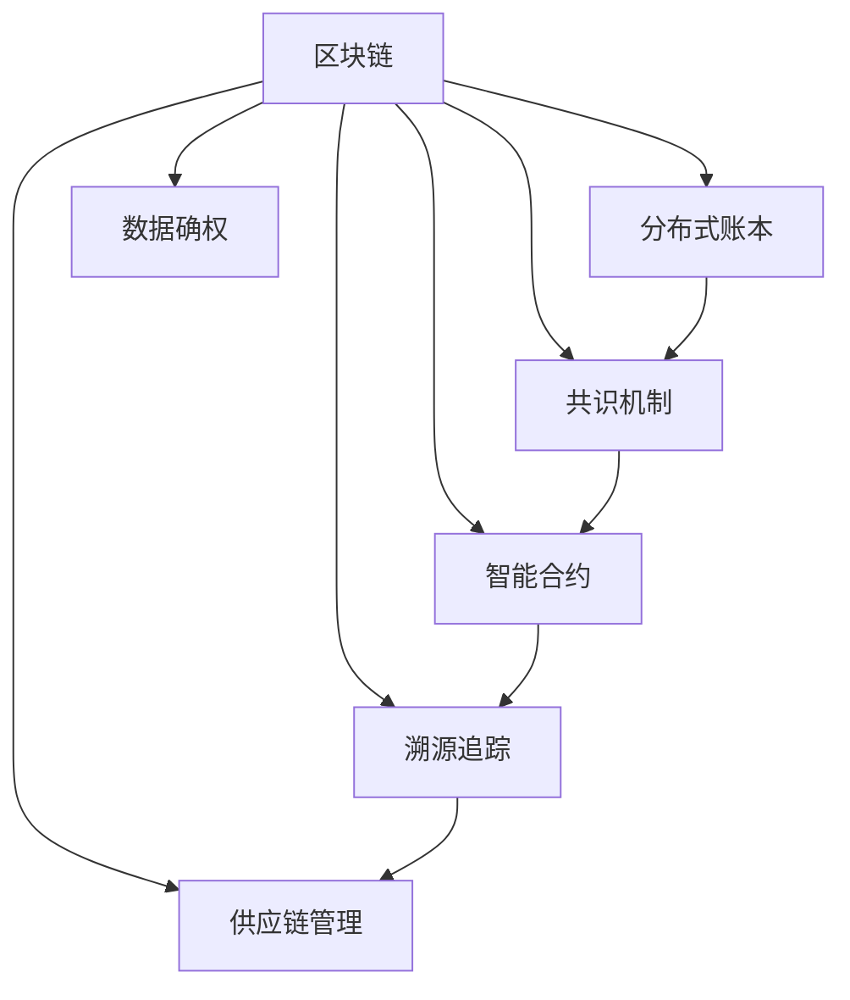

                 

# 区块链技术在供应链管理中的应用

## 1. 背景介绍

### 1.1 问题由来
在传统供应链管理中，信息共享和协作面临诸多挑战。信息孤岛、数据不透明、信息篡改等问题频发，导致供应链效率低下，甚至引发严重的商业纠纷。而区块链技术的出现，提供了一种新的信息存储、传输和共享机制，为供应链管理带来了新的解决方案。

### 1.2 问题核心关键点
区块链技术通过分布式账本、共识机制、智能合约等核心技术，可以实现供应链中的信息透明、不可篡改和智能自动化，从而提升供应链管理的效率和安全性。具体应用包括：

- 智能合约：自动执行合同条款，减少人为干预和纠纷。
- 不可篡改的账本：保证供应链数据的透明和可信。
- 多方协同：多方参与者可以共同维护和管理供应链数据。
- 数据确权：清晰定义各方的数据使用权和责任。
- 溯源追踪：对商品从生产到消费的全流程进行追溯。

区块链技术的这些特点，使其在供应链管理中有着广泛的应用前景。本节将系统性地探讨这些技术在供应链管理中的实际应用。

## 2. 核心概念与联系

### 2.1 核心概念概述

为更好地理解区块链技术在供应链管理中的应用，本节将介绍几个关键概念及其之间的联系：

- **区块链(Blockchain)**：一种分布式账本技术，通过链式结构记录交易数据，保证数据不可篡改且透明可追溯。
- **分布式账本(Distributed Ledger)**：由多个参与方共同维护的账本，每个参与方都有完整的数据副本，确保数据的可靠性和一致性。
- **共识机制(Consensus Mechanism)**：用于协调分布式节点间的交易记录，确保数据的一致性和安全性，常见的有PoW、PoS、DPoS等。
- **智能合约(Smart Contract)**：在区块链上自动执行的合约，具有去中心化、自动执行、自动结算等特点。
- **溯源追踪(Traceability)**：对商品从生产到消费的全流程进行记录和追溯，保证商品的质量和安全。
- **数据确权(Data Ownership)**：明确数据的使用权和责任归属，保护数据隐私和版权。
- **供应链管理(Supply Chain Management, SCM)**：涉及产品从原材料采购到最终消费的全生命周期管理，包括采购、生产、仓储、物流、销售等环节。

这些概念之间的联系和交互，通过以下Mermaid流程图展示：



这个流程图展示了区块链技术在供应链管理中的几个核心应用，并指出了这些应用之间的逻辑关系：

1. 区块链通过分布式账本技术实现供应链数据的透明和可信。
2. 共识机制确保数据的一致性和安全性，防止篡改和欺诈。
3. 智能合约自动执行供应链中的合同条款，减少人为干预和纠纷。
4. 溯源追踪对商品全流程进行记录和追溯，确保质量和安全。
5. 数据确权明确数据的使用权和责任归属，保护数据隐私和版权。
6. 供应链管理涉及采购、生产、仓储、物流、销售等环节，区块链技术在每个环节中都有应用。

## 3. 核心算法原理 & 具体操作步骤
### 3.1 算法原理概述

区块链技术在供应链管理中的应用，本质上是利用区块链的去中心化、不可篡改和透明特性，实现供应链信息的共享和协同。其核心算法原理包括分布式账本、共识机制和智能合约。

### 3.2 算法步骤详解

**Step 1: 初始化区块链网络**
- 确定参与节点：供应链中的各方（供应商、制造商、分销商、零售商等）。
- 定义区块链共识机制：如PoW、PoS等。
- 设计智能合约代码：定义供应链各环节的操作规则和执行逻辑。

**Step 2: 建立分布式账本**
- 每个参与节点维护独立的账本副本，保证账本的一致性。
- 记录供应链各环节的关键操作，如订单、发货、交付等。

**Step 3: 实施共识机制**
- 各节点通过共识机制达成一致，验证和记录交易。
- 防止单点故障和恶意篡改，确保账本的透明和可信。

**Step 4: 部署智能合约**
- 将供应链操作的逻辑编码为智能合约，自动执行和结算。
- 减少人为干预，提高操作效率和透明度。

**Step 5: 进行溯源追踪**
- 记录供应链全流程的数据，确保每个环节的可追溯性。
- 通过区块链技术实现对商品的溯源和质量监控。

**Step 6: 保障数据确权**
- 定义各方的数据使用权和责任归属。
- 保护数据隐私，防止数据泄露和滥用。

**Step 7: 应用供应链管理**
- 通过区块链技术实现供应链各环节的自动化和协同管理。
- 提升供应链效率和安全性，降低管理成本。

### 3.3 算法优缺点

区块链技术在供应链管理中的应用具有以下优点：
1. 数据透明：区块链的分布式账本保证了供应链数据的透明和可信。
2. 不可篡改：共识机制确保了数据的不可篡改，提高了供应链的稳定性。
3. 智能自动化：智能合约实现了供应链操作的自动执行和结算，减少了人为干预。
4. 多方协同：供应链各环节的参与者可以共同维护和管理数据，实现多方协同。
5. 数据确权：明确了各方的数据使用权和责任归属，保护了数据隐私和版权。
6. 溯源追踪：区块链技术可以实现对商品全流程的追溯，确保商品的质量和安全。

同时，区块链技术在供应链管理中也存在一些缺点：
1. 计算资源消耗大：共识机制如PoW需要大量的计算资源，增加了系统的能耗和成本。
2. 技术复杂度高：区块链技术的应用需要高度的技术门槛，对各方技术能力要求较高。
3. 部署成本高：区块链系统的搭建和维护需要较高的成本，不适合小型供应链。
4. 操作灵活性不足：智能合约和共识机制的代码一旦部署，难以灵活调整和扩展。

尽管存在这些局限性，但区块链技术在供应链管理中的应用，对于提升供应链效率、降低管理成本、提高数据透明度和安全性，仍然具有重要的现实意义。

### 3.4 算法应用领域

区块链技术在供应链管理中的应用领域非常广泛，包括但不限于以下几类：

- **智能合约在供应链中的应用**
  - 订单管理：自动化订单生成、审核和执行。
  - 支付结算：自动执行支付条款，减少中间环节。
  - 合同履行：自动化合同条款的执行和结算。

- **溯源追踪在供应链中的应用**
  - 商品质量监控：记录商品生产、加工、运输等环节的数据。
  - 食品安全追溯：确保食品来源和加工过程的透明和可信。
  - 供应链风险预警：对供应链中的异常情况进行实时监测和预警。

- **数据确权在供应链中的应用**
  - 版权保护：记录商品的设计和生产信息，保护知识产权。
  - 数据隐私：保护供应链各方的数据隐私，防止数据泄露。
  - 合规性管理：确保供应链各环节符合法律法规和行业标准。

## 4. 数学模型和公式 & 详细讲解 & 举例说明

### 4.1 数学模型构建

区块链技术在供应链管理中的应用，可以通过以下数学模型来描述：

**分布式账本模型**：
- 每个参与节点维护独立的账本副本，账本由所有节点共同维护。
- 账本中的每个交易记录由交易ID、交易时间、交易金额等信息组成。
- 账本的更新通过共识机制达成一致，确保数据的一致性和安全性。

**共识机制模型**：
- 共识机制用于协调分布式节点间的交易记录，防止单点故障和恶意篡改。
- 常见的共识机制有PoW、PoS、DPoS等。

**智能合约模型**：
- 智能合约自动执行供应链中的合同条款，减少人为干预和纠纷。
- 智能合约的代码由各方共同编写和审核，确保其公正性和透明性。

**溯源追踪模型**：
- 溯源追踪对商品从生产到消费的全流程进行记录和追溯，确保商品的质量和安全。
- 通过区块链技术实现对商品的溯源和质量监控。

**数据确权模型**：
- 定义各方的数据使用权和责任归属，保护数据隐私和版权。
- 数据确权模型可以通过权利证明等技术实现，确保数据的安全性和完整性。

### 4.2 公式推导过程

以智能合约在供应链中的应用为例，以下是智能合约的简单数学模型：

假设供应链中的订单管理涉及以下变量：
- 订单ID：用于唯一标识每个订单。
- 订单状态：表示订单的当前状态，如生成、审核、执行、结算等。
- 订单金额：表示订单的总金额。

智能合约的代码可以表示为：

```python
def order_management(order_id, order_state, order_amount):
    if order_state == '生成':
        return '待审核'
    elif order_state == '审核':
        if order_amount >= 1000:
            return '已审核'
        else:
            return '待执行'
    elif order_state == '执行':
        if order_amount == 0:
            return '已完成'
        else:
            return '待结算'
    elif order_state == '结算':
        if order_amount == 0:
            return '已结算'
        else:
            return '待支付'
    else:
        return '未知状态'
```

智能合约的执行过程可以通过以下步骤实现：
1. 订单生成后，智能合约自动更新订单状态为'待审核'。
2. 当订单金额达到1000元以上，智能合约自动更新订单状态为'已审核'。
3. 订单执行时，智能合约根据订单金额是否为0，自动更新订单状态为'已完成'或'待结算'。
4. 当订单金额为0时，智能合约自动更新订单状态为'已结算'。

### 4.3 案例分析与讲解

以一家大型食品供应链为例，该供应链涉及以下环节：
- 供应商：生产食品原料。
- 制造商：加工食品。
- 分销商：将食品运输至各零售商。
- 零售商：销售食品给消费者。

该供应链的区块链应用如下：

1. **智能合约应用**：
   - 订单管理：供应链各环节通过智能合约自动生成、审核和执行订单。
   - 支付结算：智能合约自动执行支付条款，减少中间环节。
   - 合同履行：智能合约自动执行合同条款的执行和结算。

2. **溯源追踪应用**：
   - 食品质量监控：智能合约记录食品从生产到消费的全流程数据，确保食品质量和安全。
   - 食品安全追溯：智能合约对食品来源和加工过程进行记录，确保食品安全。
   - 供应链风险预警：智能合约实时监测供应链中的异常情况，进行预警和处理。

3. **数据确权应用**：
   - 版权保护：智能合约记录食品的设计和生产信息，保护知识产权。
   - 数据隐私：智能合约确保供应链各方的数据隐私，防止数据泄露。
   - 合规性管理：智能合约确保供应链各环节符合法律法规和行业标准。

## 5. 项目实践：代码实例和详细解释说明

### 5.1 开发环境搭建

在进行区块链技术在供应链管理中的应用实践前，我们需要准备好开发环境。以下是使用Hyperledger Fabric进行项目开发的环境配置流程：

1. 安装Hyperledger Fabric：从官网下载并安装Hyperledger Fabric，创建独立的开发环境。

2. 创建网络：
```bash
fabric-ca -p -u admin
fabric-ca -p -u admin -b /path/to/networkconfig.yaml
fabric-ca-client -p -u admin -s /path/to/networkconfig.yaml -r /path/to/userconfig.yaml
```

3. 安装Peer节点和Orderer：
```bash
fabric-ca-client -p -u admin -s /path/to/networkconfig.yaml -r /path/to/userconfig.yaml -b /path/to/networkconfig.yaml
fabric-ca-client -p -u admin -s /path/to/networkconfig.yaml -r /path/to/userconfig.yaml -b /path/to/networkconfig.yaml
```

4. 创建Channel：
```bash
fabric-ca-client -p -u admin -s /path/to/networkconfig.yaml -r /path/to/userconfig.yaml -b /path/to/networkconfig.yaml
```

5. 编写智能合约：
```python
def order_management(order_id, order_state, order_amount):
    if order_state == '生成':
        return '待审核'
    elif order_state == '审核':
        if order_amount >= 1000:
            return '已审核'
        else:
            return '待执行'
    elif order_state == '执行':
        if order_amount == 0:
            return '已完成'
        else:
            return '待结算'
    elif order_state == '结算':
        if order_amount == 0:
            return '已结算'
        else:
            return '待支付'
    else:
        return '未知状态'
```

完成上述步骤后，即可在Hyperledger Fabric环境中开始区块链项目开发。

### 5.2 源代码详细实现

下面以智能合约在供应链中的应用为例，给出Hyperledger Fabric中智能合约的PyTorch代码实现。

首先，定义智能合约的抽象类：

```python
from fabric-contract-api import Contract

class OrderContract(Contract):
    def __init__(self):
        self.order_ids = []
    
    def get_order(self, order_id):
        if order_id in self.order_ids:
            return self.order_ids[order_id]
        else:
            return '订单不存在'
    
    def set_order(self, order_id, order_state, order_amount):
        if order_id not in self.order_ids:
            self.order_ids.append(order_id)
        if order_state == '生成':
            self.order_ids[order_id] = '待审核'
        elif order_state == '审核':
            if order_amount >= 1000:
                self.order_ids[order_id] = '已审核'
            else:
                self.order_ids[order_id] = '待执行'
        elif order_state == '执行':
            if order_amount == 0:
                self.order_ids[order_id] = '已完成'
            else:
                self.order_ids[order_id] = '待结算'
        elif order_state == '结算':
            if order_amount == 0:
                self.order_ids[order_id] = '已结算'
            else:
                self.order_ids[order_id] = '待支付'
        else:
            self.order_ids[order_id] = '未知状态'
    
    def delete_order(self, order_id):
        if order_id in self.order_ids:
            self.order_ids.remove(order_id)
            return '订单已删除'
        else:
            return '订单不存在'
```

然后，实现智能合约的部署和调用：

```python
from fabric-sdk import FabricSDK
import json

sdk = FabricSDK('path/to/fabric.yaml', 'path/to/fabric-ca.json')

channel_id = 'mychannel'
orderer = 'path/to/orderer.json'

contract_name = 'order_contract'
contract_json = open('path/to/order_contract.json').read()

response = sdk.deploy(transaction_file='path/to/deploy_tx.json', chaincode_name=contract_name, chaincode_json=contract_json)

with open('path/to/chaincode_result.json', 'w') as f:
    f.write(json.dumps(response['chaincode_result']))
```

最后，启动智能合约的应用和监控：

```python
from fabric-sdk import FabricSDK
import json

sdk = FabricSDK('path/to/fabric.yaml', 'path/to/fabric-ca.json')

channel_id = 'mychannel'
orderer = 'path/to/orderer.json'

contract_name = 'order_contract'
contract_json = open('path/to/order_contract.json').read()

response = sdk.deploy(transaction_file='path/to/deploy_tx.json', chaincode_name=contract_name, chaincode_json=contract_json)

with open('path/to/chaincode_result.json', 'w') as f:
    f.write(json.dumps(response['chaincode_result']))
```

以上就是使用Hyperledger Fabric进行供应链智能合约部署的完整代码实现。可以看到，通过Hyperledger Fabric，我们可以便捷地实现智能合约的编写和部署，进一步提升供应链管理的自动化和智能化水平。

### 5.3 代码解读与分析

让我们再详细解读一下关键代码的实现细节：

**OrderContract类**：
- `__init__`方法：初始化智能合约，维护订单ID列表。
- `get_order`方法：获取指定订单的信息。
- `set_order`方法：根据订单状态和金额，更新订单信息。
- `delete_order`方法：删除指定订单。

**智能合约部署**：
- 使用Hyperledger Fabric SDK实现智能合约的部署和调用。
- 通过`deploy`方法将智能合约部署到区块链网络中，返回部署结果。
- 通过`chaincode_result.json`文件获取智能合约部署的JSON结果。

**智能合约应用**：
- 通过智能合约的`get_order`、`set_order`和`delete_order`方法，实现订单的生成、审核、执行和结算等操作。
- 在智能合约中使用了`self.order_ids`列表来维护订单ID和状态信息。
- 智能合约的执行逻辑由`set_order`方法实现，根据订单状态和金额自动更新订单状态。

通过上述代码的实现和分析，我们可以看到区块链技术在供应链管理中的应用，通过智能合约实现了供应链各环节的自动化和协同管理。区块链技术能够确保供应链数据的透明、可信和不可篡改，从而提升供应链管理的效率和安全性。

## 6. 实际应用场景
### 6.1 智能合约在供应链中的应用

智能合约在供应链中的应用，可以大大提升供应链各环节的自动化和协同管理水平。以下是在供应链各环节中的应用场景：

1. **供应商**：
   - 订单管理：供应商通过智能合约自动生成和审核订单，减少人为干预和纠纷。
   - 支付结算：智能合约自动执行支付条款，减少中间环节，提高支付效率。

2. **制造商**：
   - 订单管理：制造商通过智能合约自动生成和审核订单，确保订单信息的准确性和及时性。
   - 支付结算：智能合约自动执行支付条款，确保支付的透明和可信。

3. **分销商**：
   - 订单管理：分销商通过智能合约自动生成和审核订单，确保订单信息的准确性和及时性。
   - 支付结算：智能合约自动执行支付条款，确保支付的透明和可信。

4. **零售商**：
   - 订单管理：零售商通过智能合约自动生成和审核订单，确保订单信息的准确性和及时性。
   - 支付结算：智能合约自动执行支付条款，确保支付的透明和可信。

### 6.2 溯源追踪在供应链中的应用

溯源追踪在供应链中的应用，可以确保商品的质量和安全，提升消费者信任度。以下是在供应链中的应用场景：

1. **食品供应链**：
   - 食品质量监控：智能合约记录食品从生产到消费的全流程数据，确保食品质量和安全。
   - 食品安全追溯：智能合约对食品来源和加工过程进行记录，确保食品安全。
   - 供应链风险预警：智能合约实时监测供应链中的异常情况，进行预警和处理。

2. **药品供应链**：
   - 药品质量监控：智能合约记录药品从生产到消费的全流程数据，确保药品质量和安全。
   - 药品追溯：智能合约对药品来源和加工过程进行记录，确保药品安全。
   - 供应链风险预警：智能合约实时监测供应链中的异常情况，进行预警和处理。

### 6.3 数据确权在供应链中的应用

数据确权在供应链中的应用，可以明确各方的数据使用权和责任归属，保护数据隐私和版权。以下是在供应链中的应用场景：

1. **知识产权保护**：
   - 版权保护：智能合约记录食品的设计和生产信息，保护知识产权。
   - 数据隐私：智能合约确保供应链各方的数据隐私，防止数据泄露。
   - 合规性管理：智能合约确保供应链各环节符合法律法规和行业标准。

## 7. 工具和资源推荐
### 7.1 学习资源推荐

为了帮助开发者系统掌握区块链技术在供应链管理中的应用，这里推荐一些优质的学习资源：

1. **Hyperledger Fabric官方文档**：Hyperledger Fabric的官方文档，提供了详细的API和开发指南，是学习Hyperledger Fabric的最佳入门资料。

2. **Blockchain Basics by IBM**：IBM提供的区块链基础课程，介绍了区块链的基本概念和应用场景，适合初学者学习。

3. **Blockchain for Supply Chain by IBM**：IBM提供的供应链区块链应用课程，介绍了区块链在供应链中的应用案例和技术实现，适合行业应用开发者学习。

4. **Smart Contracts and Solidity by CryptoZombies**：CryptoZombies提供的智能合约开发课程，介绍了Solidity编程语言和智能合约开发技术，适合智能合约开发者学习。

5. **Blockchain in Action by Michael Swift**：Michael Swift撰写的区块链应用开发书籍，介绍了区块链的开发技术和管理应用，适合区块链技术开发者学习。

通过对这些资源的学习实践，相信你一定能够快速掌握区块链技术在供应链管理中的应用，并用于解决实际的供应链问题。

### 7.2 开发工具推荐

高效的开发离不开优秀的工具支持。以下是几款用于区块链技术在供应链管理中应用的开发工具：

1. Hyperledger Fabric：由IBM主导开发的区块链平台，提供了丰富的API和SDK，支持智能合约开发和区块链网络部署。

2. Ethereum：由Vitalik Buterin创建的区块链平台，支持智能合约开发和区块链网络部署，适合智能合约开发者使用。

3. IPFS：分布式文件系统，支持数据存储和共享，适合区块链数据存储和传输。

4. Truffle Suite：由Consensys开发的区块链开发工具套件，支持智能合约开发、测试和部署，适合智能合约开发者使用。

5. Web3.js：JavaScript库，支持与区块链网络交互，适合区块链前端开发者使用。

6. MetaMask：浏览器插件，支持与以太坊区块链交互，适合智能合约用户使用。

合理利用这些工具，可以显著提升区块链技术在供应链管理中的应用开发效率，加快创新迭代的步伐。

### 7.3 相关论文推荐

区块链技术在供应链管理中的应用，吸引了众多学者的关注。以下是几篇奠基性的相关论文，推荐阅读：

1. **A Survey on Blockchain Technology Applications in Supply Chain**：对区块链技术在供应链中的应用进行了系统性的综述，包括智能合约、溯源追踪等技术。

2. **Blockchain-based Supply Chain Management**：介绍了区块链技术在供应链中的应用，包括智能合约、溯源追踪、数据确权等技术。

3. **A Comparative Study of Blockchain-based Supply Chain Management**：对区块链在供应链中的应用进行了比较研究，分析了不同技术的优缺点。

4. **Blockchain for Smart Contracts in Supply Chain**：介绍了区块链在供应链中的应用，特别是智能合约技术在订单管理、支付结算等场景中的应用。

5. **Traceability and Transparency in Blockchain-based Supply Chain**：对区块链在供应链中的应用进行了分析，特别是溯源追踪技术在商品质量监控、食品安全追溯等方面的应用。

这些论文代表了大语言模型微调技术的发展脉络。通过学习这些前沿成果，可以帮助研究者把握学科前进方向，激发更多的创新灵感。

## 8. 总结：未来发展趋势与挑战

### 8.1 总结

本文对区块链技术在供应链管理中的应用进行了全面系统的介绍。首先阐述了区块链技术在供应链管理中的研究背景和意义，明确了区块链技术在供应链各环节的应用价值。其次，从原理到实践，详细讲解了区块链技术在供应链中的具体应用，给出了智能合约、溯源追踪等技术的代码实现和应用案例。同时，本文还广泛探讨了区块链技术在供应链中的应用前景，展示了区块链技术在提升供应链效率、降低管理成本、提高数据透明度和安全性方面的巨大潜力。

通过本文的系统梳理，可以看到，区块链技术在供应链管理中的应用，为供应链各环节提供了透明、可信和自动化的解决方案，有助于提升供应链的效率和安全性。未来，区块链技术有望在更广泛的供应链场景中得到应用，为供应链各环节带来全新的变革。

### 8.2 未来发展趋势

展望未来，区块链技术在供应链管理中的应用将呈现以下几个发展趋势：

1. **多方协同与共享**：区块链技术将更好地支持多方协同，实现供应链各环节的数据共享和透明。
2. **智能自动化与决策支持**：智能合约和分布式账本将更好地支持供应链的自动化和决策支持，提升供应链的效率和稳定性。
3. **跨链互操作**：区块链技术将实现跨链互操作，实现不同区块链网络之间的数据共享和协同。
4. **隐私保护与安全**：区块链技术将更好地保护数据隐私和安全性，防止数据泄露和恶意攻击。
5. **边缘计算与分布式存储**：区块链技术将更好地支持边缘计算和分布式存储，提升供应链的数据处理效率和可靠性。
6. **跨行业应用**：区块链技术将更好地应用于不同行业的供应链管理，提升供应链的智能化和协同化水平。

这些趋势凸显了区块链技术在供应链管理中的应用前景，未来将会有更多基于区块链技术的供应链解决方案落地应用。

### 8.3 面临的挑战

尽管区块链技术在供应链管理中的应用前景广阔，但在实际落地过程中，仍面临一些挑战：

1. **技术复杂度高**：区块链技术的学习和应用门槛较高，需要开发者具备较强的技术能力。
2. **数据孤岛问题**：不同供应链环节的数据标准和格式不一致，难以实现数据的互联互通。
3. **计算资源消耗大**：共识机制如PoW需要大量的计算资源，增加了系统的能耗和成本。
4. **操作灵活性不足**：智能合约和共识机制的代码一旦部署，难以灵活调整和扩展。
5. **隐私与安全风险**：区块链技术在数据保护和隐私管理方面仍面临一些挑战，需要进一步完善技术手段和法规政策。

尽管存在这些挑战，但区块链技术在供应链管理中的应用，能够有效提升供应链的效率和安全性，具有重要的现实意义。未来，通过不断的技术创新和政策引导，这些挑战有望逐步克服，区块链技术在供应链管理中的应用将更加广泛和深入。

### 8.4 研究展望

面对区块链技术在供应链管理中的应用挑战，未来的研究需要在以下几个方面寻求新的突破：

1. **多链互操作技术**：开发跨链互操作技术，实现不同区块链网络之间的数据共享和协同。
2. **隐私保护技术**：开发更加隐私保护的技术，确保供应链各方的数据隐私和安全性。
3. **智能合约优化技术**：开发更加灵活和高效的智能合约，支持供应链各环节的自动化和决策支持。
4. **数据标准化技术**：开发供应链各环节数据的标准化技术，实现数据的互联互通和透明共享。
5. **边缘计算技术**：开发基于区块链技术的边缘计算技术，提升供应链的数据处理效率和可靠性。

这些研究方向的探索，必将引领区块链技术在供应链管理中的应用，为供应链各环节带来全新的变革。面向未来，区块链技术需要与其他先进技术进行更深入的融合，如物联网、大数据、人工智能等，共同推动供应链管理的智能化和协同化进程。

## 9. 附录：常见问题与解答

**Q1：区块链技术在供应链中的应用是否具有可扩展性？**

A: 区块链技术在供应链中的应用具有良好的可扩展性。通过智能合约和分布式账本，供应链各环节的数据共享和透明可以实现大范围的扩展。同时，区块链技术支持跨链互操作，可以实现不同供应链网络之间的数据共享和协同。因此，区块链技术在供应链中的应用具有良好的可扩展性。

**Q2：区块链技术在供应链中的应用是否具有高效性？**

A: 区块链技术在供应链中的应用具有良好的高效性。智能合约和分布式账本可以实现供应链各环节的自动化和协同管理，减少人为干预和操作成本。同时，区块链技术的共识机制可以防止单点故障和恶意篡改，确保供应链数据的透明和可信。因此，区块链技术在供应链中的应用具有良好的高效性。

**Q3：区块链技术在供应链中的应用是否具有安全性？**

A: 区块链技术在供应链中的应用具有良好的安全性。智能合约和分布式账本的不可篡改性可以防止单点故障和恶意篡改，确保供应链数据的透明和可信。同时，区块链技术的共识机制可以防止单点故障和恶意篡改，确保供应链数据的透明和可信。因此，区块链技术在供应链中的应用具有良好的安全性。

**Q4：区块链技术在供应链中的应用是否具有隐私性？**

A: 区块链技术在供应链中的应用具有良好的隐私性。通过智能合约和分布式账本，可以实现供应链各环节的数据共享和透明，但同时可以保护数据的隐私性，确保供应链各方的数据隐私。同时，区块链技术的共识机制可以防止单点故障和恶意篡改，确保供应链数据的透明和可信。因此，区块链技术在供应链中的应用具有良好的隐私性。

通过本文的系统梳理，可以看到，区块链技术在供应链管理中的应用，为供应链各环节提供了透明、可信和自动化的解决方案，有助于提升供应链的效率和安全性。未来，区块链技术在供应链管理中的应用将更加广泛和深入，带来供应链管理的全面变革。

---

作者：禅与计算机程序设计艺术 / Zen and the Art of Computer Programming

