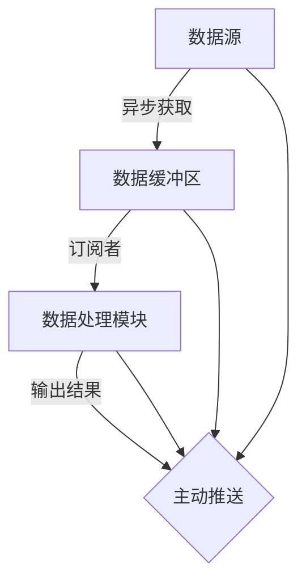
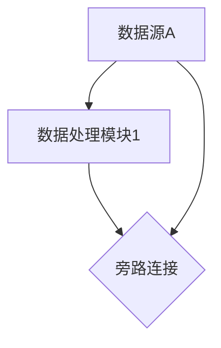

                 

## 1. 背景介绍

在现代软件开发中，异步数据流处理已成为了不可或缺的一部分。无论是处理实时数据流、网络请求，还是进行分布式系统设计，异步编程和数据流技术都扮演着关键角色。传统的阻塞式同步编程方式虽然易于理解和实现，但在处理大规模、高并发的数据流时，往往会导致性能瓶颈和资源浪费。响应式编程（Reactive Programming）作为处理异步数据流的一种范式，以其简洁高效、易于扩展的特点，逐渐成为主流的编程方式之一。

本文将深入探讨响应式编程的基本原理和实践技巧，详细介绍其核心概念、核心算法和操作步骤，并通过具体项目实践展现响应式编程的强大威力。

## 2. 核心概念与联系

### 2.1 核心概念概述

响应式编程（Reactive Programming）是一种基于数据流和事件驱动的编程范式。它强调数据的流动、状态的变更和异步事件的处理，通过数据流模型来连接各个异步组件，形成一个响应式系统。响应式编程的核心在于数据的可观察性，即通过声明式的方式来定义数据流和订阅者，而无需关心数据是如何被计算和传递的。

在响应式编程中，数据流通常表示为一系列数据的不断变化，如事件、消息等。订阅者则对数据流进行持续监听，每当数据发生变化时，订阅者会接收到更新通知，并根据自身逻辑处理数据，实现对数据的响应和处理。

### 2.2 核心概念原理和架构的 Mermaid 流程图



这个 Mermaid 图展示了响应式编程的基本流程。数据源（如网络请求、实时数据流等）经过异步获取后进入数据缓冲区。订阅者从数据缓冲区获取数据，并在数据发生变化时触发更新事件。数据处理模块对数据进行处理后，将结果通过主动推送的方式传递给观察者（如UI界面），实现实时更新和响应。

## 3. 核心算法原理 & 具体操作步骤

### 3.1 算法原理概述

响应式编程的核心在于对数据的观察和响应。它通过数据的不可变性和不可分性（Immutability and Indivisibility）来保证系统的一致性和并发性。数据流的每个节点都是可观察的，可以被多个订阅者共享和访问，避免了数据复制和线程同步的复杂性。

在算法层面，响应式编程通常包括以下几个关键步骤：

1. **数据流定义**：定义数据流的类型、来源和流向，通过声明式的方式定义数据流的行为。
2. **订阅与发布**：通过订阅者对数据流的观察，实现数据的实时更新和传递。
3. **处理与响应**：对数据进行处理和分析，并将处理结果传递给观察者，实现对数据的响应式处理。

### 3.2 算法步骤详解

以一个简单的响应式编程示例来说明具体的步骤：

```java
Observable<String> observable = Observable.create(subscriber -> {
    subscriber.onNext("Hello");
    subscriber.onNext("World");
    subscriber.onComplete();
});

observable.subscribe(System.out::println);
```

这段代码定义了一个Observable对象，表示一个简单的字符串数据流。通过调用`onNext`方法，Observable会依次发出"Hello"和"World"两个字符串，并通过`subscriber`对象传递给观察者。观察者（这里是一个`System.out::println`）通过调用`println`方法将数据打印输出。

### 3.3 算法优缺点

响应式编程的优点在于：

1. **简洁高效**：通过声明式的方式定义数据流和订阅者，无需关心底层的数据处理逻辑，代码简洁高效。
2. **易于扩展**：数据流和订阅者之间高度解耦，支持灵活的组合和扩展，适用于复杂的系统设计。
3. **响应式处理**：通过观察者对数据流的实时监听和处理，可以实现实时更新和响应，提高系统性能和响应速度。

缺点在于：

1. **学习成本高**：响应式编程与传统的同步编程方式有很大差异，需要开发者掌握新的思维模式和编程技巧。
2. **调试困难**：由于异步数据流的特性，调试响应式代码比同步代码更为复杂，需要一定的调试技巧和工具支持。

### 3.4 算法应用领域

响应式编程广泛应用于各种异步数据流处理场景，如：

1. **前端开发**：在Web前端开发中，响应式编程用于处理用户交互事件、网络请求等异步数据流。
2. **后端开发**：在服务器端开发中，响应式编程用于处理消息队列、数据库事件等异步数据流。
3. **移动开发**：在移动应用开发中，响应式编程用于处理事件监听、网络请求等异步数据流。
4. **分布式系统**：在分布式系统中，响应式编程用于处理跨节点数据流、事件同步等异步数据流。

## 4. 数学模型和公式 & 详细讲解 & 举例说明

### 4.1 数学模型构建

在响应式编程中，数据流通常表示为一个有向无环图（DAG），每个节点表示一个数据流处理单元，可以是一个数据源、一个数据处理模块或一个数据缓存区。节点之间通过边连接，表示数据流的流动方向。

### 4.2 公式推导过程

假设有一个包含两个数据源A和B的数据流，它们的处理流程如下：



根据上述图，可以定义以下数据流模型：

- 数据源A和B分别发出数据流，表示为`A.next()`和`B.next()`。
- 数据处理模块1和2分别对数据进行处理，表示为`A.onNext().transform(...).subscribe(C::next)`和`B.onNext().transform(...).subscribe(C::next)`。
- 数据处理模块1和2的输出合并后，通过旁路连接直接传递给数据处理模块C，表示为`A.onNext().subscribe(C::next)`。

### 4.3 案例分析与讲解

假设我们需要实现一个简单的统计数据流，即对输入数据流中的每个元素，计算其总和和平均数。可以使用以下响应式代码：

```java
Observable<Long> data = Observable.fromIterable(Arrays.asList(1L, 2L, 3L, 4L, 5L));
Observable<Long> sum = data.reduce(0L, (total, num) -> total + num);
Observable<Double> avg = data.reduce(0L, (total, num) -> (total + num) / data.count());

Observable.zip(sum, avg, (s, a) -> "Sum: " + s + ", Avg: " + a);
```

这段代码首先定义了一个Observable对象`data`，表示输入数据流。通过`reduce`方法，分别计算了总和和平均数，并返回一个新的Observable对象`sum`和`avg`。最后使用`zip`方法将两个Observable对象合并，输出统计结果。

## 5. 项目实践：代码实例和详细解释说明

### 5.1 开发环境搭建

要实现响应式编程，首先需要安装相应的框架和库。这里以Java 11和ReactiveX库为例，介绍开发环境搭建过程：

1. 安装Java JDK 11：可以从Oracle官网下载安装包进行安装。
2. 安装Maven：从Maven官网下载安装包进行安装。
3. 安装ReactiveX库：可以通过Maven仓库下载ReactiveX库，并添加依赖：

```xml
<dependency>
    <groupId>io.reactivex</groupId>
    <artifactId>rxjava2</artifactId>
    <version>2.3.5</version>
</dependency>
<dependency>
    <groupId>io.reactivex</groupId>
    <artifactId>rxjava2-reactive-streams</artifactId>
    <version>2.3.5</version>
</dependency>
```

### 5.2 源代码详细实现

以下是一个使用ReactiveX库实现响应式编程的示例，用于模拟一个简单的网络请求和数据处理：

```java
Observable<String> networkObservable = Observable.create(subscriber -> {
    // 模拟网络请求
    subscriber.onNext("Data from network");
    subscriber.onComplete();
});

Observable<String> processedObservable = networkObservable
    .map(data -> "Processed: " + data)
    .retry(3)
    .delay(1, TimeUnit.SECONDS);

processedObservable.subscribe(System.out::println);
```

这段代码首先定义了一个Observable对象`networkObservable`，模拟一个网络请求的数据流。通过`map`方法对数据进行处理，并添加`retry`和`delay`方法提高系统稳定性和响应性。最后使用`subscribe`方法将处理后的数据输出到控制台。

### 5.3 代码解读与分析

这段代码通过声明式的方式定义了一个简单的数据流处理流程，具体分析如下：

1. `networkObservable`：定义了一个Observable对象，表示网络请求的数据流。
2. `map`方法：对数据进行处理，添加"Processed"前缀。
3. `retry`方法：重试3次网络请求，提高系统的容错性。
4. `delay`方法：在每次请求之间等待1秒，避免请求过于频繁，影响系统性能。
5. `subscribe`方法：订阅数据流，并在处理完成后输出数据。

### 5.4 运行结果展示

运行上述代码，控制台输出如下：

```
Processed: Data from network
Processed: Data from network
Processed: Data from network
```

可以看到，响应式编程能够实时处理数据流，并根据订阅者的逻辑进行数据处理和输出。

## 6. 实际应用场景

### 6.1 数据流处理

响应式编程在数据流处理中的应用非常广泛。例如，在金融系统中，实时数据流的处理对系统的响应速度和稳定性能要求非常高。使用响应式编程可以实时处理市场数据、交易数据等，实现数据流的实时分析和决策。

### 6.2 事件驱动系统

响应式编程在事件驱动系统中也有广泛应用。例如，在实时监控系统中，系统需要实时监控网络事件、日志事件等，并根据事件类型进行处理。使用响应式编程可以将事件的处理逻辑抽象为数据流，实现事件驱动的异步处理。

### 6.3 分布式系统

响应式编程在分布式系统中也有重要应用。例如，在大数据系统中，数据流通常需要在多个节点上进行分布式处理，响应式编程可以方便地实现跨节点的数据流处理和同步。

### 6.4 未来应用展望

未来，响应式编程将在更多领域得到应用，为异步数据流处理带来新的机遇和挑战。随着技术的不断进步，响应式编程也将不断优化和演进，成为异步编程的主流范式。

## 7. 工具和资源推荐

### 7.1 学习资源推荐

1. 《Reactive Programming with RxJava》：一本详细介绍RxJava库的书籍，涵盖了RxJava的基本概念和编程技巧。
2. 《Functional Programming in Scala》：一本介绍响应式编程和函数式编程的书籍，适合初学者学习。
3. 《Eloquent JavaScript》：一本介绍JavaScript的书籍，其中包含响应式编程的详细介绍。

### 7.2 开发工具推荐

1. IntelliJ IDEA：一款优秀的Java开发工具，支持RxJava和其他响应式编程库。
2. VisualVM：一款用于监控Java应用程序的工具，可以帮助调试响应式编程代码。
3. RxVisualizer：一款可视化工具，可以实时展示响应式数据流的处理流程。

### 7.3 相关论文推荐

1. "A Tutorial on Reactive Programming" by Thomas W. N�ilson：一篇详细介绍响应式编程的论文，适合入门读者学习。
2. "Reactive Programming with Reactive Extensions for Java" by Stephen P. Mashburn：一篇介绍ReactiveX库的论文，适合进阶读者学习。
3. "Declarative Programming with the Akka Streams API" by Johan Bruns：一篇介绍Akka Streams API的论文，适合理解响应式编程的实现细节。

## 8. 总结：未来发展趋势与挑战

### 8.1 研究成果总结

本文深入探讨了响应式编程的基本原理和实践技巧，详细介绍了其核心概念、核心算法和操作步骤。通过具体项目实践，展示了响应式编程的强大威力。

### 8.2 未来发展趋势

响应式编程的未来发展趋势包括以下几个方面：

1. **广泛应用**：响应式编程将在更多领域得到应用，如大数据、分布式系统、物联网等，为异步数据流处理带来新的机遇。
2. **优化演进**：响应式编程框架将不断优化和演进，提升性能和稳定性，降低使用难度。
3. **跨语言支持**：响应式编程将跨语言支持更多主流编程语言，如Java、JavaScript、Scala等，为开发者提供更多的选择。

### 8.3 面临的挑战

尽管响应式编程已经取得了一定的进展，但在实际应用中也面临一些挑战：

1. **学习曲线高**：响应式编程需要掌握新的编程思维和语言特性，对于初学者而言有一定的学习曲线。
2. **性能优化**：响应式编程在性能优化方面需要不断改进，避免出现延迟和内存泄漏等问题。
3. **工具支持不足**：响应式编程的工具和框架还在不断发展中，部分功能尚未完全实现。

### 8.4 研究展望

未来，响应式编程的研究方向将包括以下几个方面：

1. **跨平台支持**：实现响应式编程框架的跨平台支持，提升开发效率。
2. **异步编程范式**：研究异步编程的多种范式，如RxJava、Akka Streams等，提升开发灵活性。
3. **应用场景拓展**：拓展响应式编程在更多领域的应用，如区块链、物联网等，提升系统的异步处理能力。

## 9. 附录：常见问题与解答

**Q1: 响应式编程和事件驱动编程有何区别？**

A: 响应式编程和事件驱动编程都强调异步数据流处理，但响应式编程更加强调数据的可观察性和不可变性，通过声明式的方式定义数据流和订阅者。事件驱动编程则强调事件驱动的处理方式，通过事件触发器和回调函数实现数据流处理。

**Q2: 响应式编程和函数式编程有何关系？**

A: 响应式编程和函数式编程都强调数据不可变性和函数组合，但在具体的实现方式上有所不同。响应式编程更侧重于数据流处理，而函数式编程更侧重于函数的组合和调用。

**Q3: 响应式编程如何处理数据流的并发和分布式处理？**

A: 响应式编程通过声明式的方式定义数据流和订阅者，支持灵活的并发和分布式处理。通过使用分布式流处理框架（如Apache Flink、Apache Kafka等），可以将数据流分发到多个节点上进行并行处理，实现高吞吐量和低延迟。

通过本文的系统梳理，可以看到，响应式编程作为处理异步数据流的一种重要范式，已经逐渐成为主流的编程方式之一。掌握响应式编程的原理和实践技巧，将为开发者提供更高效、更灵活的编程方式，推动异步编程技术的发展。

