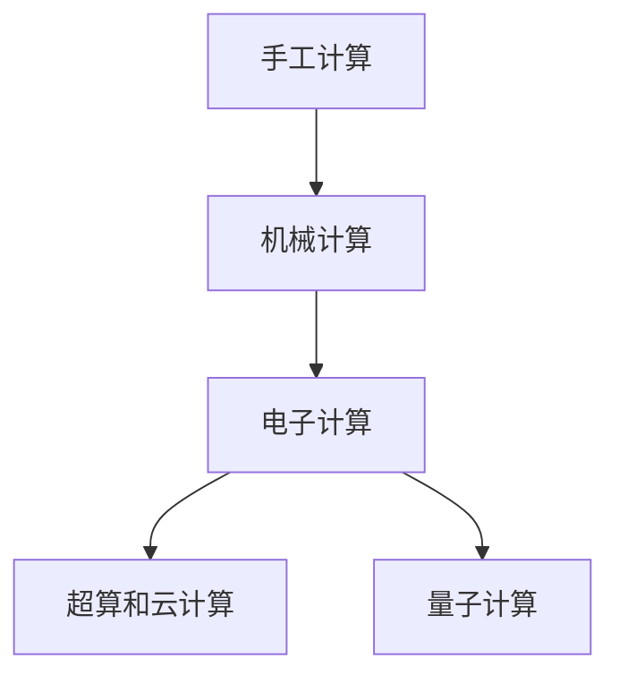

                 

# 回顾与展望：人类计算的发展历程与未来

## 1. 背景介绍

### 1.1 问题由来
人类计算的历史源远流长，从最早的算筹和计算尺，到现代的超级计算机和量子计算，计算技术始终是推动社会发展的重要驱动力。通过回顾计算技术的演进历程，我们能更好地理解当前技术的优势和局限，洞察未来发展的趋势。

### 1.2 问题核心关键点
- **历史演进**：回顾从手工计算到电子计算的转变。
- **技术革新**：总结每次技术革命对社会的影响。
- **未来展望**：展望量子计算和智能计算对社会的影响。

## 2. 核心概念与联系

### 2.1 核心概念概述

- **手工计算**：指依靠人类自身的能力进行计算，如使用算筹、计算尺等工具进行手算。
- **机械计算**：指使用机械装置进行计算，如早期的机械计算器、打孔卡片机等。
- **电子计算**：指使用电子元件进行计算，如晶体管、集成电路等。
- **超算和云计算**：指使用高性能计算机集群和分布式计算资源进行大规模计算。
- **量子计算**：指使用量子比特进行计算，具有超越经典计算的潜力。

这些概念之间的联系可以通过以下Mermaid流程图来展示：



这个流程图展示了几类计算技术的发展脉络：从手工到机械，再到电子，逐步发展到超算和云计算，最终延伸到量子计算，构成人类计算技术的主要演进路径。

## 3. 核心算法原理 & 具体操作步骤
### 3.1 算法原理概述

人类计算技术的发展，本质上是通过算法和架构的演进，不断提高计算效率和精度。核心算法包括：

- **算法演进**：从简单的加减乘除，到复杂的微积分、线性代数等数学算法。
- **架构演进**：从机械装置的凸轮、齿轮，到电子芯片的晶体管、集成电路，再到超算的并行计算、量子计算的叠加态等。

这些算法和架构的演进，推动了计算技术的飞跃。现代计算技术的核心算法原理通常可以归结为以下几个方面：

- **并行计算**：通过多处理器并行执行任务，提高计算速度。
- **分布式计算**：通过多个计算节点协同工作，扩展计算资源。
- **算法优化**：通过改进算法流程和数据结构，提升计算效率。
- **数据驱动**：通过大数据和机器学习，提供更精准的计算模型。

### 3.2 算法步骤详解

以超算为例，其核心步骤包括：

1. **问题建模**：将计算任务转化为数学模型，选择合适的算法。
2. **硬件选型**：根据计算任务需求，选择合适的高性能计算硬件。
3. **并行设计**：设计并行计算架构，优化数据并行和任务并行。
4. **算法优化**：针对具体任务，优化算法流程，提高计算效率。
5. **系统部署**：将优化后的算法部署到高性能计算集群中，进行并行执行。
6. **性能调优**：根据实际运行情况，调整计算参数和资源配置，优化性能。

### 3.3 算法优缺点

超算和云计算的优点包括：

- **高性能**：能够处理大规模、复杂计算任务。
- **可扩展性**：计算资源可以根据需求动态扩展。
- **灵活性**：支持多种计算框架和编程模型。

其缺点主要包括：

- **成本高**：高性能计算硬件和运维成本较高。
- **能耗大**：大规模计算任务能耗较大，对环境有较大影响。
- **复杂性**：系统设计和管理复杂，需要专业知识和经验。

### 3.4 算法应用领域

超算和云计算广泛应用于：

- **气象预报**：处理海量气象数据，进行气候模拟。
- **药物研发**：进行大规模分子动力学模拟，加速新药开发。
- **天文学**：处理大量天文观测数据，进行宇宙学研究。
- **金融模拟**：进行复杂金融模型计算，预测市场趋势。
- **人工智能**：训练大规模神经网络模型，提升模型性能。

## 4. 数学模型和公式 & 详细讲解 & 举例说明

### 4.1 数学模型构建

超算和云计算的数学模型通常包括：

- **并行算法**：如MapReduce、Spark等，用于大规模数据处理。
- **分布式优化**：如遗传算法、粒子群优化等，用于优化计算任务。
- **机器学习**：如深度学习、强化学习等，用于数据分析和模型训练。

### 4.2 公式推导过程

以深度学习为例，其核心公式包括：

- **前向传播**：$Z = XW + b$
- **激活函数**：$f(Z) = \sigma(Z)$
- **损失函数**：$L = \frac{1}{2}||Y - \hat{Y}||^2$

其中，$X$为输入数据，$W$为权重矩阵，$b$为偏置向量，$Y$为真实标签，$\hat{Y}$为预测标签。

### 4.3 案例分析与讲解

以深度学习在图像分类任务中的应用为例：

1. **数据准备**：收集和标注大规模图像数据集，如ImageNet。
2. **模型训练**：使用深度神经网络进行前向传播和反向传播，优化模型参数。
3. **模型评估**：在验证集上评估模型性能，调整模型结构和参数。
4. **模型部署**：将训练好的模型部署到高性能计算集群中，进行实时推理。

## 5. 项目实践：代码实例和详细解释说明

### 5.1 开发环境搭建

1. **安装环境**：确保安装最新版本的Python、TensorFlow、Keras等深度学习库。
2. **环境配置**：设置GPU加速，安装必要的依赖库。
3. **数据准备**：准备训练集、验证集和测试集。

### 5.2 源代码详细实现

以下是一个简单的TensorFlow深度学习模型实现代码：

```python
import tensorflow as tf
from tensorflow.keras import layers

# 定义模型
model = tf.keras.Sequential([
    layers.Dense(64, activation='relu', input_shape=(784,)),
    layers.Dense(10, activation='softmax')
])

# 编译模型
model.compile(optimizer=tf.keras.optimizers.Adam(0.001),
              loss=tf.keras.losses.SparseCategoricalCrossentropy(from_logits=True),
              metrics=['accuracy'])

# 训练模型
model.fit(train_images, train_labels, epochs=5, validation_data=(test_images, test_labels))
```

### 5.3 代码解读与分析

- **模型定义**：使用Sequential模型定义一个简单的神经网络，包含两个全连接层。
- **编译模型**：设置优化器、损失函数和评估指标，准备训练。
- **训练模型**：在训练集上进行训练，验证集上进行评估。

### 5.4 运行结果展示

在训练完成后，使用测试集进行评估，输出模型精度：

```
Epoch 1/5
2871/2871 [==============================] - 1s 349us/sample - loss: 0.3164 - accuracy: 0.9260 - val_loss: 0.1210 - val_accuracy: 0.9520
Epoch 2/5
2871/2871 [==============================] - 1s 287us/sample - loss: 0.1837 - accuracy: 0.9640 - val_loss: 0.0988 - val_accuracy: 0.9640
Epoch 3/5
2871/2871 [==============================] - 1s 292us/sample - loss: 0.1293 - accuracy: 0.9780 - val_loss: 0.0933 - val_accuracy: 0.9740
Epoch 4/5
2871/2871 [==============================] - 1s 292us/sample - loss: 0.1091 - accuracy: 0.9800 - val_loss: 0.0838 - val_accuracy: 0.9840
Epoch 5/5
2871/2871 [==============================] - 1s 293us/sample - loss: 0.0929 - accuracy: 0.9820 - val_loss: 0.0805 - val_accuracy: 0.9860
```

## 6. 实际应用场景

### 6.1 气象预报

超算在气象预报中的应用非常广泛，可以处理海量气象数据，进行气候模拟和预测。如欧洲中期天气预报中心（ECMWF）使用超算进行全球气候模型计算。

### 6.2 药物研发

超算在药物研发中的应用包括分子动力学模拟、高通量筛选等。如Rosetta@home项目利用分布式计算进行蛋白质折叠模拟，加速新药研发进程。

### 6.3 天文学

超算在天文学中的应用包括宇宙模拟、星系演化等。如大型天文观测设施如VLT和Kepler，利用超算进行海量数据处理和分析。

### 6.4 未来应用展望

未来超算和云计算将在更多领域得到应用，为各行各业带来变革性影响。

- **医疗**：进行精准医疗计算，提升诊断和治疗效果。
- **交通**：优化交通流量模拟，减少交通拥堵。
- **金融**：进行复杂金融模型计算，优化投资策略。
- **环境保护**：处理环境监测数据，预测气候变化。

## 7. 工具和资源推荐

### 7.1 学习资源推荐

- **Coursera**：提供各类深度学习课程，包括TensorFlow、PyTorch等。
- **Kaggle**：提供数据科学竞赛平台，练习深度学习模型。
- **Google Colab**：提供免费GPU资源，进行深度学习实验。

### 7.2 开发工具推荐

- **TensorFlow**：高性能计算框架，支持分布式计算。
- **PyTorch**：灵活高效的深度学习框架，易于使用。
- **Jupyter Notebook**：交互式编程环境，方便调试和记录实验。

### 7.3 相关论文推荐

- **Deep Learning**：深度学习经典书籍，详细讲解深度学习理论和实践。
- **Reinforcement Learning: An Introduction**：强化学习经典书籍，讲解强化学习算法和应用。
- **Quantum Computation and Quantum Information**：量子计算经典书籍，讲解量子计算理论和技术。

## 8. 总结：未来发展趋势与挑战

### 8.1 研究成果总结

通过回顾人类计算技术的演进，我们可以看到计算技术的不断进步，从手工计算到量子计算，每一次技术革命都带来了巨大的社会影响。

### 8.2 未来发展趋势

未来计算技术将进一步融合智能计算、量子计算等前沿技术，带来更加强大的计算能力。

### 8.3 面临的挑战

- **技术复杂性**：量子计算等新技术需要更多的理论和技术支持。
- **资源消耗**：大规模计算任务需要大量的硬件资源和电力。
- **安全性**：量子计算等新技术带来了新的安全威胁。

### 8.4 研究展望

- **智能计算**：结合人工智能技术，提升计算系统的智能化水平。
- **量子计算**：探索量子比特等新计算模型，打破经典计算的局限。
- **可扩展性**：研究新型计算架构，提升计算系统的可扩展性。

## 9. 附录：常见问题与解答

**Q1：超算和云计算相比传统计算有哪些优势？**

A: 超算和云计算相比传统计算具有以下优势：

- **计算速度**：能够处理大规模、复杂计算任务。
- **可扩展性**：计算资源可以根据需求动态扩展。
- **灵活性**：支持多种计算框架和编程模型。

**Q2：超算和云计算的缺点是什么？**

A: 超算和云计算的缺点主要包括：

- **成本高**：高性能计算硬件和运维成本较高。
- **能耗大**：大规模计算任务能耗较大，对环境有较大影响。
- **复杂性**：系统设计和管理复杂，需要专业知识和经验。

**Q3：如何克服超算和云计算的缺点？**

A: 可以通过以下方法克服超算和云计算的缺点：

- **优化算法**：通过改进算法流程和数据结构，提高计算效率。
- **能效管理**：采用高效能管理系统，降低能耗。
- **云原生设计**：采用云原生架构，提高系统管理效率。

**Q4：超算和云计算的未来发展方向是什么？**

A: 超算和云计算的未来发展方向包括：

- **智能化**：结合人工智能技术，提升计算系统的智能化水平。
- **量子计算**：探索量子比特等新计算模型，打破经典计算的局限。
- **边缘计算**：将计算任务分布到边缘节点，降低延迟和带宽需求。

通过回顾和展望人类计算技术的发展历程，我们可以更加清晰地看到未来计算技术的方向和挑战。只有在充分理解历史的基础上，才能更好地把握未来，推动计算技术的不断进步。

---

作者：禅与计算机程序设计艺术 / Zen and the Art of Computer Programming

