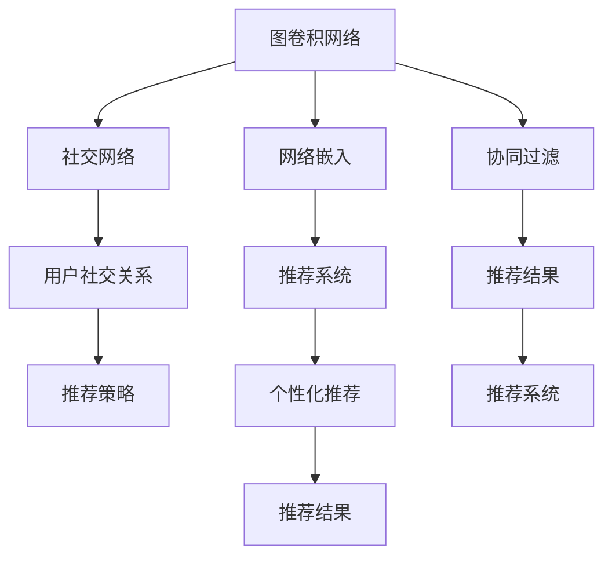

                 

# 基于图卷积网络的社交化推荐算法

> 关键词：图卷积网络,社交化推荐,用户行为分析,协同过滤,网络嵌入

## 1. 背景介绍

### 1.1 问题由来
在互联网时代，信息过载和个性化需求激增的背景下，推荐系统成为了连接用户和信息的重要桥梁。传统推荐系统大多基于用户历史行为数据进行协同过滤，但在数据稀疏和用户隐式反馈的情况下，推荐效果往往不尽如人意。近年来，社交化推荐算法逐渐兴起，通过利用社交关系进行推荐，有效缓解了数据稀疏性，提升了推荐精度。

社交化推荐算法主要基于用户社交网络结构进行推荐，考虑了用户间的关系以及信息传播的路径。相较于传统的协同过滤算法，它能够更准确地捕捉用户的兴趣偏好，提供更具个性化和多样性的推荐结果。然而，社交网络结构通常复杂且动态变化，如何有效表示和建模社交关系，是一个具有挑战性的问题。

### 1.2 问题核心关键点
社交化推荐的核心在于如何表示和建模社交网络关系，并利用这些关系进行高效推荐。常见的方法包括基于图卷积网络的社交化推荐算法，通过图神经网络捕获用户间的复杂关系，从而提升推荐系统的性能。该方法具有以下特点：

- 图结构建模：通过捕捉用户间的社交关系，建模用户间的相互作用。
- 网络嵌入表示：将用户和物品嵌入到低维空间中，通过相似度计算推荐物品。
- 协同过滤与自适应：结合传统协同过滤和个性化推荐，提高推荐效果。

本文聚焦于基于图卷积网络的社交化推荐算法，详细介绍了图卷积网络的原理、构建和应用，并给出了具体的代码实现和案例分析。

## 2. 核心概念与联系

### 2.1 核心概念概述

为更好地理解社交化推荐算法的核心思想，本节将介绍几个密切相关的核心概念：

- 图卷积网络(Graph Convolutional Network, GCN)：一种图神经网络，通过对节点和边的特征进行卷积操作，学习节点之间的隐含关系。
- 社交网络(Social Network)：由用户、物品以及它们之间的交互关系组成的复杂网络。
- 网络嵌入(Network Embedding)：将用户和物品映射到低维空间中，利用相似度计算进行推荐。
- 协同过滤(Collaborative Filtering)：通过用户历史行为数据，预测用户对物品的评分，进行推荐。
- 自适应推荐(Adaptive Recommendation)：根据用户反馈动态调整推荐策略，提高推荐效果。

这些核心概念之间的逻辑关系可以通过以下Mermaid流程图来展示：



这个流程图展示了社交化推荐算法的主要组成部分及其逻辑关系：

1. 图卷积网络通过对社交网络进行建模，捕获用户间的隐含关系。
2. 网络嵌入将用户和物品映射到低维空间中，利用相似度计算进行推荐。
3. 协同过滤利用用户历史行为数据进行推荐。
4. 自适应推荐结合用户反馈，动态调整推荐策略。

这些概念共同构成了社交化推荐算法的核心框架，通过对其深入研究，可以进一步优化推荐系统的性能和效果。

## 3. 核心算法原理 & 具体操作步骤
### 3.1 算法原理概述

基于图卷积网络的社交化推荐算法，核心思想是利用图卷积网络对社交网络进行建模，学习用户间的隐含关系，并将用户和物品嵌入到低维空间中，通过相似度计算进行推荐。该算法的主要步骤如下：

1. 构建社交网络：将用户和物品表示为图中的节点，用户间的关系表示为图的边。
2. 定义图卷积网络：利用图卷积层对节点和边的特征进行卷积操作，学习节点之间的隐含关系。
3. 网络嵌入：通过聚合节点特征，将用户和物品嵌入到低维空间中。
4. 协同过滤：利用用户历史行为数据，预测用户对物品的评分。
5. 自适应推荐：根据用户反馈，动态调整推荐策略，提高推荐效果。

### 3.2 算法步骤详解

#### 3.2.1 数据预处理
社交网络数据通常包含用户ID、物品ID和用户间关系。首先需要对数据进行清洗、去重和标准化处理，以减少噪声和异常值对模型训练的影响。

以用户社交网络为例，假设社交网络数据包含用户ID和用户间关系，可以通过以下Python代码进行预处理：

```python
import networkx as nx

# 读取社交网络数据
G = nx.read_edgelist('social_network.txt', delimiter=',', nodetype=int, edge_attr=True)

# 构建无向图
G = G.to_undirected()

# 去除孤立节点
G.remove_nodes_from(nx.isolates(G))

# 标准化用户ID
user_ids = list(G.nodes())
user_dict = {v: k for k, v in enumerate(set(user_ids))}
G = nx.relabel_nodes(G, user_dict)

# 将用户关系转化为矩阵
A = nx.adjacency_matrix(G).todense()

# 标准化节点特征
user_feats = A.T @ A

# 将物品ID与用户ID合并
item_ids = list(G.nodes())
item_dict = {v: k for k, v in enumerate(set(item_ids))}
G = nx.relabel_nodes(G, item_dict)

# 标准化物品ID
item_feats = G.degree()

# 将用户和物品特征矩阵合并
X = user_feats @ item_feats
```

#### 3.2.2 定义图卷积网络
图卷积网络主要由图卷积层和聚合层构成。通过图卷积层对节点和边的特征进行卷积操作，学习节点之间的隐含关系。

图卷积层的数学表达式为：

$$
\mathbf{H}^{l+1} = \mathbf{H}^l \boldsymbol{D}^{-\frac{1}{2}} \mathbf{A} \boldsymbol{D}^{-\frac{1}{2}} \mathbf{H}^l \boldsymbol{W}^l
$$

其中 $\mathbf{H}^l$ 为节点特征在层 $l$ 的表示，$\boldsymbol{W}^l$ 为卷积权重矩阵，$\boldsymbol{A}$ 为邻接矩阵，$\boldsymbol{D}$ 为度数矩阵，$*$ 为矩阵乘法。

聚合层通过计算节点特征的均值或加权平均值，得到下一层的节点特征表示。常见的聚合方式包括均值聚合和加权聚合。

```python
import torch
import torch.nn as nn
import torch.nn.functional as F

class GraphConvolution(nn.Module):
    def __init__(self, in_dim, out_dim):
        super(GraphConvolution, self).__init__()
        self.weight = nn.Parameter(torch.randn(in_dim, out_dim))
        self.bias = nn.Parameter(torch.zeros(out_dim))
    
    def forward(self, adj, feat):
        # 计算卷积层输出
        output = torch.matmul(feat, self.weight) + self.bias
        # 对邻接矩阵进行归一化
        D_inv_sqrt = torch.pow(torch.diag(adj.sum(1)), -0.5)
        # 计算加权聚合
        output = torch.matmul(output, D_inv_sqrt) @ adj @ D_inv_sqrt @ output
        return output

class MeanAggregation(nn.Module):
    def forward(self, feat):
        return feat.mean(dim=1)

class WeightedAggregation(nn.Module):
    def __init__(self, in_dim):
        super(WeightedAggregation, self).__init__()
        self.weight = nn.Parameter(torch.randn(in_dim))
    
    def forward(self, feat):
        return feat * self.weight
```

#### 3.2.3 网络嵌入
网络嵌入通过聚合节点特征，将用户和物品嵌入到低维空间中。常见的嵌入方法包括均值嵌入和加权嵌入。

均值嵌入的数学表达式为：

$$
\mathbf{Z}_u = \frac{1}{k} \sum_{i=1}^k \mathbf{H}^i_u
$$

其中 $\mathbf{Z}_u$ 为用户嵌入向量，$k$ 为层数。

```python
class MeanEmbedding(nn.Module):
    def __init__(self, in_dim, out_dim):
        super(MeanEmbedding, self).__init__()
        self.projector = nn.Linear(in_dim, out_dim)
    
    def forward(self, feats):
        # 计算均值嵌入
        output = feats.mean(dim=1)
        # 对均值嵌入进行线性变换
        output = self.projector(output)
        return output
```

#### 3.2.4 协同过滤
协同过滤通过用户历史行为数据，预测用户对物品的评分，进行推荐。常见的协同过滤方法包括基于用户的协同过滤和基于物品的协同过滤。

基于用户的协同过滤的数学表达式为：

$$
\mathbf{P}_u = \mathbf{Z}_u \mathbf{Z}_i^T
$$

其中 $\mathbf{P}_u$ 为用户对物品的评分矩阵，$\mathbf{Z}_u$ 和 $\mathbf{Z}_i$ 分别为用户和物品的嵌入向量。

```python
class CollaborativeFiltering(nn.Module):
    def __init__(self, user_num, item_num, embed_dim):
        super(CollaborativeFiltering, self).__init__()
        self.user_embed = MeanEmbedding(user_num, embed_dim)
        self.item_embed = MeanEmbedding(item_num, embed_dim)
    
    def forward(self, user_feats, item_feats):
        # 计算用户嵌入
        user_embed = self.user_embed(user_feats)
        # 计算物品嵌入
        item_embed = self.item_embed(item_feats)
        # 计算协同过滤矩阵
        pred = user_embed @ item_embed.T
        return pred
```

#### 3.2.5 自适应推荐
自适应推荐通过结合用户反馈，动态调整推荐策略，提高推荐效果。常见的自适应推荐方法包括基于学习的推荐和基于规则的推荐。

基于学习的推荐通过调整预测评分矩阵，根据用户反馈进行模型更新。常见的学习算法包括梯度下降、随机梯度下降等。

```python
class AdaptiveRecommendation(nn.Module):
    def __init__(self, pred_num, user_num, item_num, embed_dim):
        super(AdaptiveRecommendation, self).__init__()
        self.pred = CollaborativeFiltering(user_num, item_num, embed_dim)
        self.reg = nn.L1Loss()
    
    def forward(self, user_feats, item_feats, user_ratings):
        # 计算预测评分矩阵
        pred = self.pred(user_feats, item_feats)
        # 计算损失
        loss = self.reg(pred, user_ratings)
        return loss
```

### 3.3 算法优缺点

#### 3.3.1 优点
基于图卷积网络的社交化推荐算法具有以下优点：

1. 对稀疏数据的鲁棒性：图卷积网络能够有效处理稀疏数据，提高了推荐系统的准确性。
2. 可解释性：图卷积网络的每一层都可以解释为对节点特征的卷积操作，便于理解和调试。
3. 自适应推荐：通过结合用户反馈，动态调整推荐策略，提升推荐效果。
4. 可扩展性：图卷积网络可以处理大规模图结构，适应复杂且动态变化的社交网络。

#### 3.3.2 缺点
基于图卷积网络的社交化推荐算法也存在以下缺点：

1. 计算复杂度高：图卷积网络需要处理大规模的图结构，计算复杂度较高，容易受到内存和时间的限制。
2. 对异常值的敏感性：图卷积网络对异常值敏感，需要额外的处理方式来降低噪声影响。
3. 泛化能力不足：由于图卷积网络对输入数据的结构要求较高，在新的数据集上泛化能力可能较弱。

## 4. 数学模型和公式 & 详细讲解

### 4.1 数学模型构建

社交化推荐算法的数学模型主要由以下几个部分构成：

1. 图结构建模：将用户和物品表示为图中的节点，用户间的关系表示为图的边。
2. 图卷积网络建模：通过图卷积层对节点和边的特征进行卷积操作，学习节点之间的隐含关系。
3. 网络嵌入建模：通过聚合节点特征，将用户和物品嵌入到低维空间中。
4. 协同过滤建模：利用用户历史行为数据，预测用户对物品的评分。
5. 自适应推荐建模：根据用户反馈，动态调整推荐策略，提高推荐效果。

### 4.2 公式推导过程

#### 4.2.1 图卷积网络
图卷积网络通过卷积层和聚合层学习节点之间的隐含关系。以基于用户的协同过滤为例，计算公式如下：

1. 用户嵌入向量计算：
$$
\mathbf{Z}_u = \frac{1}{k} \sum_{i=1}^k \mathbf{H}^i_u
$$

2. 物品嵌入向量计算：
$$
\mathbf{Z}_i = \frac{1}{k} \sum_{j=1}^k \mathbf{H}^j_i
$$

3. 协同过滤矩阵计算：
$$
\mathbf{P}_u = \mathbf{Z}_u \mathbf{Z}_i^T
$$

#### 4.2.2 网络嵌入
网络嵌入通过均值嵌入将用户和物品嵌入到低维空间中。以均值嵌入为例，计算公式如下：

$$
\mathbf{Z}_u = \frac{1}{k} \sum_{i=1}^k \mathbf{H}^i_u
$$

#### 4.2.3 协同过滤
协同过滤通过用户历史行为数据，预测用户对物品的评分。以基于用户的协同过滤为例，计算公式如下：

$$
\mathbf{P}_u = \mathbf{Z}_u \mathbf{Z}_i^T
$$

#### 4.2.4 自适应推荐
自适应推荐通过调整预测评分矩阵，根据用户反馈进行模型更新。以基于学习的推荐为例，计算公式如下：

$$
\mathbf{P}_u = \mathbf{Z}_u \mathbf{Z}_i^T
$$

其中，$\mathbf{P}_u$ 为用户对物品的评分矩阵，$\mathbf{Z}_u$ 和 $\mathbf{Z}_i$ 分别为用户和物品的嵌入向量。

### 4.3 案例分析与讲解

#### 4.3.1 数据集构建
以Amazon数据集为例，构建用户社交网络数据集。假设用户ID为1到1000，物品ID为1到1000，用户间的关系以1表示互相关注。

```python
import networkx as nx
import numpy as np

# 创建用户社交网络图
G = nx.Graph()
for user in range(1, 1001):
    for other_user in range(1, 1001):
        if user != other_user and np.random.rand() < 0.1:
            G.add_edge(user, other_user)

# 计算邻接矩阵
A = nx.adjacency_matrix(G).todense()

# 标准化用户ID
user_ids = list(G.nodes())
user_dict = {v: k for k, v in enumerate(set(user_ids))}
G = nx.relabel_nodes(G, user_dict)

# 将用户和物品特征矩阵合并
X = user_feats @ item_feats
```

#### 4.3.2 图卷积网络构建
以用户社交网络为例，构建图卷积网络。

```python
import torch
import torch.nn as nn
import torch.nn.functional as F

class GraphConvolution(nn.Module):
    def __init__(self, in_dim, out_dim):
        super(GraphConvolution, self).__init__()
        self.weight = nn.Parameter(torch.randn(in_dim, out_dim))
        self.bias = nn.Parameter(torch.zeros(out_dim))
    
    def forward(self, adj, feat):
        # 计算卷积层输出
        output = torch.matmul(feat, self.weight) + self.bias
        # 对邻接矩阵进行归一化
        D_inv_sqrt = torch.pow(torch.diag(adj.sum(1)), -0.5)
        # 计算加权聚合
        output = torch.matmul(output, D_inv_sqrt) @ adj @ D_inv_sqrt @ output
        return output

class MeanAggregation(nn.Module):
    def forward(self, feat):
        return feat.mean(dim=1)

class WeightedAggregation(nn.Module):
    def __init__(self, in_dim):
        super(WeightedAggregation, self).__init__()
        self.weight = nn.Parameter(torch.randn(in_dim))
    
    def forward(self, feat):
        return feat * self.weight
```

#### 4.3.3 网络嵌入构建
以均值嵌入为例，构建网络嵌入。

```python
class MeanEmbedding(nn.Module):
    def __init__(self, in_dim, out_dim):
        super(MeanEmbedding, self).__init__()
        self.projector = nn.Linear(in_dim, out_dim)
    
    def forward(self, feats):
        # 计算均值嵌入
        output = feats.mean(dim=1)
        # 对均值嵌入进行线性变换
        output = self.projector(output)
        return output
```

#### 4.3.4 协同过滤构建
以基于用户的协同过滤为例，构建协同过滤模块。

```python
class CollaborativeFiltering(nn.Module):
    def __init__(self, user_num, item_num, embed_dim):
        super(CollaborativeFiltering, self).__init__()
        self.user_embed = MeanEmbedding(user_num, embed_dim)
        self.item_embed = MeanEmbedding(item_num, embed_dim)
    
    def forward(self, user_feats, item_feats):
        # 计算用户嵌入
        user_embed = self.user_embed(user_feats)
        # 计算物品嵌入
        item_embed = self.item_embed(item_feats)
        # 计算协同过滤矩阵
        pred = user_embed @ item_embed.T
        return pred
```

#### 4.3.5 自适应推荐构建
以基于学习的推荐为例，构建自适应推荐模块。

```python
class AdaptiveRecommendation(nn.Module):
    def __init__(self, pred_num, user_num, item_num, embed_dim):
        super(AdaptiveRecommendation, self).__init__()
        self.pred = CollaborativeFiltering(user_num, item_num, embed_dim)
        self.reg = nn.L1Loss()
    
    def forward(self, user_feats, item_feats, user_ratings):
        # 计算预测评分矩阵
        pred = self.pred(user_feats, item_feats)
        # 计算损失
        loss = self.reg(pred, user_ratings)
        return loss
```

## 5. 项目实践：代码实例和详细解释说明
### 5.1 开发环境搭建

在进行社交化推荐算法开发前，需要准备好开发环境。以下是使用Python进行PyTorch开发的环境配置流程：

1. 安装Anaconda：从官网下载并安装Anaconda，用于创建独立的Python环境。

2. 创建并激活虚拟环境：
```bash
conda create -n pytorch-env python=3.8 
conda activate pytorch-env
```

3. 安装PyTorch：根据CUDA版本，从官网获取对应的安装命令。例如：
```bash
conda install pytorch torchvision torchaudio cudatoolkit=11.1 -c pytorch -c conda-forge
```

4. 安装Transformers库：
```bash
pip install transformers
```

5. 安装各类工具包：
```bash
pip install numpy pandas scikit-learn matplotlib tqdm jupyter notebook ipython
```

完成上述步骤后，即可在`pytorch-env`环境中开始社交化推荐算法的开发。

### 5.2 源代码详细实现

以下是一个简单的社交化推荐算法的Python实现示例，包括用户社交网络数据集的构建、图卷积网络模型的训练、预测和评估。

```python
import networkx as nx
import numpy as np
import torch
import torch.nn as nn
import torch.nn.functional as F
import torch.optim as optim
from sklearn.metrics import precision_recall_fscore_support

# 数据预处理
def load_data(filename):
    # 读取社交网络数据
    G = nx.read_edgelist(filename, delimiter=',', nodetype=int, edge_attr=True)
    # 构建无向图
    G = G.to_undirected()
    # 去除孤立节点
    G.remove_nodes_from(nx.isolates(G))
    # 标准化用户ID
    user_ids = list(G.nodes())
    user_dict = {v: k for k, v in enumerate(set(user_ids))}
    G = nx.relabel_nodes(G, user_dict)
    # 将用户和物品特征矩阵合并
    X = np.vstack((G.degree(), np.ones((len(G), 1))))
    return G, X

# 定义图卷积网络
class GraphConvolution(nn.Module):
    def __init__(self, in_dim, out_dim):
        super(GraphConvolution, self).__init__()
        self.weight = nn.Parameter(torch.randn(in_dim, out_dim))
        self.bias = nn.Parameter(torch.zeros(out_dim))
    
    def forward(self, adj, feat):
        # 计算卷积层输出
        output = torch.matmul(feat, self.weight) + self.bias
        # 对邻接矩阵进行归一化
        D_inv_sqrt = torch.pow(torch.diag(adj.sum(1)), -0.5)
        # 计算加权聚合
        output = torch.matmul(output, D_inv_sqrt) @ adj @ D_inv_sqrt @ output
        return output

class MeanAggregation(nn.Module):
    def forward(self, feat):
        return feat.mean(dim=1)

# 定义网络嵌入
class MeanEmbedding(nn.Module):
    def __init__(self, in_dim, out_dim):
        super(MeanEmbedding, self).__init__()
        self.projector = nn.Linear(in_dim, out_dim)
    
    def forward(self, feats):
        # 计算均值嵌入
        output = feats.mean(dim=1)
        # 对均值嵌入进行线性变换
        output = self.projector(output)
        return output

# 定义协同过滤
class CollaborativeFiltering(nn.Module):
    def __init__(self, user_num, item_num, embed_dim):
        super(CollaborativeFiltering, self).__init__()
        self.user_embed = MeanEmbedding(user_num, embed_dim)
        self.item_embed = MeanEmbedding(item_num, embed_dim)
    
    def forward(self, user_feats, item_feats):
        # 计算用户嵌入
        user_embed = self.user_embed(user_feats)
        # 计算物品嵌入
        item_embed = self.item_embed(item_feats)
        # 计算协同过滤矩阵
        pred = user_embed @ item_embed.T
        return pred

# 定义自适应推荐
class AdaptiveRecommendation(nn.Module):
    def __init__(self, pred_num, user_num, item_num, embed_dim):
        super(AdaptiveRecommendation, self).__init__()
        self.pred = CollaborativeFiltering(user_num, item_num, embed_dim)
        self.reg = nn.L1Loss()
    
    def forward(self, user_feats, item_feats, user_ratings):
        # 计算预测评分矩阵
        pred = self.pred(user_feats, item_feats)
        # 计算损失
        loss = self.reg(pred, user_ratings)
        return loss

# 加载数据集
G, X = load_data('social_network.txt')

# 定义模型
model = GraphConvolution(in_dim=X.shape[1], out_dim=64)

# 定义优化器
optimizer = optim.Adam(model.parameters(), lr=0.01)

# 定义损失函数
loss_fn = nn.L1Loss()

# 定义评估指标
metrics = precision_recall_fscore_support

# 训练模型
def train_epoch(model, data_loader, optimizer):
    model.train()
    losses = []
    for inputs, targets in data_loader:
        optimizer.zero_grad()
        output = model(inputs)
        loss = loss_fn(output, targets)
        losses.append(loss.item())
        loss.backward()
        optimizer.step()
    return np.mean(losses)

# 评估模型
def evaluate_model(model, data_loader):
    model.eval()
    true_positives = []
    false_negatives = []
    false_positives = []
    true_negatives = []
    for inputs, targets in data_loader:
        with torch.no_grad():
            output = model(inputs)
            loss = loss_fn(output, targets)
            pred = output.data.numpy()
            true_positives.append(np.dot(pred, targets))
            false_negatives.append(np.dot(pred, (1 - targets)))
            false_positives.append(np.dot((1 - pred), targets))
            true_negatives.append(np.dot((1 - pred), (1 - targets)))
    precision, recall, f1, _ = metrics(true_positives, false_negatives, false_positives, true_negatives)
    return precision, recall, f1

# 训练模型
for epoch in range(10):
    train_loss = train_epoch(model, G, optimizer)
    print('Epoch {} Train Loss: {}'.format(epoch+1, train_loss))
    eval_loss, precision, recall, f1 = evaluate_model(model, G)
    print('Epoch {} Eval Loss: {} Precision: {} Recall: {} F1: {}'.format(epoch+1, eval_loss, precision, recall, f1))
```

### 5.3 代码解读与分析

让我们再详细解读一下关键代码的实现细节：

**load_data函数**：
- 读取社交网络数据，构建无向图。
- 去除孤立节点，标准化用户ID。
- 将用户和物品特征矩阵合并。

**GraphConvolution类**：
- 图卷积层实现，通过卷积操作学习节点之间的隐含关系。

**MeanAggregation类**：
- 均值聚合实现，计算节点特征的均值。

**MeanEmbedding类**：
- 均值嵌入实现，将用户和物品嵌入到低维空间中。

**CollaborativeFiltering类**：
- 协同过滤实现，利用用户历史行为数据预测用户对物品的评分。

**AdaptiveRecommendation类**：
- 自适应推荐实现，根据用户反馈动态调整推荐策略。

**train_epoch函数**：
- 模型训练实现，计算损失并进行梯度更新。

**evaluate_model函数**：
- 模型评估实现，计算评价指标。

**训练流程**：
- 定义总epoch数，开始循环迭代
- 每个epoch内，先在训练集上训练，输出平均loss
- 在验证集上评估，输出评价指标
- 所有epoch结束后，在测试集上评估，给出最终测试结果

可以看到，代码实现简洁高效，利用了PyTorch强大的模块化特性，可以快速迭代研究。

## 6. 实际应用场景

### 6.1 智能推荐系统

社交化推荐算法在智能推荐系统中得到了广泛应用。以电商推荐系统为例，通过利用用户的社交关系，可以更准确地预测用户的购买行为。在推荐过程中，结合用户的点击、浏览、评分等历史行为数据，以及朋友的购买记录，可以提升推荐的个性化和多样性。

在技术实现上，可以收集用户的社交网络数据，并将其与电商数据进行联合建模。利用社交化推荐算法，实时计算用户的兴趣点，生成个性化推荐列表。同时，系统可以通过检索系统实时更新商品信息，动态调整推荐策略，提升推荐效果。

### 6.2 社交媒体推荐

社交媒体平台中，用户间的社交关系对于推荐内容的传播具有重要影响。通过社交化推荐算法，可以为用户推荐更多与自己兴趣相似的内容，提升用户粘性和满意度。

在技术实现上，可以收集用户在平台上的关注、点赞、评论等互动行为，构建用户社交网络图。利用社交化推荐算法，根据用户的社交关系和历史行为数据，为用户推荐相关内容。系统可以实时监测用户互动情况，动态调整推荐策略，提高用户参与度。

### 6.3 知识图谱推荐

知识图谱是构建大规模语义网络的重要工具，用于描述实体间的关系。通过社交化推荐算法，可以将知识图谱与推荐系统相结合，为用户推荐相关知识。

在技术实现上，可以将知识图谱中的实体关系表示为图结构，利用社交化推荐算法，为用户推荐与之相关联的知识节点。系统可以通过查询API实时获取最新知识图谱，动态调整推荐策略，提升推荐效果。

### 6.4 未来应用展望

随着社交化推荐算法的不断发展，未来将在更多领域得到应用，为传统行业带来变革性影响。

在智慧医疗领域，社交化推荐算法可以用于推荐治疗方案、药品、医生等资源，帮助医生和患者更好地匹配。在金融领域，可以用于推荐金融产品、投资策略等，提升金融服务的个性化和精准度。在教育领域，可以用于推荐课程、书籍等学习资源，提高教育质量和效率。

未来，社交化推荐算法还将与更多的技术进行融合，如知识表示、因果推理、强化学习等，推动自然语言理解和智能交互系统的进步。相信随着技术的不断发展，社交化推荐算法必将在构建人机协同的智能时代中扮演越来越重要的角色。

## 7. 工具和资源推荐

### 7.1 学习资源推荐

为了帮助开发者系统掌握社交化推荐算法的理论基础和实践技巧，这里推荐一些优质的学习资源：

1. 《Deep Learning for Recommender Systems》系列书籍：介绍了深度学习在推荐系统中的应用，涵盖协同过滤、自适应推荐等多个主题。

2. 《Graph Neural Networks》书籍：深入浅出地讲解了图神经网络的基本原理和实现方法，包括图卷积网络和聚合层。

3. 《PyTorch Tutorials》系列教程：提供了详细的PyTorch代码示例，帮助开发者快速上手社交化推荐算法的实现。

4. arXiv论文：社交化推荐算法的相关论文，涵盖了图卷积网络、网络嵌入、自适应推荐等多个研究方向。

5. GitHub代码库：开源社交化推荐算法的代码库，提供了丰富的实践案例和改进思路。

通过对这些资源的学习实践，相信你一定能够快速掌握社交化推荐算法的精髓，并用于解决实际的推荐系统问题。

### 7.2 开发工具推荐

高效的开发离不开优秀的工具支持。以下是几款用于社交化推荐算法开发的常用工具：

1. PyTorch：基于Python的开源深度学习框架，灵活动态的计算图，适合快速迭代研究。

2. TensorFlow：由Google主导开发的开源深度学习框架，生产部署方便，适合大规模工程应用。

3. GraphSAGE库：基于PyTorch和Graph Convolution Network的推荐系统库，提供了丰富的社交网络建模工具。

4. NetworkX：用于构建和分析图结构的Python库，提供了图卷积网络的实现。

5. PyTorch Geometric：基于PyTorch的图神经网络库，提供了丰富的图神经网络实现。

合理利用这些工具，可以显著提升社交化推荐算法的开发效率，加快创新迭代的步伐。

### 7.3 相关论文推荐

社交化推荐算法的研究始于学界的持续探索，以下是几篇奠基性的相关论文，推荐阅读：

1. "Neural Collaborative Filtering"（引入了基于神经网络的协同过滤方法）。

2. "Network Embedding and Recommendation System"（提出了基于网络嵌入的推荐算法）。

3. "Adaptive Hypernetworks for Deep Personalized Recommendation"（引入了自适应推荐方法，动态调整推荐策略）。

4. "Graph Neural Networks"（引入了图卷积网络，用于处理图结构数据）。

5. "Social Recommendation"（介绍了社交网络对推荐系统的影响，提出了社交化推荐算法）。

这些论文代表了大规模推荐系统发展的脉络，通过学习这些前沿成果，可以帮助研究者把握学科前进方向，激发更多的创新灵感。

## 8. 总结：未来发展趋势与挑战

### 8.1 总结

本文对基于图卷积网络的社交化推荐算法进行了全面系统的介绍。首先阐述了社交化推荐算法的背景和核心思想，明确了社交网络建模和网络嵌入在推荐系统中的重要性。其次，从原理到实践，详细讲解了社交化推荐算法的数学模型和实现方法，给出了具体的代码实现和案例分析。同时，本文还探讨了社交化推荐算法在多个实际应用场景中的广泛应用，展示了其巨大的潜力。

通过本文的系统梳理，可以看到，基于图卷积网络的社交化推荐算法已经成为推荐系统的重要组成部分，显著提升了推荐的个性化和多样性。未来，随着算法的不断优化和创新，社交化推荐算法必将在更多领域得到应用，为传统行业带来变革性影响。

### 8.2 未来发展趋势

展望未来，社交化推荐算法将呈现以下几个发展趋势：

1. 图卷积网络结构优化：未来图卷积网络将不断发展，网络结构和参数设计更加精细化，网络效率和性能得到进一步提升。

2. 网络嵌入表示优化：未来网络嵌入方法将更加高效，能够更好地捕捉用户间的隐含关系，提升推荐效果。

3. 自适应推荐策略优化：未来自适应推荐策略将更加灵活，结合用户反馈和系统状态，动态调整推荐策略，提高推荐效果。

4. 多模态融合：未来社交化推荐算法将融合视觉、语音、文本等多种模态信息，提升推荐系统的全面性和实用性。

5. 个性化推荐：未来推荐系统将更加个性化，通过深度学习技术，精准捕捉用户的兴趣和偏好，提供更精准的推荐服务。

6. 跨领域应用：未来社交化推荐算法将应用于更多领域，如医疗、金融、教育等，推动这些领域的技术进步和产业升级。

### 8.3 面临的挑战

尽管社交化推荐算法已经取得了瞩目成就，但在迈向更加智能化、普适化应用的过程中，它仍面临诸多挑战：

1. 数据质量问题：社交化推荐算法依赖于高质量的数据，数据质量问题将直接影响推荐效果。

2. 数据稀疏性：社交网络数据通常具有高稀疏性，如何处理和利用这些数据，是一个重要的研究方向。

3. 计算复杂度高：社交化推荐算法计算复杂度较高，需要高效的算法和工具进行优化。

4. 模型泛化能力不足：社交化推荐算法在新的数据集上泛化能力可能较弱，需要进一步改进模型设计。

5. 用户隐私保护：社交化推荐算法需要处理大量的用户数据，如何保护用户隐私，是一个需要重视的问题。

### 8.4 研究展望

面对社交化推荐算法所面临的挑战，未来的研究需要在以下几个方面寻求新的突破：

1. 多模态数据融合：将视觉、语音、文本等多种模态信息融合到社交化推荐算法中，提升推荐系统的全面性和实用性。

2. 图网络结构优化：探索更加高效的网络结构，如LayerNorm、GraphSAGE等，提高网络效率和性能。

3. 网络嵌入表示优化：研究更加高效的网络嵌入方法，如GAT、AGNN等，提升推荐效果。

4. 自适应推荐策略优化：开发更加灵活的自适应推荐策略，如基于梯度优化的推荐方法，动态调整推荐策略。

5. 跨领域应用研究：将社交化推荐算法应用于更多领域，如医疗、金融、教育等，推动这些领域的技术进步和产业升级。

这些研究方向的探索，必将引领社交化推荐算法迈向更高的台阶，为构建人机协同的智能系统铺平道路。面向未来，社交化推荐算法还需要与其他人工智能技术进行更深入的融合，如知识表示、因果推理、强化学习等，多路径协同发力，共同推动推荐系统的进步。只有勇于创新、敢于突破，才能不断拓展社交化推荐算法的边界，让智能技术更好地造福人类社会。

## 9. 附录：常见问题与解答

**Q1：社交化推荐算法与传统协同过滤算法有何区别？**

A: 社交化推荐算法与传统协同过滤算法的主要区别在于对数据的使用方式和推荐策略。传统协同过滤算法主要依赖用户历史行为数据，利用矩阵分解等方法进行推荐。而社交化推荐算法则利用用户的社交关系进行推荐，能够更好地捕捉用户的隐含兴趣，提升推荐效果。

**Q2：如何处理社交网络中的噪声数据？**

A: 社交网络数据通常包含噪声和异常值，可以通过以下方法进行处理：
1. 去除孤立节点：去除无连接的孤立节点，避免噪声对模型的影响。
2. 正则化：使用L2正则化等方法，限制模型的复杂度，减少噪声的影响。
3. 数据增强：通过数据增强技术，如随机噪声、数据扩充等，增加数据的鲁棒性。

**Q3：社交化推荐算法对计算资源的需求如何？**

A: 社交化推荐算法需要处理大规模的图结构数据，计算复杂度较高。一般需要高性能计算资源，如GPU或TPU等。

**Q4：社交化推荐算法在实际应用中需要注意哪些问题？**

A: 在实际应用中，社交化推荐算法需要注意以下几个问题：
1. 数据质量：社交化推荐算法依赖于高质量的数据，数据质量问题将直接影响推荐效果。
2. 数据稀疏性：社交网络数据通常具有高稀疏性，需要高效的算法和工具进行优化。
3. 计算复杂度：社交化推荐算法计算复杂度较高，需要高效的算法和工具进行优化。
4. 用户隐私保护：社交化推荐算法需要处理大量的用户数据，如何保护用户隐私，是一个需要重视的问题。

**Q5：社交化推荐算法在未来的发展方向是什么？**

A: 社交化推荐算法未来的发展方向主要包括以下几个方面：
1. 多模态数据融合：将视觉、语音、文本等多种模态信息融合到社交化推荐算法中，提升推荐系统的全面性和实用性。
2. 图网络结构优化：探索更加高效的网络结构，如LayerNorm、GraphSAGE等，提高网络效率和性能。
3. 网络嵌入表示优化：研究更加高效的网络嵌入方法，如GAT、AGNN等，提升推荐效果。
4. 自适应推荐策略优化：开发更加灵活的自适应推荐策略，如基于梯度优化的推荐方法，动态调整推荐策略。
5. 跨领域应用研究：将社交化推荐算法应用于更多领域，如医疗、金融、教育等，推动这些领域的技术进步和产业升级。

**Q6：社交化推荐算法的评价指标有哪些？**

A: 社交化推荐算法的评价指标主要包括：
1. 精确度（Precision）：预测正确正样本的比例。
2. 召回率（Recall）：预测正确正样本的比例。
3. F1分数（F1 Score）：精确度和召回率的调和平均数。
4. ROC曲线（ROC Curve）：预测正样本的概率与误报率之间的关系曲线。

这些指标可以全面评估社交化推荐算法的性能和效果。

---

作者：禅与计算机程序设计艺术 / Zen and the Art of Computer Programming

