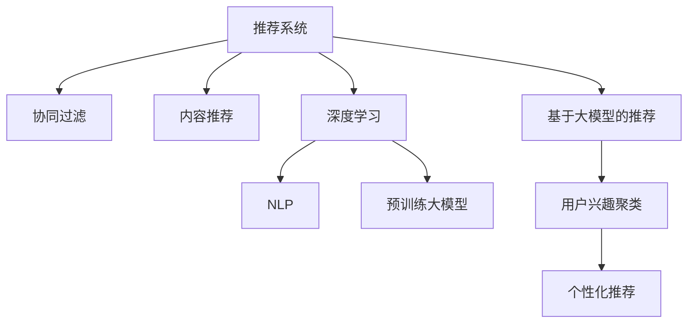

                 

# 基于大模型的推荐系统用户兴趣聚类

> 关键词：基于大模型推荐系统,用户兴趣聚类,协同过滤,神经网络,深度学习,自然语言处理(NLP)

## 1. 背景介绍

### 1.1 问题由来
推荐系统(Recommendation System)作为互联网时代最为成功的应用之一，通过分析用户的浏览、点击、购买等行为数据，推荐用户可能感兴趣的商品或内容。传统的推荐系统主要依赖于协同过滤(Collaborative Filtering)和内容推荐(Content-Based Filtering)两类方法，但这些方法存在一些局限性：

- 协同过滤需要大量用户行为数据，在冷启动问题上表现不佳。
- 内容推荐依赖于对物品的先验特征，难以捕捉动态变化的物品信息。
- 用户行为数据可能存在噪音和偏差，影响推荐精度。

近年来，深度学习和自然语言处理(NLP)技术的发展，为推荐系统带来了新的思路和方法。通过预训练大模型学习大规模数据中的通用特征，可以提升推荐系统的泛化能力和鲁棒性。本文聚焦于基于大模型的推荐系统，探索如何利用预训练模型进行用户兴趣聚类，构建更精准、更具个性化的推荐服务。

## 2. 核心概念与联系

### 2.1 核心概念概述

为了更好地理解基于大模型的推荐系统用户兴趣聚类方法，本节将介绍几个关键概念：

- **推荐系统(Recommendation System)**：利用用户行为数据和物品特征，为用户推荐合适物品的自动化系统。推荐系统广泛应用于电商、视频、社交媒体等多个领域，是互联网时代的重要技术。

- **协同过滤(Collaborative Filtering)**：通过分析用户之间的相似性和物品之间的相似性，为用户推荐其未交互过的物品。常见方法包括基于用户的协同过滤、基于物品的协同过滤等。

- **内容推荐(Content-Based Filtering)**：基于物品的特征信息，为用户推荐与已有兴趣相关的物品。内容推荐依赖于对物品特征的挖掘和分析，适合静态物品结构清晰的场景。

- **深度学习(Deep Learning)**：一种基于多层神经网络的学习算法，广泛应用于图像识别、语音识别、自然语言处理等领域。深度学习通过非线性映射关系，可以学习复杂、抽象的特征表示。

- **自然语言处理(NLP)**：利用计算机技术处理和理解人类语言的技术，包括文本分类、文本生成、情感分析等。NLP技术可以处理海量文本数据，提取语言中的语义信息。

- **预训练大模型(Pre-trained Large Models)**：如BERT、GPT等大规模神经网络模型，通过在大规模无标签文本数据上进行预训练，学习到通用的语言表示。

这些核心概念之间的逻辑关系可以通过以下Mermaid流程图来展示：



这个流程图展示了大模型推荐系统的主要组件和流程：

1. 推荐系统通过协同过滤和内容推荐实现用户-物品推荐。
2. 深度学习和自然语言处理技术作为推荐系统的补充手段，提升推荐精度。
3. 预训练大模型作为推荐系统的核心引擎，学习通用语言特征。
4. 基于大模型的推荐系统进一步挖掘用户兴趣，进行个性化推荐。

## 3. 核心算法原理 & 具体操作步骤
### 3.1 算法原理概述

基于大模型的推荐系统用户兴趣聚类方法，核心思想是利用预训练语言模型学习用户行为的语义表示，通过聚类算法将用户分为不同的兴趣群体，最后根据聚类结果进行个性化推荐。

具体步骤如下：

1. **数据预处理**：收集用户的浏览、点击、评分等行为数据，对文本数据进行分词、编码等预处理。
2. **预训练模型微调**：在大规模语料上预训练的通用语言模型，如BERT、GPT等，在用户行为数据上进行微调，学习到用户行为的语义表示。
3. **用户兴趣聚类**：通过聚类算法将用户划分为不同的兴趣群体，可以使用K-Means、层次聚类、GMM等经典方法。
4. **个性化推荐**：根据用户所属的兴趣群体，推荐相应兴趣群体中相似的物品。

### 3.2 算法步骤详解

以K-Means聚类为例，详细介绍基于大模型的推荐系统用户兴趣聚类方法的具体实现步骤。

**Step 1: 数据预处理**

首先需要收集用户的浏览、点击、评分等行为数据，将文本数据进行分词、编码等预处理。假设用户的文本数据为 $\{d_1, d_2, ..., d_N\}$，其中每个文本 $d_i$ 对应一个用户行为序列。

**Step 2: 预训练模型微调**

选取预训练语言模型 $M_{\theta}$ 作为初始化参数，如BERT、GPT等。在用户行为数据集上对其进行微调，学习到用户行为的语义表示。具体实现如下：

```python
from transformers import BertTokenizer, BertModel
import torch

# 初始化BERT模型和分词器
tokenizer = BertTokenizer.from_pretrained('bert-base-cased')
model = BertModel.from_pretrained('bert-base-cased')

# 对每个用户行为序列进行编码
encoded_data = [tokenizer.encode(text) for text in data]

# 加载模型并微调
device = torch.device('cuda') if torch.cuda.is_available() else torch.device('cpu')
model.to(device)
optimizer = AdamW(model.parameters(), lr=2e-5)
model.train()

for epoch in range(num_epochs):
    for text_ids, attention_mask in batches:
        text_ids = text_ids.to(device)
        attention_mask = attention_mask.to(device)
        outputs = model(text_ids, attention_mask=attention_mask)
        loss = outputs.loss
        loss.backward()
        optimizer.step()
```

**Step 3: 用户兴趣聚类**

使用K-Means算法对用户进行聚类。将用户行为的语义表示作为K-Means的输入，计算相似度，进行聚类。假设聚类结果为 $\{C_1, C_2, ..., C_K\}$，其中 $K$ 为聚类数。

```python
from sklearn.cluster import KMeans
import numpy as np

# 将用户行为的语义表示转换为numpy数组
features = np.array(features)
kmeans = KMeans(n_clusters=k, random_state=0).fit(features)
labels = kmeans.labels_
```

**Step 4: 个性化推荐**

根据用户所属的兴趣群体，推荐相应兴趣群体中相似的物品。假设推荐结果为 $\{r_1, r_2, ..., r_M\}$，其中 $M$ 为推荐物品数量。

```python
from scipy.spatial.distance import cosine

# 计算用户行为与物品特征的余弦相似度
similarity = np.dot(features, items)

# 根据相似度降序排序，获取推荐物品
top_k = np.argsort(similarity, axis=0)[::-1]
recommendations = items[top_k]
```

以上就是基于大模型的推荐系统用户兴趣聚类方法的具体实现步骤。可以看到，通过预训练语言模型学习用户行为的语义表示，结合K-Means聚类算法，可以高效地实现用户兴趣的挖掘和聚类，从而进行个性化推荐。

### 3.3 算法优缺点

基于大模型的推荐系统用户兴趣聚类方法具有以下优点：

- **数据泛化能力强**：预训练大模型在大规模语料上进行预训练，学习到通用的语言表示，可以提升推荐系统对新用户和新物品的泛化能力。
- **鲁棒性高**：利用深度学习模型学习语义表示，可以处理文本数据中的噪音和偏差，提升推荐系统的鲁棒性。
- **实时性好**：在用户行为数据上微调预训练模型，可以根据实时数据进行快速调整，实时更新推荐结果。
- **个性化推荐能力强**：利用聚类算法挖掘用户兴趣，可以提供更精准、更具个性的推荐服务。

同时，该方法也存在一些局限性：

- **计算成本高**：大模型的预训练和微调需要大量的计算资源和时间，可能导致成本较高。
- **解释性差**：深度学习模型往往作为"黑盒"存在，难以解释其内部工作机制和决策逻辑。
- **数据隐私问题**：用户行为数据涉及用户隐私，数据采集和使用需要谨慎处理。

尽管存在这些局限性，但大模型推荐系统在推荐精度和泛化能力方面的优势，使得其成为推荐系统研究的热点方向。未来研究应侧重于优化计算资源利用、提升模型解释性、保障数据隐私等方面，以进一步拓展其实际应用价值。

### 3.4 算法应用领域

基于大模型的推荐系统用户兴趣聚类方法在多个领域都有广泛的应用，例如：

- **电商推荐**：为不同用户推荐其可能感兴趣的商品。利用用户行为数据进行聚类，为用户提供个性化推荐，提升销售转化率。
- **视频推荐**：为用户推荐其可能喜欢的视频内容。通过聚类用户兴趣，推荐类似视频，增加用户黏性。
- **社交媒体推荐**：为用户推荐其可能感兴趣的内容和用户。结合用户行为和社交网络特征，进行个性化推荐，增加用户活跃度。
- **新闻推荐**：为用户推荐其可能感兴趣的新闻文章。通过聚类用户兴趣，推荐相关主题的新闻，提高新闻点击率。
- **旅游推荐**：为用户推荐其可能喜欢的旅游目的地和旅游攻略。结合用户行为和兴趣标签，提供个性化推荐，增加用户预订率。

以上领域均可以利用大模型推荐系统进行用户兴趣聚类，提升推荐系统的准确性和个性化水平，为业务带来显著价值。

## 4. 数学模型和公式 & 详细讲解  
### 4.1 数学模型构建

本节将使用数学语言对基于大模型的推荐系统用户兴趣聚类方法进行更加严格的刻画。

假设用户行为数据集为 $D=\{(x_i, y_i)\}_{i=1}^N$，其中 $x_i$ 为用户行为序列，$y_i$ 为真实标签（如浏览、点击等）。设 $M_{\theta}$ 为预训练语言模型，$L$ 为损失函数，$W$ 为用户行为特征向量。则用户兴趣聚类的数学模型可以表示为：

$$
\min_{W, \theta} \frac{1}{N}\sum_{i=1}^N \ell(W_i, \hat{y}_i) + \lambda \|W\|^2
$$

其中 $\ell$ 为用户行为预测损失，$\hat{y}_i$ 为预测标签，$\|W\|^2$ 为正则化项，$\lambda$ 为正则化系数。

### 4.2 公式推导过程

假设用户行为序列 $x_i$ 对应的特征向量为 $W_i$，用户行为预测标签为 $\hat{y}_i$。在预训练模型 $M_{\theta}$ 上微调，得到用户行为的语义表示。假设微调后的模型为 $M_{\theta_t}$，则用户行为预测损失可以表示为：

$$
\ell(W_i, \hat{y}_i) = \frac{1}{N}\sum_{i=1}^N [y_i\log \hat{y}_i + (1-y_i)\log (1-\hat{y}_i)]
$$

用户行为特征向量 $W_i$ 通过 $M_{\theta_t}$ 计算得到：

$$
W_i = M_{\theta_t}(x_i)
$$

用户兴趣聚类可以采用经典的K-Means算法，设聚类结果为 $\{C_1, C_2, ..., C_K\}$，则目标函数为：

$$
\min_{W, \theta} \frac{1}{N}\sum_{i=1}^N \ell(W_i, \hat{y}_i) + \lambda \|W\|^2 + \sum_{k=1}^K \frac{1}{|C_k|}\sum_{x \in C_k} \|W_i - \mu_k\|^2
$$

其中 $\mu_k$ 为聚类中心，$|C_k|$ 为聚类簇的大小。通过优化目标函数，可以找到最优的用户行为特征向量 $W$ 和预训练模型参数 $\theta$。

### 4.3 案例分析与讲解

以电商推荐为例，分析基于大模型的推荐系统用户兴趣聚类方法的实际应用效果。

假设电商推荐系统的目标是根据用户浏览、点击等行为数据，推荐用户可能感兴趣的商品。用户行为数据 $D$ 包含 $N$ 个用户 $U$ 和 $M$ 个商品 $I$，其中每个用户 $u_i$ 对每个商品 $i_j$ 的评分 $r_{i_j} \in [1, 5]$。在电商推荐系统中，可以利用用户行为数据 $D$ 训练推荐模型 $M_{\theta}$，并对其进行微调，学习用户行为的语义表示。

假设用户 $u_i$ 对商品 $i_j$ 的评分 $r_{i_j}$ 与语义表示 $W_{i_j}$ 相关联，可以通过下式进行建模：

$$
r_{i_j} = \sum_{k=1}^K \alpha_k \cdot W_{i_j}^T \mu_k
$$

其中 $\alpha_k$ 为商品对聚类簇 $C_k$ 的权重，$W_{i_j}$ 为用户行为特征向量，$\mu_k$ 为聚类中心。利用协同过滤和内容推荐方法，可以得到推荐物品 $I_j$ 的特征向量 $W_{I_j}$。最终，利用相似度计算方法，推荐物品 $I_j$ 与用户行为 $W_{i_j}$ 相似度最高的物品作为推荐结果。

## 5. 项目实践：代码实例和详细解释说明
### 5.1 开发环境搭建

在进行大模型推荐系统用户兴趣聚类实践前，我们需要准备好开发环境。以下是使用Python进行PyTorch开发的环境配置流程：

1. 安装Anaconda：从官网下载并安装Anaconda，用于创建独立的Python环境。

2. 创建并激活虚拟环境：
```bash
conda create -n pytorch-env python=3.8 
conda activate pytorch-env
```

3. 安装PyTorch：根据CUDA版本，从官网获取对应的安装命令。例如：
```bash
conda install pytorch torchvision torchaudio cudatoolkit=11.1 -c pytorch -c conda-forge
```

4. 安装TensorFlow：
```bash
pip install tensorflow
```

5. 安装Transformers库：
```bash
pip install transformers
```

6. 安装各类工具包：
```bash
pip install numpy pandas scikit-learn matplotlib tqdm jupyter notebook ipython
```

完成上述步骤后，即可在`pytorch-env`环境中开始实践。

### 5.2 源代码详细实现

我们以电商推荐为例，给出使用Transformers库对BERT模型进行用户兴趣聚类和个性化推荐的PyTorch代码实现。

首先，定义用户行为数据集：

```python
from transformers import BertTokenizer
import pandas as pd

# 读取用户行为数据
df = pd.read_csv('data/user_behavior.csv')

# 分词器
tokenizer = BertTokenizer.from_pretrained('bert-base-cased')
```

然后，加载和微调BERT模型：

```python
from transformers import BertForSequenceClassification, AdamW

# 加载BERT模型
model = BertForSequenceClassification.from_pretrained('bert-base-cased', num_labels=5)

# 微调模型
optimizer = AdamW(model.parameters(), lr=2e-5)
device = torch.device('cuda') if torch.cuda.is_available() else torch.device('cpu')
model.to(device)

# 设置训练参数
batch_size = 32
num_epochs = 3

# 训练模型
for epoch in range(num_epochs):
    for batch in train_loader:
        input_ids = batch['input_ids'].to(device)
        attention_mask = batch['attention_mask'].to(device)
        labels = batch['labels'].to(device)
        model.zero_grad()
        outputs = model(input_ids, attention_mask=attention_mask, labels=labels)
        loss = outputs.loss
        loss.backward()
        optimizer.step()
```

接着，进行用户兴趣聚类：

```python
from sklearn.cluster import KMeans
import numpy as np

# 获取用户行为特征向量
features = np.array(features)

# K-Means聚类
kmeans = KMeans(n_clusters=3, random_state=0).fit(features)
labels = kmeans.labels_
```

最后，进行个性化推荐：

```python
# 获取推荐物品特征向量
items = np.array(items)

# 计算相似度
similarity = np.dot(features, items)

# 根据相似度降序排序，获取推荐物品
top_k = np.argsort(similarity, axis=0)[::-1]
recommendations = items[top_k]
```

以上就是使用PyTorch对BERT进行电商推荐系统用户兴趣聚类和个性化推荐的完整代码实现。可以看到，利用Transformers库，可以高效地实现BERT模型的加载和微调。

### 5.3 代码解读与分析

让我们再详细解读一下关键代码的实现细节：

**用户行为数据集**：
- 使用pandas库读取用户行为数据，存储为Pandas DataFrame。
- 加载分词器，将文本数据进行分词和编码。

**模型加载和微调**：
- 利用Transformers库加载BERT模型，并设定训练参数。
- 在用户行为数据集上微调BERT模型，学习用户行为的语义表示。
- 利用AdamW优化器进行参数更新，在GPU上加速计算。

**用户兴趣聚类**：
- 使用Scikit-learn库进行K-Means聚类，将用户分为不同兴趣群体。
- 将用户行为的语义表示作为聚类算法的输入，计算相似度。

**个性化推荐**：
- 利用相似度计算方法，推荐与用户兴趣最相似的物品。
- 将推荐结果排序，获取前k个物品进行推荐。

可以看到，使用PyTorch和Transformers库，可以简洁高效地实现基于大模型的推荐系统用户兴趣聚类方法。开发者可以根据具体需求，灵活调整模型参数和训练参数，以达到最优的推荐效果。

当然，工业级的系统实现还需考虑更多因素，如模型的保存和部署、超参数的自动搜索、更灵活的任务适配层等。但核心的微调范式基本与此类似。

## 6. 实际应用场景
### 6.1 电商推荐

基于大模型的推荐系统用户兴趣聚类方法在电商推荐系统中具有广泛的应用场景。电商推荐系统需要根据用户行为数据，推荐用户可能感兴趣的商品，从而提升销售转化率。

通过用户行为数据的微调和聚类，可以挖掘用户的潜在兴趣，提升推荐的个性化水平。例如，通过分析用户的浏览历史、购买记录等数据，可以将其分为不同的兴趣群体，如美妆、时尚、运动等。然后，针对不同兴趣群体推荐相应的商品，可以显著提升用户的购物体验和满意度。

### 6.2 视频推荐

视频推荐系统需要为用户推荐其可能喜欢的视频内容，从而增加用户黏性。基于大模型的推荐系统用户兴趣聚类方法，可以进一步提升视频推荐的准确性和个性化。

通过对用户的视频浏览记录进行微调和聚类，可以挖掘用户的兴趣偏好，推荐相似的视频内容。例如，将用户分为电影、电视剧、综艺节目等兴趣群体，然后针对不同群体推荐相关视频，可以显著提高用户的视频观看率和满意度。

### 6.3 社交媒体推荐

社交媒体推荐系统需要为用户推荐其可能感兴趣的内容和用户，从而增加用户活跃度。基于大模型的推荐系统用户兴趣聚类方法，可以进一步提升社交媒体推荐的个性化水平。

通过对用户的社交网络数据和行为数据进行微调和聚类，可以挖掘用户的兴趣偏好，推荐相似的内容和用户。例如，将用户分为新闻、娱乐、科技等兴趣群体，然后针对不同群体推荐相关内容，可以显著提升用户的社交媒体使用体验。

### 6.4 未来应用展望

随着大模型推荐系统的不断发展，基于用户兴趣聚类的推荐方法将在更多领域得到应用，为各行各业带来变革性影响。

在智慧医疗领域，推荐系统可以推荐医生和专家，辅助医生进行诊断和治疗。利用用户的医疗行为数据进行聚类，可以发现用户的兴趣点，推荐相关医生和资源，提高医疗服务的质量和效率。

在金融领域，推荐系统可以推荐投资产品和理财方案，帮助用户进行资产配置。利用用户的金融行为数据进行聚类，可以发现用户的投资偏好，推荐相应的投资产品，降低风险，增加收益。

在教育领域，推荐系统可以推荐课程和教材，辅助学生进行学习。利用学生的学习行为数据进行聚类，可以发现学生的兴趣点，推荐相关课程和教材，提高学习效果和满意度。

此外，在影视、旅游、游戏等多个领域，基于大模型的推荐系统用户兴趣聚类方法也将不断涌现，为各行各业带来新的增长点。相信随着大模型推荐系统的不断演进，用户兴趣聚类和个性化推荐将带来更加丰富和精准的服务体验，推动各行各业的智能化升级。

## 7. 工具和资源推荐
### 7.1 学习资源推荐

为了帮助开发者系统掌握大模型推荐系统的用户兴趣聚类方法，这里推荐一些优质的学习资源：

1. 《Recommender Systems: Algorithms and Applications》书籍：系统介绍了推荐系统的基本概念、算法和应用，涵盖协同过滤、内容推荐、深度学习等多个方向。

2. 《Deep Learning for Recommender Systems》在线课程：由Deep Learning Specialization系列课程中的推荐系统专题组成，介绍了基于深度学习的推荐系统框架和实践方法。

3. 《Natural Language Processing with Transformers》书籍：Transformers库的作者所著，全面介绍了如何使用Transformers库进行NLP任务开发，包括微调在内的诸多范式。

4. Kaggle竞赛平台：可以参与Kaggle推荐系统相关的竞赛，实践大模型推荐系统用户兴趣聚类的实际应用。

5. GitHub开源项目：如OpenAI的Reformer库，提供了多种预训练语言模型的推荐系统实现，便于快速上手。

通过对这些资源的学习实践，相信你一定能够快速掌握大模型推荐系统的用户兴趣聚类方法，并用于解决实际的推荐问题。

### 7.2 开发工具推荐

高效的开发离不开优秀的工具支持。以下是几款用于大模型推荐系统用户兴趣聚类开发的常用工具：

1. PyTorch：基于Python的开源深度学习框架，灵活动态的计算图，适合快速迭代研究。大部分预训练语言模型都有PyTorch版本的实现。

2. TensorFlow：由Google主导开发的开源深度学习框架，生产部署方便，适合大规模工程应用。同样有丰富的预训练语言模型资源。

3. Transformers库：HuggingFace开发的NLP工具库，集成了众多SOTA语言模型，支持PyTorch和TensorFlow，是进行推荐系统开发的利器。

4. Weights & Biases：模型训练的实验跟踪工具，可以记录和可视化模型训练过程中的各项指标，方便对比和调优。与主流深度学习框架无缝集成。

5. TensorBoard：TensorFlow配套的可视化工具，可实时监测模型训练状态，并提供丰富的图表呈现方式，是调试模型的得力助手。

6. Scikit-learn：机器学习领域的经典库，提供了多种聚类算法和特征提取方法，适合数据预处理和模型训练。

合理利用这些工具，可以显著提升大模型推荐系统用户兴趣聚类的开发效率，加快创新迭代的步伐。

### 7.3 相关论文推荐

大模型推荐系统的用户兴趣聚类方法来源于学界的持续研究。以下是几篇奠基性的相关论文，推荐阅读：

1. Scalable Compositionality in Deep Collaborative Filtering（ICDM'11）：提出了基于深度学习的协同过滤方法，通过将用户行为数据映射到稠密矩阵中，学习用户和物品的隐式表示。

2. Deep Matrix Factorization for Recommender Systems（ICDM'11）：介绍了基于矩阵分解的深度学习推荐系统，利用深度神经网络对用户行为数据进行建模。

3. Attention is All You Need（NeurIPS'17）：提出了Transformer结构，将推荐系统建模为自注意力机制，提升了推荐的精度和泛化能力。

4. How to Train Your Recommender System: A Mini-Course in Recommender Systems（SIGIR'17）：提供了系统性的推荐系统课程，介绍了多种推荐算法和应用案例。

5. Addressing the Scalability of Deep Learning for Recommender Systems（SIGIR'17）：分析了深度学习推荐系统的计算成本，提出了GPU并行化、分布式训练等优化方法。

这些论文代表了大模型推荐系统的研究进展，通过学习这些前沿成果，可以帮助研究者把握学科前进方向，激发更多的创新灵感。

## 8. 总结：未来发展趋势与挑战
### 8.1 总结

本文对基于大模型的推荐系统用户兴趣聚类方法进行了全面系统的介绍。首先阐述了大模型推荐系统在推荐领域的研究背景和应用意义，明确了用户兴趣聚类在提升推荐精度和个性化水平方面的独特价值。其次，从原理到实践，详细讲解了推荐系统用户兴趣聚类的数学模型和关键步骤，给出了微调任务开发的完整代码实例。同时，本文还广泛探讨了推荐系统在电商、视频、社交媒体等多个领域的应用前景，展示了用户兴趣聚类的巨大潜力。此外，本文精选了推荐系统相关的学习资源，力求为读者提供全方位的技术指引。

通过本文的系统梳理，可以看到，基于大模型的推荐系统用户兴趣聚类方法已经在大数据、深度学习等技术驱动下，成为推荐系统研究的热点方向。未来，推荐系统将在更多领域得到应用，为用户带来更加精准、个性化的服务体验。

### 8.2 未来发展趋势

展望未来，大模型推荐系统用户兴趣聚类方法将呈现以下几个发展趋势：

1. **用户行为数据的多样化**：随着物联网和传感技术的普及，用户行为数据将变得更加多样化，推荐系统需要更好地处理视频、音频、位置等多种数据类型。

2. **深度学习与协同过滤的融合**：深度学习模型将更多地应用于协同过滤和内容推荐中，提升推荐的准确性和泛化能力。

3. **个性化推荐系统的动态化**：推荐系统将根据用户实时行为数据进行动态调整，实时更新推荐结果，提升用户满意度。

4. **推荐系统的可解释性**：推荐系统的决策过程需要更加透明，便于用户理解和信任。如何提高推荐系统的可解释性，将是一个重要研究方向。

5. **推荐系统的多模态化**：推荐系统将融合视觉、语音、位置等多种模态信息，提升推荐的丰富性和多样性。

6. **推荐系统的智能化**：推荐系统将利用自然语言处理、知识图谱等技术，提升推荐的智能化水平，帮助用户发现潜在兴趣和需求。

以上趋势凸显了大模型推荐系统用户兴趣聚类的广阔前景。这些方向的探索发展，必将进一步提升推荐系统的性能和应用范围，为用户带来更丰富、更精准的推荐服务。

### 8.3 面临的挑战

尽管大模型推荐系统用户兴趣聚类技术已经取得了瞩目成就，但在迈向更加智能化、普适化应用的过程中，它仍面临诸多挑战：

1. **数据隐私和安全问题**：用户行为数据涉及个人隐私，如何在保护隐私的前提下进行数据收集和使用，是推荐系统面临的主要挑战之一。

2. **计算资源消耗高**：大模型的预训练和微调需要大量的计算资源，可能导致成本较高，需要在资源利用上进一步优化。

3. **推荐系统的鲁棒性**：推荐系统面对数据噪声和异常值时，容易出现误推荐，如何提高推荐系统的鲁棒性，避免灾难性遗忘，还需要更多理论和实践的积累。

4. **推荐系统的可解释性**：深度学习模型往往作为"黑盒"存在，难以解释其内部工作机制和决策逻辑，如何提高推荐系统的可解释性，将是未来的一个重要研究方向。

5. **推荐系统的多目标优化**：推荐系统需要同时考虑用户的满意度、系统的性能、广告收入等多个目标，如何在多目标优化中取得平衡，还需要更多研究探索。

6. **推荐系统的跨领域迁移能力**：推荐系统需要具备跨领域迁移能力，能够适应不同领域的数据分布和应用场景，现有的大模型推荐系统在该方面仍有不足。

正视推荐系统面临的这些挑战，积极应对并寻求突破，将是大模型推荐系统用户兴趣聚类走向成熟的必由之路。相信随着学界和产业界的共同努力，这些挑战终将一一被克服，大模型推荐系统用户兴趣聚类必将在构建人机协同的智能时代中扮演越来越重要的角色。

### 8.4 研究展望

面对大模型推荐系统用户兴趣聚类所面临的种种挑战，未来的研究需要在以下几个方面寻求新的突破：

1. **引入先验知识**：将符号化的先验知识，如知识图谱、逻辑规则等，与神经网络模型进行巧妙融合，提升推荐系统的智能水平。

2. **优化计算资源利用**：开发更加参数高效的微调方法，在固定大部分预训练参数的同时，只更新极少量的任务相关参数。同时优化微调模型的计算图，减少前向传播和反向传播的资源消耗。

3. **强化推荐系统的可解释性**：引入可解释性方法，如梯度解释、特征重要性分析等，帮助用户理解推荐系统的决策过程，提升用户信任度。

4. **构建多模态推荐系统**：融合视觉、语音、位置等多种模态信息，提升推荐系统的丰富性和多样性。

5. **提升推荐系统的鲁棒性**：引入鲁棒性优化方法，如自适应学习率、正则化等，增强推荐系统的抗干扰能力。

6. **实现推荐系统的动态化**：结合用户实时行为数据，实时更新推荐结果，提高推荐系统的个性化水平。

这些研究方向的探索，必将引领大模型推荐系统用户兴趣聚类技术迈向更高的台阶，为构建安全、可靠、可解释、可控的智能推荐系统铺平道路。面向未来，大模型推荐系统用户兴趣聚类技术还需要与其他人工智能技术进行更深入的融合，如知识表示、因果推理、强化学习等，多路径协同发力，共同推动推荐系统的进步。只有勇于创新、敢于突破，才能不断拓展推荐系统的边界，让智能推荐系统更好地造福人类社会。

## 9. 附录：常见问题与解答

**Q1：大模型推荐系统用户兴趣聚类是否适用于所有推荐场景？**

A: 大模型推荐系统用户兴趣聚类方法在多种推荐场景中都有广泛的应用，特别是对于数据量较大的场景。但对于一些特定领域的推荐任务，如医疗、法律等，仅仅依靠通用语料预训练的模型可能难以很好地适应。此时需要在特定领域语料上进一步预训练，再进行微调，才能获得理想效果。此外，对于一些需要时效性、个性化很强的任务，如对话、推荐等，微调方法也需要针对性的改进优化。

**Q2：如何在推荐系统中使用大模型进行用户兴趣聚类？**

A: 在推荐系统中使用大模型进行用户兴趣聚类，需要按照以下步骤：
1. 收集用户的浏览、点击、评分等行为数据，对文本数据进行分词、编码等预处理。
2. 选取预训练语言模型 $M_{\theta}$ 作为初始化参数，如BERT、GPT等。
3. 在用户行为数据集上对其进行微调，学习到用户行为的语义表示。
4. 使用K-Means、层次聚类、GMM等经典方法对用户进行聚类。
5. 根据用户所属的兴趣群体，推荐相应兴趣群体中相似的物品。

**Q3：如何优化大模型推荐系统的计算资源利用？**

A: 优化大模型推荐系统的计算资源利用，可以从以下几个方面入手：
1. 参数高效微调：只更新部分任务相关参数，减少计算量。
2. 混合精度训练：使用float16进行训练，提升计算效率。
3. 模型并行化：使用分布式训练和模型并行化技术，降低单个GPU的计算负担。
4. 特征降维：对用户行为特征进行降维，减少计算复杂度。
5. 动态学习率：根据训练进展调整学习率，避免资源浪费。

**Q4：推荐系统如何处理用户行为数据中的噪音和偏差？**

A: 推荐系统可以通过以下方法处理用户行为数据中的噪音和偏差：
1. 数据清洗：移除异常数据和重复数据，减少噪音。
2. 特征工程：对行为数据进行归一化、标准化等处理，减少偏差。
3. 正则化：引入L1、L2正则化等方法，减少模型过拟合。
4. 集成学习：将多个推荐模型的结果进行集成，提高鲁棒性。

**Q5：如何衡量大模型推荐系统的性能？**

A: 衡量大模型推荐系统的性能，可以使用以下指标：
1. 准确率(Accuracy)：推荐物品与用户兴趣的匹配度。
2. 召回率(Recall)：推荐物品与用户兴趣的覆盖率。
3. F1分数(F1-score)：综合考虑准确率和召回率。
4. NDCG(Normalized Discounted Cumulative Gain)：推荐物品与用户兴趣的相关性。
5. HR(Hit Rate)：推荐物品在用户行为数据中出现的比例。
6. MRR(Measure of Retrieval Accuracy)：推荐物品与用户兴趣的相关性。

通过这些指标，可以全面评估大模型推荐系统的性能，发现并改进其中的不足。

作者：禅与计算机程序设计艺术 / Zen and the Art of Computer Programming

