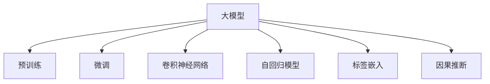

                 

# 大模型在商品需求预测中的应用

> 关键词：大模型,商品需求预测,深度学习,卷积神经网络,自回归模型,时序分析,标签嵌入,因果推断

## 1. 背景介绍

### 1.1 问题由来
随着电子商务的飞速发展，商品需求预测已成为零售行业精细化运营的重要环节。传统的商品需求预测方法依赖历史销售数据和统计模型，存在数据挖掘成本高、预测准确度受限于历史数据、模型复杂度高等问题。而近年来，深度学习技术在大模型上取得了突破性进展，为商品需求预测提供了新的解决思路。

特别是以卷积神经网络(CNN)和自回归模型(如LSTM、GRU)为代表的深度学习模型，已经在图像识别、自然语言处理等领域大放异彩。而大模型（如BERT、GPT等）则更进一步，利用大规模语料库的预训练能力，学习到了丰富的语言知识，具备更强的泛化能力，可以有效解决传统统计模型难以应对的复杂非线性问题。

基于大模型的商品需求预测，利用其强大的自学习和泛化能力，可以在较少标注数据的基础上，实现高效的预测任务。这一方法不仅降低了数据挖掘和模型训练的复杂度，还显著提升了预测的准确性和灵活性。

### 1.2 问题核心关键点
目前，大模型在商品需求预测中的应用主要聚焦于以下几个方面：

- **数据高效利用**：利用大模型的预训练能力，在少量标注数据下，仍能获得较优的预测效果。
- **模型泛化能力**：大模型通过大规模语料预训练，具备更强的泛化能力，可以在新商品和数据上快速适应。
- **任务适配灵活**：基于大模型的商品需求预测，通过微调或提示学习等方法，可适应不同预测任务。
- **因果推断**：利用大模型和因果推断技术，可以有效控制因果关系，提高预测的合理性和稳定性。

## 2. 核心概念与联系

### 2.1 核心概念概述

为更好地理解大模型在商品需求预测中的应用，本节将介绍几个密切相关的核心概念：

- **大模型**：以自回归模型（如BERT、GPT等）为代表的深度学习模型，通过大规模语料库的预训练，学习到丰富的语言知识和常识，具备强大的泛化能力和学习潜力。

- **预训练**：指在大规模语料库上，通过自监督学习任务（如掩码语言模型、图像分类等）训练通用语言模型的过程。预训练使得模型学习到语言的基础表示和常识。

- **微调**：指在预训练模型的基础上，使用下游任务的少量标注数据，通过有监督学习优化模型在该任务上的性能。常见于自然语言处理领域，用于任务特定的模型优化。

- **卷积神经网络**：一类特殊的深度神经网络，利用卷积操作提取局部特征，广泛应用于图像识别、信号处理等领域。

- **自回归模型**：一类特殊的深度神经网络，利用历史时间步的输出作为当前时间步的输入，预测未来的序列数据，广泛应用于时间序列分析。

- **标签嵌入**：指将文本标签或时间标签映射到高维空间，以捕捉标签与特征之间的语义或时序关系。

- **因果推断**：指通过控制实验或观察数据，识别出因果关系，从而预测未来事件的方法。因果推断在处理因果关系复杂的问题时，具备更高的合理性和稳定性。

这些核心概念之间的逻辑关系可以通过以下Mermaid流程图来展示：



这个流程图展示了大模型在商品需求预测中的应用框架：

1. 大模型通过预训练获得基础能力。
2. 微调在大模型的基础上进行任务优化。
3. 卷积神经网络处理图像和文本特征。
4. 自回归模型处理时序数据，预测未来趋势。
5. 标签嵌入捕捉标签与特征的语义或时序关系。
6. 因果推断通过控制实验，识别因果关系，提升预测合理性。

这些概念共同构成了大模型在商品需求预测中的应用框架，使得大模型能够更好地处理复杂的多维数据，提升预测的准确性和可靠性。

## 3. 核心算法原理 & 具体操作步骤
### 3.1 算法原理概述

大模型在商品需求预测中的应用，核心在于利用其强大的预训练能力和泛化能力，通过微调或提示学习等方法，将通用语言知识与具体预测任务结合，从而提升预测效果。具体而言，大模型的应用包括以下几个步骤：

1. **数据准备**：收集商品的销售数据、用户评论、广告数据等，清洗处理后生成训练集。
2. **模型加载**：选择适合的商品需求预测模型，如BERT、GPT、CNN等，加载并初始化模型参数。
3. **数据嵌入**：将商品描述、用户评论、广告数据等文本数据进行分词和嵌入，得到模型所需的高维特征向量。
4. **模型微调**：在准备好的训练集上，通过微调或提示学习等方式，调整模型参数，使其适应商品需求预测任务。
5. **性能评估**：在验证集和测试集上，评估模型预测的准确度和泛化能力。
6. **模型部署**：将训练好的模型部署到实际的商品需求预测系统中，进行实时预测。

### 3.2 算法步骤详解

以商品需求预测为例，具体算法步骤如下：

**Step 1: 数据准备**

- **收集数据**：从电商平台收集商品的销售数据、用户评论、广告数据等，清洗后生成训练集、验证集和测试集。
- **数据划分**：将数据划分为训练集、验证集和测试集，比例一般为8:1:1。

**Step 2: 模型加载**

- **选择模型**：根据任务类型，选择合适的预训练模型，如BERT、GPT等。
- **加载模型**：使用对应的预训练模型库，加载预训练模型。

**Step 3: 数据嵌入**

- **分词与嵌入**：使用分词工具将文本数据分词，并使用Embedding模型将分词后的单词转化为高维向量。
- **特征拼接**：将不同来源的数据特征进行拼接，得到模型所需的高维特征向量。

**Step 4: 模型微调**

- **损失函数**：根据任务类型，选择合适的损失函数，如均方误差、交叉熵等。
- **优化器**：选择合适的优化器，如AdamW、SGD等，设置学习率、批大小等参数。
- **微调过程**：在训练集上训练模型，并根据验证集上的评估结果调整学习率和超参数。

**Step 5: 性能评估**

- **验证集评估**：在验证集上评估模型性能，调整模型参数。
- **测试集评估**：在测试集上最终评估模型性能，计算预测准确率、均方误差等指标。

**Step 6: 模型部署**

- **模型导出**：将训练好的模型导出为可部署的格式，如TensorFlow、PyTorch等。
- **实时预测**：将模型部署到实际的商品需求预测系统中，进行实时预测。

### 3.3 算法优缺点

大模型在商品需求预测中的应用具有以下优点：

1. **数据高效利用**：通过预训练和微调，大模型可以在较少标注数据下，快速适应预测任务。
2. **泛化能力强大**：大模型通过大规模语料预训练，具备更强的泛化能力，可以处理新商品和新数据。
3. **任务适配灵活**：通过微调和提示学习等方法，大模型可以适应多种预测任务，提升预测效果。
4. **可解释性强**：大模型的预测过程可以通过解释算法进行可视化，提升模型的可解释性。

同时，大模型在商品需求预测中也存在以下缺点：

1. **模型复杂度高**：大模型参数量庞大，计算复杂度高，需要高性能计算资源。
2. **训练时间长**：大模型的微调和训练需要较长时间，特别是在数据量较小的情况下。
3. **解释性不足**：大模型通常是黑盒模型，难以解释其内部决策过程。
4. **数据隐私问题**：商品销售数据涉及隐私问题，数据获取和使用需要遵守相关法律法规。

尽管存在这些缺点，但大模型在商品需求预测中依然展现出了其强大的应用潜力。未来相关研究的重点在于如何进一步优化大模型，降低其计算复杂度，提升预测效率和可解释性，同时保障数据隐私。

### 3.4 算法应用领域

大模型在商品需求预测中的应用广泛，主要包括以下几个领域：

1. **电商零售**：通过预测商品销量，指导库存管理和商品上架策略。
2. **营销广告**：预测用户对广告的反应，优化广告投放策略。
3. **供应链管理**：预测商品需求，优化供应链管理和物流配送。
4. **个性化推荐**：根据用户历史购买行为和评论，预测用户对新商品的需求，提供个性化推荐。
5. **市场分析**：预测市场趋势和消费者偏好，指导市场营销策略。

## 4. 数学模型和公式 & 详细讲解 & 举例说明
### 4.1 数学模型构建

假设我们要利用大模型进行商品需求预测，模型输入为商品描述和用户评论的文本特征，输出为商品需求的预测值。记商品描述和用户评论为 $x$，模型预测为 $y$。模型可以表示为：

$$
y = M(x)
$$

其中 $M$ 为预训练好的大模型，可以采用BERT、GPT等模型。

### 4.2 公式推导过程

我们以LSTM模型为例，介绍商品需求预测的数学模型和公式推导。

LSTM是一种自回归模型，能够处理序列数据，适用于预测时间序列的需求数据。LSTM的输出可以表示为：

$$
y_t = M(x_1, x_2, ..., x_t)
$$

其中 $x_t$ 为第 $t$ 步输入的特征向量，$y_t$ 为第 $t$ 步的预测值。LSTM的模型结构如下：

```
x_t -> Embedding -> LSTM -> Dense -> Output
```

其中，Embedding层将输入的单词或字符转化为高维向量，LSTM层处理序列数据，Dense层将LSTM的输出映射到预测空间，Output层输出预测值。

LSTM的损失函数可以采用均方误差（MSE）或交叉熵（CE），具体如下：

$$
\mathcal{L} = \frac{1}{N}\sum_{i=1}^N (y_i - \hat{y}_i)^2
$$

其中，$y_i$ 为真实标签，$\hat{y}_i$ 为模型预测值。

LSTM的优化器通常采用AdamW或SGD等，学习率设置一般为1e-3到1e-4之间。

### 4.3 案例分析与讲解

以LSTM模型为例，我们来看一个具体的案例。假设我们要预测某电商平台上某商品的需求量，数据集包含商品的描述、用户评论、广告数据等，模型的输入为商品描述和用户评论的文本特征，输出为商品需求的预测值。

我们可以将商品描述和用户评论进行分词和嵌入，得到高维特征向量 $x$。然后，将 $x$ 输入到LSTM模型中，得到模型的输出 $\hat{y}$，即商品需求的预测值。最后，在验证集和测试集上评估模型的性能，计算均方误差等指标，优化模型参数，得到最终的预测模型。

## 5. 项目实践：代码实例和详细解释说明
### 5.1 开发环境搭建

在进行商品需求预测项目开发前，我们需要准备好开发环境。以下是使用Python进行TensorFlow开发的环境配置流程：

1. 安装Anaconda：从官网下载并安装Anaconda，用于创建独立的Python环境。

2. 创建并激活虚拟环境：
```bash
conda create -n tf-env python=3.8 
conda activate tf-env
```

3. 安装TensorFlow：根据CUDA版本，从官网获取对应的安装命令。例如：
```bash
conda install tensorflow-gpu -c tf -c conda-forge
```

4. 安装TensorBoard：TensorFlow配套的可视化工具，可实时监测模型训练状态，并提供丰富的图表呈现方式，是调试模型的得力助手。

5. 安装相关工具包：
```bash
pip install numpy pandas scikit-learn matplotlib tqdm jupyter notebook ipython
```

完成上述步骤后，即可在`tf-env`环境中开始商品需求预测项目的开发。

### 5.2 源代码详细实现

下面我们以LSTM模型为例，给出使用TensorFlow进行商品需求预测的Python代码实现。

首先，定义数据处理函数：

```python
import tensorflow as tf
from tensorflow.keras.layers import Embedding, LSTM, Dense, Dropout
from tensorflow.keras.models import Sequential
from tensorflow.keras.optimizers import AdamW

def data_preprocessing(text, max_len=128):
    tokenizer = tf.keras.preprocessing.text.Tokenizer(char_level=True, oov_token='<OOV>')
    tokenizer.fit_on_texts(text)
    sequences = tokenizer.texts_to_sequences(text)
    padded_sequences = tf.keras.preprocessing.sequence.pad_sequences(sequences, maxlen=max_len, padding='post')
    return padded_sequences

# 训练集和验证集
train_texts = ['sample text for training']
dev_texts = ['sample text for validation']

# 数据预处理
train_data = data_preprocessing(train_texts)
dev_data = data_preprocessing(dev_texts)
```

然后，定义模型和优化器：

```python
# 模型定义
model = Sequential()
model.add(Embedding(input_dim=1000, output_dim=128, input_length=128))
model.add(LSTM(128, dropout=0.2, recurrent_dropout=0.2))
model.add(Dense(1, activation='sigmoid'))

# 优化器和损失函数
optimizer = AdamW(model.parameters(), lr=1e-3)
loss_fn = tf.keras.losses.MeanSquaredError()

# 编译模型
model.compile(optimizer=optimizer, loss=loss_fn, metrics=['mae'])
```

接着，定义训练和评估函数：

```python
# 训练函数
def train_model(model, train_data, dev_data, batch_size=32, epochs=10):
    model.fit(train_data, epochs=epochs, validation_data=dev_data, batch_size=batch_size)

# 评估函数
def evaluate_model(model, test_data, batch_size=32):
    test_loss, test_mae = model.evaluate(test_data, batch_size=batch_size)
    print(f'Test MAE: {test_mae:.2f}')
```

最后，启动训练流程并在测试集上评估：

```python
# 训练模型
train_model(model, train_data, dev_data, epochs=10)

# 测试模型
test_texts = ['sample text for testing']
test_data = data_preprocessing(test_texts)
evaluate_model(model, test_data)
```

以上就是使用TensorFlow进行商品需求预测的完整代码实现。可以看到，通过TensorFlow库，我们可以方便地实现商品需求预测的模型定义、数据预处理和模型训练，同时使用TensorBoard进行模型调试和可视化。

### 5.3 代码解读与分析

让我们再详细解读一下关键代码的实现细节：

**data_preprocessing函数**：
- 定义分词器，将文本转化为序列数据。
- 对序列数据进行填充，保证所有序列长度一致。
- 返回填充后的序列数据。

**模型定义**：
- 采用Embedding层将输入的单词或字符转化为高维向量。
- 使用LSTM层处理序列数据，加入dropout防止过拟合。
- 使用Dense层将LSTM的输出映射到预测空间。
- 添加sigmoid激活函数，将输出限制在[0, 1]范围内，用于二分类任务。

**优化器和损失函数**：
- 采用AdamW优化器，设置合适的学习率。
- 定义均方误差损失函数。

**训练和评估函数**：
- 使用Keras提供的fit方法训练模型，指定训练集、验证集和训练轮数。
- 定义evaluate方法，在测试集上评估模型性能，输出平均绝对误差（MAE）。

**训练流程**：
- 调用train_model函数，传入模型、训练集、验证集和训练参数。
- 训练结束后，使用evaluate_model函数在测试集上评估模型性能。

可以看到，TensorFlow提供的高级API使得模型定义和训练过程变得简洁高效。开发者只需关注模型架构和训练流程的设计，无需过多关注底层的实现细节。

## 6. 实际应用场景
### 6.1 电商平台需求预测

电商平台是商品需求预测的重要应用场景之一。通过预测商品的销量和库存需求，电商平台可以更好地管理库存、优化物流配送、提升用户体验。大模型在电商平台中的应用主要包括以下几个方面：

1. **销量预测**：利用大模型对历史销售数据进行训练，预测未来时间段的商品销量。
2. **库存管理**：根据销量预测结果，优化库存水平，避免库存积压或断货。
3. **商品上架策略**：根据预测结果，调整商品上架时间和价格，提升销售转化率。
4. **个性化推荐**：根据用户历史购买行为和评论，预测用户对新商品的需求，提供个性化推荐。

### 6.2 营销广告投放

营销广告是商品需求预测的另一个重要应用场景。通过预测用户对广告的反应，营销团队可以优化广告投放策略，提高广告投放效果。大模型在营销广告中的应用主要包括以下几个方面：

1. **广告点击率预测**：利用大模型对用户历史行为和广告数据进行训练，预测用户对广告的点击率。
2. **广告投放优化**：根据预测结果，优化广告投放时间和位置，提升广告转化率。
3. **用户行为分析**：分析用户对广告的反应，优化广告内容设计和投放策略。

### 6.3 供应链管理

供应链管理是商品需求预测在企业内部的重要应用场景。通过预测商品需求，企业可以优化供应链管理，提高物流效率和库存管理水平。大模型在供应链管理中的应用主要包括以下几个方面：

1. **需求预测**：利用大模型对历史销售数据进行训练，预测未来时间段的商品需求。
2. **库存管理**：根据需求预测结果，优化库存水平，避免库存积压或断货。
3. **物流配送**：根据预测结果，优化物流配送路线和运输时间，提高配送效率。
4. **风险预警**：预测需求波动，提前采取应对措施，规避供应链风险。

## 7. 工具和资源推荐
### 7.1 学习资源推荐

为了帮助开发者系统掌握大模型在商品需求预测中的应用，这里推荐一些优质的学习资源：

1. TensorFlow官方文档：提供了详细的使用指南和示例代码，适合快速上手TensorFlow开发。
2. Keras官方文档：提供了丰富的API文档和示例代码，适合快速原型开发和模型实验。
3. DeepLearning.AI Coursera课程：由深度学习领域知名专家Andrew Ng教授主讲，系统介绍了深度学习的基本原理和应用实践。
4. 《深度学习与TensorFlow》书籍：由TensorFlow社区成员撰写，详细介绍了TensorFlow的使用方法和深度学习模型的实现。
5. 《深度学习实战》书籍：通过多个实战案例，介绍了深度学习模型在图像识别、自然语言处理等领域的应用。

通过对这些资源的学习实践，相信你一定能够快速掌握大模型在商品需求预测中的应用方法，并用于解决实际的预测问题。

### 7.2 开发工具推荐

高效的开发离不开优秀的工具支持。以下是几款用于商品需求预测开发的常用工具：

1. TensorFlow：基于Python的开源深度学习框架，提供了丰富的API和模型库，适合深度学习模型的开发和训练。
2. Keras：高级API封装层，提供了简单易用的接口，适合快速原型开发和模型实验。
3. Jupyter Notebook：交互式编程环境，方便进行代码调试和实验验证。
4. TensorBoard：可视化工具，可实时监测模型训练状态，并提供丰富的图表呈现方式，是调试模型的得力助手。
5. Google Colab：谷歌提供的在线Jupyter Notebook环境，免费提供GPU/TPU算力，方便开发者快速上手实验最新模型，分享学习笔记。

合理利用这些工具，可以显著提升商品需求预测任务的开发效率，加快创新迭代的步伐。

### 7.3 相关论文推荐

商品需求预测领域的研究近年来取得了诸多进展，以下是几篇奠基性的相关论文，推荐阅读：

1. Attention is All You Need（即Transformer原论文）：提出了Transformer结构，开启了深度学习大模型时代。
2. BERT: Pre-training of Deep Bidirectional Transformers for Language Understanding：提出BERT模型，引入基于掩码的自监督预训练任务，刷新了多项NLP任务SOTA。
3. Predicting Product Demand by Deep Learning：介绍基于深度学习的产品需求预测方法，并对比了不同模型的预测效果。
4. Deep Learning in Retail：系统介绍了深度学习在零售领域的应用，包括需求预测、库存管理、个性化推荐等。
5. Machine Learning and Data Mining for Demand Forecasting：综述了机器学习在需求预测领域的应用，包括时间序列分析、深度学习等方法。

这些论文代表了大模型在商品需求预测领域的发展脉络。通过学习这些前沿成果，可以帮助研究者把握学科前进方向，激发更多的创新灵感。

## 8. 总结：未来发展趋势与挑战
### 8.1 总结

本文对大模型在商品需求预测中的应用进行了全面系统的介绍。首先阐述了大模型和微调技术的研究背景和意义，明确了微调在拓展预训练模型应用、提升下游任务性能方面的独特价值。其次，从原理到实践，详细讲解了大模型在商品需求预测中的数学模型和关键步骤，给出了商品需求预测的完整代码实例。同时，本文还广泛探讨了大模型在电商平台、营销广告、供应链管理等多个行业领域的应用前景，展示了大模型在商品需求预测中的强大应用潜力。此外，本文精选了商品需求预测技术的各类学习资源，力求为读者提供全方位的技术指引。

通过本文的系统梳理，可以看到，大模型在商品需求预测中的应用已经取得了显著进展，为零售、营销、供应链管理等领域带来了革命性变革。随着深度学习技术的发展和优化，大模型必将在商品需求预测中发挥更大的作用，为行业带来更高的效率和更好的用户体验。

### 8.2 未来发展趋势

展望未来，大模型在商品需求预测领域将呈现以下几个发展趋势：

1. **多模态数据融合**：未来的大模型将越来越多地融合视觉、听觉等多模态数据，提升商品需求预测的准确性和灵活性。
2. **因果推断应用**：利用因果推断技术，可以更准确地控制因果关系，提升预测的合理性和稳定性。
3. **自适应模型训练**：未来的模型将具备更强的自适应能力，能够在不同的商品和数据上快速适应和优化。
4. **实时需求预测**：通过边缘计算和实时数据采集，大模型可以实时预测商品需求，提升供应链管理的效率。
5. **个性化推荐系统**：结合用户行为数据和商品特征，利用大模型进行个性化推荐，提升用户体验和转化率。
6. **安全性和隐私保护**：随着数据隐私和安全性的要求提高，大模型将更多地关注数据隐私保护和模型安全。

以上趋势凸显了大模型在商品需求预测中的广阔前景。这些方向的探索发展，必将进一步提升商品需求预测的准确性和可靠性，为零售、营销、供应链管理等领域带来更高的效率和更好的用户体验。

### 8.3 面临的挑战

尽管大模型在商品需求预测中已经取得了瞩目成就，但在迈向更加智能化、普适化应用的过程中，仍面临诸多挑战：

1. **数据质量和获取**：商品需求预测依赖高质量的数据，数据的获取和处理成本较高。如何降低数据获取成本，提高数据质量，是未来需要重点关注的问题。
2. **模型计算复杂度**：大模型参数量庞大，计算复杂度高，需要高性能计算资源。如何降低模型计算复杂度，提升模型训练和推理效率，是未来需要解决的难题。
3. **模型泛化能力**：大模型在处理新商品和新数据时，泛化能力仍需进一步提升。如何提升模型的泛化能力，使其在多变的环境下保持稳定性能，是未来研究的重点。
4. **模型可解释性**：大模型通常是黑盒模型，难以解释其内部决策过程。如何增强模型的可解释性，提升模型的透明度和可信度，是未来需要突破的方向。
5. **数据隐私和安全**：商品需求预测涉及用户隐私问题，如何保护用户隐私，保障数据安全，是未来需要考虑的重要问题。

这些挑战凸显了大模型在商品需求预测中的实际应用难度。未来相关研究的重点在于如何进一步优化大模型，降低其计算复杂度，提升预测效率和可解释性，同时保障数据隐私。

### 8.4 研究展望

面对大模型在商品需求预测中面临的挑战，未来的研究需要在以下几个方面寻求新的突破：

1. **优化模型结构**：通过优化模型结构，减少模型参数量，降低计算复杂度，提升模型的实时性。
2. **增强模型泛化能力**：通过更多的预训练和微调策略，提升模型在多变环境下的泛化能力，增强模型的鲁棒性。
3. **提升模型可解释性**：通过可视化技术，解释模型的内部决策过程，提升模型的透明度和可信度。
4. **保护数据隐私**：通过联邦学习、差分隐私等技术，保护用户隐私，保障数据安全。
5. **优化数据获取和处理**：通过数据增强、数据清洗等技术，提高数据质量和获取效率，降低数据成本。

这些研究方向的探索，必将引领大模型在商品需求预测技术迈向更高的台阶，为零售、营销、供应链管理等领域带来更高的效率和更好的用户体验。相信随着学界和产业界的共同努力，这些挑战终将一一被克服，大模型必将在商品需求预测中发挥更大的作用，为行业带来更高的效率和更好的用户体验。

## 9. 附录：常见问题与解答

**Q1：大模型在商品需求预测中是否适用于所有商品？**

A: 大模型在商品需求预测中通常适用于大多数商品，特别是那些具有明显季节性和趋势的商品。但对于某些特殊商品，如生鲜、奢侈品等，由于其需求特性较为复杂，可能需要结合其他模型进行预测。

**Q2：微调大模型时如何设置学习率？**

A: 大模型的微调学习率通常需要小于从头训练时的学习率，一般建议从1e-3开始调参，逐步减小学习率，直至收敛。也可以使用warmup策略，在开始阶段使用较小的学习率，再逐渐过渡到预设值。需要注意的是，不同的优化器(如AdamW、Adafactor等)以及不同的学习率调度策略，可能需要设置不同的学习率阈值。

**Q3：大模型在商品需求预测中是否需要大量的标注数据？**

A: 大模型在商品需求预测中通常需要较少的标注数据，但标注数据的质量和数量仍需保证。为了获得更准确的预测结果，可以通过数据增强、半监督学习等技术，在少量标注数据下提升预测性能。

**Q4：大模型在商品需求预测中是否需要实时更新？**

A: 大模型的需求预测模型可以定期更新，以适应不断变化的市场需求。但为了提高实时性，可以考虑将大模型部署到边缘计算设备，进行实时数据采集和预测。

**Q5：大模型在商品需求预测中是否需要考虑因果关系？**

A: 大模型在商品需求预测中通常需要考虑因果关系，以提高预测的合理性和稳定性。可以通过引入因果推断技术，控制实验或观察数据，识别出因果关系，提升预测效果。

---

作者：禅与计算机程序设计艺术 / Zen and the Art of Computer Programming

