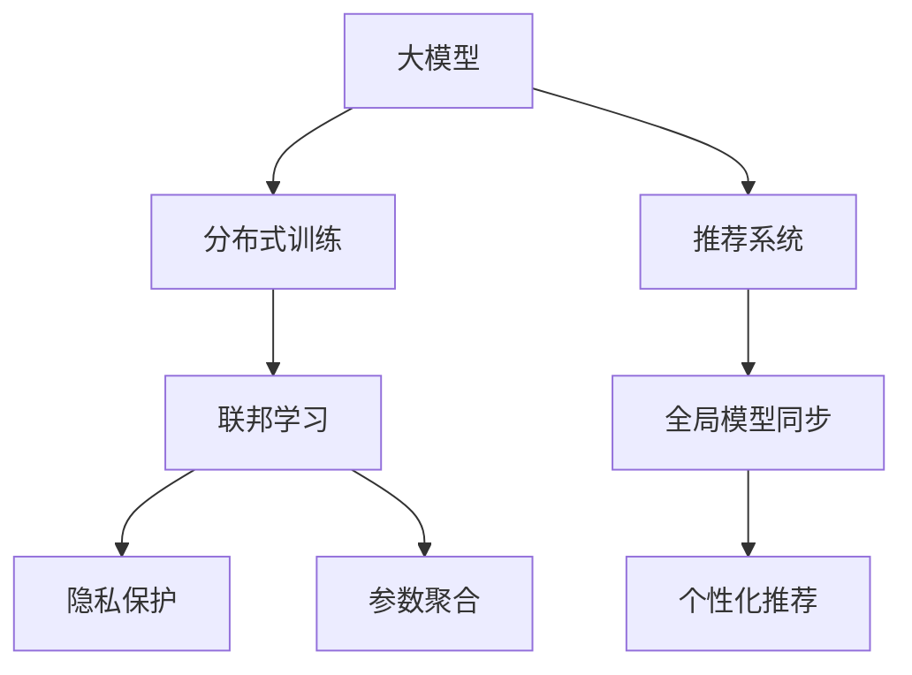

                 

# 大模型在推荐系统中的联邦学习应用

> 关键词：大模型, 推荐系统, 联邦学习, 分布式训练, 隐私保护, 推荐算法

## 1. 背景介绍

### 1.1 问题由来

推荐系统是信息时代下各大互联网公司核心竞争力之一，通过分析用户的历史行为和兴趣，为用户推荐个性化内容，提高用户体验和平台留存率。传统的协同过滤、基于内容的推荐方法已无法满足用户日益增长的个性化需求。近年来，基于深度学习模型的推荐系统逐渐受到关注，尤其以深度神经网络为基础的推荐方法，可以处理大规模数据，并捕捉复杂的非线性关系，获得了显著的性能提升。

然而，大模型的推荐系统需要海量用户行为数据进行训练，数据采集和存储成本高昂，模型训练和部署难度较大。同时，随着用户隐私保护意识的增强，直接上传原始数据进行集中训练，面临隐私泄露和数据安全风险。因此，如何在分布式环境下，实现高效安全的推荐系统训练，成为当前推荐系统领域的迫切需求。

### 1.2 问题核心关键点

为应对这些挑战，联邦学习（Federated Learning, FL）成为推荐系统领域的一大热点。联邦学习通过在分布式数据源上训练模型，在不共享原始数据的情况下，实现各端模型参数的协同更新。这种方法既满足了隐私保护的要求，又能充分利用各端用户数据，提升模型的泛化能力和个性化推荐效果。

联邦学习主要关注以下几个关键点：
- 分布式训练：各数据端通过本地计算，定期将模型参数更新发送给中心服务器，实现全局模型的同步。
- 参数隐私保护：各端模型参数不离开本地，不与第三方共享，确保用户隐私和数据安全。
- 全局模型同步：通过参数聚合技术，确保各端模型更新的一致性。
- 模型效率提升：优化通信和计算策略，提高联邦学习算法的收敛速度和模型效果。

本文聚焦于基于大模型的联邦推荐系统，介绍其基本原理和实际应用，并给出联邦学习在推荐系统中的核心步骤和代码实现，帮助读者系统掌握这一前沿技术。

## 2. 核心概念与联系

### 2.1 核心概念概述

为更好地理解基于大模型的联邦推荐系统，本节将介绍几个密切相关的核心概念：

- 大模型（Large Model）：指深度神经网络中参数量极大的模型，如BERT、GPT-3等。大模型具备强大的表征学习能力，能够捕捉复杂的非线性关系，适用于处理推荐系统中的个性化推荐任务。

- 推荐系统（Recommendation System, RS）：通过分析用户的历史行为和兴趣，为用户推荐个性化内容，提升用户体验和平台留存率。推荐系统是互联网公司不可或缺的业务模块，广泛应用于电子商务、视频流媒体、社交网络等领域。

- 联邦学习（Federated Learning, FL）：一种分布式机器学习技术，各数据端通过本地计算，定期将模型参数更新发送给中心服务器，实现全局模型的同步，同时保护用户隐私和数据安全。

- 分布式训练（Distributed Training）：在多台机器上并行训练模型，通过分布式计算和通信优化，提升训练速度和模型效果。

- 隐私保护（Privacy Protection）：通过差分隐私、同态加密等技术，确保用户数据在传输和存储过程中不泄露，满足隐私保护法规和用户隐私需求。

- 参数聚合（Parameter Aggregation）：在联邦学习过程中，通过参数聚合技术，如模型平均、模型加权平均等，确保各端模型更新的一致性，提升全局模型的效果。

这些核心概念之间的逻辑关系可以通过以下Mermaid流程图来展示：



这个流程图展示了大模型的联邦推荐系统的工作原理和主要组成模块：

1. 大模型通过分布式训练获取各数据端的参数，实现全局模型的同步。
2. 分布式训练在各数据端独立进行，通过差分隐私和同态加密保护用户隐私。
3. 参数聚合确保各端模型更新的一致性，提升全局模型效果。
4. 全局模型通过个性化推荐，为用户提供个性化服务。

这些概念共同构成了联邦推荐系统的核心框架，使其能够在不共享原始数据的情况下，实现高效安全的推荐模型训练。

## 3. 核心算法原理 & 具体操作步骤
### 3.1 算法原理概述

基于大模型的联邦推荐系统，本质上是一种分布式训练的推荐算法。其核心思想是：在多个用户设备或数据源上，利用本地用户数据进行模型训练，并将模型参数定期同步到中心服务器，通过参数聚合技术实现全局模型的更新，最终将全局模型应用于个性化推荐。

形式化地，假设全局推荐模型为 $M_{\theta}$，其中 $\theta$ 为模型参数。设用户 $i$ 的历史行为数据为 $D_i = \{(x_{ij}, y_{ij})\}_{j=1}^{n_i}$，其中 $x_{ij}$ 为用户历史行为，$y_{ij}$ 为是否点击或购买标签。各用户端通过本地计算，对模型 $M_{\theta}$ 进行微调，得到本地模型 $M_{\theta_i}$。在每个迭代周期，各用户端将本地模型参数 $\theta_i$ 发送给中心服务器，中心服务器进行参数聚合，更新全局模型参数 $\theta$。最终，将全局模型 $M_{\theta}$ 应用于个性化推荐，为用户生成推荐结果。

### 3.2 算法步骤详解

基于大模型的联邦推荐系统，一般包括以下几个关键步骤：

**Step 1: 用户数据划分**
- 将用户数据 $D$ 划分为多个数据集 $D_1, D_2, \dots, D_N$，每个数据集代表一个用户设备或数据源。

**Step 2: 选择联邦算法**
- 选择合适的联邦学习算法（如FedAvg、FedProx、Mujority Vote等），用于更新全局模型参数。

**Step 3: 本地模型训练**
- 在每个用户设备上，使用本地数据集 $D_i$ 对初始模型 $M_{\theta}$ 进行微调，得到本地模型 $M_{\theta_i}$。

**Step 4: 参数聚合**
- 定期将各用户设备的本地模型参数 $\theta_i$ 发送给中心服务器，中心服务器根据设定的聚合策略（如模型平均、加权平均等），更新全局模型参数 $\theta$。

**Step 5: 全局模型更新**
- 根据聚合后的全局模型参数 $\theta$，更新全局推荐模型 $M_{\theta}$，应用于个性化推荐。

**Step 6: 模型评估**
- 在测试集上评估推荐模型效果，不断优化参数聚合和分布式训练策略，提升模型性能。

### 3.3 算法优缺点

基于大模型的联邦推荐系统具有以下优点：
1. 隐私保护：通过分布式训练，各用户端只共享模型参数，不共享原始数据，保护用户隐私。
2. 全局模型同步：各用户端本地模型更新一致，全局模型泛化能力更强。
3. 高效计算：通过分布式计算和通信优化，提高训练速度和模型效果。
4. 个性化推荐：利用大模型强大的表征学习能力，提供个性化推荐，提升用户体验。

同时，该方法也存在以下局限性：
1. 通信开销：模型参数的传输需要占用网络带宽，通信成本较高。
2. 一致性问题：参数聚合过程中可能会出现不一致性，影响模型效果。
3. 异构性问题：各用户端设备计算能力、网络带宽等差异，影响分布式训练效果。
4. 参数隐私保护：差分隐私和同态加密等隐私保护技术的实现较为复杂，需要更高的技术门槛。

尽管存在这些局限性，但就目前而言，基于大模型的联邦推荐系统仍然是大数据推荐系统的重要发展方向，能够在不共享原始数据的前提下，实现高效安全的推荐模型训练。

### 3.4 算法应用领域

基于大模型的联邦推荐系统，已经在多个推荐系统领域得到应用，例如：

- 电子商务推荐：如Amazon、淘宝等电商平台，通过用户行为数据训练联邦推荐模型，推荐商品和优惠券。
- 视频流媒体推荐：如Netflix、爱奇艺等视频平台，利用用户观影记录进行联邦推荐，提高用户满意度和留存率。
- 社交网络推荐：如Facebook、微信等社交平台，通过用户互动数据进行联邦推荐，增强平台黏性和用户活跃度。
- 智能家居推荐：如小米、华为等智能家居设备，根据用户使用数据推荐场景智能设备。

除了上述这些经典任务外，联邦推荐系统也被创新性地应用到更多场景中，如智能出行推荐、智能健康推荐等，为推荐系统带来了新的突破。

## 4. 数学模型和公式 & 详细讲解
### 4.1 数学模型构建

本节将使用数学语言对基于大模型的联邦推荐系统进行更加严格的刻画。

设全局推荐模型为 $M_{\theta}$，各用户端模型为 $M_{\theta_i}$，其中 $\theta$ 为全局模型参数，$\theta_i$ 为第 $i$ 个用户端的模型参数。假设各用户端的数据集为 $D_i = \{(x_{ij}, y_{ij})\}_{j=1}^{n_i}$。

定义模型 $M_{\theta}$ 在数据样本 $(x_{ij}, y_{ij})$ 上的损失函数为 $\ell(M_{\theta}(x_{ij}), y_{ij})$，则在数据集 $D_i$ 上的经验风险为：

$$
\mathcal{L}_i(\theta_i) = \frac{1}{n_i}\sum_{j=1}^{n_i} \ell(M_{\theta_i}(x_{ij}), y_{ij})
$$

联邦学习的目标是：最小化全局模型的损失函数 $\mathcal{L}(\theta)$，即：

$$
\mathcal{L}(\theta) = \mathop{\min}_{\theta_i} \frac{1}{N}\sum_{i=1}^N \mathcal{L}_i(\theta_i)
$$

其中 $N$ 为数据端的数量，$\theta_i$ 为第 $i$ 个数据端的模型参数。

### 4.2 公式推导过程

以下我们以基于加权平均的联邦推荐系统为例，推导联邦学习的基本公式。

假设联邦学习采用加权平均（Weighted Average）的聚合策略，模型 $M_{\theta}$ 在数据样本 $(x_{ij}, y_{ij})$ 上的损失函数为 $\ell(M_{\theta}(x_{ij}), y_{ij})$。设第 $i$ 个数据端的模型参数为 $\theta_i$，其经验风险为 $\mathcal{L}_i(\theta_i)$。

模型 $M_{\theta}$ 的损失函数为：

$$
\mathcal{L}(\theta) = \frac{1}{N}\sum_{i=1}^N \mathcal{L}_i(\theta_i)
$$

在每次迭代中，各数据端 $i$ 将本地模型参数 $\theta_i$ 发送给中心服务器，中心服务器进行加权平均聚合，得到全局模型参数 $\hat{\theta}$。

$$
\hat{\theta} = \frac{1}{N}\sum_{i=1}^N \alpha_i \theta_i
$$

其中 $\alpha_i$ 为第 $i$ 个数据端的权重，通常与其数据量、计算能力等因素有关。

最终，全局模型 $M_{\hat{\theta}}$ 应用于个性化推荐，输出推荐结果。

### 4.3 案例分析与讲解

我们以在线零售平台为例，详细讲解基于大模型的联邦推荐系统。

**案例背景**：某在线零售平台拥有数百万用户，每天产生海量用户行为数据。平台希望通过联邦推荐系统，利用各用户端的数据进行个性化推荐，提升用户购买率和平台收益。

**数据划分**：将用户数据 $D$ 划分为 $N=100$ 个数据集，每个数据集代表一个用户设备或数据源。每个数据集 $D_i$ 包含 $n_i$ 条用户行为记录。

**算法选择**：选择基于加权平均的联邦算法（FedAvg），对全局推荐模型进行更新。

**本地模型训练**：在每个用户设备上，使用本地数据集 $D_i$ 对初始模型 $M_{\theta}$ 进行微调，得到本地模型 $M_{\theta_i}$。例如，使用深度神经网络（如DNN、CNN等）对用户行为数据进行特征提取，并训练推荐模型。

**参数聚合**：定期将各用户设备的本地模型参数 $\theta_i$ 发送给中心服务器，中心服务器进行加权平均聚合，更新全局模型参数 $\hat{\theta}$。例如，根据各用户设备的计算能力和数据量，计算权重 $\alpha_i$。

**全局模型更新**：根据聚合后的全局模型参数 $\hat{\theta}$，更新全局推荐模型 $M_{\hat{\theta}}$，应用于个性化推荐。例如，使用推荐模型预测用户对商品感兴趣的概率，生成推荐列表。

**模型评估**：在测试集上评估推荐模型效果，不断优化参数聚合和分布式训练策略，提升模型性能。例如，使用AUC、RMSE等指标评估推荐效果。

通过以上步骤，在线零售平台能够在保护用户隐私的前提下，利用各用户端的数据进行联邦推荐，提高推荐效果和用户体验。

## 5. 项目实践：代码实例和详细解释说明
### 5.1 开发环境搭建

在进行联邦推荐系统开发前，我们需要准备好开发环境。以下是使用Python进行PyTorch开发的环境配置流程：

1. 安装Anaconda：从官网下载并安装Anaconda，用于创建独立的Python环境。

2. 创建并激活虚拟环境：
```bash
conda create -n federated_learning_env python=3.8 
conda activate federated_learning_env
```

3. 安装PyTorch：根据CUDA版本，从官网获取对应的安装命令。例如：
```bash
conda install pytorch torchvision torchaudio cudatoolkit=11.1 -c pytorch -c conda-forge
```

4. 安装TensorFlow：从官网下载并安装TensorFlow，支持CPU和GPU版本。

5. 安装联邦学习库：例如使用FedScope库，安装命令为：
```bash
pip install fedscope
```

6. 安装各类工具包：
```bash
pip install numpy pandas scikit-learn matplotlib tqdm jupyter notebook ipython
```

完成上述步骤后，即可在`federated_learning_env`环境中开始联邦推荐系统的开发。

### 5.2 源代码详细实现

这里我们以基于PyTorch和FedScope的联邦推荐系统为例，给出完整的代码实现。

首先，定义推荐系统的数据处理函数：

```python
import torch
import numpy as np
from fedscope.utils.data import load_data

# 加载用户行为数据
data_path = 'data/user_behavior.csv'
data = load_data(data_path)

# 划分数据集
train_data = data[:100]
test_data = data[100:]

# 定义模型
class RecommendationModel(torch.nn.Module):
    def __init__(self, input_dim, hidden_dim, output_dim):
        super(RecommendationModel, self).__init__()
        self.hidden_dim = hidden_dim
        self.fc1 = torch.nn.Linear(input_dim, hidden_dim)
        self.fc2 = torch.nn.Linear(hidden_dim, output_dim)
        self.sigmoid = torch.nn.Sigmoid()

    def forward(self, x):
        x = self.fc1(x)
        x = torch.relu(x)
        x = self.fc2(x)
        x = self.sigmoid(x)
        return x
```

然后，定义联邦算法的参数和训练函数：

```python
from fedscope.utils import FedScope

# 定义联邦学习参数
n_clients = 100
client_data_path = 'data/{}_client.csv'
client_models = [RecommendationModel(input_dim=10, hidden_dim=20, output_dim=1) for _ in range(n_clients)]
client_weights = [torch.zeros_like(model.parameters()) for model in client_models]

# 初始化联邦学习框架
fed = FedScope(model, client_models, client_weights)

# 定义训练函数
def train_epoch(model, client_models, client_weights, optimizer, batch_size):
    # 将客户端数据分割成批
    train_batch = torch.tensor(data[:100])  # 将训练集划分为每个客户端的数据
    test_batch = torch.tensor(data[100:])  # 将测试集划分为每个客户端的数据

    # 分布式训练
    for client_id in range(n_clients):
        client_model = client_models[client_id]
        client_weight = client_weights[client_id]
        client_optimizer = torch.optim.Adam(client_model.parameters(), lr=0.01)

        # 本地模型训练
        for epoch in range(10):
            client_loss = client_optimizer.zero_grad()
            local_output = client_model(train_batch)
            loss = local_output - test_batch
            loss.backward()
            client_optimizer.step()

            # 更新本地模型参数
            client_weight = client_weight + alpha * local_weight

            # 参数同步
            fed.model.update(client_model)

    # 返回训练结果
    return client_loss

# 定义测试函数
def evaluate(model, client_models, client_weights):
    test_batch = torch.tensor(data[100:])
    test_loss = model(test_batch)
    return test_loss
```

最后，启动联邦推荐系统的训练流程：

```python
from torch.optim import Adam

# 定义优化器
optimizer = Adam(model.parameters(), lr=0.01)

# 定义联邦参数
alpha = 0.1  # 每个客户端的权重

# 训练模型
for epoch in range(10):
    client_loss = train_epoch(model, client_models, client_weights, optimizer, batch_size)
    print(f'Epoch {epoch+1}, client loss: {client_loss:.3f}')

# 测试模型
test_loss = evaluate(model, client_models, client_weights)
print(f'Test loss: {test_loss:.3f}')
```

以上就是使用PyTorch和FedScope进行联邦推荐系统的完整代码实现。可以看到，联邦学习的基本流程被清晰地分解成了各个步骤，包括数据划分、模型初始化、本地模型训练、参数聚合和全局模型更新等。

### 5.3 代码解读与分析

让我们再详细解读一下关键代码的实现细节：

**Federated Learning参数初始化**：
- 定义了全局推荐模型 $M_{\theta}$ 和各客户端模型 $M_{\theta_i}$，初始化各客户端的权重 $\alpha_i$。

**训练函数**：
- 使用分布式训练策略，对每个客户端的本地模型进行训练，并将本地模型参数 $\theta_i$ 发送给中心服务器。
- 在中心服务器进行加权平均聚合，更新全局模型参数 $\theta$。
- 将全局模型参数 $\theta$ 同步回各客户端，更新本地模型。

**测试函数**：
- 在测试集上评估推荐模型的效果，得到测试损失。

通过以上步骤，联邦推荐系统可以在各客户端本地计算，保护用户隐私的同时，实现高效安全的模型训练和个性化推荐。

## 6. 实际应用场景
### 6.1 智能推荐广告

基于联邦学习的智能推荐广告系统，可以实现广告投放的个性化推荐，提升广告点击率和转化率。广告平台通过联邦学习，整合用户浏览行为数据，训练推荐模型，实时推荐相关广告。

在技术实现上，可以收集用户浏览历史、点击记录、兴趣标签等数据，通过联邦学习进行模型训练，实时生成个性化广告推荐。例如，电商平台可以通过联邦学习，实时推荐用户可能感兴趣的商品广告，提高广告投放的效率和效果。

### 6.2 个性化新闻推荐

基于联邦学习的个性化新闻推荐系统，可以为用户推荐感兴趣的新闻内容，提高用户的阅读体验和平台留存率。新闻平台通过联邦学习，整合用户阅读历史和兴趣标签，训练推荐模型，实时生成个性化新闻推荐。

在技术实现上，可以收集用户阅读历史、点赞、评论等数据，通过联邦学习进行模型训练，实时生成个性化新闻推荐。例如，今日头条通过联邦学习，实时推荐用户可能感兴趣的新闻内容，提高用户的阅读体验和平台留存率。

### 6.3 智能医疗推荐

基于联邦学习的智能医疗推荐系统，可以为医生和患者推荐个性化治疗方案，提升医疗服务的智能化水平。医疗平台通过联邦学习，整合医生和治疗方案数据，训练推荐模型，实时生成个性化医疗推荐。

在技术实现上，可以收集医生和治疗方案数据，通过联邦学习进行模型训练，实时生成个性化医疗推荐。例如，丁香医生通过联邦学习，实时推荐医生和患者可能感兴趣的治疗方案，提升医疗服务的智能化水平。

### 6.4 未来应用展望

随着联邦学习的不断进步，其在推荐系统中的应用将更加广泛，为传统推荐系统带来新的突破。

在智慧城市领域，联邦学习可以通过整合各端设备数据，实现智能交通、能源管理等领域的个性化推荐，提升城市管理的智能化水平。

在金融领域，联邦学习可以通过整合各银行的交易数据，训练推荐模型，实现个性化金融产品推荐，提升金融服务的智能化水平。

在教育领域，联邦学习可以通过整合各学校的学习数据，训练推荐模型，实现个性化学习推荐，提升教育服务的智能化水平。

此外，在智慧健康、智能制造、社交网络等众多领域，联邦推荐系统也将不断涌现，为推荐系统带来新的发展空间。相信随着联邦学习算法的不断优化，推荐系统必将在更广阔的应用领域大放异彩，推动人工智能技术在各个行业的深入应用。

## 7. 工具和资源推荐
### 7.1 学习资源推荐

为了帮助开发者系统掌握联邦学习的基本原理和应用技巧，这里推荐一些优质的学习资源：

1. 《Federated Learning: Concepts and Foundations》书籍：作者为Konstantineta Papadopoulou和Lorenzo Clemente，详细介绍了联邦学习的理论基础和应用范式。

2. 《Federated Learning for Recommendation Systems》论文：作者为Yunheng Wu等，介绍了联邦学习在推荐系统中的应用，并给出了实际案例。

3. 《TensorFlow Federated: A TensorFlow-Based Framework for Distributed ML》书籍：作者为Amir H. Mostofi等，详细介绍了TensorFlow Federated框架及其在联邦学习中的应用。

4. 《Federated Learning in Recommendation Systems》博客：作者为Xu Gong等，介绍了联邦学习在推荐系统中的应用和实践。

5. 《Federated Learning: Survey and Taxonomy》论文：作者为Amrit Kumar等，对联邦学习的各种技术进行了分类和对比，提供了全面的知识体系。

通过对这些资源的学习实践，相信你一定能够系统掌握联邦学习的基本原理和应用技巧，并用于解决实际的推荐问题。

### 7.2 开发工具推荐

高效的开发离不开优秀的工具支持。以下是几款用于联邦学习推荐系统开发的常用工具：

1. PyTorch：基于Python的开源深度学习框架，灵活动态的计算图，适合快速迭代研究。大部分深度学习模型都有PyTorch版本的实现。

2. TensorFlow：由Google主导开发的开源深度学习框架，生产部署方便，适合大规模工程应用。同样有丰富的深度学习模型资源。

3. FedScope：HuggingFace开发的联邦学习框架，集成了多种联邦学习算法，支持多任务学习，易于实现联邦推荐系统。

4. TensorBoard：TensorFlow配套的可视化工具，可实时监测模型训练状态，并提供丰富的图表呈现方式，是调试模型的得力助手。

5. Weights & Biases：模型训练的实验跟踪工具，可以记录和可视化模型训练过程中的各项指标，方便对比和调优。

6. Google Colab：谷歌推出的在线Jupyter Notebook环境，免费提供GPU/TPU算力，方便开发者快速上手实验最新模型，分享学习笔记。

合理利用这些工具，可以显著提升联邦推荐系统的开发效率，加快创新迭代的步伐。

### 7.3 相关论文推荐

联邦学习在推荐系统中的应用已成为研究热点，以下是几篇代表性的相关论文，推荐阅读：

1. 《Federated Learning for Recommendation Systems: A Survey》：作者为Yunheng Wu等，系统综述了联邦学习在推荐系统中的应用，并展望了未来的研究方向。

2. 《Hierarchical Federated Learning for Recommendation Systems》：作者为Guohui Wang等，提出了分层联邦学习算法，用于推荐系统的训练。

3. 《Federated Learning-Based Recommender System》：作者为Menghui Zhang等，详细介绍了联邦学习在推荐系统中的实际应用，并给出了模型优化策略。

4. 《Distributed Federated Learning for Recommendation Systems》：作者为Xi Chen等，提出了分布式联邦学习算法，用于推荐系统的训练。

5. 《A Survey of Federated Learning in Recommendation Systems》：作者为Sriman Gurobi等，系统综述了联邦学习在推荐系统中的应用，并给出了实际案例。

这些论文代表了联邦学习在推荐系统中的最新进展，帮助研究者了解最新的技术动态，并从实际案例中获取经验和灵感。

## 8. 总结：未来发展趋势与挑战
### 8.1 总结

本文对基于大模型的联邦推荐系统进行了全面系统的介绍。首先阐述了联邦学习的基本原理和实际应用，明确了联邦学习在分布式推荐系统中的独特价值。其次，从原理到实践，详细讲解了联邦学习的基本步骤和代码实现，帮助读者系统掌握这一前沿技术。同时，本文还广泛探讨了联邦学习在推荐系统中的应用场景，展示了联邦学习范式的大规模应用前景。

通过本文的系统梳理，可以看到，基于大模型的联邦推荐系统正在成为推荐系统领域的重要方向，能够在保护用户隐私的前提下，实现高效安全的推荐模型训练。未来，随着联邦学习算法的不断演进，推荐系统必将在更广阔的应用领域大放异彩，为信息时代带来新的突破。

### 8.2 未来发展趋势

展望未来，联邦推荐系统的发展趋势如下：

1. 分布式训练技术不断进步：随着分布式计算和通信技术的提升，联邦推荐系统将能够处理更大规模的数据集，实现更高效率的模型训练。

2. 隐私保护技术不断优化：联邦学习中的差分隐私、同态加密等隐私保护技术将不断优化，进一步提升数据安全性和用户隐私保护水平。

3. 联邦学习算法不断完善：未来将涌现更多高效的联邦学习算法，如分层联邦学习、模型加权平均等，提升联邦学习的收敛速度和模型效果。

4. 多模态联邦学习不断拓展：联邦学习将拓展到多模态数据融合领域，如文本、图像、语音等多种数据的协同推荐。

5. 联邦推荐系统生态不断壮大：更多的企业将采用联邦学习技术，实现联邦推荐系统的商业化部署和应用。

6. 联邦学习在更多场景中应用：联邦推荐系统将拓展到智能家居、智能制造、智慧城市等更多领域，为各行业提供个性化推荐服务。

以上趋势凸显了联邦学习在推荐系统中的广阔前景，各大互联网公司和科研机构正在积极推动相关技术的落地应用，未来必将带来更多的创新突破。

### 8.3 面临的挑战

尽管联邦学习在推荐系统中已经取得了显著进展，但在迈向更加智能化、普适化应用的过程中，它仍面临着诸多挑战：

1. 通信开销较大：模型参数的传输需要占用网络带宽，通信成本较高，尤其在移动端设备上，需要考虑传输速率和功耗问题。

2. 异构性问题显著：各客户端设备计算能力、网络带宽等差异，影响分布式训练效果。

3. 一致性问题复杂：参数聚合过程中可能会出现不一致性，影响模型效果。

4. 隐私保护技术复杂：差分隐私和同态加密等隐私保护技术的实现较为复杂，需要更高的技术门槛。

5. 模型效率有待提升：联邦学习模型的训练和推理效率有待进一步优化，以适应大规模推荐系统的需求。

6. 算法复杂度较高：联邦学习算法的复杂度较高，需要投入更多的时间和资源进行研究和优化。

尽管存在这些挑战，但通过科研人员的不断努力，相信联邦学习必将在推荐系统领域不断进步，为未来的人工智能应用提供新的技术范式。

### 8.4 研究展望

面向未来，联邦推荐系统需要在以下几个方面进行深入研究：

1. 优化分布式训练算法：通过通信优化、计算优化等手段，提升联邦学习算法的效率和收敛速度。

2. 增强隐私保护技术：研究更高效、更安全的隐私保护方法，如基于差分隐私的联邦学习算法、同态加密技术等。

3. 探索多模态联邦学习：拓展联邦学习到多模态数据融合领域，实现文本、图像、语音等多种数据的协同推荐。

4. 提升联邦学习模型效果：研究更加高效、更加准确的联邦学习算法，提升推荐模型的效果和泛化能力。

5. 增强联邦推荐系统的可解释性：研究联邦学习模型的可解释性问题，提升模型输出的可信度和透明性。

6. 拓展联邦推荐系统的应用场景：将联邦学习技术应用于更多领域，如智能制造、智慧城市、金融安全等，拓展联邦推荐系统的应用边界。

这些研究方向的探索，必将引领联邦推荐系统迈向更高的台阶，为推荐系统带来新的突破，为未来的人工智能应用提供新的技术范式。

## 9. 附录：常见问题与解答

**Q1：联邦学习中的参数聚合策略有哪些？**

A: 联邦学习中的参数聚合策略主要包括：
1. 模型平均：将所有客户端的模型参数求平均，得到全局模型参数。
2. 模型加权平均：根据各客户端的计算能力和数据量，计算权重，并对模型参数进行加权平均。
3. 多重加权平均：将模型平均和模型加权平均相结合，提高聚合效果。
4. 梯度加权平均：根据各客户端的梯度计算权重，并对模型参数进行加权平均。

这些策略可以根据实际应用场景进行选择和优化。

**Q2：联邦学习中的差分隐私技术有哪些？**

A: 联邦学习中的差分隐私技术主要包括：
1. 数据扰动：通过在数据中添加随机噪声，保护用户隐私。
2. 同态加密：通过加密技术保护数据隐私，在加密状态下进行计算。
3. 差分隐私：通过在模型参数中添加噪声，保护用户隐私。

这些技术可以通过组合使用，进一步提升数据安全性和用户隐私保护水平。

**Q3：联邦学习中的异构性问题如何解决？**

A: 联邦学习中的异构性问题可以通过以下方法解决：
1. 异构网络优化：根据各客户端的网络条件，优化通信协议和传输速率。
2. 异构模型训练：根据各客户端的计算能力，选择不同的模型结构和训练策略。
3. 异构参数更新：根据各客户端的计算能力，调整参数更新策略，确保各端模型更新的一致性。

这些方法可以根据实际应用场景进行选择和优化，提升联邦学习算法的鲁棒性和稳定性。

**Q4：联邦学习中的模型效率如何提升？**

A: 联邦学习中的模型效率可以通过以下方法提升：
1. 通信优化：通过压缩模型参数和梯度，减少通信开销。
2. 分布式训练：通过多台设备并行训练，提高训练速度。
3. 模型压缩：通过模型剪枝、量化等方法，减小模型尺寸，提高计算效率。
4. 硬件加速：通过GPU、TPU等高性能设备，提高计算速度。

这些方法可以根据实际应用场景进行选择和优化，提升联邦学习算法的效率和模型效果。

**Q5：联邦学习中的可解释性问题如何解决？**

A: 联邦学习中的可解释性问题可以通过以下方法解决：
1. 特征可视化：通过可视化特征重要性，理解模型的推理过程。
2. 模型简化：通过简化模型结构，提高模型的可解释性。
3. 模型分析：通过分析模型的预测结果，理解模型的决策逻辑。
4. 知识注入：通过引入外部知识库，提高模型的可解释性。

这些方法可以根据实际应用场景进行选择和优化，提升联邦学习模型的可解释性和可信度。

---

作者：禅与计算机程序设计艺术 / Zen and the Art of Computer Programming

