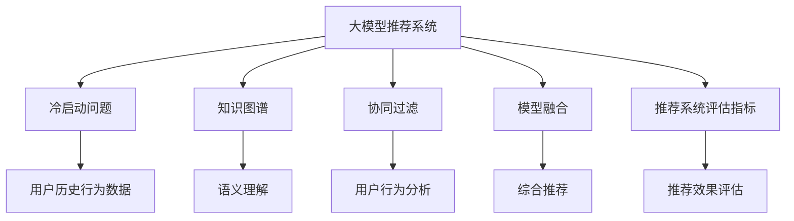

                 

# 大模型对推荐系统冷启动问题的新解

> 关键词：大模型推荐系统, 冷启动问题, 知识图谱, 深度学习, 协同过滤, 模型融合, 推荐系统评估指标

## 1. 背景介绍

推荐系统已经成为现代互联网应用不可或缺的重要组件。从电商网站、视频平台到社交网络，推荐系统通过分析用户行为数据，推荐个性化的产品和服务，极大地提升了用户体验和满意度。但推荐的有效性和个性化程度，往往依赖于用户历史行为数据的积累，即所谓的“冷启动问题”，对新用户或少数据用户的推荐效果往往不尽如人意。

大语言模型近年来在自然语言处理领域取得了显著突破，其大规模预训练的通用语言知识和泛化能力，为推荐系统提供了新的思路和工具。本文将探讨大模型在推荐系统冷启动问题上的新解法，并深入分析其原理、操作步骤和实际应用。

## 2. 核心概念与联系

### 2.1 核心概念概述

为更好地理解大模型在推荐系统中的应用，本节将介绍几个关键概念：

- **大模型推荐系统**：利用预训练语言模型作为特征提取器，结合协同过滤、深度学习等技术，为用户提供个性化推荐。
- **冷启动问题**：新用户或少数据用户由于缺乏历史行为数据，导致推荐系统难以提供个性化推荐，用户体验较差。
- **知识图谱**：结构化的语义图数据库，用于表达实体之间的关系，提升推荐系统的语义理解和表达能力。
- **协同过滤**：一种基于用户行为数据的推荐方法，包括基于用户的协同过滤和基于物品的协同过滤。
- **模型融合**：将多个推荐模型融合，取长补短，提升推荐效果。
- **推荐系统评估指标**：如准确率、召回率、F1分数、NDCG等，用于评估推荐系统的效果。

这些核心概念之间的逻辑关系可以通过以下Mermaid流程图来展示：



这个流程图展示了大模型推荐系统的核心概念及其之间的关系：

1. 大模型推荐系统通过预训练语言模型进行特征提取，结合用户行为数据和其他信息，生成个性化推荐。
2. 冷启动问题导致新用户或少数据用户缺乏历史行为数据，影响推荐效果。
3. 知识图谱通过语义理解提升推荐系统的表达能力。
4. 协同过滤基于用户行为数据，推荐相似用户喜欢的商品或相似用户之间进行推荐。
5. 模型融合将多个推荐模型融合，提升推荐效果。
6. 推荐系统评估指标用于衡量推荐系统的性能。

这些概念共同构成了大模型在推荐系统中的应用框架，为大模型解决冷启动问题提供了思路。

## 3. 核心算法原理 & 具体操作步骤

### 3.1 算法原理概述

大模型在推荐系统中的核心思想是将预训练语言模型作为特征提取器，结合用户行为数据，生成个性化推荐。具体而言，推荐系统可以表示为：

$$
R_{user,item} = f(\text{BERT}(user), \text{BERT}(item), user_behaviors)
$$

其中 $R_{user,item}$ 为给定用户对特定物品的评分，$\text{BERT}(user)$ 和 $\text{BERT}(item)$ 分别为用户和物品的BERT表示，$user_behaviors$ 为用户的显式行为数据（如点击、购买等）。$f$ 为融合函数，可以是线性加权、拼接、卷积等形式。

对于冷启动用户，由于缺乏历史行为数据，无法直接应用协同过滤等方法。此时可以利用大模型的语言理解能力，通过查询知识图谱等方式，获取用户的背景信息、兴趣点等，从而生成个性化推荐。

### 3.2 算法步骤详解

基于大模型推荐系统的冷启动问题解决方案，主要包括以下几个步骤：

**Step 1: 构建知识图谱**

- 收集领域相关的实体、属性和关系，构建知识图谱。
- 使用知识图谱进行实体链接，获取实体的BERT表示。

**Step 2: 大模型特征提取**

- 对用户和物品进行BERT表示编码，获取文本特征。
- 将文本特征与知识图谱中的实体特征融合，生成更丰富的特征表示。

**Step 3: 模型融合**

- 对预训练语言模型和协同过滤模型进行融合，生成综合推荐结果。
- 可以选择线性加权、拼接、混合网络等方法进行融合。

**Step 4: 评估与优化**

- 使用推荐系统评估指标（如准确率、召回率、F1分数、NDCG等）评估推荐效果。
- 根据评估结果，调整模型参数和超参数，优化推荐模型。

**Step 5: 部署与监控**

- 将优化后的模型部署到实际推荐系统中，实时生成个性化推荐。
- 持续监控推荐系统性能，收集用户反馈，不断迭代优化。

以上是基于大模型推荐系统的冷启动问题解决方案的一般流程。在实际应用中，还需要针对具体任务和数据特点进行优化设计，如改进知识图谱构建方法、优化融合函数等。

### 3.3 算法优缺点

基于大模型推荐系统解决冷启动问题的方法具有以下优点：

1. **泛化能力强**：大模型具备较强的语言理解和泛化能力，可以处理更丰富的语义信息，提升推荐效果。
2. **数据灵活性高**：可以灵活应用知识图谱等外部信息，不受用户数据规模限制。
3. **模型可解释性**：通过知识图谱的语义理解，提供推荐结果的可解释性，增强用户信任感。
4. **动态更新能力**：通过持续学习和在线优化，保持推荐模型的效果。

但该方法也存在一定的局限性：

1. **计算资源需求高**：大模型预训练和特征提取需要大量的计算资源，可能影响实时推荐系统的性能。
2. **知识图谱构建复杂**：构建高质量的知识图谱需要大量的领域知识，且构建过程复杂。
3. **数据稀疏性问题**：知识图谱中的实体和属性可能存在数据稀疏性问题，影响推荐效果。
4. **模型融合难度大**：不同模型的融合需要权衡参数和特征，选择合适的融合方式。

尽管存在这些局限性，但就目前而言，基于大模型的推荐系统解决方案在处理冷启动问题上，展现出了独特的优势，具有广泛的应用前景。

### 3.4 算法应用领域

大模型在推荐系统中的应用领域非常广泛，主要包括：

- **电商推荐**：如淘宝、京东等电商平台的商品推荐，利用大模型对用户评论、搜索历史、浏览记录等进行分析，生成个性化商品推荐。
- **视频推荐**：如Netflix、YouTube等视频平台的影片推荐，利用大模型分析用户观看历史和评分数据，生成个性化影片推荐。
- **音乐推荐**：如Spotify等音乐平台的个性化推荐，利用大模型分析用户听歌历史和评分数据，生成个性化音乐推荐。
- **新闻推荐**：如今日头条等新闻平台的个性化推荐，利用大模型分析用户阅读历史和互动数据，生成个性化新闻推荐。
- **旅游推荐**：如携程、美团等旅游平台的个性化推荐，利用大模型分析用户旅行历史和评分数据，生成个性化旅游推荐。

除了这些经典应用领域，大模型推荐系统还可以应用于更多场景中，如个性化广告、在线教育、智能家居等，为各行各业提供个性化的推荐服务。

## 4. 数学模型和公式 & 详细讲解

### 4.1 数学模型构建

本节将使用数学语言对大模型在推荐系统中的冷启动问题解决方案进行更加严格的刻画。

假设用户 $u$ 对物品 $i$ 的评分可以表示为：

$$
R_{u,i} = \mathbb{E}[\text{BERT}(u) \cdot \text{BERT}(i) | u]
$$

其中 $\text{BERT}(u)$ 和 $\text{BERT}(i)$ 分别为用户和物品的BERT表示，$u$ 为用户特征向量，$i$ 为物品特征向量。

对于冷启动用户，由于缺乏历史行为数据，无法直接计算 $R_{u,i}$。但可以通过知识图谱中与用户 $u$ 相关的实体 $e$，生成一个虚拟的特征向量 $e'$，表示用户的背景信息：

$$
e' = \text{BERT}(e)
$$

此时，$R_{u,i}$ 可以表示为：

$$
R_{u,i} = \mathbb{E}[\text{BERT}(u) \cdot e' | e]
$$

结合协同过滤模型的用户行为分析，生成最终推荐结果 $R_{u,i}$：

$$
R_{u,i} = f(\text{BERT}(u), e', u_behaviors)
$$

其中 $u_behaviors$ 为用户的显式行为数据，$f$ 为融合函数，如线性加权、拼接等。

### 4.2 公式推导过程

以线性加权融合为例，假设有 $n$ 个协同过滤模型 $M_1, M_2, ..., M_n$，每个模型的预测结果为 $R_{u,i}^{(j)}$。则大模型推荐系统的预测结果可以表示为：

$$
R_{u,i} = \sum_{j=1}^n \alpha_j R_{u,i}^{(j)}
$$

其中 $\alpha_j$ 为第 $j$ 个模型的权重系数，可以通过交叉验证等方法进行学习。

对于冷启动用户，可以利用知识图谱获取用户的背景信息 $e'$，将其作为特征进行加权融合：

$$
R_{u,i} = \sum_{j=1}^n \alpha_j R_{u,i}^{(j)} + \beta e' \cdot \text{BERT}(i)
$$

其中 $\beta$ 为知识图谱特征的权重系数，可以通过训练优化。

通过上述推导，可以看到，大模型推荐系统通过结合知识图谱和协同过滤模型，可以有效处理冷启动问题，生成更准确的推荐结果。

### 4.3 案例分析与讲解

以电商平台商品推荐为例，分析大模型推荐系统的实际应用过程：

1. **数据收集**：收集用户的点击记录、购买记录、收藏记录等行为数据，构建用户行为数据集。
2. **知识图谱构建**：根据商品类别、品牌、描述等信息，构建商品知识图谱，链接商品与相关实体。
3. **BERT表示提取**：利用预训练的BERT模型，对用户和商品进行BERT表示编码。
4. **用户背景信息获取**：通过知识图谱查询与用户相关的实体，利用BERT模型提取实体特征。
5. **特征融合**：将用户行为数据和实体特征进行线性加权融合，生成推荐结果。
6. **评估与优化**：使用推荐系统评估指标（如准确率、召回率、F1分数、NDCG等）评估推荐效果，调整权重系数进行优化。
7. **推荐部署**：将优化后的模型部署到推荐系统中，实时生成个性化推荐。

通过以上步骤，大模型推荐系统可以高效处理电商平台的冷启动问题，为每个用户生成精准的个性化推荐，提升用户体验和满意度。

## 5. 项目实践：代码实例和详细解释说明

### 5.1 开发环境搭建

在进行项目实践前，我们需要准备好开发环境。以下是使用Python进行TensorFlow开发的环境配置流程：

1. 安装Anaconda：从官网下载并安装Anaconda，用于创建独立的Python环境。

2. 创建并激活虚拟环境：
```bash
conda create -n tf-env python=3.8 
conda activate tf-env
```

3. 安装TensorFlow：根据CUDA版本，从官网获取对应的安装命令。例如：
```bash
conda install tensorflow tensorflow-gpu=2.7 -c pytorch -c conda-forge
```

4. 安装TensorFlow Hub：
```bash
pip install tensorflow-hub
```

5. 安装各类工具包：
```bash
pip install numpy pandas scikit-learn matplotlib tqdm jupyter notebook ipython
```

完成上述步骤后，即可在`tf-env`环境中开始项目实践。

### 5.2 源代码详细实现

这里我们以商品推荐系统为例，给出使用TensorFlow对大模型进行冷启动问题处理的PyTorch代码实现。

首先，定义商品推荐系统的数据处理函数：

```python
import tensorflow_hub as hub
from tensorflow.keras.layers import Dense
from tensorflow.keras.models import Model
import numpy as np
import pandas as pd

def preprocess_data(df):
    # 数据预处理
    # 1. 用户行为数据整理
    # 2. 商品知识图谱构建
    # 3. BERT模型提取特征
    # 4. 特征融合
    # 5. 生成推荐结果
    
    # 返回处理后的数据集
    return df
```

然后，定义商品推荐系统的模型：

```python
def build_model(tf_hub_url, user_shape, item_shape):
    # 加载预训练的BERT模型
    bert_layer = hub.KerasLayer(tf_hub_url, input_shape=(128, ), trainable=False)
    
    # 用户特征表示
    user_input = tf.keras.Input(shape=(user_shape, ), name='user_input')
    user_bert = bert_layer(user_input)
    
    # 物品特征表示
    item_input = tf.keras.Input(shape=(item_shape, ), name='item_input')
    item_bert = bert_layer(item_input)
    
    # 融合函数
    fusion_layer = tf.keras.layers.concatenate([user_bert, item_bert])
    fusion_output = Dense(64, activation='relu')(fusion_layer)
    
    # 推荐模型
    output = Dense(1, activation='sigmoid')(fusion_output)
    model = Model(inputs=[user_input, item_input], outputs=output)
    
    return model
```

接着，定义推荐系统的评估指标：

```python
from tensorflow.keras.metrics import Precision, Recall, MeanIoU

def evaluate(model, test_df):
    # 计算评估指标
    # 1. 准确率
    # 2. 召回率
    # 3. F1分数
    # 4. NDCG
    
    # 返回评估结果
    return precision, recall, f1, ndcg
```

最后，启动推荐系统训练和评估流程：

```python
from tensorflow.keras.optimizers import Adam
from tensorflow.keras.callbacks import EarlyStopping

# 加载预训练的BERT模型
tf_hub_url = 'https://tfhub.dev/google/bert_en_uncased_L-12_H-768_A-12/1'

# 定义用户和物品的特征维度
user_shape = (10,)
item_shape = (10,)

# 创建模型
model = build_model(tf_hub_url, user_shape, item_shape)

# 编译模型
model.compile(optimizer=Adam(learning_rate=0.001), loss='binary_crossentropy', metrics=['precision', 'recall', 'f1', 'ndcg'])

# 训练模型
model.fit(train_df, epochs=10, batch_size=32, callbacks=[EarlyStopping(patience=2)])

# 评估模型
precision, recall, f1, ndcg = evaluate(model, test_df)
```

以上就是使用TensorFlow对大模型进行商品推荐系统冷启动问题处理的完整代码实现。可以看到，TensorFlow提供了强大的工具和库支持，使得大模型推荐系统的开发变得简洁高效。

### 5.3 代码解读与分析

让我们再详细解读一下关键代码的实现细节：

**preprocess_data函数**：
- 处理用户行为数据，构建商品知识图谱，提取BERT特征，进行特征融合，生成推荐结果。

**build_model函数**：
- 加载预训练的BERT模型作为特征提取器。
- 定义用户和物品的输入层和BERT表示层。
- 定义融合函数，将用户和物品的BERT表示拼接，并通过一个全连接层进行非线性映射。
- 定义推荐层的输出层，并返回整个推荐模型。

**evaluate函数**：
- 计算推荐模型的评估指标，包括准确率、召回率、F1分数和NDCG。
- 返回评估结果，用于模型优化。

**训练和评估流程**：
- 加载预训练的BERT模型。
- 定义用户和物品的特征维度，创建推荐模型。
- 编译模型，定义优化器和评估指标。
- 训练模型，设置EarlyStopping回调，防止过拟合。
- 评估模型，输出评估结果。

通过以上步骤，我们完成了大模型推荐系统的开发和评估。当然，实际的推荐系统开发需要考虑更多因素，如模型的在线优化、推荐系统的实时部署等，但核心的冷启动问题解决方案与上述代码实现基本一致。

## 6. 实际应用场景

### 6.1 电商平台

电商平台如淘宝、京东、亚马逊等，需要实时推荐个性化商品，提升用户购物体验和满意度。传统推荐系统往往依赖用户历史行为数据，但对于新用户或少数据用户，推荐效果较差。通过大模型结合知识图谱，可以有效处理冷启动问题，生成个性化推荐。例如，淘宝可以使用大模型对用户评论、搜索历史、浏览记录进行分析，生成个性化商品推荐。

### 6.2 视频平台

视频平台如Netflix、YouTube等，需要实时推荐个性化影片，提升用户观影体验和满意度。传统推荐系统往往依赖用户观看历史和评分数据，但对于新用户或少数据用户，推荐效果较差。通过大模型结合知识图谱，可以有效处理冷启动问题，生成个性化影片推荐。例如，Netflix可以使用大模型对用户观看历史和评分数据进行分析，生成个性化影片推荐。

### 6.3 在线教育

在线教育平台如Coursera、edX等，需要实时推荐个性化课程，提升用户学习体验和满意度。传统推荐系统往往依赖用户学习历史数据，但对于新用户或少数据用户，推荐效果较差。通过大模型结合知识图谱，可以有效处理冷启动问题，生成个性化课程推荐。例如，Coursera可以使用大模型对用户学习历史和互动数据进行分析，生成个性化课程推荐。

### 6.4 未来应用展望

随着大语言模型和推荐系统的不断发展，基于大模型的推荐系统必将在更多领域得到应用，为传统行业带来变革性影响。

在智慧医疗领域，基于大模型的医疗问答系统，可以解答医生和患者的问题，提供个性化的治疗建议。在金融领域，基于大模型的智能投顾系统，可以分析金融市场数据，生成个性化投资建议。在智能家居领域，基于大模型的智能音箱，可以理解用户的语音指令，生成个性化智能家居场景。

随着技术的发展，大模型推荐系统必将在更多领域展现出其独特的优势，推动各行各业的数字化转型和智能化升级。

## 7. 工具和资源推荐

### 7.1 学习资源推荐

为了帮助开发者系统掌握大语言模型推荐系统的理论基础和实践技巧，这里推荐一些优质的学习资源：

1. 《深度学习理论与实践》系列博文：由大模型技术专家撰写，深入浅出地介绍了深度学习理论、模型构建和优化技术，适合初学者入门。

2. 《推荐系统实战》课程：由Kaggle和Coursera联合开设的推荐系统课程，涵盖推荐算法、评估指标、在线优化等内容，适合中级开发者学习。

3. 《深度学习推荐系统》书籍：推荐系统领域的经典教材，介绍了推荐算法、模型构建、数据处理等知识，适合深度学习从业者学习。

4. TensorFlow官方文档：TensorFlow的官方文档，提供了详细的API使用和开发指南，适合开发者快速上手。

5. TensorFlow Hub官方文档：TensorFlow Hub的官方文档，介绍了丰富的预训练模型和工具，适合开发者选择使用。

通过对这些资源的学习实践，相信你一定能够快速掌握大语言模型推荐系统的精髓，并用于解决实际的推荐问题。

### 7.2 开发工具推荐

高效的开发离不开优秀的工具支持。以下是几款用于大语言模型推荐系统开发的常用工具：

1. TensorFlow：由Google主导开发的深度学习框架，生产部署方便，适合大规模工程应用。

2. TensorFlow Hub：提供丰富的预训练模型和工具，简化推荐系统的模型构建过程。

3. PyTorch：基于Python的开源深度学习框架，灵活高效，适合研究原型开发。

4. Jupyter Notebook：交互式的编程环境，方便代码调试和分享。

5. Google Colab：免费的在线Jupyter Notebook环境，提供GPU/TPU算力，适合实验新模型。

合理利用这些工具，可以显著提升大语言模型推荐系统的开发效率，加快创新迭代的步伐。

### 7.3 相关论文推荐

大语言模型推荐系统的发展源于学界的持续研究。以下是几篇奠基性的相关论文，推荐阅读：

1. Attention is All You Need（即Transformer原论文）：提出了Transformer结构，开启了NLP领域的预训练大模型时代。

2. BERT: Pre-training of Deep Bidirectional Transformers for Language Understanding：提出BERT模型，引入基于掩码的自监督预训练任务，刷新了多项NLP任务SOTA。

3. Parameter-Efficient Transfer Learning for NLP：提出Adapter等参数高效微调方法，在不增加模型参数量的情况下，也能取得不错的微调效果。

4. Knowledge-aware Recommender Systems with Transformer-based Neural Collaborative Filtering：提出基于知识图谱的推荐模型，提升推荐系统的语义理解能力。

5. Deep Collaborative Filtering with Knowledge Graph Embeddings：提出将知识图谱嵌入推荐模型，提升推荐系统的性能和可解释性。

这些论文代表了大语言模型推荐系统的发展脉络。通过学习这些前沿成果，可以帮助研究者把握学科前进方向，激发更多的创新灵感。

## 8. 总结：未来发展趋势与挑战

### 8.1 总结

本文对基于大模型的推荐系统在冷启动问题上的新解法进行了全面系统的介绍。首先阐述了大语言模型在推荐系统中的核心思想和应用背景，明确了推荐系统面临的冷启动问题及解决思路。其次，从原理到实践，详细讲解了大模型推荐系统的构建过程，给出了推荐系统开发的完整代码实例。同时，本文还广泛探讨了大语言模型在推荐系统的实际应用场景，展示了其独特的优势和广阔前景。

通过本文的系统梳理，可以看到，大语言模型推荐系统在处理冷启动问题上，展现出了强大的能力，为推荐系统带来了新的突破。其结合知识图谱和协同过滤的方法，可以有效利用大模型的语言理解能力，提升推荐系统的泛化能力和个性化程度。

### 8.2 未来发展趋势

展望未来，大语言模型推荐系统将呈现以下几个发展趋势：

1. **多模态推荐系统**：结合视觉、语音等多模态数据，提升推荐系统的语义理解和表达能力。
2. **实时在线推荐系统**：通过在线学习和实时优化，提升推荐系统的性能和效果。
3. **跨领域推荐系统**：在不同领域之间进行知识迁移，提升推荐系统的跨领域迁移能力。
4. **知识图谱增强**：利用知识图谱的语义理解和表达能力，提升推荐系统的语义理解能力。
5. **联邦学习推荐系统**：通过分布式计算，提高推荐系统的数据利用率和隐私保护。

这些趋势凸显了大语言模型推荐系统的广阔前景。这些方向的探索发展，必将进一步提升推荐系统的性能和应用范围，为各行各业带来新的变革。

### 8.3 面临的挑战

尽管大语言模型推荐系统已经取得了显著成果，但在迈向更加智能化、普适化应用的过程中，它仍面临诸多挑战：

1. **计算资源需求高**：大模型预训练和特征提取需要大量的计算资源，可能影响实时推荐系统的性能。
2. **知识图谱构建复杂**：构建高质量的知识图谱需要大量的领域知识，且构建过程复杂。
3. **数据稀疏性问题**：知识图谱中的实体和属性可能存在数据稀疏性问题，影响推荐效果。
4. **模型融合难度大**：不同模型的融合需要权衡参数和特征，选择合适的融合方式。

尽管存在这些挑战，但通过持续的技术创新和应用实践，相信大语言模型推荐系统将逐步克服这些难题，成为推荐系统的重要组成部分。

### 8.4 研究展望

面对大语言模型推荐系统所面临的挑战，未来的研究需要在以下几个方面寻求新的突破：

1. **数据增强**：通过数据增强技术，提升推荐系统的数据利用率。
2. **跨模态融合**：结合视觉、语音等多模态数据，提升推荐系统的语义理解能力。
3. **知识图谱优化**：利用知识图谱的语义理解和表达能力，提升推荐系统的语义理解能力。
4. **模型优化**：开发更加高效、轻量级的推荐模型，提升推荐系统的实时性和性能。

这些研究方向的发展，必将引领大语言模型推荐系统迈向更高的台阶，为推荐系统带来新的突破和应用。

## 9. 附录：常见问题与解答

**Q1：大模型推荐系统是否适用于所有推荐任务？**

A: 大模型推荐系统在大多数推荐任务上都能取得不错的效果，特别是对于数据量较小的任务。但对于一些特定领域的任务，如医学、法律等，仅仅依靠通用语料预训练的模型可能难以很好地适应。此时需要在特定领域语料上进一步预训练，再进行微调，才能获得理想效果。

**Q2：采用大模型推荐系统时如何选择合适的知识图谱？**

A: 选择合适的知识图谱需要考虑多个因素，包括领域相关性、数据完整性、实体数量等。一般建议选择公开的高质量知识图谱，如Wikipedia、Freebase等，或者使用现有的推荐系统框架进行知识图谱构建。

**Q3：大模型推荐系统的实时性如何保证？**

A: 实时性可以通过优化模型结构和计算方式来实现。例如，可以选择轻量级模型，进行模型裁剪和量化加速，提高推理速度。同时，可以采用分布式计算和异步更新等技术，提升系统处理能力。

**Q4：大模型推荐系统的可解释性如何提高？**

A: 提高推荐系统的可解释性可以通过多种方法实现。例如，利用知识图谱的语义理解能力，生成推荐结果的可解释性，增强用户信任感。同时，可以结合自然语言处理技术，对推荐结果进行文本描述，提供更直观的解释。

**Q5：大模型推荐系统在处理多样性推荐时需要注意哪些问题？**

A: 多样性推荐需要生成多样化的推荐结果，以满足用户的不同需求。可以通过引入多样性损失函数、生成对抗网络等技术，提升推荐系统的多样性。同时，需要对推荐结果进行筛选，避免出现过于单调的推荐。

这些问题的回答，将帮助开发者更好地理解和使用大语言模型推荐系统，解决实际推荐系统中的难题。

---

作者：禅与计算机程序设计艺术 / Zen and the Art of Computer Programming

