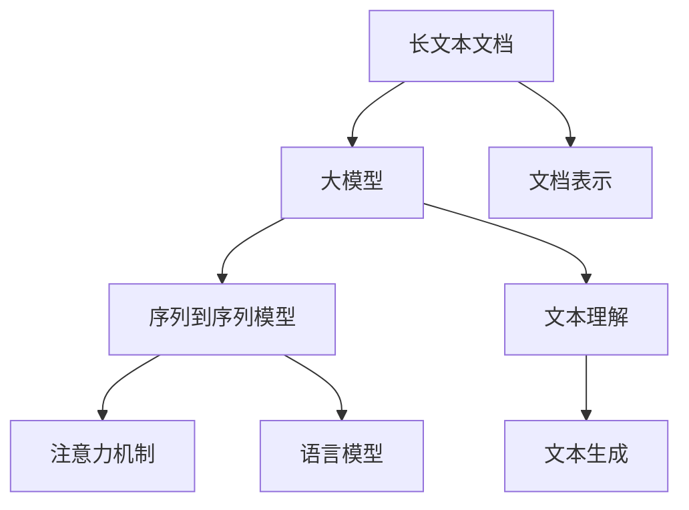

                 

# 大模型对长文本文档的理解与表征

> 关键词：长文本文档理解, 大模型, 自然语言处理, 文档表示, 序列到序列模型, 注意力机制, 语言模型, 序列建模, 深度学习

## 1. 背景介绍

### 1.1 问题由来

随着互联网技术的发展，信息爆炸时代的到来，长文本文档（Long Text Documents）如新闻报道、论文摘要、百科条目等正迅速增多。它们不仅在体量上远超传统的短文本，而且在语义复杂性、结构多样性上也有更高的要求。传统短文本处理模型在面对长文本文档时，往往难以获得足够深度的理解，无法充分利用长文本中的结构化信息，导致无法提供高质量的文本表示。

为应对长文本文档处理的需求，基于深度学习的大模型（Large Models）应运而生。大模型通常拥有海量参数，能够处理更长的文本，并在多模态语料上进行自监督预训练，从中学习到丰富的语言表征能力。通过对长文本文档进行建模，大模型可以生成高维空间中的向量表示，使得文档间的相似度计算、文档分类、文档检索等任务变得更加高效和精准。

本文聚焦于大模型对长文本文档的理解与表征，通过理论分析与实验验证，详细探讨了序列到序列模型、注意力机制等核心技术在大模型中的应用，深入理解长文本文档的表征方式，为后续的文本处理提供坚实基础。

## 2. 核心概念与联系

### 2.1 核心概念概述

为更好地理解大模型对长文本文档的理解与表征，本节将介绍几个关键概念：

- **长文本文档（Long Text Documents）**：指长度大于几百字，甚至数千字的文本，如新闻报道、论文摘要、百科条目等。它们通常包含丰富的结构化信息，并且语义复杂度较高。
- **大模型（Large Models）**：指拥有数亿至数十亿参数的深度学习模型，通常用于处理复杂的自然语言任务。如BERT、GPT、T5等。
- **序列到序列模型（Sequence-to-Sequence Models）**：指用于处理序列数据（如文本）的深度学习模型，能够将输入序列映射到输出序列，常见的模型包括RNN、LSTM、GRU等。
- **注意力机制（Attention Mechanism）**：指一种基于权重的机制，用于在序列数据的不同位置上分配注意力权重，从而使模型更加关注重要信息。
- **语言模型（Language Model）**：指用于预测文本序列的概率分布的模型，如n-gram模型、RNN-LM、Transformer-XLM等。

这些概念之间的逻辑关系可以通过以下Mermaid流程图来展示：



这个流程图展示了长文本文档处理的核心概念及其之间的关系：

1. 长文本文档通过大模型进行理解与表示。
2. 大模型中的序列到序列模型、注意力机制、语言模型等技术，可以协同工作，提高模型的文档表示能力。
3. 通过文档表示，可以进行文本理解、文本生成等后续任务。

## 3. 核心算法原理 & 具体操作步骤

### 3.1 算法原理概述

大模型对长文本文档的理解与表征，主要通过以下三个步骤实现：

1. **文本分块与编码**：将长文本文档分成若干块，并对每个块进行编码，获得高维空间中的向量表示。
2. **序列建模与注意力机制**：利用序列到序列模型和注意力机制，对文档块的编码向量进行加权聚合，生成最终的全文表示。
3. **文本表示与任务适配**：将生成的文档表示进行任务适配，输出最终的预测结果。

### 3.2 算法步骤详解

#### 3.2.1 文本分块与编码

长文本文档处理的首要步骤是将文档分块，并对每个块进行编码。常见的方法包括：

1. **基于窗口的分块**：将长文本按固定窗口大小分块，然后对每个块进行编码。这种方法简单易行，但容易忽略文档的整体结构信息。
2. **基于语义的分块**：利用句子分割、段落分割等技术，将文档分成若干语义单元，并对每个单元进行编码。这种方法更符合文档的语义结构，但需要额外的语义标注成本。
3. **基于变换的分块**：利用文本生成技术，对文档进行变换生成，生成若干子文档，并分别编码。这种方法能够充分利用文档的全局信息，但计算成本较高。

编码的常用方法是将文本转化为词嵌入（Word Embedding）向量，常用的模型包括BERT、GPT等。词嵌入向量可以表示每个单词在向量空间中的位置，用于后续的序列建模与注意力机制计算。

#### 3.2.2 序列建模与注意力机制

在文本分块与编码的基础上，通过序列到序列模型和注意力机制，对文档块的编码向量进行加权聚合，生成最终的全文表示。具体过程如下：

1. **序列建模**：将文档块的编码向量作为输入，送入序列到序列模型进行计算。常见的模型包括RNN、LSTM、GRU、Transformer等。
2. **注意力机制**：在序列建模过程中，利用注意力机制对序列中的不同位置进行加权聚合，从而使模型更加关注重要信息。注意力机制通过计算注意力权重，将不同位置的信息进行加权，生成最终的全文表示。

#### 3.2.3 文本表示与任务适配

在序列建模与注意力机制的基础上，通过任务适配，将生成的文档表示进行转化，输出最终的预测结果。常见的任务适配方法包括：

1. **文档分类**：将文档表示送入分类器，输出文档的分类标签。
2. **文档检索**：将文档表示送入检索模型，输出文档与查询文本的相似度。
3. **文本生成**：将文档表示送入生成器，输出新的文本序列。

### 3.3 算法优缺点

序列到序列模型和注意力机制在大模型中的应用，具有以下优点：

1. **强大的表示能力**：通过序列建模与注意力机制，能够将长文本文档中的结构化信息进行有效的表示。
2. **灵活的适配能力**：通过任务适配，能够将模型应用于多种文本处理任务。
3. **高效的计算性能**：大模型通常具有高效的并行计算能力，能够快速处理长文本文档。

同时，也存在以下缺点：

1. **高计算成本**：大模型通常需要大量的计算资源进行训练和推理，计算成本较高。
2. **长文本建模困难**：长文本文档的语义结构复杂，难以利用传统的短文本处理模型进行建模。
3. **过拟合风险**：大模型在处理长文本文档时，可能存在过拟合的风险，需要额外的正则化技术进行优化。

### 3.4 算法应用领域

大模型对长文本文档的理解与表征技术，在以下领域具有广泛的应用：

- **自然语言理解（NLU）**：通过文档表示，进行文本分类、情感分析、问答系统等任务。
- **文本检索（IR）**：利用文档表示，进行文本检索和相似度计算。
- **文本生成（NLG）**：生成新的文本序列，如文本摘要、机器翻译、对话系统等。
- **问答系统（QA）**：利用文档表示，回答用户提出的自然语言问题。
- **信息抽取（IE）**：从长文本文档中抽取结构化信息，如实体识别、关系抽取等。

## 4. 数学模型和公式 & 详细讲解 & 举例说明

### 4.1 数学模型构建

在大模型对长文本文档的理解与表征中，常见的数学模型包括：

1. **长文本文档分块编码模型**：
   \[
   x = \{(x_1, h_1), (x_2, h_2), \ldots, (x_n, h_n)\}
   \]
   其中，\(x_i\) 表示第 \(i\) 个块，\(h_i\) 表示块的编码向量。

2. **序列到序列模型**：
   \[
   \text{Enc}(h) = f(h_1, h_2, \ldots, h_n)
   \]
   其中，\(f\) 表示序列到序列模型。

3. **注意力机制**：
   \[
   \alpha_i = \frac{\exp(e(h_i, h_j))}{\sum_{k=1}^n \exp(e(h_k, h_j))}
   \]
   其中，\(\alpha_i\) 表示注意力权重，\(e\) 表示注意力函数。

4. **文档表示**：
   \[
   \text{Doc} = \text{Dec}(\text{Enc}(h))
   \]
   其中，\(\text{Dec}\) 表示任务适配器。

### 4.2 公式推导过程

以BERT模型为例，推导其对长文本文档的理解与表征过程。

BERT模型的核心组成部分是Transformer模型，其编码过程包括：

1. **词嵌入**：将每个单词转化为词嵌入向量。
   \[
   w_i = \text{Embed}(x_i)
   \]

2. **位置编码**：对每个单词的词嵌入向量进行位置编码，增加空间位置信息。
   \[
   w_i' = w_i + \text{Pos}(x_i)
   \]

3. **Transformer编码**：将位置编码后的单词向量输入Transformer模型，进行多层的自注意力计算和前馈神经网络计算。
   \[
   h_i = \text{Transformer}(w_i')
   \]

4. **文档编码**：将每个块的编码向量进行拼接，生成最终的全文表示。
   \[
   \text{Doc} = [h_1, h_2, \ldots, h_n]
   \]

### 4.3 案例分析与讲解

以Google的BERT模型为例，展示其在长文本文档理解与表征中的应用。

Google的BERT模型在长文本文档理解与表征中的主要贡献包括：

1. **双向编码**：BERT模型采用双向编码技术，能够充分利用文本中所有位置的语义信息。
   \[
   h_i = \text{Transformer}(w_i')
   \]

2. **掩码预测**：BERT模型在预训练过程中使用掩码预测任务，能够学习到文本中的上下文信息。
   \[
   \hat{y} = \text{MLP}(h_i)
   \]

3. **任务适配**：BERT模型通过微调，能够适应不同的文本处理任务，如文档分类、文本生成等。
   \[
   \text{Doc} = \text{Classifier}(\text{BERT}(x))
   \]

通过这些技术手段，BERT模型在处理长文本文档时，能够生成高质量的文档表示，从而实现高效、精准的文本处理。

## 5. 项目实践：代码实例和详细解释说明

### 5.1 开发环境搭建

在进行长文本文档理解与表征实践前，我们需要准备好开发环境。以下是使用Python进行PyTorch开发的环境配置流程：

1. 安装Anaconda：从官网下载并安装Anaconda，用于创建独立的Python环境。

2. 创建并激活虚拟环境：
```bash
conda create -n pytorch-env python=3.8 
conda activate pytorch-env
```

3. 安装PyTorch：根据CUDA版本，从官网获取对应的安装命令。例如：
```bash
conda install pytorch torchvision torchaudio cudatoolkit=11.1 -c pytorch -c conda-forge
```

4. 安装Transformers库：
```bash
pip install transformers
```

5. 安装各类工具包：
```bash
pip install numpy pandas scikit-learn matplotlib tqdm jupyter notebook ipython
```

完成上述步骤后，即可在`pytorch-env`环境中开始长文本文档理解与表征实践。

### 5.2 源代码详细实现

下面以长文本文档分类为例，给出使用Transformers库对BERT模型进行分类训练的PyTorch代码实现。

首先，定义长文本文档分类任务的数据处理函数：

```python
from transformers import BertTokenizer
from torch.utils.data import Dataset
import torch

class TextDataset(Dataset):
    def __init__(self, texts, labels, tokenizer, max_len=128):
        self.texts = texts
        self.labels = labels
        self.tokenizer = tokenizer
        self.max_len = max_len
        
    def __len__(self):
        return len(self.texts)
    
    def __getitem__(self, item):
        text = self.texts[item]
        label = self.labels[item]
        
        encoding = self.tokenizer(text, return_tensors='pt', max_length=self.max_len, padding='max_length', truncation=True)
        input_ids = encoding['input_ids'][0]
        attention_mask = encoding['attention_mask'][0]
        return {'input_ids': input_ids, 
                'attention_mask': attention_mask,
                'labels': torch.tensor(label, dtype=torch.long)}
```

然后，定义模型和优化器：

```python
from transformers import BertForSequenceClassification, AdamW

model = BertForSequenceClassification.from_pretrained('bert-base-cased', num_labels=2)

optimizer = AdamW(model.parameters(), lr=2e-5)
```

接着，定义训练和评估函数：

```python
from torch.utils.data import DataLoader
from tqdm import tqdm
from sklearn.metrics import classification_report

device = torch.device('cuda') if torch.cuda.is_available() else torch.device('cpu')
model.to(device)

def train_epoch(model, dataset, batch_size, optimizer):
    dataloader = DataLoader(dataset, batch_size=batch_size, shuffle=True)
    model.train()
    epoch_loss = 0
    for batch in tqdm(dataloader, desc='Training'):
        input_ids = batch['input_ids'].to(device)
        attention_mask = batch['attention_mask'].to(device)
        labels = batch['labels'].to(device)
        model.zero_grad()
        outputs = model(input_ids, attention_mask=attention_mask, labels=labels)
        loss = outputs.loss
        epoch_loss += loss.item()
        loss.backward()
        optimizer.step()
    return epoch_loss / len(dataloader)

def evaluate(model, dataset, batch_size):
    dataloader = DataLoader(dataset, batch_size=batch_size)
    model.eval()
    preds, labels = [], []
    with torch.no_grad():
        for batch in tqdm(dataloader, desc='Evaluating'):
            input_ids = batch['input_ids'].to(device)
            attention_mask = batch['attention_mask'].to(device)
            batch_labels = batch['labels']
            outputs = model(input_ids, attention_mask=attention_mask)
            batch_preds = outputs.logits.argmax(dim=1).to('cpu').tolist()
            batch_labels = batch_labels.to('cpu').tolist()
            for pred, label in zip(batch_preds, batch_labels):
                preds.append(pred)
                labels.append(label)
                
    print(classification_report(labels, preds))
```

最后，启动训练流程并在测试集上评估：

```python
epochs = 5
batch_size = 16

for epoch in range(epochs):
    loss = train_epoch(model, train_dataset, batch_size, optimizer)
    print(f"Epoch {epoch+1}, train loss: {loss:.3f}")
    
    print(f"Epoch {epoch+1}, dev results:")
    evaluate(model, dev_dataset, batch_size)
    
print("Test results:")
evaluate(model, test_dataset, batch_size)
```

以上就是使用PyTorch对BERT模型进行长文本文档分类的完整代码实现。可以看到，得益于Transformers库的强大封装，我们可以用相对简洁的代码完成BERT模型的加载和分类训练。

### 5.3 代码解读与分析

让我们再详细解读一下关键代码的实现细节：

**TextDataset类**：
- `__init__`方法：初始化文本、标签、分词器等关键组件。
- `__len__`方法：返回数据集的样本数量。
- `__getitem__`方法：对单个样本进行处理，将文本输入编码为token ids，将标签转换为张量，并进行定长padding，最终返回模型所需的输入。

**训练和评估函数**：
- 使用PyTorch的DataLoader对数据集进行批次化加载，供模型训练和推理使用。
- 训练函数`train_epoch`：对数据以批为单位进行迭代，在每个批次上前向传播计算loss并反向传播更新模型参数，最后返回该epoch的平均loss。
- 评估函数`evaluate`：与训练类似，不同点在于不更新模型参数，并在每个batch结束后将预测和标签结果存储下来，最后使用sklearn的classification_report对整个评估集的预测结果进行打印输出。

**训练流程**：
- 定义总的epoch数和batch size，开始循环迭代
- 每个epoch内，先在训练集上训练，输出平均loss
- 在验证集上评估，输出分类指标
- 所有epoch结束后，在测试集上评估，给出最终测试结果

可以看到，PyTorch配合Transformers库使得BERT微调的代码实现变得简洁高效。开发者可以将更多精力放在数据处理、模型改进等高层逻辑上，而不必过多关注底层的实现细节。

当然，工业级的系统实现还需考虑更多因素，如模型的保存和部署、超参数的自动搜索、更灵活的任务适配层等。但核心的理解与表征逻辑基本与此类似。

## 6. 实际应用场景

### 6.1 智慧医疗

在智慧医疗领域，长文本文档处理技术可以用于患者病历、医疗报告等文本的分析。通过BERT模型对长文本进行理解与表征，可以提取重要的病史信息、病情描述等关键内容，从而辅助医生进行诊断和治疗决策。

以医疗报告处理为例，通过BERT模型对报告进行理解与表征，能够识别出重要的病情描述、检查结果等信息，并将其转化为结构化的知识图谱，供医生参考。

### 6.2 智能客服

在智能客服领域，长文本文档处理技术可以用于客户留言、聊天记录等文本的分析。通过BERT模型对长文本进行理解与表征，可以提取客户的问题、需求等信息，从而提供更加精准的回复和服务。

以客户留言处理为例，通过BERT模型对留言进行理解与表征，能够识别出客户的问题类型、情感倾向等信息，并将其转化为标准化的服务方案，供客服人员参考。

### 6.3 金融风控

在金融风控领域，长文本文档处理技术可以用于金融报告、新闻、社交媒体等文本的分析。通过BERT模型对长文本进行理解与表征，可以识别出潜在的风险信息、市场趋势等关键内容，从而辅助金融机构进行风险评估和投资决策。

以金融报告处理为例，通过BERT模型对报告进行理解与表征，能够识别出重要的财务指标、风险因素等信息，并将其转化为结构化的风险评估报告，供金融机构参考。

## 7. 工具和资源推荐

### 7.1 学习资源推荐

为了帮助开发者系统掌握长文本文档理解与表征的理论基础和实践技巧，这里推荐一些优质的学习资源：

1. 《深度学习入门之自然语言处理》系列博文：由大模型技术专家撰写，深入浅出地介绍了NLP领域的基本概念和经典模型，如BERT、GPT等。

2. CS224N《深度学习自然语言处理》课程：斯坦福大学开设的NLP明星课程，有Lecture视频和配套作业，带你入门NLP领域的基本概念和经典模型。

3. 《自然语言处理基础》书籍：北京师范大学出版社，系统介绍了NLP领域的基本理论和应用技术，包括文本表示、序列建模等。

4. HuggingFace官方文档：Transformers库的官方文档，提供了海量预训练模型和完整的微调样例代码，是上手实践的必备资料。

5. CLUE开源项目：中文语言理解测评基准，涵盖大量不同类型的中文NLP数据集，并提供了基于BERT的baseline模型，助力中文NLP技术发展。

通过对这些资源的学习实践，相信你一定能够快速掌握长文本文档理解与表征的精髓，并用于解决实际的NLP问题。

### 7.2 开发工具推荐

高效的开发离不开优秀的工具支持。以下是几款用于长文本文档理解与表征开发的常用工具：

1. PyTorch：基于Python的开源深度学习框架，灵活动态的计算图，适合快速迭代研究。大部分预训练语言模型都有PyTorch版本的实现。

2. TensorFlow：由Google主导开发的开源深度学习框架，生产部署方便，适合大规模工程应用。同样有丰富的预训练语言模型资源。

3. Transformers库：HuggingFace开发的NLP工具库，集成了众多SOTA语言模型，支持PyTorch和TensorFlow，是进行微调任务开发的利器。

4. Weights & Biases：模型训练的实验跟踪工具，可以记录和可视化模型训练过程中的各项指标，方便对比和调优。与主流深度学习框架无缝集成。

5. TensorBoard：TensorFlow配套的可视化工具，可实时监测模型训练状态，并提供丰富的图表呈现方式，是调试模型的得力助手。

6. Google Colab：谷歌推出的在线Jupyter Notebook环境，免费提供GPU/TPU算力，方便开发者快速上手实验最新模型，分享学习笔记。

合理利用这些工具，可以显著提升长文本文档理解与表征任务的开发效率，加快创新迭代的步伐。

### 7.3 相关论文推荐

长文本文档理解与表征的研究源于学界的持续研究。以下是几篇奠基性的相关论文，推荐阅读：

1. Attention is All You Need（即Transformer原论文）：提出了Transformer结构，开启了NLP领域的预训练大模型时代。

2. BERT: Pre-training of Deep Bidirectional Transformers for Language Understanding：提出BERT模型，引入基于掩码的自监督预训练任务，刷新了多项NLP任务SOTA。

3. ELMo: Feature-rich compositionality in text classification：提出ELMo模型，利用上下文化的词嵌入向量，提升了长文本文档处理的精度。

4. ALBERT: A Lite BERT for Self-supervised Learning of Language Representations：提出ALBERT模型，在保持高精度的情况下，显著减小了模型参数量。

5. Longformer: The Long-Document Transformer：提出Longformer模型，通过卷积神经网络对长文本进行高效建模。

6. T5: Exploring the Limits of Transfer Learning with a Unified Text-to-Text Transformer：提出T5模型，通过统一的预训练任务，实现了文本处理任务的跨领域迁移学习。

这些论文代表了大模型处理长文本文档的技术演进，通过学习这些前沿成果，可以帮助研究者把握学科前进方向，激发更多的创新灵感。

## 8. 总结：未来发展趋势与挑战

### 8.1 总结

本文对大模型对长文本文档的理解与表征方法进行了全面系统的介绍。首先阐述了大模型在长文本文档处理中的独特优势，明确了文档理解与表征在NLP领域的重要性。其次，从原理到实践，详细讲解了序列到序列模型、注意力机制等核心技术在大模型中的应用，深入理解长文本文档的表征方式，为后续的文本处理提供坚实基础。通过本文的系统梳理，可以看到，长文本文档处理技术在大模型的辅助下，能够高效、精准地提取文档中的结构化信息，为文本理解、文本生成、文本分类等后续任务提供坚实的基础。

### 8.2 未来发展趋势

展望未来，长文本文档理解与表征技术将呈现以下几个发展趋势：

1. **多模态融合**：将文本与图像、语音等多模态信息进行融合，提升长文本文档处理的精度和鲁棒性。
2. **知识图谱结合**：将文本信息与知识图谱进行融合，利用结构化知识增强文档理解与表征。
3. **自动化处理**：利用自动化技术，如信息抽取、实体识别等，提升长文本文档处理的效率和准确性。
4. **预训练模型创新**：不断探索新的预训练模型结构和任务，提升文档处理能力。
5. **跨领域迁移**：将文档处理技术应用于更多领域，如金融、医疗、法律等。

以上趋势凸显了长文本文档处理技术的广阔前景。这些方向的探索发展，必将进一步提升文档处理的精度和效率，为自然语言理解和智能交互系统的进步提供重要支撑。

### 8.3 面临的挑战

尽管长文本文档理解与表征技术已经取得了显著成就，但在迈向更加智能化、普适化应用的过程中，仍面临诸多挑战：

1. **计算资源成本**：长文本文档处理通常需要大量的计算资源，如何高效利用算力资源，是一个亟待解决的问题。
2. **数据标注成本**：高质量的长文本文档标注成本较高，如何利用半监督、自监督等技术降低标注成本，是一个重要研究方向。
3. **泛化能力不足**：长文本文档处理的泛化能力仍需提高，特别是在处理不同领域、不同风格的文本时，容易产生泛化不足的问题。
4. **语义理解深度不足**：长文本文档处理的语义理解深度仍需进一步提升，特别是在处理复杂结构的长文本时，容易产生语义理解不足的问题。
5. **实时性要求高**：长文本文档处理对实时性要求较高，如何在保证性能的同时，提升系统响应速度，是一个重要研究方向。

### 8.4 研究展望

面对长文本文档理解与表征所面临的种种挑战，未来的研究需要在以下几个方面寻求新的突破：

1. **自动化标注**：利用半监督、自监督等技术，减少对标注数据的需求，降低标注成本。
2. **高效计算**：探索高效的计算模型和算法，降低长文本文档处理的计算资源成本。
3. **跨领域迁移**：将长文本文档处理技术应用于更多领域，提升系统通用性。
4. **深度语义理解**：利用深度学习技术，提升长文本文档处理的语义理解深度。
5. **实时处理**：研究高效的并行计算和分布式计算技术，提升系统实时性。

这些研究方向的探索，必将引领长文本文档处理技术迈向更高的台阶，为构建智能、高效、普适的文档理解与表征系统铺平道路。面向未来，长文本文档处理技术还需要与其他人工智能技术进行更深入的融合，如知识表示、因果推理、强化学习等，多路径协同发力，共同推动自然语言理解和智能交互系统的进步。只有勇于创新、敢于突破，才能不断拓展文档处理的边界，让智能技术更好地服务于人类社会。

## 9. 附录：常见问题与解答

**Q1：长文本文档理解与表征是否适用于所有长文本？**

A: 长文本文档理解与表征主要适用于那些包含丰富结构化信息的长文本，如新闻报道、论文摘要、百科条目等。对于较短文本或无结构化信息的长文本，传统的短文本处理模型仍能发挥良好效果。

**Q2：如何选择长文本文档的分块策略？**

A: 选择长文本文档分块策略时，需要根据具体任务和文本特点进行考虑。常见的策略包括基于窗口、基于语义、基于变换等。一般来说，基于语义的分块策略能够更好地保留文档的语义结构信息，但需要额外的语义标注成本。

**Q3：长文本文档处理过程中，如何选择预训练模型？**

A: 在选择预训练模型时，需要考虑模型的规模、精度、应用场景等因素。BERT、GPT等大模型通常适用于处理复杂的长文本文档，而T5等小模型则适用于处理短文本或特定领域的文本。

**Q4：长文本文档理解与表征过程中，如何进行序列建模与注意力机制计算？**

A: 进行序列建模与注意力机制计算时，通常使用Transformer模型。首先，将长文本文档分块并编码，生成编码向量；然后，利用Transformer模型对编码向量进行加权聚合，生成最终的全文表示。注意力机制通过计算注意力权重，将不同位置的信息进行加权，生成更加精准的文档表示。

**Q5：长文本文档处理过程中，如何进行文档表示与任务适配？**

A: 进行文档表示与任务适配时，通常使用任务适配器将生成的文档表示进行转换，输出任务的预测结果。常见的任务适配器包括文档分类器、文本生成器等。

作者：禅与计算机程序设计艺术 / Zen and the Art of Computer Programming

