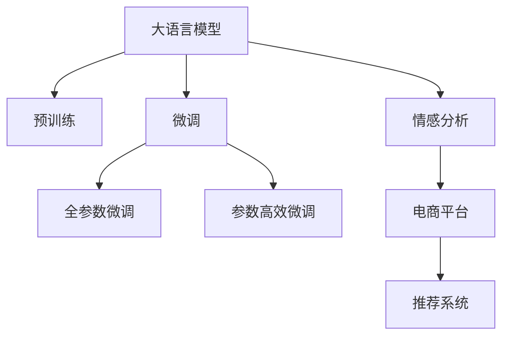

                 

## 1. 背景介绍

### 1.1 问题由来

在现代电商平台上，用户情感分析成为提升用户体验、优化商品推荐、精准营销的重要手段。电商平台能够实时监测海量用户评论、评分、互动等数据，通过情感分析技术对用户的满意度、情感倾向进行自动判断和分类，进而进行个性化推荐、广告投放等操作。

当前，主流的用户情感分析方法包括基于词典、基于规则、基于机器学习等。这些方法大多依赖于预定义的情感词典或手工设定的规则，难以适应不断变化的文本语境和用户表达方式。而大模型技术，特别是预训练语言模型，通过在大规模无标签文本语料上进行自监督学习，能够自动学习语言表征，具备强大的语义理解和生成能力，因此成为电商用户情感分析的重要技术选择。

### 1.2 问题核心关键点

大模型技术在电商平台用户情感分析中的核心关键点主要包括：

- 数据处理：将用户评论等文本数据转化为大模型的输入格式，去噪、分词、编码等。
- 模型选择：选择合适的预训练语言模型进行微调，如BERT、GPT系列等。
- 微调任务：针对电商场景设计合适的微调任务，如情感分类、情感强度预测等。
- 输出处理：将大模型输出的概率分布或逻辑回归结果转化为用户情感的类别或强度值。
- 结果应用：将情感分析结果应用于商品推荐、营销投放等业务场景。

### 1.3 问题研究意义

大模型技术在电商平台用户情感分析中的应用，具有重要的研究意义：

- 提升用户体验：通过实时分析用户评论和评分，电商平台能够及时了解用户对商品或服务的满意度，采取相应措施提升用户体验。
- 优化商品推荐：情感分析结果可融入推荐算法，实现商品相关度与情感倾向的协同优化，提高推荐的个性化和精准度。
- 精准营销投放：通过情感分析识别高价值的潜在用户，精准投放广告和促销活动，提升营销效果和投资回报率。
- 数据驱动决策：电商平台可以通过大规模的情感分析，获得全面的用户反馈信息，辅助决策制定和管理运营策略。

## 2. 核心概念与联系

### 2.1 核心概念概述

为了更好地理解大模型技术在电商用户情感分析中的应用，本节将介绍几个密切相关的核心概念：

- 大语言模型(Large Language Model, LLM)：以BERT、GPT系列为代表的大规模预训练语言模型。通过在海量无标签文本数据上进行预训练，学习通用的语言表示，具备强大的语言理解和生成能力。
- 预训练(Pre-training)：指在大规模无标签文本语料上，通过自监督学习任务训练通用语言模型的过程。预训练使得模型学习到语言的通用表示。
- 微调(Fine-tuning)：指在预训练模型的基础上，使用下游任务的少量标注数据，通过有监督学习优化模型在特定任务上的性能。通常只需要调整顶层分类器或解码器，并以较小的学习率更新全部或部分的模型参数。
- 情感分析(Sentiment Analysis)：对文本数据进行情感倾向分类，识别出其中的积极、消极或中性情感。
- 电商平台(e-commerce platform)：通过互联网提供商品销售、在线支付、物流配送等服务的网络平台，涵盖商品展示、用户评价、个性化推荐等环节。
- 推荐系统(Recommendation System)：利用用户历史行为数据和推荐算法，为用户提供个性化的商品或服务推荐，提高用户满意度和平台转化率。

这些核心概念之间的逻辑关系可以通过以下Mermaid流程图来展示：



这个流程图展示了大模型技术在电商用户情感分析中的应用框架：

1. 大语言模型通过预训练获得基础能力。
2. 微调是对预训练模型进行任务特定的优化，可以分为全参数微调和参数高效微调（PEFT）。
3. 情感分析任务作为微调的目标，将用户评论转化为情感标签或强度值。
4. 电商平台利用情感分析结果，优化推荐系统和个性化营销策略。

## 3. 核心算法原理 & 具体操作步骤

### 3.1 算法原理概述

大模型在电商用户情感分析中的应用，本质上是通过微调技术，将大模型适配到电商领域的情感分析任务上。其核心思想是：将预训练大语言模型作为通用的"特征提取器"，通过微调，使得模型在特定任务上具备更强的识别能力和泛化能力。

具体来说，假设预训练模型为 $M_{\theta}$，其中 $\theta$ 为预训练得到的模型参数。给定电商用户情感分析任务 $T$ 的标注数据集 $D=\{(x_i, y_i)\}_{i=1}^N$，微调的目标是找到新的模型参数 $\hat{\theta}$，使得模型输出能够匹配任务标签，即：

$$
\hat{\theta}=\mathop{\arg\min}_{\theta} \mathcal{L}(M_{\theta},D)
$$

其中 $\mathcal{L}$ 为针对任务 $T$ 设计的损失函数，用于衡量模型预测输出与真实标签之间的差异。常见的损失函数包括交叉熵损失、均方误差损失等。

### 3.2 算法步骤详解

基于监督学习的大模型微调在电商平台用户情感分析中的应用，一般包括以下几个关键步骤：

**Step 1: 准备预训练模型和数据集**
- 选择合适的预训练语言模型 $M_{\theta}$ 作为初始化参数，如 BERT、GPT 等。
- 准备电商用户情感分析任务的标注数据集 $D$，划分为训练集、验证集和测试集。一般要求标注数据与预训练数据的分布不要差异过大。

**Step 2: 添加任务适配层**
- 根据电商情感分析任务的特征，在预训练模型顶层设计合适的输出层和损失函数。
- 对于情感分类任务，通常在顶层添加线性分类器和交叉熵损失函数。
- 对于情感强度预测任务，通常使用回归器输出连续值，并以均方误差损失函数。

**Step 3: 设置微调超参数**
- 选择合适的优化算法及其参数，如 AdamW、SGD 等，设置学习率、批大小、迭代轮数等。
- 设置正则化技术及强度，包括权重衰减、Dropout、Early Stopping 等。
- 确定冻结预训练参数的策略，如仅微调顶层，或全部参数都参与微调。

**Step 4: 执行梯度训练**
- 将训练集数据分批次输入模型，前向传播计算损失函数。
- 反向传播计算参数梯度，根据设定的优化算法和学习率更新模型参数。
- 周期性在验证集上评估模型性能，根据性能指标决定是否触发 Early Stopping。
- 重复上述步骤直到满足预设的迭代轮数或 Early Stopping 条件。

**Step 5: 测试和部署**
- 在测试集上评估微调后模型 $M_{\hat{\theta}}$ 的性能，对比微调前后的精度提升。
- 使用微调后的模型对新样本进行推理预测，集成到电商推荐系统和个性化营销平台。
- 持续收集新的数据，定期重新微调模型，以适应数据分布的变化。

以上是基于监督学习微调大语言模型的一般流程。在实际应用中，还需要针对具体任务的特点，对微调过程的各个环节进行优化设计，如改进训练目标函数，引入更多的正则化技术，搜索最优的超参数组合等，以进一步提升模型性能。

### 3.3 算法优缺点

基于监督学习的大模型微调方法在电商平台用户情感分析中具有以下优点：

1. 简单高效。只需准备少量标注数据，即可对预训练模型进行快速适配，获得较大的性能提升。
2. 通用适用。适用于电商平台的多种情感分析任务，如商品评价、服务反馈、营销调查等，设计简单的任务适配层即可实现微调。
3. 参数高效。利用参数高效微调技术，在固定大部分预训练参数的情况下，仍可取得不错的提升。
4. 效果显著。在电商情感分析任务上，基于微调的方法已经刷新了多项性能指标，成为电商推荐和营销的重要技术手段。

同时，该方法也存在一定的局限性：

1. 依赖标注数据。微调的效果很大程度上取决于标注数据的质量和数量，获取高质量标注数据的成本较高。
2. 迁移能力有限。当目标任务与预训练数据的分布差异较大时，微调的性能提升有限。
3. 负面效果传递。预训练模型的固有偏见、有害信息等，可能通过微调传递到下游任务，造成负面影响。
4. 可解释性不足。微调模型的决策过程通常缺乏可解释性，难以对其推理逻辑进行分析和调试。

尽管存在这些局限性，但就目前而言，基于监督学习的微调方法仍是大模型在电商平台应用的主流范式。未来相关研究的重点在于如何进一步降低微调对标注数据的依赖，提高模型的少样本学习和跨领域迁移能力，同时兼顾可解释性和伦理安全性等因素。

### 3.4 算法应用领域

大模型技术在电商平台用户情感分析中的应用，已成功应用于多个场景，包括但不限于：

1. **商品评价分析**：对用户在电商平台上的商品评价进行情感分类，识别积极、消极或中性评论，指导商品质量改进和市场策略调整。
2. **服务反馈监测**：实时监控用户对服务反馈的情感倾向，识别客户痛点，提升客户服务质量。
3. **广告效果评估**：通过情感分析评估广告效果，调整广告投放策略，提高广告转化率。
4. **营销调查优化**：在营销调查问卷中加入情感强度预测任务，评估用户对促销活动的满意度，优化后续营销活动。
5. **用户行为分析**：分析用户在电商平台的浏览、购买行为，结合情感分析结果，优化个性化推荐和定价策略。

这些应用场景展示了电商大模型微调技术的强大实力，不仅提升了用户体验和满意度，还为电商平台带来了显著的经济效益。

## 4. 数学模型和公式 & 详细讲解  

### 4.1 数学模型构建

假设电商情感分析任务为情感分类任务，给定标注数据集 $D=\{(x_i, y_i)\}_{i=1}^N$，其中 $x_i$ 为电商用户评论文本，$y_i$ 为评论的情感标签。

定义模型 $M_{\theta}$ 在输入 $x_i$ 上的输出为 $\hat{y}=M_{\theta}(x_i)$，表示模型预测的情感标签。损失函数 $\mathcal{L}$ 定义为：

$$
\mathcal{L}(\theta) = -\frac{1}{N}\sum_{i=1}^N \log \mathrm{softmax}(\hat{y_i})
$$

其中 $\mathrm{softmax}$ 函数用于将模型输出的原始分数转化为概率分布。

### 4.2 公式推导过程

将上述损失函数对模型参数 $\theta$ 求梯度，得：

$$
\nabla_{\theta}\mathcal{L}(\theta) = -\frac{1}{N}\sum_{i=1}^N \frac{1}{\hat{y_i}} (\delta_{y_i}-\hat{y_i})
$$

其中 $\delta_{y_i}$ 为 $y_i$ 的one-hot编码。根据链式法则，损失函数对模型参数 $\theta_k$ 的梯度为：

$$
\frac{\partial \mathcal{L}(\theta)}{\partial \theta_k} = -\frac{1}{N}\sum_{i=1}^N (\delta_{y_i}-\hat{y_i}) \frac{\partial \hat{y_i}}{\partial \theta_k}
$$

其中 $\frac{\partial \hat{y_i}}{\partial \theta_k}$ 可进一步递归展开，利用自动微分技术完成计算。

### 4.3 案例分析与讲解

下面以情感分类任务为例，详细讲解模型训练的每一步。

首先，假设我们已经准备了电商评论数据集，分为训练集和测试集。训练集用于模型训练，测试集用于评估模型性能。

其次，将训练集数据进行预处理，包括去除停用词、词干化、分词等操作，将处理后的评论文本转换为模型可以处理的格式。

接着，利用预训练语言模型，对处理后的评论文本进行编码，得到模型输入。这里我们选择使用BERT模型作为预训练模型，其编码结果可以直接用于微调。

然后，在模型顶层添加一个线性分类器，用于将模型输出转化为情感标签的概率分布。损失函数采用交叉熵损失，用于衡量模型预测与真实标签之间的差异。

最后，使用梯度下降算法进行模型训练。通过反向传播算法，计算模型参数的梯度，更新模型权重，不断迭代直到损失函数收敛。在训练过程中，还可以采用正则化技术，如L2正则、Dropout等，防止过拟合。

训练完成后，使用测试集数据评估模型性能。常用的评价指标包括精确率、召回率、F1值等，用于衡量模型在不同情感类别上的预测效果。

## 5. 项目实践：代码实例和详细解释说明

### 5.1 开发环境搭建

在进行电商用户情感分析微调时，我们需要准备好开发环境。以下是使用Python进行PyTorch开发的环境配置流程：

1. 安装Anaconda：从官网下载并安装Anaconda，用于创建独立的Python环境。

2. 创建并激活虚拟环境：
```bash
conda create -n pytorch-env python=3.8 
conda activate pytorch-env
```

3. 安装PyTorch：根据CUDA版本，从官网获取对应的安装命令。例如：
```bash
conda install pytorch torchvision torchaudio cudatoolkit=11.1 -c pytorch -c conda-forge
```

4. 安装Transformers库：
```bash
pip install transformers
```

5. 安装各类工具包：
```bash
pip install numpy pandas scikit-learn matplotlib tqdm jupyter notebook ipython
```

完成上述步骤后，即可在`pytorch-env`环境中开始微调实践。

### 5.2 源代码详细实现

下面以情感分类任务为例，给出使用Transformers库对BERT模型进行电商用户情感分析微调的PyTorch代码实现。

首先，定义情感分类任务的数据处理函数：

```python
from transformers import BertTokenizer
from torch.utils.data import Dataset
import torch

class EcommerceSentimentDataset(Dataset):
    def __init__(self, texts, labels, tokenizer, max_len=128):
        self.texts = texts
        self.labels = labels
        self.tokenizer = tokenizer
        self.max_len = max_len
        
    def __len__(self):
        return len(self.texts)
    
    def __getitem__(self, item):
        text = self.texts[item]
        label = self.labels[item]
        
        encoding = self.tokenizer(text, return_tensors='pt', max_length=self.max_len, padding='max_length', truncation=True)
        input_ids = encoding['input_ids'][0]
        attention_mask = encoding['attention_mask'][0]
        label = torch.tensor(label, dtype=torch.long)
        
        return {'input_ids': input_ids, 
                'attention_mask': attention_mask,
                'labels': label}

# 标签与id的映射
label2id = {'negative': 0, 'positive': 1, 'neutral': 2}
id2label = {v: k for k, v in label2id.items()}

# 创建dataset
tokenizer = BertTokenizer.from_pretrained('bert-base-cased')

train_dataset = EcommerceSentimentDataset(train_texts, train_labels, tokenizer)
dev_dataset = EcommerceSentimentDataset(dev_texts, dev_labels, tokenizer)
test_dataset = EcommerceSentimentDataset(test_texts, test_labels, tokenizer)
```

然后，定义模型和优化器：

```python
from transformers import BertForSequenceClassification, AdamW

model = BertForSequenceClassification.from_pretrained('bert-base-cased', num_labels=len(label2id))

optimizer = AdamW(model.parameters(), lr=2e-5)
```

接着，定义训练和评估函数：

```python
from torch.utils.data import DataLoader
from tqdm import tqdm
from sklearn.metrics import classification_report

device = torch.device('cuda') if torch.cuda.is_available() else torch.device('cpu')
model.to(device)

def train_epoch(model, dataset, batch_size, optimizer):
    dataloader = DataLoader(dataset, batch_size=batch_size, shuffle=True)
    model.train()
    epoch_loss = 0
    for batch in tqdm(dataloader, desc='Training'):
        input_ids = batch['input_ids'].to(device)
        attention_mask = batch['attention_mask'].to(device)
        labels = batch['labels'].to(device)
        model.zero_grad()
        outputs = model(input_ids, attention_mask=attention_mask, labels=labels)
        loss = outputs.loss
        epoch_loss += loss.item()
        loss.backward()
        optimizer.step()
    return epoch_loss / len(dataloader)

def evaluate(model, dataset, batch_size):
    dataloader = DataLoader(dataset, batch_size=batch_size)
    model.eval()
    preds, labels = [], []
    with torch.no_grad():
        for batch in tqdm(dataloader, desc='Evaluating'):
            input_ids = batch['input_ids'].to(device)
            attention_mask = batch['attention_mask'].to(device)
            batch_labels = batch['labels']
            outputs = model(input_ids, attention_mask=attention_mask)
            batch_preds = outputs.logits.argmax(dim=2).to('cpu').tolist()
            batch_labels = batch_labels.to('cpu').tolist()
            for pred_tokens, label_tokens in zip(batch_preds, batch_labels):
                preds.append(pred_tokens[:len(label_tokens)])
                labels.append(label_tokens)
                
    print(classification_report(labels, preds))
```

最后，启动训练流程并在测试集上评估：

```python
epochs = 5
batch_size = 16

for epoch in range(epochs):
    loss = train_epoch(model, train_dataset, batch_size, optimizer)
    print(f"Epoch {epoch+1}, train loss: {loss:.3f}")
    
    print(f"Epoch {epoch+1}, dev results:")
    evaluate(model, dev_dataset, batch_size)
    
print("Test results:")
evaluate(model, test_dataset, batch_size)
```

以上就是使用PyTorch对BERT进行电商用户情感分析任务微调的完整代码实现。可以看到，得益于Transformers库的强大封装，我们可以用相对简洁的代码完成BERT模型的加载和微调。

### 5.3 代码解读与分析

让我们再详细解读一下关键代码的实现细节：

**EcommerceSentimentDataset类**：
- `__init__`方法：初始化文本、标签、分词器等关键组件。
- `__len__`方法：返回数据集的样本数量。
- `__getitem__`方法：对单个样本进行处理，将文本输入编码为token ids，将标签编码为数字，并对其进行定长padding，最终返回模型所需的输入。

**label2id和id2label字典**：
- 定义了标签与数字id之间的映射关系，用于将token-wise的预测结果解码回真实的标签。

**训练和评估函数**：
- 使用PyTorch的DataLoader对数据集进行批次化加载，供模型训练和推理使用。
- 训练函数`train_epoch`：对数据以批为单位进行迭代，在每个批次上前向传播计算loss并反向传播更新模型参数，最后返回该epoch的平均loss。
- 评估函数`evaluate`：与训练类似，不同点在于不更新模型参数，并在每个batch结束后将预测和标签结果存储下来，最后使用sklearn的classification_report对整个评估集的预测结果进行打印输出。

**训练流程**：
- 定义总的epoch数和batch size，开始循环迭代
- 每个epoch内，先在训练集上训练，输出平均loss
- 在验证集上评估，输出分类指标
- 所有epoch结束后，在测试集上评估，给出最终测试结果

可以看到，PyTorch配合Transformers库使得BERT微调的代码实现变得简洁高效。开发者可以将更多精力放在数据处理、模型改进等高层逻辑上，而不必过多关注底层的实现细节。

当然，工业级的系统实现还需考虑更多因素，如模型的保存和部署、超参数的自动搜索、更灵活的任务适配层等。但核心的微调范式基本与此类似。

## 6. 实际应用场景

### 6.1 智能客服系统

基于大模型微调的情感分析技术，可以广泛应用于智能客服系统的构建。传统客服往往需要配备大量人力，高峰期响应缓慢，且一致性和专业性难以保证。而使用微调后的情感分析模型，可以7x24小时不间断服务，快速响应客户咨询，用自然流畅的语言解答各类常见问题。

在技术实现上，可以收集企业内部的历史客服对话记录，将问题和最佳答复构建成监督数据，在此基础上对预训练情感分析模型进行微调。微调后的情感分析模型能够自动理解用户意图，匹配最合适的回答。对于客户提出的新问题，还可以接入检索系统实时搜索相关内容，动态组织生成回答。如此构建的智能客服系统，能大幅提升客户咨询体验和问题解决效率。

### 6.2 金融舆情监测

金融机构需要实时监测市场舆论动向，以便及时应对负面信息传播，规避金融风险。传统的人工监测方式成本高、效率低，难以应对网络时代海量信息爆发的挑战。基于大模型微调的情感分析技术，为金融舆情监测提供了新的解决方案。

具体而言，可以收集金融领域相关的新闻、报道、评论等文本数据，并对其进行情感标注。在此基础上对预训练语言模型进行微调，使其能够自动判断文本属于何种情感。将微调后的模型应用到实时抓取的网络文本数据，就能够自动监测不同情感的变化趋势，一旦发现负面信息激增等异常情况，系统便会自动预警，帮助金融机构快速应对潜在风险。

### 6.3 个性化推荐系统

当前的推荐系统往往只依赖用户的历史行为数据进行物品推荐，无法深入理解用户的真实兴趣偏好。基于大模型微调技术，个性化推荐系统可以更好地挖掘用户行为背后的语义信息，从而提供更精准、多样的推荐内容。

在实践中，可以收集用户浏览、点击、评论、分享等行为数据，提取和用户交互的物品标题、描述、标签等文本内容。将文本内容作为模型输入，用户的后续行为（如是否点击、购买等）作为监督信号，在此基础上微调预训练语言模型。微调后的模型能够从文本内容中准确把握用户的兴趣点。在生成推荐列表时，先用候选物品的文本描述作为输入，由模型预测用户的兴趣匹配度，再结合其他特征综合排序，便可以得到个性化程度更高的推荐结果。

### 6.4 未来应用展望

随着大模型和微调方法的不断发展，基于情感分析的智能系统将在更多领域得到应用，为传统行业带来变革性影响。

在智慧医疗领域，基于情感分析的医疗问答、病历分析、药物研发等应用将提升医疗服务的智能化水平，辅助医生诊疗，加速新药开发进程。

在智能教育领域，情感分析结果可应用于作业批改、学情分析、知识推荐等方面，因材施教，促进教育公平，提高教学质量。

在智慧城市治理中，情感分析结果可应用于城市事件监测、舆情分析、应急指挥等环节，提高城市管理的自动化和智能化水平，构建更安全、高效的未来城市。

此外，在企业生产、社会治理、文娱传媒等众多领域，基于大模型微调的情感分析应用也将不断涌现，为NLP技术带来了全新的突破。相信随着技术的日益成熟，情感分析技术必将在更广阔的应用领域大放异彩，深刻影响人类的生产生活方式。

## 7. 工具和资源推荐

### 7.1 学习资源推荐

为了帮助开发者系统掌握大模型微调的理论基础和实践技巧，这里推荐一些优质的学习资源：

1. 《Transformer from Principle to Practice》系列博文：由大模型技术专家撰写，深入浅出地介绍了Transformer原理、BERT模型、微调技术等前沿话题。

2. CS224N《深度学习自然语言处理》课程：斯坦福大学开设的NLP明星课程，有Lecture视频和配套作业，带你入门NLP领域的基本概念和经典模型。

3. 《Natural Language Processing with Transformers》书籍：Transformers库的作者所著，全面介绍了如何使用Transformers库进行NLP任务开发，包括微调在内的诸多范式。

4. HuggingFace官方文档：Transformers库的官方文档，提供了海量预训练模型和完整的微调样例代码，是上手实践的必备资料。

5. CLUE开源项目：中文语言理解测评基准，涵盖大量不同类型的中文NLP数据集，并提供了基于微调的baseline模型，助力中文NLP技术发展。

通过对这些资源的学习实践，相信你一定能够快速掌握大模型微调的精髓，并用于解决实际的NLP问题。

### 7.2 开发工具推荐

高效的开发离不开优秀的工具支持。以下是几款用于大模型微调开发的常用工具：

1. PyTorch：基于Python的开源深度学习框架，灵活动态的计算图，适合快速迭代研究。大部分预训练语言模型都有PyTorch版本的实现。

2. TensorFlow：由Google主导开发的开源深度学习框架，生产部署方便，适合大规模工程应用。同样有丰富的预训练语言模型资源。

3. Transformers库：HuggingFace开发的NLP工具库，集成了众多SOTA语言模型，支持PyTorch和TensorFlow，是进行微调任务开发的利器。

4. Weights & Biases：模型训练的实验跟踪工具，可以记录和可视化模型训练过程中的各项指标，方便对比和调优。与主流深度学习框架无缝集成。

5. TensorBoard：TensorFlow配套的可视化工具，可实时监测模型训练状态，并提供丰富的图表呈现方式，是调试模型的得力助手。

6. Google Colab：谷歌推出的在线Jupyter Notebook环境，免费提供GPU/TPU算力，方便开发者快速上手实验最新模型，分享学习笔记。

合理利用这些工具，可以显著提升大模型微调任务的开发效率，加快创新迭代的步伐。

### 7.3 相关论文推荐

大语言模型和微调技术的发展源于学界的持续研究。以下是几篇奠基性的相关论文，推荐阅读：

1. Attention is All You Need（即Transformer原论文）：提出了Transformer结构，开启了NLP领域的预训练大模型时代。

2. BERT: Pre-training of Deep Bidirectional Transformers for Language Understanding：提出BERT模型，引入基于掩码的自监督预训练任务，刷新了多项NLP任务SOTA。

3. Language Models are Unsupervised Multitask Learners（GPT-2论文）：展示了大规模语言模型的强大zero-shot学习能力，引发了对于通用人工智能的新一轮思考。

4. Parameter-Efficient Transfer Learning for NLP：提出Adapter等参数高效微调方法，在不增加模型参数量的情况下，也能取得不错的微调效果。

5. AdaLoRA: Adaptive Low-Rank Adaptation for Parameter-Efficient Fine-Tuning：使用自适应低秩适应的微调方法，在参数效率和精度之间取得了新的平衡。

这些论文代表了大语言模型微调技术的发展脉络。通过学习这些前沿成果，可以帮助研究者把握学科前进方向，激发更多的创新灵感。

## 8. 总结：未来发展趋势与挑战

### 8.1 总结

本文对大模型技术在电商平台用户情感分析中的应用进行了全面系统的介绍。首先阐述了电商用户情感分析的背景和重要性，明确了情感分析在大模型微调中的核心关键点。其次，从原理到实践，详细讲解了监督微调的数学原理和关键步骤，给出了电商情感分类任务的代码实现。同时，本文还广泛探讨了情感分析技术在智能客服、金融舆情、个性化推荐等多个领域的应用前景，展示了情感分析技术的强大实力。

通过本文的系统梳理，可以看到，基于大模型微调的技术方法在电商平台用户情感分析中发挥了重要作用，不仅提升了用户体验和满意度，还为电商平台带来了显著的经济效益。未来，伴随预训练语言模型和微调方法的持续演进，基于情感分析的智能系统必将在更广阔的应用领域大放异彩，深刻影响人类的生产生活方式。

### 8.2 未来发展趋势

展望未来，大模型情感分析技术将呈现以下几个发展趋势：

1. 模型规模持续增大。随着算力成本的下降和数据规模的扩张，预训练语言模型的参数量还将持续增长。超大规模语言模型蕴含的丰富语言知识，有望支撑更加复杂多变的情感分析任务。

2. 微调方法日趋多样。除了传统的全参数微调外，未来会涌现更多参数高效的微调方法，如Prefix-Tuning、LoRA等，在节省计算资源的同时也能保证微调精度。

3. 持续学习成为常态。随着数据分布的不断变化，情感分析模型也需要持续学习新知识以保持性能。如何在不遗忘原有知识的同时，高效吸收新样本信息，将成为重要的研究课题。

4. 标注样本需求降低。受启发于提示学习(Prompt-based Learning)的思路，未来的情感分析方法将更好地利用大模型的语言理解能力，通过更加巧妙的任务描述，在更少的标注样本上也能实现理想的微调效果。

5. 多模态情感分析崛起。当前的情感分析主要聚焦于纯文本数据，未来会进一步拓展到图像、视频、语音等多模态数据情感分析。多模态信息的融合，将显著提升情感分析模型的感知能力和应用范围。

6. 模型通用性增强。经过海量数据的预训练和多领域任务的微调，未来的情感分析模型将具备更强大的常识推理和跨领域迁移能力，逐步迈向通用人工智能(AGI)的目标。

以上趋势凸显了大模型情感分析技术的广阔前景。这些方向的探索发展，必将进一步提升情感分析系统的性能和应用范围，为人类认知智能的进化带来深远影响。

### 8.3 面临的挑战

尽管大模型情感分析技术已经取得了瞩目成就，但在迈向更加智能化、普适化应用的过程中，它仍面临着诸多挑战：

1. 标注成本瓶颈。尽管情感分析模型在标注数据量较少的情况下仍能取得较好效果，但高质量标注数据的获取仍需耗费大量人力和时间，成本较高。如何进一步降低标注成本，提高数据采集效率，将是一大难题。

2. 模型鲁棒性不足。情感分析模型面对域外数据时，泛化性能往往大打折扣。对于测试样本的微小扰动，情感分析模型的预测也容易发生波动。如何提高情感分析模型的鲁棒性，避免灾难性遗忘，还需要更多理论和实践的积累。

3. 推理效率有待提高。尽管大模型情感分析模型在精度上有所提升，但在实际部署时往往面临推理速度慢、内存占用大等效率问题。如何平衡性能与效率，实现高效部署，将是重要的优化方向。

4. 可解释性亟需加强。当前情感分析模型更像是"黑盒"系统，难以解释其内部工作机制和决策逻辑。对于医疗、金融等高风险应用，算法的可解释性和可审计性尤为重要。如何赋予情感分析模型更强的可解释性，将是亟待攻克的难题。

5. 安全性有待保障。情感分析模型可能学习到有偏见、有害的信息，通过微调传递到下游任务，产生误导性、歧视性的输出，给实际应用带来安全隐患。如何从数据和算法层面消除模型偏见，避免恶意用途，确保输出的安全性，也将是重要的研究课题。

6. 知识整合能力不足。现有的情感分析模型往往局限于文本数据，难以灵活吸收和运用更广泛的先验知识。如何让情感分析过程更好地与外部知识库、规则库等专家知识结合，形成更加全面、准确的信息整合能力，还有很大的想象空间。

正视情感分析面临的这些挑战，积极应对并寻求突破，将是大模型情感分析技术迈向成熟的必由之路。相信随着学界和产业界的共同努力，这些挑战终将一一被克服，情感分析技术必将在构建人机协同的智能时代中扮演越来越重要的角色。

### 8.4 研究展望

面对大模型情感分析所面临的种种挑战，未来的研究需要在以下几个方面寻求新的突破：

1. 探索无监督和半监督情感分析方法。摆脱对大规模标注数据的依赖，利用自监督学习、主动学习等无监督和半监督范式，最大限度利用非结构化数据，实现更加灵活高效的情感分析。

2. 研究参数高效和计算高效的情感分析范式。开发更加参数高效的情感分析方法，在固定大部分预训练参数的同时，只更新极少量的任务相关参数。同时优化情感分析模型的计算图，减少前向传播和反向传播的资源消耗，实现更加轻量级、实时性的部署。

3. 融合因果和对比学习范式。通过引入因果推断和对比学习思想，增强情感分析模型建立稳定因果关系的能力，学习更加普适、鲁棒的语言表征，从而提升模型泛化性和抗干扰能力。

4. 引入更多先验知识。将符号化的先验知识，如知识图谱、逻辑规则等，与神经网络模型进行巧妙融合，引导情感分析过程学习更准确、合理的语言模型。同时加强不同模态数据的整合，实现视觉、语音等多模态信息与文本信息的协同建模。

5. 结合因果分析和博弈论工具。将因果分析方法引入情感分析模型，识别出模型决策的关键特征，增强输出解释的因果性和逻辑性。借助博弈论工具刻画人机交互过程，主动探索并规避模型的脆弱点，提高系统稳定性。

6. 纳入伦理道德约束。在模型训练目标中引入伦理导向的评估指标，过滤和惩罚有偏见、有害的输出倾向。同时加强人工干预和审核，建立模型行为的监管机制，确保输出符合人类价值观和伦理道德。

这些研究方向的探索，必将引领大模型情感分析技术迈向更高的台阶，为构建安全、可靠、可解释、可控的智能系统铺平道路。面向未来，大模型情感分析技术还需要与其他人工智能技术进行更深入的融合，如知识表示、因果推理、强化学习等，多路径协同发力，共同推动自然语言理解和智能交互系统的进步。只有勇于创新、敢于突破，才能不断拓展情感分析的边界，让智能技术更好地造福人类社会。

## 9. 附录：常见问题与解答

**Q1：电商情感分析中，如何选择合适的大模型？**

A: 电商情感分析中，选择合适的大模型需要综合考虑多个因素。首先是任务的复杂度和规模，如果情感分析任务涉及多维度的语义分析，可以选择模型容量较大的大模型，如BERT、GPT系列等。如果任务相对简单，可以选择参数量较少但效果较好的模型，如BERT-base等。此外，还要考虑数据集的规模和特点，选择与数据集规模相匹配的模型，以避免资源浪费。最后，也要考虑计算资源和部署效率，选择适合自己的大模型。

**Q2：电商情感分析中，如何进行超参数调优？**

A: 电商情感分析中的超参数调优通常包括学习率、批大小、迭代轮数、正则化强度等。一般建议从较小的参数值开始调参，逐步增加参数值，观察模型性能变化。常用的调参方法包括网格搜索、随机搜索、贝叶斯优化等。此外，还可以使用预训练模型提供的默认参数作为基准，根据实际表现进行调整。超参数调优是一个迭代的过程，需要不断尝试不同的参数组合，找到最优的调参方案。

**Q3：电商情感分析中，如何应对噪声数据？**

A: 电商情感分析中，噪声数据是一个常见的问题，可能会影响模型的性能。应对噪声数据的策略包括：
1. 数据预处理：对文本数据进行去噪、分词、标准化等预处理，减少噪声对模型的影响。
2. 特征工程：引入文本长度、情感强度等特征，帮助模型更好地识别噪声数据。
3. 鲁棒性训练：使用对抗训练、噪声数据增强等技术，增强模型对噪声数据的鲁棒性。
4. 异常检测：在模型训练过程中，加入异常数据检测机制，识别并排除噪声数据。
5. 模型融合：将多个模型的预测结果进行融合，减少单一模型对噪声数据的依赖。

这些策略需要根据具体应用场景和数据特点进行选择和组合。只有在数据、模型、训练、推理等各环节进行全面优化，才能最大限度地减少噪声数据对模型的干扰。

**Q4：电商情感分析中，如何评估模型性能？**

A: 电商情感分析中的模型评估通常包括精确率、召回率、F1值、AUC等指标。对于情感分类任务，常用的指标是精确率和召回率。对于情感强度预测任务，常用的指标是均方误差(MSE)和平均绝对误差(MAE)。在评估过程中，通常使用混淆矩阵、ROC曲线等可视化工具，更直观地展示模型的性能表现。此外，还可以结合业务指标，如点击率、转化率等，综合评估模型的实际应用效果。

**Q5：电商情感分析中，如何部署微调模型？**

A: 电商情感分析中的微调模型部署通常包括模型裁剪、量化加速、服务化封装等环节。首先，需要对模型进行裁剪，去除不必要的层和参数，减小模型尺寸，加快推理速度。其次，进行量化加速，将浮点模型转为定点模型，压缩存储空间，提高计算效率。然后，将模型封装为标准化服务接口，方便集成调用。最后，根据请求流量动态调整资源配置，平衡服务质量和成本。合理部署微调模型，可以提升电商情感分析系统的性能和稳定性，确保用户体验。

---

作者：禅与计算机程序设计艺术 / Zen and the Art of Computer Programming

