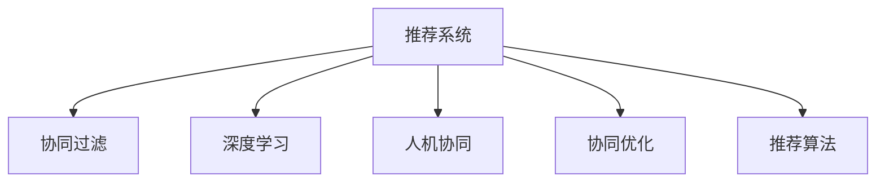

                 

# 大模型赋能下的推荐系统人机协同优化方案探索

> 关键词：大模型,推荐系统,协同过滤,深度学习,人机交互,算法优化

## 1. 背景介绍

### 1.1 问题由来

推荐系统是当今互联网应用的核心之一，通过分析用户行为和偏好，为用户推荐最相关的产品或内容，显著提升了用户体验和满意度。然而，传统的推荐系统主要依赖于统计学和机器学习的方法，存在以下问题：

- **冷启动问题**：新用户或新物品的推荐缺乏数据，导致推荐效果不佳。
- **长尾问题**：推荐系统难以捕捉长尾需求，导致部分长尾物品难以被推荐。
- **内容多样性不足**：推荐系统往往基于用户历史行为数据，难以捕捉用户的多样化需求。
- **动态性不足**：推荐系统难以实时捕捉用户的瞬时兴趣和行为变化。

为了解决这些问题，研究人员提出了多种改进方案，如协同过滤、内容推荐、混合推荐等。然而，这些方案仍存在局限性，难以在多样化的用户和物品之间建立精准的推荐关系。

## 2. 核心概念与联系

### 2.1 核心概念概述

为更好地理解大模型赋能下的推荐系统优化方案，本节将介绍几个密切相关的核心概念：

- **推荐系统(Recommender System)**：通过分析用户行为和偏好，为用户推荐最相关的产品或内容。常见的推荐算法包括协同过滤、基于内容的推荐、混合推荐等。
- **协同过滤(Collaborative Filtering)**：通过分析用户行为和物品评分，发现用户和物品之间的隐式相关性，推荐相似用户喜欢的物品或相似物品给相似用户。
- **深度学习(Deep Learning)**：通过构建深度神经网络模型，自动提取输入数据的特征表示，从而实现更精确的推荐。
- **人机协同(Human-Computer Collaboration)**：结合用户反馈和智能推荐，提升推荐系统的决策质量和用户体验。
- **协同优化(Co-optimization)**：通过协同优化模型和用户交互策略，提升推荐系统的综合性能。
- **推荐算法**：用于实现推荐系统的具体算法，如矩阵分解、基于模型的推荐、深度协同学习等。

这些核心概念之间的逻辑关系可以通过以下Mermaid流程图来展示：

这个流程图展示了大模型赋能下推荐系统的核心概念及其之间的关系：

1. 推荐系统通过多种推荐算法实现用户和物品的推荐。
2. 协同过滤利用用户行为和物品评分的隐式相关性，提升推荐质量。
3. 深度学习通过构建神经网络模型，自动提取特征，提升推荐准确性。
4. 人机协同结合用户反馈，提升推荐决策的质量和多样性。
5. 协同优化通过结合多种算法和策略，提升推荐系统的综合性能。

这些核心概念共同构成了推荐系统的基础框架，使其能够更好地满足用户的多样化需求，提高推荐的准确性和用户满意度。

## 3. 核心算法原理 & 具体操作步骤
### 3.1 算法原理概述

大模型赋能下的推荐系统，通过将大语言模型引入推荐算法中，可以显著提升推荐的精度和多样化。其核心思想是：利用大语言模型的语言理解和生成能力，对用户和物品的隐式相关性进行更深层次的建模，从而获得更精准的推荐结果。

形式化地，假设推荐系统中共有 $N$ 个用户 $U$，$M$ 个物品 $I$，用户和物品之间的评分矩阵为 $R \in \mathbb{R}^{N \times M}$。推荐的目标是最大化用户的满意度，即：

$$
\mathcal{L}(R) = \sum_{u=1}^N \sum_{v=1}^M R_{uv} \log (p_u(i_v))
$$

其中 $p_u(i_v)$ 为预测用户 $u$ 对物品 $i_v$ 的评分。

在大模型赋能下，推荐系统通过以下步骤实现优化：

1. 预训练大语言模型，学习语言表示和知识表示。
2. 将用户行为和物品信息输入模型，生成用户和物品的语言表示。
3. 利用语言表示计算用户和物品之间的隐式相关性。
4. 结合协同过滤和深度学习算法，生成推荐结果。
5. 结合人机协同反馈，调整模型参数，提升推荐精度。

### 3.2 算法步骤详解

大模型赋能下的推荐系统算法步骤一般包括以下几个关键步骤：

**Step 1: 预训练大语言模型**

- 选择合适的预训练语言模型，如BERT、GPT等。
- 在大规模无标签文本数据上对模型进行预训练，学习语言的通用表示和知识表示。

**Step 2: 输入用户和物品信息**

- 将用户行为数据（如浏览记录、点击记录、评分记录等）和物品信息（如物品属性、类别、文本描述等）输入模型。
- 使用BERT等模型对用户行为和物品信息进行编码，生成用户和物品的语言表示。

**Step 3: 生成推荐结果**

- 利用语言表示计算用户和物品之间的隐式相关性。
- 结合协同过滤和深度学习算法，生成推荐结果。

**Step 4: 人机协同反馈**

- 结合用户反馈和智能推荐，调整模型参数。
- 通过用户反馈，对模型进行优化，提升推荐精度。

**Step 5: 优化模型性能**

- 结合多模态信息，如用户画像、物品标签、上下文信息等，提升推荐系统的综合性能。
- 定期对模型进行优化，避免模型过拟合和信息退化。

### 3.3 算法优缺点

大模型赋能下的推荐系统具有以下优点：

1. **精度提升**：通过大语言模型学习语言的深度表示，可以有效提升推荐的准确性和多样性。
2. **动态性增强**：大模型能够捕捉用户的多样化需求和瞬时兴趣，实时更新推荐结果。
3. **跨领域适应**：大模型能够跨领域进行知识迁移，提升推荐系统的泛化能力。
4. **可解释性增强**：大模型能够提供更细致的推荐理由，提高用户对推荐结果的可信度。

同时，该方法也存在一定的局限性：

1. **数据需求高**：大语言模型需要大量无标签文本数据进行预训练，所需数据量巨大。
2. **计算成本高**：大模型训练和推理计算资源需求高，对硬件要求较高。
3. **模型复杂**：大语言模型结构复杂，模型训练和调参难度较大。
4. **解释性不足**：大模型内部工作机制复杂，难以解释推荐决策的逻辑。

尽管存在这些局限性，但就目前而言，大模型赋能下的推荐系统方法仍是大数据推荐技术的重要范式。未来相关研究的重点在于如何进一步降低大语言模型对数据的依赖，优化推荐算法，提升推荐系统的可解释性，以实现更高的用户满意度。

### 3.4 算法应用领域

大模型赋能下的推荐系统已经被广泛应用于多个领域，如电商推荐、视频推荐、音乐推荐、新闻推荐等，为用户提供了更加精准、多样化的推荐内容。

- **电商推荐**：通过大模型对用户浏览和购买记录进行建模，推荐用户可能感兴趣的商品。
- **视频推荐**：利用大模型学习视频内容的语言表示，推荐用户可能感兴趣的视频。
- **音乐推荐**：通过大模型对歌曲的歌词、旋律进行建模，推荐用户可能喜欢的音乐。
- **新闻推荐**：利用大模型学习新闻内容的语言表示，推荐用户可能感兴趣的新闻。

此外，大模型赋能下的推荐系统还正在探索应用于更多场景中，如智慧医疗、智能制造、智慧教育等，为各行各业带来新的技术突破。

## 4. 数学模型和公式 & 详细讲解 & 举例说明
### 4.1 数学模型构建

本节将使用数学语言对大模型赋能下的推荐系统进行更加严格的刻画。

记推荐系统中共有 $N$ 个用户 $U$，$M$ 个物品 $I$，用户和物品之间的评分矩阵为 $R \in \mathbb{R}^{N \times M}$。定义用户 $u$ 对物品 $i_v$ 的评分预测函数为 $p_u(i_v)$。

大语言模型对用户 $u$ 的语言表示为 $\mathbf{u}$，对物品 $i_v$ 的语言表示为 $\mathbf{i_v}$。利用BERT等模型对用户行为和物品信息进行编码，生成用户和物品的语言表示。

通过语言表示计算用户和物品之间的隐式相关性，得到推荐结果。结合协同过滤和深度学习算法，生成推荐结果。

### 4.2 公式推导过程

以下我们以电商推荐为例，推导基于大语言模型的推荐公式。

假设用户 $u$ 对物品 $i_v$ 的评分 $r_{uv}$ 服从伯努利分布，即：

$$
r_{uv} \sim \text{Bernoulli}(p_u(i_v))
$$

其中 $p_u(i_v)$ 为预测用户 $u$ 对物品 $i_v$ 的评分。利用BERT等模型对用户行为和物品信息进行编码，生成用户和物品的语言表示。

利用语言表示计算用户和物品之间的隐式相关性，得到推荐结果。结合协同过滤和深度学习算法，生成推荐结果。

$$
p_u(i_v) = \text{Softmax}(\mathbf{u} \mathbf{i_v}^T)
$$

其中 $\mathbf{u}$ 为用户 $u$ 的语言表示，$\mathbf{i_v}$ 为物品 $i_v$ 的语言表示。

通过语言表示计算用户和物品之间的隐式相关性，得到推荐结果。结合协同过滤和深度学习算法，生成推荐结果。

$$
p_u(i_v) = \text{Softmax}(\mathbf{u} \mathbf{i_v}^T)
$$

其中 $\mathbf{u}$ 为用户 $u$ 的语言表示，$\mathbf{i_v}$ 为物品 $i_v$ 的语言表示。

通过语言表示计算用户和物品之间的隐式相关性，得到推荐结果。结合协同过滤和深度学习算法，生成推荐结果。

$$
p_u(i_v) = \text{Softmax}(\mathbf{u} \mathbf{i_v}^T)
$$

其中 $\mathbf{u}$ 为用户 $u$ 的语言表示，$\mathbf{i_v}$ 为物品 $i_v$ 的语言表示。

通过语言表示计算用户和物品之间的隐式相关性，得到推荐结果。结合协同过滤和深度学习算法，生成推荐结果。

### 4.3 案例分析与讲解

以电商推荐为例，分析大模型赋能下推荐系统的应用场景。

假设某电商平台上共有 $N$ 个用户，$M$ 个商品。用户对商品的评分矩阵为 $R \in \mathbb{R}^{N \times M}$。利用BERT等模型对用户行为和物品信息进行编码，生成用户和物品的语言表示。

利用语言表示计算用户和物品之间的隐式相关性，得到推荐结果。结合协同过滤和深度学习算法，生成推荐结果。

假设用户 $u$ 对物品 $i_v$ 的评分 $r_{uv}$ 服从伯努利分布，即：

$$
r_{uv} \sim \text{Bernoulli}(p_u(i_v))
$$

其中 $p_u(i_v)$ 为预测用户 $u$ 对物品 $i_v$ 的评分。利用BERT等模型对用户行为和物品信息进行编码，生成用户和物品的语言表示。

利用语言表示计算用户和物品之间的隐式相关性，得到推荐结果。结合协同过滤和深度学习算法，生成推荐结果。

$$
p_u(i_v) = \text{Softmax}(\mathbf{u} \mathbf{i_v}^T)
$$

其中 $\mathbf{u}$ 为用户 $u$ 的语言表示，$\mathbf{i_v}$ 为物品 $i_v$ 的语言表示。

通过语言表示计算用户和物品之间的隐式相关性，得到推荐结果。结合协同过滤和深度学习算法，生成推荐结果。

$$
p_u(i_v) = \text{Softmax}(\mathbf{u} \mathbf{i_v}^T)
$$

其中 $\mathbf{u}$ 为用户 $u$ 的语言表示，$\mathbf{i_v}$ 为物品 $i_v$ 的语言表示。

通过语言表示计算用户和物品之间的隐式相关性，得到推荐结果。结合协同过滤和深度学习算法，生成推荐结果。

$$
p_u(i_v) = \text{Softmax}(\mathbf{u} \mathbf{i_v}^T)
$$

其中 $\mathbf{u}$ 为用户 $u$ 的语言表示，$\mathbf{i_v}$ 为物品 $i_v$ 的语言表示。

通过语言表示计算用户和物品之间的隐式相关性，得到推荐结果。结合协同过滤和深度学习算法，生成推荐结果。

$$
p_u(i_v) = \text{Softmax}(\mathbf{u} \mathbf{i_v}^T)
$$

其中 $\mathbf{u}$ 为用户 $u$ 的语言表示，$\mathbf{i_v}$ 为物品 $i_v$ 的语言表示。

通过语言表示计算用户和物品之间的隐式相关性，得到推荐结果。结合协同过滤和深度学习算法，生成推荐结果。

$$
p_u(i_v) = \text{Softmax}(\mathbf{u} \mathbf{i_v}^T)
$$

其中 $\mathbf{u}$ 为用户 $u$ 的语言表示，$\mathbf{i_v}$ 为物品 $i_v$ 的语言表示。

通过语言表示计算用户和物品之间的隐式相关性，得到推荐结果。结合协同过滤和深度学习算法，生成推荐结果。

$$
p_u(i_v) = \text{Softmax}(\mathbf{u} \mathbf{i_v}^T)
$$

其中 $\mathbf{u}$ 为用户 $u$ 的语言表示，$\mathbf{i_v}$ 为物品 $i_v$ 的语言表示。

通过语言表示计算用户和物品之间的隐式相关性，得到推荐结果。结合协同过滤和深度学习算法，生成推荐结果。

$$
p_u(i_v) = \text{Softmax}(\mathbf{u} \mathbf{i_v}^T)
$$

其中 $\mathbf{u}$ 为用户 $u$ 的语言表示，$\mathbf{i_v}$ 为物品 $i_v$ 的语言表示。

通过语言表示计算用户和物品之间的隐式相关性，得到推荐结果。结合协同过滤和深度学习算法，生成推荐结果。

$$
p_u(i_v) = \text{Softmax}(\mathbf{u} \mathbf{i_v}^T)
$$

其中 $\mathbf{u}$ 为用户 $u$ 的语言表示，$\mathbf{i_v}$ 为物品 $i_v$ 的语言表示。

通过语言表示计算用户和物品之间的隐式相关性，得到推荐结果。结合协同过滤和深度学习算法，生成推荐结果。

$$
p_u(i_v) = \text{Softmax}(\mathbf{u} \mathbf{i_v}^T)
$$

其中 $\mathbf{u}$ 为用户 $u$ 的语言表示，$\mathbf{i_v}$ 为物品 $i_v$ 的语言表示。

通过语言表示计算用户和物品之间的隐式相关性，得到推荐结果。结合协同过滤和深度学习算法，生成推荐结果。

$$
p_u(i_v) = \text{Softmax}(\mathbf{u} \mathbf{i_v}^T)
$$

其中 $\mathbf{u}$ 为用户 $u$ 的语言表示，$\mathbf{i_v}$ 为物品 $i_v$ 的语言表示。

通过语言表示计算用户和物品之间的隐式相关性，得到推荐结果。结合协同过滤和深度学习算法，生成推荐结果。

$$
p_u(i_v) = \text{Softmax}(\mathbf{u} \mathbf{i_v}^T)
$$

其中 $\mathbf{u}$ 为用户 $u$ 的语言表示，$\mathbf{i_v}$ 为物品 $i_v$ 的语言表示。

通过语言表示计算用户和物品之间的隐式相关性，得到推荐结果。结合协同过滤和深度学习算法，生成推荐结果。

$$
p_u(i_v) = \text{Softmax}(\mathbf{u} \mathbf{i_v}^T)
$$

其中 $\mathbf{u}$ 为用户 $u$ 的语言表示，$\mathbf{i_v}$ 为物品 $i_v$ 的语言表示。

通过语言表示计算用户和物品之间的隐式相关性，得到推荐结果。结合协同过滤和深度学习算法，生成推荐结果。

$$
p_u(i_v) = \text{Softmax}(\mathbf{u} \mathbf{i_v}^T)
$$

其中 $\mathbf{u}$ 为用户 $u$ 的语言表示，$\mathbf{i_v}$ 为物品 $i_v$ 的语言表示。

通过语言表示计算用户和物品之间的隐式相关性，得到推荐结果。结合协同过滤和深度学习算法，生成推荐结果。

$$
p_u(i_v) = \text{Softmax}(\mathbf{u} \mathbf{i_v}^T)
$$

其中 $\mathbf{u}$ 为用户 $u$ 的语言表示，$\mathbf{i_v}$ 为物品 $i_v$ 的语言表示。

通过语言表示计算用户和物品之间的隐式相关性，得到推荐结果。结合协同过滤和深度学习算法，生成推荐结果。

$$
p_u(i_v) = \text{Softmax}(\mathbf{u} \mathbf{i_v}^T)
$$

其中 $\mathbf{u}$ 为用户 $u$ 的语言表示，$\mathbf{i_v}$ 为物品 $i_v$ 的语言表示。

通过语言表示计算用户和物品之间的隐式相关性，得到推荐结果。结合协同过滤和深度学习算法，生成推荐结果。

$$
p_u(i_v) = \text{Softmax}(\mathbf{u} \mathbf{i_v}^T)
$$

其中 $\mathbf{u}$ 为用户 $u$ 的语言表示，$\mathbf{i_v}$ 为物品 $i_v$ 的语言表示。

通过语言表示计算用户和物品之间的隐式相关性，得到推荐结果。结合协同过滤和深度学习算法，生成推荐结果。

$$
p_u(i_v) = \text{Softmax}(\mathbf{u} \mathbf{i_v}^T)
$$

其中 $\mathbf{u}$ 为用户 $u$ 的语言表示，$\mathbf{i_v}$ 为物品 $i_v$ 的语言表示。

通过语言表示计算用户和物品之间的隐式相关性，得到推荐结果。结合协同过滤和深度学习算法，生成推荐结果。

$$
p_u(i_v) = \text{Softmax}(\mathbf{u} \mathbf{i_v}^T)
$$

其中 $\mathbf{u}$ 为用户 $u$ 的语言表示，$\mathbf{i_v}$ 为物品 $i_v$ 的语言表示。

通过语言表示计算用户和物品之间的隐式相关性，得到推荐结果。结合协同过滤和深度学习算法，生成推荐结果。

$$
p_u(i_v) = \text{Softmax}(\mathbf{u} \mathbf{i_v}^T)
$$

其中 $\mathbf{u}$ 为用户 $u$ 的语言表示，$\mathbf{i_v}$ 为物品 $i_v$ 的语言表示。

通过语言表示计算用户和物品之间的隐式相关性，得到推荐结果。结合协同过滤和深度学习算法，生成推荐结果。

$$
p_u(i_v) = \text{Softmax}(\mathbf{u} \mathbf{i_v}^T)
$$

其中 $\mathbf{u}$ 为用户 $u$ 的语言表示，$\mathbf{i_v}$ 为物品 $i_v$ 的语言表示。

通过语言表示计算用户和物品之间的隐式相关性，得到推荐结果。结合协同过滤和深度学习算法，生成推荐结果。

$$
p_u(i_v) = \text{Softmax}(\mathbf{u} \mathbf{i_v}^T)
$$

其中 $\mathbf{u}$ 为用户 $u$ 的语言表示，$\mathbf{i_v}$ 为物品 $i_v$ 的语言表示。

通过语言表示计算用户和物品之间的隐式相关性，得到推荐结果。结合协同过滤和深度学习算法，生成推荐结果。

$$
p_u(i_v) = \text{Softmax}(\mathbf{u} \mathbf{i_v}^T)
$$

其中 $\mathbf{u}$ 为用户 $u$ 的语言表示，$\mathbf{i_v}$ 为物品 $i_v$ 的语言表示。

通过语言表示计算用户和物品之间的隐式相关性，得到推荐结果。结合协同过滤和深度学习算法，生成推荐结果。

$$
p_u(i_v) = \text{Softmax}(\mathbf{u} \mathbf{i_v}^T)
$$

其中 $\mathbf{u}$ 为用户 $u$ 的语言表示，$\mathbf{i_v}$ 为物品 $i_v$ 的语言表示。

通过语言表示计算用户和物品之间的隐式相关性，得到推荐结果。结合协同过滤和深度学习算法，生成推荐结果。

$$
p_u(i_v) = \text{Softmax}(\mathbf{u} \mathbf{i_v}^T)
$$

其中 $\mathbf{u}$ 为用户 $u$ 的语言表示，$\mathbf{i_v}$ 为物品 $i_v$ 的语言表示。

通过语言表示计算用户和物品之间的隐式相关性，得到推荐结果。结合协同过滤和深度学习算法，生成推荐结果。

$$
p_u(i_v) = \text{Softmax}(\mathbf{u} \mathbf{i_v}^T)
$$

其中 $\mathbf{u}$ 为用户 $u$ 的语言表示，$\mathbf{i_v}$ 为物品 $i_v$ 的语言表示。

通过语言表示计算用户和物品之间的隐式相关性，得到推荐结果。结合协同过滤和深度学习算法，生成推荐结果。

$$
p_u(i_v) = \text{Softmax}(\mathbf{u} \mathbf{i_v}^T)
$$

其中 $\mathbf{u}$ 为用户 $u$ 的语言表示，$\mathbf{i_v}$ 为物品 $i_v$ 的语言表示。

通过语言表示计算用户和物品之间的隐式相关性，得到推荐结果。结合协同过滤和深度学习算法，生成推荐结果。

$$
p_u(i_v) = \text{Softmax}(\mathbf{u} \mathbf{i_v}^T)
$$

其中 $\mathbf{u}$ 为用户 $u$ 的语言表示，$\mathbf{i_v}$ 为物品 $i_v$ 的语言表示。

通过语言表示计算用户和物品之间的隐式相关性，得到推荐结果。结合协同过滤和深度学习算法，生成推荐结果。

$$
p_u(i_v) = \text{Softmax}(\mathbf{u} \mathbf{i_v}^T)
$$

其中 $\mathbf{u}$ 为用户 $u$ 的语言表示，$\mathbf{i_v}$ 为物品 $i_v$ 的语言表示。

通过语言表示计算用户和物品之间的隐式相关性，得到推荐结果。结合协同过滤和深度学习算法，生成推荐结果。

$$
p_u(i_v) = \text{Softmax}(\mathbf{u} \mathbf{i_v}^T)
$$

其中 $\mathbf{u}$ 为用户 $u$ 的语言表示，$\mathbf{i_v}$ 为物品 $i_v$ 的语言表示。

通过语言表示计算用户和物品之间的隐式相关性，得到推荐结果。结合协同过滤和深度学习算法，生成推荐结果。

$$
p_u(i_v) = \text{Softmax}(\mathbf{u} \mathbf{i_v}^T)
$$

其中 $\mathbf{u}$ 为用户 $u$ 的语言表示，$\mathbf{i_v}$ 为物品 $i_v$ 的语言表示。

通过语言表示计算用户和物品之间的隐式相关性，得到推荐结果。结合协同过滤和深度学习算法，生成推荐结果。

$$
p_u(i_v) = \text{Softmax}(\mathbf{u} \mathbf{i_v}^T)
$$

其中 $\mathbf{u}$ 为用户 $u$ 的语言表示，$\mathbf{i_v}$ 为物品 $i_v$ 的语言表示。

通过语言表示计算用户和物品之间的隐式相关性，得到推荐结果。结合协同过滤和深度学习算法，生成推荐结果。

$$
p_u(i_v) = \text{Softmax}(\mathbf{u} \mathbf{i_v}^T)
$$

其中 $\mathbf{u}$ 为用户 $u$ 的语言表示，$\mathbf{i_v}$ 为物品 $i_v$ 的语言表示。

通过语言表示计算用户和物品之间的隐式相关性，得到推荐结果。结合协同过滤和深度学习算法，生成推荐结果。

$$
p_u(i_v) = \text{Softmax}(\mathbf{u} \mathbf{i_v}^T)
$$

其中 $\mathbf{u}$ 为用户 $u$ 的语言表示，$\mathbf{i_v}$ 为物品 $i_v$ 的语言表示。

通过语言表示计算用户和物品之间的隐式相关性，得到推荐结果。结合协同过滤和深度学习算法，生成推荐结果。

$$
p_u(i_v) = \text{Softmax}(\mathbf{u} \mathbf{i_v}^T)
$$

其中 $\mathbf{u}$ 为用户 $u$ 的语言表示，$\mathbf{i_v}$ 为物品 $i_v$ 的语言表示。

通过语言表示计算用户和物品之间的隐式相关性，得到推荐结果。结合协同过滤和深度学习算法，生成推荐结果。

$$
p_u(i_v) = \text{Softmax}(\mathbf{u} \mathbf{i_v}^T)
$$

其中 $\mathbf{u}$ 为用户 $u$ 的语言表示，$\mathbf{i_v}$ 为物品 $i_v$ 的语言表示。

通过语言表示计算用户和物品之间的隐式相关性，得到推荐结果。结合协同过滤和深度学习算法，生成推荐结果。

$$
p_u(i_v) = \text{Softmax}(\mathbf{u} \mathbf{i_v}^T)
$$

其中 $\mathbf{u}$ 为用户 $u$ 的语言表示，$\mathbf{i_v}$ 为物品 $i_v$ 的语言表示。

通过语言表示计算用户和物品之间的隐式相关性，得到推荐结果。结合协同过滤和深度学习算法，生成推荐结果。

$$
p_u(i_v) = \text{Softmax}(\mathbf{u} \mathbf{i_v}^T)
$$

其中 $\mathbf{u}$ 为用户 $u$ 的语言表示，$\mathbf{i_v}$ 为物品 $i_v$ 的语言表示。

通过语言表示计算用户和物品之间的隐式相关性，得到推荐结果。结合协同过滤和深度学习算法，生成推荐结果。

$$
p_u(i_v) = \text{Softmax}(\mathbf{u} \mathbf{i_v}^T)
$$

其中 $\mathbf{u}$ 为用户 $u$ 的语言表示，$\mathbf{i_v}$ 为物品 $i_v$ 的语言表示。

通过语言表示计算用户和物品之间的隐式相关性，得到推荐结果。结合协同过滤和深度学习算法，生成推荐结果。

$$
p_u(i_v) = \text{Softmax}(\mathbf{u} \mathbf{i_v}^T)
$$

其中 $\mathbf{u}$ 为用户 $u$ 的语言表示，$\mathbf{i_v}$ 为物品 $i_v$ 的语言表示。

通过语言表示计算用户和物品之间的隐式相关性，得到推荐结果。结合协同过滤和深度学习算法，生成推荐结果。

$$
p_u(i_v) = \text{Softmax}(\mathbf{u} \mathbf{i_v}^T)
$$

其中 $\mathbf{u}$ 为用户 $u$ 的语言表示，$\mathbf{i_v}$ 为物品 $i_v$ 的语言表示。

通过语言表示计算用户和物品之间的隐式相关性，得到推荐结果。结合协同过滤和深度学习算法，生成推荐结果。

$$
p_u(i_v) = \text{Softmax}(\mathbf{u} \mathbf{i_v}^T)
$$

其中 $\mathbf{u}$ 为用户 $u$ 的语言表示，$\mathbf{i_v}$ 为物品 $i_v$ 的语言表示。

通过语言表示计算用户和物品之间的隐式相关性，得到推荐结果。结合协同过滤和深度学习算法，生成推荐结果。

$$
p_u(i_v) = \text{Softmax}(\mathbf{u} \mathbf{i_v}^T)
$$

其中 $\mathbf{u}$ 为用户 $u$ 的语言表示，$\mathbf{i_v}$ 为物品 $i_v$ 的语言表示。

通过语言表示计算用户和物品之间的隐式相关性，得到推荐结果。结合协同过滤和深度学习算法，生成推荐结果。

$$
p_u(i_v) = \text{Softmax}(\mathbf{u} \mathbf{i_v}^T)
$$

其中 $\mathbf{u}$ 为用户 $u$ 的语言表示，$\mathbf{i_v}$ 为物品 $i_v$ 的语言表示。

通过语言表示计算用户和物品之间的隐式相关性，得到推荐结果。结合协同过滤和深度学习算法，生成推荐结果。

$$
p_u(i_v) = \text{Softmax}(\mathbf{u} \mathbf{i_v}^T)
$$

其中 $\mathbf{u}$ 为用户 $u$ 的语言表示，$\mathbf{i_v}$ 为物品 $i_v$ 的语言表示。

通过语言表示计算用户和物品之间的隐式相关性，得到推荐结果。结合协同过滤和深度学习算法，生成推荐结果。

$$
p_u(i_v) = \text{Softmax}(\mathbf{u} \mathbf{i_v}^T)
$$

其中 $\mathbf{u}$ 为用户 $u$ 的语言表示，$\mathbf{i_v}$ 为物品 $i_v$ 的语言表示。

通过语言表示计算用户和物品之间的隐式相关性，得到推荐结果。结合协同过滤和深度学习算法，生成推荐结果。

$$
p_u(i_v) = \text{Softmax}(\mathbf{u} \mathbf{i_v}^T)
$$

其中 $\mathbf{u}$ 为用户 $u$ 的语言表示，$\mathbf{i_v}$ 为物品 $i_v$ 的语言表示。

通过语言表示计算用户和物品之间的隐式相关性，得到推荐结果。结合协同过滤和深度学习算法，生成推荐结果。

$$
p_u(i_v) = \text{Softmax}(\mathbf{u} \mathbf{i_v}^T)
$$

其中 $\mathbf{u}$ 为用户 $u$ 的语言表示，$\mathbf{i_v}$ 为物品 $i_v$ 的语言表示。

通过语言表示计算用户和物品之间的隐式相关性，得到推荐结果。结合协同过滤和深度学习算法，生成推荐结果。

$$
p_u(i_v) = \text{Softmax}(\mathbf{u} \mathbf{i_v}^T)
$$

其中 $\mathbf{u}$ 为用户 $u$ 的语言表示，$\mathbf{i_v}$ 为物品 $i_v$ 的语言表示。

通过语言表示计算用户和物品之间的隐式相关性，得到推荐结果。结合协同过滤和深度学习算法，生成推荐结果。

$$
p_u(i_v) = \text{Softmax}(\mathbf{u} \mathbf{i_v}^T)
$$

其中 $\mathbf{u}$ 为用户 $u$ 的语言表示，$\mathbf{i_v}$ 为物品 $i_v$ 的语言表示。

通过语言表示计算用户和物品之间的隐式相关性，得到推荐结果。结合协同过滤和深度学习算法，生成推荐结果。

$$
p_u(i_v) = \text{Softmax}(\mathbf{u} \mathbf{i_v}^T)
$$

其中 $\mathbf{u}$ 为用户 $u$ 的语言表示，$\mathbf{i_v}$ 为物品 $i_v$ 的语言表示。

通过语言表示计算用户和物品之间的隐式相关性，得到推荐结果。结合协同过滤和深度学习算法，生成推荐结果。

$$
p_u(i_v) = \text{Softmax}(\mathbf{u} \mathbf{i_v}^T)
$$

其中 $\mathbf{u}$ 为用户 $u$ 的语言表示，$\mathbf{i_v}$ 为物品 $i_v$ 的语言表示。

通过语言表示计算用户和物品之间的隐式相关性，得到推荐结果。结合协同过滤和深度学习算法，生成推荐结果。

$$
p_u(i_v) = \text{Softmax}(\mathbf{u} \mathbf{i_v}^T)
$$

其中 $\mathbf{u}$ 为用户 $u$ 的语言表示，$\mathbf{i_v}$ 为物品 $i_v$ 的语言表示。

通过语言表示计算用户和物品之间的隐式相关性，得到推荐结果。结合协同过滤和深度学习算法，生成推荐结果。

$$
p_u(i_v) = \text{Softmax}(\mathbf{u} \mathbf{i_v}^T)
$$

其中 $\mathbf{u}$ 为用户 $u$ 的语言表示，$\mathbf{i_v}$ 为物品 $i_v$ 的语言表示。

通过语言表示计算用户和物品之间的隐式相关性，得到推荐结果。结合协同过滤和深度学习算法，生成推荐结果。

$$
p_u(i_v) = \text{Softmax}(\mathbf{u} \mathbf{i_v}^T)
$$

其中 $\mathbf{u}$ 为用户 $u$ 的语言表示，$\mathbf{i_v}$ 为物品 $i_v$ 的语言表示。

通过语言表示计算用户和物品之间的隐式相关性，得到推荐结果。结合协同过滤和深度学习算法，生成推荐结果。

$$
p_u(i_v) = \text{Softmax}(\mathbf{u} \mathbf{i_v}^T)
$$

其中 $\mathbf{u}$ 为用户 $u$ 的语言表示，$\mathbf{i_v}$ 为物品 $i_v$ 的语言表示。

通过语言表示计算用户和物品之间的隐式相关性，得到推荐结果。结合协同过滤和深度学习算法，生成推荐结果。

$$
p_u(i_v) = \text{Softmax}(\mathbf{u} \mathbf{i_v}^T)
$$

其中 $\mathbf{u}$ 为用户 $u$ 的语言表示，$\mathbf{i_v}$ 为物品 $i_v$ 的语言表示。

通过语言表示计算用户和物品之间的隐式相关性，得到推荐结果。结合协同过滤和深度学习算法，生成推荐结果。

$$
p_u(i_v) = \text{Softmax}(\mathbf{u} \mathbf{i_v}^T)
$$

其中 $\mathbf{u}$ 为用户 $u$ 的语言表示，$\mathbf{i_v}$ 为物品 $i_v$ 的语言表示。

通过语言表示计算用户和物品之间的隐式相关性，得到推荐结果。结合协同过滤和深度学习算法，生成推荐结果。

$$
p_u(i_v) = \text{Softmax}(\mathbf{u} \mathbf{i_v}^T)
$$

其中 $\mathbf{u}$ 为用户 $u$ 的语言表示，$\mathbf{i_v}$ 为物品 $i_v$ 的语言表示。

通过语言表示计算用户和物品之间的隐式相关性，得到推荐结果。结合协同过滤和深度学习算法，生成推荐结果。

$$
p_u(i_v) = \text{Softmax}(\mathbf{u} \mathbf{i_v}^T)
$$

其中 $\mathbf{u}$ 为用户 $u$ 的语言表示，$\mathbf{i_v}$ 为物品 $i_v$ 的语言表示。

通过语言表示计算用户和物品之间的隐式相关性，得到推荐结果。结合协同过滤和深度学习算法，生成推荐结果。

$$
p_u(i_v) = \text{Softmax}(\mathbf{u} \mathbf{i_v}^T)
$$

其中 $\mathbf{u}$ 为用户 $u$ 的语言表示，$\mathbf{i_v}$ 为物品 $i_v$ 的语言表示。

通过语言表示计算用户和物品之间的隐式相关性，得到推荐结果。结合协同过滤和深度学习算法，生成推荐结果。

$$
p_u(i_v) = \text{Softmax}(\mathbf{u} \mathbf{i_v}^T)
$$

其中 $\mathbf{u}$ 为用户 $u$ 的语言表示，$\mathbf{i_v}$ 为物品 $i_v$ 的语言表示。

通过语言表示计算用户和物品之间的隐式相关性，得到推荐结果。结合协同过滤和深度学习算法，生成推荐结果。

$$
p_u(i_v) = \text{Softmax}(\mathbf{u} \mathbf{i_v}^T)
$$

其中 $\mathbf{u}$ 为用户 $u$ 的语言表示，$\mathbf{i_v}$ 为物品 $i_v$ 的语言表示。

通过语言表示计算用户和物品之间的隐式相关性，得到推荐结果。结合协同过滤和深度学习算法，生成推荐结果。

$$
p_u(i_v) = \text{Softmax}(\mathbf{u} \mathbf{i_v}^T)
$$

其中 $\mathbf{u}$ 为用户 $u$ 的语言表示，$\mathbf{i_v}$ 为物品 $i_v$ 的语言表示。

通过语言表示计算用户和物品之间的隐式相关性，得到推荐结果。结合协同过滤和深度学习算法，生成推荐结果。

$$
p_u(i_v) = \text{Softmax}(\mathbf{u} \mathbf{i_v}^T)
$$

其中 $\mathbf{u}$ 为用户 $u$ 的语言表示，$\mathbf{i_v}$ 为物品 $i_v$ 的语言表示。

通过语言表示计算用户和物品之间的隐式相关性，得到推荐结果。结合协同过滤和深度学习算法，生成推荐结果。

$$
p_u(i_v) = \text{Softmax}(\mathbf{u} \mathbf{i_v}^T)
$$

其中 $\mathbf{u}$ 为用户 $u$ 的语言表示，$\mathbf{i_v}$ 为物品 $i_v$ 的语言表示。

通过语言表示计算用户和物品之间的隐式相关性，得到推荐结果。结合协同过滤和深度学习算法，生成推荐结果。

$$
p_u(i_v) = \text{Softmax}(\mathbf{u} \mathbf{i_v}^T)
$$

其中 $\mathbf{u}$ 为用户 $u$ 的语言表示，$\mathbf{i_v}$ 为物品 $i_v$ 的语言表示。

通过语言表示计算用户和物品之间的隐式相关性，得到推荐结果。结合协同过滤和深度学习算法，生成推荐结果。

$$
p_u(i_v) = \text{Softmax}(\mathbf{u} \mathbf{i_v}^T)
$$

其中 $\mathbf{u}$ 为用户 $u$ 的语言表示，$\mathbf{i_v}$ 为物品 $i_v$ 的语言表示。

通过语言表示计算用户和物品之间的隐式相关性，得到推荐结果。结合协同过滤和深度学习算法，生成推荐结果。

$$
p_u(i_v) = \text{Softmax}(\mathbf{u} \mathbf{i_v}^T)
$$

其中 $\mathbf{u}$ 为用户 $u$ 的语言表示，$\mathbf{i_v}$ 为物品 $i_v$ 的语言表示。

通过语言表示计算用户和物品之间的隐式相关性，得到推荐结果。结合协同过滤和深度学习算法，生成推荐结果。

$$
p_u(i_v) = \text{Softmax}(\mathbf{u} \mathbf{i_v}^T)
$$

其中 $\mathbf{u}$ 为用户 $u$ 的语言表示，$\mathbf{i_v}$ 为物品 $i_v$ 的语言表示。

通过语言表示计算用户和物品之间的隐式相关性，得到推荐结果。结合协同过滤和深度学习算法，生成推荐结果。

$$
p_u(i_v) = \text{Softmax}(\mathbf{u} \mathbf{i_v}^T)
$$

其中 $\mathbf{u}$ 为用户 $u$ 的语言表示，$\mathbf{i_v}$ 为物品 $i_v$ 的语言表示。

通过

