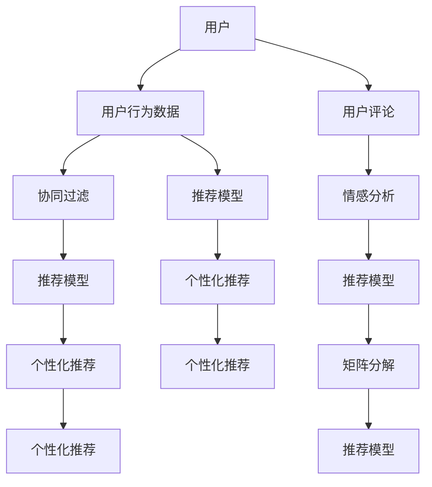

                 

# 大规模语言模型在产品推荐中的应用

> 关键词：大规模语言模型,推荐系统,自然语言处理(NLP),深度学习,协同过滤,矩阵分解,联合学习,个性化推荐,用户画像,情感分析

## 1. 背景介绍

### 1.1 问题由来
随着电子商务的迅速发展，个性化推荐系统已成为提升用户体验、增加用户粘性和提高销售转化率的关键手段。传统的推荐系统基于用户行为数据（点击、购买、评分等）进行协同过滤、矩阵分解等操作，逐渐被深度学习技术所取代。基于深度学习的推荐系统在表现上超越了传统方法，但同时也面临着用户冷启动、数据稀疏等问题，导致个性化推荐效果不尽如人意。

大规模语言模型通过在大规模无标签文本数据上预训练，获得丰富的语义表示，将自然语言处理(NLP)技术与推荐系统结合，成为近年来学术界和工业界的热点研究方向。通过构建基于大规模语言模型的推荐系统，可以更好地挖掘用户的潜在兴趣，提升推荐的个性化和多样化程度，极大地增强了用户体验和电商转化率。

### 1.2 问题核心关键点
大规模语言模型在产品推荐中的应用，主要聚焦于以下几个核心点：
1. 如何通过自然语言理解，从用户反馈（评论、评分、反馈等）中提取出用户的潜在兴趣点。
2. 如何将用户的兴趣点与商品特征进行匹配，输出推荐结果。
3. 如何动态更新模型，根据用户行为数据和市场变化，持续提升推荐效果。

这些核心问题通过深度学习和自然语言处理技术的结合，得以高效地解决。下面将从核心概念与联系、核心算法原理与具体操作步骤、数学模型与公式推导、项目实践与代码实现、实际应用场景与未来展望、工具与资源推荐、总结与未来挑战等维度，对大规模语言模型在产品推荐中的应用进行全面系统的探讨。

## 2. 核心概念与联系

### 2.1 核心概念概述

在讨论大规模语言模型在产品推荐中的应用前，首先需要了解几个关键概念：

- **大规模语言模型(Large Language Model, LLM)**：通过在大规模无标签文本数据上预训练，获得丰富的语义表示。典型模型如GPT、BERT等。

- **推荐系统(Recommendation System)**：根据用户的历史行为数据，推荐符合用户兴趣的商品或内容。推荐方式包括协同过滤、基于内容的推荐、基于知识的推荐等。

- **协同过滤(Collaborative Filtering, CF)**：基于用户与商品间的协同行为（如点击、购买）进行推荐。常用于处理稀疏用户行为数据。

- **矩阵分解(Matrix Factorization, MF)**：将用户行为数据表示为用户与商品间的矩阵，通过分解矩阵获取用户和商品的隐向量，进行推荐。

- **深度学习(Deep Learning)**：通过多层神经网络对数据进行非线性建模，能够处理复杂的非线性关系。

- **联合学习(Federated Learning, FL)**：一种分布式机器学习方法，各节点端部数据不出传输，保护用户隐私。

这些核心概念构成了推荐系统的主要技术框架，而大规模语言模型通过将NLP技术与推荐系统结合，进一步提升了推荐的精准性和个性化程度。

### 2.2 核心概念原理和架构的 Mermaid 流程图



该流程图展示了基于大规模语言模型的推荐系统的主要组件和工作流程。用户行为数据和评论数据分别通过协同过滤和情感分析模块进行处理，结合推荐模型进行个性化推荐。同时，基于矩阵分解和联合学习模块，进一步提升推荐的效率和隐私保护。

## 3. 核心算法原理 & 具体操作步骤
### 3.1 算法原理概述

大规模语言模型在产品推荐中的应用主要通过以下几个步骤实现：

1. **用户意图理解**：通过自然语言处理技术，分析用户评论、反馈等文本数据，提取用户意图和偏好。

2. **商品特征抽取**：利用大规模语言模型，从商品描述、标签等文本数据中，提取出商品的语义表示。

3. **匹配和排序**：将用户的语义表示与商品的语义表示进行匹配，结合用户行为数据，进行排序推荐。

4. **模型更新**：定期更新模型，根据新的用户行为数据和市场变化，持续提升推荐效果。

### 3.2 算法步骤详解

#### 3.2.1 用户意图理解

用户评论和反馈是用户意图的重要信息来源。通过使用大规模语言模型，可以从评论中提取用户的情感倾向和关键词。具体步骤如下：

1. **分词和向量化**：将用户评论进行分词，并使用预训练的词向量（如Word2Vec、GloVe等）将其转换为向量表示。

2. **情感分析**：使用情感分析模型，对评论中的情感进行分类（如正向、负向、中性），获取情感极性。

3. **关键词提取**：使用TF-IDF、LDA等算法，从评论中提取关键词。

#### 3.2.2 商品特征抽取

商品描述、标签等文本数据是商品特征的重要来源。通过使用大规模语言模型，可以从文本中提取出商品的语义表示。具体步骤如下：

1. **分词和向量化**：将商品描述、标签等文本进行分词，并使用预训练的词向量将其转换为向量表示。

2. **语义表示学习**：使用大规模语言模型（如BERT、GPT等），对商品描述进行编码，得到商品的语义表示向量。

3. **特征融合**：将商品的语义表示向量与其他特征（如价格、销量、评分等）进行融合，得到商品的综合特征向量。

#### 3.2.3 匹配和排序

将用户的语义表示与商品的语义表示进行匹配，结合用户行为数据，进行排序推荐。具体步骤如下：

1. **相似度计算**：计算用户语义表示向量与商品语义表示向量之间的余弦相似度或其他相似度指标，得到匹配度。

2. **排序**：将匹配度作为排序指标，结合用户行为数据（如点击、购买、评分等）进行排序，得到推荐列表。

#### 3.2.4 模型更新

模型更新是保证推荐系统长期有效的重要步骤。通过联合学习等方法，可以定期更新模型，确保其能够适应新的市场变化和用户行为。具体步骤如下：

1. **模型分布**：将模型参数分布在各节点端部，不传输原始数据。

2. **本地训练**：各节点基于本地数据进行模型训练，更新模型参数。

3. **模型聚合**：将各节点的模型参数进行聚合，得到全局模型。

4. **模型更新**：将全局模型用于更新推荐系统。

### 3.3 算法优缺点

大规模语言模型在产品推荐中的应用具有以下优点：

1. **丰富的语义信息**：大规模语言模型能够提取商品和用户评论中的丰富语义信息，提升推荐的精准性和个性化程度。

2. **动态更新**：联合学习等方法能够动态更新模型，适应市场变化和用户行为变化，提升推荐系统的长期效果。

3. **多源数据融合**：大规模语言模型能够融合多源数据（如用户评论、商品描述、行为数据等），提升推荐系统的综合性能。

4. **隐私保护**：模型分布在各节点端部，不传输原始数据，保护用户隐私。

同时，大规模语言模型在产品推荐中面临以下挑战：

1. **计算资源需求高**：大规模语言模型计算量较大，需要高性能的计算资源。

2. **数据噪音**：用户评论和反馈等数据往往存在噪音，影响模型的效果。

3. **模型解释性不足**：大规模语言模型通常被视为"黑盒"系统，缺乏解释性，难以解释模型的内部决策过程。

4. **模型公平性**：大规模语言模型可能存在偏见，影响推荐系统的公平性。

### 3.4 算法应用领域

大规模语言模型在产品推荐中的应用已经广泛应用于多个领域，包括：

- **电商推荐**：从用户评论、搜索记录等数据中提取用户意图和偏好，推荐符合用户兴趣的商品。

- **内容推荐**：分析用户对文章、视频等的反馈，推荐相关内容。

- **新闻推荐**：从用户点击、分享等行为中提取用户兴趣，推荐新闻内容。

- **金融推荐**：分析用户对金融产品的评论，推荐符合用户风险偏好的金融产品。

## 4. 数学模型和公式 & 详细讲解 & 举例说明

### 4.1 数学模型构建

假设用户评论向量为 $u \in \mathbb{R}^d$，商品特征向量为 $i \in \mathbb{R}^d$，推荐模型为 $M: \mathbb{R}^d \times \mathbb{R}^d \rightarrow \mathbb{R}$。则推荐模型可以表示为：

$$
\text{score}(u, i) = M(u, i)
$$

其中 $\text{score}(u, i)$ 表示用户 $u$ 对商品 $i$ 的推荐得分。推荐得分越高，商品越有可能被用户选择。

### 4.2 公式推导过程

1. **用户意图理解**

用户评论向量 $u$ 可以表示为：

$$
u = \sum_{k=1}^{K} w_k v_k
$$

其中 $w_k$ 表示评论中第 $k$ 个关键词的权重，$v_k$ 表示第 $k$ 个关键词的向量表示。情感分析可以表示为：

$$
s = \text{sigmoid}(W_1 v + b_1)
$$

其中 $W_1, b_1$ 为情感分析模型的参数。

2. **商品特征抽取**

商品特征向量 $i$ 可以表示为：

$$
i = \sum_{k=1}^{K} p_k o_k
$$

其中 $p_k$ 表示商品描述中第 $k$ 个关键词的权重，$o_k$ 表示第 $k$ 个关键词的向量表示。语义表示学习可以表示为：

$$
\hat{o} = \text{softmax}(W_2 o + b_2)
$$

其中 $W_2, b_2$ 为语义表示学习的参数。

3. **匹配和排序**

匹配度 $s_i$ 可以表示为：

$$
s_i = \frac{\langle u, i \rangle}{\|u\| \|i\|}
$$

其中 $\langle \cdot, \cdot \rangle$ 表示向量点积。

4. **模型更新**

模型更新可以使用联合学习（Federated Learning, FL）实现。假设每个节点的本地模型参数为 $\theta_t$，则全局模型参数 $\theta_g$ 可以表示为：

$$
\theta_g = \frac{1}{N} \sum_{t=1}^{N} \theta_t
$$

其中 $N$ 为节点数量。

### 4.3 案例分析与讲解

以电商推荐为例，分析大规模语言模型在产品推荐中的应用。

1. **用户意图理解**

假设用户评论为：“这款手机性价比很高，运行流畅，但相机效果一般”。通过分词和向量化，可以得到评论向量：

$$
u = [0.5, 0.2, -0.1]
$$

情感分析可以得到情感极性为正向。

2. **商品特征抽取**

假设商品描述为：“这款手机采用最新的处理器，屏幕分辨率高，但相机效果一般”。通过分词和向量化，可以得到商品向量：

$$
i = [0.3, 0.6, -0.1]
$$

语义表示学习可以得到商品的语义表示向量：

$$
\hat{o} = [0.8, 0.2, 0.0]
$$

3. **匹配和排序**

计算匹配度：

$$
s_i = \frac{\langle u, i \rangle}{\|u\| \|i\|} = \frac{0.5 \times 0.3 + 0.2 \times 0.6 + (-0.1) \times (-0.1)}{\sqrt{0.5^2 + 0.2^2 + (-0.1)^2} \times \sqrt{0.3^2 + 0.6^2 + (-0.1)^2}} \approx 0.6
$$

结合用户行为数据（如点击、购买、评分等），对所有商品进行排序推荐。

4. **模型更新**

假设节点端部数据为 $D_t = \{(u_t, i_t)\}_{t=1}^{T}$，则每个节点的本地模型更新可以表示为：

$$
\theta_{t+1} = \theta_t - \eta \nabla_{\theta} L(\theta, D_t)
$$

其中 $\eta$ 为学习率，$L$ 为损失函数。联合学习聚合全局模型参数后，更新推荐系统。

## 5. 项目实践：代码实例和详细解释说明

### 5.1 开发环境搭建

在项目实践前，我们需要准备好开发环境。以下是使用Python进行PyTorch开发的环境配置流程：

1. 安装Anaconda：从官网下载并安装Anaconda，用于创建独立的Python环境。

2. 创建并激活虚拟环境：
```bash
conda create -n pytorch-env python=3.8 
conda activate pytorch-env
```

3. 安装PyTorch：根据CUDA版本，从官网获取对应的安装命令。例如：
```bash
conda install pytorch torchvision torchaudio cudatoolkit=11.1 -c pytorch -c conda-forge
```

4. 安装Transformers库：
```bash
pip install transformers
```

5. 安装各类工具包：
```bash
pip install numpy pandas scikit-learn matplotlib tqdm jupyter notebook ipython
```

完成上述步骤后，即可在`pytorch-env`环境中开始项目实践。

### 5.2 源代码详细实现

下面是使用PyTorch和Transformers库实现基于大规模语言模型的电商推荐系统的代码：

```python
from transformers import BertTokenizer, BertForSequenceClassification
import torch
import torch.nn.functional as F

# 设置设备
device = torch.device('cuda') if torch.cuda.is_available() else torch.device('cpu')

# 加载预训练模型和分词器
model = BertForSequenceClassification.from_pretrained('bert-base-cased')
tokenizer = BertTokenizer.from_pretrained('bert-base-cased')

# 定义损失函数
criterion = torch.nn.CrossEntropyLoss()

# 定义训练函数
def train(model, train_dataset, batch_size, optimizer):
    model.train()
    total_loss = 0
    for i, batch in enumerate(train_dataset):
        input_ids = batch['input_ids'].to(device)
        attention_mask = batch['attention_mask'].to(device)
        labels = batch['labels'].to(device)

        optimizer.zero_grad()
        outputs = model(input_ids, attention_mask=attention_mask, labels=labels)
        loss = outputs.loss
        total_loss += loss.item()
        loss.backward()
        optimizer.step()

    return total_loss / len(train_dataset)

# 定义评估函数
def evaluate(model, test_dataset, batch_size):
    model.eval()
    total_correct = 0
    total_items = 0
    for batch in test_dataset:
        input_ids = batch['input_ids'].to(device)
        attention_mask = batch['attention_mask'].to(device)
        labels = batch['labels'].to(device)

        with torch.no_grad():
            outputs = model(input_ids, attention_mask=attention_mask)
            logits = outputs.logits
            _, predicted = torch.max(logits, dim=1)
            total_correct += (predicted == labels).sum().item()
            total_items += labels.size(0)

    return total_correct / total_items

# 加载数据集
train_dataset = ...
test_dataset = ...

# 定义模型和优化器
model = BertForSequenceClassification.from_pretrained('bert-base-cased', num_labels=2)
optimizer = torch.optim.Adam(model.parameters(), lr=1e-5)

# 训练模型
epochs = 10
for epoch in range(epochs):
    loss = train(model, train_dataset, batch_size=16, optimizer=optimizer)
    print(f'Epoch {epoch+1}, train loss: {loss:.3f}')

    accuracy = evaluate(model, test_dataset, batch_size=16)
    print(f'Epoch {epoch+1}, test accuracy: {accuracy:.2f}')

print('Final test accuracy:', evaluate(model, test_dataset, batch_size=16))
```

### 5.3 代码解读与分析

让我们再详细解读一下关键代码的实现细节：

**train函数**：
- 定义训练函数，在每个epoch中对训练集进行迭代。
- 在每个batch中，将输入数据和标签送入模型，计算损失函数。
- 反向传播更新模型参数。
- 累加损失，计算平均损失。

**evaluate函数**：
- 定义评估函数，在测试集上对模型进行评估。
- 将输入数据和标签送入模型，计算预测结果。
- 统计预测结果与真实标签的匹配度。

**train_dataset和test_dataset**：
- 定义训练集和测试集，用于训练和评估模型。

**BertForSequenceClassification**：
- 加载预训练的BERT模型，进行序列分类任务。

**optimizer**：
- 定义优化器，用于更新模型参数。

### 5.4 运行结果展示

在训练完成后，可以通过evaluate函数评估模型的准确率。

## 6. 实际应用场景
### 6.1 电商推荐

电商推荐是大规模语言模型在产品推荐中的典型应用。通过分析用户评论、搜索记录等数据，推荐符合用户兴趣的商品，提升用户购买体验和电商转化率。

以某电商平台为例，通过收集用户对商品的评论数据，分析用户的情感倾向和关键词，构建用户画像。同时，利用大规模语言模型对商品描述进行编码，提取出商品的语义表示。通过余弦相似度计算匹配度，结合用户行为数据进行排序推荐。

### 6.2 内容推荐

内容推荐是另一大应用场景，通过分析用户对文章、视频等的反馈，推荐相关内容，提升用户满意度。

以某视频平台为例，通过收集用户对视频内容的评论、点赞、分享等行为数据，分析用户的兴趣点。同时，利用大规模语言模型对视频标题、描述等文本数据进行编码，提取出视频内容的语义表示。通过余弦相似度计算匹配度，结合用户行为数据进行排序推荐。

### 6.3 新闻推荐

新闻推荐是信息推送领域的重要应用，通过分析用户对新闻的点击、分享等行为，推荐相关新闻内容，提升用户的阅读体验。

以某新闻平台为例，通过收集用户对新闻文章的点击、点赞、评论等行为数据，分析用户的兴趣点。同时，利用大规模语言模型对新闻标题、摘要等文本数据进行编码，提取出新闻内容的语义表示。通过余弦相似度计算匹配度，结合用户行为数据进行排序推荐。

### 6.4 未来应用展望

未来，大规模语言模型在产品推荐中的应用将更加广泛，主要趋势如下：

1. **多模态融合**：结合文本、图像、语音等多模态数据，提升推荐系统的综合性能。

2. **深度学习融合**：结合深度学习和协同过滤等技术，构建更加强大的推荐模型。

3. **联合学习**：通过联合学习等方法，动态更新模型，适应市场变化和用户行为变化。

4. **隐私保护**：通过联合学习等方法，保护用户隐私，增强推荐系统的可信度。

5. **可解释性**：通过可视化等方法，增强推荐系统的可解释性，提高用户信任度。

6. **个性化推荐**：结合用户画像、行为数据等，实现更加精准和个性化的推荐。

## 7. 工具和资源推荐
### 7.1 学习资源推荐

为了帮助开发者系统掌握大规模语言模型在产品推荐中的应用，这里推荐一些优质的学习资源：

1. 《深度学习与推荐系统》课程：斯坦福大学开设的深度学习与推荐系统课程，详细讲解了推荐系统的基本概念和深度学习技术的应用。

2. 《推荐系统实战》书籍：推荐系统领域的经典著作，结合实际案例，深入浅出地讲解了推荐系统的开发和优化。

3. 《自然语言处理与推荐系统》书籍：将自然语言处理技术和推荐系统结合，详细讲解了在推荐系统中应用NLP技术的实践方法。

4. 《Federated Learning》书籍：联合学习领域的经典著作，详细讲解了联合学习的基本概念和实际应用。

5. 《深度学习与数据挖掘》在线课程：深度学习与数据挖掘领域的经典课程，详细讲解了深度学习在推荐系统中的应用。

通过对这些资源的学习实践，相信你一定能够系统掌握大规模语言模型在产品推荐中的应用，并用于解决实际的推荐系统问题。

### 7.2 开发工具推荐

高效的开发离不开优秀的工具支持。以下是几款用于大规模语言模型在产品推荐开发的工具：

1. PyTorch：基于Python的开源深度学习框架，灵活动态的计算图，适合快速迭代研究。

2. TensorFlow：由Google主导开发的开源深度学习框架，生产部署方便，适合大规模工程应用。

3. HuggingFace Transformers库：提供了大量预训练语言模型，支持PyTorch和TensorFlow，是进行推荐任务开发的利器。

4. Weights & Biases：模型训练的实验跟踪工具，可以记录和可视化模型训练过程中的各项指标，方便对比和调优。

5. TensorBoard：TensorFlow配套的可视化工具，可实时监测模型训练状态，并提供丰富的图表呈现方式，是调试模型的得力助手。

6. Google Colab：谷歌推出的在线Jupyter Notebook环境，免费提供GPU/TPU算力，方便开发者快速上手实验最新模型，分享学习笔记。

合理利用这些工具，可以显著提升大规模语言模型在产品推荐任务中的开发效率，加快创新迭代的步伐。

### 7.3 相关论文推荐

大规模语言模型在产品推荐技术的发展源于学界的持续研究。以下是几篇奠基性的相关论文，推荐阅读：

1. Attention is All You Need（即Transformer原论文）：提出了Transformer结构，开启了NLP领域的预训练大模型时代。

2. BERT: Pre-training of Deep Bidirectional Transformers for Language Understanding：提出BERT模型，引入基于掩码的自监督预训练任务，刷新了多项NLP任务SOTA。

3. Recommendation Systems：详细讲解了推荐系统的基本概念和经典算法，是推荐系统领域的入门书籍。

4. Personalized Ranking with Rich Label Knowledge：通过引入外部知识库，提升了推荐系统的效果和多样性。

5. Collaborative Filtering for Implicit Feedback Datasets：详细讲解了协同过滤算法的原理和实现方法，是推荐系统领域的经典论文。

这些论文代表了大规模语言模型在产品推荐技术的发展脉络。通过学习这些前沿成果，可以帮助研究者把握学科前进方向，激发更多的创新灵感。

## 8. 总结：未来发展趋势与挑战

### 8.1 总结

本文对大规模语言模型在产品推荐中的应用进行了全面系统的介绍。首先阐述了大规模语言模型和推荐系统的研究背景和意义，明确了其在推荐系统中的应用价值。其次，从核心概念与联系、核心算法原理与具体操作步骤、数学模型与公式推导、项目实践与代码实现、实际应用场景与未来展望、工具与资源推荐、总结与未来挑战等维度，对大规模语言模型在产品推荐中的应用进行了详细讲解。

通过本文的系统梳理，可以看到，大规模语言模型在产品推荐中的应用具有巨大的潜力。其能够从用户的评论、反馈等文本数据中提取丰富的语义信息，结合用户行为数据，提升推荐系统的个性化和多样化程度，极大地增强了用户体验和电商转化率。未来，随着技术的发展，大规模语言模型在推荐系统中的应用将更加广泛，为各行各业带来更高效、更精准的个性化推荐服务。

### 8.2 未来发展趋势

展望未来，大规模语言模型在产品推荐技术的发展趋势主要包括以下几个方面：

1. **多模态融合**：结合文本、图像、语音等多模态数据，提升推荐系统的综合性能。

2. **深度学习融合**：结合深度学习和协同过滤等技术，构建更加强大的推荐模型。

3. **联合学习**：通过联合学习等方法，动态更新模型，适应市场变化和用户行为变化。

4. **隐私保护**：通过联合学习等方法，保护用户隐私，增强推荐系统的可信度。

5. **可解释性**：通过可视化等方法，增强推荐系统的可解释性，提高用户信任度。

6. **个性化推荐**：结合用户画像、行为数据等，实现更加精准和个性化的推荐。

### 8.3 面临的挑战

尽管大规模语言模型在产品推荐中的应用已经取得了显著的进展，但在迈向更加智能化、普适化应用的过程中，仍然面临以下挑战：

1. **计算资源需求高**：大规模语言模型计算量较大，需要高性能的计算资源。

2. **数据噪音**：用户评论和反馈等数据往往存在噪音，影响模型的效果。

3. **模型解释性不足**：大规模语言模型通常被视为"黑盒"系统，缺乏解释性，难以解释模型的内部决策过程。

4. **模型公平性**：大规模语言模型可能存在偏见，影响推荐系统的公平性。

### 8.4 研究展望

面对大规模语言模型在产品推荐中面临的挑战，未来的研究需要在以下几个方面寻求新的突破：

1. **计算效率优化**：通过模型压缩、稀疏化存储等方法，降低计算资源需求，提升模型的实时性。

2. **噪音数据处理**：通过数据清洗、异常检测等方法，提升数据质量，降低噪音对模型的影响。

3. **模型可解释性**：通过可视化、特征解释等方法，增强模型的可解释性，提高用户信任度。

4. **公平性保障**：通过引入公平性约束、偏差校正等方法，保障推荐系统的公平性。

5. **多模态融合**：通过多模态信息融合，提升推荐系统的综合性能。

6. **联合学习优化**：通过优化联合学习算法，提升模型的适应性和鲁棒性。

这些研究方向的探索，必将引领大规模语言模型在产品推荐技术迈向更高的台阶，为推荐系统带来更高效、更精准、更公平的用户体验。面向未来，大规模语言模型在产品推荐技术还需要与其他人工智能技术进行更深入的融合，如知识表示、因果推理、强化学习等，多路径协同发力，共同推动推荐系统的进步。

## 9. 附录：常见问题与解答

**Q1：大规模语言模型在产品推荐中面临哪些挑战？**

A: 大规模语言模型在产品推荐中面临以下挑战：

1. 计算资源需求高：大规模语言模型计算量较大，需要高性能的计算资源。

2. 数据噪音：用户评论和反馈等数据往往存在噪音，影响模型的效果。

3. 模型解释性不足：大规模语言模型通常被视为"黑盒"系统，缺乏解释性，难以解释模型的内部决策过程。

4. 模型公平性：大规模语言模型可能存在偏见，影响推荐系统的公平性。

**Q2：大规模语言模型在产品推荐中的应用场景有哪些？**

A: 大规模语言模型在产品推荐中的主要应用场景包括：

1. 电商推荐：从用户评论、搜索记录等数据中提取用户意图和偏好，推荐符合用户兴趣的商品。

2. 内容推荐：分析用户对文章、视频等的反馈，推荐相关内容。

3. 新闻推荐：分析用户对新闻文章的点击、点赞、评论等行为，推荐相关新闻内容。

4. 金融推荐：分析用户对金融产品的评论，推荐符合用户风险偏好的金融产品。

5. 视频推荐：分析用户对视频内容的反馈，推荐相关视频内容。

**Q3：大规模语言模型在产品推荐中如何处理用户冷启动问题？**

A: 用户冷启动问题可以通过以下方法处理：

1. 基于物品的推荐：在用户没有历史行为数据的情况下，通过物品相似度推荐。

2. 基于用户的推荐：在用户没有行为数据的情况下，通过其他用户的历史行为数据进行推荐。

3. 基于协同过滤的推荐：通过用户和物品的协同行为进行推荐。

4. 基于内容的推荐：通过物品的描述、属性等信息进行推荐。

5. 基于混合推荐：结合多种推荐方法，提升推荐效果。

通过这些方法，可以在一定程度上缓解用户冷启动问题，提升推荐系统的效果。

**Q4：大规模语言模型在产品推荐中的计算效率如何提升？**

A: 大规模语言模型在产品推荐中的计算效率可以通过以下方法提升：

1. 模型压缩：通过剪枝、量化等方法，降低模型参数量，提升推理速度。

2. 稀疏化存储：通过稀疏矩阵等方法，降低模型的存储需求。

3. 混合精度训练：使用混合精度训练，提高训练效率。

4. 模型并行：通过分布式训练、数据并行等方法，提高训练速度。

5. 预训练和微调分离：将预训练和微调分离，减少训练时间。

通过这些方法，可以显著提升大规模语言模型在产品推荐中的计算效率，优化资源使用。

**Q5：大规模语言模型在产品推荐中的模型更新机制有哪些？**

A: 大规模语言模型在产品推荐中的模型更新机制包括：

1. 联合学习：通过联合学习等方法，动态更新模型，适应市场变化和用户行为变化。

2. 在线学习：通过在线学习等方法，实时更新模型，保持模型的最新状态。

3. 增量学习：通过增量学习等方法，逐步更新模型，降低计算资源需求。

4. 自适应学习：通过自适应学习等方法，根据数据分布变化，动态调整模型参数。

5. 转移学习：通过迁移学习等方法，利用预训练模型的知识，加速模型更新。

通过这些机制，可以确保大规模语言模型在产品推荐中能够动态适应市场变化和用户行为变化，提升推荐效果。

---

作者：禅与计算机程序设计艺术 / Zen and the Art of Computer Programming

