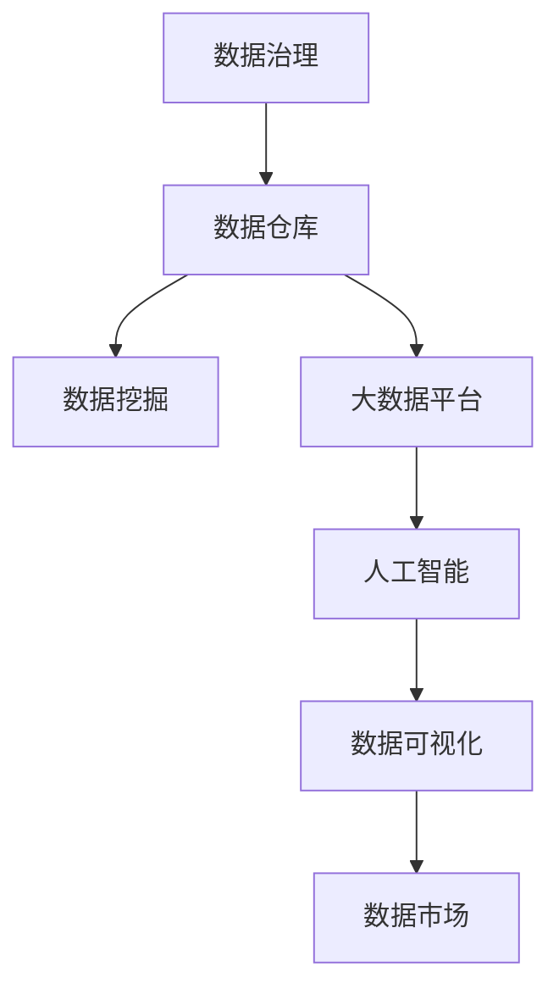

                 

## 1. 背景介绍

### 1.1 问题由来
在数字经济时代，数据作为一种无形资产，正成为驱动企业增长的关键因素。数据变现是指企业通过高效利用和分析其积累的数据资源，转化为直接或间接的经济收益，提升市场竞争力和业务创新能力。

近年来，随着人工智能和大数据技术的发展，数据变现的方式和途径愈发丰富。从传统的业务数据报表分析，到高级的数据驱动决策支持，再到利用机器学习模型进行智能预测和推荐，数据变现正逐步从数据收集、存储、分析转向更高级别的数据智能化应用。

然而，数据变现并非易事。数据规模庞大，结构复杂，数据质量参差不齐，导致数据治理和应用难度大，对技术能力要求高。如何高效利用数据资源，将数据转化为高质量的商业价值，成为了企业面临的一大挑战。

### 1.2 问题核心关键点
数据变现的核心在于通过数据智能技术实现数据的价值最大化。具体来说，需要企业在以下几方面不断努力：
- 数据的获取和整合：收集、清洗、融合来自不同渠道的数据资源，构建统一的数据平台。
- 数据质量管理：保证数据的质量和一致性，建立数据质量管理体系。
- 数据智能应用：利用机器学习、深度学习等技术，对数据进行高效分析、智能预测和推荐。
- 业务流程优化：通过数据分析结果，优化业务流程，提高运营效率。
- 客户行为理解：利用数据理解客户需求和行为，实现个性化服务和精准营销。
- 安全合规保障：确保数据隐私和安全，符合相关法律法规。

本文将深入探讨利用技术能力进行数据变现的方法和实践，旨在帮助企业掌握数据变现的核心技术和策略。

## 2. 核心概念与联系

### 2.1 核心概念概述

为更好地理解数据变现的全过程，本节将介绍几个关键概念：

- 数据治理(Data Governance)：通过建立数据标准、数据质量管理、数据安全管理等机制，确保数据的一致性、可靠性和安全性，为数据变现提供基础。
- 数据仓库(Data Warehouse)：集成多个数据源，建立统一的数据存储和管理平台，支持数据多维度、多层次的聚合分析。
- 数据挖掘(Data Mining)：利用机器学习和统计学方法，从海量数据中挖掘出潜在规律和知识，用于支持决策制定。
- 大数据平台(Big Data Platform)：融合数据存储、处理、分析和可视化等组件，构建全面、高效的数据分析体系。
- 人工智能(AI)：结合机器学习、深度学习、自然语言处理等技术，实现数据的智能化应用。
- 数据可视化(Data Visualization)：将数据通过图形化、可视化工具呈现，帮助业务决策者直观理解数据和分析结果。
- 数据市场(Data Market)：企业间进行数据交换和交易的市场平台，促进数据资源的流通和增值。

这些概念之间的逻辑关系可以通过以下Mermaid流程图来展示：



这个流程图展示了一系列数据变现的核心概念及其之间的关系：

1. 数据治理为数据变现提供标准和规范。
2. 数据仓库是数据存储和集成的基础。
3. 数据挖掘帮助从数据中提取知识和规律。
4. 大数据平台提供高效的数据处理和分析能力。
5. 人工智能将数据变现的能力推向智能化。
6. 数据可视化使分析结果更具直观性。
7. 数据市场促进数据资源的流通和增值。

这些概念共同构成了数据变现的全过程，是实现企业数据变现的关键。

## 3. 核心算法原理 & 具体操作步骤
### 3.1 算法原理概述

数据变现的核心在于通过数据智能技术实现数据的价值最大化。其核心思想是：利用先进的数据治理、数据挖掘、人工智能等技术手段，对数据进行高质量的分析和挖掘，发现数据中的潜在价值，并将其转化为商业应用和决策支持。

形式化地，假设企业拥有数据集 $D=\{(x_i,y_i)\}_{i=1}^N$，其中 $x_i$ 表示第 $i$ 条数据，$y_i$ 表示与之关联的商业价值或业务指标。数据变现的目标是找到映射函数 $f(x)$，使得：

$$
y_i = f(x_i)
$$

即通过数据挖掘和人工智能算法，将原始数据 $x_i$ 映射为商业价值 $y_i$。

具体实现中，数据变现通常包括以下几个关键步骤：

- 数据收集：从不同渠道收集相关数据，构建数据仓库。
- 数据清洗：对收集的数据进行清洗和预处理，保证数据质量。
- 特征工程：通过特征提取和特征选择，构建数据特征集。
- 模型训练：利用机器学习和深度学习算法，对数据进行训练，构建预测模型。
- 模型评估：对训练好的模型进行评估，选择合适的模型进行应用。
- 模型部署：将训练好的模型部署到业务系统中，实现数据变现。

### 3.2 算法步骤详解

以下是数据变现的具体操作步骤：

**Step 1: 数据收集与整合**

数据收集是数据变现的第一步，也是最关键的一步。企业需要从内部业务系统、外部市场数据、社交媒体等渠道，收集与业务相关的数据资源。

- 确定数据需求：根据业务目标，明确需要收集的数据类型和指标。
- 设计数据接口：开发API接口，从不同系统和平台获取数据。
- 数据清洗与整合：将来自不同渠道的数据进行清洗和整合，构建统一的数据仓库。

**Step 2: 数据清洗与预处理**

数据清洗是确保数据质量的重要环节，直接影响数据挖掘和分析结果的准确性。

- 数据去重：去除重复和冗余的数据，确保数据唯一性。
- 数据补全：填补缺失的数据，保证数据完整性。
- 数据转换：将不同格式的数据转换为统一格式，便于后续处理。
- 数据筛选：筛选出有用的数据，去除噪音和异常值。

**Step 3: 特征工程**

特征工程是构建高质量预测模型的关键。其目的是通过特征提取和特征选择，构建数据特征集，提高模型的预测能力。

- 特征提取：从原始数据中提取有意义的特征，如时间序列、统计指标等。
- 特征选择：对提取的特征进行筛选和优化，去除无关或冗余的特征。
- 特征变换：对特征进行转换和组合，构建新的特征集。

**Step 4: 模型训练与评估**

利用机器学习和深度学习算法，对数据进行训练，构建预测模型。

- 选择模型算法：根据数据特点和业务需求，选择适合的模型算法，如线性回归、决策树、神经网络等。
- 划分训练集和验证集：将数据集划分为训练集和验证集，进行模型训练和评估。
- 模型训练：使用训练集对模型进行训练，优化模型参数。
- 模型评估：在验证集上评估模型性能，选择最优模型进行应用。

**Step 5: 模型部署与应用**

将训练好的模型部署到业务系统中，实现数据变现。

- 模型集成：将训练好的模型集成到业务系统中，实现数据驱动的业务决策。
- 实时数据处理：利用大数据平台，实时处理业务数据，更新模型预测结果。
- 用户交互界面：开发用户交互界面，方便用户进行数据查询和分析。
- 监控与反馈：实时监控模型性能，根据业务反馈不断优化模型。

### 3.3 算法优缺点

数据变现方法具有以下优点：

- 数据驱动决策：利用数据智能技术，支持企业进行数据驱动的决策制定。
- 提升运营效率：通过数据分析，优化业务流程，提高运营效率。
- 增加业务收入：通过智能推荐和精准营销，增加企业收入。
- 提升客户体验：利用数据理解客户需求和行为，提供个性化服务和精准营销。

然而，数据变现方法也存在一些局限性：

- 数据质量要求高：数据挖掘和分析的效果高度依赖于数据的质量和完整性。
- 模型复杂度高：构建高质量的预测模型需要复杂的技术手段和丰富的经验。
- 技术门槛高：对数据分析和机器学习技术要求高，需要专业人才支持。
- 数据隐私和安全问题：数据变现需要处理大量敏感数据，面临隐私和安全风险。

尽管存在这些局限性，但数据变现仍是大数据时代企业数字化转型的重要方向，需要企业不断优化数据治理、提升数据质量、加强技术能力，以实现数据变现的最大化价值。

### 3.4 算法应用领域

数据变现方法在多个领域得到了广泛应用，例如：

- 金融行业：通过客户数据分析，实现信用评分、风险控制、精准营销等。
- 零售行业：利用客户行为数据，进行产品推荐、库存优化、销售预测等。
- 医疗行业：通过病患数据分析，实现疾病预测、治疗方案推荐、药物研发等。
- 电商行业：利用用户行为数据，进行个性化推荐、市场分析、广告投放等。
- 物流行业：通过运输数据，进行路线优化、货物调度、配送预测等。
- 媒体行业：利用用户行为数据，进行内容推荐、广告投放、用户画像等。
- 政府行业：通过公共数据，实现公共服务优化、政策制定支持等。

以上领域只是冰山一角，数据变现方法的应用范围不断扩大，为企业带来更多业务价值和竞争优势。

## 4. 数学模型和公式 & 详细讲解  
### 4.1 数学模型构建

本节将使用数学语言对数据变现过程中的主要算法进行更加严格的刻画。

假设企业拥有数据集 $D=\{(x_i,y_i)\}_{i=1}^N$，其中 $x_i \in \mathcal{X}$，$y_i \in \mathcal{Y}$。数据变现的目标是找到映射函数 $f: \mathcal{X} \rightarrow \mathcal{Y}$，使得：

$$
y_i = f(x_i)
$$

其中 $\mathcal{X}$ 表示输入特征空间，$\mathcal{Y}$ 表示输出目标空间。

为了实现这一目标，我们通常采用监督学习的方法，通过训练一个预测模型 $M_{\theta}$，使得在给定输入 $x_i$ 的情况下，能够准确预测输出 $y_i$。

常见的预测模型包括线性回归模型、决策树模型、随机森林模型、神经网络模型等。下面以线性回归模型为例，推导其数学模型和公式。

线性回归模型的目标是最小化预测值与真实值之间的平方误差，即：

$$
\mathcal{L}(\theta) = \frac{1}{N}\sum_{i=1}^N (y_i - M_{\theta}(x_i))^2
$$

其中 $\theta$ 为模型参数，$M_{\theta}(x_i)$ 为模型对输入 $x_i$ 的预测值。

根据最小二乘法原理，求解 $\mathcal{L}(\theta)$ 的最小值，即：

$$
\hat{\theta} = \mathop{\arg\min}_{\theta} \mathcal{L}(\theta)
$$

利用梯度下降等优化算法，不断迭代更新模型参数 $\theta$，直至收敛。

### 4.2 公式推导过程

以下是线性回归模型的详细推导过程：

假设输入 $x_i$ 为 $d$ 维特征向量，输出 $y_i$ 为单变量。线性回归模型的预测公式为：

$$
M_{\theta}(x_i) = \theta_0 + \sum_{j=1}^d \theta_j x_{ij}
$$

其中 $\theta_0$ 为偏置项，$\theta_j$ 为第 $j$ 个特征的权重。

为了求解最优参数 $\hat{\theta}$，需要最小化预测值与真实值之间的误差，即：

$$
\mathcal{L}(\theta) = \frac{1}{N}\sum_{i=1}^N (y_i - \theta_0 - \sum_{j=1}^d \theta_j x_{ij})^2
$$

对 $\mathcal{L}(\theta)$ 对 $\theta$ 求导，得到：

$$
\frac{\partial \mathcal{L}(\theta)}{\partial \theta_j} = \frac{2}{N} \sum_{i=1}^N (y_i - \theta_0 - \sum_{j=1}^d \theta_j x_{ij})x_{ij}
$$

令导数等于零，解得：

$$
\hat{\theta} = (\mathbf{X}^T\mathbf{X})^{-1}\mathbf{X}^T\mathbf{Y}
$$

其中 $\mathbf{X}=[x_{ij}]_{i=1}^N, j=1,...,d$ 为特征矩阵，$\mathbf{Y}=[y_i]_{i=1}^N$ 为目标向量。

通过上述推导，我们可以看到，线性回归模型通过最小化预测值与真实值之间的误差，优化模型参数 $\theta$，从而实现数据变现的目标。

### 4.3 案例分析与讲解

以金融行业为例，利用数据变现技术，可以通过客户数据分析，实现信用评分、风险控制、精准营销等。

假设银行拥有客户数据集 $D=\{(x_i,y_i)\}_{i=1}^N$，其中 $x_i$ 包含客户的年龄、收入、信用记录等信息，$y_i$ 为客户的信用评分。银行希望利用这些数据，预测新客户的信用评分，实现精准营销。

数据变现的具体步骤如下：

**Step 1: 数据收集与整合**

银行需要收集客户的年龄、收入、信用记录等信息，构建数据仓库。同时，开发API接口，从不同系统和平台获取数据。

**Step 2: 数据清洗与预处理**

对收集的数据进行清洗和预处理，去除重复和冗余的数据，填补缺失的数据，将不同格式的数据转换为统一格式。

**Step 3: 特征工程**

通过特征提取和特征选择，构建数据特征集。如提取客户的年龄、收入等特征，构建客户画像。

**Step 4: 模型训练与评估**

利用线性回归模型，对数据进行训练，构建预测模型。在验证集上评估模型性能，选择最优模型进行应用。

**Step 5: 模型部署与应用**

将训练好的模型部署到业务系统中，实现数据驱动的业务决策。实时处理业务数据，更新模型预测结果，提供精准的信用评分服务。

通过上述数据变现流程，银行能够更好地理解客户需求和行为，实现精准营销，提升客户满意度。

## 5. 项目实践：代码实例和详细解释说明
### 5.1 开发环境搭建

在进行数据变现实践前，我们需要准备好开发环境。以下是使用Python进行TensorFlow开发的环境配置流程：

1. 安装Anaconda：从官网下载并安装Anaconda，用于创建独立的Python环境。

2. 创建并激活虚拟环境：
```bash
conda create -n tf-env python=3.8 
conda activate tf-env
```

3. 安装TensorFlow：根据CUDA版本，从官网获取对应的安装命令。例如：
```bash
conda install tensorflow -c tf -c conda-forge
```

4. 安装Pandas、NumPy、Matplotlib等工具包：
```bash
pip install pandas numpy matplotlib jupyter notebook ipython
```

完成上述步骤后，即可在`tf-env`环境中开始数据变现实践。

### 5.2 源代码详细实现

下面以客户信用评分预测为例，给出使用TensorFlow对数据进行线性回归预测的代码实现。

首先，定义数据处理函数：

```python
import pandas as pd
from sklearn.model_selection import train_test_split

def load_data(file_path):
    data = pd.read_csv(file_path)
    X = data.drop('y', axis=1)
    y = data['y']
    return X, y
```

然后，定义模型和优化器：

```python
from tensorflow.keras import Sequential, Dense, optimizer

def build_model(input_dim):
    model = Sequential()
    model.add(Dense(32, input_dim=input_dim, activation='relu'))
    model.add(Dense(1, activation='linear'))
    optimizer = optimizer.Adam(lr=0.001)
    return model, optimizer
```

接着，定义训练和评估函数：

```python
def train_model(model, optimizer, X_train, y_train, X_valid, y_valid, epochs=10):
    for epoch in range(epochs):
        model.compile(optimizer=optimizer, loss='mse')
        model.fit(X_train, y_train, epochs=1, validation_data=(X_valid, y_valid))
        loss = model.evaluate(X_valid, y_valid)
        print(f'Epoch {epoch+1}, loss: {loss:.4f}')
    return model
```

最后，启动训练流程并在测试集上评估：

```python
X, y = load_data('data.csv')
X_train, X_valid, y_train, y_valid = train_test_split(X, y, test_size=0.2, random_state=42)
input_dim = X.shape[1]

model, optimizer = build_model(input_dim)
model = train_model(model, optimizer, X_train, y_train, X_valid, y_valid)

print(f'Test score: {model.evaluate(X_test, y_test)}')
```

以上就是使用TensorFlow对数据进行线性回归预测的完整代码实现。可以看到，借助TensorFlow，构建和训练线性回归模型的代码实现变得简洁高效。

### 5.3 代码解读与分析

让我们再详细解读一下关键代码的实现细节：

**load_data函数**：
- 读取CSV文件，将数据分为特征集和标签，并返回。

**build_model函数**：
- 定义一个包含两个全连接层的神经网络模型。
- 第一层为输入层，包含32个神经元，激活函数为ReLU。
- 第二层为输出层，只包含一个神经元，激活函数为线性，表示回归问题。
- 定义优化器，使用Adam算法。

**train_model函数**：
- 对模型进行编译，指定优化器和损失函数。
- 在每个epoch内，使用训练集进行训练，并在验证集上进行评估。
- 输出每个epoch的损失值。

**训练流程**：
- 定义总的epoch数，开始循环迭代
- 每个epoch内，模型进行一次训练，输出损失值
- 所有epoch结束后，输出测试集的评估结果

可以看到，TensorFlow结合Pandas等库，使得数据收集、处理和训练的代码实现变得简洁高效。开发者可以将更多精力放在模型选择和优化上，而不必过多关注底层的实现细节。

当然，工业级的系统实现还需考虑更多因素，如模型的保存和部署、超参数的自动搜索、更灵活的任务适配层等。但核心的数据变现范式基本与此类似。

## 6. 实际应用场景
### 6.1 智能客服系统

数据变现技术在智能客服系统中得到了广泛应用。传统客服系统依赖人工处理，高峰期响应速度慢，且服务质量难以保证。利用数据变现技术，可以构建基于数据分析和机器学习的智能客服系统，提高客服效率和服务质量。

具体来说，智能客服系统可以通过分析历史客服对话记录，构建监督数据，对预训练模型进行微调，实现自然语言理解和生成。微调后的模型能够自动理解客户意图，匹配最合适的回答，提高客户满意度。同时，还可以通过数据分析发现客服流程中的问题，优化客服流程，提高运营效率。

### 6.2 金融舆情监测

金融行业对实时舆情监测和风险控制有着极高的要求。利用数据变现技术，可以从海量金融新闻、评论、公告中挖掘出潜在的舆情变化和市场趋势，辅助决策制定。

具体来说，金融舆情监测系统可以通过收集金融新闻、评论等文本数据，构建监督数据，对预训练语言模型进行微调，实现舆情分析和风险预测。微调后的模型能够自动识别舆情变化，及时发出预警，帮助金融机构快速应对潜在风险。

### 6.3 个性化推荐系统

电商行业需要根据用户行为数据，提供个性化的推荐服务。数据变现技术可以帮助电商平台通过分析用户浏览、点击、购买等行为数据，构建推荐模型，提升用户体验和交易转化率。

具体来说，个性化推荐系统可以通过收集用户行为数据，构建监督数据，对预训练模型进行微调，实现商品推荐和广告投放。微调后的模型能够根据用户行为数据，推荐最符合用户兴趣的商品，提高用户满意度。同时，还可以通过数据分析优化库存管理和营销策略，提高运营效率。

### 6.4 未来应用展望

随着数据变现技术的不断发展，其在更多领域得到了应用，为各行各业带来了新的商业价值和竞争优势。

在智慧城市治理中，数据变现技术可以用于公共服务优化、交通流量预测、环境监测等，提升城市管理的智能化水平，构建更安全、高效的未来城市。

在智能制造领域，数据变现技术可以用于设备维护预测、生产流程优化、供应链管理等，提升制造业的自动化和智能化水平，推动工业4.0的发展。

在医疗健康领域，数据变现技术可以用于病患数据分析、医疗资源优化、药物研发等，提升医疗服务的智能化水平，提高医疗服务质量。

未来，数据变现技术将在更多领域得到应用，为各行各业带来新的商业价值和竞争优势。

## 7. 工具和资源推荐
### 7.1 学习资源推荐

为了帮助开发者系统掌握数据变现的理论基础和实践技巧，这里推荐一些优质的学习资源：

1. 《深度学习》系列书籍：由著名深度学习专家撰写，系统介绍了深度学习的基本原理和应用，适合初学者和进阶者学习。
2. 《Python数据科学手册》：详细介绍了Python在数据科学领域的应用，包括数据处理、分析、可视化等。
3. 《TensorFlow官方文档》：提供了完整的TensorFlow开发指南和代码示例，适合初学者和进阶者学习。
4. Kaggle平台：数据科学竞赛平台，提供大量公开数据集和竞赛项目，适合实践和提升数据科学技能。
5. Coursera平台：提供在线数据科学和机器学习课程，涵盖从基础到高级的全面内容，适合系统学习。

通过对这些资源的学习实践，相信你一定能够快速掌握数据变现的核心技术和策略，并将其应用到实际项目中。

### 7.2 开发工具推荐

高效的开发离不开优秀的工具支持。以下是几款用于数据变现开发的常用工具：

1. Python：作为数据科学和机器学习领域的主流语言，Python拥有丰富的科学计算库和数据处理工具。
2. TensorFlow：由Google主导开发的开源深度学习框架，适合大规模工程应用。
3. Scikit-learn：Python数据科学库，提供了大量机器学习算法和数据处理工具。
4. Pandas：数据处理库，支持数据清洗、转换、聚合等操作，非常适合数据科学任务。
5. Jupyter Notebook：交互式编程环境，适合数据科学和机器学习项目的开发和演示。
6. PySpark：基于Spark的大数据处理库，支持分布式计算，适合大规模数据处理任务。

合理利用这些工具，可以显著提升数据变现任务的开发效率，加快创新迭代的步伐。

### 7.3 相关论文推荐

数据变现技术的发展源于学界的持续研究。以下是几篇奠基性的相关论文，推荐阅读：

1. TensorFlow: A System for Large-Scale Machine Learning：介绍TensorFlow的核心架构和技术特点，适合了解TensorFlow的内部机制。
2. Scikit-learn: Machine Learning in Python：介绍Scikit-learn库的功能和使用，适合学习机器学习算法和数据处理。
3. Kaggle Competitions：介绍Kaggle平台上的数据科学竞赛项目，适合实践和提升数据科学技能。
4. Mining of Massive Datasets：介绍大规模数据挖掘的原理和方法，适合系统学习数据挖掘技术。
5. Google Scholar：提供大量的学术论文和综述，适合深入学习和跟踪最新的研究进展。

这些论文代表了大数据和机器学习领域的经典研究成果，通过学习这些前沿成果，可以帮助研究者把握学科前进方向，激发更多的创新灵感。

## 8. 总结：未来发展趋势与挑战
### 8.1 总结

本文对数据变现的核心技术进行了全面系统的介绍。首先阐述了数据变现的背景和意义，明确了数据智能技术在数据变现中的核心作用。其次，从原理到实践，详细讲解了数据变现的数学模型和操作步骤，给出了具体的代码实现。同时，本文还广泛探讨了数据变现在智能客服、金融舆情、个性化推荐等场景中的应用，展示了数据变现技术的广阔前景。此外，本文精选了数据变现技术的各类学习资源，力求为读者提供全方位的技术指引。

通过本文的系统梳理，可以看到，数据变现技术正在成为企业数字化转型的重要方向，通过高效利用和分析数据资源，企业能够实现数据驱动的决策制定，提升运营效率和业务收入。未来，随着数据科学和机器学习技术的不断进步，数据变现技术的创新和应用将进一步推动各行各业的发展，带来更多商业价值和竞争优势。

### 8.2 未来发展趋势

展望未来，数据变现技术将呈现以下几个发展趋势：

1. 数据治理的自动化：随着数据量的不断增长，数据治理的需求将更加迫切。未来的数据变现技术将更加注重数据治理的自动化，通过机器学习和大数据技术，自动处理数据清洗、数据整合等任务。
2. 模型的多样性：未来的数据变现技术将支持更多样化的模型，如深度学习模型、图模型、时间序列模型等，以适应不同的数据特点和业务需求。
3. 数据的实时处理：实时数据处理将成为数据变现的重要组成部分，未来的数据变现技术将支持更多的实时数据处理技术，如流式处理、事件驱动等。
4. 模型的可解释性：未来的数据变现技术将更加注重模型的可解释性，通过引入因果分析、可解释AI等方法，提高模型的透明度和可信度。
5. 数据隐私和安全：数据隐私和安全是数据变现的重要关注点，未来的数据变现技术将更加注重数据隐私和安全保护，确保数据合规和用户隐私。
6. 技术的融合创新：未来的数据变现技术将与其他技术进行更深入的融合，如人工智能、区块链、物联网等，推动数据变现技术的创新和应用。

这些趋势凸显了数据变现技术的广阔前景。通过持续优化数据治理、提升数据质量、加强技术能力，企业将能够更好地实现数据变现的最大化价值。

### 8.3 面临的挑战

尽管数据变现技术已经取得了瞩目成就，但在迈向更加智能化、普适化应用的过程中，它仍面临诸多挑战：

1. 数据质量要求高：数据变现的效果高度依赖于数据的质量和完整性，如何高效处理和清洗大规模数据，保证数据质量，仍然是一个挑战。
2. 技术门槛高：数据变现技术对数据分析和机器学习技术要求高，需要专业人才支持。如何降低技术门槛，普及数据变现技术，将是一个重要的课题。
3. 数据隐私和安全问题：数据变现过程中，涉及大量敏感数据，面临隐私和安全风险。如何确保数据隐私和安全，是一个关键问题。
4. 模型的复杂性：构建高质量的预测模型需要复杂的技术手段和丰富的经验，如何降低模型复杂性，提高模型训练和调优的效率，将是一个重要的研究方向。
5. 数据孤岛问题：不同业务系统中的数据孤岛现象普遍存在，如何打破数据孤岛，实现数据融合和共享，是一个重要的挑战。
6. 模型的鲁棒性：在实际应用中，模型面临各种数据扰动和噪声，如何提高模型的鲁棒性，是一个需要持续优化的问题。

尽管存在这些挑战，但数据变现技术的发展前景依然广阔，需要企业不断优化数据治理、提升数据质量、加强技术能力，以实现数据变现的最大化价值。

### 8.4 研究展望

面对数据变现技术所面临的挑战，未来的研究需要在以下几个方面寻求新的突破：

1. 探索更高效的数据治理方法：利用机器学习和大数据技术，自动处理数据清洗、数据整合等任务，降低人工干预。
2. 研究更高效的数据挖掘算法：通过引入因果分析、可解释AI等方法，提高模型的透明度和可信度。
3. 开发更高效的数据实时处理技术：支持更多的实时数据处理技术，如流式处理、事件驱动等。
4. 开发更高效的模型训练和调优方法：通过优化模型结构、引入自动化调参技术等方法，提高模型训练和调优的效率。
5. 建立更完善的数据隐私和安全体系：引入区块链、联邦学习等技术，保护数据隐私和安全，确保数据合规。
6. 实现数据的跨系统融合：打破数据孤岛，实现数据融合和共享，构建统一的数据平台。

这些研究方向将进一步推动数据变现技术的创新和应用，帮助企业更好地实现数据变现的最大化价值。

## 9. 附录：常见问题与解答

**Q1：数据变现是否适用于所有企业？**

A: 数据变现技术并不适用于所有企业。数据变现需要企业具备一定数据资源和技术能力，通常适合具备数据驱动文化和技术积累的企业。对于数据资源匮乏或技术能力不足的企业，数据变现需要更多的时间和资源投入。

**Q2：如何确保数据隐私和安全？**

A: 确保数据隐私和安全是数据变现的关键。企业应采取以下措施：
1. 数据脱敏：对敏感数据进行脱敏处理，降低数据泄露风险。
2. 访问控制：建立严格的数据访问控制机制，确保数据仅对授权人员和系统开放。
3. 加密技术：对数据进行加密处理，确保数据在传输和存储过程中的安全性。
4. 安全审计：定期进行安全审计，发现和修复潜在的安全漏洞。
5. 合规要求：符合相关法律法规，确保数据使用合规。

**Q3：数据变现是否会带来新的数据治理挑战？**

A: 数据变现需要更高效的数据治理机制，以应对大规模数据的处理和分析。企业需要建立数据标准、数据质量管理、数据安全管理等机制，确保数据的一致性、可靠性和安全性。同时，需要引入自动化和智能化的技术手段，提高数据治理效率。

**Q4：数据变现是否需要大规模的标注数据？**

A: 数据变现需要一定量的标注数据来训练和评估模型，但并不需要大规模的标注数据。通过无监督学习和半监督学习方法，企业可以在较少的标注数据下，实现数据变现。同时，利用数据增强和合成数据生成技术，可以进一步提升数据质量。

**Q5：数据变现是否需要高超的技术能力？**

A: 数据变现需要一定的技术能力，包括数据处理、模型训练、调优等。但企业可以通过引入外部技术支持和培训，逐步提升技术能力，实现数据变现。同时，可以借助第三方数据科学平台和工具，降低技术门槛，加速数据变现过程。

---

作者：禅与计算机程序设计艺术 / Zen and the Art of Computer Programming

