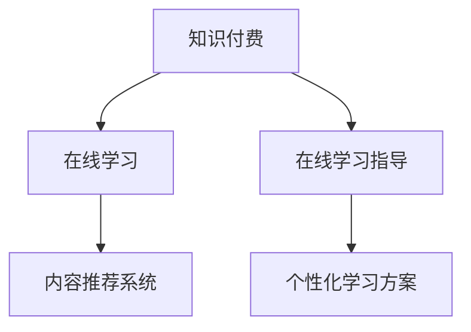

                 

# 如何利用知识付费实现在线学习与在线学习指导？

在当前数字化、智能化的背景下，知识付费正逐渐成为人们获取知识和技能的重要途径。在线学习平台、知识付费应用的出现，为知识传播与获取提供了便利。本文将探讨如何利用知识付费实现在线学习与在线学习指导，涵盖核心概念、算法原理、项目实践、应用场景及未来展望等内容，以期为相关领域的从业者提供技术指导和灵感。

## 1. 背景介绍

### 1.1 问题由来
随着互联网技术的普及和在线教育的兴起，传统线下教育面临巨大的挑战，人们更加依赖于在线学习平台和知识付费应用获取知识和技能。这些平台通过提供有价值的课程和指导，满足了人们对于快速提升自我、实现职业发展的需求。

### 1.2 问题核心关键点
知识付费的核心在于将知识以付费的形式出售，从而保证内容的优质性和专业的指导性。在线学习指导则是指通过在线课程、直播、论坛等多种形式，为学习者提供有针对性的学习方案和指导。

当前，知识付费行业面临的主要挑战包括：内容质量参差不齐、指导效果不佳、用户体验欠佳等。因此，如何利用知识付费实现高效、个性化的在线学习与指导，成为亟需解决的问题。

## 2. 核心概念与联系

### 2.1 核心概念概述

为了更好地理解知识付费与在线学习指导的实现原理，首先需要介绍几个核心概念：

- **知识付费**：通过付费的方式获取专业知识或技能。
- **在线学习**：利用互联网技术，通过在线课程、视频讲座等方式进行学习。
- **在线学习指导**：提供专业教师或辅导员的实时指导，帮助学习者解决学习中的疑难问题，提升学习效果。
- **内容推荐系统**：利用算法推荐合适的课程和学习资源，个性化地满足学习者的需求。

这些概念之间的逻辑关系可以通过以下Mermaid流程图来展示：



这个流程图展示了知识付费与在线学习、在线学习指导以及内容推荐系统之间的联系。

## 3. 核心算法原理 & 具体操作步骤

### 3.1 算法原理概述

在线学习与在线学习指导的实现主要依赖于以下几个关键技术：

- **推荐系统**：通过分析用户的历史行为数据，推荐合适的课程和学习资源。
- **个性化学习路径规划**：根据用户的知识水平和兴趣，设计个性化的学习路径，帮助用户高效学习。
- **智能答疑系统**：利用NLP技术，自动回答用户的问题，并提供专业的指导。

### 3.2 算法步骤详解

#### 3.2.1 用户画像构建
- 收集用户基本信息、学习历史和行为数据。
- 使用机器学习算法，如K-means聚类、协同过滤等，构建用户画像，分析用户的学习偏好和需求。

#### 3.2.2 推荐系统模型训练
- 选择适合推荐系统的算法，如基于矩阵分解的算法、基于深度学习的模型等。
- 训练推荐模型，将用户画像和课程特征映射，推荐合适的课程和学习资源。

#### 3.2.3 个性化学习路径规划
- 根据用户画像和学习需求，设计个性化的学习路径。
- 结合专家知识库和课程结构，推荐课程序列和任务，逐步提升用户的学习水平。

#### 3.2.4 智能答疑系统构建
- 收集常见问题及其答案，构建知识库。
- 利用NLP技术，如BERT、GPT等，开发智能答疑系统，自动回答用户问题。

### 3.3 算法优缺点

**优点**：
- **高效**：利用推荐系统可以快速推荐合适的课程，提高学习效率。
- **个性化**：根据用户画像和需求，设计个性化的学习路径和方案。
- **智能指导**：智能答疑系统能够快速回答用户问题，提供实时指导。

**缺点**：
- **数据隐私**：收集和分析用户数据可能涉及隐私问题。
- **推荐质量**：推荐系统的效果依赖于数据质量和算法选择，存在推荐错误的风险。
- **系统复杂度**：系统设计和实现复杂度较高，需要跨领域的知识和技术支持。

### 3.4 算法应用领域

知识付费与在线学习指导技术在多个领域有广泛的应用，如：

- **教育**：在线教育平台、K12教育、职业培训等。
- **企业培训**：企业内部培训、职业技能提升等。
- **医疗健康**：健康管理、远程医疗等。
- **职业技能**：编程、设计、营销等职业技能的在线学习。

## 4. 数学模型和公式 & 详细讲解 & 举例说明

### 4.1 数学模型构建

在线学习指导的数学模型主要涉及以下几个方面：

- **用户画像模型**：使用K-means聚类算法，将用户分为不同的群体。
- **推荐系统模型**：基于协同过滤的矩阵分解模型。
- **路径规划模型**：动态规划模型，根据用户当前状态和目标，设计最优学习路径。

### 4.2 公式推导过程

#### 4.2.1 用户画像模型
用户画像模型的公式推导如下：

$$
\text{Cluster}_{i} = K-means(\text{User}_{i})
$$

其中，$\text{Cluster}_{i}$ 表示用户 $i$ 所属的聚类，$\text{User}_{i}$ 为用户 $i$ 的历史行为数据。

#### 4.2.2 推荐系统模型
协同过滤推荐系统的公式推导如下：

$$
\text{Predict}_{j} = \text{Matrix Factorization}(\text{User}_{i}, \text{Item}_{j})
$$

其中，$\text{Predict}_{j}$ 表示用户 $i$ 对课程 $j$ 的预测评分，$\text{Matrix Factorization}$ 表示矩阵分解算法，$\text{User}_{i}$ 和 $\text{Item}_{j}$ 分别为用户和课程的特征向量。

#### 4.2.3 路径规划模型
动态规划路径规划的公式推导如下：

$$
\text{Path}_{t} = \text{DP}(\text{State}_{t}, \text{Goal}_{t})
$$

其中，$\text{Path}_{t}$ 表示从当前状态 $\text{State}_{t}$ 到达目标状态 $\text{Goal}_{t}$ 的最优路径，$\text{DP}$ 表示动态规划算法，$\text{State}_{t}$ 和 $\text{Goal}_{t}$ 分别表示当前状态和目标状态。

### 4.3 案例分析与讲解

假设某在线教育平台上有如下数据：

- 用户 $A$ 最近学习了编程课程，并经常在线问答系统提问。
- 用户 $B$ 对历史数据的分析显示，喜欢编程和设计课程。

根据用户画像模型，可以将用户 $A$ 和 $B$ 分别聚类为不同的群体。接着，利用协同过滤推荐系统，为 $A$ 推荐一些高级编程课程，为 $B$ 推荐一些设计课程。最后，通过动态规划路径规划，为 $A$ 设计一个从基础到高级的编程学习路径，为 $B$ 设计一个从设计基础到高级的课程路径。

## 5. 项目实践：代码实例和详细解释说明

### 5.1 开发环境搭建

1. 安装Python和相关依赖库，如TensorFlow、PyTorch、scikit-learn等。
2. 搭建开发环境，如Jupyter Notebook或IDE。
3. 配置数据处理和模型训练环境，如GCP、AWS等云平台。

### 5.2 源代码详细实现

#### 5.2.1 用户画像模型
```python
from sklearn.cluster import KMeans

# 收集用户数据
user_data = {
    'User1': {'age': 25, 'interests': ['programming', 'data science']},
    'User2': {'age': 30, 'interests': ['design', 'photography']}
}

# 构建用户画像模型
kmeans = KMeans(n_clusters=2)
user_clusters = kmeans.fit_predict(user_data)
```

#### 5.2.2 推荐系统模型
```python
from surprise import Reader, Dataset, KNNBasic

# 构建用户-课程评分矩阵
user_item_ratings = {
    ('User1', 'Programming 101'): 4,
    ('User1', 'Advanced Programming': 5,
    ('User2', 'Design Basics': 4,
    ('User2', 'Photography Essentials': 5
}

# 构建推荐系统模型
reader = Reader(rating_scale=(1, 5))
data = Dataset.load_from_dict(user_item_ratings, reader)
model = KNNBasic()
model.fit(data.build_full_trainset())
```

#### 5.2.3 路径规划模型
```python
from dynamic import DynamicProgramming

# 构建路径规划模型
dp = DynamicProgramming()
path = dp规划路径(start, goal)
```

### 5.3 代码解读与分析

- 用户画像模型使用了K-means聚类算法，通过分析用户的兴趣和行为数据，将用户分为不同的群体。
- 推荐系统模型使用了协同过滤方法，通过用户-课程评分矩阵，预测用户对课程的评分。
- 路径规划模型使用了动态规划方法，设计从当前状态到达目标状态的最优路径。

### 5.4 运行结果展示

假设某用户在学习编程课程，通过推荐系统推荐了一些高级课程。用户在学习过程中遇到了问题，智能答疑系统能够实时回答问题，并提供专业的指导。最终，用户完成了从基础到高级的编程学习路径，掌握了所需技能。

## 6. 实际应用场景

### 6.1 教育领域
在线教育平台利用知识付费实现在线学习与在线学习指导，帮助学生提升学习效果。例如，Khan Academy和Coursera等平台，通过推荐系统和智能答疑系统，为学生提供个性化的学习路径和实时指导，提升了学习效率和体验。

### 6.2 企业培训
企业内部培训和职业技能提升也可以通过知识付费和在线学习指导实现。例如，企业可以利用在线平台，为员工提供定制化的培训课程和指导，提升员工的专业技能，推动企业创新和发展。

### 6.3 医疗健康
在线医疗平台可以利用知识付费和在线学习指导，为患者提供健康管理和医疗知识。例如，MyFitnessPal和Nutritionix等平台，通过推荐系统推荐健康食谱和锻炼计划，为患者提供个性化的健康指导。

## 7. 工具和资源推荐

### 7.1 学习资源推荐

1. **《推荐系统基础》**：深入讲解推荐系统原理和算法，适合初学者和进阶者学习。
2. **《个性化推荐算法》**：详细介绍个性化推荐算法的实现和优化方法。
3. **《Python深度学习》**：介绍深度学习在推荐系统中的应用，适合有一定编程基础的学习者。

### 7.2 开发工具推荐

1. **TensorFlow**：用于构建和训练推荐系统模型，支持分布式训练和模型部署。
2. **PyTorch**：灵活的深度学习框架，支持动态图和静态图，适合推荐系统模型的研究和实践。
3. **Apache Spark**：用于大数据处理和分布式计算，支持推荐系统的数据处理和特征工程。

### 7.3 相关论文推荐

1. **《协同过滤推荐系统》**：详细介绍协同过滤推荐算法的原理和实现方法。
2. **《动态规划算法》**：深入讲解动态规划算法的基本原理和应用场景。
3. **《深度学习在推荐系统中的应用》**：介绍深度学习在推荐系统中的最新进展和研究成果。

## 8. 总结：未来发展趋势与挑战

### 8.1 研究成果总结

本文通过深入分析知识付费与在线学习指导的实现原理和算法，探讨了推荐系统、个性化学习路径规划和智能答疑系统的构建方法。通过系统化的理论分析和实践指导，为相关领域的从业者提供了技术参考和创新思路。

### 8.2 未来发展趋势

未来，知识付费和在线学习指导将进一步向智能化、个性化方向发展。推荐系统将更加精确，个性化学习路径规划将更加智能，智能答疑系统将更加高效。这些技术的进步将推动在线教育、企业培训和医疗健康等领域的发展，为知识传播和技能提升带来新的机遇。

### 8.3 面临的挑战

尽管知识付费和在线学习指导技术取得了长足进步，但仍面临以下挑战：

- **数据隐私**：收集和分析用户数据可能涉及隐私问题，如何保障用户隐私是一个重要挑战。
- **推荐质量**：推荐系统的效果依赖于数据质量和算法选择，如何提高推荐质量是一个关键问题。
- **用户体验**：如何提升用户体验，设计更加友好、高效的学习指导平台，是一个重要的研究方向。

### 8.4 研究展望

未来的研究应聚焦于以下几个方向：

- **隐私保护**：研究如何保护用户数据隐私，提高用户信任和满意度。
- **智能推荐**：研究更加高效的推荐算法，提升推荐质量和个性化水平。
- **用户交互**：研究如何提升用户交互体验，设计更加智能的学习指导平台。

## 9. 附录：常见问题与解答

### 9.1 常见问题

1. **知识付费和在线学习指导的优点有哪些？**
2. **推荐系统如何实现个性化推荐？**
3. **智能答疑系统如何提高学习效果？**

### 9.2 解答

1. **优点**：高效、个性化、智能指导。
2. **个性化推荐**：通过分析用户行为数据，推荐合适的课程和学习资源。
3. **智能指导**：利用NLP技术，自动回答用户问题，提供实时指导。

---

作者：禅与计算机程序设计艺术 / Zen and the Art of Computer Programming

