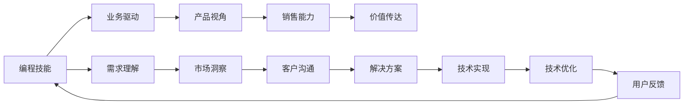

                 

## 1. 背景介绍

随着人工智能和软件工程技术的飞速发展，企业对开发人才的需求日益增长。然而，仅仅具备优秀的编程技能已不足以在竞争激烈的市场中脱颖而出。将编程技能转化为销售能力，成为新一代IT专业人才的必备技能。

在数字化转型的大潮下，软件开发不仅仅是技术实现，更是一种业务能力的体现。IT部门正逐渐成为企业价值链的关键环节，通过技术赋能业务，驱动企业增长。在这一过程中，如何将编程技能转化为销售能力，便成为了每一位IT人才必须思考的问题。

本文旨在探讨如何将编程技能转化为销售能力，帮助IT人员更好地理解业务需求，提升技术应用价值，成为企业中的重要销售者和推动者。

## 2. 核心概念与联系

### 2.1 核心概念概述

- **编程技能**：指掌握编程语言、算法、数据结构等基本技术能力，能够实现各种软件系统的开发和维护。
- **销售能力**：指具备市场洞察、客户沟通、需求理解、价值传达等能力，能够将技术解决方案有效地转化为业务价值。
- **业务驱动**：指从业务需求出发，利用技术手段解决问题，推动业务发展的能力。
- **产品视角**：指站在用户和市场角度，考虑产品的功能、体验、市场竞争力等，确保技术实现能够满足用户需求和市场期望。

### 2.2 核心概念原理和架构的 Mermaid 流程图

## 3. 核心算法原理 & 具体操作步骤

### 3.1 算法原理概述

将编程技能转化为销售能力，本质上是一种跨领域能力的融合过程。它需要IT人员在技术实现和业务理解之间架起一座桥梁，将技术解决方案转化为实际的业务价值。

在这一过程中，核心算法原理可以概括为：

1. **需求理解**：深入理解客户需求，识别关键问题和痛点。
2. **市场洞察**：分析市场趋势，评估技术解决方案的市场潜力。
3. **客户沟通**：与客户建立良好沟通，了解其业务目标和期望。
4. **解决方案设计**：根据客户需求和市场洞察，设计技术解决方案。
5. **技术实现**：使用编程技能实现技术解决方案。
6. **价值传达**：将技术解决方案的价值清晰地传达给客户，提升客户满意度和转化率。
7. **持续改进**：根据客户反馈和技术进展，不断优化解决方案，提升业务价值。

### 3.2 算法步骤详解

#### 3.2.1 需求理解

- **客户访谈**：通过与客户面对面交流，了解其业务背景、挑战和目标。
- **文档分析**：分析客户提供的业务文档、需求文档等，提取关键信息。
- **竞品分析**：对比竞品功能，识别其优势和不足。

#### 3.2.2 市场洞察

- **趋势分析**：研究市场趋势，识别新兴技术和应用场景。
- **机会识别**：分析市场机会，评估技术解决方案的市场潜力。

#### 3.2.3 客户沟通

- **需求沟通**：与客户沟通需求细节，确保理解准确。
- **期望管理**：管理客户期望，避免过度承诺。
- **解决方案讨论**：与客户讨论解决方案，获取反馈。

#### 3.2.4 解决方案设计

- **功能规划**：根据客户需求设计功能模块。
- **架构设计**：设计系统架构，确保可扩展性和可维护性。
- **用户体验设计**：设计用户界面，提升用户体验。

#### 3.2.5 技术实现

- **技术选型**：选择合适的技术栈和框架。
- **编码实现**：实现功能模块，编写代码。
- **测试优化**：进行单元测试、集成测试，优化代码。

#### 3.2.6 价值传达

- **演示演示**：通过产品演示，展示技术解决方案的实际效果。
- **案例分享**：分享成功案例，展示技术解决方案的实际价值。
- **客户培训**：提供技术培训，提升客户使用体验。

#### 3.2.7 持续改进

- **用户反馈**：收集用户反馈，识别问题和改进点。
- **技术更新**：根据技术进展，不断优化解决方案。
- **客户满意度提升**：通过持续改进，提升客户满意度和忠诚度。

### 3.3 算法优缺点

#### 3.3.1 优点

- **提升业务价值**：通过将技术转化为实际业务价值，提升企业竞争力。
- **增强客户满意度**：通过深入理解客户需求，提供符合预期的解决方案，提升客户满意度。
- **拓宽职业发展**：通过提升销售能力，拓宽职业发展路径，实现多方面的职业成长。

#### 3.3.2 缺点

- **需要跨领域技能**：需要同时具备编程技能和销售技能，对人才要求较高。
- **时间成本高**：需要更多时间和精力，投入销售和市场调研，可能会影响技术实现进度。
- **需要不断学习和调整**：市场需求和技术趋势不断变化，需要不断学习和调整，以保持竞争力。

### 3.4 算法应用领域

将编程技能转化为销售能力，适用于以下领域：

- **企业级软件**：为企业提供定制化的解决方案，提升企业运营效率和业务价值。
- **消费级应用**：通过技术创新和用户体验设计，提升产品的市场竞争力和用户粘性。
- **新兴技术**：通过技术探索和市场分析，抢占新兴技术市场的先机。
- **咨询和顾问**：通过技术知识和市场洞察，为客户提供咨询和顾问服务。

## 4. 数学模型和公式 & 详细讲解 & 举例说明

### 4.1 数学模型构建

将编程技能转化为销售能力的数学模型可以概括为：

\[ V = C \times T \times S \]

其中：

- \( V \)：业务价值。
- \( C \)：客户需求理解程度。
- \( T \)：技术解决方案的实现效率。
- \( S \)：销售能力的有效性。

### 4.2 公式推导过程

设 \( C \)、\( T \)、\( S \) 分别为需求理解、技术实现和销售能力的得分，其取值范围为 [0, 1]，则业务价值的公式推导如下：

\[ V = C \times T \times S \]

- 当 \( C = 1 \) 时，说明完全理解客户需求；
- 当 \( T = 1 \) 时，说明技术解决方案完全实现；
- 当 \( S = 1 \) 时，说明销售能力完全发挥。

### 4.3 案例分析与讲解

假设某企业需要开发一个客户管理系统，我们通过以下步骤将编程技能转化为销售能力：

1. **需求理解**：通过与客户访谈和文档分析，了解客户的具体需求。
2. **市场洞察**：研究市场趋势，评估客户管理系统的市场潜力。
3. **客户沟通**：与客户详细沟通需求，确认方案细节。
4. **解决方案设计**：设计系统架构，规划功能模块。
5. **技术实现**：选择合适的技术栈，实现功能模块。
6. **价值传达**：通过产品演示，展示系统的实际效果。
7. **持续改进**：根据客户反馈，不断优化系统。

## 5. 项目实践：代码实例和详细解释说明

### 5.1 开发环境搭建

- **编程环境**：安装Python、Django等开发工具。
- **数据库**：安装MySQL、PostgreSQL等数据库。
- **测试框架**：安装unittest、pytest等测试工具。

### 5.2 源代码详细实现

- **需求理解模块**：通过编写客户访谈、文档分析等代码，获取客户需求。
- **市场洞察模块**：通过编写市场趋势分析、机会识别等代码，评估市场潜力。
- **客户沟通模块**：通过编写客户沟通、需求管理等代码，与客户建立良好沟通。
- **解决方案设计模块**：通过编写系统架构设计、功能模块规划等代码，设计解决方案。
- **技术实现模块**：通过编写编码实现、测试优化等代码，实现技术解决方案。
- **价值传达模块**：通过编写产品演示、用户培训等代码，传达技术价值。
- **持续改进模块**：通过编写用户反馈收集、技术优化等代码，持续改进解决方案。

### 5.3 代码解读与分析

- **需求理解模块**：通过客户访谈和文档分析，获取客户需求，为后续设计和实现奠定基础。
- **市场洞察模块**：通过市场趋势分析和机会识别，评估技术解决方案的市场潜力，确保项目方向正确。
- **客户沟通模块**：通过客户沟通和需求管理，确保与客户保持良好沟通，避免误解和错误。
- **解决方案设计模块**：通过系统架构设计和功能模块规划，设计符合客户需求的解决方案，确保系统可扩展性和可维护性。
- **技术实现模块**：通过编码实现和测试优化，确保技术解决方案的实现质量和可靠性。
- **价值传达模块**：通过产品演示和用户培训，清晰传达技术解决方案的实际效果和价值，提升客户满意度和转化率。
- **持续改进模块**：通过用户反馈收集和技术优化，不断改进解决方案，确保系统持续提升业务价值。

### 5.4 运行结果展示

通过上述步骤，可以将编程技能转化为销售能力，显著提升项目成功率和企业竞争力。

## 6. 实际应用场景

### 6.1 企业级软件

在企业级软件领域，通过将编程技能转化为销售能力，可以为客户提供定制化的解决方案，提升企业运营效率和业务价值。例如，为企业开发ERP系统、CRM系统等，通过深入理解客户需求和业务目标，设计出符合企业需求的软件系统。

### 6.2 消费级应用

在消费级应用领域，通过技术创新和用户体验设计，提升产品的市场竞争力和用户粘性。例如，为消费电子品牌开发智能家居系统、健康管理应用等，通过深入了解用户需求，设计出功能强大、易用性高的应用。

### 6.3 新兴技术

在新兴技术领域，通过技术探索和市场分析，抢占新兴技术市场的先机。例如，为初创企业开发区块链应用、AI技术解决方案等，通过市场洞察和客户沟通，找到技术应用的突破点。

### 6.4 咨询和顾问

在咨询和顾问领域，通过技术知识和市场洞察，为客户提供咨询和顾问服务。例如，为企业提供技术咨询、战略规划等服务，通过深入理解客户需求和市场趋势，提供切实可行的解决方案。

## 7. 工具和资源推荐

### 7.1 学习资源推荐

- **编程技能提升**：《编程珠玑》、《算法导论》等经典书籍，提升编程技能和算法理解。
- **销售技能提升**：《影响力》、《谈判力》等书籍，提升销售技巧和沟通能力。
- **市场需求分析**：《创新者的窘境》、《蓝海战略》等书籍，提升市场洞察和战略思维。
- **客户沟通技巧**：《如何赢得朋友与影响他人》、《说服力》等书籍，提升客户沟通技巧。

### 7.2 开发工具推荐

- **编程工具**：Visual Studio、PyCharm等IDE，提升编码效率和质量。
- **项目管理工具**：JIRA、Trello等工具，管理项目进度和任务。
- **测试工具**：Selenium、JUnit等工具，确保代码质量和可靠性。

### 7.3 相关论文推荐

- **需求理解**：《需求工程：方法和实践》，了解需求理解的理论和实践。
- **市场洞察**：《竞争战略》，了解市场洞察和竞争分析。
- **客户沟通**：《客户关系管理》，了解客户沟通和客户关系管理。
- **解决方案设计**：《系统架构：可扩展性、可用性和弹性设计》，了解系统架构设计和优化。
- **技术实现**：《程序员修炼之道》，了解软件开发的最佳实践。
- **价值传达**：《说服力》，了解价值传达和客户沟通技巧。
- **持续改进**：《精益创业》，了解持续改进和用户反馈管理。

## 8. 总结：未来发展趋势与挑战

### 8.1 总结

本文从背景介绍、核心概念与联系、核心算法原理及具体操作步骤等方面，全面系统地探讨了如何将编程技能转化为销售能力。通过深入理解客户需求、市场洞察、客户沟通等关键环节，利用编程技能实现技术解决方案，清晰传达技术价值，不断优化改进，确保技术转化为实际的业务价值。

### 8.2 未来发展趋势

未来，将编程技能转化为销售能力将继续成为IT人才的重要技能。伴随数字化转型和智能化发展的加速，IT部门将在企业价值链中的地位日益提升。技术驱动业务，业务反哺技术，形成良性循环。

- **技术栈更新**：伴随新技术的不断涌现，IT人员需要不断学习和掌握新工具和框架。
- **跨领域能力提升**：需求理解、市场洞察、客户沟通、解决方案设计等跨领域能力将更加重要。
- **用户体验设计**：用户体验设计和界面优化，将提升产品市场竞争力，成为IT人才的重要技能。
- **数据分析能力**：数据分析和数据可视化，将帮助IT人员更好地理解业务数据，提升决策效率。

### 8.3 面临的挑战

尽管将编程技能转化为销售能力具有广阔前景，但仍然面临诸多挑战：

- **知识跨界**：需要同时具备技术和管理两方面的知识，跨界难度较大。
- **时间成本高**：需要更多时间和精力进行市场调研和客户沟通，可能影响技术实现进度。
- **需求变化快**：市场需求和技术趋势不断变化，需要不断学习和调整，以保持竞争力。
- **沟通难度大**：客户和技术团队之间存在语言和思维差异，需要加强沟通技巧和管理能力。

### 8.4 研究展望

未来的研究应集中在以下几个方面：

- **跨界能力培养**：加强跨领域能力培训，提升IT人员在需求理解、市场洞察等方面的能力。
- **自动化工具开发**：开发更多的自动化工具和框架，帮助IT人员更高效地进行需求分析、市场调研等。
- **案例库建设**：建设IT人员成功案例库，提供更多的实践参考和学习资源。
- **持续学习机制**：建立持续学习机制，确保IT人员能够不断更新知识和技能，适应技术发展。

## 9. 附录：常见问题与解答

**Q1：如何将编程技能转化为销售能力？**

A: 通过深入理解客户需求、市场洞察、客户沟通等关键环节，利用编程技能实现技术解决方案，清晰传达技术价值，不断优化改进，确保技术转化为实际的业务价值。

**Q2：需要具备哪些跨界能力？**

A: 需要具备编程技能、市场洞察、客户沟通、需求理解、解决方案设计等方面的跨界能力。

**Q3：如何提升跨界能力？**

A: 通过不断学习和实践，参加跨领域培训和项目，提升在多个领域的综合能力。

**Q4：面临哪些挑战？**

A: 面临知识跨界难度大、时间成本高、需求变化快、沟通难度大等挑战。

**Q5：如何应对这些挑战？**

A: 通过持续学习和跨界能力培训，建立自动化工具和持续学习机制，提升跨界能力。

---

作者：禅与计算机程序设计艺术 / Zen and the Art of Computer Programming

