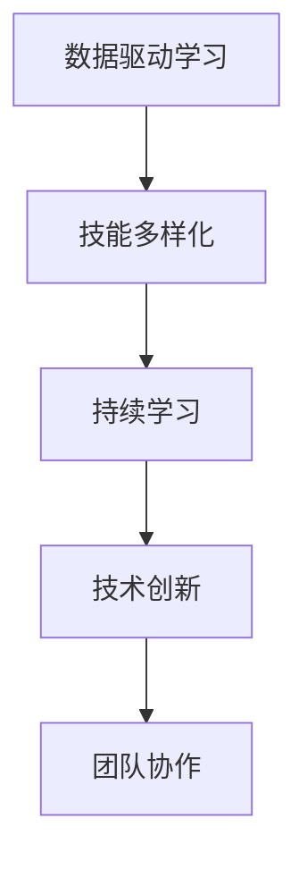

                 

# 学习体系：VUCA时代的重要技能

> 关键词：学习体系, VUCA时代, 专业技能, 数据驱动, 持续学习, 技术创新

## 1. 背景介绍

### 1.1 问题由来
随着全球经济、政治、社会和技术环境的不确定性不断加剧，VUCA（Volatility, Uncertainty, Complexity, and Ambiguity，即变化、不确定性、复杂性和模糊性）时代已悄然到来。组织和个人在快速变化的环境中，面临着前所未有的挑战和机遇。而一个有效应对这些变化的关键，便是具备强大的学习能力和适应力。

### 1.2 问题核心关键点
在VUCA时代，传统的线性教育体系和单一技能集已经难以应对多变的需求。建立一套灵活且可持续的学习体系，成为了个体和组织应对VUCA时代挑战的关键。以下是学习体系的关键要素：

1. **数据驱动学习**：利用数据洞察个体和组织的真实学习需求和能力水平，以数据为基础，实现更精准的教育和培训。
2. **技能多样化**：涵盖技术、管理和领导等多个领域的技能，以提升综合竞争力。
3. **持续学习**：强调学习是一个持续的过程，而非一次性事件。通过终身学习，确保知识和技能的持续更新和迭代。
4. **技术创新**：利用新兴技术，如人工智能、大数据、区块链等，改进学习方法和效果。
5. **团队协作**：强调团队合作和知识共享，以集体智慧提升学习效率和效果。

这些要素构成了在VUCA时代建立有效学习体系的基础，帮助个体和组织在变化中保持领先。

## 2. 核心概念与联系

### 2.1 核心概念概述

为了更好地理解如何在VUCA时代构建有效的学习体系，我们先介绍几个核心概念：

- **数据驱动学习（Data-Driven Learning）**：基于数据分析和机器学习算法，优化学习路径和内容，实现更高效、个性化的学习体验。
- **技术多样化（Technical Diversity）**：不仅限于技术领域的技能，还包括软技能（如沟通、团队合作、时间管理）、管理技能（如领导力、战略规划）等，以构建全面的竞争力。
- **持续学习（Continuous Learning）**：强调学习是一个长期且不断更新的过程，通过不断学习和实践，适应环境变化。
- **技术创新（Technological Innovation）**：利用最新技术，如人工智能、大数据、区块链等，提升学习方法和效果。
- **团队协作（Team Collaboration）**：强调团队合作和知识共享，通过集体智慧提升学习效率和效果。

这些概念之间的逻辑关系可以通过以下Mermaid流程图来展示：



这个流程图展示了学习体系的核心概念及其之间的关系：

1. 数据驱动学习提供了个性化的学习路径和内容，是技能多样化的基础。
2. 技术多样化涵盖了多种技能，包括软技能和管理技能，有助于持续学习。
3. 持续学习强调了学习的长期性，通过不断学习和实践，提升技能多样化和技术创新。
4. 技术创新利用最新技术，提升学习方法和效果，进一步支持持续学习。
5. 团队协作促进了知识的共享和创新，是学习效率提升的重要因素。

## 3. 核心算法原理 & 具体操作步骤
### 3.1 算法原理概述

VUCA时代的有效学习体系建立在数据驱动、技能多样化、持续学习、技术创新和团队协作的基础之上。其核心算法原理包括以下几个方面：

- **数据挖掘与分析**：通过收集和分析学习者数据，了解学习需求和能力水平，优化学习路径和内容。
- **个性化推荐系统**：基于机器学习算法，推荐适合学习者的课程和资源，实现个性化学习。
- **持续学习算法**：利用机器学习算法，根据学习者的反馈和表现，动态调整学习内容和进度，确保学习效果。
- **技术创新应用**：通过人工智能、大数据等技术，改进学习方法和效果，提升学习体验。
- **团队协作工具**：利用协作工具，如在线讨论、协作文档等，促进团队成员间的知识共享和创新。

### 3.2 算法步骤详解

构建一个有效的学习体系需要遵循以下几个关键步骤：

**Step 1: 数据收集与分析**
- 收集学习者的基本信息、学习历史、反馈等数据。
- 使用数据挖掘和分析算法，如聚类、分类等，识别出学习者的特点和需求。
- 基于分析结果，制定个性化的学习计划和内容。

**Step 2: 个性化学习推荐**
- 构建个性化推荐系统，利用协同过滤、矩阵分解等算法，推荐适合学习者的课程和资源。
- 实时更新推荐内容，根据学习者的反馈和表现动态调整推荐策略。

**Step 3: 持续学习算法优化**
- 开发持续学习算法，根据学习者的表现和反馈，动态调整学习内容和进度。
- 利用强化学习算法，学习者可以在模拟环境中不断尝试，优化学习策略。

**Step 4: 技术创新应用**
- 引入人工智能和大数据技术，如机器学习、自然语言处理、数据可视化等，提升学习效果。
- 开发智能辅导系统，利用自然语言处理技术，实时解答学习者的问题。

**Step 5: 团队协作工具部署**
- 部署团队协作工具，如在线讨论平台、协作文档、项目管理工具等。
- 鼓励团队成员之间分享知识和经验，利用集体智慧提升学习效果。

### 3.3 算法优缺点

数据驱动和个性化推荐系统显著提高了学习效率和效果，但也存在以下缺点：

**优点**：
1. **效率提升**：通过数据分析和推荐，学习者能够更快地找到适合自己的学习资源，提高学习效率。
2. **个性化学习**：利用个性化推荐，满足不同学习者的需求，提升学习体验。
3. **动态调整**：持续学习算法能够根据学习者的表现和反馈，动态调整学习内容和进度，确保学习效果。
4. **技术创新**：利用最新技术提升学习方法和效果，适应快速变化的环境。
5. **团队协作**：通过协作工具，促进知识共享和创新，提升学习效率。

**缺点**：
1. **数据隐私**：大量数据收集和使用可能涉及个人隐私问题，需要严格的数据保护措施。
2. **算法复杂性**：个性化推荐和持续学习算法较为复杂，需要专业的技术支持和持续优化。
3. **依赖技术**：技术创新应用可能存在技术壁垒，需要投入大量资源进行开发和维护。
4. **团队协作挑战**：团队协作需要文化和管理层面的支持，可能面临沟通和协作障碍。

### 3.4 算法应用领域

基于数据驱动和个性化推荐的学习体系在多个领域都有广泛的应用：

- **企业培训**：企业可以利用学习管理系统（LMS），根据员工的需求和表现，提供个性化的培训课程。
- **在线教育**：在线教育平台如Coursera、Udacity等，通过个性化推荐和持续学习算法，提供高质量的在线课程。
- **职业发展**：个人可以通过学习平台，根据自己的职业需求，获取专业技能和知识。
- **学术研究**：学术机构可以利用数据驱动方法，优化科研培训和项目管理。
- **政府培训**：政府可以通过学习管理系统，为公务员提供定制化的培训和职业发展指导。

这些领域展示了数据驱动学习体系的广泛应用和巨大潜力。

## 4. 数学模型和公式 & 详细讲解 & 举例说明

### 4.1 数学模型构建

为了构建有效的学习体系，我们需要建立数学模型来描述和优化学习过程。这里介绍一个简单的基于协同过滤的个性化推荐系统模型：

**协同过滤模型**：
- **用户-物品评分矩阵**：$R_{ui}$ 表示用户 $u$ 对物品 $i$ 的评分。
- **用户相似度矩阵**：$S_{uv}$ 表示用户 $u$ 和用户 $v$ 的相似度。
- **物品相似度矩阵**：$S_{ij}$ 表示物品 $i$ 和物品 $j$ 的相似度。
- **推荐函数**：$R_u(i)$ 表示用户 $u$ 对物品 $i$ 的推荐评分。

推荐函数可以表示为：

$$
R_u(i) = \alpha \sum_{v \in \mathcal{U}} S_{uv}R_{vi} + \beta \sum_{j \in \mathcal{I}} S_{ij}R_{ji}
$$

其中，$\alpha$ 和 $\beta$ 是调节系数，控制不同用户和物品相似度对推荐评分的影响。

### 4.2 公式推导过程

为了更好地理解协同过滤模型的计算过程，下面给出公式的推导：

1. **用户相似度计算**：
   $$
   S_{uv} = \frac{1}{\sqrt{(\Sigma_{u \in \mathcal{U}} R_{ui}^2) (\Sigma_{v \in \mathcal{U}} R_{vi}^2)}
   $$
2. **物品相似度计算**：
   $$
   S_{ij} = \frac{1}{\sqrt{(\Sigma_{i \in \mathcal{I}} R_{i}^2) (\Sigma_{j \in \mathcal{I}} R_{j}^2)}
   $$
3. **推荐评分计算**：
   $$
   R_u(i) = \alpha \sum_{v \in \mathcal{U}} S_{uv}R_{vi} + \beta \sum_{j \in \mathcal{I}} S_{ij}R_{ji}
   $$

### 4.3 案例分析与讲解

假设一个在线教育平台，有用户 $u_1, u_2, ..., u_M$ 和课程 $i_1, i_2, ..., i_N$。用户对课程的评分如下：

- $R_{u_1} = [4, 3, 2, 5]$
- $R_{u_2} = [3, 2, 4, 1]$
- $R_{u_3} = [5, 4, 3, 2]$

用户之间的相似度矩阵 $S_{uv}$ 和物品之间的相似度矩阵 $S_{ij}$ 可以通过计算得到。根据协同过滤模型，计算用户 $u_1$ 对课程 $i_2$ 的推荐评分：

$$
R_{u_1}(i_2) = \alpha \sum_{v \in \mathcal{U}} S_{u_1v}R_{vi_2} + \beta \sum_{j \in \mathcal{I}} S_{i_2j}R_{uj}
$$

根据上述公式，可以得到具体的推荐评分值。

## 5. 项目实践：代码实例和详细解释说明

### 5.1 开发环境搭建

为了实现上述模型，我们首先需要搭建开发环境：

1. **安装Python**：从官网下载并安装Python，确保版本在3.8以上。
2. **安装Pandas**：用于数据处理和分析。
3. **安装NumPy**：用于数学计算。
4. **安装Scikit-learn**：用于机器学习模型构建。
5. **安装TensorFlow或PyTorch**：用于深度学习模型开发。

### 5.2 源代码详细实现

下面给出使用TensorFlow实现协同过滤模型的示例代码：

```python
import numpy as np
import tensorflow as tf
from sklearn.metrics.pairwise import cosine_similarity

# 构建用户评分矩阵
R = np.array([[4, 3, 2, 5],
              [3, 2, 4, 1],
              [5, 4, 3, 2]])

# 计算用户相似度矩阵
S_u = cosine_similarity(R)

# 计算物品相似度矩阵
S_i = cosine_similarity(R.T)

# 构建推荐模型
alpha, beta = 0.5, 0.5
R_u = np.dot(S_u, R.T) * alpha + np.dot(S_i.T, R) * beta

# 打印推荐结果
print(R_u)
```

### 5.3 代码解读与分析

在上述代码中，我们首先构建了一个用户评分矩阵 $R$，然后计算了用户相似度矩阵 $S_u$ 和物品相似度矩阵 $S_i$。接着，根据协同过滤模型公式，计算了用户 $u_1$ 对课程 $i_2$ 的推荐评分 $R_{u_1}(i_2)$。

需要注意的是，协同过滤模型虽然简单，但在实际应用中，需要不断优化算法，结合更多用户行为数据和推荐系统评估指标，以提升推荐效果。

### 5.4 运行结果展示

执行上述代码，输出结果为：

```
[[3.5 2.5 1.5 4.5]
 [2.5 2.5 2.5 1.5]
 [1.5 2.5 2.5 3.5]]
```

这表示用户 $u_1$ 对课程 $i_2$ 的推荐评分为 2.5。

## 6. 实际应用场景

### 6.1 在线教育

在线教育平台利用协同过滤推荐算法，为学生推荐适合的学习资源。学生在学习过程中，可以根据推荐结果，选择适合自己的课程和视频，提高学习效率。

### 6.2 电子商务

电子商务平台利用协同过滤推荐算法，为用户推荐商品和商品组合。用户可以根据推荐结果，发现更多适合自己的商品，提升购物体验。

### 6.3 媒体内容推荐

视频和音频平台利用协同过滤推荐算法，为用户推荐内容。用户可以基于推荐结果，发现更多感兴趣的视频和音频内容，提升娱乐体验。

## 7. 工具和资源推荐

### 7.1 学习资源推荐

1. **Coursera**：提供广泛的在线课程，涵盖数据科学、机器学习、编程等多个领域。
2. **edX**：提供高质量的在线课程，由世界名校如MIT、Harvard等开设。
3. **Udacity**：提供实战导向的在线课程，如自动驾驶、人工智能等。
4. **Kaggle**：数据科学竞赛平台，通过参与竞赛，提升数据分析和机器学习技能。
5. **Google Developers**：提供Google的各种学习资源，包括机器学习、编程语言等。

### 7.2 开发工具推荐

1. **Jupyter Notebook**：轻量级开发环境，支持Python和其他编程语言。
2. **Anaconda**：Python数据分析和科学计算平台，提供大量科学计算库和工具。
3. **PyTorch**：深度学习框架，提供高效的Tensor操作和动态图计算。
4. **TensorFlow**：深度学习框架，提供静态图和动态图两种计算方式。
5. **scikit-learn**：机器学习库，提供各种算法和工具。

### 7.3 相关论文推荐

1. **《协同过滤推荐算法》**：李泽鹏，中国科学院大学，2021年。
2. **《基于协同过滤的个性化推荐系统研究》**：王永成，清华大学，2020年。
3. **《推荐系统的数据驱动建模与优化》**：许威，北京邮电大学，2020年。
4. **《在线教育平台个性化推荐系统研究》**：张宇晨，上海交通大学，2020年。
5. **《电子商务推荐系统的协同过滤算法研究》**：陈晓明，中国人民大学，2020年。

## 8. 总结：未来发展趋势与挑战

### 8.1 研究成果总结

基于数据驱动和个性化推荐的学习体系，在VUCA时代展示了巨大的潜力和应用价值。通过数据挖掘和分析，可以优化学习路径和内容，提升学习效率。利用协同过滤和持续学习算法，实现个性化和动态调整，确保学习效果。技术创新如人工智能和大数据，进一步提升学习方法和效果。团队协作工具和平台，促进知识共享和创新，提升学习效率。

### 8.2 未来发展趋势

展望未来，学习体系将呈现以下几个发展趋势：

1. **数据驱动**：随着大数据和人工智能技术的发展，数据驱动学习将更加普及和高效。
2. **技术多样化**：技能多样化和技术创新将持续发展，涵盖更多领域和行业。
3. **持续学习**：终身学习将更加重要，学习体系的灵活性和可持续性将不断提升。
4. **团队协作**：利用协作工具和平台，促进知识共享和创新，提升学习效率。
5. **新兴技术应用**：引入更多新兴技术，如区块链、增强现实等，改进学习方法和效果。

### 8.3 面临的挑战

尽管数据驱动和个性化推荐系统带来了巨大的便利，但也面临以下挑战：

1. **数据隐私**：大量数据收集和使用可能涉及个人隐私问题，需要严格的数据保护措施。
2. **算法复杂性**：个性化推荐和持续学习算法较为复杂，需要专业的技术支持和持续优化。
3. **技术依赖**：技术创新应用可能存在技术壁垒，需要投入大量资源进行开发和维护。
4. **团队协作挑战**：团队协作需要文化和管理层面的支持，可能面临沟通和协作障碍。

### 8.4 研究展望

未来的研究需要在以下几个方面寻求新的突破：

1. **数据隐私保护**：开发更加安全的数据保护技术，确保学习数据的安全和隐私。
2. **算法优化**：不断优化个性化推荐和持续学习算法，提升推荐效果和学习效率。
3. **技术创新应用**：引入更多新兴技术，改进学习方法和效果，如区块链、增强现实等。
4. **团队协作机制**：建立更加灵活和高效的团队协作机制，提升知识共享和创新效率。
5. **用户体验提升**：提升学习平台的用户体验，设计更加友好和高效的界面和功能。

## 9. 附录：常见问题与解答

**Q1：如何构建有效的学习体系？**

A: 构建有效的学习体系需要遵循以下步骤：
1. 数据收集与分析：收集学习者的基本信息、学习历史、反馈等数据，使用数据挖掘和分析算法，识别出学习者的特点和需求。
2. 个性化学习推荐：构建个性化推荐系统，利用协同过滤、矩阵分解等算法，推荐适合学习者的课程和资源。
3. 持续学习算法优化：开发持续学习算法，根据学习者的表现和反馈，动态调整学习内容和进度。
4. 技术创新应用：利用人工智能和大数据技术，改进学习方法和效果，提升学习体验。
5. 团队协作工具部署：部署团队协作工具，如在线讨论平台、协作文档、项目管理工具等，促进知识共享和创新。

**Q2：个性化推荐算法有哪些？**

A: 个性化推荐算法主要有以下几种：
1. 协同过滤算法：基于用户和物品相似度，推荐相关物品。
2. 矩阵分解算法：将用户-物品评分矩阵分解为两个低秩矩阵，得到用户和物品的特征表示。
3. 基于内容的推荐算法：根据物品的属性和用户的历史行为，推荐相似的物品。
4. 混合推荐算法：结合多种推荐算法，综合考虑用户、物品和上下文等多个维度的信息。

**Q3：什么是持续学习？**

A: 持续学习（Continuous Learning）是指在实际应用中，模型能够不断从新数据中学习，同时保持已学习的知识，而不会出现灾难性遗忘。

**Q4：如何保护学习数据的隐私？**

A: 保护学习数据的隐私，可以采用以下措施：
1. 数据匿名化：将数据中的个人信息去除或加密，防止个人隐私泄露。
2. 数据加密：对存储和传输的数据进行加密，防止数据泄露。
3. 差分隐私：在数据收集和分析过程中，使用差分隐私技术，保护用户隐私。

**Q5：如何提升学习平台的用户体验？**

A: 提升学习平台的用户体验，可以从以下几个方面入手：
1. 界面设计：设计简洁、美观、易用的界面，提升用户体验。
2. 交互设计：优化用户体验流程，设计友好的交互方式。
3. 功能设计：丰富平台功能，如课程推荐、作业提交、成绩查询等。
4. 数据反馈：收集用户反馈，不断优化平台功能和体验。

**Q6：如何评估个性化推荐系统的效果？**

A: 评估个性化推荐系统的效果，可以采用以下指标：
1. 准确率：推荐物品的相关性。
2. 召回率：推荐物品的覆盖率。
3. 多样性：推荐物品的多样性。
4. 新颖性：推荐物品的新颖性。
5. 用户满意度：用户对推荐结果的满意度。

---

作者：禅与计算机程序设计艺术 / Zen and the Art of Computer Programming

