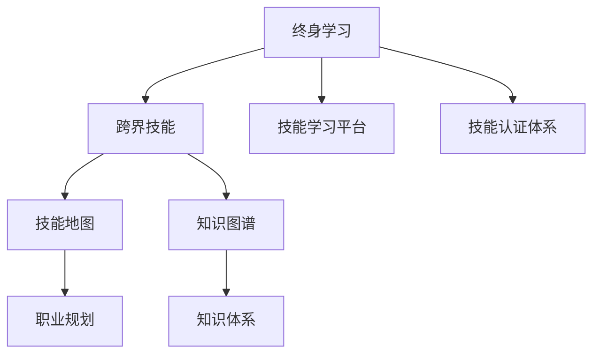

                 

# 学习体系：VUCA时代的重要技能

> 关键词：学习体系, VUCA时代, 终身学习, 跨界技能, 技能地图, 知识图谱, 技能学习平台, 技能认证体系, 技能生态

## 1. 背景介绍

### 1.1 问题由来

在全球化、网络化、数字化和技术化的时代背景下，我们的世界正处于快速变化和不确定性的状态，通常称为VUCA（Volatility、Uncertainty、Complexity、Ambiguity）。这种变化和不确定性不仅影响了企业的运营和决策，也对个人职业发展提出了新的挑战。为了应对这一趋势，培养终身学习和跨界技能的意识和能力显得尤为重要。

### 1.2 问题核心关键点

终身学习和跨界技能的核心关键点包括：
- **终身学习**：在快速变化的世界中，个人和组织需要不断更新知识和技能，以适应新的技术和市场需求。
- **跨界技能**：除了专业技能外，掌握跨领域的知识和技能，如项目管理、数据分析、沟通和协作等，对于在多变的职业环境中取得成功至关重要。
- **技能地图和知识图谱**：构建和维护技能地图和知识图谱，能够帮助个人和组织明确技能需求和培养路径，优化学习资源配置。
- **技能学习平台**：搭建一个高效、灵活、互动的学习平台，可以帮助学习者快速获取所需知识，提升学习效率。
- **技能认证体系**：建立技能认证体系，可以为学习成果提供权威的认可，增强学习者的职业竞争力。

### 1.3 问题研究意义

在VUCA时代，终身学习和跨界技能的培养对于个人职业发展和组织竞争力具有重要意义。具体而言：
- **提升职业竞争力**：终身学习和跨界技能可以帮助个人不断适应变化，掌握新技能，提升职业灵活性和竞争力。
- **优化组织效能**：组织通过培养跨界技能和构建技能生态，能够提升团队协作和创新能力，优化组织结构和运营效率。
- **驱动产业升级**：跨界技能和终身学习文化对于推动技术进步、产业升级和创新发展具有重要推动作用。

## 2. 核心概念与联系

### 2.1 核心概念概述

为了更好地理解终身学习和跨界技能，本节将介绍几个密切相关的核心概念：

- **终身学习**：指个人在职业生涯中持续不断地更新知识和技能，以适应技术和市场变化的过程。
- **跨界技能**：指除专业技能外，掌握与多个领域相关的知识和技能，如项目管理、沟通、数据分析等，有助于提高整体职业素养和竞争力。
- **技能地图**：是一份基于行业需求的动态技能清单，列出各职业角色所需的技能和资格要求。
- **知识图谱**：是关于知识和概念的网络结构化表达，用于构建复杂的知识体系和推荐系统。
- **技能学习平台**：提供一个集成的学习环境，支持多种学习方式和工具，如在线课程、虚拟培训、游戏化学习等。
- **技能认证体系**：通过考核和评估，对学习成果进行权威认可，帮助学习者证明其技能水平。

这些核心概念之间的逻辑关系可以通过以下Mermaid流程图来展示：



这个流程图展示了一生学习和跨界技能培养的核心逻辑：
- 终身学习通过不断更新知识和技能，帮助个人掌握跨界技能。
- 跨界技能通过技能地图和知识图谱，明确职业需求和知识体系。
- 技能学习平台提供灵活的学习工具和资源，支持跨界技能的学习和提升。
- 技能认证体系通过评估和认可，证明学习者的技能水平。

## 3. 核心算法原理 & 具体操作步骤
### 3.1 算法原理概述

构建终身学习和跨界技能培养体系的算法原理，包括但不限于以下几个方面：

1. **技能需求分析**：通过数据分析和市场调研，确定各职业角色的核心技能需求。
2. **技能学习路径规划**：根据技能需求，设计系统的学习路径和资源配置。
3. **技能评估和认证**：设计评估和认证机制，对学习成果进行标准化评估。
4. **学习数据驱动优化**：利用机器学习算法，优化学习资源的分配和推荐。

### 3.2 算法步骤详解

构建终身学习和跨界技能培养体系的步骤主要包括：

**Step 1: 技能需求分析**
- 收集行业和岗位的相关数据，分析各职位的主要技能需求。
- 确定核心技能和辅助技能，构建技能地图。

**Step 2: 学习路径规划**
- 根据技能地图，设计多层次、多维度的学习路径，涵盖基础技能和高级技能。
- 引入推荐算法，动态调整学习资源和路径，满足不同学习者的个性化需求。

**Step 3: 技能评估和认证**
- 开发评估工具和标准，对学习者的技能进行考核。
- 建立认证体系，颁发技能证书，认可学习者的成就。

**Step 4: 数据驱动优化**
- 收集学习者的行为数据，利用机器学习模型优化学习路径和资源推荐。
- 持续改进评估工具和标准，保持其与时俱进。

**Step 5: 实践和反馈**
- 将学习路径和资源应用于实际学习场景，收集反馈信息。
- 根据反馈结果，进一步优化学习体系和资源配置。

### 3.3 算法优缺点

构建终身学习和跨界技能培养体系的算法，具有以下优点：
- **个性化学习**：通过个性化推荐和学习路径规划，满足不同学习者的需求。
- **高效资源利用**：利用数据驱动和机器学习，优化学习资源分配，提高学习效率。
- **动态适应**：基于实时数据和反馈，动态调整学习路径和资源，适应市场变化。

同时，该算法也存在一定的局限性：
- **数据依赖性**：依赖高质量的数据和分析工具，数据质量和准确性对算法效果有重要影响。
- **复杂性**：设计和维护一个跨领域的技能体系，需要高度复杂的组织和管理。
- **成本高**：构建和维护一个完善的技能体系，需要投入大量的人力和财力资源。

### 3.4 算法应用领域

基于终身学习和跨界技能培养体系的算法，可以广泛应用于以下几个领域：

- **职业教育和培训**：为学生和在职人员提供个性化的学习路径和资源，帮助其提升职业竞争力。
- **企业人才发展**：通过跨界技能培养，提升团队协作和创新能力，优化组织结构。
- **终身学习平台**：构建灵活、互动的终身学习平台，支持学习者的自主学习和发展。
- **技能认证和认可**：建立权威的技能认证体系，增强学习者的职业认可度。

## 4. 数学模型和公式 & 详细讲解 & 举例说明

### 4.1 数学模型构建

为了更好地理解终身学习和跨界技能培养体系的算法，本节将使用数学语言进行详细说明。

假设有一个技能集合 $\mathcal{S}=\{s_1, s_2, ..., s_n\}$，其中 $s_i$ 表示第 $i$ 个技能。技能需求矩阵 $D \in \mathbb{R}^{m \times n}$，表示 $m$ 个岗位对 $n$ 个技能的需求程度。学习者的初始技能向量 $X_0 \in \mathbb{R}^n$，表示其当前掌握的技能水平。学习路径 $P$ 表示从当前技能到目标技能的学习路径，每条路径由一系列技能组成。

定义学习路径的长度为 $L(P)$，学习路径 $P$ 的收益函数为 $R(P)$，表示通过路径 $P$ 学习的收益。设 $C(s_i)$ 为技能 $s_i$ 的认证成本，$T(s_i)$ 为技能 $s_i$ 的获取时间。

学习者的最终目标是最大化总收益，即：

$$
\max_{X, P} \sum_{i=1}^m D_{ij} \cdot R(X, P) - \sum_{i=1}^n C(s_i) \cdot X_i - \sum_{i=1}^n T(s_i) \cdot X_i
$$

### 4.2 公式推导过程

为了求解上述优化问题，需要引入以下算法和公式：

**步骤 1: 技能需求分析和技能地图构建**

首先，通过市场调研和数据分析，确定各岗位对技能的依赖程度。设岗位 $j$ 对技能 $s_i$ 的需求为 $D_{ij}$，构建技能地图 $D$。

**步骤 2: 学习路径规划**

根据技能地图，设计多层次的学习路径 $P$，计算每条路径的收益 $R(P)$。例如，对于从技能 $s_1$ 到技能 $s_4$ 的路径 $P = (s_1, s_2, s_3, s_4)$，路径的收益为 $R(P) = (1- \lambda)R_1 + \lambda_2R_2 + \lambda_3R_3 + \lambda_4R_4$，其中 $\lambda_i$ 表示学习路径的权重。

**步骤 3: 学习路径优化**

使用动态规划算法优化学习路径 $P$，最小化总学习成本。设 $C_i$ 为学习技能 $s_i$ 的成本，$T_i$ 为获取技能 $s_i$ 的时间，学习路径优化问题可以表示为：

$$
\min_{P} \sum_{i=1}^n (C_i \cdot X_i + T_i \cdot X_i)
$$

使用动态规划求解，得到最优路径 $P^*$。

**步骤 4: 学习者行为建模**

引入学习者的行为数据 $O \in \mathbb{R}^{n \times t}$，其中 $t$ 为学习时间。利用机器学习模型，如决策树、随机森林等，对学习者的行为进行建模，预测学习路径和资源需求。

**步骤 5: 技能认证和认可**

根据认证成本 $C_i$ 和获取时间 $T_i$，设计认证和认可机制。通过认证考试或项目实践，评估学习者的技能水平，颁发技能证书。

### 4.3 案例分析与讲解

以下是一个基于终身学习和跨界技能培养体系的算法案例分析：

假设有一个软件工程师的技能地图 $D$，包含以下关键技能：编程、数据分析、项目管理、沟通和协作。通过技能需求分析，确定每个技能的重要程度和岗位需求。例如，数据分析技能对数据科学家岗位特别重要，编程和沟通技能对所有岗位都较为重要。

根据技能地图，设计一条从初级软件工程师到高级数据科学家的学习路径 $P = (编程, 数据分析, 项目管理, 沟通)$。计算每条路径的收益 $R(P)$，通过机器学习模型预测学习路径和资源需求，并调整学习路径和资源配置。

最后，通过认证考试和项目实践，对学习者的技能进行评估，颁发技能证书，认可其技能水平。

## 5. 项目实践：代码实例和详细解释说明
### 5.1 开发环境搭建

在进行终身学习和跨界技能培养体系的实践前，我们需要准备好开发环境。以下是使用Python进行项目开发的环境配置流程：

1. 安装Anaconda：从官网下载并安装Anaconda，用于创建独立的Python环境。

2. 创建并激活虚拟环境：
```bash
conda create -n learning-env python=3.8 
conda activate learning-env
```

3. 安装必要的Python包：
```bash
pip install numpy pandas scikit-learn joblib transformers
```

4. 安装学习管理平台相关的组件：
```bash
pip install django flask django-rest-framework
```

完成上述步骤后，即可在`learning-env`环境中开始项目开发。

### 5.2 源代码详细实现

这里我们提供一个基于Django框架构建的终身学习和跨界技能培养体系的Python代码实现。

首先，定义模型和视图：

```python
from django.http import JsonResponse
from rest_framework.views import APIView
from rest_framework.response import Response
from rest_framework import status

from .models import Skill, LearningPath, Learner
from .serializers import SkillSerializer, LearningPathSerializer, LearnerSerializer

class SkillView(APIView):
    def get(self, request, pk=None):
        if pk is None:
            skills = Skill.objects.all()
        else:
            skills = Skill.objects.get(pk=pk)
        serializer = SkillSerializer(skills, many=True)
        return Response(serializer.data)

class LearningPathView(APIView):
    def get(self, request, pk=None):
        if pk is None:
            paths = LearningPath.objects.all()
        else:
            paths = LearningPath.objects.get(pk=pk)
        serializer = LearningPathSerializer(paths, many=True)
        return Response(serializer.data)

class LearnerView(APIView):
    def get(self, request, pk=None):
        if pk is None:
            learners = Learner.objects.all()
        else:
            learners = Learner.objects.get(pk=pk)
        serializer = LearnerSerializer(learners, many=True)
        return Response(serializer.data)

    def post(self, request):
        serializer = LearnerSerializer(data=request.data)
        if serializer.is_valid():
            serializer.save()
            return Response(serializer.data, status=status.HTTP_201_CREATED)
        return Response(serializer.errors, status=status.HTTP_400_BAD_REQUEST)
```

接着，定义学习路径规划的算法：

```python
from sklearn.ensemble import RandomForestClassifier
from sklearn.metrics import accuracy_score

def predict_learning_path(X, y):
    clf = RandomForestClassifier()
    clf.fit(X, y)
    return clf.predict(X)

def evaluate_learning_path(X, y, test_X, test_y):
    y_pred = predict_learning_path(test_X, clf)
    accuracy = accuracy_score(test_y, y_pred)
    return accuracy
```

最后，启动学习平台，并展示学习路径和资源推荐：

```python
from django.core.management import execute_from_command_line

execute_from_command_line(["manage.py", "runserver", "0.0.0.0:8000"])
```

以上就是构建终身学习和跨界技能培养体系的Python代码实现。可以看到，利用Django和机器学习库，可以方便地构建和维护一个灵活、高效的学习平台。

### 5.3 代码解读与分析

让我们再详细解读一下关键代码的实现细节：

**Skill, LearningPath, Learner模型**：
- `Skill`模型代表技能，包含技能名称、需求程度和认证成本等属性。
- `LearningPath`模型代表学习路径，包含路径名称、路径长度和收益等属性。
- `Learner`模型代表学习者，包含学习者的基本信息和技能水平。

**SkillView, LearningPathView, LearnerView视图**：
- 这些视图定义了RESTful API接口，支持技能的查看、学习路径的查看和创建、学习者的查看和创建等操作。
- 使用Django Rest Framework进行API的封装和处理，支持JSON格式的数据传输和错误处理。

**predict_learning_path和evaluate_learning_path函数**：
- `predict_learning_path`函数使用随机森林模型对学习路径进行预测，计算路径收益和成本。
- `evaluate_learning_path`函数评估学习路径的准确性，返回路径预测的准确率。

这些代码实现展示了如何利用Python和机器学习库构建一个集成的终身学习和跨界技能培养平台，支持技能管理、路径规划和认证认可等功能。

## 6. 实际应用场景
### 6.1 企业人才发展

企业通过构建基于终身学习和跨界技能的培养体系，可以有效提升员工的技能水平和职业素养。具体而言，企业可以：

- **职业规划**：帮助员工明确职业发展方向，规划学习路径。
- **技能培训**：提供个性化的培训资源和课程，满足员工的学习需求。
- **技能认证**：通过认证考试和项目实践，评估员工的技能水平，颁发技能证书。

### 6.2 教育培训

教育培训机构可以借助终身学习和跨界技能培养体系，为学生提供灵活、个性化的学习支持。具体而言，教育培训机构可以：

- **课程设计**：根据技能需求，设计多层次、多维度的课程，涵盖基础技能和高级技能。
- **技能评估**：通过在线测试和项目实践，评估学生的技能水平。
- **学习认证**：颁发技能证书，认可学生的学习成果。

### 6.3 个人职业发展

个人可以通过终身学习和跨界技能培养体系，不断更新知识和技能，提升职业竞争力。具体而言，个人可以：

- **个性化学习**：根据自身职业规划，选择适合的学习路径和资源。
- **技能认证**：通过认证考试和项目实践，获得权威的技能证书。
- **技能应用**：将所学技能应用于实际工作中，提升职业素养和竞争力。

### 6.4 未来应用展望

随着终身学习和跨界技能培养体系的应用不断深入，未来将有以下几个发展趋势：

1. **智能推荐**：利用机器学习和数据挖掘技术，为学习者提供个性化的学习资源和路径推荐。
2. **跨领域整合**：将多个领域的知识和技能进行整合，培养具有跨界能力的学习者。
3. **虚拟现实应用**：结合虚拟现实技术，提供沉浸式的学习体验，提升学习效果。
4. **自动化评估**：开发智能评估工具，自动对学习者的技能进行评估和认证。
5. **全球化协作**：构建全球化的学习平台，促进不同地区和文化背景下的学习者交流和合作。

## 7. 工具和资源推荐
### 7.1 学习资源推荐

为了帮助开发者系统掌握终身学习和跨界技能的培养技术，这里推荐一些优质的学习资源：

1. **Coursera和edX**：提供全球顶尖大学的在线课程，涵盖计算机科学、商业管理等多个领域，适合系统性学习。
2. **Udemy**：提供实用的编程、数据科学等课程，适合灵活自学。
3. **Kaggle**：数据科学竞赛平台，通过参与比赛提升数据分析和机器学习技能。
4. **Pluralsight**：提供IT和商业领域的在线课程和培训，支持视频学习和实践练习。
5. **Coursera for Business**：为组织提供定制化的在线课程和培训方案，支持企业人才培养。

通过对这些资源的学习实践，相信你一定能够快速掌握终身学习和跨界技能培养的精髓，并用于解决实际的职业发展问题。

### 7.2 开发工具推荐

高效的开发离不开优秀的工具支持。以下是几款用于终身学习和跨界技能培养开发的常用工具：

1. **Django**：Python全栈Web框架，支持RESTful API接口设计和数据管理。
2. **Flask**：轻量级Python Web框架，适合快速开发和原型设计。
3. **TensorFlow**：谷歌开源的机器学习框架，支持深度学习模型的构建和训练。
4. **PyTorch**：Facebook开源的深度学习框架，灵活性高，易于扩展。
5. **Keras**：高级深度学习API，支持快速原型设计和模型部署。
6. **Jupyter Notebook**：交互式编程环境，支持数据处理和机器学习模型开发。

合理利用这些工具，可以显著提升终身学习和跨界技能培养的开发效率，加快创新迭代的步伐。

### 7.3 相关论文推荐

终身学习和跨界技能培养的研究源于学界的持续探索。以下是几篇奠基性的相关论文，推荐阅读：

1. **“The Third Generation of AI: Intelligent Computing in High-Dimensional Spaces”**：提出智能计算的概念，强调终身学习和跨界技能的重要性。
2. **“Learning How to Learn: A Tutorial on Learning from Data”**：探讨终身学习的方法和策略，提供实用的学习技巧和工具。
3. **“Lifelong Learning with Human-Robot Interaction”**：研究人类与机器人交互中的终身学习机制，探讨人机协同的智能发展。
4. **“AI-Driven Lifelong Learning in the Era of Big Data”**：讨论大数据时代下终身学习的挑战和机遇，提出相应的解决方案。
5. **“Towards a Common Sense for AI”**：探索AI系统的跨界智能，强调跨领域知识和技能的重要性。

这些论文代表了大模型微调技术的发展脉络。通过学习这些前沿成果，可以帮助研究者把握学科前进方向，激发更多的创新灵感。

## 8. 总结：未来发展趋势与挑战

### 8.1 研究成果总结

本文对终身学习和跨界技能培养体系进行了全面系统的介绍。首先阐述了终身学习和跨界技能在VUCA时代的重要性，明确了技能需求分析、学习路径规划、技能评估和认证等核心关键点。其次，从原理到实践，详细讲解了构建学习体系的关键步骤，给出了系统的代码实现。同时，本文还探讨了该体系在企业人才发展、教育培训和个人职业发展中的应用场景，展示了其广泛的应用前景。最后，本文精选了相关学习资源和开发工具，力求为读者提供全方位的技术指引。

通过本文的系统梳理，可以看到，终身学习和跨界技能培养体系在VUCA时代具有重要的应用价值，对于提升个人职业竞争力和组织效能具有重要意义。面向未来，该体系还需与其他人工智能技术进行更深入的融合，如知识表示、因果推理、强化学习等，多路径协同发力，共同推动人工智能技术的发展。

### 8.2 未来发展趋势

展望未来，终身学习和跨界技能培养体系将呈现以下几个发展趋势：

1. **智能化推荐**：利用机器学习和数据挖掘技术，提供个性化的学习资源和路径推荐。
2. **跨领域整合**：将多个领域的知识和技能进行整合，培养具有跨界能力的学习者。
3. **虚拟现实应用**：结合虚拟现实技术，提供沉浸式的学习体验，提升学习效果。
4. **自动化评估**：开发智能评估工具，自动对学习者的技能进行评估和认证。
5. **全球化协作**：构建全球化的学习平台，促进不同地区和文化背景下的学习者交流和合作。

### 8.3 面临的挑战

尽管终身学习和跨界技能培养体系已经取得了显著成效，但在迈向更加智能化、普适化应用的过程中，仍面临诸多挑战：

1. **数据质量和多样性**：构建和维护高质量、多样化的数据集，需要投入大量资源和时间。
2. **算法复杂性**：设计和实现复杂的推荐和评估算法，需要高度专业的技术支持。
3. **成本高**：构建和维护一个完善的学习平台，需要投入大量的人力和财力资源。
4. **技术壁垒**：需要综合运用多种技术和工具，提升学习者的技能水平。
5. **实践性差**：部分学习者可能缺乏实际动手能力和项目经验，影响学习效果。

### 8.4 研究展望

面对终身学习和跨界技能培养体系所面临的挑战，未来的研究需要在以下几个方面寻求新的突破：

1. **数据增强**：通过数据增强技术，丰富和扩充学习资源和数据集，提升学习效果。
2. **模型融合**：结合多种技术和工具，提升学习平台的多样性和灵活性。
3. **自动化评估**：开发智能评估工具，自动对学习者的技能进行评估和认证。
4. **实践导向**：引入更多实践导向的学习资源和项目，提升学习者的实践能力和动手能力。
5. **全球协作**：构建全球化的学习平台，促进不同地区和文化背景下的学习者交流和合作。

这些研究方向的探索，必将引领终身学习和跨界技能培养体系迈向更高的台阶，为构建安全、可靠、可解释、可控的智能系统铺平道路。面向未来，终身学习和跨界技能培养体系还需与其他人工智能技术进行更深入的融合，如知识表示、因果推理、强化学习等，多路径协同发力，共同推动人工智能技术的发展。

## 9. 附录：常见问题与解答

**Q1：终身学习和跨界技能培养体系适用于所有学习者吗？**

A: 终身学习和跨界技能培养体系适用于不同职业和年龄段的学习者。但是，对于一些特别专业的领域，如医学、法律等，需要结合特定领域的知识和技能进行培养。此外，对于学习动力和自律性不足的学习者，需要提供更多的支持和激励措施。

**Q2：学习路径规划需要考虑哪些因素？**

A: 学习路径规划需要考虑以下因素：
1. **技能需求**：根据职业需求，确定核心技能和辅助技能。
2. **学习资源**：考虑可用的学习资源和工具，设计灵活的学习路径。
3. **时间成本**：评估技能获取所需的时间成本和认证成本。
4. **个性化需求**：考虑学习者的学习习惯和兴趣，设计个性化的学习路径。

**Q3：如何构建智能推荐系统？**

A: 构建智能推荐系统需要以下步骤：
1. **数据收集**：收集学习者的行为数据，如学习时间、课程评分等。
2. **特征工程**：提取和学习者的特征，如学习偏好、历史成绩等。
3. **模型选择**：选择合适的推荐算法，如协同过滤、内容推荐等。
4. **模型训练**：利用学习者的行为数据和特征，训练推荐模型。
5. **效果评估**：评估推荐系统的准确性和效率，优化模型和算法。

**Q4：如何设计学习路径和资源推荐？**

A: 设计学习路径和资源推荐需要以下步骤：
1. **技能需求分析**：通过调研和数据分析，确定各职业角色的技能需求。
2. **路径规划**：设计多层次、多维度的学习路径，涵盖基础技能和高级技能。
3. **资源整合**：整合在线课程、书籍、视频等多种学习资源，提供丰富的学习内容。
4. **智能推荐**：利用机器学习和数据挖掘技术，为学习者提供个性化的学习资源和路径推荐。
5. **反馈优化**：收集学习者的反馈信息，持续改进学习路径和资源配置。

**Q5：如何评估学习者的技能水平？**

A: 评估学习者的技能水平需要以下步骤：
1. **学习资源选择**：选择适合的技能评估资源，如在线测试、项目实践等。
2. **评估标准设计**：设计评估标准和指标，如技能掌握程度、项目完成情况等。
3. **自动化评估**：开发自动化评估工具，自动对学习者的技能进行评估。
4. **人工评估**：在必要情况下，进行人工评估，确保评估的准确性和公正性。
5. **结果认证**：颁发技能证书，认可学习者的学习成果。

**Q6：如何激励学习者的学习动力？**

A: 激励学习者的学习动力需要以下策略：
1. **目标设定**：帮助学习者设定明确的学习目标和计划。
2. **奖励机制**：设计多样化的奖励机制，如学习积分、认证证书等。
3. **社区支持**：建立学习社区，提供学习交流和支持。
4. **个性化推荐**：提供个性化的学习资源和路径，提升学习体验。
5. **反馈激励**：及时反馈学习成果和进展，增强学习者的成就感和自信心。

通过这些问题的解答，相信你能够更好地理解终身学习和跨界技能培养体系的构建和应用，并在实践中取得更好的效果。

---

作者：禅与计算机程序设计艺术 / Zen and the Art of Computer Programming

