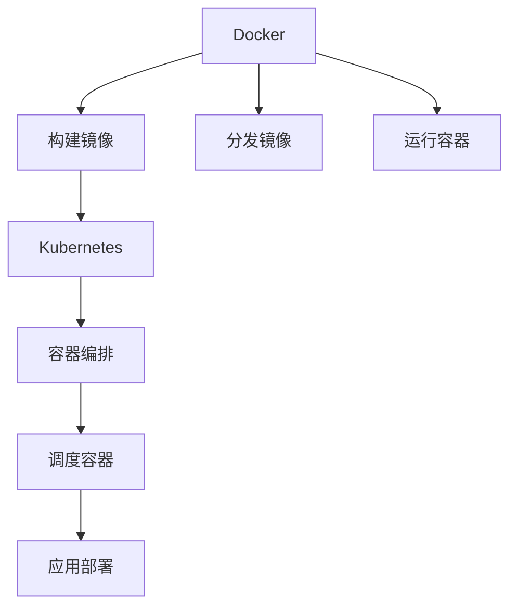

                 

# 容器化技术探索：Docker 和 Kubernetes 的应用

> 关键词：容器化，Docker，Kubernetes，应用场景，微服务，DevOps，自动化，容器编排，容器镜像管理

## 1. 背景介绍

### 1.1 问题由来

随着软件开发的日益复杂化，企业需要管理大量的应用程序和服务。传统的方法包括使用虚拟机(Virtual Machine, VM)进行部署，但这种方法存在资源浪费、管理复杂度高、扩展性差等问题。为解决这些问题，容器化技术应运而生，其核心思想是将应用程序和其依赖打包在一个独立运行的容器中，避免了因不同环境导致的运行问题。

Docker和Kubernetes是容器化技术的两个重要组成部分，分别负责容器的构建和管理。Docker负责将应用程序打包成镜像，Kubernetes负责调度和管理这些容器。这两项技术协同作用，极大地简化了软件开发和运维流程，使得应用程序的部署、升级、扩展和监控变得更为高效和可靠。

### 1.2 问题核心关键点

容器化技术的发展可以追溯到云计算时代的兴起。当时，为了更好地管理虚拟机，业界提出了虚拟化技术，即将一台物理机虚拟成多个逻辑虚拟机，每个虚拟机运行不同的应用程序。但虚拟化技术仍存在资源利用率低、管理复杂度高、扩展性差等问题。随着技术的进步，容器化技术逐渐替代了虚拟化技术，成为云计算和微服务架构的核心支撑。

容器化技术的优势包括：

- **轻量级**：每个容器仅包含应用程序运行所需的文件，大大减少了资源占用。
- **独立性**：容器内的应用程序和其依赖是独立的，可以在任何支持的平台上运行。
- **可移植性**：容器和其依赖可以在不同环境间自由移动，使得开发和运维变得更加方便。
- **自动化**：容器化技术配合CI/CD流水线，可以实现自动化部署、回滚和更新。

## 2. 核心概念与联系

### 2.1 核心概念概述

容器化技术包括Docker和Kubernetes两个核心概念。

- **Docker**：开源容器化平台，用于构建、分发和管理应用程序的容器镜像。
- **Kubernetes**：开源容器编排平台，用于部署、扩展和管理容器集群。

Docker和Kubernetes的工作原理及它们之间的联系可通过以下Mermaid流程图来展示：



Docker主要负责容器镜像的构建和分发，使得应用程序和其依赖能够快速、一致地部署在任何支持的环境中。Kubernetes负责容器的编排和调度，使得多个容器能够协同工作，实现高可用和高扩展性。

## 3. 核心算法原理 & 具体操作步骤

### 3.1 算法原理概述

Docker和Kubernetes的核心算法原理主要包括：

- **Docker的容器镜像构建算法**：通过分层构建技术，将应用程序和其依赖打包成多个分层镜像，每个层只包含发生变化的部分，提高了构建效率和镜像大小。
- **Kubernetes的容器编排算法**：通过编排算法，将多个容器协同工作，实现负载均衡、资源分配和自愈等功能。

### 3.2 算法步骤详解

#### 3.2.1 Docker容器镜像构建

1. **编写Dockerfile**：
   ```Dockerfile
   # 使用基础镜像
   FROM ubuntu:20.04
   
   # 安装依赖
   RUN apt-get update && apt-get install -y \
       curl \
       git
   
   # 设置工作目录
   WORKDIR /usr/src/app
   
   # 复制代码
   COPY . /usr/src/app
   
   # 构建应用程序
   RUN cd /usr/src/app && npm install && npm run build
   
   # 设置容器名
   ENV NAME myapp
   
   # 设置环境变量
   ENV PORT 3000
   
   # 设置容器启动命令
   CMD [ "npm", "start" ]
   ```

2. **构建镜像**：
   ```bash
   docker build -t myapp .
   ```

3. **推送镜像**：
   ```bash
   docker push myapp:latest
   ```

#### 3.2.2 Kubernetes容器编排

1. **编写Kubernetes Deployment文件**：
   ```yaml
   apiVersion: apps/v1
   kind: Deployment
   metadata:
     name: myapp
     labels:
       app: myapp
   spec:
     replicas: 3
     selector:
       matchLabels:
         app: myapp
     template:
       metadata:
         labels:
           app: myapp
       spec:
         image: myapp:latest
         containers:
         - name: myapp
           image: myapp:latest
           ports:
           - containerPort: 3000
   ```

2. **部署应用**：
   ```bash
   kubectl apply -f deployment.yaml
   ```

3. **查看应用状态**：
   ```bash
   kubectl get pods
   ```

### 3.3 算法优缺点

Docker和Kubernetes作为容器化技术的核心，具有以下优缺点：

**优点**：

- **一致性**：容器化技术确保了应用程序在任何环境中的运行一致性，避免了因不同环境导致的运行问题。
- **快速部署**：Docker的快速构建和分发功能使得应用程序的部署变得高效。
- **高可用性**：Kubernetes的负载均衡和自愈功能使得容器集群具有高可用性。
- **高扩展性**：通过Kubernetes的自动扩展功能，可以根据需求动态调整容器数量。

**缺点**：

- **复杂性**：容器化技术的部署和管理需要一定的复杂度，需要掌握一定的DevOps技能。
- **学习曲线陡峭**：Docker和Kubernetes的学习曲线较陡峭，需要一定的学习成本。
- **资源消耗**：容器化技术的资源消耗相对较高，特别是网络、存储等方面。
- **依赖性**：Docker和Kubernetes需要依赖特定的容器编排和分发平台，扩展性受到一定的限制。

## 4. 数学模型和公式 & 详细讲解 & 举例说明

### 4.1 数学模型构建

容器化技术主要涉及容器镜像的构建和管理，因此不存在复杂的数学模型。不过，为了更好地理解容器镜像构建的原理，我们可以通过一个简单的例子来说明。

假设我们要构建一个包含Node.js和Express框架的应用程序。步骤如下：

1. 编写Dockerfile，定义应用程序的构建过程：
   ```Dockerfile
   # 使用基础镜像
   FROM node:14
   
   # 设置工作目录
   WORKDIR /app
   
   # 复制代码
   COPY . /app
   
   # 安装依赖
   RUN npm install express --save
   
   # 设置应用程序的入口点
   EXPOSE 3000
   CMD ["node", "app.js"]
   ```

2. 构建镜像：
   ```bash
   docker build -t myapp .
   ```

3. 运行容器：
   ```bash
   docker run -p 3000:3000 myapp
   ```

### 4.2 公式推导过程

容器镜像构建的原理主要基于分层构建技术。每层镜像只包含发生变化的部分，因此构建过程可以高效地进行。假设我们有一个包含多个文件的Dockerfile：

```Dockerfile
FROM ubuntu:20.04
COPY package1 /
COPY package2 /package1/
RUN install_package1
COPY package3 /package1/
RUN install_package2
COPY package4 /package1/
RUN install_package3
```

在构建过程中，Docker会按层逐个构建镜像。第一层镜像包含`ubuntu:20.04`和`package1`的复制，第二层镜像包含`package1`的安装，第三层镜像包含`package2`的复制和安装，第四层镜像包含`package3`的复制和安装，第五层镜像包含`package4`的复制和安装。这样，构建过程可以高效地进行，且镜像大小不会过大。

### 4.3 案例分析与讲解

#### 4.3.1 案例描述

假设我们要构建一个包含Nginx服务器的容器镜像。步骤如下：

1. 编写Dockerfile，定义Nginx的构建过程：
   ```Dockerfile
   # 使用基础镜像
   FROM nginx
   
   # 设置工作目录
   WORKDIR /etc/nginx
   
   # 复制配置文件
   COPY nginx.conf /etc/nginx/nginx.conf
   
   # 设置Nginx的配置
   ENV NGINX_CONFIG /etc/nginx/nginx.conf
   
   # 设置容器启动命令
   CMD ["nginx", "-g", "daemon off;"]
   ```

2. 构建镜像：
   ```bash
   docker build -t nginx .
   ```

3. 运行容器：
   ```bash
   docker run -d -p 80:80 nginx
   ```

通过这个例子，可以看到容器镜像构建的基本过程。Dockerfile定义了构建步骤，每一步都会生成一个新的镜像层。构建完成后，Docker会压缩这些镜像层并生成最终的容器镜像。

## 5. 项目实践：代码实例和详细解释说明

### 5.1 开发环境搭建

在进行容器化实践前，需要先搭建好开发环境。以下是使用Docker和Kubernetes进行项目开发的常用环境配置流程：

1. 安装Docker：从官网下载并安装Docker，确保Docker版本支持Kubernetes。
2. 安装Kubernetes：使用Minikube或Kubernetes集群，可以使用Google Kubernetes Engine(GKE)、Amazon EKS、阿里云AKS等云服务。
3. 安装Kubernetes客户端：使用`kubectl`命令行工具，与Kubernetes集群进行交互。

### 5.2 源代码详细实现

#### 5.2.1 Dockerfile示例

以下是一个包含Node.js和Express框架的Dockerfile示例：

```Dockerfile
# 使用基础镜像
FROM node:14
   
# 设置工作目录
WORKDIR /app
   
# 复制代码
COPY . /app
   
# 安装依赖
RUN npm install express --save
   
# 设置应用程序的入口点
EXPOSE 3000
CMD ["node", "app.js"]
```

#### 5.2.2 Kubernetes Deployment示例

以下是一个包含Nginx服务器的Kubernetes Deployment示例：

```yaml
apiVersion: apps/v1
kind: Deployment
metadata:
  name: nginx
labels:
  app: nginx
spec:
  replicas: 3
  selector:
    matchLabels:
      app: nginx
  template:
    metadata:
      labels:
        app: nginx
    spec:
      image: nginx:latest
      containers:
      - name: nginx
        image: nginx:latest
        ports:
        - containerPort: 80
```

### 5.3 代码解读与分析

#### 5.3.1 Dockerfile解读

- **FROM**：指定基础镜像。
- **WORKDIR**：设置工作目录。
- **COPY**：复制文件到容器中。
- **RUN**：执行命令，通常是安装依赖或执行构建过程。
- **EXPOSE**：声明容器的网络端口。
- **CMD**：设置容器的启动命令。

#### 5.3.2 Kubernetes Deployment解读

- **apiVersion**：指定Kubernetes API版本。
- **kind**：指定资源类型，如Deployment、Service等。
- **metadata**：指定资源元信息，如名称和标签。
- **spec**：指定资源的详细配置，如副本数量、选择器、模板等。
- **selector**：指定资源的选择器，用于选择资源。
- **template**：指定资源的模板，用于创建Pod。
- **image**：指定容器镜像。
- **containers**：指定容器配置，如名称、镜像、端口等。

### 5.4 运行结果展示

#### 5.4.1 Docker运行结果

```bash
docker run -p 3000:3000 myapp
3000:3000
```

#### 5.4.2 Kubernetes运行结果

```bash
kubectl get pods
NAME          READY   AGE
nginx-84bc5d58b5-gz21h   1/1     21m
nginx-84bc5d58b5-gz21i   1/1     21m
nginx-84bc5d58b5-gz21j   1/1     21m
```

以上展示的是Docker和Kubernetes在实际运行中的结果，可以看到容器已经成功启动，并通过容器管理工具进行监控。

## 6. 实际应用场景

### 6.1 微服务架构

微服务架构是一种将应用程序拆分为多个独立服务的方式，每个服务运行在独立的容器中。通过容器化技术，微服务架构能够快速构建、部署和扩展，提升系统的灵活性和扩展性。

例如，在电商平台中，可以通过容器化技术将订单、支付、库存、物流等服务拆分，每个服务独立部署，并使用Kubernetes进行管理。这样，当某个服务出现问题时，只需要替换该服务的容器即可，而不会影响其他服务的运行。

### 6.2 持续集成和持续部署(CI/CD)

CI/CD是一种自动化开发流程，通过持续集成和持续部署，提高软件的开发和部署效率。容器化技术为CI/CD提供了强大的支撑，使得构建、测试和部署过程更加高效和可靠。

例如，在开发过程中，通过Docker构建镜像，并在Jenkins等CI/CD工具中进行自动化测试和部署。测试通过后，使用Kubernetes部署到生产环境，实现了快速构建、测试和部署的过程。

### 6.3 大规模分布式系统

容器化技术为大规模分布式系统提供了强大的支撑。通过Kubernetes，可以将多个容器服务集群在一起，实现高可用和高扩展性。

例如，在金融系统中，可以通过容器化技术将多个数据库、缓存、消息队列等服务部署在Kubernetes集群中，实现高性能和高可用性。同时，通过Kubernetes的自动扩展功能，可以根据实际流量动态调整容器数量，提升系统的扩展性。

### 6.4 未来应用展望

随着容器化技术的不断发展，未来容器化技术将在更多领域得到应用，为各行各业带来变革性影响。

在智慧城市治理中，容器化技术可以应用于城市事件监测、舆情分析、应急指挥等环节，提高城市管理的自动化和智能化水平，构建更安全、高效的未来城市。

在智能制造领域，容器化技术可以应用于设备监控、工业互联网、智能制造等环节，提升生产效率和质量，实现智能制造。

在医疗领域，容器化技术可以应用于医疗影像分析、电子病历管理、智能诊断等环节，提升医疗服务的智能化水平，辅助医生诊疗。

## 7. 工具和资源推荐

### 7.1 学习资源推荐

为了帮助开发者系统掌握容器化技术，这里推荐一些优质的学习资源：

1. **Docker官方文档**：Docker官方文档提供了详细的API和CLI指南，是学习Docker的最佳资料。
2. **Kubernetes官方文档**：Kubernetes官方文档提供了详细的Kubernetes资源和API指南，是学习Kubernetes的最佳资料。
3. **《Kubernetes: Up and Running》**：这本书详细介绍了Kubernetes的部署、管理、扩展等内容，是Kubernetes学习的必备资料。
4. **《Docker: Up and Running》**：这本书详细介绍了Docker的构建、部署、管理和优化等内容，是Docker学习的必备资料。
5. **《Mastering Kubernetes》**：这本书详细介绍了Kubernetes的高级特性、实践案例等内容，是Kubernetes学习的高级资料。
6. **《Docker: Designing Distributed Systems》**：这本书介绍了Docker在分布式系统中的应用，是学习Docker和分布式系统的经典资料。

### 7.2 开发工具推荐

#### 7.2.1 Docker

- **Docker Desktop**：Docker Desktop是Docker的桌面端版本，支持Windows、Mac和Linux系统，提供了图形化的界面和命令行工具，方便开发者进行容器构建和管理。
- **Docker Compose**：Docker Compose是一个容器编排工具，支持多个容器的编排和部署，方便开发者进行多服务编排。

#### 7.2.2 Kubernetes

- **Kubectl**：Kubectl是Kubernetes的命令行工具，用于与Kubernetes集群进行交互，支持容器管理、部署、扩展等操作。
- **Minikube**：Minikube是Kubernetes的本地开发工具，支持在本地运行Kubernetes集群，方便开发者进行本地测试和开发。
- **Helm**：Helm是一个Kubernetes包管理工具，支持Kubernetes应用的打包、发布、升级和卸载等操作。

### 7.3 相关论文推荐

1. **《Microservices: A Cloud Strategy Pattern》**：这篇文章详细介绍了微服务架构的设计原则和实践案例，是微服务学习的经典资料。
2. **《Containerization: A Cloud Strategy Pattern》**：这篇文章详细介绍了容器化技术的设计原则和实践案例，是容器化学习的经典资料。
3. **《CI/CD: A Cloud Strategy Pattern》**：这篇文章详细介绍了CI/CD流程的设计原则和实践案例，是CI/CD学习的经典资料。
4. **《Kubernetes: A Cloud Strategy Pattern》**：这篇文章详细介绍了Kubernetes的设计原则和实践案例，是Kubernetes学习的经典资料。

## 8. 总结：未来发展趋势与挑战

### 8.1 研究成果总结

容器化技术经过多年的发展，已经成为了云计算和微服务架构的核心支撑。Docker和Kubernetes作为容器化技术的核心，极大地简化了软件开发和运维流程，提升了系统的灵活性和扩展性。

### 8.2 未来发展趋势

未来容器化技术将呈现以下几个发展趋势：

1. **自动化和智能化**：随着自动化技术的发展，容器化技术的自动化和智能化程度将进一步提升，能够更好地适应不断变化的业务需求。
2. **微服务化**：微服务架构将成为容器化技术的重要应用方向，能够更好地支持高并发、高扩展和分布式系统的构建。
3. **云计算和边缘计算**：容器化技术将更多地应用于云计算和边缘计算领域，支持容器在云端和边缘的快速部署和管理。
4. **跨平台和跨语言支持**：容器化技术将支持更多的编程语言和操作系统，实现跨平台和跨语言的容器构建和管理。
5. **安全和隐私保护**：容器化技术将更加注重安全和隐私保护，防止容器中的恶意代码和敏感数据泄露。

### 8.3 面临的挑战

尽管容器化技术已经取得了巨大的成功，但在应用过程中仍面临以下挑战：

1. **学习曲线陡峭**：容器化技术的学习曲线较陡峭，需要掌握一定的DevOps技能。
2. **资源消耗**：容器化技术的资源消耗相对较高，特别是网络、存储等方面。
3. **依赖性**：容器化技术的依赖性较强，需要依赖特定的容器编排和分发平台，扩展性受到一定的限制。
4. **管理和监控**：容器化技术的管理和监控相对复杂，需要掌握一定的运维技能。

### 8.4 研究展望

未来容器化技术的研究方向将包括：

1. **自动化和智能化**：开发更多的自动化工具，提升容器化技术的自动化和智能化程度。
2. **微服务化**：研究和探索微服务架构的设计原则和实践案例，提升微服务架构的灵活性和扩展性。
3. **云计算和边缘计算**：研究和探索容器化技术在云计算和边缘计算领域的应用，提升容器在云端和边缘的快速部署和管理能力。
4. **跨平台和跨语言支持**：研究和探索容器化技术在不同平台和语言中的应用，提升容器的跨平台和跨语言支持能力。
5. **安全和隐私保护**：研究和探索容器化技术在安全和隐私保护方面的应用，提升容器的安全性和隐私保护能力。

## 9. 附录：常见问题与解答

### Q1: 容器化技术是否适用于所有应用程序？

A: 容器化技术适用于大多数应用程序，特别是微服务架构和分布式系统。但一些特殊的应用场景，如网络密集型应用，可能不适用于容器化技术。

### Q2: 容器镜像的大小是否可以控制？

A: 容器镜像的大小可以通过分层构建技术进行控制。每层镜像只包含发生变化的部分，因此构建过程可以高效地进行，且镜像大小不会过大。

### Q3: 容器化技术的扩展性如何？

A: 容器化技术具有高扩展性，可以通过Kubernetes的自动扩展功能，根据实际流量动态调整容器数量。

### Q4: 容器化技术是否影响应用程序的性能？

A: 容器化技术对应用程序的性能影响较小，通过合理的资源配置和优化，可以保证应用程序的性能和稳定运行。

### Q5: 容器化技术是否适用于本地开发？

A: 容器化技术不仅可以应用于云端和集群，也可以应用于本地开发环境。使用Docker Desktop和Minikube等工具，可以在本地构建、测试和部署容器镜像和Kubernetes集群。

---

作者：禅与计算机程序设计艺术 / Zen and the Art of Computer Programming

