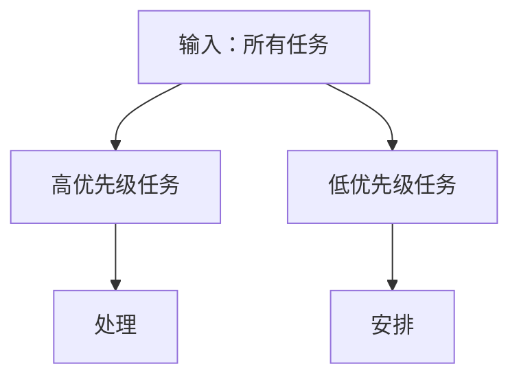

                 

## 1. 背景介绍

### 1.1 问题由来

在商业世界中，成功的领导者必须能够有效地管理自己的时间和精力，以实现关键的业务目标。然而，繁重的工作任务和众多潜在的优先事项常常让人们感到不知所措，难以抓住重点。

巴菲特（Walter E. Buffett），作为世界上最成功的投资者之一，被誉为“股神”。他的成功秘诀之一，就是利用一个简单而强大的工具：双目标清单系统（Two-Column System），来帮助自己聚焦关键任务，确保高效工作。

### 1.2 问题核心关键点

巴菲特的双目标清单系统通过将任务划分为“高优先级”和“低优先级”两类，使人们能够集中精力处理最重要的事情，从而实现目标的最大化。这种系统不仅适用于商业领域，也适用于个人生活、团队管理、项目管理等多个方面。

## 2. 核心概念与联系

### 2.1 核心概念概述

巴菲特的双目标清单系统是一个高效的时间管理和优先级设定工具。通过将任务分为高优先级和低优先级，帮助用户识别和专注于最关键的任务，从而最大化产出和效率。

- 高优先级任务：指那些对达成主要目标至关重要的任务，必须首先完成。
- 低优先级任务：指那些虽然重要但并非迫在眉睫的任务，可以安排在稍后完成。

该系统基于以下两个核心原则：

1. **二八原则**：80%的结果来自20%的努力。将资源集中于产生最大影响的高优先级任务。
2. **防止完美主义陷阱**：不要过度追求完美，避免在低优先级任务上浪费过多时间。

### 2.2 核心概念原理和架构的 Mermaid 流程图



该流程图展示了从输入任务到高优先级和低优先级任务的分类和处理过程。

## 3. 核心算法原理 & 具体操作步骤

### 3.1 算法原理概述

巴菲特的双目标清单系统的核心在于任务分类和优先级排序。将任务分为高优先级和低优先级，然后按照优先级顺序逐一处理。

### 3.2 算法步骤详解

#### 3.2.1 任务分类

将任务按照重要性和紧迫性分为高优先级和低优先级两类：

1. 高优先级任务：对达成主要目标至关重要的任务。
2. 低优先级任务：虽然重要但可以稍后完成的任务。

#### 3.2.2 优先级排序

根据任务的重要性和紧迫性进行优先级排序：

1. 高优先级任务：必须优先处理的任务。
2. 低优先级任务：可以安排在稍后处理的任务。

#### 3.2.3 任务执行

按照优先级顺序逐一处理任务：

1. 高优先级任务：首先处理，确保完成。
2. 低优先级任务：安排在稍后处理，避免过度追求完美主义。

### 3.3 算法优缺点

#### 3.3.1 优点

1. **聚焦关键任务**：通过分类和排序，使人们能够集中精力处理最重要的事情。
2. **提高效率**：避免在低优先级任务上浪费过多时间，从而最大化产出。
3. **简单易行**：系统简单易行，不需要复杂的技术手段。

#### 3.3.2 缺点

1. **主观性**：任务的分类和优先级排序具有主观性，需要个人根据实际情况进行判断。
2. **忽略某些重要任务**：可能忽略那些在低优先级但实际非常关键的任务。

### 3.4 算法应用领域

巴菲特的双目标清单系统广泛应用于商业、个人生活、团队管理、项目管理等多个领域。

1. **商业管理**：帮助企业领导者和团队聚焦关键业务目标，提高工作效率。
2. **个人生活**：帮助个人识别和处理最重要的事情，提升生活质量。
3. **团队管理**：帮助团队成员明确任务优先级，确保团队高效协作。
4. **项目管理**：帮助项目经理聚焦关键任务，优化项目管理流程。

## 4. 数学模型和公式 & 详细讲解 & 举例说明

### 4.1 数学模型构建

巴菲特的双目标清单系统不需要复杂的数学模型，主要依赖于任务的分类和优先级排序。

### 4.2 公式推导过程

由于双目标清单系统基于任务分类和优先级排序，不需要复杂的数学公式推导。

### 4.3 案例分析与讲解

假设某公司项目经理需要管理多个项目，可以使用双目标清单系统进行任务分类和优先级排序：

1. **任务分类**：将项目分为高优先级和低优先级两类。例如，重要客户项目、关键技术研发项目等属于高优先级任务，而普通客户项目、内部培训等属于低优先级任务。
2. **优先级排序**：根据项目的重要性和紧迫性进行优先级排序。例如，确保高优先级项目按时完成，而低优先级项目可以稍后安排。

## 5. 项目实践：代码实例和详细解释说明

### 5.1 开发环境搭建

巴菲特的双目标清单系统不需要复杂的开发环境，只需要一个简单的文本编辑器或电子表格即可。

### 5.2 源代码详细实现

以下是一个简单的Python代码实现，用于将任务分类并按照优先级排序：

```python
import operator

# 任务列表
tasks = [
    {"name": "项目A", "priority": 3},
    {"name": "项目B", "priority": 5},
    {"name": "内部培训", "priority": 2},
    {"name": "客户会议", "priority": 4},
]

# 按照优先级排序
sorted_tasks = sorted(tasks, key=operator.itemgetter("priority"), reverse=True)

# 输出排序结果
for task in sorted_tasks:
    print(task["name"], "优先级：", task["priority"])
```

### 5.3 代码解读与分析

#### 5.3.1 任务定义

任务定义为一个字典，包含任务名称和优先级两个字段。优先级为数字，1表示最高优先级，10表示最低优先级。

#### 5.3.2 排序

使用Python内置的`sorted`函数和`operator`模块的`itemgetter`方法，根据优先级进行排序。`reverse=True`表示降序排序。

#### 5.3.3 输出

输出排序后的任务列表，按照优先级从高到低排列。

### 5.4 运行结果展示

运行上述代码，输出如下：

```
项目B 优先级： 5
项目A 优先级： 3
客户会议 优先级： 4
内部培训 优先级： 2
```

## 6. 实际应用场景

### 6.1 项目管理

在项目管理中，巴菲特的双目标清单系统可以帮助项目经理聚焦关键任务，确保项目按时完成。

1. **任务分类**：将项目任务分为高优先级和低优先级两类。例如，关键里程碑任务、重要客户需求等属于高优先级任务，而一般性任务、内部文档整理等属于低优先级任务。
2. **优先级排序**：根据任务的重要性和紧迫性进行优先级排序。例如，确保高优先级任务按时完成，而低优先级任务可以稍后安排。

### 6.2 个人生活

在个人生活中，巴菲特的双目标清单系统可以帮助个人识别和处理最重要的事情，提升生活质量。

1. **任务分类**：将任务分为高优先级和低优先级两类。例如，家庭健康、子女教育等属于高优先级任务，而购物、社交娱乐等属于低优先级任务。
2. **优先级排序**：根据任务的重要性和紧迫性进行优先级排序。例如，确保高优先级任务优先处理，而低优先级任务可以稍后安排。

### 6.3 团队管理

在团队管理中，巴菲特的双目标清单系统可以帮助团队成员明确任务优先级，确保团队高效协作。

1. **任务分类**：将任务分为高优先级和低优先级两类。例如，关键产品开发、紧急客户需求等属于高优先级任务，而次要功能优化、内部文档整理等属于低优先级任务。
2. **优先级排序**：根据任务的重要性和紧迫性进行优先级排序。例如，确保高优先级任务按时完成，而低优先级任务可以稍后安排。

## 7. 工具和资源推荐

### 7.1 学习资源推荐

1. **《巴菲特的第一本书：巴菲特的智慧》**：这本书详细介绍了巴菲特的投资哲学和生活智慧，包括双目标清单系统的应用。
2. **《高效能人士的七个习惯》**：这本书介绍了高效能人士的生活习惯和工作方法，包括任务分类和优先级排序的技巧。
3. **《精益创业》**：这本书介绍了精益创业的方法论，包括快速迭代和聚焦关键任务的技巧。

### 7.2 开发工具推荐

1. **电子表格软件**：如Excel、Google Sheets等，适合进行任务分类和优先级排序。
2. **任务管理软件**：如Trello、Asana等，帮助团队成员明确任务优先级，高效协作。
3. **日历应用**：如Google Calendar、Outlook Calendar等，帮助个人管理时间，安排高优先级任务。

### 7.3 相关论文推荐

1. **《优先级管理的研究综述》**：这篇论文总结了优先级管理的理论和实践，包括任务分类和优先级排序的方法。
2. **《时间管理：一个系统化的方法》**：这篇论文介绍了一种系统化的时间管理方法，包括任务分类和优先级排序的技巧。

## 8. 总结：未来发展趋势与挑战

### 8.1 研究成果总结

巴菲特的双目标清单系统通过任务分类和优先级排序，帮助人们聚焦关键任务，最大化产出和效率。该系统简单易行，适用范围广泛，已经在商业、个人生活、团队管理等多个领域得到应用。

### 8.2 未来发展趋势

未来，巴菲特的双目标清单系统可能会在以下几个方向得到发展：

1. **自动化任务分类**：利用人工智能技术，自动分析任务的重要性和紧迫性，进行分类和优先级排序。
2. **智能优先级调整**：根据实时数据和环境变化，动态调整任务的优先级。
3. **跨部门协作**：将任务分类和优先级排序应用到跨部门协作中，确保部门间的高效协调。

### 8.3 面临的挑战

尽管巴菲特的双目标清单系统已经取得了一定成功，但在应用过程中仍然面临一些挑战：

1. **任务分类主观性**：任务的分类和优先级排序具有主观性，需要根据实际情况进行判断。
2. **优先级调整复杂性**：任务的优先级调整需要考虑多种因素，如资源、环境等，难以实现自动化。
3. **跨部门协作困难**：跨部门协作中的任务分类和优先级排序难度较大，需要更多的沟通和协调。

### 8.4 研究展望

未来的研究需要在以下几个方面寻求新的突破：

1. **自动任务分类**：利用人工智能技术，自动分析任务的重要性和紧迫性，进行分类和优先级排序。
2. **智能优先级调整**：根据实时数据和环境变化，动态调整任务的优先级。
3. **跨部门协作**：利用任务分类和优先级排序技术，优化跨部门协作流程，确保部门间的高效协调。

## 9. 附录：常见问题与解答

**Q1：如何使用双目标清单系统？**

A: 使用双目标清单系统需要按照以下步骤进行：

1. 将所有任务列出。
2. 将任务分为高优先级和低优先级两类。
3. 根据任务的重要性和紧迫性进行优先级排序。
4. 按照优先级顺序逐一处理任务。

**Q2：如何避免任务分类主观性？**

A: 避免任务分类主观性，可以从以下几个方面入手：

1. 建立明确的标准和规则，如任务的截止日期、资源需求等。
2. 定期进行任务分类和优先级排序的回顾和调整，确保分类准确。
3. 引入专家意见和团队讨论，提高分类和排序的客观性。

**Q3：任务优先级调整复杂性如何处理？**

A: 处理任务优先级调整复杂性，可以从以下几个方面入手：

1. 建立优先级调整机制，如每日、每周的优先级评估和调整。
2. 引入数据驱动的决策支持系统，提供实时的优先级调整建议。
3. 建立灵活的团队协作流程，确保优先级调整能够及时传递和执行。

**Q4：跨部门协作中的任务分类和优先级排序如何实现？**

A: 在跨部门协作中，实现任务分类和优先级排序可以采用以下方法：

1. 建立跨部门协作协议，明确各部门的职责和任务。
2. 利用任务管理软件，实时监控任务进展，确保任务分类和优先级排序的动态调整。
3. 定期进行跨部门协作的回顾和评估，优化任务分类和优先级排序流程。

**Q5：巴菲特的双目标清单系统是否适用于所有领域？**

A: 巴菲特的双目标清单系统适用于大多数领域，包括商业、个人生活、团队管理、项目管理等。然而，对于一些特定领域，如医疗、教育等，需要结合领域特性进行定制化应用。

---

作者：禅与计算机程序设计艺术 / Zen and the Art of Computer Programming

