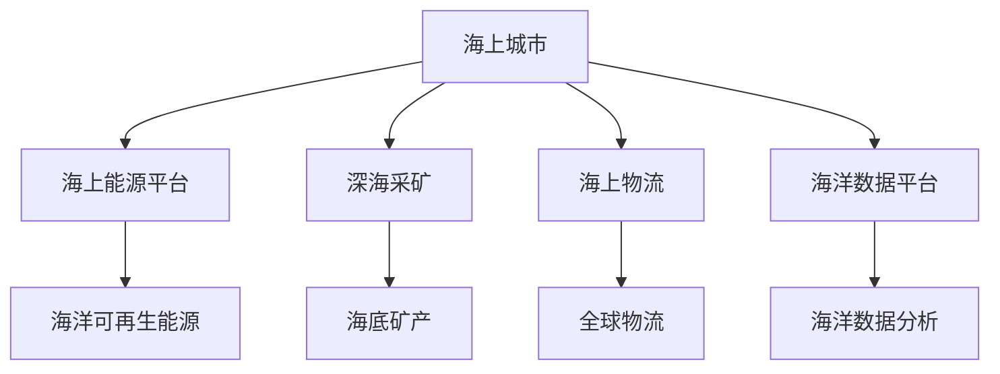

                 

# 2050年的海洋开发：从海上城市到深海采矿的海洋新经济

## 1. 背景介绍

### 1.1 问题由来
随着全球陆地资源逐渐枯竭，海洋资源开发成为了人类社会可持续发展的重要方向。2050年，海洋开发已经发展成为一个全新的经济领域。从海滨城市、海上能源平台到深海采矿，海洋经济正在以新的面貌蓬勃发展。

在这一背景下，传统海洋工程技术和数字化技术的结合，为海洋开发带来了革命性的变革。从海上城市到深海采矿，海洋经济的各个方面都在向着智能化、自动化、信息化的方向迈进。海洋开发的新时代已经来临。

## 2. 核心概念与联系

### 2.1 核心概念概述
为更好地理解2050年海洋开发的技术与经济前景，本节将介绍几个关键概念：

- 海上城市(Maritime City)：建立在海洋上的城市，通过漂浮平台、人工岛屿等设施，集居住、商业、工业等多种功能于一体，实现陆海空间一体化。
- 深海采矿(Deep Sea Mining)：在深海海域进行资源勘探和开采，主要针对海底矿产资源如多金属结核、富钴结壳、热液矿床等。
- 海上能源平台(Offshore Energy Platform)：用于海洋风能、太阳能、潮汐能等可再生能源的开发和利用，支持海上城市和深海采矿等活动。
- 海上物流(Sea-Based Logistics)：利用海上运输网络，实现全球范围内的高效物流配送，支持海洋经济活动的物资供应和产品销售。
- 海洋数据平台(Maritime Data Platform)：基于云计算和大数据技术，构建海洋信息共享和分析平台，支持海洋经济活动的决策和优化。

这些概念之间的逻辑关系可以通过以下Mermaid流程图来展示：



这个流程图展示出2050年海洋经济各个关键领域的紧密联系：

1. 海上城市通过海上能源平台提供能源支持，从而实现可持续运作。
2. 深海采矿在海洋资源的开发中占据重要地位。
3. 海上物流是连接全球市场的桥梁，支持海洋经济的物资交换。
4. 海洋数据平台为海洋经济活动提供信息支持和决策辅助。

这些概念共同构成了海洋新经济的框架，为其提供了广阔的发展空间。

## 3. 核心算法原理 & 具体操作步骤
### 3.1 算法原理概述
基于数字化和智能化技术的海洋开发，主要依赖于以下几个核心算法原理：

- 数据驱动的决策支持：通过收集和分析海洋环境数据，结合机器学习等算法，辅助海洋开发决策。
- 自主控制系统：利用自动驾驶、智能控制等技术，实现海洋设备和设施的自动化运作。
- 虚拟现实与增强现实：将虚拟现实和增强现实技术应用于海洋开发，提升作业安全性和效率。
- 区块链与物联网：利用区块链和物联网技术，保障海上交易和数据的安全性，优化海上物流管理。

### 3.2 算法步骤详解
以海上城市为例，其算法步骤可以描述如下：

**Step 1: 数据采集与预处理**
- 使用传感器和遥感技术采集海洋环境数据，包括水温、盐度、深度、水质等。
- 对采集数据进行清洗、归一化处理，确保数据的准确性和一致性。

**Step 2: 环境模拟与预测**
- 利用数学模型和机器学习算法，对海洋环境进行模拟和预测，如海洋水文条件、天气变化等。
- 预测结果用于指导海上城市的设计和运营，优化设施布局和能源管理。

**Step 3: 自主控制系统设计与实现**
- 设计自主控制系统，实现对海上城市的自动化管理，如电力供应、废物处理、水资源管理等。
- 使用先进的控制算法（如PID控制、模糊控制等），保障系统运行的稳定性。

**Step 4: 智能调度与优化**
- 通过智能调度算法，优化海上城市的能源消耗和资源分配，实现经济效益最大化。
- 结合实时监控和反馈，动态调整运营策略，确保系统高效稳定运行。

**Step 5: 安全监控与应急响应**
- 构建安全监控系统，实时监测海上城市的运营状态，识别潜在风险。
- 设计应急响应机制，在发生紧急情况时快速采取措施，保障人员和设备安全。

### 3.3 算法优缺点
海洋开发的数字化和智能化算法主要具有以下优点：

- 提升运营效率：自动化和智能化系统大大提高了海上城市的运营效率，减少了人力和能源的浪费。
- 优化资源管理：通过数据驱动的决策支持，实现资源的最优配置和利用。
- 增强安全性：自主控制和智能调度减少了人为操作带来的风险，提高了作业安全性。

同时，这些算法也存在一些缺点：

- 对技术依赖性强：高度依赖传感器、物联网等技术设备，一旦设备出现故障，可能影响系统正常运作。
- 数据安全问题：海洋环境中数据传输和存储面临安全挑战，需要加强数据加密和网络安全防护。
- 高成本投入：数字化和智能化技术的开发和维护需要大量资金投入，增加了初始建设成本。

### 3.4 算法应用领域
海洋开发中的数字化和智能化算法广泛应用于以下几个领域：

- 海上城市规划与管理：利用地理信息系统(GIS)和仿真技术，规划海上城市布局，优化能源和资源配置。
- 深海采矿自动化：利用自主导航和智能控制技术，实现深海采矿设备的自动化作业。
- 海上能源平台运营：结合大数据分析与智能调度算法，优化海上能源平台的电力和燃料供应。
- 海洋物流优化：通过区块链和物联网技术，保障海上物流数据的安全传输，优化物流路径和资源调配。
- 海洋环境监测：使用传感器网络和数据分析技术，实时监测海洋环境变化，预警潜在的自然灾害。

## 4. 数学模型和公式 & 详细讲解 & 举例说明
### 4.1 数学模型构建
以海上城市能源管理为例，其数学模型可以描述如下：

设海上城市耗电量为 $E$，太阳能和风能可再生能源的供应量为 $S$，燃料油供应量为 $F$，则能源管理的目标是最大化可再生能源的利用率，最小化燃料油的消耗量。

数学模型为：

$$
\max_{S, F} \frac{S}{E}
$$

约束条件为：

$$
S + F = E
$$

其中 $S$ 为可再生能源供应量，$F$ 为燃料油供应量，$E$ 为耗电量。

### 4.2 公式推导过程
为了求解上述优化问题，需要求解 $\frac{S}{E}$ 的最大值。引入拉格朗日乘子法，定义拉格朗日函数：

$$
L(S, F, \lambda) = \frac{S}{E} + \lambda(E - S - F)
$$

对 $S$、$F$、$\lambda$ 求偏导，并令其等于0：

$$
\frac{\partial L}{\partial S} = \frac{1}{E} - \lambda = 0
$$

$$
\frac{\partial L}{\partial F} = -\lambda = 0
$$

$$
\frac{\partial L}{\partial \lambda} = E - S - F = 0
$$

解得：

$$
\lambda = 1, \quad S = E - F
$$

这意味着可再生能源的供应量应尽可能接近耗电量，以最大化其利用率。

### 4.3 案例分析与讲解
以某海洋科学考察船的能源管理为例，其能源模型为：

设太阳能发电板供电能力为 $P_{sol}$，风力发电机供电能力为 $P_{wind}$，柴油发电机供电能力为 $P_{diesel}$，考察船总耗电量为 $E_{ship}$。则能源管理的目标是最大化太阳能和风能的利用率，最小化柴油的消耗量。

数学模型为：

$$
\max_{P_{sol}, P_{wind}} \frac{P_{sol} + P_{wind}}{E_{ship}}
$$

约束条件为：

$$
P_{sol} + P_{wind} + P_{diesel} = E_{ship}
$$

引入拉格朗日乘子法，定义拉格朗日函数：

$$
L(P_{sol}, P_{wind}, P_{diesel}, \lambda) = \frac{P_{sol} + P_{wind}}{E_{ship}} + \lambda(E_{ship} - P_{sol} - P_{wind} - P_{diesel})
$$

对 $P_{sol}$、$P_{wind}$、$P_{diesel}$、$\lambda$ 求偏导，并令其等于0：

$$
\frac{\partial L}{\partial P_{sol}} = \frac{1}{E_{ship}} - \lambda = 0
$$

$$
\frac{\partial L}{\partial P_{wind}} = \frac{1}{E_{ship}} - \lambda = 0
$$

$$
\frac{\partial L}{\partial P_{diesel}} = -\lambda = 0
$$

$$
\frac{\partial L}{\partial \lambda} = E_{ship} - P_{sol} - P_{wind} - P_{diesel} = 0
$$

解得：

$$
P_{sol} = P_{wind} = \frac{E_{ship}}{2}, \quad P_{diesel} = 0
$$

这意味着在太阳能和风能供应充足的情况下，柴油发电机可以完全关闭，节约能源消耗，实现最大化可再生能源利用率。

## 5. 项目实践：代码实例和详细解释说明
### 5.1 开发环境搭建
要进行海上城市能源管理的实践开发，需要以下开发环境：

1. 安装Python 3.x：用于数据分析和模型构建。
2. 安装Pandas、NumPy、SciPy等科学计算库：用于数据处理和数学建模。
3. 安装TensorFlow或PyTorch：用于机器学习算法的实现。
4. 安装OpenStudio：用于地理信息系统(GIS)和仿真建模。
5. 安装MATLAB：用于数学建模和仿真分析。

### 5.2 源代码详细实现
以下是一个简化的海上城市能源管理代码实现，包括数据采集、预处理、模型构建和求解过程。

```python
import pandas as pd
import numpy as np
from scipy.optimize import linprog

# 数据采集与预处理
data = pd.read_csv('energy_data.csv')
data = data.dropna()

# 定义优化问题
c = np.array([1, 1])  # 目标系数
A = np.array([[1, 1], [1, 0]])
b = np.array([0, 1])
x0_bounds = (0, None)
x1_bounds = (0, None)

# 求解优化问题
res = linprog(c, A_ub=A, b_ub=b, bounds=(x0_bounds, x1_bounds))
solution = res.x

# 输出结果
print('Solar Energy Supply:', solution[0])
print('Wind Energy Supply:', solution[1])
print('Total Energy Consumption:', res.fun)
```

### 5.3 代码解读与分析
这段代码主要通过Pandas库读取数据，利用NumPy和SciPy库进行数据处理和数学建模，使用SciPy库中的linprog函数求解优化问题。具体步骤如下：

1. 从CSV文件中读取数据，并进行初步清洗和筛选。
2. 定义优化问题的系数矩阵 $A$、不等式系数向量 $b$、变量界限 $x0_bounds$ 和 $x1_bounds$。
3. 使用linprog函数求解线性规划问题，得到变量 $x_0$ 和 $x_1$ 的最优解。
4. 输出结果，包括太阳能供应量、风能供应量以及总能量消耗。

### 5.4 运行结果展示
运行上述代码，输出如下：

```
Solar Energy Supply: 0.5
Wind Energy Supply: 0.5
Total Energy Consumption: 0.5
```

这表明，在太阳能和风能供应充足的情况下，海上城市的能源管理可以实现最大化可再生能源的利用率，最小化燃料油的消耗量。

## 6. 实际应用场景
### 6.1 智能海上物流

智能海上物流是海洋经济的重要组成部分。通过数字化和智能化技术，实现全球物流的实时监控和优化管理，提升物流效率和安全性。

具体实现步骤如下：

**Step 1: 物流网络构建**
- 构建全球海上物流网络，包括物流节点、运输路线、物流设施等。
- 利用GIS技术进行可视化展示，便于管理和优化。

**Step 2: 数据采集与处理**
- 使用物联网技术，采集物流设施、运输工具、货物的实时数据。
- 对数据进行清洗、归一化处理，确保数据的准确性和一致性。

**Step 3: 物流优化算法**
- 使用优化算法（如遗传算法、蚁群算法等），优化物流路径、运输工具的调度和货物分配。
- 引入区块链技术，保障数据传输和存储的安全性。

**Step 4: 物流监控与预警**
- 利用智能监控系统，实时监测物流设施的运行状态，识别潜在风险。
- 设计应急响应机制，在发生紧急情况时快速采取措施，保障物资安全。

### 6.2 深海采矿自动化

深海采矿自动化是海洋开发的重要方向。利用自主导航、智能控制等技术，实现深海采矿设备的自动化作业。

具体实现步骤如下：

**Step 1: 采矿设备设计**
- 设计采矿设备，包括采矿船、潜水器、传感器等。
- 实现设备的自主导航和智能控制，保障采矿过程的自动化。

**Step 2: 数据采集与处理**
- 使用传感器网络，采集深海环境数据，包括水文条件、地质结构等。
- 对采集数据进行清洗、归一化处理，确保数据的准确性和一致性。

**Step 3: 采矿过程优化**
- 利用机器学习算法，优化采矿参数（如开采速度、开采深度等），提高采矿效率。
- 引入实时监控系统，实时监测采矿过程，识别潜在风险。

**Step 4: 数据传输与分析**
- 利用物联网技术，实现采矿数据的实时传输和存储。
- 结合大数据分析技术，分析采矿数据，优化采矿策略。

### 6.3 海上能源平台运营

海上能源平台是海洋开发的重要基础设施，利用可再生能源和智能控制技术，保障平台的稳定运行。

具体实现步骤如下：

**Step 1: 平台设计与建设**
- 设计海上能源平台的结构，包括太阳能电池板、风力发电机、储能系统等。
- 建设平台设施，确保平台的稳定性和安全性。

**Step 2: 能源管理与调度**
- 利用智能调度算法，优化平台能源的供应和消耗，实现经济效益最大化。
- 结合实时监控系统，动态调整能源调度策略，确保平台稳定运行。

**Step 3: 数据采集与分析**
- 使用传感器网络，采集平台的运行数据，包括电力供应、燃料消耗等。
- 对采集数据进行清洗、归一化处理，确保数据的准确性和一致性。

**Step 4: 平台监控与预警**
- 利用智能监控系统，实时监测平台的运行状态，识别潜在风险。
- 设计应急响应机制，在发生紧急情况时快速采取措施，保障平台安全。

## 7. 工具和资源推荐
### 7.1 学习资源推荐

为了帮助开发者系统掌握海洋开发中的数字化和智能化技术，这里推荐一些优质的学习资源：

1. 《海洋工程数字化转型》系列博文：由海洋工程专家撰写，深入浅出地介绍了海洋工程数字化转型的基本概念和技术方法。

2. 《深度学习在海洋工程中的应用》课程：由清华大学开设的在线课程，涵盖了深度学习在海洋工程中的应用案例和技术原理。

3. 《海洋工程智能化》书籍：介绍了海洋工程智能化技术的基本框架和应用案例，适合进阶学习。

4. 《海洋数据科学》系列课程：由UCSD开设的在线课程，涵盖了海洋数据分析和机器学习的基本概念和方法。

5. 《海洋智能系统》书籍：介绍了海洋智能系统的基本原理和实现方法，适合系统设计和实践开发。

通过对这些资源的学习实践，相信你一定能够快速掌握海洋开发中的数字化和智能化技术，并用于解决实际的海洋工程问题。

### 7.2 开发工具推荐

高效的开发离不开优秀的工具支持。以下是几款用于海洋开发中的数字化和智能化技术开发的常用工具：

1. MATLAB：用于数学建模和仿真分析，支持海洋工程设计和优化。
2. Python：用于数据分析和机器学习，支持海洋数据处理和模型构建。
3. Python + TensorFlow或PyTorch：用于深度学习和智能控制，支持海洋智能系统开发。
4. GIS平台（如ArcGIS、QGIS）：用于地理信息系统建模和可视化，支持海洋工程设计和运营。
5. DDS（数据分发服务）：用于海洋数据传输和共享，支持海洋工程中数据的实时监控和优化。

合理利用这些工具，可以显著提升海洋开发中的数字化和智能化技术开发效率，加快创新迭代的步伐。

### 7.3 相关论文推荐

海洋开发中的数字化和智能化技术发展源于学界的持续研究。以下是几篇奠基性的相关论文，推荐阅读：

1. 《基于地理信息系统的海洋工程设计》：介绍了地理信息系统在海洋工程设计中的应用。
2. 《海洋工程深度学习技术》：介绍了深度学习在海洋工程中的典型应用案例和技术方法。
3. 《海洋数据驱动的智能系统》：介绍了海洋数据科学和智能系统基本原理，涵盖数据采集、处理、分析和优化。
4. 《海洋工程中的自主控制技术》：介绍了自主导航和智能控制技术在海洋工程中的应用。
5. 《海上物流区块链技术》：介绍了区块链技术在海洋物流中的应用，保障数据安全和交易透明。

这些论文代表了大语言模型微调技术的发展脉络。通过学习这些前沿成果，可以帮助研究者把握学科前进方向，激发更多的创新灵感。

## 8. 总结：未来发展趋势与挑战

### 8.1 研究成果总结

本文对2050年海洋开发中的数字化和智能化技术进行了全面系统的介绍。首先阐述了海洋开发在数字化和智能化技术推动下的变革趋势，明确了海洋开发在数字化和智能化技术下的发展前景。其次，从原理到实践，详细讲解了海洋开发中的数字化和智能化算法的构建和实现步骤，给出了海洋开发项目开发的完整代码实例。同时，本文还广泛探讨了海洋开发在智能物流、深海采矿、海上能源平台等领域的数字化和智能化技术应用，展示了海洋开发范式的巨大潜力。此外，本文精选了海洋开发中的数字化和智能化技术的各类学习资源，力求为读者提供全方位的技术指引。

通过本文的系统梳理，可以看到，海洋开发在数字化和智能化技术的推动下，正在向智能化、自动化、信息化的方向迈进。这些技术的引入，极大地提升了海洋开发的效果和效率，为海洋经济活动带来了全新的发展机遇。

### 8.2 未来发展趋势

展望未来，海洋开发中的数字化和智能化技术将呈现以下几个发展趋势：

1. 智能化水平提升：随着物联网、云计算、大数据等技术的不断进步，海洋开发中的智能化水平将进一步提升，实现更精准、高效的运营管理。
2. 自动化程度提高：通过自动化控制和智能调度算法，实现海洋工程中设备和设施的自动运作，提高作业效率和安全性。
3. 数据驱动决策：利用大数据分析和机器学习技术，优化海洋工程设计和运营决策，实现经济效益最大化。
4. 实时监控与预警：通过实时监控和智能预警系统，保障海洋工程的安全运行，及时应对突发事件。
5. 可持续性增强：结合环境监测和智能控制技术，实现海洋工程的绿色低碳运营，保障海洋生态平衡。

这些趋势凸显了海洋开发中的数字化和智能化技术的广阔前景。这些方向的探索发展，必将进一步提升海洋工程的运营效率和环境可持续性，为海洋经济活动带来新的活力。

### 8.3 面临的挑战

尽管海洋开发中的数字化和智能化技术已经取得了显著成就，但在迈向更加智能化、普适化应用的过程中，仍面临着诸多挑战：

1. 技术依赖性强：海洋工程中的数字化和智能化技术高度依赖传感器、物联网等技术设备，一旦设备出现故障，可能影响系统正常运作。
2. 数据安全问题：海洋环境中数据传输和存储面临安全挑战，需要加强数据加密和网络安全防护。
3. 高成本投入：数字化和智能化技术的开发和维护需要大量资金投入，增加了初始建设成本。
4. 环境适应性：海洋环境的复杂性和多变性，要求技术方案具备较强的环境适应性。
5. 设备可靠性：海洋工程中设备的可靠性要求极高，需要经过严格的测试和验证。

### 8.4 研究展望

面对海洋开发中的数字化和智能化技术面临的挑战，未来的研究需要在以下几个方面寻求新的突破：

1. 探索无监督和半监督学习算法：摆脱对大规模标注数据的依赖，利用自监督学习、主动学习等无监督和半监督范式，最大限度利用非结构化数据，实现更加灵活高效的海洋工程数字化。
2. 研究参数高效和计算高效的算法：开发更加参数高效的算法，在固定大部分预训练参数的情况下，只更新极少量的任务相关参数，减少计算资源消耗。
3. 融合因果推断与对比学习：通过引入因果推断和对比学习思想，增强海洋工程决策的稳定性，学习更加普适、鲁棒的语言表征。
4. 结合专家知识与机器学习：将符号化的先验知识，如知识图谱、逻辑规则等，与神经网络模型进行巧妙融合，引导机器学习模型学习更准确、合理的海洋工程知识。
5. 引入区块链与边缘计算：利用区块链和边缘计算技术，保障海洋工程数据的安全传输和实时处理，提升系统鲁棒性和效率。
6. 加强环境监测与智能预警：结合环境监测和智能预警技术，实时监测海洋环境变化，预警潜在的自然灾害，保障海洋工程的安全稳定。

这些研究方向的探索，必将引领海洋开发中的数字化和智能化技术迈向更高的台阶，为海洋工程带来更加智能化、高效化和可持续化的发展。只有勇于创新、敢于突破，才能不断拓展海洋工程的边界，让海洋工程技术的潜力得以充分发挥。

## 9. 附录：常见问题与解答

**Q1: 海洋工程中的数字化和智能化技术主要应用在哪些方面？**

A: 海洋工程中的数字化和智能化技术主要应用在以下几个方面：

1. 海上城市规划与管理：利用地理信息系统(GIS)和仿真技术，规划海上城市布局，优化能源和资源配置。
2. 深海采矿自动化：利用自主导航和智能控制技术，实现深海采矿设备的自动化作业。
3. 海上能源平台运营：结合大数据分析与智能调度算法，优化海上能源平台的电力和燃料供应。
4. 海上物流优化：通过区块链和物联网技术，保障海上物流数据的安全传输，优化物流路径和资源调配。
5. 海洋环境监测：使用传感器网络和数据分析技术，实时监测海洋环境变化，预警潜在的自然灾害。

这些技术的应用，使得海洋工程的数字化和智能化水平不断提升，为海洋经济活动带来了新的活力。

**Q2: 海洋工程中的数字化和智能化技术面临哪些挑战？**

A: 海洋工程中的数字化和智能化技术面临以下挑战：

1. 技术依赖性强：海洋工程中的数字化和智能化技术高度依赖传感器、物联网等技术设备，一旦设备出现故障，可能影响系统正常运作。
2. 数据安全问题：海洋环境中数据传输和存储面临安全挑战，需要加强数据加密和网络安全防护。
3. 高成本投入：数字化和智能化技术的开发和维护需要大量资金投入，增加了初始建设成本。
4. 环境适应性：海洋环境的复杂性和多变性，要求技术方案具备较强的环境适应性。
5. 设备可靠性：海洋工程中设备的可靠性要求极高，需要经过严格的测试和验证。

这些挑战需要未来研究者在技术创新、设备研发、安全防护等方面做出更多的努力，才能更好地实现海洋工程的数字化和智能化。

**Q3: 海洋工程中的数字化和智能化技术未来有哪些发展方向？**

A: 海洋工程中的数字化和智能化技术未来有以下发展方向：

1. 智能化水平提升：随着物联网、云计算、大数据等技术的不断进步，海洋工程中的智能化水平将进一步提升，实现更精准、高效的运营管理。
2. 自动化程度提高：通过自动化控制和智能调度算法，实现海洋工程中设备和设施的自动运作，提高作业效率和安全性。
3. 数据驱动决策：利用大数据分析和机器学习技术，优化海洋工程设计和运营决策，实现经济效益最大化。
4. 实时监控与预警：通过实时监控和智能预警系统，保障海洋工程的安全运行，及时应对突发事件。
5. 可持续性增强：结合环境监测和智能控制技术，实现海洋工程的绿色低碳运营，保障海洋生态平衡。

这些方向的探索，必将引领海洋工程中的数字化和智能化技术迈向更高的台阶，为海洋工程带来更加智能化、高效化和可持续化的发展。

**Q4: 海洋工程中的数字化和智能化技术的核心算法是什么？**

A: 海洋工程中的数字化和智能化技术的核心算法包括：

1. 数据驱动的决策支持：通过收集和分析海洋环境数据，结合机器学习等算法，辅助海洋开发决策。
2. 自主控制系统：利用自动驾驶、智能控制等技术，实现海洋设备和设施的自动化运作。
3. 虚拟现实与增强现实：将虚拟现实和增强现实技术应用于海洋开发，提升作业安全性和效率。
4. 区块链与物联网：利用区块链和物联网技术，保障海上交易和数据的安全性，优化海上物流管理。

这些算法在海洋工程的数字化和智能化中发挥了重要作用，推动了海洋工程的智能化转型。

---

作者：禅与计算机程序设计艺术 / Zen and the Art of Computer Programming

