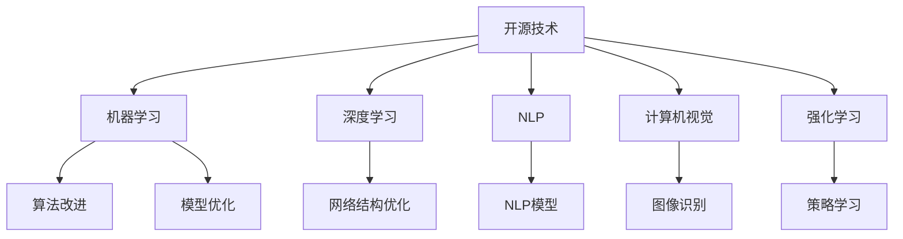
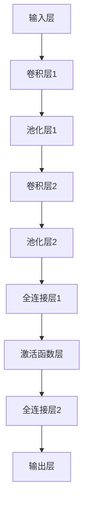

                 

# 开源技术推动AI进步的重要性

## 1. 背景介绍

### 1.1 问题由来

随着人工智能(AI)技术的飞速发展，开源社区成为推动技术进步的重要力量。无论是机器学习、深度学习还是自然语言处理等领域，开源技术的广泛应用都极大地提升了研究效率，加速了技术创新，降低了应用门槛，推动了AI技术的普及和落地。

在20世纪60年代，AI技术的商业应用主要是封闭式研究，依赖于个别公司或政府机构进行资金投入和技术研发。然而，这种模式的高昂成本和有限的资源限制了AI技术的普及和应用。进入21世纪，开源社区的崛起彻底改变了这一现状。

开源技术通过共享代码、数据和模型，打破了传统技术壁垒，为更多的研究者和开发者提供了平等的机会，使得AI技术在短短十几年内取得了空前的发展和突破。

### 1.2 问题核心关键点

开源技术在推动AI进步中的核心作用主要体现在以下几个方面：

1. **降低了技术门槛**：开源社区提供了大量的代码库、模型库和数据集，使得即使是初学者也能够快速上手，降低研究和技术应用的门槛。
2. **提升了研究效率**：开源技术通过代码复用、并行开发等手段，极大地提升了研究效率，使得科学家和工程师能够集中精力在创新性研究上。
3. **促进了技术普及**：开源技术免费、开放的特性，使得AI技术能够更广泛地应用于各种行业和领域，推动了技术的普及和应用。
4. **加速了技术迭代**：开源社区的高频迭代和快速更新机制，使得AI技术能够迅速适应新的需求和挑战，保持持续发展。
5. **推动了跨界合作**：开源社区打破了传统学术界和企业界的界限，促进了跨界合作和交流，汇聚了全球智慧。

## 2. 核心概念与联系

### 2.1 核心概念概述

为更好地理解开源技术在AI进步中的作用，本节将介绍几个核心概念及其相互关系：

- **开源技术**：指通过公开源代码、数据和模型的技术分享方式，使得他人能够自由使用、修改、分享，促进技术进步和创新的模式。
- **机器学习**：通过数据训练模型，使其能够自动学习并改进性能的算法。
- **深度学习**：一种特殊的机器学习，利用多层神经网络对复杂模式进行识别和预测。
- **自然语言处理(NLP)**：使计算机能够理解、生成和处理自然语言的技术。
- **计算机视觉(CV)**：使计算机能够识别、理解和处理图像和视频的技术。
- **强化学习**：通过与环境互动，使智能体学习最优决策策略的算法。

这些核心概念之间的逻辑关系可以通过以下Mermaid流程图来展示：



这个流程图展示开源技术与其他AI技术之间的关系：

1. 开源技术提供了算法、模型和数据等基础组件。
2. 机器学习、深度学习、NLP、CV和强化学习都是基于开源技术构建的具体应用领域。
3. 开源技术通过优化算法和模型，推动了机器学习、深度学习等领域的进步。

## 3. 核心算法原理 & 具体操作步骤

### 3.1 算法原理概述

开源技术在AI领域的核心原理是通过开放协作，共享代码和知识，加速技术创新和应用。具体而言，开源技术通过以下机制实现这一目标：

1. **代码共享**：开源社区提供了丰富的代码库，包括成熟的模型和算法实现，使得研究者和开发者可以快速访问和复用这些资源。
2. **数据共享**：开源社区共享了大量数据集，包括图像、文本、音频等，为训练和验证模型提供了丰富的数据来源。
3. **模型共享**：开源社区提供了大量预训练模型和微调模型，使得研究者和开发者可以基于这些模型进行快速开发和测试。
4. **协作机制**：开源社区鼓励跨学科、跨领域的合作，汇聚全球智慧，共同推进AI技术的发展。

### 3.2 算法步骤详解

开源技术在AI领域的实际操作过程大致包括以下几个步骤：

**Step 1: 选择和使用开源工具**

- **选择开源工具**：根据具体任务选择合适的开源工具和框架，如TensorFlow、PyTorch、Keras等。
- **安装和使用工具**：下载和安装所需的工具和库，熟悉其使用方法和接口。

**Step 2: 数据预处理**

- **数据收集**：收集并整理所需的数据集，包括图像、文本、音频等。
- **数据清洗**：去除噪声和异常数据，确保数据质量。
- **数据增强**：对数据进行扩充和增强，如旋转、裁剪、翻转等，以增加数据多样性。

**Step 3: 模型训练**

- **选择和准备模型**：根据任务选择合适的模型架构和参数，准备进行训练。
- **编写训练代码**：编写训练代码，包括模型定义、损失函数、优化器等。
- **训练模型**：使用训练数据集对模型进行训练，调整模型参数以最小化损失函数。

**Step 4: 模型评估**

- **评估指标**：根据具体任务选择适当的评估指标，如准确率、召回率、F1-score等。
- **模型测试**：使用测试数据集对模型进行评估，获取模型性能的数值指标。

**Step 5: 模型部署和应用**

- **模型部署**：将训练好的模型部署到生产环境或移动应用中。
- **应用场景**：将模型应用于实际问题，如图像识别、语音识别、推荐系统等。

### 3.3 算法优缺点

开源技术在AI领域的应用具有以下优点：

1. **降低成本**：开源技术免费且开放，极大地降低了研究和应用的成本。
2. **提升效率**：开源工具提供了丰富的组件和接口，极大提升了研究和开发的效率。
3. **促进创新**：开源社区的开放协作机制，促进了技术创新和跨界合作。
4. **加速迭代**：开源技术的快速迭代和更新，使得技术能够迅速适应新的需求和挑战。

同时，开源技术也存在一些局限性：

1. **质量参差不齐**：开源社区中存在大量质量参差不齐的代码和模型，需要研究者进行筛选和验证。
2. **依赖性问题**：开源工具和库之间的依赖关系复杂，可能会导致兼容性问题。
3. **安全和隐私问题**：开源社区中存在大量第三方代码，可能引入安全漏洞和隐私风险。
4. **社区门槛**：虽然开源技术降低了技术门槛，但仍需要一定的编程和研究基础。

尽管存在这些局限性，开源技术仍是当前AI领域最为主流和高效的技术模式，未来将继续发挥重要作用。

### 3.4 算法应用领域

开源技术在AI领域的应用已遍及各个领域，包括但不限于：

1. **机器学习和深度学习**：如TensorFlow、PyTorch、Keras等框架，广泛应用于各类AI任务。
2. **自然语言处理**：如NLTK、SpaCy、GPT-3等工具，在文本处理和生成中得到广泛应用。
3. **计算机视觉**：如OpenCV、Pillow等库，在图像处理和分析中发挥重要作用。
4. **强化学习**：如Gym、MuJoCo等环境，为研究者提供丰富的测试平台。
5. **大数据分析**：如Apache Hadoop、Spark等工具，为AI研究提供强大的计算支持。
6. **自动化和机器人**：如ROS、OpenAI Gym等平台，推动自动化和机器人技术的发展。
7. **智能交通**：如Simulation Frameworks等工具，提升智能交通系统的性能和效率。
8. **智慧医疗**：如OpenMRI、Healthbot等工具，为医疗诊断和治疗提供智能支持。

## 4. 数学模型和公式 & 详细讲解 & 举例说明

### 4.1 数学模型构建

在AI领域，开源技术的应用离不开数学模型的构建和优化。以下是几个典型模型及其数学表达：

- **线性回归模型**：假设数据集为 $(x_i, y_i)$，其中 $x_i$ 为输入，$y_i$ 为输出，线性回归模型可以表示为：
  $$
  y_i = w_1x_1 + w_2x_2 + \cdots + w_nx_n + b
  $$
  其中 $w_i$ 为权重，$b$ 为偏置。

- **神经网络模型**：神经网络模型由多个神经元组成，每个神经元接收输入 $x_i$，经过线性变换和激活函数后输出结果。一个简单的神经网络可以表示为：
  $$
  y = \sigma(\sum_{i=1}^{n}w_ix_i + b)
  $$
  其中 $\sigma$ 为激活函数，如sigmoid、ReLU等。

- **卷积神经网络(CNN)**：CNN在图像处理中应用广泛，通过卷积和池化操作提取特征，然后通过全连接层输出结果。一个简单的CNN可以表示为：
  $$
  y = \sigma(\mathcal{C}(\mathcal{P}(\mathcal{F}(x))))
  $$
  其中 $\mathcal{C}$ 为卷积层，$\mathcal{P}$ 为池化层，$\mathcal{F}$ 为特征提取层。

### 4.2 公式推导过程

以下是线性回归模型的推导过程：

1. **最小二乘法**：假设数据集为 $(x_i, y_i)$，其中 $n$ 为样本数量，$x_i$ 和 $y_i$ 为自变量和因变量。最小二乘法的目标是最小化预测值与真实值之间的误差，即：
  $$
  \min \sum_{i=1}^{n}(y_i - \hat{y}_i)^2
  $$
  其中 $\hat{y}_i = w_1x_1 + w_2x_2 + \cdots + w_nx_n + b$。

2. **梯度下降法**：梯度下降法通过迭代更新权重 $w_i$ 和偏置 $b$，使得损失函数最小化。梯度下降法的更新公式为：
  $$
  w_i \leftarrow w_i - \eta \frac{\partial \mathcal{L}}{\partial w_i}
  $$
  其中 $\eta$ 为学习率，$\mathcal{L}$ 为损失函数。

3. **正则化**：为避免过拟合，通常会在损失函数中引入正则项，如L2正则，即：
  $$
  \mathcal{L} = \sum_{i=1}^{n}(y_i - \hat{y}_i)^2 + \lambda \sum_{i=1}^{n}w_i^2
  $$
  其中 $\lambda$ 为正则化系数。

### 4.3 案例分析与讲解

以图像分类任务为例，介绍卷积神经网络模型的应用。假设输入为28x28的图像，输出为10个类别的概率分布，模型结构如图1所示：



1. **卷积层和池化层**：卷积层通过卷积操作提取图像的特征，池化层通过下采样操作减少特征图的大小。通常会使用多个卷积层和池化层的组合来提取复杂的特征。

2. **全连接层和激活函数**：全连接层将特征图展开成一维向量，通过多个线性变换和激活函数输出结果。激活函数如ReLU、sigmoid等，使得模型能够学习非线性关系。

3. **输出层**：输出层通常为softmax层，将模型输出转换为概率分布，使得每个类别都有对应的概率值。

### 5. 项目实践：代码实例和详细解释说明

#### 5.1 开发环境搭建

开源技术的开发环境搭建主要包括以下几个步骤：

1. **选择和安装开发工具**：根据具体任务选择合适的开发工具和库，如Python、R、MATLAB等。
2. **安装和配置依赖包**：安装所需的依赖包和库，如TensorFlow、PyTorch、Keras等。
3. **编写代码**：根据具体任务编写代码，包括数据预处理、模型定义、训练、评估等。

#### 5.2 源代码详细实现

以下是一个简单的卷积神经网络模型的Python代码实现：

```python
import tensorflow as tf

# 定义模型
def convolutional_neural_network(x):
    # 卷积层
    conv1 = tf.layers.conv2d(x, 32, (3, 3), activation=tf.nn.relu)
    # 池化层
    pool1 = tf.layers.max_pooling2d(conv1, (2, 2))
    # 卷积层
    conv2 = tf.layers.conv2d(pool1, 64, (3, 3), activation=tf.nn.relu)
    # 池化层
    pool2 = tf.layers.max_pooling2d(conv2, (2, 2))
    # 全连接层
    fc1 = tf.layers.dense(pool2, 128, activation=tf.nn.relu)
    # 输出层
    output = tf.layers.dense(fc1, 10, activation=tf.nn.softmax)
    return output

# 加载数据集
(x_train, y_train), (x_test, y_test) = tf.keras.datasets.mnist.load_data()

# 数据预处理
x_train = x_train.reshape(x_train.shape[0], 28, 28, 1)
x_train = x_train / 255.0
x_test = x_test.reshape(x_test.shape[0], 28, 28, 1)
x_test = x_test / 255.0

# 定义模型
model = tf.keras.Sequential([
    tf.keras.layers.Conv2D(32, (3, 3), activation='relu', input_shape=(28, 28, 1)),
    tf.keras.layers.MaxPooling2D((2, 2)),
    tf.keras.layers.Conv2D(64, (3, 3), activation='relu'),
    tf.keras.layers.MaxPooling2D((2, 2)),
    tf.keras.layers.Flatten(),
    tf.keras.layers.Dense(128, activation='relu'),
    tf.keras.layers.Dense(10, activation='softmax')
])

# 编译模型
model.compile(optimizer='adam',
              loss='categorical_crossentropy',
              metrics=['accuracy'])

# 训练模型
model.fit(x_train, y_train, epochs=10, validation_data=(x_test, y_test))
```

#### 5.3 代码解读与分析

- **数据加载和预处理**：使用TensorFlow的`tf.keras.datasets.mnist.load_data`函数加载MNIST数据集，并对其进行了预处理，包括将像素值归一化和重塑。
- **模型定义**：通过定义多个卷积层、池化层、全连接层和输出层，构建了一个简单的卷积神经网络。
- **模型编译和训练**：使用`tf.keras.Sequential`将模型各层组合起来，并通过`compile`方法指定优化器、损失函数和评估指标。最后使用`fit`方法对模型进行训练。

#### 5.4 运行结果展示

训练完毕后，可以通过以下代码测试模型的性能：

```python
test_loss, test_acc = model.evaluate(x_test, y_test)
print('Test accuracy:', test_acc)
```

## 6. 实际应用场景

开源技术在AI领域的应用已经广泛渗透到各个行业和领域，以下是一些典型的应用场景：

### 6.1 智能交通系统

开源技术在智能交通系统中得到了广泛应用，通过数据分析和模型优化，提升了交通流量预测和拥堵缓解的效率和准确性。例如，通过OpenSim框架和Gym环境，可以构建交通仿真平台，优化交通信号灯控制策略，提升道路通行效率。

### 6.2 医疗健康

开源技术在医疗健康领域的应用包括疾病预测、影像诊断、药物研发等。例如，通过TensorFlow和Keras构建的深度学习模型，可以自动分析医学影像，辅助医生诊断疾病。通过OpenMRI工具，可以实时监测患者的生理指标，提供及时的健康预警。

### 6.3 金融服务

开源技术在金融服务中的应用包括风险评估、欺诈检测、客户服务等。例如，通过Keras和TensorFlow构建的模型，可以分析客户的信用记录和行为数据，预测其信用风险。通过Gym和MuJoCo平台，可以模拟市场环境，优化金融策略。

### 6.4 教育培训

开源技术在教育培训中的应用包括个性化推荐、智能辅导、学习分析等。例如，通过PyTorch和Keras构建的模型，可以分析学生的学习行为，提供个性化的学习建议。通过TensorBoard和Weights & Biases等工具，可以实时监测学习效果，提供可视化分析。

### 6.5 智慧城市

开源技术在智慧城市中的应用包括城市管理、环境监测、公共服务等。例如，通过TensorFlow和Keras构建的模型，可以分析城市交通数据，优化交通管理策略。通过Simulation Frameworks和Gym环境，可以构建智慧城市仿真平台，优化城市规划和资源配置。

## 7. 工具和资源推荐

### 7.1 学习资源推荐

开源技术的学习资源丰富多样，以下是一些推荐的资源：

- **GitHub**：全球最大的开源社区，提供大量开源项目和代码库，方便开发者学习和参考。
- **Kaggle**：数据科学和机器学习的竞赛平台，提供大量数据集和模型，推动技术进步。
- **Coursera**：提供多门开源技术相关的在线课程，包括机器学习、深度学习、自然语言处理等。
- **edX**：提供多门开源技术相关的在线课程，包括计算机视觉、强化学习、大数据等。
- **TensorFlow官方文档**：提供丰富的API文档和教程，帮助开发者快速上手使用。
- **PyTorch官方文档**：提供详细的API文档和教程，帮助开发者构建深度学习模型。
- **Keras官方文档**：提供简洁易懂的API文档和教程，帮助开发者快速构建神经网络模型。

### 7.2 开发工具推荐

开源技术的开发工具种类繁多，以下是一些推荐的工具：

- **Python**：最流行的编程语言之一，提供了丰富的第三方库和框架。
- **R**：广泛用于统计分析和数据科学，提供了大量的统计和图形工具。
- **MATLAB**：主要用于数学计算和工程仿真，提供了丰富的工具箱和函数。
- **Jupyter Notebook**：交互式编程工具，方便开发者编写和执行代码，分享学习笔记。
- **Google Colab**：免费的在线Jupyter Notebook环境，提供GPU和TPU算力，方便开发者快速实验。
- **Weights & Biases**：模型训练和实验跟踪工具，方便开发者记录和分析实验结果。
- **TensorBoard**：可视化工具，方便开发者实时监测模型训练状态，提供丰富的图表呈现方式。

### 7.3 相关论文推荐

开源技术在AI领域的研究成果丰富多样，以下是一些推荐的论文：

- **《Deep Learning》**：深度学习领域的经典教材，详细介绍了深度学习的基本概念和算法。
- **《Python机器学习》**：介绍如何使用Python进行机器学习和深度学习，提供了大量代码示例。
- **《TensorFlow官方教程》**：TensorFlow官方提供的教程，详细介绍了TensorFlow的使用方法和API。
- **《PyTorch官方教程》**：PyTorch官方提供的教程，详细介绍了PyTorch的使用方法和API。
- **《Keras官方教程》**：Keras官方提供的教程，详细介绍了Keras的使用方法和API。
- **《OpenAI Gym环境》**：OpenAI Gym环境的官方文档，详细介绍了Gym环境的使用方法和API。

## 8. 总结：未来发展趋势与挑战

### 8.1 研究成果总结

开源技术在AI领域的发展历程中，展示了其在推动技术进步和普及方面的巨大价值。通过共享代码和知识，开源技术极大地降低了技术门槛，提升了研究效率，加速了技术创新和应用。目前，开源技术已经广泛应用于机器学习、深度学习、自然语言处理、计算机视觉等各个领域，推动了AI技术的广泛应用。

### 8.2 未来发展趋势

开源技术在AI领域的未来发展趋势主要体现在以下几个方面：

1. **技术融合**：开源技术将与更多新兴技术进行融合，如量子计算、边缘计算、物联网等，推动AI技术的进一步发展。
2. **跨界合作**：开源社区将进一步打破学术界和企业界的界限，促进跨学科、跨领域的合作，推动AI技术的多元化应用。
3. **标准化**：开源社区将致力于制定和推广技术标准，确保不同系统和工具之间的兼容性和互操作性。
4. **安全性**：开源社区将加强对代码和数据的安全性保障，避免潜在的安全漏洞和隐私风险。
5. **可解释性**：开源社区将进一步推动模型的可解释性研究，帮助开发者理解模型的决策逻辑，提高模型的可信度和可解释性。

### 8.3 面临的挑战

尽管开源技术在AI领域取得了巨大成功，但也面临一些挑战：

1. **代码质量问题**：开源社区中存在大量质量参差不齐的代码，可能导致性能不稳定或安全漏洞。
2. **复杂度问题**：开源工具和库之间的依赖关系复杂，可能导致兼容性问题。
3. **跨平台问题**：开源技术在不同平台和环境下的兼容性问题仍需进一步解决。
4. **知识产权问题**：开源技术的知识产权归属问题需要进一步明确，避免法律纠纷。

### 8.4 研究展望

未来的研究需要在以下几个方面进一步深入：

1. **模型优化**：进一步优化开源模型的性能和效率，提高模型的可解释性和鲁棒性。
2. **跨平台适配**：推动开源技术的跨平台适配，确保不同设备和环境下的兼容性。
3. **标准化制定**：制定和推广开源技术标准，确保不同系统和工具之间的互操作性。
4. **安全保障**：加强开源代码和数据的安全性保障，避免潜在的安全漏洞和隐私风险。
5. **应用创新**：推动开源技术在更多领域的创新应用，提升AI技术的应用价值。

## 9. 附录：常见问题与解答

### Q1: 开源技术是否适用于所有AI任务？

A: 开源技术适用于大多数AI任务，特别是对于数据量较小的任务。但对于一些特定领域的任务，如医学、法律等，需要针对该领域进行模型微调和优化。

### Q2: 开源技术的质量如何保证？

A: 开源社区中存在大量高质量的代码和模型，但也存在一些质量参差不齐的资源。开发者需要仔细筛选和验证，确保选择高质量的开源资源。

### Q3: 开源技术的依赖问题如何解决？

A: 开源工具和库之间的依赖关系复杂，开发者需要仔细管理依赖关系，确保不同版本和环境下的兼容性。

### Q4: 开源技术的安全性如何保障？

A: 开源社区和开源项目组织会定期发布安全性报告，开发者需要关注这些问题，并采取相应的安全措施。

### Q5: 开源技术如何应用到特定领域？

A: 开发者需要针对特定领域的需求，选择和优化开源工具和模型，并进行必要的微调，以适应特定任务的特点。

---

作者：禅与计算机程序设计艺术 / Zen and the Art of Computer Programming

