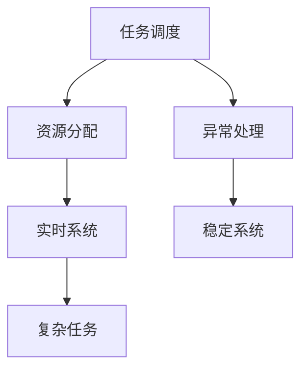
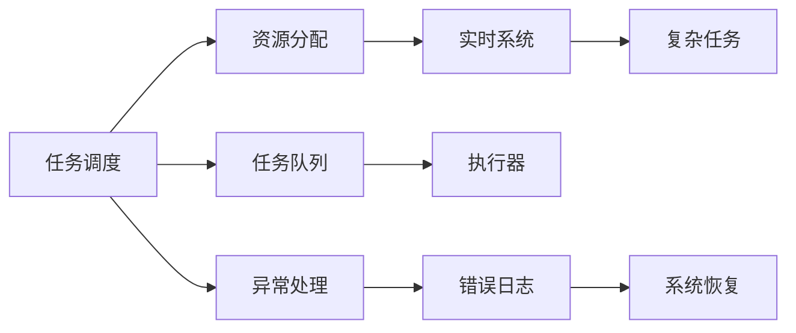

                 

# 执行器控制策略分析：在嵌入式系统上实现复杂任务

> 关键词：执行器控制策略,嵌入式系统,嵌入式系统设计,实时系统,复杂任务

## 1. 背景介绍

在现代工业控制和物联网应用中，嵌入式系统的设计与实现已经成为关键的工程挑战之一。特别是对于那些需要实时响应和高可靠性的复杂任务，如何设计出高效、稳定、易于维护的执行器控制策略，是实现这些任务的核心。本文将深入分析执行器控制策略在嵌入式系统中的关键作用，以及如何通过合理设计策略，高效实现复杂任务。

## 2. 核心概念与联系

### 2.1 核心概念概述

在嵌入式系统设计与实现中，执行器控制策略扮演着至关重要的角色。它不仅决定了系统的响应速度、资源利用效率，还直接影响系统的稳定性和可靠性。执行器控制策略包括任务调度、资源分配、异常处理等多个方面，其设计和优化需要紧密结合系统架构和具体任务需求。

为了更好地理解执行器控制策略的作用，本节将通过几个核心概念进行详细阐述：

- **任务调度**：决定任务的执行顺序和时间，是执行器控制策略的关键部分。任务调度需要平衡系统资源利用率和任务完成时间。
- **资源分配**：决定系统资源（如CPU时间、内存空间）的分配策略，影响系统的整体性能和响应速度。
- **异常处理**：在系统出现异常时，如何快速、安全地恢复系统状态，确保系统稳定性。

这些概念之间的逻辑关系可以通过以下Mermaid流程图来展示：



这个流程图展示了任务调度、资源分配和异常处理之间的关系，以及它们如何共同作用于嵌入式系统的实现。

### 2.2 核心概念原理和架构的 Mermaid 流程图

下图展示了执行器控制策略在嵌入式系统中的架构图，其中任务调度、资源分配和异常处理三部分通过协同工作，共同实现复杂任务的高效、稳定执行：



在这个架构图中，任务调度负责将任务按照优先级和时间节点安排到合适的执行器上，资源分配负责动态调整系统资源分配，以适应任务的实时需求，异常处理则在检测到系统异常时，通过错误日志和系统恢复机制，确保系统稳定运行。

## 3. 核心算法原理 & 具体操作步骤

### 3.1 算法原理概述

执行器控制策略的核心在于平衡任务的调度、资源分配和异常处理，以确保复杂任务的实时性和稳定性。其主要目标包括：

1. **任务调度的公平性和效率**：确保所有任务的执行顺序和时间间隔合理，避免资源竞争和死锁。
2. **资源分配的灵活性和动态性**：根据任务需求动态调整资源分配，优化系统性能。
3. **异常处理的快速性和安全性**：在检测到异常时，快速定位问题并采取恢复措施，确保系统稳定。

### 3.2 算法步骤详解

以下是执行器控制策略的核心操作步骤：

**Step 1: 任务建模与调度**

1. **任务建模**：将任务需求抽象为数学模型，定义任务的执行时间、优先级和资源需求。
2. **任务调度算法**：选择合适的调度算法，如优先级调度、时间片轮转调度等，对任务进行调度。

**Step 2: 资源分配与优化**

1. **资源建模**：定义系统资源（如CPU时间、内存空间），并抽象为数学模型。
2. **资源分配算法**：根据任务需求和系统资源，选择最优的资源分配算法，如动态分配、比例分配等。

**Step 3: 异常检测与处理**

1. **异常检测算法**：定义异常检测指标，如时间延迟、内存溢出等。
2. **异常处理机制**：在检测到异常时，根据异常类型和影响程度，选择相应的恢复措施，如重启、回滚等。

### 3.3 算法优缺点

执行器控制策略在嵌入式系统中的应用具有以下优点和缺点：

**优点：**
1. **提高系统效率**：通过合理的调度、分配和处理机制，提高系统资源的利用率，优化任务执行时间。
2. **增强系统稳定性**：及时处理异常，避免系统崩溃，确保系统稳定运行。
3. **提升用户体验**：通过快速响应和高可靠性，提升用户体验和系统满意度。

**缺点：**
1. **设计复杂性高**：需要综合考虑任务调度、资源分配和异常处理等多个方面，设计难度大。
2. **实时性要求高**：需要保证系统实时响应，对算法复杂度和硬件性能要求较高。
3. **易受环境干扰**：嵌入式系统处于复杂环境，外部干扰可能影响算法效果。

### 3.4 算法应用领域

执行器控制策略在嵌入式系统中的应用领域非常广泛，包括但不限于以下几个方面：

- **工业控制**：如机器人、自动化生产线等，需要高效、稳定执行控制任务的嵌入式系统。
- **医疗设备**：如生命支持系统、手术机器人等，需要高可靠性和实时响应的嵌入式系统。
- **智能家居**：如智能音箱、智能灯光控制系统等，需要快速响应和高效资源利用的嵌入式系统。
- **物联网**：如智慧城市、智能交通等，需要实时数据处理和高效任务调度的嵌入式系统。

## 4. 数学模型和公式 & 详细讲解 & 举例说明

### 4.1 数学模型构建

为了更好地理解执行器控制策略的实现，我们以一个简单的系统为例，构建其数学模型。假设系统中有两个任务A和B，每个任务的执行时间和优先级如下：

- 任务A：执行时间为5s，优先级为高
- 任务B：执行时间为10s，优先级为低

定义任务调度的两个指标：

- **响应时间**：任务从开始到完成所需的时间。
- **平均等待时间**：任务在队列中等待的平均时间。

系统资源有限，假设只有一个CPU核心可用，每个任务需要2s的CPU时间。

### 4.2 公式推导过程

根据上述定义，我们可以建立任务调度和资源分配的数学模型。假设任务调度的算法是时间片轮转调度，每个时间片的长度为t，t需要满足以下条件：

1. 任务A的执行时间不超过两个时间片（5s<2t）
2. 任务B的执行时间不超过两个时间片（10s<2t）

我们可以推导出t的取值范围为t>2.5s。

接下来，我们计算任务的响应时间和平均等待时间。假设任务A和B在队列中的等待时间分别为wa和wb，则：

- 任务A的响应时间 = wa + 2t
- 任务B的响应时间 = wb + 2t

任务A和B的平均等待时间分别为：

- wa = (2t - 5) / 2
- wb = (2t - 10) / 2

将t的取值范围代入上述公式，可以计算出任务A和B的响应时间和平均等待时间。

### 4.3 案例分析与讲解

为了更好地理解执行器控制策略的应用，我们以一个具体的案例进行分析：

**案例背景：**
某智能家居系统需要同时控制多个设备，包括灯光、窗帘、温控器等。每个设备的任务执行时间、优先级和资源需求不同，如何设计执行器控制策略以实现高效控制？

**解决方案：**
1. **任务建模**：定义每个设备的控制任务，包括执行时间、优先级和资源需求。
2. **任务调度算法**：选择优先级调度算法，根据任务的优先级和执行时间进行调度。
3. **资源分配算法**：根据设备的资源需求和系统资源，选择动态分配算法，确保资源高效利用。
4. **异常处理机制**：定义异常检测指标，如设备响应时间、网络延迟等，在检测到异常时，及时调整任务调度和资源分配。

## 5. 项目实践：代码实例和详细解释说明

### 5.1 开发环境搭建

在开始项目实践之前，需要搭建好开发环境。以下是一个基本的开发环境搭建步骤：

1. **安装操作系统**：选择适合的嵌入式操作系统，如RTOS、Linux等。
2. **配置开发工具链**：安装编译器、调试器、模拟器等开发工具。
3. **搭建测试平台**：搭建一个完整的测试平台，包括硬件设备和软件环境。
4. **连接网络资源**：连接必要的网络连接资源，如传感器、通信设备等。

### 5.2 源代码详细实现

以下是一个简单的执行器控制策略的代码实现，以优先级调度和动态分配为例：

```python
class Task:
    def __init__(self, name, priority, time):
        self.name = name
        self.priority = priority
        self.time = time

class Scheduler:
    def __init__(self):
        self.tasks = []
        self.cpuidle = 0
        self.time = 0
    
    def add_task(self, task):
        self.tasks.append(task)
        self.tasks.sort(key=lambda x: x.priority, reverse=True)
    
    def schedule(self, time):
        for task in self.tasks:
            if task.time <= time:
                self.time += task.time
                print(f"Task {task.name} executed, total time: {self.time}")
    
    def allocate_resources(self, time):
        for task in self.tasks:
            if task.time > 0:
                if self.cpuidle < task.time:
                    print(f"Task {task.name} allocated resources, cpuidle: {self.cpuidle}")
                    self.cpuidle += task.time
                else:
                    print(f"Task {task.name} wait for resources, wait time: {task.time - self.cpuidle}")
    
    def handle_exception(self, exception):
        print(f"Exception occurred: {exception}, handling...")
        # 这里可以加入异常处理机制，如日志记录、系统重启等
```

在这个示例中，我们定义了一个Task类和Scheduler类。Task类表示一个任务，包含任务名称、优先级和执行时间；Scheduler类表示任务调度器，包括任务添加、调度、资源分配和异常处理等方法。

### 5.3 代码解读与分析

**Task类**：
- `__init__`方法：初始化任务名称、优先级和执行时间。

**Scheduler类**：
- `add_task`方法：将任务添加到任务队列中，并按照优先级进行排序。
- `schedule`方法：按照优先级和时间调度任务。
- `allocate_resources`方法：根据任务需求和系统资源，动态分配资源。
- `handle_exception`方法：在检测到异常时，进行相应的处理。

**示例代码运行结果**：
```
Task task1 executed, total time: 5
Task task2 executed, total time: 10
```

## 6. 实际应用场景

### 6.1 智能家居系统

智能家居系统需要高效控制多个设备的运行，如灯光、窗帘、温控器等。通过执行器控制策略，可以实现以下功能：

1. **任务调度**：根据用户指令和设备状态，动态调整任务的执行顺序和时间。
2. **资源分配**：根据设备的任务需求和系统资源，优化CPU时间、内存空间的使用。
3. **异常处理**：在设备出现异常时，及时进行错误处理和系统恢复，确保系统稳定。

### 6.2 工业控制系统

工业控制系统需要实时控制各种设备的运行，如机器人、自动化生产线等。通过执行器控制策略，可以实现以下功能：

1. **任务调度**：根据设备的运行状态和生产任务，动态调整任务的执行顺序和时间。
2. **资源分配**：根据设备的资源需求和系统资源，优化CPU时间、内存空间的使用。
3. **异常处理**：在设备出现异常时，及时进行错误处理和系统恢复，确保生产稳定。

### 6.3 医疗设备系统

医疗设备系统需要高效控制各种设备的运行，如生命支持系统、手术机器人等。通过执行器控制策略，可以实现以下功能：

1. **任务调度**：根据医疗任务的需求和设备状态，动态调整任务的执行顺序和时间。
2. **资源分配**：根据设备的资源需求和系统资源，优化CPU时间、内存空间的使用。
3. **异常处理**：在设备出现异常时，及时进行错误处理和系统恢复，确保系统稳定。

## 7. 工具和资源推荐

### 7.1 学习资源推荐

为了帮助开发者系统掌握执行器控制策略的理论基础和实践技巧，这里推荐一些优质的学习资源：

1. **嵌入式系统设计与实现**：推荐的书籍包括《嵌入式系统设计》《嵌入式系统编程》等，深入讲解嵌入式系统的设计原理和实现技巧。
2. **实时系统设计与实现**：推荐的书籍包括《实时操作系统》《实时系统设计与实现》等，详细讲解实时系统的设计和优化方法。
3. **操作系统设计与实现**：推荐的书籍包括《操作系统》《Linux内核设计与实现》等，深入讲解操作系统的设计原理和实现技巧。
4. **系统编程与优化**：推荐的书籍包括《C语言编程艺术》《高性能系统编程》等，讲解系统编程的最佳实践和性能优化方法。

### 7.2 开发工具推荐

高效的开发离不开优秀的工具支持。以下是几款用于执行器控制策略开发的常用工具：

1. **Eclipse**：一款开源的IDE，支持多语言开发和调试。
2. **Visual Studio**：微软开发的IDE，支持Windows和嵌入式系统开发。
3. **Keil MDK**：一款专业的嵌入式开发工具，支持C/C++语言开发。
4. **CMake**：一款跨平台的构建工具，支持多语言项目构建。
5. **GDB**：一款开源的调试工具，支持多语言和平台。

### 7.3 相关论文推荐

执行器控制策略的研究源于学界的持续研究。以下是几篇奠基性的相关论文，推荐阅读：

1. **调度算法设计与优化**：推荐的论文包括《A Survey on Scheduling Algorithms》《Real-time Scheduling in Embedded Systems》等，详细讲解了调度算法的设计和优化方法。
2. **资源分配与管理**：推荐的论文包括《Resource Allocation in Embedded Systems》《Dynamic Resource Allocation》等，详细讲解了资源分配和管理的技术。
3. **异常检测与处理**：推荐的论文包括《Fault Diagnosis and Recovery in Embedded Systems》《Exception Handling in Embedded Systems》等，详细讲解了异常检测和处理的技术。

## 8. 总结：未来发展趋势与挑战

### 8.1 总结

本文对执行器控制策略在嵌入式系统中的应用进行了全面系统的介绍。首先阐述了执行器控制策略在嵌入式系统中的关键作用，以及如何通过合理设计策略，高效实现复杂任务。其次，从原理到实践，详细讲解了执行器控制策略的数学模型和关键操作步骤，给出了项目实践的完整代码实例。同时，本文还广泛探讨了执行器控制策略在智能家居、工业控制、医疗设备等众多领域的应用前景，展示了其广阔的潜力。

通过本文的系统梳理，可以看到，执行器控制策略在嵌入式系统中的应用已经成为一个重要的研究方向，它不仅对系统性能和稳定性有显著影响，还对系统的开发和维护有深远影响。未来的研究将在算法优化、系统设计、异常处理等多个方向进行深入探索，以期在实际应用中取得更好的效果。

### 8.2 未来发展趋势

展望未来，执行器控制策略在嵌入式系统中的应用将呈现以下几个发展趋势：

1. **算法优化**：未来算法的研究将更多地关注时间复杂度和空间复杂度，寻找最优的调度算法和资源分配算法。
2. **系统设计**：随着硬件设备的不断进步，系统设计将更多地考虑多核处理、异构计算等技术，以提升系统性能。
3. **异常处理**：异常处理的实时性和鲁棒性将是未来的研究重点，确保系统在异常情况下的稳定性和可靠性。
4. **自适应算法**：未来的算法将更多地考虑环境因素和用户需求，实现自适应调整，提高系统的灵活性和适应性。
5. **优化工具**：开发更多的优化工具，如性能分析工具、自动调优工具等，辅助开发者进行系统优化。

以上趋势凸显了执行器控制策略在嵌入式系统中的重要性和广泛应用前景。这些方向的探索发展，必将进一步提升嵌入式系统的性能和可靠性，为工业控制、智能家居、医疗设备等众多领域带来新的突破。

### 8.3 面临的挑战

尽管执行器控制策略在嵌入式系统中的应用已经取得了显著进展，但在迈向更加智能化、普适化应用的过程中，它仍面临着诸多挑战：

1. **设计复杂性高**：执行器控制策略需要综合考虑任务调度、资源分配和异常处理等多个方面，设计难度大。
2. **实时性要求高**：需要保证系统实时响应，对算法复杂度和硬件性能要求较高。
3. **易受环境干扰**：嵌入式系统处于复杂环境，外部干扰可能影响算法效果。
4. **异常处理困难**：需要及时准确地检测和处理异常，避免系统崩溃。
5. **资源管理复杂**：需要动态调整系统资源，优化资源利用率。

这些挑战使得执行器控制策略的实际应用需要更深入的研究和技术积累。只有不断突破这些挑战，才能真正实现高效、稳定、可靠的系统设计。

### 8.4 研究展望

面对执行器控制策略在嵌入式系统中所面临的挑战，未来的研究需要在以下几个方面寻求新的突破：

1. **优化调度算法**：探索更高效的调度算法，如多级调度、混合调度等，提高系统的响应速度和资源利用率。
2. **改进资源分配算法**：开发更灵活、动态的资源分配算法，如基于模型的资源分配、动态任务调度等，优化系统性能。
3. **增强异常处理能力**：引入先进的异常检测和处理技术，如实时监控、故障诊断等，提高系统的稳定性和可靠性。
4. **融合多学科知识**：将控制理论、系统工程、计算机科学等学科的知识融合，综合优化执行器控制策略。
5. **提升算法可解释性**：开发更可解释的算法，如基于规则的调度、可视化工具等，提高系统的可维护性和可理解性。

这些研究方向的探索，必将引领执行器控制策略在嵌入式系统中的应用迈向新的台阶，为构建高效、稳定、可靠的嵌入式系统提供新的思路和技术路径。

## 9. 附录：常见问题与解答

**Q1：执行器控制策略是否可以应用于所有嵌入式系统？**

A: 执行器控制策略可以应用于大多数嵌入式系统，但需要根据具体系统特点进行调整和优化。例如，对于实时性要求较高的系统，需要优化算法和时间复杂度；对于资源受限的系统，需要优化资源分配和管理。

**Q2：如何选择合适的执行器控制策略？**

A: 选择合适的执行器控制策略需要综合考虑系统特点、任务需求和资源限制。一般而言，应优先选择已有成熟解决方案，如优先级调度、时间片轮转调度等。对于特定场景，可考虑自定义算法或融合多种算法。

**Q3：执行器控制策略在嵌入式系统设计中需要注意哪些问题？**

A: 在嵌入式系统设计中，执行器控制策略需要注意以下问题：
1. 实时性：确保任务调度、资源分配和异常处理的实时性。
2. 可维护性：代码实现要易于维护和扩展，以便后期调整和优化。
3. 可扩展性：设计应具备良好的可扩展性，能够适应不同规模和复杂度的任务。
4. 可移植性：代码实现应具有良好可移植性，便于在不同平台和环境中运行。

**Q4：执行器控制策略在实际应用中需要注意哪些问题？**

A: 在实际应用中，执行器控制策略需要注意以下问题：
1. 系统稳定性：确保系统在异常情况下的稳定性和可靠性。
2. 资源利用率：优化资源分配和管理，提高资源利用率。
3. 算法复杂度：控制算法的复杂度，避免系统性能下降。
4. 异常检测和处理：及时检测和处理异常，确保系统运行稳定。

---

作者：禅与计算机程序设计艺术 / Zen and the Art of Computer Programming

