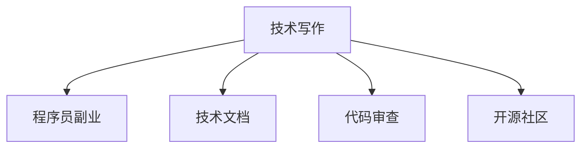

                 

# 技术写作：程序员的副业选择

## 1. 背景介绍

### 1.1 问题由来
在现代社会，技术的飞速发展给程序员带来了前所未有的机遇与挑战。如何充分利用自身的技术优势，找到适合的工作与职业道路，是每位程序员都需要面对的重要课题。技术写作作为程序员重要的技能之一，不仅能帮助开发者更好地理解和学习技术知识，还能为开发者开辟新的职业道路。

### 1.2 问题核心关键点
技术写作作为程序员副业选择的重要方面，其核心在于将复杂的技术内容以易懂的方式表达出来。这不仅要求写作人员有深厚的技术功底，更要有良好的语言表达能力，以及广泛的知识面。

## 2. 核心概念与联系

### 2.1 核心概念概述

为更好地理解技术写作作为程序员副业的选择，本节将介绍几个关键概念：

- **技术写作**：指将技术知识、算法原理、编程技巧等内容以书面形式表达出来，帮助他人更好地理解和学习技术知识。
- **程序员副业**：指程序员在主业之外从事的额外工作，用以丰富职业生涯、增加收入来源。
- **技术文档**：包括编程语言文档、API文档、代码注释、技术博客等，是技术写作的重要形式。
- **代码审查**：通过参与代码审查，程序员可以提升自身的编码能力，同时也能对技术写作进行实践。
- **开源社区**：在开源社区中，程序员可以通过参与项目、编写代码，积累技术写作经验，并与其他开发者交流协作。

这些核心概念之间的逻辑关系可以通过以下Mermaid流程图来展示：



这个流程图展示出技术写作与程序员副业之间的联系，以及技术写作实现的具体形式和路径。

## 3. 核心算法原理 & 具体操作步骤

### 3.1 算法原理概述

技术写作的算法原理，本质上是一种信息提取和加工的过程。它涉及以下步骤：

1. **信息提取**：从技术内容中提取核心信息，明确主要技术和方法。
2. **内容组织**：将提取的核心信息按照逻辑顺序组织起来，构建清晰的文档结构。
3. **语言表达**：使用易懂的语言表达技术内容，并辅以图表、代码示例等辅助工具。

技术写作的输出，包括但不限于：

- **技术博客**：关于某项技术的学习、使用和优化的文章。
- **技术教程**：详细介绍某项技术的实现方法、算法原理和应用场景。
- **技术手册**：对某项技术的详细介绍，包括安装、配置、使用等。

### 3.2 算法步骤详解

以下详细讲解技术写作的具体操作步骤：

1. **需求分析**：明确写作目的和目标受众，分析受众的需求和技术背景。
2. **内容规划**：确定文档的结构和内容，列出主要章节和子章节。
3. **信息收集**：收集相关技术资料、代码示例、案例分析等，形成初稿。
4. **语言表达**：使用清晰、简洁、准确的语言表达技术内容，避免使用过于专业的术语。
5. **图表和示例**：使用图表、代码示例、图像等辅助工具，帮助读者更好地理解技术内容。
6. **校对和修改**：多次校对和修改文档，确保内容的准确性和逻辑性。
7. **发布和更新**：发布文档并及时更新，确保内容的时效性和准确性。

### 3.3 算法优缺点

技术写作作为程序员副业的选择，有以下优点：

- **提升技能**：通过技术写作可以提升技术理解、表达能力和逻辑思维能力。
- **扩展知识面**：写作需要广泛阅读和研究，可以拓展知识面，学习新技术。
- **增加收入**：通过撰写技术博客、教程、书籍等可以获得收入，增加经济收益。
- **提升影响力**：写作可以提升个人品牌和影响力，成为技术领域的专家。

同时，技术写作也存在一定的局限性：

- **时间和精力投入**：写作需要投入大量时间和精力，可能影响主业工作。
- **写作难度较大**：要求较强的技术功底和表达能力，非一蹴而就。
- **市场竞争激烈**：技术写作市场竞争激烈，需要不断创新和提高。

### 3.4 算法应用领域

技术写作作为程序员副业，可以应用于多个领域：

- **开源项目**：为开源项目编写技术文档、使用手册、API文档等。
- **技术博客**：撰写技术博客，分享技术心得、使用经验、项目案例等。
- **企业内训**：为企业内员工编写培训文档、技术手册、代码示例等。
- **技术书籍**：编写技术书籍，系统地介绍某项技术或领域。
- **在线教育**：参与在线教育平台的课程编写、技术讲解、互动答疑等。

## 4. 数学模型和公式 & 详细讲解 & 举例说明

### 4.1 数学模型构建

技术写作中的数学模型主要涉及对技术内容的数学化表达和逻辑推导。假设有一项技术 $T$，其核心算法为 $A$，包含 $n$ 个步骤 $S_1, S_2, \ldots, S_n$，每步操作的输入为 $x_i$，输出为 $y_i$。那么，该技术的数学模型可以表示为：

$$
T: S_1(x_1) \rightarrow y_1, S_2(y_1) \rightarrow y_2, \ldots, S_n(y_{n-1}) \rightarrow y_n
$$

### 4.2 公式推导过程

以一个简单的排序算法为例，其数学模型如下：

$$
A: S_1(a) = \begin{cases}
    (a_1 \leq a_2) & \text{if } a_1 < a_2 \\
    (a_1 \geq a_2) & \text{if } a_1 > a_2
\end{cases}
$$

其中 $a$ 为待排序的数组。通过上述算法，可以将任意两个元素进行排序。

### 4.3 案例分析与讲解

以编写一个Python列表排序算法为例，推导其技术写作过程：

1. **需求分析**：确定读者对象为Python初学者，目标为介绍排序算法的基本原理和实现方法。
2. **内容规划**：分为算法原理、代码实现、时间复杂度分析和实例演示等章节。
3. **信息收集**：收集Python列表排序的算法原理、代码实现、时间复杂度分析和实例演示等内容。
4. **语言表达**：使用简洁、易懂、准确的语言表达算法原理和实现方法，并通过代码示例帮助读者理解。
5. **图表和示例**：使用流程图、代码示例、输出示例等辅助工具，帮助读者更好地理解算法。
6. **校对和修改**：多次校对和修改文档，确保内容的准确性和逻辑性。
7. **发布和更新**：发布文档并及时更新，确保内容的时效性和准确性。

## 5. 项目实践：代码实例和详细解释说明

### 5.1 开发环境搭建

在进行技术写作实践前，我们需要准备好开发环境。以下是使用Python进行技术写作的环境配置流程：

1. 安装Anaconda：从官网下载并安装Anaconda，用于创建独立的Python环境。

2. 创建并激活虚拟环境：
```bash
conda create -n pytech-env python=3.8 
conda activate pytech-env
```

3. 安装PyTorch：根据CUDA版本，从官网获取对应的安装命令。例如：
```bash
conda install pytorch torchvision torchaudio cudatoolkit=11.1 -c pytorch -c conda-forge
```

4. 安装各种开发工具：
```bash
pip install numpy pandas scikit-learn matplotlib tqdm jupyter notebook ipython
```

完成上述步骤后，即可在`pytech-env`环境中开始技术写作实践。

### 5.2 源代码详细实现

下面我们以编写Python列表排序算法为例，给出技术写作的PyTorch代码实现。

首先，定义排序算法的函数：

```python
def bubble_sort(arr):
    n = len(arr)
    for i in range(n-1):
        for j in range(0, n-i-1):
            if arr[j] > arr[j+1]:
                arr[j], arr[j+1] = arr[j+1], arr[j]
    return arr
```

然后，定义技术文档的示例代码：

```python
import matplotlib.pyplot as plt
import numpy as np

# 创建一个待排序的数组
arr = np.random.rand(100)
arr = np.round(arr)

# 对数组进行排序
sorted_arr = bubble_sort(arr)

# 可视化排序前后数组的变化
plt.figure(figsize=(10, 5))
plt.plot(arr, 'o', label='Before')
plt.plot(sorted_arr, 'o', label='After')
plt.legend()
plt.show()
```

最后，结合技术文档和代码实例，撰写完整的技术写作文章：

```markdown
# Python 列表排序算法

## 1. 引言
在Python编程中，排序是一个常见的操作。本文将介绍一种简单的排序算法——冒泡排序（Bubble Sort），并使用代码示例进行详细讲解。

## 2. 算法原理
冒泡排序是一种简单的交换排序算法。它的基本思想是，通过相邻元素的比较和交换，逐步将大的元素“冒泡”到数组的末尾。

## 3. 代码实现
以下是使用Python实现冒泡排序的代码：

```python
def bubble_sort(arr):
    n = len(arr)
    for i in range(n-1):
        for j in range(0, n-i-1):
            if arr[j] > arr[j+1]:
                arr[j], arr[j+1] = arr[j+1], arr[j]
    return arr
```

## 4. 时间复杂度分析
冒泡排序的时间复杂度为 $O(n^2)$，其中 $n$ 为数组长度。虽然它的时间复杂度较高，但对于小规模的数据，其效率仍然较高。

## 5. 实例演示
我们使用一个随机数组进行排序，并可视化排序前后的变化：

```python
import matplotlib.pyplot as plt
import numpy as np

# 创建一个待排序的数组
arr = np.random.rand(100)
arr = np.round(arr)

# 对数组进行排序
sorted_arr = bubble_sort(arr)

# 可视化排序前后数组的变化
plt.figure(figsize=(10, 5))
plt.plot(arr, 'o', label='Before')
plt.plot(sorted_arr, 'o', label='After')
plt.legend()
plt.show()
```

可以看到，冒泡排序将无序数组逐步排序，最终得到有序数组。

## 6. 结语
冒泡排序虽然时间复杂度较高，但对于小规模的数据，其效率仍然较高。在实际应用中，根据数据规模和场景选择适当的排序算法非常重要。

---

作者：禅与计算机程序设计艺术 / Zen and the Art of Computer Programming
```

以上就是使用PyTorch对Python列表排序算法进行技术写作的完整代码实现。可以看到，通过技术写作将算法原理和代码实现结合起来，可以帮助读者更好地理解和使用算法。

### 5.3 代码解读与分析

让我们再详细解读一下关键代码的实现细节：

**bubble_sort函数**：
- 定义了一个简单的冒泡排序算法，时间复杂度为$O(n^2)$。

**代码示例**：
- 使用NumPy生成一个随机数组，并将其可视化。
- 使用代码示例展示了冒泡排序的实现和效果。

**技术文档**：
- 通过Markdown语言编写的技术文档，详细讲解了冒泡排序的算法原理、代码实现和时间复杂度。
- 结合代码示例和可视化结果，使读者更直观地理解算法。

可以看到，技术写作不仅需要深厚的技术功底，还需要良好的表达能力和组织能力。通过技术写作，程序员可以将复杂的算法和概念以易懂的方式表达出来，帮助他人更好地理解和学习技术知识。

## 6. 实际应用场景

### 6.1 开源项目

在开源项目中，技术写作是开发者必备的技能之一。通过编写技术文档、API文档、使用手册等，开发者可以帮助其他开发者更快地上手和使用项目，同时也能够展示自己的技术实力，提升个人品牌。

### 6.2 技术博客

技术博客是程序员展示自己技术能力的重要平台。通过撰写技术文章、分享使用心得、展示项目案例等，程序员可以积累更多的经验，结识更多志同道合的朋友，甚至可以通过技术博客赚取收入。

### 6.3 企业内训

在企业内部，技术写作也是提升员工技能、提高团队效率的重要手段。通过编写培训文档、技术手册、代码示例等，技术写作可以帮助企业员工更好地理解和学习技术知识，提升整体技术水平。

### 6.4 技术书籍

技术书籍是技术写作的高级形式。通过系统地介绍某项技术或领域，编写技术书籍可以为读者提供全面的技术知识，提升其技术能力。同时，技术书籍也可以帮助作者积累更多的经验，提高技术影响力。

### 6.5 在线教育

在线教育平台需要大量的技术内容来支撑课程教学。通过参与在线教育平台的课程编写、技术讲解、互动答疑等，程序员可以将自己的技术知识和经验转化为有价值的内容，为更多的学习者提供帮助。

## 7. 工具和资源推荐

### 7.1 学习资源推荐

为了帮助开发者系统掌握技术写作的理论基础和实践技巧，这里推荐一些优质的学习资源：

1. **《The Art of Writing》**：一本关于写作技巧的书籍，详细讲解了如何构思、组织、表达和校对一篇文章。
2. **《Effective Technical Writing》**：一本专门讲解技术写作的书籍，介绍了如何撰写技术文档、代码注释等。
3. **Coursera《Technical Writing》课程**：由加州大学圣地亚哥分校开设的课程，详细讲解了技术写作的各个方面。
4. **GitHub文档**：GitHub提供的官方文档，详细介绍了如何编写高质量的GitHub文档，包括技术文档、API文档等。
5. **Stack Overflow问答**：Stack Overflow是一个问答社区，程序员可以在其中分享和获取技术写作的实践经验和建议。

通过对这些资源的学习实践，相信你一定能够快速掌握技术写作的精髓，并用于解决实际的写作问题。

### 7.2 开发工具推荐

高效的开发离不开优秀的工具支持。以下是几款用于技术写作开发的常用工具：

1. **Markdown编辑器**：如Jupyter Notebook、Typora等，用于编写和渲染Markdown文件。
2. **版本控制工具**：如Git，用于管理代码版本和协作。
3. **代码高亮工具**：如Prism.js，用于在文档中展示代码。
4. **代码托管平台**：如GitHub、GitLab，用于托管代码和文档。
5. **技术写作框架**：如Sphinx、MkDocs，用于自动生成文档。

合理利用这些工具，可以显著提升技术写作的效率和质量，加快内容创作的步伐。

### 7.3 相关论文推荐

技术写作作为程序员副业，其研究涉及多个领域。以下是几篇经典的相关论文，推荐阅读：

1. **《Automated Summary Generation of Technical Documents》**：一篇关于技术文档自动摘要的论文，探讨了如何自动生成技术文档的摘要，提高文档的可读性。
2. **《Educational Data Mining and Statistical Learning》**：一本关于教育数据挖掘的书籍，介绍了如何通过数据分析和机器学习技术改进教育内容。
3. **《Technical Writing in the Digital Age》**：一本关于数字时代技术写作的书籍，探讨了如何通过数字化技术改进技术写作的流程和效果。
4. **《Programming Education: A Conceptual Framework for Designing Effective Programs》**：一本关于编程教育的书籍，介绍了如何设计有效的编程课程和教学方法。
5. **《Effective Use of Technical Writing》**：一本关于技术写作使用的书籍，详细讲解了技术写作中的常见问题和解决方法。

这些论文代表了大语言模型微调技术的发展脉络。通过学习这些前沿成果，可以帮助研究者把握学科前进方向，激发更多的创新灵感。

## 8. 总结：未来发展趋势与挑战

### 8.1 总结

本文对技术写作作为程序员副业的选择进行了全面系统的介绍。首先阐述了技术写作在程序员副业中的重要性，明确了技术写作的各个核心概念及其之间的关系。其次，从原理到实践，详细讲解了技术写作的数学模型和操作步骤，给出了完整的代码实例。同时，本文还广泛探讨了技术写作在开源项目、技术博客、企业内训等诸多领域的实际应用场景，展示了技术写作的广泛前景。此外，本文精选了技术写作的相关资源，力求为读者提供全方位的技术指引。

通过本文的系统梳理，可以看到，技术写作作为程序员副业的选择，不仅能够提升技术写作能力和表达能力，还能拓展程序员的职业道路，带来更多的收益和机会。技术写作的普及和发展，必将使程序员更加广泛地展示其技术实力，为技术传播和知识共享带来深远的影响。

### 8.2 未来发展趋势

展望未来，技术写作作为程序员副业，将呈现以下几个发展趋势：

1. **内容多样化**：未来的技术写作将不再局限于代码、算法等技术内容，而是扩展到产品设计、用户体验、项目管理等多个方面。
2. **工具自动化**：随着技术的进步，未来的技术写作将更多地依赖于自动化工具，如AI辅助写作、自动化校对等，提升写作效率。
3. **跨领域融合**：技术写作将更多地与其他领域进行融合，如市场营销、产品设计、用户体验等，形成更加综合化的技术写作体系。
4. **社区协作**：未来的技术写作将更多地依赖于社区协作，通过平台、工具和标准，促进技术知识的传播和分享。
5. **全球化发展**：随着全球化的推进，技术写作将更多地涉及国际化的技术传播和交流，帮助更多的开发者学习和使用技术。

这些趋势展示了技术写作作为程序员副业的发展潜力和广阔前景。技术写作将成为程序员职业发展的关键技能，不断推动技术知识传播和创新。

### 8.3 面临的挑战

尽管技术写作作为程序员副业的选择前景广阔，但在迈向更加智能化、普适化应用的过程中，仍面临诸多挑战：

1. **技术壁垒**：技术写作需要较强的技术功底和表达能力，非一蹴而就，需要不断学习和积累。
2. **市场竞争**：技术写作市场竞争激烈，需要不断创新和提高，才能脱颖而出。
3. **时间和精力投入**：写作需要投入大量时间和精力，可能影响主业工作。
4. **写作难度较大**：写作要求较强的语言表达能力和逻辑思维能力，非一蹴而就。
5. **写作内容质量**：写作内容需要高质量、易读易理解，需要不断打磨和优化。

这些挑战需要通过不断的实践和探索，逐步克服和解决，才能使技术写作成为程序员副业的有效选择。

### 8.4 研究展望

面对技术写作作为程序员副业所面临的挑战，未来的研究需要在以下几个方面寻求新的突破：

1. **自动化工具的开发**：开发更多自动化写作和校对工具，提高写作效率和质量。
2. **内容质量提升**：研究和实践高质量技术写作的策略和方法，提升写作内容的质量和可读性。
3. **跨领域应用**：探索技术写作在更多领域的应用，如市场营销、产品设计、项目管理等，拓展技术写作的边界。
4. **社区协作机制**：研究和实践社区协作机制，促进技术写作的传播和分享。
5. **全球化传播**：研究和实践全球化技术写作的策略和方法，帮助更多开发者学习和使用技术。

这些研究方向将推动技术写作的发展，使其成为程序员职业发展的重要组成部分，为技术传播和知识共享带来深远影响。

## 9. 附录：常见问题与解答

**Q1：如何提高技术写作的质量？**

A: 提高技术写作的质量需要从以下几个方面入手：
1. **理解受众**：明确目标受众的需求和技术背景，使用易懂的语言表达技术内容。
2. **组织结构**：合理组织文档结构，使用清晰的标题和子标题，帮助读者快速理解内容。
3. **图表和示例**：使用图表、代码示例、图像等辅助工具，帮助读者更好地理解技术内容。
4. **多次校对**：多次校对和修改文档，确保内容的准确性和逻辑性。
5. **借鉴和学习**：多读优秀的技术文档，借鉴和学习其写作方法和技巧。

**Q2：如何选择合适的技术写作工具？**

A: 选择合适的技术写作工具需要考虑以下几个方面：
1. **功能需求**：根据写作需求选择合适的工具，如Markdown编辑器、版本控制工具、代码高亮工具等。
2. **用户体验**：选择界面友好、操作便捷的工具，提升写作效率。
3. **协作能力**：选择支持多人协作、版本控制的工具，方便团队协作。
4. **扩展性**：选择具有良好扩展性和可定制性的工具，方便后续功能升级。
5. **社区支持**：选择社区活跃、文档齐全的工具，方便获取帮助和资源。

**Q3：如何平衡技术写作和主业工作？**

A: 平衡技术写作和主业工作需要从以下几个方面入手：
1. **时间管理**：合理安排时间，优先完成主业工作，再利用空闲时间进行写作。
2. **提高效率**：使用自动化工具和模板，提高写作效率，缩短写作时间。
3. **设定目标**：设定明确的目标和计划，合理分配写作时间，避免拖延。
4. **团队协作**：加入技术写作社区或团队，共享资源和经验，提升写作水平。
5. **持续学习**：不断学习和积累技术写作技巧和方法，提高写作能力。

这些建议可以帮助程序员更好地平衡技术写作和主业工作，提升写作效率和质量。

---

作者：禅与计算机程序设计艺术 / Zen and the Art of Computer Programming

