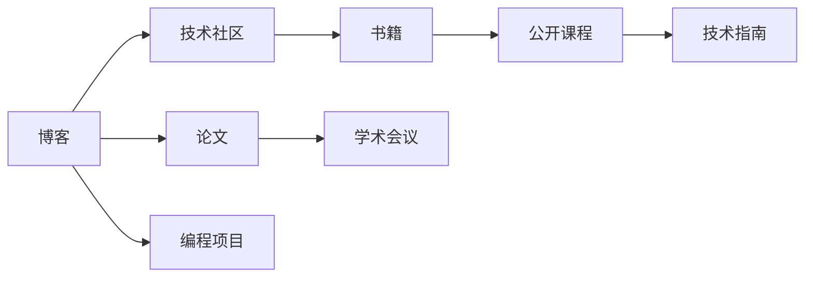

                 

# 技术写作：程序员的副业选择

> 关键词：技术写作, 副业, 程序员, 编程, 博客, 书籍, 论文, 沟通技能, 职业发展

## 1. 背景介绍

### 1.1 问题由来
在快速发展的科技浪潮中，程序员不仅需要专注核心技术，还需要具备良好的沟通和写作能力。技术写作，作为程序员的重要技能，不仅能提升个人职业竞争力，还能为技术社区贡献力量。本文将探讨技术写作的多种选择，帮助程序员在副业道路上找到属于自己的方向。

### 1.2 问题核心关键点
技术写作的核心在于通过文字传达复杂技术概念，使其易于理解和传播。核心关键点包括：

1. **选择合适的写作平台**：博客、书籍、论文、技术社区等都是可行的选择。
2. **掌握写作技巧**：清晰的结构、逻辑、案例、图表等都是必备元素。
3. **保持技术更新**：持续学习和积累新知识是写作的不竭动力。
4. **关注读者需求**：了解目标受众，提供有价值的内容，是写作成功的关键。

## 2. 核心概念与联系

### 2.1 核心概念概述

技术写作是一个广泛而复杂的领域，涉及多种类型和风格的文章。核心概念包括：

- **博客(Blog)**：是作者分享观点和技术的平台，通常以短文形式呈现，更新频繁。
- **书籍**：深入探讨某一主题，结构严谨，内容详实，适合系统学习。
- **论文**：是学术界的成果展示，通常包含研究方法、实验数据、结果分析等，具有较高的权威性。
- **技术社区**：如Stack Overflow、GitHub、Medium等，是程序员交流、分享知识的社区。

这些概念之间有着密切的联系，博客和书籍的写作可以成为学术论文的灵感来源，技术社区也常常是书籍和博客内容的反馈渠道。

### 2.2 核心概念原理和架构的 Mermaid 流程图(Mermaid 流程节点中不要有括号、逗号等特殊字符)



这个流程图展示了技术写作的主要路径和联系：

1. **博客**：通过技术社区反馈，逐渐构建起更系统化的内容。
2. **书籍**：积累博客中的成熟内容，形成更深入的探讨。
3. **论文**：在学术会议上分享，提高影响力和权威性。
4. **公开课程**：结合编程项目，系统讲解技术细节。
5. **技术指南**：基于编程项目，提供实用参考。

## 3. 核心算法原理 & 具体操作步骤

### 3.1 算法原理概述

技术写作的算法原理主要体现在如何构建内容、如何组织结构和如何保持内容的相关性和时效性。关键步骤如下：

1. **选题**：选择感兴趣且适合读者需求的题目。
2. **构思**：构建文章结构，确定论点和案例。
3. **撰写**：使用简洁明了的语言和图表，阐述观点。
4. **修订**：根据反馈反复打磨，确保内容的准确性和可读性。
5. **发布**：选择合适的平台，广泛传播内容。

### 3.2 算法步骤详解

以下是技术写作的主要步骤：

**Step 1: 选题和调研**

1. **选题**：结合个人兴趣和市场需求，选定写作主题。
2. **调研**：收集相关文献、项目文档、代码示例等资料。

**Step 2: 结构规划**

1. **提纲制定**：制定文章框架，确定各部分内容。
2. **关键点提炼**：确定论点、案例、图表等关键信息。

**Step 3: 内容撰写**

1. **引言**：简要介绍背景和主题。
2. **主体**：详细阐述技术原理、案例、实验结果等。
3. **总结**：回顾文章要点，提出建议和展望。

**Step 4: 修订和优化**

1. **初稿完成**：初步完成内容撰写。
2. **读者反馈**：收集读者评论，进行修订。
3. **多次迭代**：反复打磨，确保内容的准确性和可读性。

**Step 5: 发布和维护**

1. **发布平台选择**：选择合适的平台，如博客、书籍、技术社区等。
2. **内容更新**：定期更新内容，保持时效性。
3. **互动交流**：与读者互动，解答疑问，积累经验。

### 3.3 算法优缺点

技术写作的优势在于：

1. **提升专业能力**：通过写作，深入学习技术和理论。
2. **扩大影响范围**：分享知识，获得更多关注和反馈。
3. **职业发展**：提升沟通和写作能力，增强职业竞争力。

缺点包括：

1. **时间成本**：写作需要大量时间和精力，可能影响主业。
2. **内容质量**：需要持续学习，保持内容的时效性和准确性。
3. **市场需求变化**：需要不断调整写作方向，以适应市场需求。

### 3.4 算法应用领域

技术写作广泛应用于多个领域：

- **开源社区**：如GitHub，通过技术博客和代码提交记录分享知识。
- **技术博客**：如Medium、博客园，系统分享编程经验和心得。
- **技术书籍**：系统介绍某一领域的理论和实践，如《深入理解计算机系统》。
- **学术论文**：在学术会议和期刊上发布研究结果，提升学术影响力。

## 4. 数学模型和公式 & 详细讲解 & 举例说明

### 4.1 数学模型构建

技术写作的数学模型通常涉及信息论、传播学和认知科学的理论，用于分析读者接受信息的过程。以下是一个简化的模型：

**读者模型**：
$$ R(t) = f(X(t), Y(t)) $$

- $R(t)$：读者在时间$t$的信息接收能力。
- $X(t)$：文章内容的质量（信息量、逻辑性、趣味性等）。
- $Y(t)$：读者的背景知识（专业领域、知识水平、兴趣点等）。

### 4.2 公式推导过程

- **信息量**：文章的逻辑清晰、数据丰富、例证充分。信息量$I$可以表示为：
$$ I = \log \frac{P(X)}{P(Y)} $$

- **读者背景知识**：读者对文章的预期理解能力$E$与背景知识$Y$有关：
$$ E = g(Y) $$

- **信息接收能力**：$R(t)$与$E$和$X$有关：
$$ R(t) = R_0 \cdot e^{I \cdot E(t)} $$

这里$R_0$为初始信息接收能力，$E(t)$为随时间变化的预期理解能力，$I$为信息量，$E$为读者背景知识。

### 4.3 案例分析与讲解

以一篇关于深度学习框架PyTorch的博客为例：

1. **选题**：选择当前热门的深度学习框架作为主题。
2. **调研**：查阅官方文档、论文和社区讨论。
3. **结构规划**：文章分为引言、基本概念、实战示例、应用场景四部分。
4. **内容撰写**：详细介绍PyTorch的原理、API、性能对比等。
5. **修订优化**：发布后，收集读者反馈，进行多次修订，增加示例代码和实战案例。
6. **发布平台**：选择Medium发布，积累粉丝和互动。

## 5. 项目实践：代码实例和详细解释说明

### 5.1 开发环境搭建

- **Python**：安装Python 3.8以上版本。
- **Markdown编辑器**：如VS Code、Typora等，支持Markdown语法。
- **GitHub**：用于代码管理和版本控制。
- **Git**：学习Git基本命令，熟悉版本控制流程。
- **Jupyter Notebook**：用于数据处理和代码示例。

### 5.2 源代码详细实现

以下是一个简单的技术写作示例，使用Markdown语法编写博客文章。

```markdown
# 浅谈深度学习框架PyTorch

## 引言
深度学习是当前机器学习领域的热点，PyTorch作为一款流行的开源框架，以其易用性和灵活性受到广泛关注。本文将介绍PyTorch的基本原理和实战应用。

## 基本概念
PyTorch由Facebook开源，提供动态计算图和静态计算图两种模式。其核心模块包括Tensor、神经网络模块、优化器等。

## 实战示例
```

### 5.3 代码解读与分析

代码解读与分析主要关注以下几个方面：

1. **Markdown语法**：了解如何定义标题、列表、加粗、代码块等基本语法。
2. **GitHub管理**：学习如何在GitHub创建仓库、提交代码、管理版本。
3. **Jupyter Notebook**：掌握如何运行代码、展示图表、添加注释。

### 5.4 运行结果展示

运行结果展示主要通过GitHub仓库和博客平台进行。具体步骤如下：

1. **GitHub仓库**：
   - 上传代码文件，如`README.md`、`example.py`。
   - 添加仓库描述和README文件，解释项目内容和使用方法。

2. **博客平台**：
   - 选择Medium、博客园等平台，注册账号并发布博客文章。
   - 将GitHub仓库链接嵌入博客，方便读者查看代码和文档。

## 6. 实际应用场景

### 6.1 开源社区

在开源社区如GitHub上，技术写作可以以博客、README文件、代码提交记录等多种形式存在。通过这些文档，开发者可以分享经验、交流问题、协作开发。

### 6.2 技术博客

技术博客是程序员分享技术心得和行业观察的重要平台。通过技术博客，程序员可以获得更多曝光机会，建立个人品牌。

### 6.3 技术书籍

技术书籍是系统介绍某一领域的经典之作。撰写技术书籍需要系统的知识体系和深入的研究，适合有一定经验和影响力的开发者。

### 6.4 学术论文

学术论文是学术界的主要成果展示方式，通常包含实验数据和分析。通过学术会议和期刊发表，提升个人学术影响力。

## 7. 工具和资源推荐

### 7.1 学习资源推荐

1. **《技术写作之道》**：一本详细介绍技术写作方法的经典书籍。
2. **Coursera《技术写作和出版》课程**：系统学习技术写作技巧和出版流程。
3. **Grammarly**：用于语法和拼写检查的工具，提升写作质量。
4. **Semantic Scholar**：学术搜索引擎，查找相关文献和论文。
5. **GitHub Pages**：使用GitHub仓库托管博客，提供静态网站服务。

### 7.2 开发工具推荐

1. **Visual Studio Code**：轻量级的IDE，支持多种编程语言。
2. **GitHub Desktop**：简单易用的Git客户端，适合初学者。
3. **GitHub Pages**：基于GitHub仓库的静态网站服务。
4. **Hacker News**：技术社区，讨论技术热点和行业动态。
5. **Medium**：技术博客平台，支持文章发布和互动。

### 7.3 相关论文推荐

1. **《技术写作和出版》**：多伦多大学开设的课程，涵盖技术写作的各个方面。
2. **《开源社区中技术写作的实践》**：探讨开源社区中技术写作的最佳实践。
3. **《技术写作的未来趋势》**：预测未来技术写作的发展方向和趋势。

## 8. 总结：未来发展趋势与挑战

### 8.1 总结

技术写作作为程序员的重要副业，不仅能提升个人技能，还能扩大影响力，实现职业发展。本文详细介绍了技术写作的各个环节和注意事项，帮助程序员找到适合自己的副业方向。

### 8.2 未来发展趋势

未来技术写作将更加注重以下趋势：

1. **跨平台协作**：随着远程工作的普及，跨平台协作工具和平台将更受欢迎。
2. **多媒体结合**：视频、动画等多媒体形式将更多地融入技术写作。
3. **社区互动**：技术社区的活跃度和互动性将成为衡量写作效果的重要指标。
4. **持续学习**：技术的快速发展要求作者持续学习和更新知识。
5. **内容创新**：创新性内容更能吸引读者，提升阅读体验。

### 8.3 面临的挑战

技术写作在发展的过程中也面临以下挑战：

1. **时间管理**：平衡主业和副业，需要高效的时间管理。
2. **内容质量**：保持内容的时效性和准确性，需要持续学习和实践。
3. **市场需求变化**：技术发展迅速，需要及时调整写作方向。
4. **读者反馈**：获取和处理读者反馈，需要良好的沟通和互动能力。
5. **版权问题**：注意版权保护，避免侵权风险。

### 8.4 研究展望

未来的技术写作研究将更加注重：

1. **自动化工具**：开发自动化写作工具，提升写作效率。
2. **情感分析**：通过情感分析技术，优化写作策略和内容。
3. **社区反馈**：利用社区反馈，优化写作内容和风格。
4. **多模态结合**：结合图像、音频等多模态数据，提升内容的丰富性和表现力。
5. **教育培训**：开发技术写作培训课程，提升作者的写作能力。

## 9. 附录：常见问题与解答

**Q1：如何选择合适的写作平台？**

A: 根据内容性质和受众选择平台。博客适合日常分享和互动，书籍和论文适合深度探讨和学术交流。GitHub适合代码和文档展示，技术社区适合交流和协作。

**Q2：如何提升写作质量？**

A: 学习语法和拼写检查工具，多读经典和技术书籍，多写多练，积极与读者互动，反复打磨内容。

**Q3：如何选择写作主题？**

A: 结合个人兴趣和市场需求，选择有价值且具有挑战性的主题，确保内容的时效性和实用性。

**Q4：如何平衡主业和副业？**

A: 制定详细的时间管理计划，优先处理重要任务，避免过度投入。合理利用闲暇时间，保持持续学习。

**Q5：如何应对市场需求变化？**

A: 关注行业动态和技术趋势，及时调整写作方向，保持内容的时效性和相关性。

总之，技术写作是程序员副业的重要选择，不仅能提升个人职业竞争力，还能为技术社区贡献力量。通过合理选择平台、持续学习和实践，相信每位程序员都能在副业道路上取得成功。

