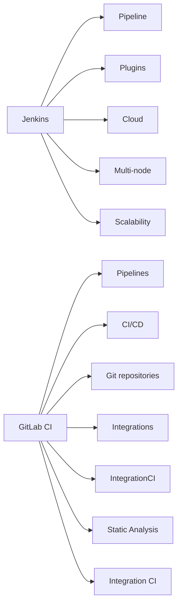

                 

# 持续集成工具选择：Jenkins 和 GitLab CI 的比较与优势

## 1. 背景介绍

### 1.1 问题由来
随着软件开发的日益复杂，持续集成(Continuous Integration, CI)成为了现代软件开发不可或缺的一部分。持续集成工具帮助开发者自动化测试和构建过程，加快交付速度，提升代码质量和稳定性。

在过去十年中，Jenkins 和 GitLab CI 成为了持续集成领域的两个主要工具。Jenkins 作为一款开源的工具，功能强大，灵活度高，用户基础广泛。GitLab CI 则作为 GitLab 社区的一部分，整合了代码管理、代码审查、版本控制等功能，构建了从代码到部署的一站式解决方案。

本文将深入探讨 Jenkins 和 GitLab CI 的设计原理、功能特点和应用优势，以帮助开发者选择合适的持续集成工具。

## 2. 核心概念与联系

### 2.1 核心概念概述

为更好地理解 Jenkins 和 GitLab CI，我们首先介绍几个核心概念：

- **持续集成(Continuous Integration, CI)**：指软件团队频繁地将代码提交到共享仓库，通过自动化测试和构建过程验证代码质量，确保每次提交都无缺陷。
- **Jenkins**：一款开源的持续集成工具，提供丰富的插件和配置选项，能够适应各类规模的开发项目。
- **GitLab CI**：作为 GitLab 社区的一部分，GitLab CI 集成了 GitLab 的代码管理、代码审查、版本控制等功能，提供一站式开发工具链。

### 2.2 核心概念原理和架构的 Mermaid 流程图



这个图表展示了 Jenkins 和 GitLab CI 的核心概念和架构。

- Jenkins 的 Pipeline 是其最核心的功能，通过定义流水线配置文件，实现自动化构建和测试。
- Jenkins 通过丰富的插件和扩展，支持各类功能（如云构建、多节点构建、扩展性等），适用于各类规模的开发项目。
- GitLab CI 将 CI/CD 流程无缝集成到 GitLab 的代码管理和版本控制系统中，提供从代码提交到部署的一站式解决方案。

## 3. 核心算法原理 & 具体操作步骤

### 3.1 算法原理概述

持续集成工具的核心原理是自动化构建和测试过程。通过脚本和配置文件定义自动化流程，持续集成工具能够自动执行构建、测试、部署等环节，从而提升开发效率，减少人为错误。

Jenkins 和 GitLab CI 在原理上类似，都是通过配置文件定义自动化流程，实现持续集成。但两者在具体实现上有所区别。

### 3.2 算法步骤详解

#### Jenkins 的持续集成流程

1. **配置 Jenkinsfile**：定义 Jenkinsfile 文件，通过脚本描述构建、测试、部署等流程。
2. **安装 Jenkins 插件**：根据项目需求，安装 Jenkins 插件（如 Docker、Maven、Junit 等）。
3. **设置 Jenkins 云**：在 Jenkins 云上部署 Jenkins，确保 Jenkins 节点的高可用性和可扩展性。
4. **执行 Pipeline**：在 Jenkins 中执行 Pipeline，构建和测试项目。

#### GitLab CI 的持续集成流程

1. **配置 .gitlab-ci.yml**：定义 .gitlab-ci.yml 文件，通过 YAML 描述 CI/CD 流程。
2. **使用 GitLab 功能**：利用 GitLab 的代码管理、代码审查、版本控制等功能，简化 CI/CD 流程。
3. **设置 GitLab CI**：在 GitLab 上配置 GitLab CI，确保 CI/CD 流程的稳定性和可控性。
4. **执行 Pipeline**：在 GitLab 上执行 Pipeline，构建和测试项目。

### 3.3 算法优缺点

#### Jenkins 的优缺点

**优点**：
- 高度灵活：支持丰富的插件和扩展，能够适应各类规模和类型的项目。
- 高度可定制：支持定制化的 Pipeline 配置，灵活度较高。
- 社区支持：作为开源工具，Jenkins 有庞大的社区支持，插件和文档资源丰富。

**缺点**：
- 学习曲线较陡：需要一定的学习成本，配置文件较复杂。
- 管理和维护较复杂：由于高度灵活，管理和维护相对较复杂。
- 性能问题：在处理大规模项目时，性能问题可能较为突出。

#### GitLab CI 的优缺点

**优点**：
- 一站式解决方案：集成了 GitLab 的代码管理、代码审查、版本控制等功能，方便开发和部署。
- 集成度高：与 GitLab 无缝集成，方便代码和 CI/CD 流程的统一管理。
- 性能好：基于 GitLab 的分布式架构，性能较好，适用于大规模项目。

**缺点**：
- 灵活度相对较低：相比 Jenkins，GitLab CI 的配置相对简单，灵活度较低。
- 社区资源相对较少：作为 GitLab 社区的一部分，插件和文档资源相对较少。
- 学习曲线较陡：对于新手而言，学习曲线较陡，需要一定的上手时间。

### 3.4 算法应用领域

Jenkins 和 GitLab CI 都广泛应用于各类软件开发项目，特别是在以下领域：

- **Web 开发**：用于自动化构建、测试和部署 Web 应用，如 Spring、Django、Ruby on Rails 等。
- **移动应用**：用于自动化构建、测试和打包移动应用，如 Android、iOS 等。
- **大数据**：用于自动化构建、测试和部署大数据应用，如 Hadoop、Spark 等。
- **企业级应用**：用于自动化构建、测试和部署企业级应用，如 Java、.NET 等。
- **开源项目**：用于自动化构建、测试和部署开源项目，如 TensorFlow、Kubernetes 等。

## 4. 数学模型和公式 & 详细讲解 & 举例说明

本节我们将通过具体的数学模型和公式，详细讲解 Jenkins 和 GitLab CI 的持续集成过程。

### 4.1 数学模型构建

#### Jenkins

假设 Jenkinsfile 定义了以下构建流程：

```yaml
pipeline {
    agent any

    stages {
        stage('Build') {
            steps {
                sh 'mvn clean install'
            }
        }

        stage('Test') {
            steps {
                sh 'mvn test'
            }
        }

        stage('Deploy') {
            steps {
                sh 'mvn -Dmaven-skip-test deploy'
            }
        }
    }
}
```

此 Jenkinsfile 定义了构建、测试和部署三个阶段，每个阶段包含多个步骤，通过脚本实现自动化流程。

#### GitLab CI

假设 .gitlab-ci.yml 定义了以下 CI/CD 流程：

```yaml
stages:
  - build
  - test
  - deploy

build:
  stage: build
  script: mvn clean install

test:
  stage: test
  script: mvn test

deploy:
  stage: deploy
  script: mvn -Dmaven-skip-test deploy
```

此 .gitlab-ci.yml 定义了构建、测试和部署三个阶段，每个阶段通过简单脚本实现自动化流程。

### 4.2 公式推导过程

#### Jenkins

构建阶段的逻辑可以通过以下伪代码描述：

```java
void build() {
    // 执行 mvn clean install 命令
    // ...
}
```

测试阶段的逻辑可以通过以下伪代码描述：

```java
void test() {
    // 执行 mvn test 命令
    // ...
}
```

部署阶段的逻辑可以通过以下伪代码描述：

```java
void deploy() {
    // 执行 mvn -Dmaven-skip-test deploy 命令
    // ...
}
```

#### GitLab CI

构建阶段的逻辑可以通过以下伪代码描述：

```java
void build() {
    // 执行 mvn clean install 命令
    // ...
}
```

测试阶段的逻辑可以通过以下伪代码描述：

```java
void test() {
    // 执行 mvn test 命令
    // ...
}
```

部署阶段的逻辑可以通过以下伪代码描述：

```java
void deploy() {
    // 执行 mvn -Dmaven-skip-test deploy 命令
    // ...
}
```

### 4.3 案例分析与讲解

#### Jenkins 案例

假设一个 Java 项目，使用了 Jenkinsfile 定义了构建、测试和部署流程。在 Jenkins 上执行 Pipeline 时，会自动执行以下步骤：

1. 构建：执行 mvn clean install 命令。
2. 测试：执行 mvn test 命令。
3. 部署：执行 mvn -Dmaven-skip-test deploy 命令。

#### GitLab CI 案例

假设一个 Java 项目，使用了 .gitlab-ci.yml 定义了构建、测试和部署流程。在 GitLab 上执行 Pipeline 时，会自动执行以下步骤：

1. 构建：执行 mvn clean install 命令。
2. 测试：执行 mvn test 命令。
3. 部署：执行 mvn -Dmaven-skip-test deploy 命令。

## 5. 项目实践：代码实例和详细解释说明

### 5.1 开发环境搭建

#### Jenkins

1. **安装 Jenkins**：在服务器上安装 Jenkins。
2. **安装 Jenkins 插件**：根据项目需求，安装 Jenkins 插件（如 Docker、Maven、Junit 等）。
3. **配置 Jenkins 云**：在 Jenkins 云上部署 Jenkins，确保 Jenkins 节点的高可用性和可扩展性。

#### GitLab CI

1. **安装 GitLab**：在服务器上安装 GitLab。
2. **配置 .gitlab-ci.yml**：定义 CI/CD 流程，配置构建、测试和部署环节。
3. **设置 GitLab CI**：在 GitLab 上配置 GitLab CI，确保 CI/CD 流程的稳定性和可控性。

### 5.2 源代码详细实现

#### Jenkins

假设 Jenkinsfile 定义了以下构建流程：

```yaml
pipeline {
    agent any

    stages {
        stage('Build') {
            steps {
                sh 'mvn clean install'
            }
        }

        stage('Test') {
            steps {
                sh 'mvn test'
            }
        }

        stage('Deploy') {
            steps {
                sh 'mvn -Dmaven-skip-test deploy'
            }
        }
    }
}
```

#### GitLab CI

假设 .gitlab-ci.yml 定义了以下 CI/CD 流程：

```yaml
stages:
  - build
  - test
  - deploy

build:
  stage: build
  script: mvn clean install

test:
  stage: test
  script: mvn test

deploy:
  stage: deploy
  script: mvn -Dmaven-skip-test deploy
```

### 5.3 代码解读与分析

#### Jenkins

在 Jenkinsfile 中，通过 agent any 指定 Jenkins 可以使用任何可用的 Jenkins 节点，通过 sh 命令执行构建、测试和部署步骤。

#### GitLab CI

在 .gitlab-ci.yml 中，通过 stages 定义了构建、测试和部署三个阶段，每个阶段通过 script 命令执行具体步骤。

### 5.4 运行结果展示

#### Jenkins

在 Jenkins 上执行 Pipeline 后，会依次执行构建、测试和部署步骤，输出构建日志、测试报告和部署结果。

#### GitLab CI

在 GitLab 上执行 Pipeline 后，会依次执行构建、测试和部署步骤，输出构建日志、测试报告和部署结果。

## 6. 实际应用场景

### 6.1 软件开发

#### Jenkins 应用

Jenkins 适用于各类规模的软件开发项目，特别是在以下场景：

- **开源项目**：用于自动化构建、测试和部署开源项目，如 TensorFlow、Kubernetes 等。
- **企业级应用**：用于自动化构建、测试和部署企业级应用，如 Java、.NET 等。

#### GitLab CI 应用

GitLab CI 适用于集成度要求较高的项目，特别是在以下场景：

- **GitLab 项目**：直接集成到 GitLab 中，方便代码和 CI/CD 流程的统一管理。
- **DevOps 项目**：集成了 GitLab 的代码管理、代码审查、版本控制等功能，提供一站式解决方案。

### 6.2 持续集成

#### Jenkins 应用

Jenkins 适用于需要高度灵活和可定制的持续集成场景，特别是在以下场景：

- **高度定制的需求**：通过 Jenkinsfile 定义复杂的多阶段构建和测试流程。
- **高度灵活的插件**：根据项目需求，安装 Jenkins 插件（如 Docker、Maven、Junit 等），实现更加多样化的功能。

#### GitLab CI 应用

GitLab CI 适用于需要一站式解决方案的持续集成场景，特别是在以下场景：

- **集成度要求高**：集成了 GitLab 的代码管理、代码审查、版本控制等功能，方便开发和部署。
- **性能要求高**：基于 GitLab 的分布式架构，性能较好，适用于大规模项目。

### 6.3 未来应用展望

#### Jenkins

Jenkins 的未来发展方向可能包括：

- **云原生**：支持云原生架构，方便容器化部署。
- **容器化**：支持 Jenkins 容器化部署，提高可移植性和可扩展性。
- **微服务**：支持微服务架构，方便模块化开发。

#### GitLab CI

GitLab CI 的未来发展方向可能包括：

- **容器化**：支持容器化部署，方便微服务架构的实现。
- **Kubernetes**：支持 Kubernetes 集成，方便容器编排和管理。
- **CI/CD 集成**：集成更多 CI/CD 工具和插件，提高开发效率和质量。

## 7. 工具和资源推荐

### 7.1 学习资源推荐

为了帮助开发者全面掌握 Jenkins 和 GitLab CI 的使用，以下是一些推荐的资源：

1. **Jenkins 官方文档**：提供详细的 Jenkins 安装、配置和使用指南。
2. **GitLab CI/CD 文档**：提供 GitLab CI/CD 的详细介绍和使用方法。
3. **Jenkins 插件文档**：提供 Jenkins 插件的安装、配置和使用指南。
4. **GitLab 社区资源**：提供 GitLab CI/CD 的社区支持和资源共享。
5. **在线教程**：提供 Jenkins 和 GitLab CI 的在线教程，方便快速上手。

### 7.2 开发工具推荐

为了提高 Jenkins 和 GitLab CI 的使用效率，以下是一些推荐的开发工具：

1. **Jenkins Pipeline Plugins**：提供 Jenkins Pipeline 的插件和扩展，支持更多的功能。
2. **GitLab CI/CD**：提供 GitLab CI/CD 的插件和扩展，支持更多的功能。
3. **Jenkins UI Plugin**：提供 Jenkins 的 UI 扩展，方便监控和管理 Jenkins。
4. **GitLab UI**：提供 GitLab UI 的扩展，方便监控和管理 GitLab CI/CD。

### 7.3 相关论文推荐

为了深入理解 Jenkins 和 GitLab CI 的设计原理和应用场景，以下是一些推荐的论文：

1. **Jenkins: An Open Source Automation Server**：介绍 Jenkins 的设计和实现。
2. **GitLab CI/CD: A Continuous Integration and Continuous Deployment Tool**：介绍 GitLab CI/CD 的设计和实现。
3. **Jenkins Pipeline: A Lightweight Definition of Continuous Integration**：介绍 Jenkins Pipeline 的设计和实现。
4. **GitLab CI/CD: A New Approach to CI/CD**：介绍 GitLab CI/CD 的设计和实现。

## 8. 总结：未来发展趋势与挑战

### 8.1 研究成果总结

Jenkins 和 GitLab CI 作为两款主流的持续集成工具，各自具有独特的优势和适用场景。通过本文的对比和分析，读者可以更加清晰地了解 Jenkins 和 GitLab CI 的设计原理、功能特点和应用优势，从而选择合适的持续集成工具。

### 8.2 未来发展趋势

Jenkins 和 GitLab CI 的未来发展趋势可能包括：

- **云原生**：支持云原生架构，方便容器化部署。
- **容器化**：支持 Jenkins 和 GitLab CI 容器化部署，提高可移植性和可扩展性。
- **微服务**：支持微服务架构，方便模块化开发。

### 8.3 面临的挑战

尽管 Jenkins 和 GitLab CI 在持续集成领域取得了一定的成功，但在未来发展过程中，仍面临以下挑战：

- **性能瓶颈**：处理大规模项目时，性能问题可能较为突出。
- **扩展性问题**：在高度复杂和多样的开发环境中，扩展性可能受到限制。
- **安全性问题**：由于 Jenkins 和 GitLab CI 的开源性质，安全性问题需得到充分重视。

### 8.4 研究展望

未来的研究需要在以下几个方面寻求新的突破：

- **性能优化**：通过优化算法和架构，提高 Jenkins 和 GitLab CI 的性能。
- **扩展性改进**：通过改进设计和实现，提高 Jenkins 和 GitLab CI 的扩展性。
- **安全性增强**：通过引入安全机制和防护措施，确保 Jenkins 和 GitLab CI 的安全性。

总之，Jenkins 和 GitLab CI 在持续集成领域都有着重要的地位，未来的研究需要在性能、扩展性和安全性等方面不断创新，以更好地满足开发者和企业的需求。

## 9. 附录：常见问题与解答

**Q1: Jenkins 和 GitLab CI 的主要区别是什么？**

A: Jenkins 和 GitLab CI 的主要区别在于：

- Jenkins 是一款开源的工具，提供丰富的插件和配置选项，能够适应各类规模的开发项目。
- GitLab CI 是 GitLab 社区的一部分，集成了 GitLab 的代码管理、代码审查、版本控制等功能，提供一站式开发工具链。

**Q2: Jenkins 和 GitLab CI 的性能如何比较？**

A: Jenkins 和 GitLab CI 在性能上各有优劣：

- Jenkins 适用于需要高度灵活和可定制的持续集成场景，但可能性能略低。
- GitLab CI 适用于需要一站式解决方案的持续集成场景，性能较好，适用于大规模项目。

**Q3: Jenkins 和 GitLab CI 的学习曲线如何？**

A: Jenkins 和 GitLab CI 的学习曲线不同：

- Jenkins 的学习曲线较陡，需要一定的学习成本，配置文件较复杂。
- GitLab CI 的学习曲线较陡，对于新手而言，学习曲线较陡，需要一定的上手时间。

**Q4: Jenkins 和 GitLab CI 的扩展性如何？**

A: Jenkins 和 GitLab CI 在扩展性上各有优劣：

- Jenkins 高度灵活，支持丰富的插件和扩展，扩展性较好。
- GitLab CI 集成度高，但扩展性相对较低。

**Q5: Jenkins 和 GitLab CI 的安全性如何？**

A: Jenkins 和 GitLab CI 在安全性上各有优劣：

- Jenkins 作为开源工具，安全性问题需得到充分重视。
- GitLab CI 作为 GitLab 社区的一部分，安全性相对较好，但需注意配置和使用的安全措施。

总之，选择合适的持续集成工具需要根据项目的具体需求和特点进行综合考虑，以达到最佳的使用效果。

---

作者：禅与计算机程序设计艺术 / Zen and the Art of Computer Programming

