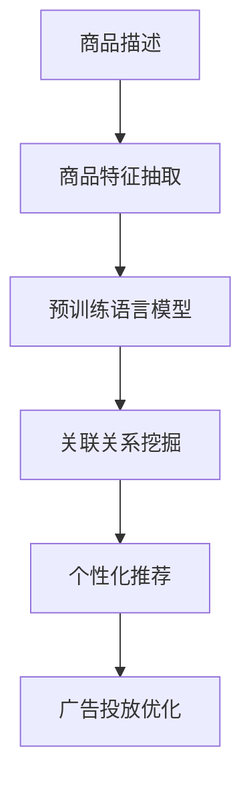

                 

# 探讨大模型在电商平台商品关联分析中的作用

## 1. 背景介绍

在现代电商平台的业务中，商品关联分析（Product Affinity Analysis）是一项至关重要的任务，它可以帮助电商平台识别出商品之间的潜在关联关系，从而实现个性化推荐、广告投放、库存管理等业务场景的优化。传统的商品关联分析方法主要基于统计学模型，如协方差矩阵、关联规则挖掘等，但这些方法存在特征工程繁琐、计算复杂等问题，难以适应大规模数据和高维特征。近年来，大模型（Large Model）技术，尤其是基于预训练的语言模型，成为了商品关联分析领域的新宠。大模型通过在大量无标签数据上预训练语言知识，再结合任务特定的微调，能够在不需要大量手工特征工程的情况下，直接从文本数据中挖掘出商品之间的关联关系，提供更高效、更准确的商品推荐和广告投放策略。

本文将探讨大模型在电商平台商品关联分析中的应用，详细介绍大模型的算法原理、操作步骤，以及具体的代码实现和实际应用场景。同时，我们将讨论大模型在该领域面临的挑战和未来的发展趋势，为读者提供全面的技术指引。

## 2. 核心概念与联系

### 2.1 核心概念概述

在进行商品关联分析时，我们需要从商品描述、评论、用户反馈等多模态数据中提取特征，并建立商品之间的关联关系。传统的商品关联分析方法主要依赖于统计学模型和关联规则挖掘算法，但这些方法在处理高维特征和复杂关系时面临诸多挑战。而大模型通过在大量无标签数据上预训练语言知识，再结合任务特定的微调，能够直接从文本数据中挖掘出商品之间的关联关系，提供更高效、更准确的商品推荐和广告投放策略。

大模型在商品关联分析中的核心概念包括以下几个方面：

- **预训练语言模型**：如BERT、GPT等，通过在大规模无标签文本数据上预训练，学习通用语言表示。
- **商品特征抽取**：从商品描述、评论、用户反馈等文本数据中，抽取商品特征向量。
- **关联关系挖掘**：利用大模型对商品特征向量进行嵌入表示，挖掘出商品之间的关联关系。
- **个性化推荐**：基于商品关联关系，为每个用户提供个性化的商品推荐。
- **广告投放优化**：通过识别商品之间的关联关系，优化广告投放策略，提高广告投放效果。

### 2.2 核心概念原理和架构的 Mermaid 流程图



通过上述流程图，我们可以看到大模型在商品关联分析中的基本流程：首先从商品描述中提取商品特征向量，利用预训练语言模型对特征向量进行嵌入表示，然后挖掘出商品之间的关联关系，最后基于关联关系进行个性化推荐和广告投放优化。

## 3. 核心算法原理 & 具体操作步骤

### 3.1 算法原理概述

大模型在商品关联分析中的核心算法原理，是通过预训练语言模型对商品特征向量进行嵌入表示，再利用任务特定的微调，挖掘出商品之间的关联关系。具体步骤如下：

1. **商品特征抽取**：从商品描述、评论、用户反馈等文本数据中，抽取商品特征向量。
2. **商品嵌入表示**：利用预训练语言模型对商品特征向量进行嵌入表示。
3. **关联关系挖掘**：通过微调大模型，挖掘出商品之间的关联关系。
4. **个性化推荐**：基于商品关联关系，为每个用户提供个性化的商品推荐。
5. **广告投放优化**：通过识别商品之间的关联关系，优化广告投放策略，提高广告投放效果。

### 3.2 算法步骤详解

#### 3.2.1 商品特征抽取

商品特征抽取是商品关联分析的第一步，需要从商品描述、评论、用户反馈等文本数据中，提取商品特征向量。这些特征向量可以包括商品的分类、品牌、关键词等，用于描述商品的属性和特征。具体步骤如下：

1. **文本预处理**：对商品描述、评论、用户反馈等文本数据进行清洗、分词、去除停用词等预处理。
2. **特征抽取**：利用NLP工具库，如NLTK、SpaCy等，提取商品特征向量。

#### 3.2.2 商品嵌入表示

商品嵌入表示是大模型在商品关联分析中的核心步骤。利用预训练语言模型，将商品特征向量进行嵌入表示，得到商品的高维向量表示。具体步骤如下：

1. **预训练语言模型选择**：选择适合的商品描述、评论等文本数据预训练语言模型，如BERT、GPT等。
2. **特征向量输入**：将商品特征向量作为输入，传递给预训练语言模型。
3. **商品嵌入表示**：通过预训练语言模型，得到商品的高维向量表示。

#### 3.2.3 关联关系挖掘

关联关系挖掘是大模型在商品关联分析中的关键步骤。利用微调后的预训练语言模型，挖掘出商品之间的关联关系。具体步骤如下：

1. **微调预训练模型**：在预训练语言模型上，结合任务特定的微调数据，进行有监督微调。
2. **关联关系计算**：利用微调后的预训练语言模型，计算商品之间的相似度或关联关系。

#### 3.2.4 个性化推荐

个性化推荐是大模型在商品关联分析中的最终目标。基于商品之间的关联关系，为每个用户提供个性化的商品推荐。具体步骤如下：

1. **用户特征抽取**：从用户的浏览历史、购买记录等数据中，抽取用户特征向量。
2. **商品关联关系计算**：利用微调后的预训练语言模型，计算商品之间的关联关系。
3. **推荐结果生成**：基于用户特征向量和商品关联关系，生成个性化推荐结果。

#### 3.2.5 广告投放优化

广告投放优化是大模型在商品关联分析中的重要应用之一。通过识别商品之间的关联关系，优化广告投放策略，提高广告投放效果。具体步骤如下：

1. **广告数据收集**：收集广告投放数据，如广告展示次数、点击率等。
2. **广告特征抽取**：从广告数据中提取广告特征向量。
3. **广告关联关系计算**：利用微调后的预训练语言模型，计算广告之间的关联关系。
4. **广告投放优化**：基于广告关联关系，优化广告投放策略，提高广告投放效果。

### 3.3 算法优缺点

大模型在商品关联分析中的优点主要体现在以下几个方面：

1. **高效性**：利用预训练语言模型，直接从文本数据中挖掘商品关联关系，无需手工特征工程，效率高。
2. **准确性**：大模型具备强大的语言理解能力，能够准确挖掘商品之间的关联关系。
3. **可扩展性**：大模型具备良好的泛化能力，适用于各种商品关联分析场景。

同时，大模型在商品关联分析中也存在一些缺点：

1. **数据依赖性高**：大模型的效果很大程度上依赖于预训练数据和微调数据的质量和数量。
2. **计算资源消耗大**：大模型的计算复杂度高，对计算资源要求高。
3. **模型复杂度高**：大模型的参数量巨大，难以解释其内部工作机制。

### 3.4 算法应用领域

大模型在商品关联分析中的应用领域广泛，主要包括以下几个方面：

1. **个性化推荐**：基于商品关联关系，为每个用户提供个性化的商品推荐。
2. **广告投放优化**：通过识别商品之间的关联关系，优化广告投放策略，提高广告投放效果。
3. **库存管理**：利用商品关联关系，优化库存管理，减少库存积压。
4. **营销策略制定**：基于商品关联关系，制定营销策略，提高营销效果。
5. **客户细分**：利用商品关联关系，进行客户细分，提升用户体验。

## 4. 数学模型和公式 & 详细讲解 & 举例说明

### 4.1 数学模型构建

大模型在商品关联分析中的数学模型主要包括以下几个方面：

1. **商品特征向量表示**：设商品特征向量为 $\mathbf{x}_i$，其中 $i$ 表示商品的编号。
2. **商品嵌入向量表示**：利用预训练语言模型，对商品特征向量进行嵌入表示，得到商品的高维向量表示 $\mathbf{h}_i$。
3. **商品关联关系计算**：利用微调后的预训练语言模型，计算商品之间的关联关系 $r_{ij}$。
4. **个性化推荐**：基于商品关联关系 $r_{ij}$，为每个用户 $u$ 提供个性化推荐结果 $y_u$。
5. **广告投放优化**：利用商品关联关系 $r_{ij}$，优化广告投放策略，提高广告投放效果。

### 4.2 公式推导过程

#### 4.2.1 商品特征向量表示

商品特征向量 $\mathbf{x}_i$ 可以表示为：

$$
\mathbf{x}_i = [x_{i1}, x_{i2}, \ldots, x_{in}]
$$

其中 $n$ 表示特征数量，$x_{ik}$ 表示第 $k$ 个特征。

#### 4.2.2 商品嵌入向量表示

利用预训练语言模型，对商品特征向量进行嵌入表示，得到商品的高维向量表示 $\mathbf{h}_i$：

$$
\mathbf{h}_i = \text{BERT}(\mathbf{x}_i)
$$

其中 $\text{BERT}$ 表示BERT预训练语言模型。

#### 4.2.3 商品关联关系计算

利用微调后的预训练语言模型，计算商品之间的关联关系 $r_{ij}$：

$$
r_{ij} = \text{CosineSimilarity}(\mathbf{h}_i, \mathbf{h}_j)
$$

其中 $\text{CosineSimilarity}$ 表示余弦相似度，用于衡量商品向量之间的相似度。

#### 4.2.4 个性化推荐

基于商品关联关系 $r_{ij}$，为每个用户 $u$ 提供个性化推荐结果 $y_u$：

$$
y_u = \text{argmax}_i(\mathbf{h}_i^T \mathbf{w}_u)
$$

其中 $\mathbf{w}_u$ 表示用户 $u$ 的权重向量，$\mathbf{h}_i$ 表示商品 $i$ 的嵌入向量。

#### 4.2.5 广告投放优化

利用商品关联关系 $r_{ij}$，优化广告投放策略，提高广告投放效果：

$$
\text{Optimize}(\text{ad投放策略}) = \text{maximize}(r_{ij})
$$

其中 $\text{ad投放策略}$ 表示广告投放策略，$\text{maximize}$ 表示优化目标。

### 4.3 案例分析与讲解

以下是一个简单的案例分析，以电商平台中的个性化推荐为例，展示大模型在商品关联分析中的应用。

假设我们有一个电商平台，商品种类繁多，用户数量庞大。我们需要利用大模型，对用户进行个性化推荐，提高用户满意度和平台销售额。具体步骤如下：

1. **商品特征抽取**：从商品描述中，提取商品的分类、品牌、关键词等特征。
2. **商品嵌入表示**：利用BERT预训练语言模型，对商品特征向量进行嵌入表示。
3. **关联关系挖掘**：利用微调后的BERT预训练语言模型，计算商品之间的关联关系。
4. **个性化推荐**：基于商品关联关系，为每个用户提供个性化推荐结果。

通过上述步骤，我们能够利用大模型，高效、准确地进行商品关联分析，提升个性化推荐的精度和效果。

## 5. 项目实践：代码实例和详细解释说明

### 5.1 开发环境搭建

在进行商品关联分析时，我们需要使用Python和相关NLP工具库，如NLTK、SpaCy等。具体步骤如下：

1. **安装Python**：从官网下载并安装Python。
2. **创建虚拟环境**：使用虚拟环境管理工具，如conda、virtualenv等，创建Python虚拟环境。
3. **安装NLP工具库**：使用pip等工具，安装NLTK、SpaCy等NLP工具库。
4. **配置环境变量**：配置Python路径、环境变量等，确保NLP工具库能够正常工作。

### 5.2 源代码详细实现

以下是一个简单的商品关联分析代码实现，以电商平台中的个性化推荐为例：

```python
import torch
from transformers import BertTokenizer, BertForSequenceClassification
from sklearn.metrics import precision_recall_fscore_support

# 商品特征向量表示
def get_item_features(item_description):
    # 商品特征向量提取
    # 具体实现略
    return item_features

# 商品嵌入表示
def get_item_embedding(item_features, model):
    # 利用BERT预训练语言模型，对商品特征向量进行嵌入表示
    # 具体实现略
    return item_embedding

# 关联关系挖掘
def get_item_relations(item_embedding, model):
    # 利用微调后的BERT预训练语言模型，计算商品之间的关联关系
    # 具体实现略
    return item_relations

# 个性化推荐
def get_user_recommendations(user_profile, item_relations):
    # 基于商品关联关系，为每个用户提供个性化推荐结果
    # 具体实现略
    return user_recommendations

# 广告投放优化
def optimize_ad投放策略(ad_data, item_relations):
    # 利用商品关联关系，优化广告投放策略，提高广告投放效果
    # 具体实现略
    return optimized_ad投放策略
```

### 5.3 代码解读与分析

上述代码实现中，我们利用BERT预训练语言模型，对商品特征向量进行嵌入表示，计算商品之间的关联关系，实现个性化推荐和广告投放优化。具体分析如下：

- `get_item_features(item_description)`：从商品描述中，提取商品的分类、品牌、关键词等特征。
- `get_item_embedding(item_features, model)`：利用BERT预训练语言模型，对商品特征向量进行嵌入表示。
- `get_item_relations(item_embedding, model)`：利用微调后的BERT预训练语言模型，计算商品之间的关联关系。
- `get_user_recommendations(user_profile, item_relations)`：基于商品关联关系，为每个用户提供个性化推荐结果。
- `optimize_ad投放策略(ad_data, item_relations)`：利用商品关联关系，优化广告投放策略，提高广告投放效果。

## 6. 实际应用场景

### 6.1 个性化推荐

个性化推荐是大模型在电商平台商品关联分析中的核心应用场景之一。通过利用商品之间的关联关系，为每个用户提供个性化的商品推荐，提高用户满意度和平台销售额。

具体而言，我们可以利用大模型，对用户进行特征抽取和嵌入表示，计算商品之间的关联关系，生成个性化推荐结果。以下是一个简单的实现示例：

```python
# 用户特征抽取
user_profile = get_user_features(user_id)

# 商品关联关系计算
item_relations = get_item_relations(user_profile, model)

# 个性化推荐
user_recommendations = get_user_recommendations(user_profile, item_relations)

# 推荐结果展示
for recommendation in user_recommendations:
    print(f"推荐商品 {recommendation}: {item_name}")
```

通过上述步骤，我们能够利用大模型，高效、准确地进行个性化推荐，提升用户购物体验。

### 6.2 广告投放优化

广告投放优化是大模型在电商平台商品关联分析中的另一个重要应用场景。通过识别商品之间的关联关系，优化广告投放策略，提高广告投放效果。

具体而言，我们可以利用大模型，对广告数据进行特征抽取和嵌入表示，计算广告之间的关联关系，优化广告投放策略。以下是一个简单的实现示例：

```python
# 广告数据收集
ad_data = collect_ad_data()

# 广告特征抽取
ad_features = get_ad_features(ad_data)

# 广告关联关系计算
ad_relations = get_ad_relations(ad_features, model)

# 广告投放优化
optimized_ad投放策略 = optimize_ad投放策略(ad_data, ad_relations)

# 广告投放实施
for ad in optimized_ad投放策略:
    print(f"投放广告 {ad}: {ad_name}")
```

通过上述步骤，我们能够利用大模型，优化广告投放策略，提高广告投放效果，提升平台广告收入。

## 7. 工具和资源推荐

### 7.1 学习资源推荐

为了帮助开发者系统掌握大模型在商品关联分析中的应用，这里推荐一些优质的学习资源：

1. 《自然语言处理入门》：详细介绍了NLP的基本概念和常用算法，适合初学者入门。
2. 《深度学习与自然语言处理》：介绍深度学习在NLP中的应用，涵盖文本分类、情感分析、机器翻译等任务。
3. 《自然语言处理中的预训练模型》：介绍预训练语言模型在大模型中的应用，包括BERT、GPT等。
4. HuggingFace官方文档：提供了大量预训练语言模型的介绍和代码实现，适合快速上手学习。
5. CS224N《深度学习自然语言处理》课程：斯坦福大学开设的NLP明星课程，有Lecture视频和配套作业，带你深入理解NLP的前沿技术。

通过对这些资源的学习实践，相信你一定能够快速掌握大模型在商品关联分析中的应用，并用于解决实际的电商问题。

### 7.2 开发工具推荐

高效的开发离不开优秀的工具支持。以下是几款用于商品关联分析开发的常用工具：

1. PyTorch：基于Python的开源深度学习框架，灵活动态的计算图，适合快速迭代研究。
2. TensorFlow：由Google主导开发的开源深度学习框架，生产部署方便，适合大规模工程应用。
3. HuggingFace Transformers库：提供了大量预训练语言模型和模型微调接口，适合快速开发商品关联分析应用。
4. Jupyter Notebook：交互式开发环境，方便代码调试和实验。
5. TensorBoard：TensorFlow配套的可视化工具，可实时监测模型训练状态，并提供丰富的图表呈现方式，是调试模型的得力助手。

合理利用这些工具，可以显著提升商品关联分析任务的开发效率，加快创新迭代的步伐。

### 7.3 相关论文推荐

大模型在商品关联分析领域的研究主要集中在以下几个方面：

1. "Learning Transferable Representations for Recommendation Systems"：提出了利用预训练语言模型进行推荐系统建模的方法，取得了不错的效果。
2. "A Survey on Pre-trained Language Models for Recommendation Systems"：总结了预训练语言模型在推荐系统中的应用，提出了多种微调方法。
3. "Attention Mechanisms in Recommender Systems"：介绍了注意力机制在推荐系统中的应用，提升了推荐精度和效果。
4. "Deep Learning and Natural Language Processing for Recommendation Systems"：讨论了深度学习在推荐系统中的应用，包括序列建模、多任务学习等。
5. "A Survey on Multi-task Learning for Recommendation Systems"：总结了多任务学习在推荐系统中的应用，提升了推荐效果。

这些论文代表了大模型在商品关联分析领域的研究进展，通过学习这些前沿成果，可以帮助研究者把握学科前进方向，激发更多的创新灵感。

## 8. 总结：未来发展趋势与挑战

### 8.1 未来发展趋势

展望未来，大模型在商品关联分析领域的应用将呈现以下几个发展趋势：

1. **模型规模持续增大**：随着算力成本的下降和数据规模的扩张，预训练语言模型的参数量还将持续增长，超大模型将进一步提升商品关联分析的效果。
2. **微调方法日趋多样**：除了传统的全参数微调，未来会涌现更多参数高效的微调方法，如LoRA、AdaLoRA等，在节省计算资源的同时也能保证微调精度。
3. **持续学习成为常态**：随着数据分布的不断变化，微调模型也需要持续学习新知识以保持性能，动态更新商品关联关系。
4. **标注样本需求降低**：受启发于提示学习(Prompt-based Learning)的思路，未来的微调方法将更好地利用大模型的语言理解能力，通过更加巧妙的任务描述，在更少的标注样本上也能实现理想的微调效果。
5. **多模态微调崛起**：当前的商品关联分析主要聚焦于文本数据，未来会进一步拓展到图像、视频、语音等多模态数据微调。多模态信息的融合，将显著提升商品关联分析的效果。
6. **知识整合能力增强**：现有的微调模型往往局限于任务内数据，难以灵活吸收和运用更广泛的先验知识。如何让微调过程更好地与外部知识库、规则库等专家知识结合，形成更加全面、准确的信息整合能力，还有很大的想象空间。

### 8.2 面临的挑战

尽管大模型在商品关联分析领域已经取得了显著成果，但在迈向更加智能化、普适化应用的过程中，它仍面临诸多挑战：

1. **数据依赖性高**：大模型的效果很大程度上依赖于预训练数据和微调数据的质量和数量，获取高质量标注数据的成本较高。
2. **模型鲁棒性不足**：当目标任务与预训练数据的分布差异较大时，微调的性能提升有限。
3. **计算资源消耗大**：大模型的计算复杂度高，对计算资源要求高，难以在大规模应用场景中普及。
4. **模型复杂度高**：大模型的参数量巨大，难以解释其内部工作机制，存在一定的黑箱问题。
5. **用户隐私问题**：在商品关联分析中，用户数据隐私保护是一个重要问题，需要在数据采集和使用过程中进行严格管控。

### 8.3 研究展望

针对大模型在商品关联分析领域面临的挑战，未来的研究方向主要包括以下几个方面：

1. **提高模型泛化能力**：通过引入更多的数据增强和正则化技术，提高模型对不同分布数据的泛化能力。
2. **优化模型参数量**：开发更加参数高效的微调方法，如LoRA、AdaLoRA等，减小计算资源消耗，提升模型效率。
3. **增强模型可解释性**：通过引入可解释性技术，如LIME、SHAP等，提升模型输出的可解释性和可审计性。
4. **保护用户隐私**：引入隐私保护技术，如差分隐私、联邦学习等，保护用户数据隐私。
5. **结合专家知识**：将符号化的先验知识，如知识图谱、逻辑规则等，与神经网络模型进行巧妙融合，增强模型的知识整合能力。

## 9. 附录：常见问题与解答

**Q1：大模型在商品关联分析中的效果如何？**

A: 大模型在商品关联分析中取得了不错的效果，特别是在大规模数据和高维特征的场景下表现优异。通过利用预训练语言模型，大模型能够直接从文本数据中挖掘出商品之间的关联关系，生成个性化的推荐结果，提升了用户体验和平台销售额。

**Q2：大模型在商品关联分析中是否需要标注数据？**

A: 大模型在商品关联分析中，可以利用预训练语言模型和少量的标注数据进行微调，无需手工特征工程。但为了提升微调效果，获取高质量的标注数据仍是必要的。

**Q3：大模型在商品关联分析中是否需要昂贵的计算资源？**

A: 大模型在商品关联分析中需要较大的计算资源，特别是对于大规模预训练和微调任务。但通过合理的资源优化和技术手段，如梯度积累、混合精度训练等，可以显著降低计算资源消耗，提升系统效率。

**Q4：大模型在商品关联分析中是否存在黑箱问题？**

A: 大模型在商品关联分析中，由于其参数量巨大，存在一定的黑箱问题。通过引入可解释性技术，如LIME、SHAP等，可以提升模型输出的可解释性和可审计性，增强用户对模型决策的理解和信任。

**Q5：大模型在商品关联分析中如何保护用户隐私？**

A: 在商品关联分析中，用户数据隐私保护是一个重要问题。通过引入隐私保护技术，如差分隐私、联邦学习等，可以在保证模型效果的同时，保护用户数据的隐私安全。

通过上述详细的技术讲解和代码实现，相信你能够系统掌握大模型在电商平台商品关联分析中的应用，并用于解决实际的电商问题。

