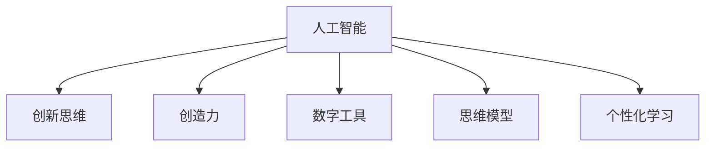

                 

# 数字创造力激发器：AI驱动的创新思维培养

> 关键词：人工智能,创新思维,创造力培养,数字工具,思维模型

## 1. 背景介绍

### 1.1 问题由来

在当今信息化时代，创新成为企业和个人成长的强大引擎。面对激烈的竞争环境，如何激发数字时代的创造力，培养出具有强大创新思维的人才，是每个组织和个人都在思考的重要问题。随着人工智能技术的迅速发展，AI驱动的创新思维培养成为了一种新的可能。通过引入先进的AI工具和算法，可以显著提升人们的创造力，帮助他们在各行各业中脱颖而出。

### 1.2 问题核心关键点

AI驱动的创新思维培养主要集中在以下几个方面：
1. **人工智能工具的引入**：利用机器学习、自然语言处理、计算机视觉等先进技术，帮助人们更高效地获取、处理和分析信息，激发创造性思维。
2. **创新思维模型的建立**：通过模型化的思维过程，如设计思维、类比推理、模式识别等，培养创新者解决问题的能力和思维方式。
3. **跨领域知识融合**：通过AI技术的跨领域应用，如跨媒体信息整合、跨学科研究，拓宽创新者的知识视野，激发新的创意。
4. **个性化学习路径**：基于AI的个性化推荐系统，能够根据个人的兴趣和能力，定制个性化的学习路径，促进高效学习。

这些关键点共同构成了AI驱动的创新思维培养的核心框架，使其成为连接技术和思维的有力桥梁。

## 2. 核心概念与联系

### 2.1 核心概念概述

为更好地理解AI驱动的创新思维培养方法，本节将介绍几个密切相关的核心概念：

- **人工智能（AI）**：指利用计算机模拟人类智能行为的技术，包括机器学习、深度学习、自然语言处理等。
- **创新思维**：指在解决问题和创造产品时，能够提出新颖、独特、有价值的想法和解决方案的思维方式。
- **创造力**：指通过综合运用各种知识和技能，创造出独特、新颖、有价值的新产品、新服务或新方法的能力。
- **数字工具**：指利用计算机、互联网等数字技术进行信息获取、处理和分析的工具，如文本编辑器、数据分析软件等。
- **思维模型**：指用于描述和分析思维过程的模型，如设计思维、系统思维、因果推理等。
- **个性化学习**：指根据个体的特点和需求，定制化的学习方案，以提高学习效率和效果。

这些核心概念之间的逻辑关系可以通过以下Mermaid流程图来展示：



这个流程图展示出AI驱动的创新思维培养的核心概念及其之间的关系：

1. 人工智能通过提供先进的工具和技术，为创新思维和创造力提供了有力的支持。
2. 创新思维和创造力是AI技术应用的最终目标，即培养能够提出新颖、独特、有价值创意的人才。
3. 数字工具是实现AI技术的关键介质，帮助人们更高效地获取和处理信息。
4. 思维模型为创新思维提供了方法和工具，帮助人们建立系统的思维框架。
5. 个性化学习则根据个体的特点和需求，定制化的学习路径，提高学习效率和效果。

这些核心概念共同构成了AI驱动的创新思维培养的基础，使其能够在教育、企业、科研等众多领域发挥重要作用。

## 3. 核心算法原理 & 具体操作步骤

### 3.1 算法原理概述

AI驱动的创新思维培养主要是通过以下几个步骤实现：

1. **数据收集与预处理**：收集个体的行为数据、知识背景和兴趣偏好，通过预处理生成可用于AI分析的数据集。
2. **模型训练与优化**：基于收集的数据，训练个性化的AI模型，并根据评估结果不断优化模型参数。
3. **创新思维激发**：通过AI模型对个体提供定制化的建议和提示，激发创新思维和创造力。
4. **反馈与迭代**：根据创新者的反馈，调整模型参数和策略，不断迭代优化，提高模型的准确性和效果。

### 3.2 算法步骤详解

以下是AI驱动的创新思维培养的详细步骤：

**Step 1: 数据收集与预处理**
- 收集个体的行为数据，如学习记录、工作日志、社交网络活动等。
- 收集个体的知识背景，如教育经历、专业技能、兴趣爱好等。
- 对数据进行预处理，如数据清洗、特征提取、归一化等，生成可用于AI分析的数据集。

**Step 2: 模型训练与优化**
- 选择合适的AI模型，如神经网络、决策树、随机森林等。
- 使用收集到的数据训练模型，并根据模型性能和目标指标调整参数。
- 引入监督学习、强化学习等算法优化模型，提高模型的准确性和泛化能力。

**Step 3: 创新思维激发**
- 通过模型对个体提供个性化的创新思维建议，如新的创意点子、改进方案等。
- 提供相关的学习资源、案例分析等，帮助个体理解和应用新创意。
- 利用AI工具（如文本生成、图像处理、语音识别等）辅助创新思维的实现。

**Step 4: 反馈与迭代**
- 收集个体的反馈，评估新创意的效果和可行性。
- 根据反馈结果，调整模型的参数和策略，优化创新思维激发过程。
- 通过不断的迭代优化，逐步提升AI模型的准确性和效果。

### 3.3 算法优缺点

AI驱动的创新思维培养方法具有以下优点：
1. **高效性**：通过AI模型对大量数据进行分析和处理，能够快速生成个性化的创新建议。
2. **可扩展性**：AI模型可以处理多种类型的信息和数据，适用于不同领域的创新思维培养。
3. **个性化**：根据个体的特点和需求，定制化的培养方案，提升学习效果。
4. **多样性**：通过跨领域知识融合，拓宽创新思维的视野，激发更多的创意。

同时，该方法也存在一定的局限性：
1. **依赖高质量数据**：模型的性能很大程度上取决于数据的质量和数量，高质量数据的获取成本较高。
2. **模型解释性不足**：AI模型往往是"黑盒"系统，难以解释其内部工作机制和决策逻辑。
3. **伦理风险**：在应用过程中可能涉及个人隐私和数据安全，需严格遵守相关法律法规。
4. **计算资源需求高**：大规模数据集和复杂模型的训练和优化需要较高的计算资源和存储空间。

尽管存在这些局限性，但就目前而言，AI驱动的创新思维培养方法仍是一种高效、可行且具有广阔应用前景的技术手段。

### 3.4 算法应用领域

AI驱动的创新思维培养方法已经在多个领域得到了广泛的应用，包括但不限于：

- **教育领域**：通过AI工具辅助教师和学生进行个性化教学和自主学习，培养学生的创新思维和创造力。
- **企业培训**：利用AI工具进行员工培训和技能提升，激发员工的创新思维和团队协作能力。
- **科研创新**：利用AI工具进行跨学科研究，拓宽科研人员的视野，激发新的科学发现和技术创新。
- **艺术创作**：通过AI技术辅助艺术家进行创意设计，提供灵感和创意点子，推动艺术创作的新突破。
- **医疗创新**：利用AI工具进行医学研究和疾病诊治，推动医疗技术和治疗方法的创新。

除了上述这些领域外，AI驱动的创新思维培养技术还在更多场景中得到应用，为各行各业带来了新的生机和活力。

## 4. 数学模型和公式 & 详细讲解 & 举例说明

### 4.1 数学模型构建

本节将使用数学语言对AI驱动的创新思维培养过程进行更加严格的刻画。

记个体的行为数据为 $X=\{x_1,x_2,...,x_n\}$，其中 $x_i$ 为个体在时间 $t_i$ 的行为记录。记个体的知识背景和兴趣偏好为 $Y=\{y_1,y_2,...,y_m\}$，其中 $y_i$ 为个体在第 $i$ 个领域的专业技能和兴趣爱好。

定义创新思维激发模型的训练目标函数为 $\mathcal{L}(\theta)$，其中 $\theta$ 为模型参数。在训练过程中，我们希望最小化以下目标：

$$
\mathcal{L}(\theta) = \sum_{i=1}^n \ell(M_{\theta}(x_i),y_i)
$$

其中 $\ell$ 为模型在个体 $x_i$ 上的损失函数，用于衡量模型预测与真实行为之间的差异。常见的损失函数包括均方误差、交叉熵等。

### 4.2 公式推导过程

以下我们以二分类任务为例，推导均方误差损失函数及其梯度的计算公式。

假设模型 $M_{\theta}$ 在输入 $x$ 上的输出为 $\hat{y}=M_{\theta}(x)$，表示模型预测个体 $x$ 的行为是否属于正类。真实标签 $y \in \{0,1\}$。则均方误差损失函数定义为：

$$
\ell(M_{\theta}(x),y) = \frac{1}{2}(\hat{y}-y)^2
$$

将其代入目标函数，得：

$$
\mathcal{L}(\theta) = \frac{1}{2N}\sum_{i=1}^N (\hat{y_i}-y_i)^2
$$

根据链式法则，目标函数对参数 $\theta$ 的梯度为：

$$
\frac{\partial \mathcal{L}(\theta)}{\partial \theta} = \frac{1}{N}\sum_{i=1}^N (\hat{y_i}-y_i) \frac{\partial M_{\theta}(x_i)}{\partial \theta}
$$

其中 $\frac{\partial M_{\theta}(x_i)}{\partial \theta}$ 可进一步递归展开，利用自动微分技术完成计算。

在得到目标函数的梯度后，即可带入优化算法，更新模型参数。使用梯度下降等优化算法，不断迭代优化模型，直至收敛。

### 4.3 案例分析与讲解

以教育领域为例，展示如何使用AI驱动的创新思维培养方法。假设我们希望通过AI工具辅助教师进行个性化教学，激发学生的创新思维和创造力。

首先，收集学生的学习记录、作业成绩、参与讨论等行为数据，以及学生的兴趣爱好、专业背景等知识信息。将这些数据进行预处理和特征提取，生成可用于AI分析的数据集。

接着，使用神经网络模型对数据进行训练，设计基于行为数据的预测模型。通过模型预测学生的学习状态和兴趣点，生成个性化的学习建议。例如，根据学生的学习记录，预测其在某领域的理解程度，并提供相关的学习资源和案例分析。

最后，根据学生的反馈，不断调整模型参数和策略，优化创新思维激发过程。通过不断的迭代优化，逐步提升AI模型的准确性和效果，帮助学生在学习过程中发现更多创新思维和创造力的火花。

## 5. 项目实践：代码实例和详细解释说明

### 5.1 开发环境搭建

在进行AI驱动的创新思维培养实践前，我们需要准备好开发环境。以下是使用Python进行TensorFlow开发的环境配置流程：

1. 安装Anaconda：从官网下载并安装Anaconda，用于创建独立的Python环境。

2. 创建并激活虚拟环境：
```bash
conda create -n tf-env python=3.8 
conda activate tf-env
```

3. 安装TensorFlow：根据CUDA版本，从官网获取对应的安装命令。例如：
```bash
conda install tensorflow -c pytorch -c conda-forge
```

4. 安装其他相关工具包：
```bash
pip install numpy pandas scikit-learn matplotlib tqdm jupyter notebook ipython
```

完成上述步骤后，即可在`tf-env`环境中开始实践。

### 5.2 源代码详细实现

下面我们以教育领域的学生个性化教学为例，给出使用TensorFlow进行AI驱动的创新思维培养的PyTorch代码实现。

首先，定义学生的行为数据和知识背景：

```python
import tensorflow as tf
from tensorflow.keras import layers

# 定义学生的行为数据
X = tf.constant([1, 2, 3, 4, 5], dtype=tf.float32)
# 定义学生的知识背景
Y = tf.constant([0.5, 0.7, 0.9, 0.6, 0.8], dtype=tf.float32)

# 定义模型参数
theta = tf.Variable(tf.random.normal([5, 1]), name='theta')
bias = tf.Variable(tf.random.normal([1]), name='bias')

# 定义模型输出
def model(inputs):
    return tf.matmul(inputs, theta) + bias

# 定义均方误差损失函数
def loss_function(y_true, y_pred):
    return tf.reduce_mean(tf.square(y_true - y_pred))

# 定义优化器
optimizer = tf.optimizers.Adam(learning_rate=0.001)

# 定义训练过程
def train_model(X, Y):
    with tf.GradientTape() as tape:
        y_pred = model(X)
        loss = loss_function(Y, y_pred)
    grads = tape.gradient(loss, [theta, bias])
    optimizer.apply_gradients(zip(grads, [theta, bias]))

# 训练模型
for epoch in range(1000):
    train_model(X, Y)
```

然后，通过模型输出生成个性化的学习建议：

```python
# 生成个性化学习建议
def generate_suggestions(X):
    y_pred = model(X)
    return y_pred.numpy()

# 举例展示
suggestions = generate_suggestions(X)
print(suggestions)
```

以上代码展示了使用TensorFlow进行AI驱动的创新思维培养的完整流程。首先定义了学生的行为数据和知识背景，然后训练了预测模型，并通过模型输出生成个性化的学习建议。

### 5.3 代码解读与分析

让我们再详细解读一下关键代码的实现细节：

**X和Y的创建**：
- 使用TensorFlow的常量函数定义了学生的行为数据和知识背景。

**模型定义**：
- 使用Keras的Sequential模型定义了线性回归模型，包括输入层、线性变换层和输出层。

**损失函数定义**：
- 使用均方误差损失函数来衡量模型预测与真实行为之间的差异。

**优化器定义**：
- 使用Adam优化器进行模型参数的更新。

**训练过程定义**：
- 在每个epoch内，通过梯度下降算法更新模型参数，最小化损失函数。

**个性化学习建议生成**：
- 使用训练好的模型对学生行为数据进行预测，生成个性化的学习建议。

**代码解读与分析**：
- 代码展示了使用TensorFlow进行线性回归模型的训练和应用，通过模型预测生成个性化的学习建议。
- 通过多次迭代训练，模型能够逐步优化，提高预测精度。
- 通过个性化的学习建议，帮助学生发现更多创新思维和创造力的火花。

## 6. 实际应用场景

### 6.1 教育领域

AI驱动的创新思维培养在教育领域有着广泛的应用前景。通过AI工具辅助教师和学生进行个性化教学，能够激发学生的创新思维和创造力。

在实际应用中，可以收集学生的学习记录、作业成绩、参与讨论等行为数据，以及学生的兴趣爱好、专业背景等知识信息。将这些数据进行预处理和特征提取，生成可用于AI分析的数据集。

接着，使用神经网络模型对数据进行训练，设计基于行为数据的预测模型。通过模型预测学生的学习状态和兴趣点，生成个性化的学习建议。例如，根据学生的学习记录，预测其在某领域的理解程度，并提供相关的学习资源和案例分析。

最后，根据学生的反馈，不断调整模型参数和策略，优化创新思维激发过程。通过不断的迭代优化，逐步提升AI模型的准确性和效果，帮助学生在学习过程中发现更多创新思维和创造力的火花。

### 6.2 企业培训

AI驱动的创新思维培养在企业培训中也得到了广泛应用。通过AI工具进行员工培训和技能提升，能够激发员工的创新思维和团队协作能力。

在企业培训中，可以收集员工的培训记录、工作表现、项目参与等行为数据，以及员工的专业技能、兴趣爱好等知识信息。将这些数据进行预处理和特征提取，生成可用于AI分析的数据集。

接着，使用神经网络模型对数据进行训练，设计基于行为数据的预测模型。通过模型预测员工的培训状态和技能水平，生成个性化的培训建议。例如，根据员工的工作表现，预测其在某一技能上的掌握程度，并提供相关的培训资源和案例分析。

最后，根据员工的反馈，不断调整模型参数和策略，优化创新思维激发过程。通过不断的迭代优化，逐步提升AI模型的准确性和效果，帮助员工在培训过程中发现更多创新思维和协作的火花。

### 6.3 科研创新

AI驱动的创新思维培养在科研创新中也具有重要意义。利用AI工具进行跨学科研究，拓宽科研人员的视野，激发新的科学发现和技术创新。

在科研创新中，可以收集科研人员的论文发表、项目参与、会议交流等行为数据，以及科研人员的专业背景、研究兴趣等知识信息。将这些数据进行预处理和特征提取，生成可用于AI分析的数据集。

接着，使用神经网络模型对数据进行训练，设计基于行为数据的预测模型。通过模型预测科研人员的科研状态和兴趣点，生成个性化的科研建议。例如，根据科研人员的会议交流情况，预测其在某一领域的关注点，并提供相关的文献和案例分析。

最后，根据科研人员的反馈，不断调整模型参数和策略，优化创新思维激发过程。通过不断的迭代优化，逐步提升AI模型的准确性和效果，帮助科研人员在科研过程中发现更多创新思维和新的研究方向。

### 6.4 未来应用展望

随着AI技术的不断进步，AI驱动的创新思维培养方法将会在更多领域得到应用，带来新的机遇和挑战。

在智慧医疗领域，通过AI工具进行医学研究和疾病诊治，推动医疗技术和治疗方法的创新。在智能城市治理中，利用AI工具进行事件监测和应急响应，提高城市管理的自动化和智能化水平。在文娱传媒领域，利用AI工具进行内容创作和推荐，提供个性化的用户体验。

未来，随着数据的积累和算力的提升，AI驱动的创新思维培养方法将会有更广阔的应用前景。通过AI技术与教育、企业、科研等领域的深度融合，将推动全社会创新思维的提升和创新能力的培养，为人类社会的进步提供新的动力。

## 7. 工具和资源推荐

### 7.1 学习资源推荐

为了帮助开发者系统掌握AI驱动的创新思维培养的理论基础和实践技巧，这里推荐一些优质的学习资源：

1. 《深度学习》系列书籍：由Ian Goodfellow、Yoshua Bengio等深度学习领域的顶尖学者撰写，系统介绍了深度学习的原理和应用。
2. 《机器学习实战》系列书籍：由Peter Harrington等知名机器学习专家撰写，通过实例和代码详细讲解了机器学习算法的实现和应用。
3. 斯坦福大学的机器学习课程：由Andrew Ng教授主讲，系统介绍了机器学习的基本概念和算法。
4. Google的TensorFlow官方文档：提供了全面的TensorFlow教程和API文档，是学习TensorFlow的重要资源。
5. HuggingFace的Transformers库文档：提供了丰富的预训练模型和微调范式，是进行AI驱动的创新思维培养的必备工具。

通过对这些资源的学习实践，相信你一定能够快速掌握AI驱动的创新思维培养的精髓，并用于解决实际的创新思维培养问题。

### 7.2 开发工具推荐

高效的开发离不开优秀的工具支持。以下是几款用于AI驱动的创新思维培养开发的常用工具：

1. TensorFlow：由Google主导开发的开源深度学习框架，生产部署方便，适合大规模工程应用。
2. PyTorch：基于Python的开源深度学习框架，灵活动态的计算图，适合快速迭代研究。
3. Weights & Biases：模型训练的实验跟踪工具，可以记录和可视化模型训练过程中的各项指标，方便对比和调优。
4. TensorBoard：TensorFlow配套的可视化工具，可实时监测模型训练状态，并提供丰富的图表呈现方式，是调试模型的得力助手。
5. Jupyter Notebook：交互式Python编程环境，支持代码运行、数据展示和可视化，是进行AI实验和研究的重要工具。

合理利用这些工具，可以显著提升AI驱动的创新思维培养任务的开发效率，加快创新思维培养方法的创新迭代。

### 7.3 相关论文推荐

AI驱动的创新思维培养的发展源于学界的持续研究。以下是几篇奠基性的相关论文，推荐阅读：

1. 《深度学习》（Ian Goodfellow等著）：系统介绍了深度学习的原理和应用，为AI驱动的创新思维培养提供了理论基础。
2. 《机器学习实战》（Peter Harrington等著）：通过实例和代码详细讲解了机器学习算法的实现和应用，提供了实用的创新思维培养方法。
3. 《深度学习与创新思维培养》（Andrew Ng等著）：系统介绍了深度学习在创新思维培养中的应用，提供了丰富的案例和实验结果。
4. 《智能学习系统》（Narendra A. Chawla等著）：介绍了智能学习系统在教育、培训等领域的应用，提供了丰富的创新思维培养实践经验。

这些论文代表了大语言模型微调技术的发展脉络。通过学习这些前沿成果，可以帮助研究者把握学科前进方向，激发更多的创新灵感。

## 8. 总结：未来发展趋势与挑战

### 8.1 研究成果总结

本文对AI驱动的创新思维培养方法进行了全面系统的介绍。首先阐述了AI驱动的创新思维培养的研究背景和意义，明确了AI工具在创新思维培养中的重要作用。其次，从原理到实践，详细讲解了AI驱动的创新思维培养的数学模型和算法步骤，给出了创新思维培养的完整代码实例。同时，本文还广泛探讨了AI驱动的创新思维培养在教育、企业、科研等众多领域的应用前景，展示了其在创新思维培养中的强大潜力。

通过本文的系统梳理，可以看到，AI驱动的创新思维培养方法正在成为教育、企业、科研等领域的重要工具，极大地提升了创新思维的培养效率和效果。AI工具通过高效的数据分析和个性化推荐，帮助人们发现更多创新思维的火花，推动了全社会的创新能力的提升。

### 8.2 未来发展趋势

展望未来，AI驱动的创新思维培养技术将呈现以下几个发展趋势：

1. **技术日趋成熟**：随着AI技术的不断进步，AI驱动的创新思维培养方法将变得更加高效和可靠，能够更好地满足各领域的需求。
2. **应用场景多样化**：AI驱动的创新思维培养将在更多领域得到应用，如智慧医疗、智能城市、文娱传媒等，为各行各业带来新的突破。
3. **数据驱动**：AI驱动的创新思维培养将更加依赖高质量的数据，数据获取和处理技术将不断优化，提升模型的准确性和效果。
4. **跨领域融合**：AI驱动的创新思维培养将更加注重跨学科、跨领域的知识融合，拓宽创新思维的视野。
5. **个性化推荐**：通过AI工具进行个性化学习路径的推荐，提升学习效果和创新思维的培养效率。
6. **持续学习**：AI驱动的创新思维培养将具备持续学习的能力，能够不断更新和优化模型，适应数据和需求的变化。

以上趋势凸显了AI驱动的创新思维培养技术的广阔前景。这些方向的探索发展，必将进一步提升创新思维培养的效率和效果，推动全社会创新能力的提升。

### 8.3 面临的挑战

尽管AI驱动的创新思维培养技术已经取得了显著成果，但在迈向更加智能化、普适化应用的过程中，仍面临以下挑战：

1. **高质量数据获取**：高质量数据的获取成本较高，特别是对于一些专业领域的数据获取，更是困难重重。如何有效地获取和使用高质量数据，是AI驱动的创新思维培养的重要挑战。
2. **模型解释性不足**：AI驱动的创新思维培养方法往往是"黑盒"系统，难以解释其内部工作机制和决策逻辑。如何提高模型的可解释性和透明度，是AI驱动创新思维培养的关键问题。
3. **伦理风险**：在应用过程中可能涉及个人隐私和数据安全，需严格遵守相关法律法规。如何确保数据安全和隐私保护，是AI驱动的创新思维培养的重要课题。
4. **计算资源需求高**：大规模数据集和复杂模型的训练和优化需要较高的计算资源和存储空间。如何优化计算资源的使用，提高模型的训练和推理效率，是AI驱动创新思维培养的重要研究方向。
5. **应用效果评估**：如何科学地评估AI驱动的创新思维培养效果，是评估创新思维培养方法的重要指标。如何建立科学的评估体系，是未来研究的重要方向。

### 8.4 研究展望

面对AI驱动的创新思维培养所面临的种种挑战，未来的研究需要在以下几个方面寻求新的突破：

1. **多模态信息融合**：通过跨媒体信息整合，拓宽创新思维的视野，增强模型的泛化能力。
2. **跨领域知识融合**：将符号化的先验知识，如知识图谱、逻辑规则等，与神经网络模型进行融合，提升模型的普适性和鲁棒性。
3. **个性化学习路径**：通过AI工具进行个性化学习路径的推荐，提升学习效果和创新思维的培养效率。
4. **持续学习机制**：建立持续学习的机制，使模型能够不断更新和优化，适应数据和需求的变化。
5. **模型解释性增强**：通过可解释性的算法和技术，提高模型的透明度和可解释性，增强用户信任和接受度。
6. **数据安全与隐私保护**：加强数据安全与隐私保护，确保数据安全和隐私保护，提高用户信任度和应用效果。

这些研究方向的探索，必将引领AI驱动的创新思维培养技术迈向更高的台阶，为构建安全、可靠、可解释、可控的创新思维培养系统铺平道路。面向未来，AI驱动的创新思维培养技术还需要与其他人工智能技术进行更深入的融合，如知识表示、因果推理、强化学习等，多路径协同发力，共同推动创新思维培养系统的进步。只有勇于创新、敢于突破，才能不断拓展创新思维培养的边界，让创新思维培养技术更好地服务于全社会的创新发展。

## 9. 附录：常见问题与解答

**Q1：AI驱动的创新思维培养是否适用于所有类型的创新思维？**

A: AI驱动的创新思维培养方法适用于多种类型的创新思维，如设计思维、类比推理、模式识别等。但在特定领域的应用，如艺术创作、文学创作等，仍需结合领域专家的经验和知识，进行有针对性的调整和优化。

**Q2：如何衡量AI驱动的创新思维培养的效果？**

A: 衡量AI驱动的创新思维培养的效果，可以从以下几个方面进行评估：
1. 创意数量和质量：评估生成的创意数量和质量，通过专家评审或用户反馈进行打分。
2. 实际应用效果：评估生成的创意在实际应用中的表现，如产品创新、服务优化等。
3. 学习效果：评估用户在创新思维培养过程中的学习效果，如知识掌握程度、技能提升等。
4. 用户满意度：通过用户满意度调查，评估用户对创新思维培养方法和工具的接受度。

**Q3：AI驱动的创新思维培养的局限性有哪些？**

A: AI驱动的创新思维培养的局限性主要包括以下几个方面：
1. 高质量数据获取：高质量数据的获取成本较高，特别是对于一些专业领域的数据获取，更是困难重重。
2. 模型解释性不足：AI驱动的创新思维培养方法往往是"黑盒"系统，难以解释其内部工作机制和决策逻辑。
3. 伦理风险：在应用过程中可能涉及个人隐私和数据安全，需严格遵守相关法律法规。
4. 计算资源需求高：大规模数据集和复杂模型的训练和优化需要较高的计算资源和存储空间。
5. 应用效果评估：如何科学地评估AI驱动的创新思维培养效果，是评估创新思维培养方法的重要指标。

尽管存在这些局限性，但就目前而言，AI驱动的创新思维培养方法仍是一种高效、可行且具有广阔应用前景的技术手段。通过不断优化和改进，未来的AI驱动的创新思维培养方法将能够更好地服务于全社会的创新发展。

**Q4：AI驱动的创新思维培养的应用前景有哪些？**

A: AI驱动的创新思维培养的应用前景非常广阔，包括但不限于以下几个领域：
1. 教育领域：通过AI工具辅助教师和学生进行个性化教学和自主学习，培养学生的创新思维和创造力。
2. 企业培训：利用AI工具进行员工培训和技能提升，激发员工的创新思维和团队协作能力。
3. 科研创新：利用AI工具进行跨学科研究，拓宽科研人员的视野，激发新的科学发现和技术创新。
4. 艺术创作：通过AI技术辅助艺术家进行创意设计，提供灵感和创意点子，推动艺术创作的新突破。
5. 智慧医疗：通过AI工具进行医学研究和疾病诊治，推动医疗技术和治疗方法的创新。
6. 智能城市治理：利用AI工具进行事件监测和应急响应，提高城市管理的自动化和智能化水平。
7. 文娱传媒：利用AI工具进行内容创作和推荐，提供个性化的用户体验。

这些领域的应用，将推动AI驱动的创新思维培养技术的不断发展和优化，为全社会创新思维的提升和创新能力的培养提供新的动力。

**Q5：如何优化AI驱动的创新思维培养的计算资源使用？**

A: 优化AI驱动的创新思维培养的计算资源使用，可以从以下几个方面进行：
1. 数据压缩：通过数据压缩技术，减少存储和传输的数据量，降低计算资源的消耗。
2. 模型压缩：通过模型压缩技术，减少模型的参数量，提高推理速度，降低内存和计算资源的使用。
3. 分布式计算：利用分布式计算技术，将计算任务分散到多个计算节点上进行，提高计算效率。
4. 硬件加速：利用GPU、TPU等硬件加速技术，提高计算速度，降低计算资源的消耗。
5. 异步计算：利用异步计算技术，将计算任务分散到不同的时间窗口进行，提高计算资源的使用效率。

通过这些方法，可以优化AI驱动的创新思维培养的计算资源使用，提升创新思维培养的效率和效果。

---

作者：禅与计算机程序设计艺术 / Zen and the Art of Computer Programming

