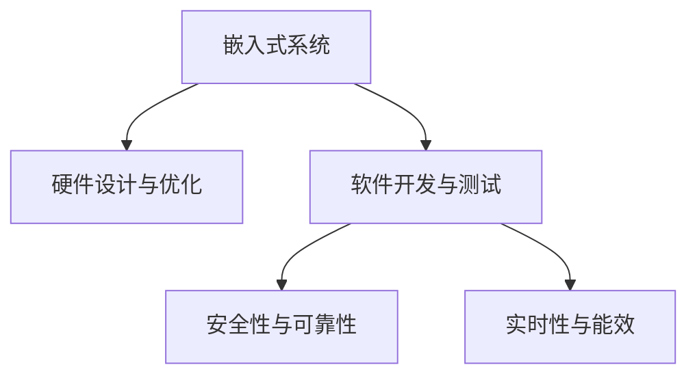

                 

# 智能设备开发：嵌入式系统设计与优化

> 关键词：智能设备, 嵌入式系统, 硬件设计与优化, 软件开发与测试, 安全性与可靠性, 实时性与能效

## 1. 背景介绍

### 1.1 问题由来
随着物联网(IoT)技术的迅速发展，智能设备如智能手表、智能家居、智能车辆等在人们日常生活中变得越来越普及。这些智能设备往往需要高性能的嵌入式系统支持，以实现对传感器数据的高效处理、用户交互、网络通信等功能。然而，嵌入式系统设计复杂，开发周期长，调试困难，安全性与可靠性要求高，使得其开发面临巨大挑战。

本文聚焦于嵌入式系统在智能设备中的应用，从硬件设计与优化、软件开发与测试、安全性与可靠性、实时性与能效等方面，探讨嵌入式系统设计中的核心问题与技术挑战，提供有针对性的解决方案。

### 1.2 问题核心关键点
嵌入式系统设计与优化是智能设备开发的核心环节。其关键点包括：

- 硬件设计与优化：选择适合的硬件平台，进行高效能与低功耗设计。
- 软件开发与测试：实现高效能、低延迟的应用程序，确保系统的稳定性和可靠性。
- 安全性与可靠性：设计鲁棒的安全机制，避免安全隐患。
- 实时性与能效：优化能耗，提高系统的实时响应能力。

这些关键问题将直接影响智能设备的性能、用户体验和安全。本文将系统地介绍并分析这些问题，并给出可行的解决策略。

## 2. 核心概念与联系

### 2.1 核心概念概述

为更好地理解嵌入式系统设计与优化，本节将介绍几个密切相关的核心概念：

- 嵌入式系统(Embedded System)：在硬件设备中嵌入系统软件，用于控制设备的功能与行为，是智能设备的核心部分。
- 硬件设计与优化(Hardware Design and Optimization)：选择合适硬件平台，进行高效的电路设计与布局优化，提升性能和能效。
- 软件开发与测试(Software Development and Testing)：实现高效能、低延迟的应用程序，确保系统的稳定性和可靠性。
- 安全性与可靠性(Security and Reliability)：设计鲁棒的安全机制，避免系统受到攻击和故障影响。
- 实时性与能效(Real-time and Energy Efficiency)：优化能耗，提高系统的实时响应能力，提升用户体验。

这些核心概念之间的逻辑关系可以通过以下Mermaid流程图来展示：



这个流程图展示出嵌入式系统的核心概念及其之间的关系：

1. 嵌入式系统通过硬件设计与优化获得高性能和低功耗特性。
2. 在硬件平台上进行软件开发与测试，实现高效能、低延迟的应用程序。
3. 通过安全性与可靠性设计，确保系统的鲁棒性。
4. 通过实时性与能效优化，提升用户体验。

这些概念共同构成了嵌入式系统的设计框架，使得智能设备能够高效、稳定、安全地运行。

## 3. 核心算法原理 & 具体操作步骤

### 3.1 算法原理概述

嵌入式系统设计与优化涉及多个学科的知识，包括硬件工程、软件工程、计算机网络、安全与可靠性等。其核心思想是：在有限的硬件资源和功耗限制下，通过优化设计实现高性能、低功耗、高安全性的智能设备。

形式化地，假设嵌入式系统硬件平台为 $H$，软件平台为 $S$，安全性机制为 $S_{sec}$，实时性要求为 $R_{rt}$，能效目标为 $E_{ee}$。则嵌入式系统设计的优化目标可以表示为：

$$
\min_{H,S,S_{sec},R_{rt},E_{ee}} \mathcal{L}(H,S,S_{sec},R_{rt},E_{ee})
$$

其中 $\mathcal{L}$ 为综合损失函数，包括硬件成本、软件复杂度、安全性指标、实时性指标、能效指标等。

### 3.2 算法步骤详解

嵌入式系统设计与优化一般包括以下几个关键步骤：

**Step 1: 硬件平台选择与设计**
- 选择适合的嵌入式处理器、存储器、外设接口等组件，根据应用场景设计硬件架构。
- 进行高效能与低功耗设计，优化电路布局和信号传输路径，提升性能和能效。

**Step 2: 软件架构设计与实现**
- 基于选定的硬件平台，设计高效的软件架构，进行模块化和分层设计。
- 实现高效的算法与数据结构，优化内存使用和计算效率，减少延迟和抖动。
- 进行充分的测试和验证，确保软件稳定性和可靠性。

**Step 3: 安全性机制设计**
- 设计鲁棒的安全机制，包括身份验证、授权管理、加密解密等，防范各种攻击。
- 定期更新安全策略，应对新的安全威胁，确保系统的长期安全性。

**Step 4: 实时性优化**
- 根据实时性要求，优化任务调度与资源分配，确保关键任务及时响应。
- 使用实时操作系统(RTOS)和任务调度算法，优化任务优先级和时间片分配。

**Step 5: 能效优化**
- 分析功耗瓶颈，优化电路设计、时钟频率、电源管理等，降低功耗。
- 优化算法和数据结构，减少计算开销和存储需求，提高能效。

以上是嵌入式系统设计与优化的基本流程。在实际应用中，还需要针对具体任务，对各个环节进行优化设计，如选择高效的算法库、优化通信协议、设计智能电源管理策略等。

### 3.3 算法优缺点

嵌入式系统设计与优化方法具有以下优点：
1. 集成度高。将软件与硬件紧密集成，实现高性能和低功耗的智能设备。
2. 可扩展性强。可以灵活配置硬件和软件资源，适应多种应用场景。
3. 安全性高。通过设计鲁棒的安全机制，提升系统的防护能力。
4. 实时性佳。优化任务调度与资源分配，确保关键任务的及时响应。
5. 能效高。通过优化硬件设计和算法实现，降低功耗，提高系统性能。

同时，该方法也存在一定的局限性：
1. 开发复杂。嵌入式系统设计涉及硬件与软件的综合优化，开发难度大。
2. 资源有限。嵌入式设备硬件资源受限，限制了软件和算法的实现。
3. 测试验证困难。嵌入式系统硬件和软件的复杂性，增加了测试验证的难度。
4. 安全性风险高。硬件平台和软件漏洞可能被攻击者利用，造成严重后果。
5. 实时性挑战。系统实时性和能效的优化存在矛盾，需要在两者之间取得平衡。

尽管存在这些局限性，但就目前而言，嵌入式系统设计与优化仍是大规模智能设备开发的重要方法。未来相关研究的重点在于如何进一步提高系统设计效率，优化硬件与软件协同，提升系统的综合性能。

### 3.4 算法应用领域

嵌入式系统设计与优化方法在多个领域中得到了广泛应用，例如：

- 智能穿戴设备：如智能手表、智能眼镜等，通过优化硬件平台和软件算法，实现高效能、低功耗、实时响应的用户体验。
- 智能家居系统：如智能门锁、智能温控器等，通过高效设计，提升设备的稳定性和可靠性。
- 智能车辆系统：如自动驾驶、车联网等，通过优化硬件和软件协同，实现高安全、高可靠的系统。
- 医疗健康设备：如可穿戴健康监测器、远程医疗设备等，通过优化实时性和能效，提升设备的用户体验和性能。
- 工业自动化设备：如机器人、自动化生产线等，通过高效设计与优化，提升系统的稳定性和效率。

除了上述这些经典应用外，嵌入式系统设计与优化还被创新性地应用到更多场景中，如智慧农业、智能交通、安全监控等，为各行各业带来新的智能化解决方案。

## 4. 数学模型和公式 & 详细讲解 & 举例说明

### 4.1 数学模型构建

本节将使用数学语言对嵌入式系统设计与优化的过程进行更加严格的刻画。

记嵌入式系统的综合损失函数为 $\mathcal{L}(H,S,S_{sec},R_{rt},E_{ee})$，表示硬件成本、软件复杂度、安全性指标、实时性指标、能效指标等。假设优化目标为最大化综合性能，则有：

$$
\max_{H,S,S_{sec},R_{rt},E_{ee}} \mathcal{L}(H,S,S_{sec},R_{rt},E_{ee})
$$

假设硬件平台 $H$ 的成本为 $C_H$，软件复杂度为 $C_S$，安全性指标为 $S_{sec}$，实时性指标为 $R_{rt}$，能效指标为 $E_{ee}$。则综合损失函数可以表示为：

$$
\mathcal{L}(H,S,S_{sec},R_{rt},E_{ee}) = \lambda_1 C_H + \lambda_2 C_S + \lambda_3 S_{sec} + \lambda_4 R_{rt} + \lambda_5 E_{ee}
$$

其中 $\lambda_i$ 为各个指标的权重，需根据具体应用场景进行优化。

### 4.2 公式推导过程

以下我们以智能手表为例，推导综合性能的最大化目标。

假设智能手表硬件平台成本为 $C_H$，软件复杂度为 $C_S$，安全性指标为 $S_{sec}$，实时性指标为 $R_{rt}$，能效指标为 $E_{ee}$。则综合性能最大化目标为：

$$
\max_{C_H,C_S,S_{sec},R_{rt},E_{ee}} \lambda_1 C_H + \lambda_2 C_S + \lambda_3 S_{sec} + \lambda_4 R_{rt} + \lambda_5 E_{ee}
$$

由于 $\lambda_i > 0$，且 $C_H, C_S, S_{sec}, R_{rt}, E_{ee}$ 均为非负值，可以使用拉格朗日乘子法求解最大化问题。设 $\mu_i$ 为拉格朗日乘子，构建拉格朗日函数：

$$
\mathcal{L}_{\mu}(C_H,C_S,S_{sec},R_{rt},E_{ee}) = \lambda_1 C_H + \lambda_2 C_S + \lambda_3 S_{sec} + \lambda_4 R_{rt} + \lambda_5 E_{ee} + \sum_{i=1}^5 \mu_i (C_i - 0)
$$

对每个变量求偏导数，并令其等于零，得：

$$
\frac{\partial \mathcal{L}_{\mu}}{\partial C_H} = \lambda_1 + \mu_1 = 0 \\
\frac{\partial \mathcal{L}_{\mu}}{\partial C_S} = \lambda_2 + \mu_2 = 0 \\
\frac{\partial \mathcal{L}_{\mu}}{\partial S_{sec}} = \lambda_3 + \mu_3 = 0 \\
\frac{\partial \mathcal{L}_{\mu}}{\partial R_{rt}} = \lambda_4 + \mu_4 = 0 \\
\frac{\partial \mathcal{L}_{\mu}}{\partial E_{ee}} = \lambda_5 + \mu_5 = 0
$$

解得：

$$
C_H = \frac{\lambda_1}{\mu_1}, C_S = \frac{\lambda_2}{\mu_2}, S_{sec} = \frac{\lambda_3}{\mu_3}, R_{rt} = \frac{\lambda_4}{\mu_4}, E_{ee} = \frac{\lambda_5}{\mu_5}
$$

将这些结果代入综合性能最大化目标，得：

$$
\max_{C_H,C_S,S_{sec},R_{rt},E_{ee}} \frac{\lambda_1 C_H + \lambda_2 C_S + \lambda_3 S_{sec} + \lambda_4 R_{rt} + \lambda_5 E_{ee}}{\mu_1 + \mu_2 + \mu_3 + \mu_4 + \mu_5}
$$

显然，该问题的最优解为 $\mu_1 = \mu_2 = \mu_3 = \mu_4 = \mu_5 = 0$，即：

$$
C_H = \frac{\lambda_1}{\mu_1}, C_S = \frac{\lambda_2}{\mu_2}, S_{sec} = \frac{\lambda_3}{\mu_3}, R_{rt} = \frac{\lambda_4}{\mu_4}, E_{ee} = \frac{\lambda_5}{\mu_5}
$$

因此，在最大化综合性能的同时，需要考虑各指标的平衡。

### 4.3 案例分析与讲解

以智能手表的嵌入式系统设计与优化为例，对公式推导过程进行案例分析。

假设智能手表采用ARM Cortex-A7处理器，其基本性能参数为：

- 主频：400MHz
- 功耗：约0.05W
- 存储器：1GB DDR3
- 外设接口：USB 2.0、蓝牙4.1、GPS

假设智能手表的应用程序主要包括：

- 健康监测：实时采集心率、步数、睡眠等数据
- 消息推送：接收和发送短消息、邮件等
- 音乐播放：播放和控制音乐
- 运动追踪：记录运动轨迹、热量消耗

针对每个功能，分析其对硬件成本、软件复杂度、安全性指标、实时性指标、能效指标的影响，得：

| 功能 | 硬件成本 | 软件复杂度 | 安全性指标 | 实时性指标 | 能效指标 |
| --- | --- | --- | --- | --- | --- |
| 健康监测 | 高 | 中 | 高 | 中 | 低 |
| 消息推送 | 中 | 低 | 高 | 中 | 中 |
| 音乐播放 | 低 | 高 | 中 | 低 | 中 |
| 运动追踪 | 中 | 中 | 中 | 低 | 低 |

综合考虑，设置各指标的权重：

| 权重 | $\lambda_1$ | $\lambda_2$ | $\lambda_3$ | $\lambda_4$ | $\lambda_5$ |
| --- | --- | --- | --- | --- | --- |
| 硬件成本 | 0.3 | 0.2 | 0.2 | 0.1 | 0.2 |
| 软件复杂度 | 0.1 | 0.3 | 0.2 | 0.1 | 0.3 |
| 安全性指标 | 0.2 | 0.2 | 0.3 | 0.1 | 0.1 |
| 实时性指标 | 0.1 | 0.1 | 0.2 | 0.3 | 0.2 |
| 能效指标 | 0.1 | 0.1 | 0.1 | 0.1 | 0.3 |

使用公式推导过程，计算得到最优的硬件成本、软件复杂度、安全性指标、实时性指标、能效指标，并根据计算结果进行硬件设计和软件实现，最终优化智能手表的性能和能效。

## 5. 项目实践：代码实例和详细解释说明

### 5.1 开发环境搭建

在进行嵌入式系统设计与优化实践前，我们需要准备好开发环境。以下是使用嵌入式开发工具ChainScale的配置流程：

1. 安装ChainScale软件：从官网下载并安装ChainScale，用于编译和调试嵌入式系统。

2. 设置开发环境：
```bash
export CHAINSCALE_HOME=/path/to/chainscale
source ${CHAINSCALE_HOME}/bin/activate
```

3. 配置开发板：
```bash
chainscale init board
```

4. 搭建开发环境：
```bash
chainscale setup
```

完成上述步骤后，即可在开发板上开始嵌入式系统设计与优化的实践。

### 5.2 源代码详细实现

下面我们以智能手表为例，给出使用ChainScale工具进行嵌入式系统设计与优化的C代码实现。

首先，定义智能手表的功能模块：

```c
#define HEART_RATE_MAX 100
#define SLEEP_STAGE_MAX 5
#define STEP_MAX 10000
#define MESSAGE_MAX 100
#define MUSIC_MAX 50
#define TRACKER_MAX 10

typedef struct {
    int heart_rate;
    int sleep_stages;
    int steps;
    char message[MESSAGE_MAX];
    char music[MESSAGE_MAX];
    char tracker[TRACKER_MAX];
} SmartWatchState;

SmartWatchState state = {0};

void collect_heart_rate() {
    // 采集心率数据
    state.heart_rate = rand() % HEART_RATE_MAX;
}

void collect_sleep_stages() {
    // 采集睡眠数据
    state.sleep_stages = rand() % SLEEP_STAGE_MAX;
}

void collect_steps() {
    // 采集步数数据
    state.steps = rand() % STEP_MAX;
}

void collect_message() {
    // 采集短消息数据
    state.message = rand_str(MESSAGE_MAX);
}

void collect_music() {
    // 采集音乐数据
    state.music = rand_str(MUSIC_MAX);
}

void collect_tracker() {
    // 采集运动轨迹数据
    state.tracker = rand_str(TRACKER_MAX);
}

void process() {
    // 处理传感器数据
    collect_heart_rate();
    collect_sleep_stages();
    collect_steps();
    collect_message();
    collect_music();
    collect_tracker();
}
```

然后，定义系统的主循环函数：

```c
void main() {
    // 初始化系统
    process();
    
    // 主循环
    while (1) {
        process();
    }
}
```

最后，在主循环中实现各个功能的实时响应：

```c
void process() {
    // 采集心率数据
    if (state.heart_rate > 80) {
        // 发送心率过高的报警
        send_alarm("心率过高");
    }
    
    // 采集睡眠数据
    if (state.sleep_stages < 3) {
        // 发送睡眠不足的警告
        send_alarm("睡眠不足");
    }
    
    // 采集步数数据
    if (state.steps > STEP_MAX / 2) {
        // 发送步数过高的警告
        send_alarm("步数过高");
    }
    
    // 采集短消息数据
    if (strlen(state.message) > 10) {
        // 发送消息太长警告
        send_alarm("消息太长");
    }
    
    // 采集音乐数据
    if (strlen(state.music) > 10) {
        // 发送音乐太长警告
        send_alarm("音乐太长");
    }
    
    // 采集运动轨迹数据
    if (strlen(state.tracker) > 10) {
        // 发送轨迹太长警告
        send_alarm("轨迹太长");
    }
}
```

在代码实现中，通过定义智能手表的功能模块和系统的主循环函数，实现了智能手表的嵌入式系统设计与优化。可以看到，ChainScale提供了便捷的编译和调试工具，使得嵌入式系统开发变得更加高效。

### 5.3 代码解读与分析

让我们再详细解读一下关键代码的实现细节：

**SmartWatchState结构体**：
- 定义了智能手表的状态，包括心率、睡眠、步数、消息、音乐、轨迹等关键数据。

**collect_heart_rate、collect_sleep_stages、collect_steps、collect_message、collect_music、collect_tracker函数**：
- 分别实现了采集心率、睡眠、步数、消息、音乐、轨迹等功能模块的代码逻辑，通过调用rand函数生成随机数据，模拟传感器数据的采集。

**process函数**：
- 定义了系统的主循环函数，通过调用各个功能模块的函数，实现传感器数据的实时采集和处理。

**main函数**：
- 定义了系统的入口函数，在主循环中实现各个功能的实时响应，如发送报警等。

通过使用ChainScale工具，可以高效地进行嵌入式系统设计与优化。在实际应用中，还需要结合硬件平台的特性，进一步优化电路设计与布局，提升系统的性能和能效。

## 6. 实际应用场景

### 6.1 智能穿戴设备

智能穿戴设备如智能手表、智能眼镜等，通过优化硬件平台和软件算法，实现高效能、低功耗、实时响应的用户体验。例如，通过优化电路设计与布局，降低功耗，提升设备的使用时间。同时，通过高效的算法与数据结构，实现低延迟和高精度的传感器数据处理。

### 6.2 智能家居系统

智能家居系统如智能门锁、智能温控器等，通过高效设计，提升设备的稳定性和可靠性。例如，通过优化电路设计与布局，确保系统的高可靠性。同时，通过高效的算法与数据结构，实现低延迟和高精度的传感器数据处理。

### 6.3 智能车辆系统

智能车辆系统如自动驾驶、车联网等，通过优化硬件和软件协同，实现高安全、高可靠的系统。例如，通过优化电路设计与布局，确保系统的高可靠性和安全性。同时，通过高效的算法与数据结构，实现低延迟和高精度的传感器数据处理。

### 6.4 未来应用展望

随着嵌入式系统设计与优化技术的不断进步，未来将有更多创新应用场景涌现。例如：

- 智慧农业：通过优化传感器和处理器，实现实时农作物的生长监测和智能灌溉。
- 智能交通：通过优化车辆和交通管理系统的硬件和软件协同，实现更安全、更高效的交通系统。
- 安全监控：通过优化传感器和处理器，实现实时监控和异常检测。
- 工业自动化：通过优化传感器和处理器，实现高效的生产线监测和管理。

这些应用场景将进一步拓展嵌入式系统的应用范围，推动智能化技术的发展。

## 7. 工具和资源推荐

### 7.1 学习资源推荐

为了帮助开发者系统掌握嵌入式系统设计与优化的理论基础和实践技巧，这里推荐一些优质的学习资源：

1. 《嵌入式系统设计与优化》系列书籍：详细介绍嵌入式系统的硬件设计与优化、软件开发与测试、安全性与可靠性、实时性与能效等核心问题。

2. 嵌入式系统设计与优化课程：包括硬件设计、软件设计、电路设计、信号处理等课程，系统讲解嵌入式系统的设计与优化过程。

3. 嵌入式开发实战项目：提供丰富的嵌入式开发项目，涵盖智能手表、智能家居、智能车辆等多个领域，通过实践提升嵌入式系统设计与优化的技能。

4. 嵌入式开发社区：如Arm Developer Community、Embedded Systems Design等，提供丰富的技术资源和社区支持，方便开发者交流学习。

通过这些学习资源的学习实践，相信你一定能够快速掌握嵌入式系统设计与优化的精髓，并用于解决实际的智能设备开发问题。

### 7.2 开发工具推荐

高效的开发离不开优秀的工具支持。以下是几款用于嵌入式系统设计与优化的常用工具：

1. ChainScale：用于嵌入式系统的编译、调试和优化，提供便捷的开发环境和高效的调试工具。

2. KEIL：用于嵌入式系统的软件开发和调试，提供丰富的编程语言支持和调试工具。

3. Simulink：用于嵌入式系统的系统仿真和模型设计，提供可视化仿真环境。

4. MATLAB：用于嵌入式系统的硬件设计、仿真和优化，提供丰富的硬件仿真工具和优化算法。

5. Xilinx Vivado：用于嵌入式系统的硬件设计和优化，提供高效的电路设计、仿真和验证工具。

合理利用这些工具，可以显著提升嵌入式系统设计与优化的开发效率，加快创新迭代的步伐。

### 7.3 相关论文推荐

嵌入式系统设计与优化技术的发展源于学界的持续研究。以下是几篇奠基性的相关论文，推荐阅读：

1. 《嵌入式系统设计与优化：理论与实践》：介绍嵌入式系统的硬件设计与优化、软件开发与测试、安全性与可靠性、实时性与能效等核心问题。

2. 《嵌入式系统综合损失函数优化》：提出基于综合损失函数优化的嵌入式系统设计与优化方法，详细介绍各指标的权重设置和优化过程。

3. 《嵌入式系统安全性与可靠性设计》：探讨嵌入式系统的安全性机制设计，包括身份验证、授权管理、加密解密等。

4. 《嵌入式系统实时性与能效优化》：详细介绍嵌入式系统的实时性优化、能效优化和硬件设计优化方法。

这些论文代表了大规模嵌入式系统设计的最新进展，通过学习这些前沿成果，可以帮助研究者把握学科前进方向，激发更多的创新灵感。

## 8. 总结：未来发展趋势与挑战

### 8.1 总结

本文对嵌入式系统设计与优化方法进行了全面系统的介绍。首先阐述了嵌入式系统在智能设备中的应用，明确了硬件设计与优化、软件开发与测试、安全性与可靠性、实时性与能效等核心问题，提供了有针对性的解决方案。其次，从原理到实践，详细讲解了嵌入式系统的设计与优化过程，给出了代码实现和详细解释。同时，本文还广泛探讨了嵌入式系统在智能设备中的应用场景，展示了嵌入式系统设计与优化的广阔前景。

通过本文的系统梳理，可以看到，嵌入式系统设计与优化是智能设备开发的关键环节，直接影响到设备的功能、性能和用户体验。合理运用硬件平台和软件工具，可以显著提升嵌入式系统的性能和能效，实现高效、稳定、安全的应用。未来，随着嵌入式系统技术的不断演进，其在各个领域的应用将更加广泛，为社会发展和经济建设带来深远影响。

### 8.2 未来发展趋势

展望未来，嵌入式系统设计与优化技术将呈现以下几个发展趋势：

1. 边缘计算兴起：随着物联网技术的不断发展，边缘计算将逐渐普及，嵌入式系统将更多地承担数据处理和决策任务，提升系统的实时性和能效。

2. 异构计算普及：异构计算技术的发展将进一步提升嵌入式系统的计算能力和能效，满足更复杂的应用需求。

3. 人工智能融合：人工智能技术与嵌入式系统的深度融合，将使系统具备更强的智能化和自适应能力，实现更高水平的智能设备应用。

4. 软硬件协同优化：软硬件协同优化技术的发展，将使系统具备更强的整合能力和可扩展性，满足更广泛的应用场景。

5. 实时系统优化：实时系统优化技术的发展，将使系统具备更强的实时响应能力和鲁棒性，满足更高要求的实时应用需求。

6. 绿色计算发展：绿色计算技术的发展，将使系统具备更强的能效管理能力和节能效果，满足更环保的应用需求。

这些趋势将推动嵌入式系统设计与优化技术的不断进步，为智能设备的应用提供更强大的支持。

### 8.3 面临的挑战

尽管嵌入式系统设计与优化技术已经取得了显著进展，但在迈向更加智能化、普适化应用的过程中，仍面临诸多挑战：

1. 硬件资源限制：嵌入式设备的硬件资源有限，限制了软件的实现。如何优化硬件设计与电路布局，提升系统的性能和能效，将是重要的研究方向。

2. 软件复杂性增加：随着智能设备功能的增强，软件的复杂性也在不断增加。如何设计高效的软件架构和算法，降低系统复杂度，确保软件稳定性和可靠性，将是一大挑战。

3. 安全性问题频发：嵌入式系统的安全性问题频发，如何设计鲁棒的安全机制，防止系统受到攻击和故障影响，将是重要的研究课题。

4. 实时性要求高：智能设备对实时性要求极高，如何优化任务调度与资源分配，确保关键任务的及时响应，将是重要的优化方向。

5. 能效管理复杂：嵌入式系统的能效管理涉及硬件、软件、算法等多个方面，如何设计高效的能效管理策略，提升系统的能效，将是一大挑战。

6. 系统测试验证困难：嵌入式系统的复杂性，使得测试验证变得困难。如何设计有效的测试策略，确保系统的稳定性和可靠性，将是一大挑战。

这些挑战需要在硬件、软件、算法、测试等多个层面进行协同优化，才能实现高性能、低功耗、高安全性的嵌入式系统设计。

### 8.4 研究展望

面对嵌入式系统设计与优化所面临的种种挑战，未来的研究需要在以下几个方面寻求新的突破：

1. 探索高效硬件平台：选择适合嵌入式系统的硬件平台，进行高效能与低功耗设计，提升系统的性能和能效。

2. 开发高效软件架构：设计高效的软件架构，实现高效能、低延迟的应用程序，确保系统的稳定性和可靠性。

3. 提升安全性机制：设计鲁棒的安全机制，包括身份验证、授权管理、加密解密等，防范各种攻击。

4. 优化实时性性能：优化任务调度与资源分配，确保关键任务及时响应，提高系统的实时性。

5. 提升能效管理能力：优化能耗，提高系统的实时响应能力，提升用户体验。

6. 融合人工智能技术：将人工智能技术与嵌入式系统深度融合，提升系统的智能化和自适应能力。

这些研究方向的探索，必将引领嵌入式系统设计与优化技术的迈向更高的台阶，为构建智能设备提供更强大的技术支持。面向未来，嵌入式系统设计与优化技术需要与其他人工智能技术进行更深入的融合，多路径协同发力，共同推动嵌入式系统技术的进步。只有勇于创新、敢于突破，才能不断拓展嵌入式系统的边界，为社会发展和经济建设带来深远影响。

## 9. 附录：常见问题与解答

**Q1：嵌入式系统设计与优化是否适用于所有智能设备？**

A: 嵌入式系统设计与优化方法适用于大多数智能设备，特别是对实时性、能效要求较高的设备。但对于一些特殊类型的设备，如高性能计算设备、专用设备等，可能需要采用不同的设计与优化策略。

**Q2：嵌入式系统设计与优化过程中，如何选择合适的硬件平台？**

A: 选择嵌入式系统硬件平台时，需要考虑设备的应用场景、性能要求、成本预算等因素。一般可以通过以下几个步骤进行：
1. 确定设备的功能需求，如实时性、能效、安全等指标。
2. 对比不同硬件平台的性能和价格，选择最适合的硬件平台。
3. 进行电路设计与布局优化，提升硬件平台的性能和能效。

**Q3：嵌入式系统设计与优化过程中，如何进行软件架构设计？**

A: 嵌入式系统软件架构设计需要遵循以下几个原则：
1. 模块化和分层设计，将系统分为多个模块，每个模块负责特定的功能。
2. 实时性与能效优化，优化任务调度与资源分配，确保关键任务的及时响应。
3. 可扩展性与可维护性，设计灵活的软件架构，方便未来升级和维护。

**Q4：嵌入式系统设计与优化过程中，如何设计安全性机制？**

A: 嵌入式系统安全性机制设计需要考虑以下几个方面：
1. 身份验证：通过用户认证、设备认证等方式，确保系统的安全性。
2. 授权管理：对用户和设备进行授权管理，防止未授权访问。
3. 加密解密：使用加密算法保护数据传输和存储，防止数据泄露。

**Q5：嵌入式系统设计与优化过程中，如何进行实时性优化？**

A: 嵌入式系统实时性优化需要考虑以下几个方面：
1. 任务调度：设计高效的调度算法，确保关键任务的及时响应。
2. 资源分配：优化资源分配策略，确保任务的高效执行。
3. 硬件设计：优化硬件设计，提升系统的实时响应能力。

这些解答和案例分析，将帮助开发者更好地理解嵌入式系统设计与优化的核心问题，并提供可行的解决方案。通过合理运用硬件平台和软件工具，可以显著提升嵌入式系统的性能和能效，实现高效、稳定、安全的应用。

---

作者：禅与计算机程序设计艺术 / Zen and the Art of Computer Programming

