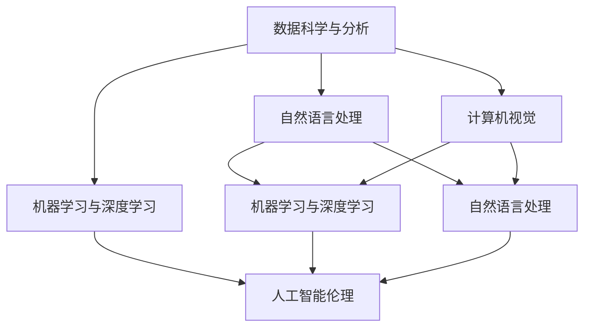

                 

# 未来工作：技能需求与培养

在数字化时代的浪潮中，工作场景正经历着翻天覆地的变化。未来的工作不仅需要扎实的基础知识，更需要跨学科的整合能力、持续的学习能力以及强大的软技能。本文将从背景介绍、核心概念、算法原理、数学模型、项目实践、应用场景、工具推荐、发展趋势和挑战等方面，全面剖析未来工作所需的技能及其培养路径，为职场人士和教育机构提供有价值的参考。

## 1. 背景介绍

### 1.1 工作场景的变革
随着人工智能、大数据、物联网等技术的飞速发展，工作场景正发生深刻变革。自动化、智能化、协同化成为主流，传统重复性工作逐步被智能系统取代，而对人的创新、决策、沟通、协作等能力的需求则日益增加。

### 1.2 技能需求的变化
未来工作对技能的需求不再是单一的编程能力或某个领域的知识，而是跨学科的整合能力、系统的思维方式和适应变化的能力。需要掌握的数据科学、机器学习、自然语言处理、计算机视觉等新兴技术，都需要具备良好的基础理论、实践能力和综合素质。

## 2. 核心概念与联系

### 2.1 核心概念概述
- **数据科学与分析**：利用数据进行问题分析、预测、优化等，是未来工作的基础。
- **机器学习与深度学习**：通过算法训练模型，实现自动化的决策和预测，是未来工作的核心技术。
- **自然语言处理**：让计算机理解、处理和生成自然语言，是未来工作的必备技能。
- **计算机视觉**：使计算机具备"看"和"理解"图像、视频等视觉信息的能力，是未来工作的重要应用方向。
- **人工智能伦理**：关注人工智能的道德、法律和社会问题，是未来工作必须考虑的方面。

### 2.2 核心概念原理和架构的 Mermaid 流程图


## 3. 核心算法原理 & 具体操作步骤

### 3.1 算法原理概述
未来工作的核心算法原理包括数据处理、模型训练、评估和部署等环节。其中，数据科学与分析、机器学习与深度学习是两大支柱，自然语言处理和计算机视觉则拓展了应用范围，人工智能伦理确保了技术应用的合理性和安全性。

### 3.2 算法步骤详解
1. **数据收集与预处理**：从多种渠道获取数据，进行清洗、归一化和特征工程。
2. **模型选择与训练**：根据任务特点选择合适的模型，如线性回归、决策树、神经网络等，并进行训练和调参。
3. **模型评估与优化**：使用交叉验证、网格搜索等方法评估模型性能，并优化超参数。
4. **模型部署与监控**：将模型集成到生产环境，进行实时监控和维护。

### 3.3 算法优缺点
- **优点**：自动化、智能化程度高，处理复杂任务效率高，具备较强的泛化能力。
- **缺点**：需要大量数据和计算资源，模型复杂度高，易受输入数据质量影响。

### 3.4 算法应用领域
- **金融行业**：用于风险评估、交易预测、客户行为分析等。
- **医疗健康**：用于疾病预测、诊断辅助、个性化治疗方案推荐等。
- **制造业**：用于生产优化、质量控制、设备故障预测等。
- **零售电商**：用于商品推荐、销售预测、客户画像分析等。
- **智能交通**：用于交通流量预测、智能调度、安全监控等。

## 4. 数学模型和公式 & 详细讲解 & 举例说明

### 4.1 数学模型构建
数据科学与分析的数学模型包括线性回归、逻辑回归、决策树、随机森林、神经网络等。其中，神经网络是未来工作的主要模型，其核心思想是通过大量数据进行训练，模拟人脑的神经元网络，从而实现自动化的决策和预测。

### 4.2 公式推导过程
以线性回归为例，其数学模型为：
$$
y = \beta_0 + \beta_1x_1 + \beta_2x_2 + \ldots + \beta_nx_n + \epsilon
$$
其中 $y$ 为预测值，$x_i$ 为输入特征，$\beta_i$ 为权重，$\epsilon$ 为误差项。模型的目标是最小化预测值与真实值之间的误差平方和。

### 4.3 案例分析与讲解
假设有一个房价预测问题，已知数据集包含房屋面积、房间数、地段等因素，目标变量为房价。构建线性回归模型，通过训练和调参，得到最优的权重 $\beta_i$。将该模型应用于新的数据，即可预测房价。

## 5. 项目实践：代码实例和详细解释说明

### 5.1 开发环境搭建
1. **安装Python**：确保Python版本为3.8以上，安装TensorFlow、Pandas、Numpy等库。
2. **创建虚拟环境**：使用`virtualenv`创建虚拟环境，保证项目环境的一致性。
3. **设置开发工具**：配置Git、Jupyter Notebook等开发工具，提高开发效率。

### 5.2 源代码详细实现
以下是一个简单的房价预测项目，使用TensorFlow和Pandas进行数据处理和模型训练。

```python
import pandas as pd
import tensorflow as tf
from sklearn.model_selection import train_test_split

# 加载数据集
data = pd.read_csv('house_prices.csv')

# 数据预处理
X = data[['area', 'rooms', 'location']]
y = data['price']

# 划分训练集和测试集
X_train, X_test, y_train, y_test = train_test_split(X, y, test_size=0.2)

# 构建模型
model = tf.keras.Sequential([
    tf.keras.layers.Dense(64, activation='relu', input_shape=(X_train.shape[1],)),
    tf.keras.layers.Dense(1)
])

# 编译模型
model.compile(optimizer=tf.keras.optimizers.Adam(), loss='mse')

# 训练模型
model.fit(X_train, y_train, epochs=10, batch_size=32)

# 评估模型
test_loss = model.evaluate(X_test, y_test)

print(f'Test loss: {test_loss:.4f}')
```

### 5.3 代码解读与分析
1. **数据加载与预处理**：使用Pandas加载数据集，并进行特征选择和划分。
2. **模型构建与编译**：使用TensorFlow构建神经网络模型，并进行编译和优化器的设置。
3. **模型训练与评估**：使用训练集进行模型训练，并在测试集上评估模型性能。

### 5.4 运行结果展示
运行上述代码，输出测试集上的损失值，即可评估模型的预测效果。

## 6. 实际应用场景

### 6.1 智能金融
智能金融系统利用机器学习与深度学习技术，对海量数据进行分析和预测，提供个性化的投资建议和风险评估。例如，利用神经网络进行股票价格预测，使用决策树进行客户信用评分，提升金融服务的智能化和个性化水平。

### 6.2 智慧医疗
智慧医疗系统通过自然语言处理和计算机视觉技术，解析医学文献、患者记录等信息，辅助医生进行疾病诊断和治疗方案推荐。例如，使用BERT模型进行病理图像分析，使用RNN模型进行疾病预测，提高医疗服务的准确性和效率。

### 6.3 智能制造
智能制造系统利用机器学习和计算机视觉技术，优化生产流程、提高产品质量和设备利用率。例如，使用图像识别技术检测产品缺陷，使用回归模型预测设备故障，提升制造业的智能化水平。

### 6.4 智能交通
智能交通系统通过机器学习和自然语言处理技术，实现交通流量预测、智能调度和安全监控。例如，利用LSTM模型预测交通流量，使用NLP技术解析交通告警信息，提高城市交通的智能化和安全性。

## 7. 工具和资源推荐

### 7.1 学习资源推荐
1. **《Python机器学习》**：详细介绍Python在机器学习中的应用，适合入门学习。
2. **Coursera《机器学习》**：由斯坦福大学开设，系统讲解机器学习理论和方法。
3. **Kaggle竞赛平台**：提供大量数据集和比赛，提升实战经验。
4. **GitHub**：提供开源项目和代码库，便于学习和分享。

### 7.2 开发工具推荐
1. **Jupyter Notebook**：交互式编程工具，适合数据探索和模型调试。
2. **PyCharm**：Python IDE，提供代码编辑、调试和版本控制功能。
3. **TensorFlow**：开源机器学习框架，适合构建复杂模型。
4. **Keras**：高层次API，简化模型构建和训练过程。
5. **Scikit-learn**：Python机器学习库，提供多种算法和工具。

### 7.3 相关论文推荐
1. **《深度学习》**：Ian Goodfellow等著，系统介绍深度学习理论和方法。
2. **《Python数据科学手册》**：Jake VanderPlas著，涵盖数据处理、分析和可视化等技术。
3. **《自然语言处理综论》**：Daniel Jurafsky和James H. Martin著，全面介绍NLP技术和应用。

## 8. 总结：未来发展趋势与挑战

### 8.1 研究成果总结
未来工作对数据科学与分析、机器学习与深度学习、自然语言处理和计算机视觉等技术的依赖日益增加，但同时也面临着数据质量、算法性能、系统稳定性等挑战。

### 8.2 未来发展趋势
1. **跨学科融合**：更多领域的技术和方法将相互融合，形成综合解决方案。
2. **智能化升级**：未来工作将更加智能化和自动化，减少重复性工作。
3. **个性化定制**：根据个人需求和特征，提供个性化的服务和产品。
4. **实时化反馈**：通过实时数据采集和分析，及时调整和优化工作流程。
5. **安全性保障**：保护数据隐私和安全，防范人工智能伦理风险。

### 8.3 面临的挑战
1. **数据获取与处理**：数据获取难度大，数据处理复杂，数据质量难以保证。
2. **模型训练与调参**：模型训练时间长，超参数调参复杂，模型性能不稳定。
3. **系统集成与部署**：系统集成难度大，部署成本高，系统稳定性难以保障。
4. **伦理与安全**：人工智能伦理问题复杂，数据隐私和安全问题突出。

### 8.4 研究展望
1. **数据驱动的决策支持**：更多依靠数据和模型进行决策，减少人为干预。
2. **跨模态信息的融合**：将多种模态的信息融合，提升系统的理解和应用能力。
3. **自动化流程优化**：利用AI技术优化业务流程，提升效率和质量。
4. **个性化服务的定制**：提供更加个性化、定制化的服务，满足多样化需求。
5. **AI伦理与安全**：加强对AI伦理和安全问题的研究，制定相关标准和规范。

## 9. 附录：常见问题与解答

**Q1：未来工作需要哪些技能？**

A: 未来工作需要具备以下技能：
- 数据科学与分析：掌握数据处理、统计分析等基础技能。
- 机器学习与深度学习：熟悉常用的机器学习算法和框架。
- 自然语言处理：掌握自然语言处理的基本原理和技术。
- 计算机视觉：了解图像处理、特征提取等技术。
- 编程与软件工程：具备良好的编程能力和软件工程基础。
- 项目管理与沟通：具备良好的项目管理和团队协作能力。

**Q2：如何培养未来工作所需的技能？**

A: 培养未来工作所需的技能需要：
- **持续学习**：通过在线课程、书籍、论文等不断更新知识。
- **实践练习**：通过项目实践、竞赛等提升技能水平。
- **跨领域合作**：与不同领域的专家合作，拓展技术视野。
- **多模态应用**：将多种技术融合应用，提升综合能力。
- **伦理与安全意识**：增强对AI伦理和数据安全的认识和重视。

---

作者：禅与计算机程序设计艺术 / Zen and the Art of Computer Programming

