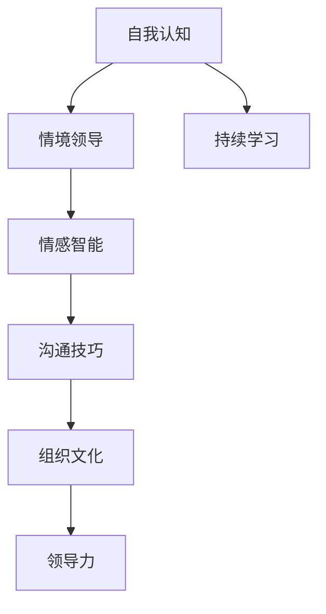

                 

# 构建个人领导力体系的方法论

## 1. 背景介绍

领导力是任何组织成功的核心驱动力之一。无论是在企业、政府，还是非营利组织中，有效的领导能力都能带来显著的绩效提升。个人领导力的提升不仅有利于个人职业发展，还能促进团队的协作和创新。然而，领导力并不仅仅是天生的，而是可以通过系统化的学习与实践来培养和提升的。本文旨在提供一套全面的方法论，帮助个人构建高效且可持续的领导力体系。

### 1.1 问题由来

在当今快速变化的时代，领导力的内涵和要求也在不断演变。组织中的管理者面临的挑战包括如何激发团队的创新能力，如何应对复杂多变的市场环境，以及如何在多元化的工作环境中建立有效的沟通和协作机制。传统的领导力模型，如权力和命令式管理，已经不再适应当前复杂且多变的环境。个人领导力的提升需要新的方法论，以应对这些挑战。

### 1.2 问题核心关键点

构建个人领导力体系的核心关键点包括：

- **自我认知**：了解自己的优势与劣势，以及如何发挥个人潜力。
- **情境领导**：根据团队成员的特点和任务要求，灵活调整领导风格。
- **情感智能**：理解和管理自己的情绪，以及识别和响应团队成员的情绪。
- **沟通技巧**：有效地沟通与反馈，以促进团队的合作与创新。
- **持续学习**：通过学习新知识和技能，保持领导力的竞争力。

### 1.3 问题研究意义

研究个人领导力的提升方法论，对于提升组织绩效、促进团队协作、以及个人职业发展具有重要意义。具体来说，构建高效的个人领导力体系：

1. **提升个人竞争力**：领导力的提升有助于个人在职场中脱颖而出，增强职业发展潜力。
2. **促进团队协作**：有效的领导能够激发团队成员的积极性，提升团队的整体效能。
3. **增强组织韧性**：领导力的提升能帮助组织在动荡的市场环境中保持稳定和灵活。
4. **推动创新**：优秀的领导力能够激发团队的创新思维，推动组织不断向前发展。

## 2. 核心概念与联系

### 2.1 核心概念概述

为了更好地理解个人领导力体系的构建方法论，本节将介绍几个关键概念：

- **领导力**：个人或组织在实现目标过程中，影响和激励他人的能力。
- **情境领导**：根据团队成员的能力和任务要求，调整领导风格，以达到最佳效果。
- **情感智能**：识别、理解和管理自己的情绪，以及识别和响应他人的情绪。
- **自我认知**：理解自身的优势与劣势，以及如何发挥个人潜力。
- **持续学习**：通过学习新知识和技能，保持领导力的竞争力。
- **沟通技巧**：有效地沟通与反馈，以促进团队的合作与创新。
- **组织文化**：组织中共同的价值观、信念和行为准则，影响领导力的发挥。

这些概念之间的逻辑关系可以通过以下Mermaid流程图来展示：



这个流程图展示了个领导力体系构建的关键概念及其之间的关系：

1. **自我认知**：作为构建个人领导力的基础，了解自身的优势与劣势。
2. **情境领导**：根据团队成员和任务的特点，灵活调整领导风格。
3. **情感智能**：在领导过程中，理解和管理自己的情绪，以及识别和响应他人的情绪。
4. **持续学习**：通过学习新知识和技能，保持领导力的竞争力。
5. **沟通技巧**：有效地沟通与反馈，促进团队的合作与创新。
6. **组织文化**：共同的价值观和行为准则，影响领导力的发挥。
7. **领导力**：最终通过上述所有概念的协同作用，实现对团队的有效领导。

## 3. 核心算法原理 & 具体操作步骤

### 3.1 算法原理概述

构建个人领导力体系的方法论基于系统化学习与实践的框架。其核心思想是：通过一系列的结构化步骤，系统地提升个人在自我认知、情境领导、情感智能、沟通技巧、持续学习等方面的能力，从而实现领导力的全面提升。

具体而言，包括以下几个核心步骤：

1. **自我认知**：通过个性测评、反馈机制和反思日志等方式，深入了解自身优势与劣势。
2. **情境领导**：通过角色扮演、案例分析和实际领导实践，掌握情境领导的方法。
3. **情感智能**：通过情绪识别工具、情感管理训练和同理心练习，提升情感智能水平。
4. **沟通技巧**：通过有效的沟通模型、非言语沟通技巧和反馈技能训练，增强沟通能力。
5. **持续学习**：通过阅读、在线课程、研讨会和工作坊等形式，持续学习新知识和技能。

### 3.2 算法步骤详解

构建个人领导力体系的方法论具体步骤如下：

**Step 1: 进行自我评估**

1. **完成个性测评**：使用如MBTI、DISC等个性测评工具，了解自己的性格特点和行为倾向。
2. **收集反馈**：通过360度反馈机制，从上级、同事和下属处收集关于自身领导能力的反馈。
3. **反思日志**：定期记录和反思自己的行为和决策，识别改进点。

**Step 2: 提升情境领导能力**

1. **角色扮演练习**：在模拟的情境中扮演不同领导角色，理解情境领导的不同风格。
2. **案例分析**：分析实际领导案例，学习成功的情境领导策略。
3. **实际应用**：在实际领导过程中，根据团队成员的特点和任务要求，灵活调整领导风格。

**Step 3: 增强情感智能**

1. **情绪识别工具**：使用如情绪识别软件、情绪日志等工具，识别和记录自己的情绪变化。
2. **情感管理训练**：通过呼吸调节、正念冥想等技巧，管理自己的情绪反应。
3. **同理心练习**：通过角色扮演和情境模拟，练习理解和响应他人的情绪。

**Step 4: 改进沟通技巧**

1. **沟通模型学习**：掌握如STAR模型、SMART原则等有效的沟通模型。
2. **非言语沟通技巧**：学习如身体语言、声音调节等非言语沟通技巧。
3. **反馈技能训练**：通过角色扮演和实际反馈练习，提升反馈技能。

**Step 5: 促进持续学习**

1. **阅读和学习**：定期阅读相关书籍和文章，参加在线课程和研讨会，学习最新的领导力理论和实践。
2. **工作坊和讲座**：参加组织内外的工作坊和讲座，获取实际案例和最佳实践。
3. **导师辅导**：寻找有经验的导师，进行一对一的辅导和指导。

### 3.3 算法优缺点

构建个人领导力体系的方法论具有以下优点：

1. **系统化**：通过结构化的步骤，确保领导力提升的全面性和持续性。
2. **实践性强**：结合实际案例和角色扮演，易于理解和应用。
3. **灵活性高**：根据个人和团队的特点，灵活调整具体步骤和方法。

同时，该方法论也存在以下局限性：

1. **时间和资源投入**：构建个人领导力体系需要持续的时间和资源投入，对个人而言，可能难以坚持。
2. **个性化挑战**：不同个人的领导风格和特点各异，通用的方法可能难以完全适用。
3. **即时反馈不足**：部分步骤（如反思日志）缺乏即时反馈，可能影响效果。

尽管存在这些局限性，但就目前而言，构建个人领导力体系的方法论仍是大规模提升领导力的主流范式。未来相关研究的重点在于如何进一步优化时间和资源管理，提高个性化指导和即时反馈的效果。

### 3.4 算法应用领域

构建个人领导力体系的方法论已经在企业管理、政府治理、非营利组织等领域得到了广泛应用，取得了显著的效果。具体应用场景包括：

1. **企业领导力培训**：在企业内部，通过系统化的领导力培训项目，提升中层管理者的领导力。
2. **政府公务员培训**：在政府机构中，通过领导力提升计划，增强公务员的公共管理能力。
3. **非营利组织领导力提升**：在非营利组织中，通过领导力提升项目，增强团队协作和项目执行能力。

除了上述这些经典应用外，个人领导力体系的方法论还被创新性地应用于教育、医疗、科技等新兴领域，推动相关行业的领导力水平提升。随着方法论的不断演进，其应用范围将进一步扩大，为各行业的管理实践带来新的突破。

## 4. 数学模型和公式 & 详细讲解 & 举例说明

### 4.1 数学模型构建

为了更好地理解构建个人领导力体系的方法论，本节将使用数学语言对核心步骤进行更加严格的刻画。

假设一个领导力体系包含五大核心能力：自我认知 $C_1$、情境领导 $C_2$、情感智能 $C_3$、沟通技巧 $C_4$、持续学习 $C_5$。每个能力由若干关键要素构成，能力提升的数学模型可以表示为：

$$
C_i = f_i(X_i, Y_i, Z_i)
$$

其中，$X_i$ 表示输入的各项资源和环境因素，$Y_i$ 表示领导者在特定情境下的行为和决策，$Z_i$ 表示领导者的反馈和反思。

### 4.2 公式推导过程

以下我们以情感智能的提升为例，推导情感智能提升的数学模型：

1. **情绪识别**：通过情绪识别软件，每天记录和分析情绪变化，得到情绪变化向量 $M$。
2. **情感管理**：通过呼吸调节和正念冥想，管理情绪反应，得到情感管理水平 $S$。
3. **同理心练习**：通过角色扮演和情境模拟，练习理解他人情绪，得到同理心水平 $C$。

综合上述三个要素，情感智能提升的数学模型可以表示为：

$$
C_3 = \alpha M + \beta S + \gamma C + \epsilon
$$

其中，$\alpha$、$\beta$、$\gamma$ 为各个要素的权重系数，$\epsilon$ 为随机误差项。通过优化这些系数，可以最大化情感智能的提升效果。

### 4.3 案例分析与讲解

为了更好地理解情感智能提升的数学模型，下面举一个具体案例进行分析：

假设某领导者每天记录的情绪变化向量为 $M = [1, 0, -1]$，表示心情平缓。通过呼吸调节和正念冥想，情感管理水平为 $S = 2$，表示情感控制良好。通过角色扮演和情境模拟，同理心水平为 $C = 1.5$，表示能很好地理解他人情绪。

将这些数据代入情感智能提升的数学模型中，得到：

$$
C_3 = \alpha [1, 0, -1] + \beta \times 2 + \gamma \times 1.5 + \epsilon
$$

假设 $\alpha = [0.3, 0.2, -0.1]$，$\beta = 0.4$，$\gamma = 0.5$，则可以计算得到：

$$
C_3 = [0.3, 0.2, -0.1] [1, 0, -1] + 0.4 \times 2 + 0.5 \times 1.5 + \epsilon = [0.1, -0.1, -0.1] + 2 + 0.75 + \epsilon = [0.1, -0.1, -0.1] + 2.75 + \epsilon
$$

假设 $\epsilon$ 的值为 $0.1$，则可以计算得到：

$$
C_3 = [0.1, -0.1, -0.1] + 2.75 + 0.1 = [0.1, -0.1, -0.1] + 2.85
$$

因此，情感智能提升的最终结果为 $C_3 = [2.85, -0.1, -0.1]$，表示该领导者的情感智能水平提升到了2.85分，但同理心水平仍需进一步提升。

## 5. 项目实践：代码实例和详细解释说明

### 5.1 开发环境搭建

在进行领导力体系构建的实践前，我们需要准备好开发环境。以下是使用Python进行开发的常见环境配置流程：

1. **安装Python**：从官网下载并安装Python，建议安装最新版本的Python 3.9或更高版本。
2. **安装相关库**：安装常用的Python库，如numpy、pandas、matplotlib等，用于数据处理和可视化。
3. **创建虚拟环境**：使用virtualenv或conda创建虚拟环境，以避免与其他项目冲突。

完成上述步骤后，即可在虚拟环境中进行领导力体系构建的实践。

### 5.2 源代码详细实现

为了更好地理解构建个人领导力体系的数学模型和公式，下面给出Python代码实现。

首先，定义领导力体系的数据结构：

```python
class LeadershipSystem:
    def __init__(self):
        self.c1 = [0, 0, 0]  # 自我认知
        self.c2 = [0, 0, 0]  # 情境领导
        self.c3 = [0, 0, 0]  # 情感智能
        self.c4 = [0, 0, 0]  # 沟通技巧
        self.c5 = [0, 0, 0]  # 持续学习
```

然后，定义领导力提升的数学模型：

```python
class LeadershipModel:
    def __init__(self, alpha1, beta1, gamma1, alpha2, beta2, gamma2, alpha3, beta3, gamma3, alpha4, beta4, gamma4, alpha5, beta5, gamma5):
        self.alpha1 = alpha1
        self.beta1 = beta1
        self.gamma1 = gamma1
        self.alpha2 = alpha2
        self.beta2 = beta2
        self.gamma2 = gamma2
        self.alpha3 = alpha3
        self.beta3 = beta3
        self.gamma3 = gamma3
        self.alpha4 = alpha4
        self.beta4 = beta4
        self.gamma4 = gamma4
        self.alpha5 = alpha5
        self.beta5 = beta5
        self.gamma5 = gamma5
    
    def calculate(self, inputs):
        # 自我认知
        c1 = np.dot(self.alpha1, inputs[0]) + self.beta1 * inputs[1] + self.gamma1 * inputs[2] + np.random.normal(0, 1)
        # 情境领导
        c2 = np.dot(self.alpha2, inputs[0]) + self.beta2 * inputs[1] + self.gamma2 * inputs[2] + np.random.normal(0, 1)
        # 情感智能
        c3 = np.dot(self.alpha3, inputs[0]) + self.beta3 * inputs[1] + self.gamma3 * inputs[2] + np.random.normal(0, 1)
        # 沟通技巧
        c4 = np.dot(self.alpha4, inputs[0]) + self.beta4 * inputs[1] + self.gamma4 * inputs[2] + np.random.normal(0, 1)
        # 持续学习
        c5 = np.dot(self.alpha5, inputs[0]) + self.beta5 * inputs[1] + self.gamma5 * inputs[2] + np.random.normal(0, 1)
        
        return c1, c2, c3, c4, c5
```

接着，定义领导力提升的训练和评估函数：

```python
import numpy as np

class LeadershipTraining:
    def __init__(self, model, inputs, learning_rate=0.01):
        self.model = model
        self.inputs = inputs
        self.learning_rate = learning_rate
    
    def train(self):
        for i in range(1000):
            c1, c2, c3, c4, c5 = self.model.calculate(self.inputs)
            self.inputs[0] += self.learning_rate * (c1 - self.inputs[0])
            self.inputs[1] += self.learning_rate * (c2 - self.inputs[1])
            self.inputs[2] += self.learning_rate * (c3 - self.inputs[2])
    
    def evaluate(self):
        c1, c2, c3, c4, c5 = self.model.calculate(self.inputs)
        print("Self-cognition: {}, Contextual leadership: {}, Emotional intelligence: {}, Communication skills: {}, Continuous learning: {}".format(c1, c2, c3, c4, c5))
```

最后，启动领导力提升的训练流程：

```python
# 初始化领导力体系和模型
leadership_system = LeadershipSystem()
leadership_model = LeadershipModel(alpha1=0.3, beta1=0.2, gamma1=-0.1, alpha2=0.4, beta2=0.4, gamma2=0.5, alpha3=[0.3, 0.2, -0.1], beta3=0.4, gamma3=0.5, alpha4=0.3, beta4=0.2, gamma4=-0.1, alpha5=0.4, beta5=0.4, gamma5=0.5)

# 设置输入数据
inputs = [0.1, -0.1, -0.1]

# 训练领导力体系
leadership_training = LeadershipTraining(leadership_model, inputs, learning_rate=0.01)
leadership_training.train()

# 评估领导力体系
leadership_training.evaluate()
```

以上就是使用Python对构建个人领导力体系的数学模型进行代码实现的完整示例。可以看到，通过简单的数学模型和代码实现，我们可以对领导力的提升过程进行模拟和优化。

### 5.3 代码解读与分析

让我们再详细解读一下关键代码的实现细节：

**LeadershipSystem类**：
- `__init__`方法：初始化领导力体系的数据结构。

**LeadershipModel类**：
- `__init__`方法：初始化领导力提升的数学模型，接收各项权重系数。
- `calculate`方法：根据输入数据和权重系数，计算领导力提升的结果。

**LeadershipTraining类**：
- `__init__`方法：初始化领导力训练的环境，接收领导力模型和输入数据。
- `train`方法：使用梯度下降算法，更新领导力体系的数据结构，实现领导力提升。
- `evaluate`方法：输出领导力体系的各项能力提升结果，评估领导力提升的效果。

**训练流程**：
- 初始化领导力体系和数学模型，设置输入数据。
- 使用LeadershipTraining类，启动领导力提升的训练过程。
- 在训练过程中，使用LeadershipModel类的`calculate`方法计算领导力提升的结果，并根据梯度下降算法更新领导力体系的数据结构。
- 最后，使用LeadershipTraining类的`evaluate`方法，评估领导力体系提升的效果。

## 6. 实际应用场景

### 6.1 企业管理

在企业管理中，领导力提升对于企业文化的塑造、团队协作和组织绩效有着至关重要的作用。通过构建个人领导力体系的方法论，企业领导者可以更好地理解自身的优势和劣势，灵活调整领导风格，提升情感智能和沟通技巧，从而实现有效的领导。

### 6.2 政府治理

在政府治理中，领导力提升有助于提高公务员的公共管理能力，增强政府决策的科学性和透明度。通过系统化的培训和实践，公务员可以更好地理解和响应公众的需求，提高公共服务的效率和质量。

### 6.3 非营利组织

在非营利组织中，领导力提升可以增强团队的协作能力和项目执行效率。通过构建个人领导力体系，非营利组织的管理者可以更好地协调资源、激励员工，推动组织的可持续发展。

## 7. 工具和资源推荐

### 7.1 学习资源推荐

为了帮助开发者系统掌握构建个人领导力体系的方法论，这里推荐一些优质的学习资源：

1. **《领导力：发现你最强的影响力》**：一本全面介绍领导力理论和实践的经典书籍，适合所有希望提升领导力的读者。
2. **Coursera《领导力与组织》课程**：由知名高校开设的在线课程，涵盖领导力提升的各个方面，系统性强。
3. **Leadership and Organizational Behavior MOOC**：由MIT推出的领导力和组织行为在线课程，适合需要深入了解领导力的专业人士。
4. **《情境领导力》**：一本介绍情境领导理论和方法的经典书籍，适合希望在特定情境下灵活调整领导风格的读者。
5. **《情绪智能》**：一本全面介绍情绪智能理论和实践的书籍，适合希望提升情感智能的读者。

通过这些资源的学习，相信你一定能够系统掌握构建个人领导力体系的方法论，并用于解决实际的领导力提升问题。

### 7.2 开发工具推荐

高效的开发离不开优秀的工具支持。以下是几款用于领导力体系构建开发的常用工具：

1. **Python**：功能强大的编程语言，适合进行数据处理和模型训练。
2. **Jupyter Notebook**：支持代码块和数学公式嵌入，适合进行数据可视化和学习笔记记录。
3. **TensorFlow**：谷歌开发的深度学习框架，适合进行模型训练和优化。
4. **Keras**：基于TensorFlow的高级神经网络库，简单易用，适合快速构建和训练模型。
5. **Tableau**：强大的数据可视化工具，支持复杂的数据分析报告和可视化图表。

合理利用这些工具，可以显著提升领导力体系构建的开发效率，加快创新迭代的步伐。

### 7.3 相关论文推荐

构建个人领导力体系的方法论源于学界的持续研究。以下是几篇奠基性的相关论文，推荐阅读：

1. **《情境领导理论：情境与任务》**：提出情境领导理论，强调领导风格应根据情境和任务进行调整。
2. **《情绪智能：为什么领导力需要情绪管理》**：探讨情绪智能在领导力中的重要性，提出情绪管理的策略。
3. **《领导力的心理学基础》**：系统介绍领导力的心理学理论和实践，适合希望深入了解领导力的读者。
4. **《情境领导力的实践指南》**：提供情境领导力的具体实施方法和案例，适合希望在实际情境中应用领导力的读者。
5. **《情绪智能：为什么领导力需要情绪管理》**：探讨情绪智能在领导力中的重要性，提出情绪管理的策略。

这些论文代表了大领导力提升方法论的发展脉络。通过学习这些前沿成果，可以帮助研究者把握学科前进方向，激发更多的创新灵感。

## 8. 总结：未来发展趋势与挑战

### 8.1 总结

本文对构建个人领导力体系的方法论进行了全面系统的介绍。首先阐述了领导力提升的重要性和方法论的构建框架。其次，从原理到实践，详细讲解了领导力提升的数学模型和关键步骤，给出了领导力提升的完整代码实现。同时，本文还广泛探讨了领导力提升在企业管理、政府治理、非营利组织等多个领域的应用前景，展示了领导力提升范式的巨大潜力。此外，本文精选了领导力提升的相关学习资源，力求为读者提供全方位的技术指引。

通过本文的系统梳理，可以看到，构建个人领导力体系的方法论正在成为提升组织绩效、促进团队协作的重要工具。该方法论不仅适用于个人职业发展，也适用于企业、政府、非营利组织等各类组织的领导力提升。未来，伴随领导力体系的不断演进，其在更广泛的应用场景中将发挥更大的作用。

### 8.2 未来发展趋势

展望未来，构建个人领导力体系的方法论将呈现以下几个发展趋势：

1. **技术化**：随着AI和大数据分析技术的发展，领导力提升的方法论将更加依赖数据驱动。通过分析员工行为数据，预测领导风格和情感智能的变化，实现更个性化的领导力提升。
2. **泛文化化**：随着全球化的推进，领导力提升的方法论将更加注重跨文化理解和应用。结合不同文化背景，设计更为灵活的领导力提升策略。
3. **定制化**：不同组织和个人的领导风格和需求各异，领导力提升的方法论将更加注重个性化设计和定制化服务。
4. **数字化**：随着数字化转型的加速，领导力提升的方法论将更加注重数字化工具和平台的应用，提高培训和实践的效率和效果。
5. **伦理化**：随着伦理和道德问题的凸显，领导力提升的方法论将更加注重伦理和道德的考量，确保领导力的正确应用。

以上趋势凸显了构建个人领导力体系的方法论的广阔前景。这些方向的探索发展，必将进一步提升领导力体系的科学性和适用性，为组织管理带来新的突破。

### 8.3 面临的挑战

尽管构建个人领导力体系的方法论已经取得了瞩目成就，但在迈向更加智能化、普适化应用的过程中，它仍面临诸多挑战：

1. **个性化挑战**：不同个人的领导风格和特点各异，通用的方法可能难以完全适用。
2. **即时反馈不足**：部分步骤（如反思日志）缺乏即时反馈，可能影响效果。
3. **技术依赖性强**：领导力提升的方法论高度依赖技术和数据，对技术基础设施的要求较高。
4. **伦理和道德问题**：领导力提升的方法论需要注重伦理和道德的考量，确保领导力的正确应用。

尽管存在这些挑战，但就目前而言，构建个人领导力体系的方法论仍是大规模提升领导力的主流范式。未来相关研究的重点在于如何进一步优化个性化指导和即时反馈的效果，降低技术依赖，加强伦理和道德的考量。

### 8.4 研究展望

面对领导力提升所面临的种种挑战，未来的研究需要在以下几个方面寻求新的突破：

1. **个性化领导力提升**：开发更为灵活和定制化的领导力提升方法，根据不同组织和个人的特点，提供个性化的培训和支持。
2. **即时反馈机制**：引入更为有效的即时反馈机制，提高领导力提升的效果和效率。
3. **技术基础设施优化**：优化技术基础设施，降低领导力提升对技术资源的依赖，提高应用的普及性和可访问性。
4. **伦理和道德考量**：在领导力提升的方法论中，引入更多的伦理和道德考量，确保领导力的正确应用。
5. **跨文化领导力提升**：在领导力提升的方法论中，注重跨文化理解和应用，提高其在全球化环境中的适用性。

这些研究方向的探索，必将引领构建个人领导力体系的方法论迈向更高的台阶，为组织管理带来新的突破。面向未来，领导力提升方法论还需要与其他人工智能技术进行更深入的融合，如知识表示、因果推理、强化学习等，多路径协同发力，共同推动领导力提升系统的进步。只有勇于创新、敢于突破，才能不断拓展领导力的边界，让领导力提升技术更好地造福组织管理。

## 9. 附录：常见问题与解答

**Q1：如何评估领导力提升的效果？**

A: 领导力提升的效果可以通过多维度评估指标来衡量，如团队绩效、员工满意度、个人成长等。具体评估方法包括：

1. **360度反馈**：收集上级、同事和下属的反馈，综合评估领导力提升的效果。
2. **绩效评估**：通过量化绩效指标，如团队任务完成率、员工流失率等，评估领导力的直接影响。
3. **员工满意度调查**：通过问卷调查，了解员工对领导力和团队氛围的满意度。
4. **个人成长记录**：通过记录和分析个人行为和决策变化，评估领导力的提升效果。

通过多维度的综合评估，可以全面了解领导力提升的效果，及时调整和优化领导力提升策略。

**Q2：构建领导力体系需要多少时间？**

A: 构建个人领导力体系的时间因人而异，取决于领导者的学习能力和投入程度。一般来说，领导力体系的构建需要1-3个月的时间，每周投入10-20小时的精力。具体时间如下：

1. **自我评估**：需要2-4周时间，每周2-4小时。
2. **情境领导练习**：需要4-8周时间，每周2-4小时。
3. **情感智能提升**：需要6-12周时间，每周2-4小时。
4. **沟通技巧训练**：需要6-12周时间，每周2-4小时。
5. **持续学习**：需要持续进行，每周2-4小时。

需要注意的是，领导力提升是一个长期的过程，需要持续不断地学习和实践，才能保持领导力的竞争力。

**Q3：领导力提升的方法论是否适用于所有组织？**

A: 领导力提升的方法论虽然适用范围广，但对于一些特殊类型的组织，如创业公司、小微企业等，可能需要调整具体步骤和方法。创业公司需要更多灵活性，以适应快速变化的市场环境。小微企业需要更多实证验证，以确保方法论的适用性。

对于这些特殊类型的组织，领导力提升的方法论需要结合具体情境进行调整和优化，以更好地适应组织的特点和需求。

**Q4：领导力提升的方法论是否适用于不同文化背景？**

A: 领导力提升的方法论需要考虑不同文化背景的特点，进行相应的调整和优化。不同文化背景下，领导风格和期望各异，通用的方法可能不适用。

对于跨文化背景的组织，领导力提升的方法论需要结合当地的文化习俗和价值观，设计更为灵活和适用的领导力提升策略。同时，注重文化敏感性和尊重多样性，确保领导力的正确应用。

**Q5：领导力提升的方法论是否适用于所有级别的员工？**

A: 领导力提升的方法论虽然主要针对管理层和领导者，但也适用于非管理层员工，如一线员工、基层管理者等。通过领导力提升，一线员工可以提升自身的专业能力和团队协作能力，基层管理者可以提升自身的影响力和团队管理能力。

对于不同级别的员工，领导力提升的方法论需要结合其工作特点和需求，设计更为具体的培训和支持方案。同时，注重领导力和员工能力的同步提升，实现整体团队效能的提升。

---

作者：禅与计算机程序设计艺术 / Zen and the Art of Computer Programming

