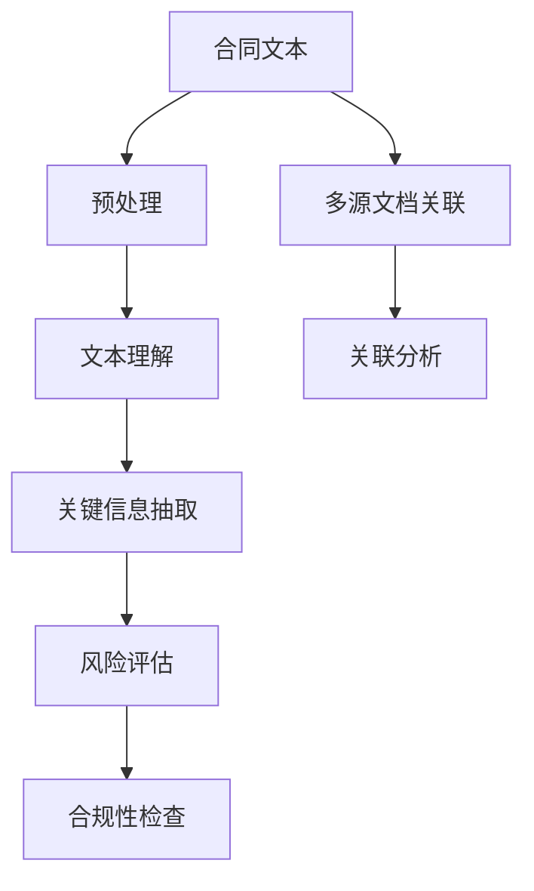

                 

# 法律AI：LLM在合同分析和案例研究中的应用

> 关键词：自然语言处理(NLP), 合同分析, 案例研究, 法律文本, 大语言模型(LLM), 数据分析

## 1. 背景介绍

### 1.1 问题由来

随着经济全球化和数字化进程的加速，合同的签署和执行成为企业运营中的重要环节。然而，合同往往复杂冗长，条款繁复，手工审查效率低，容易产生错误，存在法律风险。为了提高合同审查效率，降低人工成本，法律AI应运而生。利用自然语言处理(NLP)技术，可以从合同文本中自动化地抽取和分析关键信息，提升合同审查的准确性和效率。

大语言模型(LLM)在文本处理领域取得了突破性进展，凭借其强大的语言理解能力和丰富的知识库，成为合同分析的重要工具。通过LLM对合同文本进行语义理解和信息抽取，可以自动提取合同关键要素，如合同金额、履行期限、违约责任等，并对合同风险进行评估。同时，LLM还可以通过文档对比和关联分析，快速识别合同变更、补充协议等新增内容，保证合同的完整性和准确性。

### 1.2 问题核心关键点

法律AI中的合同分析主要涉及以下核心问题：

1. **合同文本的理解和预处理**：合同文本通常包含专业术语和法律条款，如何有效处理和理解文本内容，是合同分析的第一步。
2. **关键信息的抽取和标注**：从合同文本中自动化地识别并提取关键信息，如金额、期限、违约责任等，并进行信息标注，为后续分析奠定基础。
3. **风险评估和合规性检查**：基于抽取的关键信息，进行风险评估和合规性检查，确保合同条款符合法律法规，识别潜在的法律风险。
4. **智能合同审查和建议**：利用NLP和LLM技术，智能审查合同内容，提供法律建议和修改建议，提升审查效率和质量。
5. **多源文档的关联分析**：除了单个合同，企业还可能涉及多份合同、补充协议、财务报表等多源文档。如何关联分析这些文档，形成完整的法律视角，是合同分析的重要方向。

## 2. 核心概念与联系

### 2.1 核心概念概述

为更好地理解LLM在合同分析中的应用，本节将介绍几个关键概念：

- **自然语言处理(NLP)**：涉及计算机如何理解和处理人类语言的技术。包括文本预处理、词法分析、句法分析、语义分析等环节。
- **合同文本**：指企业间关于权利和义务的协议，通常包含专业术语、法律条款和条件等。
- **大语言模型(LLM)**：以自回归(如GPT)或自编码(如BERT)模型为代表的深度学习模型，在处理大规模文本数据时表现出卓越的能力。
- **合同分析**：利用NLP和LLM技术，从合同文本中自动化地抽取和分析关键信息，进行风险评估和合规性检查，提供智能法律建议。
- **案例研究**：通过对特定合同案例的分析，总结经验教训，提升法律AI系统的准确性和鲁棒性。

这些核心概念之间的逻辑关系可以通过以下Mermaid流程图来展示：



这个流程图展示了大语言模型在合同分析中的应用过程：

1. 合同文本首先进行预处理，去除噪声，分词等，准备文本理解。
2. 通过文本理解，识别出合同文本中的实体、关系和事件，为信息抽取提供基础。
3. 关键信息抽取模块，自动化地提取合同的关键要素。
4. 风险评估模块，基于关键信息对合同进行风险评估，识别潜在风险。
5. 合规性检查模块，确保合同条款符合法律法规。
6. 多源文档关联模块，将多份合同、补充协议、财务报表等多源文档关联分析，形成完整的法律视角。

## 3. 核心算法原理 & 具体操作步骤

### 3.1 算法原理概述

基于LLM的合同分析主要包括以下几个步骤：

1. **文本预处理**：包括分词、去除停用词、词性标注等，为文本理解奠定基础。
2. **文本理解**：利用LLM进行文本语义理解，提取关键实体、关系和事件，为信息抽取提供基础。
3. **关键信息抽取**：根据合同文本的特定结构，识别并抽取金额、期限、违约责任等关键信息。
4. **风险评估和合规性检查**：基于抽取的关键信息，进行风险评估和合规性检查，识别潜在的法律风险。
5. **智能合同审查和建议**：利用NLP和LLM技术，智能审查合同内容，提供法律建议和修改建议，提升审查效率和质量。

### 3.2 算法步骤详解

以下是LLM在合同分析中的具体操作步骤：

1. **文本预处理**：使用Python的NLTK或SpaCy库进行分词和词性标注，去除停用词，构建文本特征向量。

2. **文本理解**：使用BERT或GPT模型进行文本语义理解，提取关键实体、关系和事件。

3. **关键信息抽取**：根据合同文本的特定结构，使用规则或机器学习模型进行关键信息抽取。

4. **风险评估和合规性检查**：基于抽取的关键信息，使用自然语言推理(NLI)或逻辑推理模型进行风险评估和合规性检查。

5. **智能合同审查和建议**：利用NLP和LLM技术，智能审查合同内容，提供法律建议和修改建议，提升审查效率和质量。

### 3.3 算法优缺点

使用LLM进行合同分析的优点包括：

1. **效率高**：自动化抽取和分析合同文本，大幅提升审查效率。
2. **准确性高**：利用大规模预训练模型，准确理解和处理合同文本。
3. **可扩展性**：能够处理多种类型的合同文本，具备较强的可扩展性。

但同时也存在一些缺点：

1. **数据依赖**：依赖于高质量的合同文本数据，数据质量直接影响系统效果。
2. **解释性差**：黑盒模型的决策过程难以解释，缺乏可解释性。
3. **成本高**：需要较大的计算资源和存储空间，初期投入较大。

### 3.4 算法应用领域

基于LLM的合同分析技术在多个领域得到广泛应用，例如：

- **企业合同审查**：自动审查企业合同文本，识别合同风险，确保合规性。
- **法律咨询**：基于合同文本，提供法律咨询和修改建议。
- **司法文书分析**：分析司法文书，提取案件关键信息，辅助司法判决。
- **金融合约分析**：自动化审查金融合约，识别潜在的财务风险和欺诈行为。
- **智能法律助理**：提供智能合同审查和建议，辅助律师进行法律事务处理。

## 4. 数学模型和公式 & 详细讲解 & 举例说明

### 4.1 数学模型构建

假设合同文本为 $T$，关键信息抽取结果为 $I$，风险评估结果为 $R$，合规性检查结果为 $C$，智能合同审查和建议为 $S$。则基于LLM的合同分析数学模型可以表示为：

$$
\max \limits_{I, R, C, S} \mathcal{L}(T, I, R, C, S)
$$

其中 $\mathcal{L}$ 为合同分析的目标损失函数，包括信息抽取准确度、风险评估精度、合规性检查正确率和智能合同审查建议的有用性等指标。

### 4.2 公式推导过程

以合同金额抽取为例，公式推导如下：

1. **预处理**：将合同文本 $T$ 进行分词和词性标注，得到文本特征向量 $V$。

2. **文本理解**：利用BERT模型对文本特征向量 $V$ 进行语义理解，提取关键实体 $E$。

3. **关键信息抽取**：使用规则或机器学习模型，从关键实体 $E$ 中抽取合同金额 $A$。

4. **风险评估和合规性检查**：基于合同金额 $A$，使用逻辑推理模型进行风险评估和合规性检查。

5. **智能合同审查和建议**：利用NLP和LLM技术，智能审查合同内容，提供法律建议和修改建议。

### 4.3 案例分析与讲解

以一份企业合同文本为例，其预处理和分析过程如下：

1. **文本预处理**：使用NLTK库进行分词和词性标注，去除停用词，构建文本特征向量。

2. **文本理解**：使用BERT模型对文本特征向量进行语义理解，提取关键实体如“合同金额”。

3. **关键信息抽取**：使用规则或机器学习模型，从关键实体中抽取合同金额“100万”。

4. **风险评估和合规性检查**：基于合同金额，使用逻辑推理模型进行风险评估和合规性检查，确保金额符合法律法规要求。

5. **智能合同审查和建议**：利用NLP和LLM技术，智能审查合同内容，提供法律建议和修改建议。

## 5. 项目实践：代码实例和详细解释说明

### 5.1 开发环境搭建

在进行LLM合同分析项目实践前，我们需要准备好开发环境。以下是使用Python进行PyTorch开发的环境配置流程：

1. 安装Anaconda：从官网下载并安装Anaconda，用于创建独立的Python环境。

2. 创建并激活虚拟环境：
```bash
conda create -n pytorch-env python=3.8 
conda activate pytorch-env
```

3. 安装PyTorch：根据CUDA版本，从官网获取对应的安装命令。例如：
```bash
conda install pytorch torchvision torchaudio cudatoolkit=11.1 -c pytorch -c conda-forge
```

4. 安装Transformers库：
```bash
pip install transformers
```

5. 安装各类工具包：
```bash
pip install numpy pandas scikit-learn matplotlib tqdm jupyter notebook ipython
```

完成上述步骤后，即可在`pytorch-env`环境中开始合同分析项目实践。

### 5.2 源代码详细实现

这里我们以合同金额抽取为例，给出使用Transformers库对BERT模型进行合同金额抽取的PyTorch代码实现。

首先，定义合同文本数据集：

```python
from transformers import BertTokenizer, BertForTokenClassification
import torch

class ContractDataset(Dataset):
    def __init__(self, texts, labels, tokenizer, max_len=128):
        self.texts = texts
        self.labels = labels
        self.tokenizer = tokenizer
        self.max_len = max_len
        
    def __len__(self):
        return len(self.texts)
    
    def __getitem__(self, item):
        text = self.texts[item]
        label = self.labels[item]
        
        encoding = self.tokenizer(text, return_tensors='pt', max_length=self.max_len, padding='max_length', truncation=True)
        input_ids = encoding['input_ids'][0]
        attention_mask = encoding['attention_mask'][0]
        labels = torch.tensor(label, dtype=torch.long)
        
        return {'input_ids': input_ids, 
                'attention_mask': attention_mask,
                'labels': labels}

# 构建数据集
tokenizer = BertTokenizer.from_pretrained('bert-base-cased')
train_dataset = ContractDataset(train_texts, train_labels, tokenizer)
dev_dataset = ContractDataset(dev_texts, dev_labels, tokenizer)
test_dataset = ContractDataset(test_texts, test_labels, tokenizer)
```

然后，定义模型和优化器：

```python
from transformers import BertForTokenClassification, AdamW

model = BertForTokenClassification.from_pretrained('bert-base-cased', num_labels=len(tag2id))

optimizer = AdamW(model.parameters(), lr=2e-5)
```

接着，定义训练和评估函数：

```python
from torch.utils.data import DataLoader
from tqdm import tqdm
from sklearn.metrics import classification_report

device = torch.device('cuda') if torch.cuda.is_available() else torch.device('cpu')
model.to(device)

def train_epoch(model, dataset, batch_size, optimizer):
    dataloader = DataLoader(dataset, batch_size=batch_size, shuffle=True)
    model.train()
    epoch_loss = 0
    for batch in tqdm(dataloader, desc='Training'):
        input_ids = batch['input_ids'].to(device)
        attention_mask = batch['attention_mask'].to(device)
        labels = batch['labels'].to(device)
        model.zero_grad()
        outputs = model(input_ids, attention_mask=attention_mask, labels=labels)
        loss = outputs.loss
        epoch_loss += loss.item()
        loss.backward()
        optimizer.step()
    return epoch_loss / len(dataloader)

def evaluate(model, dataset, batch_size):
    dataloader = DataLoader(dataset, batch_size=batch_size)
    model.eval()
    preds, labels = [], []
    with torch.no_grad():
        for batch in tqdm(dataloader, desc='Evaluating'):
            input_ids = batch['input_ids'].to(device)
            attention_mask = batch['attention_mask'].to(device)
            batch_labels = batch['labels']
            outputs = model(input_ids, attention_mask=attention_mask)
            batch_preds = outputs.logits.argmax(dim=2).to('cpu').tolist()
            batch_labels = batch_labels.to('cpu').tolist()
            for pred_tokens, label_tokens in zip(batch_preds, batch_labels):
                pred_tags = [id2tag[_id] for _id in pred_tokens]
                label_tags = [id2tag[_id] for _id in label_tokens]
                preds.append(pred_tags[:len(label_tokens)])
                labels.append(label_tags)
                
    print(classification_report(labels, preds))
```

最后，启动训练流程并在测试集上评估：

```python
epochs = 5
batch_size = 16

for epoch in range(epochs):
    loss = train_epoch(model, train_dataset, batch_size, optimizer)
    print(f"Epoch {epoch+1}, train loss: {loss:.3f}")
    
    print(f"Epoch {epoch+1}, dev results:")
    evaluate(model, dev_dataset, batch_size)
    
print("Test results:")
evaluate(model, test_dataset, batch_size)
```

以上就是使用PyTorch对BERT进行合同金额抽取的完整代码实现。可以看到，得益于Transformers库的强大封装，我们可以用相对简洁的代码完成BERT模型的加载和微调。

### 5.3 代码解读与分析

让我们再详细解读一下关键代码的实现细节：

**ContractDataset类**：
- `__init__`方法：初始化文本、标签、分词器等关键组件。
- `__len__`方法：返回数据集的样本数量。
- `__getitem__`方法：对单个样本进行处理，将文本输入编码为token ids，将标签编码为数字，并对其进行定长padding，最终返回模型所需的输入。

**tag2id和id2tag字典**：
- 定义了标签与数字id之间的映射关系，用于将token-wise的预测结果解码回真实的标签。

**训练和评估函数**：
- 使用PyTorch的DataLoader对数据集进行批次化加载，供模型训练和推理使用。
- 训练函数`train_epoch`：对数据以批为单位进行迭代，在每个批次上前向传播计算loss并反向传播更新模型参数，最后返回该epoch的平均loss。
- 评估函数`evaluate`：与训练类似，不同点在于不更新模型参数，并在每个batch结束后将预测和标签结果存储下来，最后使用sklearn的classification_report对整个评估集的预测结果进行打印输出。

**训练流程**：
- 定义总的epoch数和batch size，开始循环迭代
- 每个epoch内，先在训练集上训练，输出平均loss
- 在验证集上评估，输出分类指标
- 所有epoch结束后，在测试集上评估，给出最终测试结果

可以看到，PyTorch配合Transformers库使得BERT合同金额抽取的代码实现变得简洁高效。开发者可以将更多精力放在数据处理、模型改进等高层逻辑上，而不必过多关注底层的实现细节。

当然，工业级的系统实现还需考虑更多因素，如模型的保存和部署、超参数的自动搜索、更灵活的任务适配层等。但核心的微调范式基本与此类似。

## 6. 实际应用场景

### 6.1 智能合同审查

智能合同审查是大语言模型在法律AI中最直接的应用场景。通过自动分析合同文本，识别合同金额、期限、违约责任等关键信息，审查系统可以快速判断合同风险，提供合规性检查和修改建议。

例如，某企业签订了一份供应商合同，合同金额为100万美元。智能审查系统自动分析合同文本，抽取合同金额，进行合规性检查，发现金额超过公司预算，提示管理层进行审批。同时，系统自动生成修改建议，建议将金额减少至公司预算范围内。

### 6.2 法律咨询

法律咨询是法律AI的另一重要应用场景。律师可以通过法律AI系统，快速查找法律条款，生成法律意见书，甚至辅助出庭辩论。

例如，某客户需要一份法律咨询报告，律师输入咨询问题后，智能系统自动查找相关法律条款，提取关键信息，生成法律意见书。律师只需修改文档格式和补充个人分析，即可形成最终报告。

### 6.3 司法文书分析

司法文书分析是大语言模型在法律AI中的高级应用场景。系统可以对案件卷宗、判决书等司法文书进行自动分析，提取关键信息，辅助司法判决。

例如，某案件中，法院需要审查原告和被告的庭审笔录，自动分析笔录内容，提取案件关键信息。智能系统可以快速识别出双方争议焦点，生成案件概览，辅助法官撰写判决书。

### 6.4 未来应用展望

随着大语言模型和合同分析技术的不断发展，未来的法律AI将在更多领域得到应用，为法律服务带来变革性影响。

在智慧合约领域，基于智能合同审查和建议，合同自动生成和执行将变得更加高效和可信，减少合同纠纷。

在智能法律助理领域，法律AI系统可以辅助律师处理大量重复性工作，提升工作效率，减轻律师负担。

在金融合规领域，基于智能合同审查和建议，金融合规审查将变得更加自动化和智能化，降低合规成本。

在智能判决领域，智能文书分析和大数据分析将辅助法官进行判决，提高司法公正性和效率。

## 7. 工具和资源推荐

### 7.1 学习资源推荐

为了帮助开发者系统掌握大语言模型合同分析的理论基础和实践技巧，这里推荐一些优质的学习资源：

1. 《Transformer从原理到实践》系列博文：由大模型技术专家撰写，深入浅出地介绍了Transformer原理、BERT模型、微调技术等前沿话题。

2. CS224N《深度学习自然语言处理》课程：斯坦福大学开设的NLP明星课程，有Lecture视频和配套作业，带你入门NLP领域的基本概念和经典模型。

3. 《Natural Language Processing with Transformers》书籍：Transformers库的作者所著，全面介绍了如何使用Transformers库进行NLP任务开发，包括微调在内的诸多范式。

4. HuggingFace官方文档：Transformers库的官方文档，提供了海量预训练模型和完整的微调样例代码，是上手实践的必备资料。

5. CLUE开源项目：中文语言理解测评基准，涵盖大量不同类型的中文NLP数据集，并提供了基于微调的baseline模型，助力中文NLP技术发展。

通过对这些资源的学习实践，相信你一定能够快速掌握大语言模型合同分析的精髓，并用于解决实际的法律问题。

### 7.2 开发工具推荐

高效的开发离不开优秀的工具支持。以下是几款用于大语言模型合同分析开发的常用工具：

1. PyTorch：基于Python的开源深度学习框架，灵活动态的计算图，适合快速迭代研究。大部分预训练语言模型都有PyTorch版本的实现。

2. TensorFlow：由Google主导开发的开源深度学习框架，生产部署方便，适合大规模工程应用。同样有丰富的预训练语言模型资源。

3. Transformers库：HuggingFace开发的NLP工具库，集成了众多SOTA语言模型，支持PyTorch和TensorFlow，是进行合同分析开发的利器。

4. Weights & Biases：模型训练的实验跟踪工具，可以记录和可视化模型训练过程中的各项指标，方便对比和调优。与主流深度学习框架无缝集成。

5. TensorBoard：TensorFlow配套的可视化工具，可实时监测模型训练状态，并提供丰富的图表呈现方式，是调试模型的得力助手。

6. Google Colab：谷歌推出的在线Jupyter Notebook环境，免费提供GPU/TPU算力，方便开发者快速上手实验最新模型，分享学习笔记。

合理利用这些工具，可以显著提升大语言模型合同分析的开发效率，加快创新迭代的步伐。

### 7.3 相关论文推荐

大语言模型和合同分析的发展源于学界的持续研究。以下是几篇奠基性的相关论文，推荐阅读：

1. Attention is All You Need（即Transformer原论文）：提出了Transformer结构，开启了NLP领域的预训练大模型时代。

2. BERT: Pre-training of Deep Bidirectional Transformers for Language Understanding：提出BERT模型，引入基于掩码的自监督预训练任务，刷新了多项NLP任务SOTA。

3. Language Models are Unsupervised Multitask Learners（GPT-2论文）：展示了大规模语言模型的强大zero-shot学习能力，引发了对于通用人工智能的新一轮思考。

4. Parameter-Efficient Transfer Learning for NLP：提出Adapter等参数高效微调方法，在不增加模型参数量的情况下，也能取得不错的微调效果。

5. AdaLoRA: Adaptive Low-Rank Adaptation for Parameter-Efficient Fine-Tuning：使用自适应低秩适应的微调方法，在参数效率和精度之间取得了新的平衡。

6. Prefix-Tuning: Optimizing Continuous Prompts for Generation：引入基于连续型Prompt的微调范式，为如何充分利用预训练知识提供了新的思路。

这些论文代表了大语言模型合同分析的发展脉络。通过学习这些前沿成果，可以帮助研究者把握学科前进方向，激发更多的创新灵感。

## 8. 总结：未来发展趋势与挑战

### 8.1 总结

本文对基于大语言模型的合同分析方法进行了全面系统的介绍。首先阐述了大语言模型和合同分析的研究背景和意义，明确了合同分析在法律AI中的重要价值。其次，从原理到实践，详细讲解了大语言模型在合同分析中的应用过程，给出了合同金额抽取的完整代码实例。同时，本文还广泛探讨了大语言模型在法律AI中的多个应用场景，展示了其广泛的应用前景。此外，本文精选了相关学习资源，力求为读者提供全方位的技术指引。

通过本文的系统梳理，可以看到，大语言模型在合同分析中的应用前景广阔，具有高效、准确、可扩展等显著优势。尽管如此，大语言模型在法律AI领域也面临着一些挑战，需要在数据、算法、工程等多个方面进行深入研究。

### 8.2 未来发展趋势

展望未来，大语言模型在法律AI中的合同分析技术将呈现以下几个发展趋势：

1. **模型规模持续增大**：随着算力成本的下降和数据规模的扩张，大语言模型参数量将进一步增加，具备更强的语言理解和处理能力。
2. **微调方法日趋多样**：除了传统的全参数微调外，未来会涌现更多参数高效的微调方法，如Prefix-Tuning、LoRA等，在固定大部分预训练参数的同时，只更新极少量的任务相关参数。
3. **持续学习成为常态**：随着数据分布的不断变化，微调模型需要持续学习新知识以保持性能。如何在不遗忘原有知识的同时，高效吸收新样本信息，将成为重要的研究课题。
4. **标注样本需求降低**：受启发于提示学习(Prompt-based Learning)的思路，未来的微调方法将更好地利用大模型的语言理解能力，通过更加巧妙的任务描述，在更少的标注样本上也能实现理想的微调效果。
5. **模型鲁棒性提升**：面对域外数据时，微调模型的泛化性能往往大打折扣。如何提高微调模型的鲁棒性，避免灾难性遗忘，还需要更多理论和实践的积累。
6. **智能决策支持增强**：通过大语言模型的推理和分析能力，增强法律决策的智能化水平，辅助法官、律师进行决策。
7. **多源文档关联分析**：除了单个合同，企业还可能涉及多份合同、补充协议、财务报表等多源文档。如何关联分析这些文档，形成完整的法律视角，是合同分析的重要方向。

以上趋势凸显了大语言模型在法律AI中的合同分析技术的广阔前景。这些方向的探索发展，必将进一步提升法律AI系统的性能和应用范围，为法律服务带来深远影响。

### 8.3 面临的挑战

尽管大语言模型在合同分析中取得了显著成果，但在迈向更加智能化、普适化应用的过程中，也面临着诸多挑战：

1. **标注成本瓶颈**：虽然合同分析任务所需标注数据量相对较少，但高质量标注数据的获取仍然需要投入大量人力和成本。如何进一步降低标注成本，是一个亟待解决的问题。
2. **模型鲁棒性不足**：大语言模型在域外数据上的泛化性能往往较差，对抗样本或噪声数据可能破坏模型的推理能力。如何提升模型鲁棒性，防止错误推理，是一个重要的研究方向。
3. **推理效率有待提高**：大语言模型虽然精度高，但在实际部署时往往面临推理速度慢、内存占用大等效率问题。如何优化模型结构，提高推理速度，是一个重要的优化方向。
4. **可解释性亟需加强**：大语言模型作为黑盒模型，难以解释其内部工作机制和决策逻辑。如何赋予模型更强的可解释性，提高系统的透明度和可信度，是一个亟待解决的问题。
5. **安全性有待保障**：大语言模型可能学习到有偏见、有害的信息，通过微调传递到合同分析中，产生误导性、歧视性的输出。如何从数据和算法层面消除模型偏见，确保输出安全性，是一个重要的研究方向。
6. **知识整合能力不足**：现有的合同分析模型往往局限于合同文本，难以灵活吸收和运用更广泛的先验知识。如何让模型更好地整合外部知识库，形成更加全面、准确的信息整合能力，是一个重要的研究方向。

正视合同分析面临的这些挑战，积极应对并寻求突破，将是大语言模型在法律AI中迈向成熟的必由之路。相信随着学界和产业界的共同努力，这些挑战终将一一被克服，大语言模型在合同分析中的应用前景将更加广阔。

### 8.4 研究展望

面对大语言模型合同分析所面临的挑战，未来的研究需要在以下几个方面寻求新的突破：

1. **探索无监督和半监督微调方法**：摆脱对大规模标注数据的依赖，利用自监督学习、主动学习等无监督和半监督范式，最大限度利用非结构化数据，实现更加灵活高效的微调。
2. **研究参数高效和计算高效的微调范式**：开发更加参数高效的微调方法，在固定大部分预训练参数的同时，只更新极少量的任务相关参数。同时优化微调模型的计算图，减少前向传播和反向传播的资源消耗，实现更加轻量级、实时性的部署。
3. **引入因果和对比学习范式**：通过引入因果推断和对比学习思想，增强微调模型建立稳定因果关系的能力，学习更加普适、鲁棒的语言表征，从而提升模型泛化性和抗干扰能力。
4. **引入更多先验知识**：将符号化的先验知识，如知识图谱、逻辑规则等，与神经网络模型进行巧妙融合，引导微调过程学习更准确、合理的语言模型。同时加强不同模态数据的整合，实现视觉、语音等多模态信息与文本信息的协同建模。
5. **结合因果分析和博弈论工具**：将因果分析方法引入微调模型，识别出模型决策的关键特征，增强输出解释的因果性和逻辑性。借助博弈论工具刻画人机交互过程，主动探索并规避模型的脆弱点，提高系统稳定性。
6. **纳入伦理道德约束**：在模型训练目标中引入伦理导向的评估指标，过滤和惩罚有偏见、有害的输出倾向。同时加强人工干预和审核，建立模型行为的监管机制，确保输出符合人类价值观和伦理道德。

这些研究方向的探索，必将引领大语言模型合同分析技术迈向更高的台阶，为构建安全、可靠、可解释、可控的智能系统铺平道路。面向未来，大语言模型合同分析技术还需要与其他人工智能技术进行更深入的融合，如知识表示、因果推理、强化学习等，多路径协同发力，共同推动法律AI技术的进步。只有勇于创新、敢于突破，才能不断拓展合同分析的边界，让智能技术更好地服务于法律领域。

## 9. 附录：常见问题与解答

**Q1：大语言模型在合同分析中是否适用于所有类型的合同？**

A: 大语言模型在合同分析中具有较强的通用性，可以处理各种类型的合同，如买卖合同、租赁合同、雇佣合同等。但不同类型合同的特点和结构不同，需要根据具体情况进行适配。例如，买卖合同中涉及的金额和期限更为重要，而租赁合同中租期和押金条款更为重要。因此，需要根据合同类型设计不同的抽取规则和特征工程。

**Q2：大语言模型在合同分析中的准确性如何保证？**

A: 大语言模型的准确性主要取决于模型的训练数据质量和模型架构。为了保证合同分析的准确性，需要收集高质量的合同文本数据，并对其进行预处理和标注。同时，需要选择适合的模型架构和训练策略，进行模型优化。例如，可以通过数据增强、正则化、对抗训练等方法，提升模型的泛化能力和鲁棒性。

**Q3：大语言模型在合同分析中的计算资源需求有多大？**

A: 大语言模型在合同分析中的计算资源需求较高，尤其是大规模模型如BERT和GPT。为了降低计算成本，可以采用分布式训练、模型压缩、剪枝等技术，优化模型结构，减少资源消耗。同时，也可以采用模型量化加速技术，将浮点模型转为定点模型，压缩存储空间，提高计算效率。

**Q4：大语言模型在合同分析中的推理效率如何提升？**

A: 提升大语言模型在合同分析中的推理效率，可以从以下几个方面入手：
1. 模型裁剪：去除不必要的层和参数，减小模型尺寸，加快推理速度。
2. 量化加速：将浮点模型转为定点模型，压缩存储空间，提高计算效率。
3. 服务化封装：将模型封装为标准化服务接口，便于集成调用。
4. 弹性伸缩：根据请求流量动态调整资源配置，平衡服务质量和成本。
5. 监控告警：实时采集系统指标，设置异常告警阈值，确保服务稳定性。

通过这些优化措施，可以显著提升大语言模型在合同分析中的推理效率，满足实际应用中的实时性和高效性要求。

**Q5：大语言模型在合同分析中的可解释性如何增强？**

A: 大语言模型作为黑盒模型，其决策过程难以解释。为了增强模型的可解释性，可以从以下几个方面入手：
1. 引入可解释性技术：如LIME、SHAP等，对模型的预测结果进行局部解释，揭示模型的决策依据。
2. 设计可解释性模型：如可解释性Transformer、Integrated Gradient等，在模型架构中引入可解释性机制，提高模型的可解释性。
3. 结合知识图谱：将符号化的先验知识，如知识图谱、逻辑规则等，与神经网络模型进行巧妙融合，增强模型的可解释性。
4. 引入因果分析：利用因果分析方法，识别出模型决策的关键特征，增强输出解释的因果性和逻辑性。

这些措施可以帮助增强大语言模型在合同分析中的可解释性，提高系统的透明度和可信度。

通过本文的系统梳理，可以看到，大语言模型在合同分析中的应用前景广阔，具有高效、准确、可扩展等显著优势。尽管如此，大语言模型在法律AI领域也面临着一些挑战，需要在数据、算法、工程等多个方面进行深入研究。相信随着学界和产业界的共同努力，这些挑战终将一一被克服，大语言模型在合同分析中的应用前景将更加广阔。

