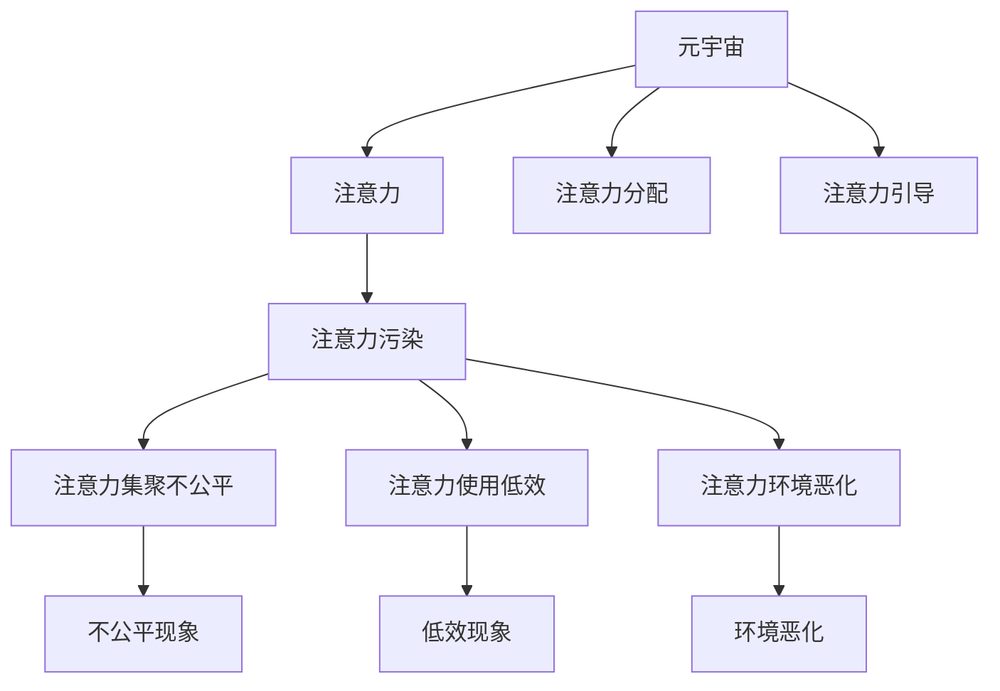

                 

# 注意力污染：元宇宙时代的新型环境问题

## 1. 背景介绍

### 1.1 问题由来

随着互联网技术的飞速发展，我们逐步迈入了元宇宙时代。元宇宙作为一个虚拟现实空间，具有高度沉浸、高度互动和高度自由的特点，其内在机理已远超传统互联网。而在元宇宙的世界里，注意力这一稀缺资源逐渐成为了新的焦点。与现实世界中空气、水资源等物理资源不同，在元宇宙中，注意力这一信息资源具有可再生性、共享性和差异性。

### 1.2 问题核心关键点

元宇宙中注意力资源的分布并不均衡，部分头部主播、明星和网红拥有超乎寻常的注意力集聚能力，由此引发了一系列注意力污染问题。注意力污染指的是注意力资源被滥用或错误引导，导致注意力集聚不公平、注意力使用低效、注意力环境恶化等问题。

注意力污染不仅影响个人及团队的注意分配，更对元宇宙的生态系统构成严重威胁。因此，如何维护元宇宙环境的健康、高效和公平，成为当前亟需解决的问题。

### 1.3 问题研究意义

在元宇宙中，注意力污染问题解决得好坏，直接关系到整个虚拟世界的信息传播、社交互动和文化繁荣。解决注意力污染问题，可以保障元宇宙环境健康、提升信息传播效率、促进经济和文化的可持续发展。

## 2. 核心概念与联系

### 2.1 核心概念概述

为更好地理解元宇宙中的注意力污染问题，本节将介绍几个密切相关的核心概念：

- 元宇宙(Metaverse)：一个高度沉浸、高度互动、高度自由的虚拟现实空间，由一系列可互操作、可扩展的平台构成。
- 注意力(Attention)：指个体在某一信息上投入的时间、精力等资源，是信息传播、社交互动和文化传承的基础。
- 注意力污染(Attention Pollution)：指注意力资源被滥用或错误引导，导致注意力集聚不公平、注意力使用低效、注意力环境恶化等问题。
- 注意力分配(Attention Allocation)：指个体或系统在特定时间内对不同信息的投入比率。
- 注意力引导(Attention Guidance)：指对注意力进行有目的的定向引导，确保其健康、高效地分配。

这些核心概念之间的逻辑关系可以通过以下Mermaid流程图来展示：

这个流程图展示了他

