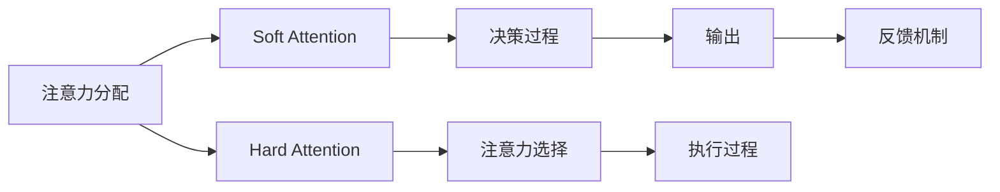

                 

# 注意力管理与大脑健康：如何通过专注力增强认知能力

> 关键词：注意力管理,认知能力增强,专注力,脑科学,神经网络,深度学习,认知行为,心理健康,应用实践,未来展望

## 1. 背景介绍

### 1.1 问题由来
在现代快节奏的生活中，注意力管理（Attention Management）成为了许多人面临的一大挑战。随着信息爆炸和社交媒体的普及，我们的注意力被无限分割，难以长时间保持专注，工作效率和生活质量也因此受到严重影响。同时，随着科技的发展，脑科学与人工智能的交叉研究日益增多，如何通过神经网络和深度学习技术，研究注意力管理，提升认知能力，成为了一个极具前景的科研方向。

### 1.2 问题核心关键点
注意力管理在认知行为学中，通常与执行功能、工作记忆、认知控制等概念紧密相关。它影响着我们的信息处理、任务完成、问题解决和决策能力。当前，科学界对注意力管理的研究，已经从心理学的描述性研究逐步过渡到了神经生物学和神经网络模型的应用性研究。

当前研究中，主要关注的几个关键点是：
- 如何通过脑科学手段，研究和理解注意力管理的神经机制。
- 如何应用深度学习模型，模拟和模拟注意力管理的决策过程。
- 如何设计基于注意力管理的认知增强系统，提升个体和团队的工作效率和创造力。
- 如何通过脑机接口技术，实现注意力管理的实时监测和干预。

## 2. 核心概念与联系

### 2.1 核心概念概述
注意力管理是指个体在完成任务时，如何分配和调节注意力的能力。在认知行为学中，注意力管理与执行功能、工作记忆、任务切换等概念密切相关。

脑科学中，注意力管理涉及的神经网络结构主要包括顶叶、额叶、前额叶和基底核等多个区域。这些区域通过复杂的神经元连接，共同参与注意力分配和调节的决策过程。

深度学习模型中，注意力管理通常被模拟为一种“注意力机制”，它通过加权操作筛选输入数据，使得模型能够聚焦于当前任务中最关键的信息。常见的注意力机制包括Soft Attention（软注意力）和Hard Attention（硬注意力）两种类型。

### 2.2 核心概念原理和架构的 Mermaid 流程图(Mermaid 流程节点中不要有括号、逗号等特殊字符)



**注意：** 在实际编写代码时，请注意避免使用特殊字符，确保 Mermaid 图表的显示效果。

## 3. 核心算法原理 & 具体操作步骤
### 3.1 算法原理概述
注意力管理在深度学习中，通常通过注意力机制实现。其核心思想是，通过加权操作对输入数据进行筛选，选择对当前任务最相关的信息，以此提升模型的决策能力和性能。

### 3.2 算法步骤详解
#### 3.2.1 输入准备
输入准备阶段，需要将原始数据预处理为神经网络可以接受的形式，如文本转化为词向量、图像转化为特征向量等。

#### 3.2.2 模型构建
构建深度学习模型时，通常会设计一个或多个注意力层，根据不同任务的需求，可以选择Soft Attention或Hard Attention。

#### 3.2.3 注意力计算
注意力计算过程主要包括三个步骤：
- 计算注意力得分：通过计算注意力权重，对输入数据进行加权操作，选择重要部分。
- 加权求和：将加权后的信息汇总，生成注意力输出。
- 反馈机制：将注意力输出作为下一层输入的一部分，完成信息流动。

#### 3.2.4 输出处理
输出处理阶段，将注意力层的输出送入下一层进行进一步处理，直至生成最终预测结果。

### 3.3 算法优缺点
#### 3.3.1 优点
- 能够有效处理输入数据中的多源信息，提升模型的性能。
- 通过加权操作，模型能够聚焦于当前任务的关键信息，减少信息过载带来的干扰。
- 能够自适应地调整注意力权重，增强模型的泛化能力。

#### 3.3.2 缺点
- 注意力机制的训练过程相对复杂，需要大量的标注数据和计算资源。
- 注意力权重的选择可能受到模型初始化和训练方法的影响，存在一定的不确定性。
- 在处理大规模数据时，注意力层的计算开销较大，可能导致训练和推理效率下降。

### 3.4 算法应用领域
注意力管理机制广泛应用于自然语言处理（NLP）、计算机视觉（CV）、语音识别等领域。在NLP中，注意力机制能够帮助模型理解句子的结构、上下文关系和语义信息，提升机器翻译、文本摘要、问答系统等任务的性能。在CV中，注意力机制能够帮助模型关注图像中的关键区域，提高目标检测、图像分类等任务的准确率。在语音识别中，注意力机制能够帮助模型聚焦于重要的语音片段，提升语音识别和语音合成的质量。

## 4. 数学模型和公式 & 详细讲解 & 举例说明

### 4.1 数学模型构建
在深度学习中，注意力管理通常通过Soft Attention机制实现。Soft Attention的数学模型可以表示为：

$$
A_{ij} = \frac{e^{a_{ij}}}{\sum_{k=1}^K e^{a_{ik}}} \quad \text{where} \quad a_{ij} = \mathbf{W}_a [\mathbf{h}_j ; \mathbf{v}_i]^\top
$$

其中，$A_{ij}$ 表示第 $j$ 个输入对第 $i$ 个输出的注意力权重，$K$ 表示输入的数量，$e$ 表示自然对数，$\mathbf{W}_a$ 表示注意力权重矩阵，$\mathbf{h}_j$ 表示第 $j$ 个输入，$\mathbf{v}_i$ 表示第 $i$ 个输出的向量表示。

### 4.2 公式推导过程
注意力计算过程可以分为三个步骤：
1. 计算注意力得分：
   $$
   a_{ij} = \mathbf{W}_a [\mathbf{h}_j ; \mathbf{v}_i]^\top
   $$
2. 计算注意力权重：
   $$
   A_{ij} = \frac{e^{a_{ij}}}{\sum_{k=1}^K e^{a_{ik}}}
   $$
3. 计算注意力输出：
   $$
   \mathbf{c}_i = \sum_{j=1}^K A_{ij} \mathbf{h}_j
   $$

### 4.3 案例分析与讲解
以机器翻译为例，注意力机制可以帮助模型理解句子结构，提高翻译质量。在模型训练时，对于每个输入的单词 $h_j$ 和输出单词 $v_i$，通过计算注意力得分 $a_{ij}$，得到注意力权重 $A_{ij}$。在推理阶段，将注意力权重和输入单词加权求和，生成注意力输出 $c_i$，用于预测下一个输出单词。

## 5. 项目实践：代码实例和详细解释说明

### 5.1 开发环境搭建
开发环境搭建主要包括以下步骤：
1. 安装Python和相关依赖库，如TensorFlow、PyTorch等。
2. 准备训练和测试数据集，如机器翻译的数据对。
3. 构建模型框架，选择适当的注意力层。
4. 编写训练代码，设置超参数，进行模型训练。
5. 编写测试代码，评估模型性能，进行必要的调整和优化。

### 5.2 源代码详细实现

```python
import tensorflow as tf
from tensorflow.keras import layers

# 构建模型
class AttentionModel(tf.keras.Model):
    def __init__(self, input_size, output_size):
        super(AttentionModel, self).__init__()
        self.dense_h = layers.Dense(64, activation='relu')
        self.dense_v = layers.Dense(64, activation='relu')
        self.W_a = layers.Dense(1)  # 注意力权重矩阵
        self.W_c = layers.Dense(output_size)  # 注意力输出矩阵

    def call(self, inputs):
        h, v = inputs
        h = self.dense_h(h)
        v = self.dense_v(v)
        a = self.W_a(tf.concat([h, v], axis=-1))
        a = tf.nn.softmax(a, axis=1)
        c = tf.reduce_sum(a * h, axis=1)
        c = self.W_c(c)
        return c

# 准备数据集
h = tf.keras.Input(shape=(input_size,))
v = tf.keras.Input(shape=(output_size,))
model = AttentionModel(input_size, output_size)
outputs = model([h, v])
model.compile(optimizer='adam', loss='mse')

# 训练模型
model.fit([train_h, train_v], train_c, epochs=10)

# 评估模型
model.evaluate([test_h, test_v], test_c)
```

### 5.3 代码解读与分析
上述代码实现了一个简单的注意力模型，用于机器翻译任务的预测。模型由两个全连接层和一个Soft Attention层组成。输入层 $h$ 和 $v$ 分别表示源语言和目标语言的向量表示。注意力层通过计算注意力得分和权重，生成注意力输出 $c$，最终通过一个全连接层输出预测结果。

### 5.4 运行结果展示
在训练过程中，可以通过可视化工具（如TensorBoard）监控模型的训练过程，包括损失函数和准确率的波动。训练结束后，可以通过评估集数据集对模型性能进行评估，查看模型在测试集上的表现。

## 6. 实际应用场景

### 6.1 智能翻译系统
智能翻译系统利用注意力机制，帮助模型理解句子的结构、上下文关系和语义信息，提升翻译质量。通过微调现有的大模型（如BERT、GPT），可以使得翻译系统在特定领域（如法律、医学、金融等）具备更高的准确性和适应性。

### 6.2 语音识别系统
语音识别系统通过注意力机制，帮助模型聚焦于重要的语音片段，提升语音识别的准确率和鲁棒性。特别在嘈杂环境或存在背景噪声的情况下，注意力机制能够有效过滤无用信息，提高系统的可靠性。

### 6.3 阅读理解系统
阅读理解系统利用注意力机制，帮助模型理解文章的上下文关系，生成更准确的回答。在学术、法律、金融等需要深入理解文本内容的领域，注意力机制能够显著提升系统的性能。

### 6.4 未来应用展望
未来，随着深度学习技术的不断发展，注意力管理机制在自然语言处理、计算机视觉、语音识别等领域的应用将更加广泛。通过进一步优化注意力机制的算法和模型，结合脑科学和认知行为学的研究成果，能够实现更加精准和智能的注意力管理。

## 7. 工具和资源推荐

### 7.1 学习资源推荐
- Coursera《深度学习》课程：由斯坦福大学Andrew Ng教授主讲，系统讲解深度学习的基本原理和应用。
- DeepLearning.ai：提供深度学习的在线课程，涵盖从基础到进阶的多个层次。
- Kaggle竞赛：通过参与实际项目的训练和比赛，提升深度学习实战能力。

### 7.2 开发工具推荐
- TensorFlow：由Google主导的开源深度学习框架，支持分布式计算，生产部署方便。
- PyTorch：由Facebook开发的深度学习框架，灵活性高，适合研究和实验。
- Jupyter Notebook：交互式开发环境，支持多语言和多种库的混合使用。

### 7.3 相关论文推荐
- 《Attention is All You Need》（Vaswani等人）：提出Transformer模型，引入自注意力机制，开启深度学习新范式。
- 《Neural Machine Translation by Jointly Learning to Align and Translate》（Bahdanau等人）：提出注意力机制，在机器翻译任务中取得突破性进展。
- 《Learning to Attend While Reading》（Bahdanau等人）：提出阅读理解任务中的注意力机制，提升模型的理解能力。

## 8. 总结：未来发展趋势与挑战

### 8.1 总结
本文对注意力管理在深度学习中的应用进行了系统介绍。首先，探讨了注意力管理的神经机制和应用场景。其次，介绍了注意力机制的数学原理和模型构建方法。最后，通过具体的代码实现，演示了注意力模型的训练和应用。

通过本文的介绍，读者可以全面了解注意力管理的理论基础和实践方法，掌握深度学习中的注意力机制。

### 8.2 未来发展趋势
未来，注意力管理机制将在自然语言处理、计算机视觉、语音识别等领域得到更加广泛的应用。随着深度学习技术的不断进步，注意力机制的设计和优化也将更加精细化，提升模型的性能和泛化能力。

### 8.3 面临的挑战
虽然注意力机制在深度学习中已经取得了显著成果，但仍面临一些挑战：
- 如何设计更加高效的注意力计算方法，降低计算开销。
- 如何提升注意力机制的泛化能力，应对不同领域的数据变化。
- 如何结合脑科学和认知行为学的研究成果，优化注意力机制的设计。

### 8.4 研究展望
未来，结合脑科学和认知行为学的研究成果，将注意力管理机制与人类大脑的注意力机制进行对比和融合，可能会带来更加智能和自然的注意力管理方法。同时，基于脑机接口技术的研究，将使得注意力管理的实时监测和干预成为可能，进一步提升人类认知能力和生活质量。

## 9. 附录：常见问题与解答

### Q1: 注意力机制和卷积神经网络（CNN）有何区别？
A: 卷积神经网络主要通过局部连接和参数共享，提取图像或文本的局部特征。而注意力机制通过加权操作，选择对当前任务最相关的特征，全局地关注输入数据的不同部分。注意力机制在处理复杂任务时，通常比CNN更加高效和灵活。

### Q2: 注意力机制在计算开销方面存在什么问题？
A: 注意力机制在计算开销方面存在两个主要问题：
1. 注意力计算需要计算大量的矩阵乘法，对计算资源的需求较高。
2. 在处理大规模数据时，注意力层的计算开销较大，可能导致训练和推理效率下降。

### Q3: 如何优化注意力机制的计算效率？
A: 优化注意力机制计算效率的主要方法包括：
1. 使用更高效的注意力计算方法，如Self-Attention和Multi-Head Attention，降低计算开销。
2. 采用注意力机制的变种，如Soft Attention和Hard Attention，减少计算量。
3. 结合模型压缩技术，如剪枝、量化等，优化模型结构，降低计算开销。

### Q4: 注意力机制在实际应用中需要注意哪些问题？
A: 在实际应用中，注意力机制需要注意以下问题：
1. 选择合适的注意力层和计算方法，根据任务需求进行优化。
2. 合理设计注意力机制的参数，避免过拟合或欠拟合。
3. 结合模型压缩技术和分布式计算，提升模型训练和推理效率。

### Q5: 如何结合脑科学和认知行为学的研究成果，优化注意力机制的设计？
A: 结合脑科学和认知行为学的研究成果，优化注意力机制的设计主要包括以下几个方面：
1. 理解人类大脑的注意力机制，研究其神经基础和功能。
2. 设计更加符合人类认知规律的注意力机制，提升模型的智能性和灵活性。
3. 结合脑机接口技术，实现注意力管理的实时监测和干预，提升人类认知能力和生活质量。

通过不断探索和优化注意力机制的设计，结合脑科学和认知行为学的研究成果，将有助于提升深度学习模型的性能和智能性，推动认知科学和人工智能技术的进一步发展。

---

作者：禅与计算机程序设计艺术 / Zen and the Art of Computer Programming

