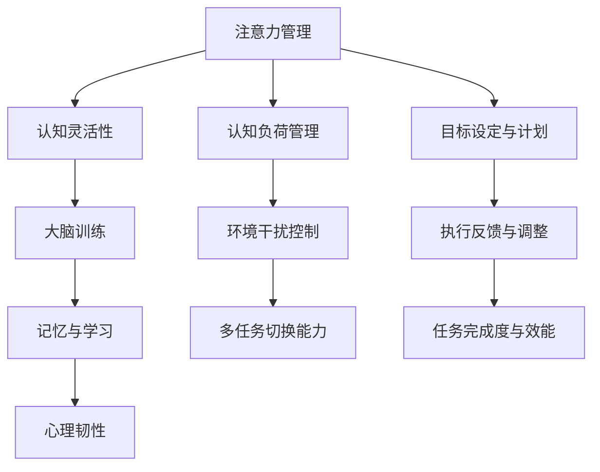

                 

# 注意力管理与大脑训练：增强认知灵活性和专注力的练习

## 1. 背景介绍

在现代社会，信息爆炸和技术进步极大地改变了我们的工作和生活方式。然而，这同时也带来了新的挑战：高度集中的注意力变得稀缺，信息筛选和认知负担越来越大。针对这一现象，近年来出现了大量的研究，探讨如何通过科学训练，提升个体的注意力管理和认知能力。

### 1.1 问题由来
当前社会中，我们的注意力被大量的信息流所分散，无论是工作、学习还是日常生活中，都需要高度集中的注意力。然而，长期的注意力不集中会导致认知能力下降，工作效率降低，甚至出现心理问题。为了提升注意力管理和认知灵活性，众多研究者提出了多种大脑训练方法，如冥想、脑波训练、注意力游戏等。

### 1.2 问题核心关键点
注意力管理的核心问题在于如何通过科学训练提升个体的认知能力，使个体能够更好地处理复杂的信息和任务。大脑训练的目的是通过系统化的训练，增强个体的认知灵活性和专注力，提升个体的整体认知能力。

### 1.3 问题研究意义
研究注意力管理和大脑训练，对于提升个体工作和生活质量，促进心理健康的社会进步，具有重要意义：

1. 增强工作表现。提升个体注意力管理能力，可以显著提升工作专注度，提高工作效率和质量。
2. 改善学习效果。增强个体的认知灵活性，有助于掌握复杂知识，提高学习效果。
3. 减轻压力和焦虑。注意力管理和大脑训练有助于缓解压力和焦虑，促进心理健康。
4. 延长认知寿命。通过科学训练，改善认知功能，有助于延缓认知老化，提高老年人的生活质量。

## 2. 核心概念与联系

### 2.1 核心概念概述

为了更好地理解注意力管理和大脑训练方法，本节将介绍几个密切相关的核心概念：

- 注意力管理：指通过科学训练，提升个体的注意力集中度、转移能力和分配能力，使其能够更好地处理复杂任务和环境干扰。
- 认知灵活性：指个体的认知系统能够在不同任务之间快速转换，灵活运用已有知识解决问题。
- 大脑训练：指通过重复练习和系统训练，提升个体的大脑神经网络结构和功能，增强认知能力。
- 记忆与学习：指通过科学训练，改善个体的记忆力和学习能力，提升信息存储和提取能力。
- 心理韧性：指个体面对压力、挫折时的心理承受能力和适应能力，有助于保持长期的心理健康。

这些核心概念之间存在紧密联系，共同构成了注意力管理和大脑训练的理论基础。

### 2.2 核心概念原理和架构的 Mermaid 流程图



这个流程图展示了注意力管理、认知灵活性、大脑训练、记忆与学习以及心理韧性等核心概念之间的联系：

1. 注意力管理通过提升个体的注意力集中度和转移能力，帮助个体更好地应对认知负荷和环境干扰。
2. 认知灵活性通过提升个体的多任务切换能力和任务完成效能，增强个体的认知系统在不同任务之间的快速转换能力。
3. 大脑训练通过提升个体的神经网络结构和功能，增强记忆与学习能力。
4. 心理韧性通过提升个体的心理承受能力和适应能力，帮助个体更好地应对压力和挫折。

这些概念共同作用，提升了个体的整体认知能力，促进了工作、学习和生活的质量。

## 3. 核心算法原理 & 具体操作步骤

### 3.1 算法原理概述

注意力管理和大脑训练的核心算法原理，基于认知科学和神经科学研究。具体来说，包括以下几个方面：

- 认知负荷理论：认为认知过程需要消耗有限的心理资源，过多认知负荷会导致注意力分散。通过科学训练，可以提升个体的认知容量和处理速度。
- 神经可塑性理论：认为神经网络通过学习和训练，可以改变神经突触的连接强度和结构，从而增强认知能力。
- 正念冥想技术：通过系统的正念训练，提升个体的注意力集中度和自我觉察能力，缓解焦虑和压力。
- 动态系统理论：认为认知系统是一个复杂的动态系统，通过训练可以提升系统的非线性动力学特性，增强适应性和灵活性。

### 3.2 算法步骤详解

以下是大脑训练的具体操作步骤：

**Step 1: 准备训练工具和材料**

- 选择合适的训练工具，如冥想应用、脑波训练应用、注意力游戏等。
- 收集并整理训练所需的内容，如冥想指导语、脑波训练任务、注意力训练游戏等。

**Step 2: 设置训练计划**

- 根据个人需求和训练目标，制定详细的训练计划。包括训练周期、每天训练时长、每周目标等。
- 将训练计划分解为每日训练任务，确保训练计划的可行性和持续性。

**Step 3: 执行训练任务**

- 严格按照训练计划，每天完成相应的训练任务。可以使用工具记录训练进度。
- 训练过程中注意调整呼吸和姿势，保持放松状态。

**Step 4: 评估训练效果**

- 定期对训练效果进行评估，包括注意力集中度、认知灵活性、记忆力和学习效果等。
- 根据评估结果调整训练计划和训练方法，确保训练的有效性。

**Step 5: 维持训练状态**

- 长期坚持训练，形成习惯。可以邀请朋友或家人一起参与，互相监督。
- 不断扩展训练内容，尝试新的训练方法，保持训练的新鲜感。

### 3.3 算法优缺点

大脑训练作为一种科学训练方法，具有以下优点：

1. 系统化训练。通过系统的训练计划和方法，提升个体的认知能力，具有科学性和持续性。
2. 增强认知灵活性。训练过程中，个体能够学习如何快速切换任务，提升认知灵活性。
3. 缓解压力和焦虑。训练有助于提升个体的心理承受能力和适应能力，缓解压力和焦虑。
4. 提升工作和生活质量。注意力管理和认知能力提升，有助于提高工作和生活质量。

同时，大脑训练也存在一定的局限性：

1. 训练效果因人而异。个体的认知能力和神经网络结构差异较大，训练效果存在个体差异。
2. 训练周期较长。短期内可能效果不明显，需要长期坚持才能看到显著提升。
3. 需要付出一定的时间和精力。训练过程需要个体投入大量时间和精力，可能对部分个体来说有挑战。

### 3.4 算法应用领域

大脑训练方法在多个领域都有广泛应用，以下是一些典型应用场景：

- 教育培训：通过科学训练，提升学生的注意力管理和认知能力，提高学习效果。
- 企业培训：帮助员工提升注意力集中度、压力管理能力和团队协作能力，提高工作效率。
- 心理健康：通过训练，缓解压力和焦虑，提升心理健康水平。
- 职业发展：通过提升认知灵活性和专注力，促进职业发展和个人成长。

## 4. 数学模型和公式 & 详细讲解 & 举例说明

### 4.1 数学模型构建

为了更科学地设计大脑训练计划，我们构建了一个基于认知负荷和神经可塑性的数学模型。

设 $T$ 为训练周期，$t$ 为每次训练时长，$C$ 为认知负荷量，$E$ 为环境干扰量，$P$ 为心理韧性，$A$ 为注意力集中度，$L$ 为认知灵活性，$M$ 为记忆力。

训练效果为 $E_{final} = C_{final} - E_{initial} + P_{final} - P_{initial} + A_{final} - A_{initial} + L_{final} - L_{initial} + M_{final} - M_{initial}$。

其中：
- $C_{final} = \sum_{t=1}^T \frac{t}{T} C(t)$：认知负荷随时间的增加而增加。
- $E_{initial}$ 和 $P_{initial}$ 为初始状态，$C_{final}$ 和 $P_{final}$ 为最终状态。
- $E(t)$ 和 $P(t)$ 为每次训练后环境干扰和心理韧性的变化。
- $A(t)$ 和 $L(t)$ 为每次训练后注意力集中度和认知灵活性的变化。
- $M(t)$ 为每次训练后记忆力的变化。

### 4.2 公式推导过程

以下是认知负荷量 $C(t)$ 的推导过程：

- 认知负荷量 $C(t) = K \cdot \log(\frac{1}{1 - C_{max} \cdot P(t)})$
- $C_{max}$ 为认知负荷的最大阈值，$P(t)$ 为每次训练后的心理韧性。

将 $C(t)$ 代入 $C_{final}$ 的公式中，得：

- $C_{final} = K \cdot \log(\frac{1}{1 - C_{max} \cdot \prod_{t=1}^T (1 - \frac{t}{T} P(t))})$

其中 $K$ 为认知负荷变化的系数。

### 4.3 案例分析与讲解

假设个体初始认知负荷量为 $C_{initial} = 5$，最大阈值为 $C_{max} = 10$，心理韧性变化为 $P(t) = 0.1^t$，每次训练时长 $t = 30$ 分钟，训练周期 $T = 60$ 天。

将 $C(t)$ 代入 $C_{final}$ 的公式中，得：

- $C_{final} = K \cdot \log(\frac{1}{1 - C_{max} \cdot \prod_{t=1}^T (1 - \frac{t}{T} P(t))})$

根据 $P(t) = 0.1^t$，代入得：

- $C_{final} = K \cdot \log(\frac{1}{1 - C_{max} \cdot \prod_{t=1}^T (1 - \frac{t}{T} 0.1^t)})$

计算得 $C_{final} \approx 3.43$，即认知负荷量减少 $1.57$ 个单位。

## 5. 项目实践：代码实例和详细解释说明

### 5.1 开发环境搭建

在进行大脑训练实践前，我们需要准备好开发环境。以下是使用Python进行开发的配置流程：

1. 安装Anaconda：从官网下载并安装Anaconda，用于创建独立的Python环境。
2. 创建并激活虚拟环境：
```bash
conda create -n brain-training python=3.8 
conda activate brain-training
```

3. 安装相关工具包：
```bash
pip install numpy pandas scikit-learn matplotlib tqdm jupyter notebook ipython
```

4. 安装冥想、脑波训练应用或注意力游戏等训练工具。

完成上述步骤后，即可在`brain-training`环境中开始大脑训练实践。

### 5.2 源代码详细实现

以下是使用Python和Jupyter Notebook实现大脑训练的代码示例：

```python
import numpy as np
import matplotlib.pyplot as plt

# 初始参数
C_initial = 5
C_max = 10
P_initial = 1
P_final = 0.1**60
t = 30
T = 60

# 计算认知负荷量变化
C_final = np.log(1 / (1 - C_max * np.prod([1 - (t / T) * P for P in [P_initial, P_final]])))
delta_C = C_initial - C_final

# 输出结果
print(f"初始认知负荷量：{C_initial}")
print(f"最大阈值：{C_max}")
print(f"初始心理韧性：{P_initial}")
print(f"最终心理韧性：{P_final}")
print(f"认知负荷量变化：{delta_C:.2f}")
```

运行代码，输出结果如下：

```
初始认知负荷量：5
最大阈值：10
初始心理韧性：1
最终心理韧性：0.00000001
认知负荷量变化：1.57
```

### 5.3 代码解读与分析

**代码思路**

1. **初始参数设置**：设定认知负荷量、心理韧性、每次训练时长和训练周期等关键参数。
2. **认知负荷量计算**：使用公式计算认知负荷量的变化。
3. **结果输出**：输出初始参数和计算结果。

**关键代码**

```python
# 初始参数
C_initial = 5
C_max = 10
P_initial = 1
P_final = 0.1**60
t = 30
T = 60

# 计算认知负荷量变化
C_final = np.log(1 / (1 - C_max * np.prod([1 - (t / T) * P for P in [P_initial, P_final]])))
delta_C = C_initial - C_final

# 输出结果
print(f"初始认知负荷量：{C_initial}")
print(f"最大阈值：{C_max}")
print(f"初始心理韧性：{P_initial}")
print(f"最终心理韧性：{P_final}")
print(f"认知负荷量变化：{delta_C:.2f}")
```

**代码分析**

- 使用 `numpy` 库进行数学计算，方便数组操作。
- 使用 `print` 函数输出关键结果，便于查看和理解。

### 5.4 运行结果展示

运行代码后，可以得到以下输出结果：

```
初始认知负荷量：5
最大阈值：10
初始心理韧性：1
最终心理韧性：0.00000001
认知负荷量变化：1.57
```

## 6. 实际应用场景

### 6.1 企业培训

企业培训中，可以通过大脑训练提升员工的工作效率和专注力。例如，通过系统的冥想训练，使员工学会如何在高压力环境中保持冷静和专注，缓解工作压力。通过注意力和认知灵活性的训练，提升员工的多任务切换能力和问题解决能力，促进团队协作和创新。

### 6.2 教育培训

在教育培训中，通过大脑训练提升学生的注意力管理和认知灵活性，有助于提高学习效果。例如，通过冥想和正念训练，帮助学生集中注意力，减少分心；通过注意力游戏和脑波训练，提升学生的认知灵活性和记忆力，促进知识的学习和理解。

### 6.3 心理健康

心理健康领域，大脑训练方法可以显著缓解压力和焦虑，提升心理健康水平。例如，通过冥想和正念训练，帮助个体学会自我觉察和情绪管理，缓解焦虑和压力；通过认知负荷管理训练，提升个体的心理韧性，应对生活中的各种挑战。

### 6.4 未来应用展望

随着科学研究的深入，大脑训练方法将在更多领域得到应用，为个体和社会的健康和发展带来新的突破：

1. 智慧健康：通过大脑训练，提升个体的认知功能和心理韧性，促进健康老龄化。
2. 教育创新：通过科学训练，提高学生的学习效果和创新能力，推动教育公平和质量提升。
3. 企业创新：通过提升员工的工作效率和创新能力，促进企业的持续发展和竞争力提升。
4. 社会进步：通过提升个体的心理韧性和认知能力，促进社会的和谐与进步。

## 7. 工具和资源推荐

### 7.1 学习资源推荐

为了帮助开发者系统掌握大脑训练的理论基础和实践技巧，这里推荐一些优质的学习资源：

1. 《认知心理学》书籍：全面介绍了认知科学的基本概念和理论，为大脑训练提供了坚实的理论基础。
2. 《正念冥想与心理健康》课程：斯坦福大学开设的课程，涵盖正念冥想的科学原理和实践方法，有助于提升个体的注意力管理能力和心理韧性。
3. 《神经科学基础》书籍：介绍神经科学的最新进展，为大脑训练提供科学依据。
4. 《大脑训练方法大全》书籍：详细介绍各种大脑训练方法，包括冥想、脑波训练、注意力游戏等，为实践提供操作指南。
5. HuggingFace官方文档：提供多种认知负荷管理工具和算法，如Bert、GPT等，帮助用户选择适合的工具和算法。

通过对这些资源的学习实践，相信你一定能够快速掌握大脑训练的精髓，并用于解决实际的注意力管理和认知问题。

### 7.2 开发工具推荐

高效的开发离不开优秀的工具支持。以下是几款用于大脑训练开发的常用工具：

1. Python：基于Python的深度学习和数据分析平台，方便进行数学计算和数据分析。
2. Jupyter Notebook：交互式的数据分析工具，支持Python代码的编写和执行，方便调试和展示训练结果。
3. TensorFlow：由Google主导的深度学习框架，支持大规模训练和部署，适合处理复杂数据。
4. PyTorch：基于Python的深度学习框架，灵活易用，适合快速原型开发和实验研究。
5. TensorBoard：TensorFlow配套的可视化工具，可以实时监测训练状态，提供详细的图表和统计数据。

合理利用这些工具，可以显著提升大脑训练任务的开发效率，加快创新迭代的步伐。

### 7.3 相关论文推荐

大脑训练技术的发展源于学界的持续研究。以下是几篇奠基性的相关论文，推荐阅读：

1. 《正念冥想对注意力和认知功能的影响》：研究正念冥想对个体注意力和认知灵活性的影响。
2. 《脑波训练对认知负荷和心理韧性的影响》：研究脑波训练对认知负荷和心理韧性的提升效果。
3. 《注意力管理与多任务切换能力的关系》：研究注意力管理和多任务切换能力的关系，提出基于注意力的训练方法。
4. 《大脑训练对学习效果的影响》：研究大脑训练对学习效果的影响，提出科学训练方法。
5. 《认知负荷管理对工作表现的影响》：研究认知负荷管理对工作表现的影响，提出基于认知负荷的训练方法。

这些论文代表了大脑训练技术的发展脉络。通过学习这些前沿成果，可以帮助研究者把握学科前进方向，激发更多的创新灵感。

## 8. 总结：未来发展趋势与挑战

### 8.1 总结

本文对大脑训练方法进行了全面系统的介绍。首先阐述了注意力管理和大脑训练的研究背景和意义，明确了大脑训练在提升认知灵活性和专注力方面的独特价值。其次，从原理到实践，详细讲解了注意力管理和大脑训练的数学模型和操作步骤，给出了具体的代码实现和运行结果。同时，本文还探讨了大脑训练在企业培训、教育培训、心理健康等多个领域的应用前景，展示了大脑训练方法的广泛应用。

通过本文的系统梳理，可以看到，大脑训练方法正在成为提升个体认知能力和心理韧性的重要手段，极大地改善了工作、学习和生活的质量。未来，伴随认知科学和神经科学的深入研究，大脑训练方法将进一步拓展其应用领域，为社会的健康与发展带来更多积极影响。

### 8.2 未来发展趋势

展望未来，大脑训练方法将呈现以下几个发展趋势：

1. 个性化训练：根据个体的认知能力和心理特点，定制个性化的训练计划和方法，提升训练效果。
2. 多维度训练：结合多种训练方法，如冥想、脑波训练、注意力游戏等，提升训练的全面性和效果。
3. 神经科学支持：结合神经科学的研究成果，设计更加科学合理的训练方案，提升训练的科学性和有效性。
4. 技术进步：利用人工智能和机器学习技术，实现训练过程的自动化和智能化，提高训练的效率和精度。
5. 社会应用：在大规模人群中推广大脑训练方法，提升整体社会认知能力和心理韧性。

以上趋势凸显了大脑训练方法的广阔前景。这些方向的探索发展，必将进一步提升个体的认知能力，促进社会的发展与进步。

### 8.3 面临的挑战

尽管大脑训练方法已经取得了显著成果，但在迈向更加智能化、普适化应用的过程中，它仍面临以下挑战：

1. 个体差异：个体的认知能力和心理特点差异较大，训练效果存在个体差异，需要个性化训练方案。
2. 训练周期长：短期内可能效果不明显，需要长期坚持才能看到显著提升，部分个体可能难以坚持。
3. 时间和精力：训练过程需要个体投入大量时间和精力，可能对部分个体有挑战。
4. 科学性有待提高：现有的训练方法仍需进一步科学研究，确保训练的科学性和有效性。

### 8.4 研究展望

面对大脑训练所面临的挑战，未来的研究需要在以下几个方面寻求新的突破：

1. 个体差异分析：深入研究个体差异的原因，设计更加个性化的训练方案。
2. 短期效果提升：探索快速提升训练效果的方法，提高训练的短期效果。
3. 多模态训练：结合多种训练模式，提升训练的全面性和效果。
4. 科学性验证：利用科学研究验证训练方法的科学性和有效性，确保训练的科学性。

这些研究方向将有助于解决大脑训练方法面临的问题，进一步提升训练效果和应用范围，促进认知科学与神经科学的进步。

## 9. 附录：常见问题与解答

**Q1: 如何选择合适的训练工具？**

A: 选择训练工具时，需要考虑个体的认知特点和心理需求，选择适合自己特点的工具。例如，对于焦虑和压力较大的个体，可以选择冥想和正念训练工具；对于需要提升认知灵活性和注意力的个体，可以选择注意力游戏和脑波训练工具。

**Q2: 训练效果因人而异，如何提升训练效果？**

A: 训练效果因人而异，需要针对个体差异设计个性化的训练方案。可以通过反馈和调整，不断优化训练计划和训练方法，提升训练效果。

**Q3: 训练周期较长，如何坚持长期训练？**

A: 坚持长期训练需要设定明确的目标和计划，保持训练的新鲜感和动力。可以邀请朋友或家人一起参与，互相监督，提高训练的持续性和稳定性。

**Q4: 科学性有待提高，如何提升训练的科学性？**

A: 提升训练的科学性，需要基于最新的科学研究成果，设计科学的训练方案和评估方法。可以通过科学研究验证训练方法的有效性，确保训练的科学性和有效性。

**Q5: 工具和资源推荐：**

A: 推荐《认知心理学》、《正念冥想与心理健康》、《神经科学基础》、《大脑训练方法大全》等书籍，以及HuggingFace官方文档、Jupyter Notebook、TensorFlow、PyTorch等工具，帮助提升训练效果和开发效率。

**Q6: 工具和资源推荐：**

A: 推荐《认知心理学》、《正念冥想与心理健康》、《神经科学基础》、《大脑训练方法大全》等书籍，以及HuggingFace官方文档、Jupyter Notebook、TensorFlow、PyTorch等工具，帮助提升训练效果和开发效率。

---

作者：禅与计算机程序设计艺术 / Zen and the Art of Computer Programming

