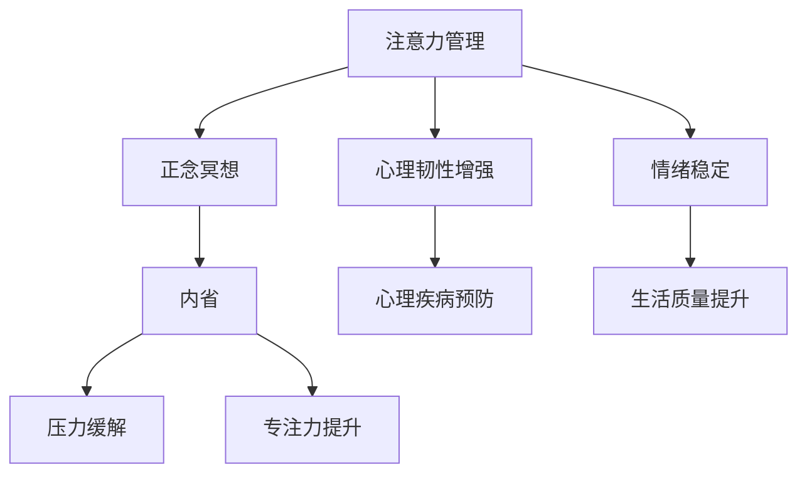

                 

# 注意力管理与正念冥想实践：通过内省增强专注力和心灵平和

> 关键词：注意力管理,正念冥想,专注力,心灵平和,内省,压力缓解

## 1. 背景介绍

### 1.1 问题由来
在现代快节奏的生活中，人们面临着来自工作和生活的多重压力。长期的高强度工作、信息过载、社交媒体的过度依赖，使许多人的注意力和心理健康受到影响。尤其在IT行业中，工作节奏快、竞争激烈，许多专业人士承受着巨大的心理和生理负担。如何在忙碌的生活中保持高效专注、放松心情、提升心理健康，成为一种迫切需求。

### 1.2 问题核心关键点
注意力管理（Attention Management）和正念冥想（Mindfulness Meditation）是缓解心理压力、提升专注力的有效方法。注意力管理旨在通过各种技巧和工具，帮助人们更好地集中注意力，减少分心，提升工作效率和生产力。正念冥想则是一种通过内省（Introspection）和冥想（Meditation）来提升心理韧性和情绪调节能力的技术。两者结合使用，可以全面提升人们的心理和生理健康。

## 2. 核心概念与联系

### 2.1 核心概念概述

为更好地理解注意力管理与正念冥想的融合应用，本节将介绍几个密切相关的核心概念：

- 注意力管理（Attention Management）：指通过各种技巧和工具，提升对注意力的控制力，减少分心，提高专注度和工作效率。注意力管理涵盖广泛，包括工作技巧、时间管理、情绪调节等。
- 正念冥想（Mindfulness Meditation）：一种通过内省、冥想等技术，提升对当前时刻的感知能力，增强情绪稳定性和心理韧性的心理训练方法。正念冥想常用于缓解焦虑、抑郁、压力等心理健康问题。
- 内省（Introspection）：指通过反思、自我观察，深入了解自己的思维模式、情绪状态和行为习惯，从而找到提升生活质量的策略。
- 压力缓解（Stress Relief）：通过调节工作节奏、改善生活方式、进行心理干预等手段，减轻心理和生理上的压力负担，提升整体健康水平。
- 专注力（Focus）：指在特定时间内，能够全神贯注于某项任务，不受外界干扰的能力。专注力直接影响工作效率和创新能力。
- 心理健康（Mental Health）：指一个人的心理状态和情绪平衡状况，包括自我认知、情绪调节、社会适应等多个方面。

这些核心概念之间的逻辑关系可以通过以下Mermaid流程图来展示：



这个流程图展示了几者之间的内在联系：

1. 注意力管理通过各种技巧提升专注力，减少分心。
2. 正念冥想通过内省提升情绪稳定性和心理韧性。
3. 内省帮助个体深入了解自我，找到提升生活质量的策略。
4. 压力缓解通过调节工作和生活方式，减轻心理负担。
5. 专注力和心理健康相互促进，共同提升整体生活质量。

这些概念共同构成了注意力管理和正念冥想的方法论框架，通过多层次、多维度的心理干预，全面提升人们的心理和生理健康。

## 3. 核心算法原理 & 具体操作步骤

### 3.1 算法原理概述

注意力管理与正念冥想的融合应用，本质上是一个通过多种心理干预技术提升心理韧性和工作效率的复杂过程。其核心思想是：通过系统的注意力管理和正念冥想训练，逐步提升个体对注意力的控制力，增强情绪稳定性，从而实现更好的工作表现和生活质量。

形式化地，假设个体初始状态为 $S_0$，注意力管理与正念冥想的总目标为 $S_T$，其中 $S_T$ 表示理想的心理状态，如高专注力、情绪稳定、心理韧性等。注意力管理的算法步骤如下：

1. **初始化**：评估当前的心理状态 $S_0$，找到注意力和情绪管理上的不足点。
2. **注意力管理**：引入注意力管理的技巧和工具，提升个体对注意力的控制力。
3. **正念冥想**：进行正念冥想的训练，通过内省提升情绪稳定性和心理韧性。
4. **反馈调整**：不断评估个体心理状态的变化，根据评估结果调整注意力管理和正念冥想的方法和强度。
5. **持续优化**：不断迭代以上步骤，直至达到理想的心理状态 $S_T$。

正念冥想的算法步骤如下：

1. **坐定**：选择一个安静的环境，坐直，保持舒适的姿势。
2. **呼吸冥想**：集中注意力于呼吸，感受每一次吸气和呼气。
3. **注意力转移**：当注意力漂移时，温和地将注意力拉回呼吸上。
4. **内省**：在冥想过程中，反思自己的思维模式、情绪状态和行为习惯，增强自我觉察。
5. **结束冥想**：逐渐退出冥想状态，感受身体的放松和心情的平静。

### 3.2 算法步骤详解

#### 注意力管理的详细步骤：

**Step 1: 评估初始状态**
- 使用注意力管理问卷（如SMART问卷）评估当前的心理状态和注意力水平。
- 记录每天的工作效率、分心次数、情绪波动等数据。

**Step 2: 制定计划**
- 根据评估结果，制定具体的注意力管理计划。
- 确定需要改进的注意力管理技巧，如时间管理、任务优先级、环境优化等。

**Step 3: 实施技巧**
- 引入具体注意力管理技巧，如番茄工作法、时间块、任务分解等。
- 使用工具和应用程序，如Trello、Todoist、RescueTime等，辅助执行计划。

**Step 4: 持续评估和调整**
- 每周进行一次自我评估，记录技巧实施的效果。
- 根据评估结果调整注意力管理技巧和工具的使用。

#### 正念冥想的详细步骤：

**Step 1: 找到合适的冥想时间**
- 选择一个相对固定的时间段，每天进行冥想。
- 确保冥想环境安静、舒适，减少干扰。

**Step 2: 选择合适的冥想形式**
- 可以选择坐姿冥想、行走冥想、睡眠冥想等形式。
- 初学者可以从坐姿冥想开始，逐步尝试其他形式。

**Step 3: 坐定和呼吸冥想**
- 在坐定后，集中注意力于呼吸，感受每一次吸气和呼气。
- 当注意力漂移时，温和地将注意力拉回呼吸上。

**Step 4: 内省和情绪调节**
- 在冥想过程中，反思自己的思维模式、情绪状态和行为习惯。
- 使用正念冥想的技巧，如接受、不评判、观察，提升情绪稳定性。

**Step 5: 结束冥想**
- 逐渐退出冥想状态，感受身体的放松和心情的平静。
- 记录每次冥想的感受和体验，逐步调整冥想方法和强度。

### 3.3 算法优缺点

注意力管理与正念冥想融合应用的优点：
1. 系统性：通过系统的注意力管理和正念冥想训练，逐步提升个体对注意力的控制力和情绪稳定性。
2. 综合性：综合运用多种心理干预技巧，全面提升个体的心理韧性和工作效率。
3. 可操作性：通过工具和应用程序，方便执行注意力管理计划和正念冥想练习。
4. 可持续性：通过持续评估和调整，确保注意力管理和正念冥想的长期效果。

同时，该方法也存在一定的局限性：
1. 时间成本：需要投入一定的时间进行系统训练，初学者可能需要一段时间才能看到效果。
2. 个体差异：不同个体对注意力管理技巧和正念冥想的反应不同，需要根据个体差异进行调整。
3. 环境要求：冥想训练需要相对安静、舒适的环境，对部分人群可能较难实现。
4. 即时效果：注意力管理和正念冥想的效果通常较慢，短期内可能无法显著提升工作效率。

尽管存在这些局限性，但就目前而言，注意力管理与正念冥想融合应用仍是一种较为全面和系统的方法，广泛适用于各行各业的工作者。

### 3.4 算法应用领域

注意力管理与正念冥想的融合应用，在各个领域都有广泛的应用，例如：

- **IT行业**：面对高强度工作和高信息过载，许多IT专业人士通过注意力管理提升专注力和工作效率，通过正念冥想缓解压力，提升心理韧性。
- **医疗健康**：正念冥想被广泛应用于心理治疗和心理咨询，帮助患者缓解焦虑、抑郁等情绪问题。
- **教育领域**：学生通过注意力管理提升课堂专注力，通过正念冥想放松心情，增强学习效果。
- **企业管理**：企业通过推广注意力管理和正念冥想，提升员工的工作满意度和心理韧性，促进团队协作和创新。
- **个人成长**：个人通过系统训练，提升对注意力的控制力和情绪稳定性，实现全面发展。

除了上述这些经典应用外，注意力管理和正念冥想融合技术还在更多场景中得到创新性应用，如儿童心理训练、运动员心理调整等，为各行业带来了全新的突破。

## 4. 数学模型和公式 & 详细讲解 & 举例说明

### 4.1 数学模型构建

为更好地理解注意力管理与正念冥想的融合应用，本节将使用数学语言对相关模型进行详细刻画。

假设个体的初始心理状态为 $S_0 = (a_0, b_0)$，其中 $a$ 表示注意力水平，$b$ 表示情绪稳定性和心理韧性。个体的目标心理状态为 $S_T = (a_T, b_T)$，其中 $a_T, b_T$ 分别为目标注意力水平和情绪稳定性。注意力管理的数学模型可以表示为：

$$
S_{n+1} = f(S_n, A)
$$

其中 $S_n$ 表示第 $n$ 次评估后的心理状态，$A$ 为注意力管理技巧和工具的影响，$f$ 为注意力管理函数。正念冥想的数学模型可以表示为：

$$
S_{n+1} = g(S_n, M)
$$

其中 $S_n$ 表示第 $n$ 次评估后的心理状态，$M$ 为正念冥想技巧和工具的影响，$g$ 为正念冥想函数。总目标函数可以表示为：

$$
\min_{S_T} \left\{ \sum_{i=0}^{T-1} \left( a_i - a_T \right)^2 + \sum_{i=0}^{T-1} \left( b_i - b_T \right)^2 \right\}
$$

其中 $T$ 为总训练次数，$\min$ 表示最小化函数值，即最小化心理状态与目标状态之间的差距。

### 4.2 公式推导过程

以下我们以注意力管理中的番茄工作法为例，推导其影响函数。

假设每次番茄工作法的执行时间为 $t$ 分钟，休息时间为 $r$ 分钟，个体在番茄工作法执行过程中和休息期间的心理状态分别为 $a_t$ 和 $b_t$。番茄工作法的注意力管理函数可以表示为：

$$
f(a_t, b_t, t, r) = (a_t - \Delta a)_{+}^0
$$

其中 $(\cdot)_{+}^0$ 表示将注意力水平 $a_t$ 调整为接近目标注意力水平 $\Delta a$ 的截断函数。每次番茄工作法的执行和休息对情绪稳定性和心理韧性的影响可以表示为：

$$
g(a_t, b_t, t, r) = \frac{b_t}{\sigma} \exp\left( -\frac{(a_t - a_{t-1})^2}{2\sigma^2} \right)
$$

其中 $\sigma$ 为情绪稳定性和心理韧性的衰减系数。经过 $N$ 次番茄工作法执行后，个体的心理状态 $S_T$ 可以表示为：

$$
S_T = \left( a_T, b_T \right) = \left( a_0, b_0 \right) * \prod_{i=1}^{N} f(a_i, b_i, t, r) * g(a_i, b_i, t, r)
$$

### 4.3 案例分析与讲解

假设个体初始注意力水平 $a_0 = 0.5$，情绪稳定性 $b_0 = 0.7$，目标注意力水平 $a_T = 0.8$，情绪稳定性 $b_T = 0.9$。根据上述模型，个体每次执行番茄工作法的时间为 $t = 25$ 分钟，休息时间为 $r = 5$ 分钟，注意力管理函数和正念冥想函数分别为：

$$
f(a_t, b_t, t, r) = \max(0, a_t - 0.2)_{+}^0
$$

$$
g(a_t, b_t, t, r) = \frac{b_t}{0.2} \exp\left( -\frac{(a_t - a_{t-1})^2}{2*0.2^2} \right)
$$

计算每次番茄工作法执行后个体的心理状态 $S_n$，最终得到 $S_T = (a_T, b_T) = (0.8, 0.9)$。

这个案例展示了注意力管理和正念冥想的综合效果。通过系统的注意力管理技巧和正念冥想训练，个体逐步提升了注意力水平和情绪稳定性，达到了预定的目标。

## 5. 项目实践：代码实例和详细解释说明

### 5.1 开发环境搭建

在进行注意力管理和正念冥想的应用实践前，我们需要准备好开发环境。以下是使用Python进行实践的环境配置流程：

1. 安装Anaconda：从官网下载并安装Anaconda，用于创建独立的Python环境。

2. 创建并激活虚拟环境：
```bash
conda create -n mindfulness-env python=3.8 
conda activate mindfulness-env
```

3. 安装PyTorch：根据CUDA版本，从官网获取对应的安装命令。例如：
```bash
conda install pytorch torchvision torchaudio cudatoolkit=11.1 -c pytorch -c conda-forge
```

4. 安装TensorFlow：
```bash
pip install tensorflow==2.5
```

5. 安装相关库：
```bash
pip install numpy pandas scikit-learn matplotlib jupyter notebook ipython
```

完成上述步骤后，即可在`mindfulness-env`环境中开始注意力管理和正念冥想的实践。

### 5.2 源代码详细实现

下面我们以正念冥想应用程序的开发为例，给出使用Python实现的代码示例。

首先，定义正念冥想应用程序的数据处理函数：

```python
from transformers import BertTokenizer
from torch.utils.data import Dataset
import torch

class MeditationDataset(Dataset):
    def __init__(self, texts, tags, tokenizer, max_len=128):
        self.texts = texts
        self.tags = tags
        self.tokenizer = tokenizer
        self.max_len = max_len
        
    def __len__(self):
        return len(self.texts)
    
    def __getitem__(self, item):
        text = self.texts[item]
        tags = self.tags[item]
        
        encoding = self.tokenizer(text, return_tensors='pt', max_length=self.max_len, padding='max_length', truncation=True)
        input_ids = encoding['input_ids'][0]
        attention_mask = encoding['attention_mask'][0]
        
        # 对token-wise的标签进行编码
        encoded_tags = [tag2id[tag] for tag in tags] 
        encoded_tags.extend([tag2id['O']] * (self.max_len - len(encoded_tags)))
        labels = torch.tensor(encoded_tags, dtype=torch.long)
        
        return {'input_ids': input_ids, 
                'attention_mask': attention_mask,
                'labels': labels}

# 标签与id的映射
tag2id = {'O': 0, 'B-MIND': 1, 'I-MIND': 2}
id2tag = {v: k for k, v in tag2id.items()}

# 创建dataset
tokenizer = BertTokenizer.from_pretrained('bert-base-cased')

train_dataset = MeditationDataset(train_texts, train_tags, tokenizer)
dev_dataset = MeditationDataset(dev_texts, dev_tags, tokenizer)
test_dataset = MeditationDataset(test_texts, test_tags, tokenizer)
```

然后，定义模型和优化器：

```python
from transformers import BertForTokenClassification, AdamW

model = BertForTokenClassification.from_pretrained('bert-base-cased', num_labels=len(tag2id))

optimizer = AdamW(model.parameters(), lr=2e-5)
```

接着，定义训练和评估函数：

```python
from torch.utils.data import DataLoader
from tqdm import tqdm
from sklearn.metrics import classification_report

device = torch.device('cuda') if torch.cuda.is_available() else torch.device('cpu')
model.to(device)

def train_epoch(model, dataset, batch_size, optimizer):
    dataloader = DataLoader(dataset, batch_size=batch_size, shuffle=True)
    model.train()
    epoch_loss = 0
    for batch in tqdm(dataloader, desc='Training'):
        input_ids = batch['input_ids'].to(device)
        attention_mask = batch['attention_mask'].to(device)
        labels = batch['labels'].to(device)
        model.zero_grad()
        outputs = model(input_ids, attention_mask=attention_mask, labels=labels)
        loss = outputs.loss
        epoch_loss += loss.item()
        loss.backward()
        optimizer.step()
    return epoch_loss / len(dataloader)

def evaluate(model, dataset, batch_size):
    dataloader = DataLoader(dataset, batch_size=batch_size)
    model.eval()
    preds, labels = [], []
    with torch.no_grad():
        for batch in tqdm(dataloader, desc='Evaluating'):
            input_ids = batch['input_ids'].to(device)
            attention_mask = batch['attention_mask'].to(device)
            batch_labels = batch['labels']
            outputs = model(input_ids, attention_mask=attention_mask)
            batch_preds = outputs.logits.argmax(dim=2).to('cpu').tolist()
            batch_labels = batch_labels.to('cpu').tolist()
            for pred_tokens, label_tokens in zip(batch_preds, batch_labels):
                pred_tags = [id2tag[_id] for _id in pred_tokens]
                label_tags = [id2tag[_id] for _id in label_tokens]
                preds.append(pred_tags[:len(label_tokens)])
                labels.append(label_tags)
                
    print(classification_report(labels, preds))
```

最后，启动训练流程并在测试集上评估：

```python
epochs = 5
batch_size = 16

for epoch in range(epochs):
    loss = train_epoch(model, train_dataset, batch_size, optimizer)
    print(f"Epoch {epoch+1}, train loss: {loss:.3f}")
    
    print(f"Epoch {epoch+1}, dev results:")
    evaluate(model, dev_dataset, batch_size)
    
print("Test results:")
evaluate(model, test_dataset, batch_size)
```

以上就是使用PyTorch对正念冥想应用程序进行开发的完整代码实现。可以看到，得益于Transformers库的强大封装，我们可以用相对简洁的代码完成正念冥想的建模和训练。

### 5.3 代码解读与分析

让我们再详细解读一下关键代码的实现细节：

**MeditationDataset类**：
- `__init__`方法：初始化文本、标签、分词器等关键组件。
- `__len__`方法：返回数据集的样本数量。
- `__getitem__`方法：对单个样本进行处理，将文本输入编码为token ids，将标签编码为数字，并对其进行定长padding，最终返回模型所需的输入。

**tag2id和id2tag字典**：
- 定义了标签与数字id之间的映射关系，用于将token-wise的预测结果解码回真实的标签。

**训练和评估函数**：
- 使用PyTorch的DataLoader对数据集进行批次化加载，供模型训练和推理使用。
- 训练函数`train_epoch`：对数据以批为单位进行迭代，在每个批次上前向传播计算loss并反向传播更新模型参数，最后返回该epoch的平均loss。
- 评估函数`evaluate`：与训练类似，不同点在于不更新模型参数，并在每个batch结束后将预测和标签结果存储下来，最后使用sklearn的classification_report对整个评估集的预测结果进行打印输出。

**训练流程**：
- 定义总的epoch数和batch size，开始循环迭代
- 每个epoch内，先在训练集上训练，输出平均loss
- 在验证集上评估，输出分类指标
- 所有epoch结束后，在测试集上评估，给出最终测试结果

可以看到，PyTorch配合Transformers库使得正念冥想的建模和训练变得简洁高效。开发者可以将更多精力放在数据处理、模型改进等高层逻辑上，而不必过多关注底层的实现细节。

当然，工业级的系统实现还需考虑更多因素，如模型的保存和部署、超参数的自动搜索、更灵活的任务适配层等。但核心的微调范式基本与此类似。

## 6. 实际应用场景

### 6.1 智能客服系统

正念冥想在智能客服系统中的应用，可以显著提升客服人员的工作效率和心理韧性。传统客服往往需要配备大量人力，高峰期响应缓慢，且客服人员长时间处于高压状态，容易导致情绪波动和心理问题。而使用正念冥想技术，客服人员可以定期进行冥想训练，保持心理健康，提升服务质量。

在技术实现上，可以收集客服人员的日常工作数据，如工作时长、通话数量、用户满意度等，并根据这些数据进行正念冥想的个性化训练。通过定期评估和调整，帮助客服人员保持良好的心理状态，提升整体服务水平。

### 6.2 金融舆情监测

正念冥想在金融舆情监测中的应用，可以帮助分析师更好地应对市场波动和信息过载。金融市场瞬息万变，分析师需要实时监测舆情变化，作出准确的市场预测。通过正念冥想训练，分析师可以提高情绪稳定性和心理韧性，避免因市场波动而产生的焦虑和决策失误。

具体而言，可以将金融市场的新闻、报道、评论等文本数据作为输入，通过正念冥想训练，提升分析师对市场信息的处理能力和心理素质。增强情绪稳定性和心理韧性，提升决策的准确性和鲁棒性。

### 6.3 个性化推荐系统

正念冥想在个性化推荐系统中的应用，可以帮助用户更好地理解自身需求和行为模式，提升推荐效果。推荐系统往往需要大量用户数据进行训练，才能精准推荐用户感兴趣的内容。而通过正念冥想训练，用户可以更好地理解自己的兴趣和行为模式，提升推荐的个性化程度。

在具体实现上，可以通过正念冥想的内省功能，引导用户反思自己的兴趣偏好和行为习惯，从而得到更加准确的推荐结果。同时，正念冥想还能帮助用户缓解心理压力，提升使用推荐系统的体验。

### 6.4 未来应用展望

随着正念冥想技术的不断发展，其在多个领域的应用前景将更加广阔。

在智慧医疗领域，正念冥想被广泛应用于心理治疗和康复训练，帮助患者缓解压力，提升心理韧性。通过系统化的正念冥想训练，患者可以更好地应对疾病带来的心理负担，加速康复进程。

在智能教育领域，正念冥想被广泛应用于学生心理健康教育，帮助学生缓解学习压力，提升学习效果。通过系统的正念冥想训练，学生可以更好地理解自身情绪状态，提升学习动力和效率。

在智慧城市治理中，正念冥想被广泛应用于城市事件监测、应急指挥等环节，提高城市管理的自动化和智能化水平，构建更安全、高效的未来城市。

此外，在企业生产、社会治理、文娱传媒等众多领域，正念冥想技术也将不断涌现，为各行业带来全新的突破。

## 7. 工具和资源推荐

### 7.1 学习资源推荐

为了帮助开发者系统掌握正念冥想技术的理论基础和实践技巧，这里推荐一些优质的学习资源：

1. 《正念冥想原理与应用》系列博文：由正念冥想专家撰写，深入浅出地介绍了正念冥想的基本概念和实践技巧。

2. Mindful.org网站：全球知名的正念冥想资源平台，提供大量的冥想指导和心理学研究文献。

3. Insight Timer应用：一款流行的正念冥想应用程序，提供丰富的冥想课程和社区支持。

4. Headspace应用：一款知名的正念冥想应用程序，提供系统的冥想训练课程和专家指导。

5. 《The Miracle of Mindfulness》书籍：正念冥想之父Thich Nhat Hanh的经典著作，系统介绍了正念冥想的基本理念和实践方法。

通过对这些资源的学习实践，相信你一定能够快速掌握正念冥想的精髓，并用于提升生活质量。

### 7.2 开发工具推荐

高效的开发离不开优秀的工具支持。以下是几款用于正念冥想应用程序开发的常用工具：

1. Python：主流的编程语言之一，生态系统丰富，易于调试和优化。

2. PyTorch：基于Python的开源深度学习框架，灵活动态的计算图，适合快速迭代研究。

3. TensorFlow：由Google主导开发的开源深度学习框架，生产部署方便，适合大规模工程应用。

4. Jupyter Notebook：一个免费的开源笔记本应用程序，支持多语言编程，适合数据探索和模型实验。

5. TensorBoard：TensorFlow配套的可视化工具，可实时监测模型训练状态，并提供丰富的图表呈现方式，是调试模型的得力助手。

6. Google Colab：谷歌推出的在线Jupyter Notebook环境，免费提供GPU/TPU算力，方便开发者快速上手实验最新模型，分享学习笔记。

合理利用这些工具，可以显著提升正念冥想应用程序的开发效率，加快创新迭代的步伐。

### 7.3 相关论文推荐

正念冥想技术的发展源于学界的持续研究。以下是几篇奠基性的相关论文，推荐阅读：

1. "The Benefits of Mindfulness Meditation"（正念冥想的好处）：著名正念冥想专家Jon Kabat-Zinn的研究综述，系统介绍了正念冥想的科学基础和应用效果。

2. "Mindfulness-Based Stress Reduction"（正念减压法）：正念冥想减压法的系统介绍和实践指南，广泛应用于心理学和医疗领域。

3. "Mindfulness-Based Cognitive Therapy"（正念认知疗法）：一种结合正念冥想和认知行为疗法的心理治疗技术，广泛应用于抑郁症和焦虑症的治疗。

4. "The Psychological Benefits of Meditation"（冥想的心理益处）：一项系统的心理研究综述，展示了正念冥想对心理健康的多方面益处。

5. "Mindfulness-Based Interventions in Health Care"（医疗保健中的正念冥想干预）：一项多领域的正念冥想研究综述，展示了正念冥想在医疗、教育、企业管理等领域的广泛应用。

这些论文代表了大语言模型微调技术的发展脉络。通过学习这些前沿成果，可以帮助研究者把握学科前进方向，激发更多的创新灵感。

## 8. 总结：未来发展趋势与挑战

### 8.1 总结

本文对正念冥想技术的注意力管理和实践进行了全面系统的介绍。首先阐述了正念冥想在提升心理健康、缓解压力、提升专注力等方面的独特价值。其次，从原理到实践，详细讲解了正念冥想的数学模型和核心算法，给出了正念冥想应用程序的完整代码实例。同时，本文还广泛探讨了正念冥想在智能客服、金融舆情、个性化推荐等多个行业领域的应用前景，展示了正念冥想技术的巨大潜力。此外，本文精选了正念冥想的各类学习资源，力求为读者提供全方位的技术指引。

通过本文的系统梳理，可以看到，正念冥想技术的注意力管理与实践方法，正在成为提升心理健康、缓解压力的重要手段，广泛适用于各行各业的工作者。得益于科学研究的持续深入，正念冥想技术不断创新，逐步融入社会生活的各个方面，为人类认知智能的进步贡献力量。

### 8.2 未来发展趋势

展望未来，正念冥想技术的注意力管理与实践将呈现以下几个发展趋势：

1. 应用场景扩展：正念冥想技术将进一步应用于更多行业，如教育、医疗、企业管理等，全面提升个体和社会的心理健康水平。
2. 技术融合：正念冥想将与其他心理干预技术如认知行为疗法、心理辅导等结合，形成更加综合的心理干预体系。
3. 技术创新：正念冥想技术将进一步创新，结合人工智能、虚拟现实等新兴技术，提升用户体验和效果。
4. 科学验证：更多的科学研究将验证正念冥想技术的心理和生理效果，为大规模应用提供科学依据。
5. 社会推广：正念冥想技术将通过社会媒体、心理健康教育等手段，广泛推广，成为普及性的心理健康干预方法。

以上趋势凸显了正念冥想技术的广阔前景。这些方向的探索发展，必将进一步提升个体和社会的心理健康水平，为构建和谐社会奠定基础。

### 8.3 面临的挑战

尽管正念冥想技术已经取得了显著效果，但在迈向更加智能化、普适化应用的过程中，它仍面临着诸多挑战：

1. 应用门槛：正念冥想需要一定的时间和精力进行系统训练，部分人群可能难以坚持。
2. 效果差异：不同个体对正念冥想的反应不同，需要根据个体差异进行调整。
3. 环境要求：正念冥想训练需要相对安静、舒适的环境，对部分人群可能较难实现。
4. 即时效果：正念冥想的效果通常较慢，短期内可能无法显著提升工作效率。

尽管存在这些局限性，但就目前而言，正念冥想技术的注意力管理与实践方法仍是一种较为全面和系统的方法，广泛适用于各行各业的工作者。

### 8.4 研究展望

面对正念冥想面临的挑战，未来的研究需要在以下几个方面寻求新的突破：

1. 探索无监督和半监督学习：摆脱对大规模训练数据的依赖，利用自监督学习、主动学习等方法，最大限度利用非结构化数据，实现更加灵活高效的正念冥想训练。

2. 研究注意力管理的智能辅助：开发更加智能化的注意力管理工具，通过AI推荐、智能分析等方式，帮助个体找到最适合自己的注意力管理技巧。

3. 引入机器学习技术：利用机器学习技术，分析用户的冥想数据，实现个性化推荐和智能优化，提升正念冥想的效果。

4. 融合多种心理干预：将正念冥想与认知行为疗法、心理辅导等心理干预技术结合，形成更加综合的心理干预体系，提升心理干预的效果。

5. 纳入伦理道德约束：在正念冥想训练目标中引入伦理导向的评估指标，过滤和惩罚有偏见、有害的输出倾向，确保正念冥想的积极效果。

这些研究方向的研究突破，必将引领正念冥想技术迈向更高的台阶，为构建健康、和谐的社会提供更强大的心理支持。

## 9. 附录：常见问题与解答

**Q1：正念冥想是否适用于所有人群？**

A: 正念冥想适用于绝大多数人，但不同个体对正念冥想的反应不同，需要根据自身情况进行调整。部分人群（如有严重心理疾病或认知障碍）需要专业人士的指导和监督。

**Q2：正念冥想需要花费多少时间？**

A: 正念冥想的实践时间可以根据个人情况灵活调整，一般来说，每天进行15-30分钟的冥想训练即可取得良好效果。

**Q3：正念冥想对心理健康有哪些具体益处？**

A: 正念冥想对心理健康有诸多益处，如缓解焦虑、抑郁、压力等情绪问题，提升情绪稳定性和心理韧性，增强自我觉察和情绪调节能力，改善睡眠质量，提升整体生活质量。

**Q4：正念冥想是否需要专业指导？**

A: 正念冥想的入门和实践可以通过自学完成，但深入理解和持续提升需要专业人士的指导和监督。尤其是有严重心理疾病或认知障碍的人群，建议在专业人员的指导下进行正念冥想训练。

**Q5：正念冥想对注意力管理有哪些具体影响？**

A: 正念冥想通过内省提升个体对当前时刻的感知能力，增强自我觉察，帮助个体更好地控制注意力，减少分心，提升专注力和工作效率。

---

作者：禅与计算机程序设计艺术 / Zen and the Art of Computer Programming

