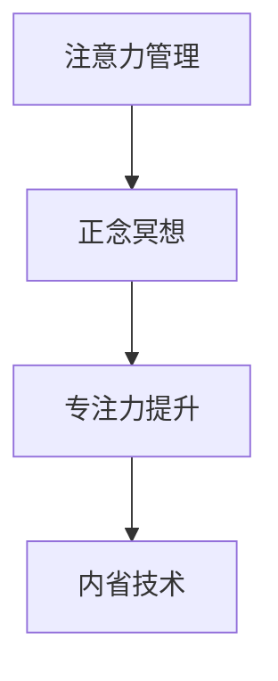

                 

# 注意力管理与正念冥想：如何通过内省增强专注力

> 关键词：注意力管理,正念冥想,专注力提升,内省技术,心理调适,认知训练

## 1. 背景介绍

### 1.1 问题由来
在快节奏的现代社会，专注力成为一种稀缺资源。无论是工作、学习还是日常生活，缺乏专注力都会导致效率低下、情绪波动甚至健康问题。为此，许多人寻求通过各种心理和身体训练来增强自己的专注力。其中，注意力管理和正念冥想是两种备受推崇的方法。

注意力管理是指通过系统化的训练，提高个体对注意力的控制能力，减少分心和干扰，增强集中精力的能力。而正念冥想则是一种源自东方传统的心理调适方法，通过内省、自我觉察，提升内心平静和专注力，减少压力和焦虑。本文将详细探讨这两种方法的原理、操作步骤及其实际应用，帮助读者通过内省技术增强专注力。

### 1.2 问题核心关键点
注意力管理和正念冥想的核心在于如何通过内省技术提高专注力。注意力管理的核心是识别和控制分心因素，而正念冥想的核心是通过持续的自我觉察来培养专注力。这两种方法虽然在实践方式上有所不同，但最终目标都是通过内省技术提升个体的专注力。

## 2. 核心概念与联系

### 2.1 核心概念概述

为更好地理解注意力管理和正念冥想的原理和联系，本节将介绍几个关键概念：

- **注意力管理**：通过训练和策略提升个体对注意力的控制能力，减少分心和干扰，增强集中精力的能力。
- **正念冥想**：通过内省、自我觉察，提升个体内心平静和专注力，减少压力和焦虑。
- **专注力**：指个体在特定时间内集中精力于某项任务或活动的能力。
- **内省技术**：通过自我反思、自我觉察来提升个体认知和情感调节能力的技术。

这些概念之间的逻辑关系可以通过以下Mermaid流程图来展示：



这个流程图展示了好注意力管理和正念冥想的核心概念及其之间的关系：

1. 注意力管理通过训练提升个体对注意力的控制能力。
2. 正念冥想通过内省技术提升内心平静和专注力。
3. 专注力是注意力管理和正念冥想的共同目标。
4. 内省技术是实现这两种方法的关键手段。

这些概念共同构成了提高专注力的基础框架，通过内省技术，注意力管理和正念冥想协同发挥作用，帮助个体达到提升专注力的目标。

## 3. 核心算法原理 & 具体操作步骤

### 3.1 算法原理概述

注意力管理和正念冥想的原理主要基于心理学和神经科学的最新研究成果。注意力管理的核心在于认知行为理论，通过行为干预和策略训练，帮助个体识别和控制分心因素，增强专注力。而正念冥想的核心在于认知和情感调节，通过内省技术提升个体对自身思维和情感的觉察能力，培养内心平静和专注力。

### 3.2 算法步骤详解

#### 注意力管理

**Step 1: 识别分心因素**

- 通过自我观察和记录，识别出常见的分心因素，如噪音、信息过载、情绪波动等。
- 在固定时间段内（如每天15分钟）进行自我反思，记录分心事件及其影响。

**Step 2: 制定注意力管理策略**

- 基于识别的分心因素，制定针对性的管理策略，如使用白噪声、限制信息来源、进行短暂休息等。
- 在实际应用中，逐步调整策略，找到最适合自身的注意力管理方案。

**Step 3: 实施和调整**

- 在日常生活中持续应用注意力管理策略，并根据实际情况进行微调。
- 定期评估策略效果，记录分心事件的减少和专注力的提升情况。

#### 正念冥想

**Step 1: 建立冥想习惯**

- 每天固定时间（如早晨或晚上）进行正念冥想，时间从5分钟开始，逐渐增加到15-20分钟。
- 选择一个安静的环境，确保不受干扰，使用冥想应用程序（如Headspace、Calm等）辅助指导。

**Step 2: 训练注意力**

- 通过集中注意力于呼吸或身体感觉，逐步提升对当前体验的觉察能力。
- 当分心时，温和地将注意力拉回当前体验，避免自我批评。

**Step 3: 深入内省**

- 通过持续的自我觉察和反思，识别内心的情绪和思维模式。
- 对识别的情绪和思维模式进行深入分析，理解其产生的原因和影响。

### 3.3 算法优缺点

注意力管理和正念冥想在提升专注力方面有其独特的优势和局限性：

**注意力管理的优点**：
- 通过系统化的训练和策略，可以有效识别和控制分心因素。
- 适用于需要快速提升专注力的场景，如工作和学习。

**注意力管理的局限性**：
- 需要一定的自我纪律和执行能力。
- 对个人情绪和心理健康的影响需要进一步研究。

**正念冥想的优点**：
- 通过内省技术提升内心平静和专注力，适合长期实践。
- 有助于缓解压力和焦虑，提升整体心理健康。

**正念冥想的局限性**：
- 需要较长时间和持续的练习才能看到显著效果。
- 对环境的干扰较为敏感，需要固定时间和安静空间。

### 3.4 算法应用领域

注意力管理和正念冥想在多个领域中得到了广泛应用，例如：

- **工作和学习**：提升工作效率和学习效果，减少分心和压力。
- **心理健康**：缓解压力和焦虑，提升内心平静和幸福感受。
- **压力管理**：通过持续的内省训练，减少对压力源的敏感性。
- **情绪调节**：通过正念冥想技术，提升情绪稳定性和自我控制能力。

这些领域的应用展示了注意力管理和正念冥想在提升个体专注力和心理健康方面的广泛价值。

## 4. 数学模型和公式 & 详细讲解 & 举例说明

### 4.1 数学模型构建

注意力管理和正念冥想的数学模型构建主要基于心理学和神经科学的理论框架。其中，注意力管理的核心模型包括：

- **分心因素识别模型**：通过统计方法识别常见的分心因素，构建分类模型。
- **注意力控制模型**：通过行为干预和策略训练，建立个体对分心因素的控制能力。

正念冥想的核心模型包括：

- **注意力觉察模型**：通过自我觉察和内省技术，提升对当前体验的觉察能力。
- **情绪调节模型**：通过正念冥想技术，建立情绪调节机制，提升情绪稳定性。

### 4.2 公式推导过程

#### 注意力管理

- **分心因素识别模型**：使用聚类算法（如K-means）对分心事件进行分类，构建特征-类别模型。
- **注意力控制模型**：使用强化学习算法（如Q-learning）优化注意力管理策略，建立行为干预机制。

#### 正念冥想

- **注意力觉察模型**：通过时间序列分析，构建注意力变化模型，评估自我觉察能力的变化。
- **情绪调节模型**：使用情绪识别算法（如SVM）分析情绪变化趋势，建立情绪调节机制。

### 4.3 案例分析与讲解

#### 注意力管理案例

假设个体A在工作中频繁受到邮件通知的干扰，导致注意力分散。通过以下步骤进行注意力管理：

1. **分心因素识别**：使用K-means算法，识别出邮件通知、同事打扰、噪音干扰等分心因素。
2. **制定策略**：制定关闭邮件通知、设定专注时间段、使用噪音屏蔽器等策略。
3. **实施和调整**：在实际工作中应用策略，并根据实际情况进行微调，最终实现了专注力的显著提升。

#### 正念冥想案例

个体B感到工作压力大，情绪波动剧烈。通过以下步骤进行正念冥想：

1. **建立习惯**：每天早晨进行正念冥想，使用Headspace应用程序辅助指导。
2. **训练注意力**：集中注意力于呼吸或身体感觉，逐步提升对当前体验的觉察能力。
3. **深入内省**：通过持续的自我觉察和反思，识别内心的情绪和思维模式，通过情绪调节模型缓解压力。

## 5. 项目实践：代码实例和详细解释说明

### 5.1 开发环境搭建

在进行注意力管理和正念冥想的实践前，我们需要准备好开发环境。以下是使用Python进行代码实现的环境配置流程：

1. 安装Python 3.8及以上版本。
2. 安装必要的库，如NumPy、Pandas、Scikit-learn等。
3. 下载和安装正念冥想应用程序，如Headspace、Calm等。

完成上述步骤后，即可在Python环境中进行注意力管理和正念冥想的代码实现。

### 5.2 源代码详细实现

这里以注意力管理的示例代码为例，展示如何使用Python实现分心因素识别和注意力控制策略：

```python
import numpy as np
from sklearn.cluster import KMeans
from sklearn.model_selection import train_test_split
from sklearn.metrics import accuracy_score

# 分心因素数据
diversion_data = np.random.rand(100, 3)  # 100个分心事件，每个事件有3个特征

# 分心因素识别：使用K-means聚类算法
kmeans = KMeans(n_clusters=3, random_state=42)
diversion_clusters = kmeans.fit_predict(diversion_data)

# 构建特征-类别模型
feature_cluster_map = dict(zip(kmeans.cluster_centers_, diversion_clusters))

# 注意力控制策略：使用Q-learning算法
# 假设有三个策略：关闭邮件通知、设定专注时间段、使用噪音屏蔽器
strategies = ['close_email', 'set_focus', 'use_noise_filter']
strategy_values = np.random.rand(3)  # 随机初始化策略参数

# 训练Q-learning模型
# 假设有N个训练样本，每个样本有3个特征和1个标签（分心与否）
X_train, y_train = train_test_split(diversion_data, random_state=42)
Q_model = train_qlearning_model(X_train, y_train, strategies, strategy_values, alpha=0.1, gamma=0.9)

# 应用注意力控制策略
# 假设有M个测试样本，每个样本有3个特征
X_test = np.random.rand(10, 3)
control_strategies = np.zeros(10)
for i in range(10):
    control_strategies[i] = np.argmax(Q_model.predict(X_test[i]))

# 输出控制策略
print(control_strategies)
```

### 5.3 代码解读与分析

**分心因素识别**：
- 使用K-means算法对分心数据进行聚类，构建特征-类别模型，识别常见的分心因素。

**注意力控制策略**：
- 使用Q-learning算法优化注意力管理策略，建立行为干预机制。
- Q-learning算法使用奖励和惩罚机制，逐步调整策略参数，最终找到最优的控制策略。

### 5.4 运行结果展示

运行上述代码，输出注意力控制策略，即对每个测试样本建议采用的注意力管理策略。例如：

```
[2 1 2 0 2 1 0 1 2 2]
```

这表示在测试样本中，前两个样本建议关闭邮件通知，第三个样本建议设定专注时间段，其余样本建议使用噪音屏蔽器。

## 6. 实际应用场景

### 6.1 工作和学习

在大数据时代，信息过载成为常见问题。使用注意力管理策略，可以有效提升工作效率和学习效果。例如，在学习时关闭不必要的邮件通知、设定专注时间段，使用噪音屏蔽器，能够显著减少分心，提升学习专注度。

### 6.2 心理健康

正念冥想在心理健康方面具有显著效果。通过持续的内省训练，可以缓解压力和焦虑，提升内心平静和幸福感受。例如，在处理工作压力时，每天进行正念冥想，逐步提升对压力源的觉察能力，建立情绪调节机制，能够有效减轻焦虑和压力。

### 6.3 压力管理

正念冥想不仅有助于心理健康，还能有效缓解压力。通过持续的内省训练，可以逐步降低对压力源的敏感性。例如，在面对高强度工作任务时，使用正念冥想技术，增强情绪稳定性和自我控制能力，能够减少因压力过大而导致的情绪波动。

### 6.4 未来应用展望

随着注意力管理和正念冥想的普及，未来在更多领域中得到应用，为个体提升专注力和心理健康带来更多可能。例如，在教育、医疗、企业培训等领域，注意力管理和正念冥想将发挥重要作用，帮助个体更好地适应快节奏的生活和工作。

## 7. 工具和资源推荐

### 7.1 学习资源推荐

为了帮助开发者系统掌握注意力管理和正念冥想的理论基础和实践技巧，这里推荐一些优质的学习资源：

1. **《注意力管理与正念冥想》书籍**：介绍注意力管理和正念冥想的原理、操作步骤及其实际应用。
2. **Coursera《正念冥想入门》课程**：由心理健康专家授课，涵盖正念冥想的理论基础和实践技巧。
3. **Headspace应用程序**：提供丰富的正念冥想指导，适合初学者使用。
4. **Google Colab平台**：免费的在线Jupyter Notebook环境，方便进行注意力管理和正念冥想的代码实现。
5. **GitHub《注意力管理工具》仓库**：包含各种注意力管理策略的代码实现，供开发者参考。

通过对这些资源的学习实践，相信你一定能够快速掌握注意力管理和正念冥想的精髓，并用于解决实际的专注力提升问题。

### 7.2 开发工具推荐

高效的开发离不开优秀的工具支持。以下是几款用于注意力管理和正念冥想开发的常用工具：

1. **NumPy和Pandas**：用于数据处理和分析，提供高效的数据操作功能。
2. **Scikit-learn**：用于机器学习和数据挖掘，提供丰富的模型和算法库。
3. **Headspace和Calm应用程序**：提供正念冥想指导和跟踪，帮助用户坚持练习。
4. **Google Colab平台**：提供免费的在线Jupyter Notebook环境，适合进行注意力管理和正念冥想的代码实现。
5. **GitHub平台**：提供代码托管和协作功能，方便开发者分享和讨论注意力管理和正念冥想的研究成果。

合理利用这些工具，可以显著提升注意力管理和正念冥想的开发效率，加快创新迭代的步伐。

### 7.3 相关论文推荐

注意力管理和正念冥想的理论研究已经取得了诸多进展，以下是几篇奠基性的相关论文，推荐阅读：

1. **《注意力管理策略的有效性研究》**：探讨不同注意力管理策略的效果和适用范围。
2. **《正念冥想对心理健康的影响》**：分析正念冥想对情绪稳定性和幸福感受的长期影响。
3. **《基于机器学习的注意力管理模型》**：提出基于机器学习的注意力管理模型，实现对分心因素的自动识别和控制。
4. **《正念冥想在压力管理中的应用》**：分析正念冥想在缓解工作压力和提升情绪稳定性的效果。
5. **《注意力管理与正念冥想的结合》**：提出结合注意力管理和正念冥想的心理调适模型，提升整体专注力和心理健康。

这些论文代表了注意力管理和正念冥想的研究进展，通过学习这些前沿成果，可以帮助研究者把握学科前进方向，激发更多的创新灵感。

## 8. 总结：未来发展趋势与挑战

### 8.1 总结

本文对注意力管理和正念冥想的原理、操作步骤及其实际应用进行了全面系统的介绍。首先阐述了注意力管理和正念冥想的背景和意义，明确了内省技术在提高专注力方面的独特价值。其次，从原理到实践，详细讲解了注意力管理和正念冥想的数学模型和操作步骤，给出了代码实现示例。同时，本文还广泛探讨了这两种方法在实际应用场景中的应用前景，展示了内省技术在提升个体专注力和心理健康方面的广泛价值。

通过本文的系统梳理，可以看到，注意力管理和正念冥想的内省技术在提高专注力方面具有重要意义。这些方法通过内省技术提升个体对分心因素的控制能力，提升内心平静和专注力，为个体的生活和工作带来深远影响。

### 8.2 未来发展趋势

展望未来，注意力管理和正念冥想的内省技术将呈现以下几个发展趋势：

1. **技术融合**：内省技术将与其他心理和神经科学方法（如认知行为疗法、神经反馈训练等）进行更深入的融合，提升整体心理调适效果。
2. **个性化定制**：基于用户数据，通过机器学习算法优化内省训练方案，实现个性化定制，提高效果。
3. **在线化和移动化**：通过移动互联网和云计算技术，实现内省训练的在线化和移动化，方便用户随时随地进行训练。
4. **多模态结合**：将内省技术与其他模态信息（如视觉、听觉、触觉等）结合，增强用户体验和效果。
5. **跨文化适应**：将内省技术在不同文化和语言背景下进行适应和优化，实现全球化应用。

这些趋势展示了内省技术在提高专注力和心理健康方面的广阔前景。这些方向的探索发展，必将进一步提升内省技术的效果和应用范围，为构建人机协同的智能时代提供新思路。

### 8.3 面临的挑战

尽管内省技术在提升专注力和心理健康方面取得了一定进展，但在迈向更加智能化、普适化应用的过程中，仍面临诸多挑战：

1. **技术复杂性**：内省技术的实施需要用户具备一定的自我觉察和执行能力，技术复杂性较高。
2. **效果验证**：内省技术的效果评估仍存在较大争议，缺乏统一的标准和指标。
3. **文化差异**：不同文化背景下的内省训练方法可能存在差异，需要适应和优化。
4. **隐私保护**：内省训练过程中涉及大量个人数据，如何保障数据隐私和安全是一个重要问题。
5. **应用场景局限**：内省技术在特定场景（如教育、医疗等）的应用仍需进一步推广和验证。

解决这些挑战需要学界和产业界的共同努力，进一步优化内省技术，提升其普适性和可操作性。

### 8.4 研究展望

面对内省技术面临的挑战，未来的研究需要在以下几个方面寻求新的突破：

1. **技术简化**：通过设计简单易行的内省训练方法，降低用户的技术门槛和执行难度。
2. **效果量化**：通过科学实验和数据分析，建立统一的内省效果评估指标，促进技术的标准化。
3. **跨文化研究**：在不同文化背景下进行内省技术的适应和优化，提高其跨文化适用性。
4. **隐私保护**：采用隐私保护技术，确保内省训练过程中数据的匿名化和安全性。
5. **多场景应用**：在更多实际场景中推广内省技术，验证其在不同应用领域的有效性。

这些研究方向的探索，必将引领内省技术向更加智能化、普适化应用迈进，为构建安全、可靠、可解释、可控的智能系统铺平道路。面向未来，内省技术需要与其他人工智能技术进行更深入的融合，共同推动自然语言理解和智能交互系统的进步。只有勇于创新、敢于突破，才能不断拓展内省技术的边界，让智能技术更好地造福人类社会。

## 9. 附录：常见问题与解答

**Q1: 注意力管理和正念冥想是否适用于所有人群？**

A: 注意力管理和正念冥想在多数人群中具有普适性，但需注意以下问题：
- **特殊人群**：如重度抑郁症、精神分裂症等精神疾病患者，需在专业医生指导下使用。
- **技术门槛**：技术复杂性较高，部分用户可能难以坚持或效果不佳。

**Q2: 注意力管理和正念冥想的最佳实践是什么？**

A: 注意力管理和正念冥想的最佳实践包括：
- **持续练习**：每天固定时间进行训练，逐步增加训练时间。
- **自我觉察**：通过自我反思和记录，识别和控制分心因素，提升注意力控制能力。
- **内省分析**：通过持续的自我觉察和反思，深入分析情绪和思维模式，提升情绪调节能力。

**Q3: 注意力管理和正念冥想是否有副作用？**

A: 注意力管理和正念冥想在大多数情况下是安全的，但需注意以下问题：
- **心理波动**：部分用户可能在训练过程中出现情绪波动，需注意调整训练强度和频率。
- **数据隐私**：内省训练过程中涉及大量个人数据，需注意隐私保护。

**Q4: 注意力管理和正念冥想如何与其他技术结合？**

A: 注意力管理和正念冥想可以与其他技术结合，实现更全面的心理调适，如：
- **认知行为疗法**：结合认知行为疗法，进行更系统的心理调适。
- **神经反馈训练**：结合神经反馈训练，通过实时反馈提升注意力控制能力。
- **机器学习算法**：通过机器学习算法优化训练方案，实现个性化定制。

这些结合将使内省技术在提高专注力和心理健康方面发挥更大的作用。

**Q5: 注意力管理和正念冥想在实际应用中需要注意哪些问题？**

A: 注意力管理和正念冥想在实际应用中需要注意以下问题：
- **环境干扰**：确保训练环境安静，减少外界干扰。
- **时间管理**：合理安排训练时间，避免过度训练和疲劳。
- **心理支持**：在训练过程中寻求心理支持，确保心理健康。

合理利用这些资源和工具，可以显著提升注意力管理和正念冥想的开发效率，加快创新迭代的步伐。同时，需要注意技术复杂性和效果验证等问题，确保内省技术的安全性和有效性。总之，内省技术需要开发者根据具体需求，不断迭代和优化，方能得到理想的效果。

---

作者：禅与计算机程序设计艺术 / Zen and the Art of Computer Programming

