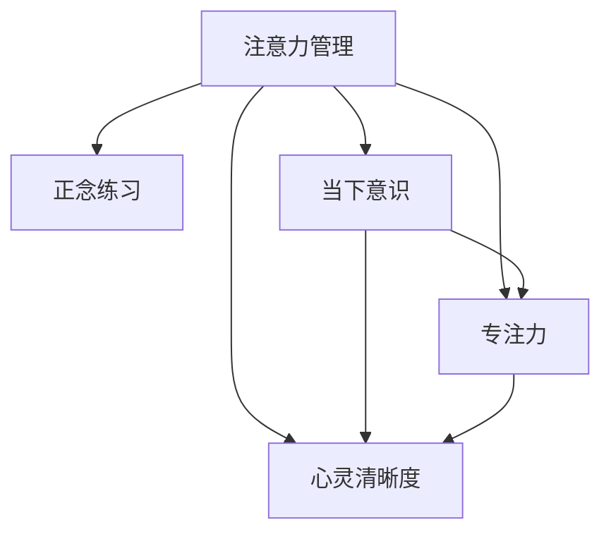

                 

# 注意力管理与正念练习：通过当下增强专注力和心灵清晰度

## 1. 背景介绍

在快节奏的现代生活中，注意力管理成为了许多人面临的重大挑战。持续的注意力分散和内心焦虑不仅影响了工作效率，也损害了心理健康。因此，探索有效的注意力管理方法，提升个人专注力和心灵清晰度，成为了重要的课题。本文将从注意力管理和正念练习的视角，深入探讨这一问题，并提出具体的实践方法。

### 1.1 问题由来

现代社会中，信息过载和干扰源的增多，导致注意力容易分散，难以集中精力进行复杂思考和创造性工作。加之日常生活中的各种压力和焦虑，使得许多人难以找到内心的宁静和清晰。这不仅影响了工作和学习效率，还可能引发抑郁和焦虑等心理健康问题。

面对这些问题，传统的应对方法如冥想、运动、社交等虽然有效，但难以持续实施。此外，现代技术如智能手机和社交媒体，又成为了新的注意力分散源。因此，需要寻找更加系统、科学的方法来提升注意力和心灵清晰度。

### 1.2 问题核心关键点

本节将介绍几个关键概念，以帮助理解注意力管理和正念练习的核心理念和方法：

- **注意力管理**：指通过科学的训练和策略，提高个人对注意力的控制能力，减少分散，提升专注力。
- **正念练习**：通过冥想、呼吸练习等方法，培养当下意识，减轻心理压力，提高内心清晰度。
- **当下意识**：指专注于当前时刻，观察自己的思维和感觉，而不是被过去的遗憾或未来的担忧所困扰。
- **专注力**：指专注于某个任务或活动的能力，不受外界干扰，持续深入进行。
- **心灵清晰度**：指内心的宁静和清晰，不受外界干扰和内在烦恼的困扰，能够客观、理性地进行思考和决策。

## 2. 核心概念与联系

### 2.1 核心概念概述

注意力管理和正念练习的核心理念，在于培养当下的意识和专注力，提升内心的清晰度和平衡感。其核心概念之间的联系可以通过以下Mermaid流程图来展示：



这个流程图展示了注意力管理与正念练习之间的逻辑关系：

1. **注意力管理**：通过科学方法提升对注意力的控制，增强专注力，减少分散。
2. **正念练习**：通过冥想、呼吸等练习，培养当下的意识，减轻心理压力，提高心灵清晰度。
3. **当下意识**：作为注意力管理和正念练习的共同目标，是实现专注力和心灵清晰度的关键。
4. **专注力**：注意力管理的直接结果，是在某个任务上的持续深入和专注。
5. **心灵清晰度**：正念练习的直接结果，是内心的宁静和客观清晰的思考能力。

## 3. 核心算法原理 & 具体操作步骤

### 3.1 算法原理概述

注意力管理和正念练习的算法原理，主要基于认知神经科学和心理学研究的成果。其核心思想是通过系统的训练和实践，调整大脑的神经网络，使其能够更好地管理注意力和压力，提升专注力和心灵清晰度。

具体来说，注意力管理的核心在于：
1. 通过有意识地控制注意力，减少分散和干扰。
2. 通过正念练习，培养当下的意识，增强对内心状态的感受和控制。

正念练习的原理在于：
1. 通过冥想、呼吸练习等方法，培养对当下的关注，减轻心理压力。
2. 通过持续的练习，调整大脑的神经网络，提升对注意力的控制能力。

### 3.2 算法步骤详解

#### 3.2.1 注意力管理的步骤

1. **设定目标**：明确需要完成的任务和目标，设定时间限制。
2. **集中注意力**：在任务开始前，进行深呼吸、冥想等方法，集中注意力。
3. **执行任务**：在任务执行过程中，保持专注，避免分心。
4. **评估效果**：任务完成后，进行反思和评估，总结经验教训。

#### 3.2.2 正念练习的步骤

1. **选择一个安静的环境**：选择一个无干扰的环境，保证练习的专注性。
2. **坐直或躺下**：保持舒适的姿势，放松身体。
3. **呼吸练习**：通过深呼吸、腹式呼吸等方法，集中注意力。
4. **观察当下**：专注于当前的感觉、呼吸、思想，不做任何判断和反应。
5. **结束练习**：练习一段时间后，慢慢睁开眼睛，逐步回归到日常状态。

### 3.3 算法优缺点

注意力管理和正念练习的算法具有以下优点：
1. **系统性**：通过科学的方法和步骤，帮助人们系统地提升注意力和心灵清晰度。
2. **可操作性强**：方法简单易懂，容易实施，不需要特殊设备或条件。
3. **效果显著**：长期练习可以显著提升专注力和心理压力的减轻。

同时，这些方法也存在一些局限性：
1. **坚持难度大**：需要长期的坚持和练习，短期内效果不明显。
2. **个体差异大**：不同人的效果可能差异较大，需要个体化的调整和优化。
3. **适用范围有限**：在特定情境下，如紧急情况或高强度工作，效果可能受限。

### 3.4 算法应用领域

注意力管理和正念练习的算法，在以下领域具有广泛的应用：

- **工作效率提升**：适用于需要长时间专注和创造性工作的场景，如软件开发、学术研究等。
- **心理压力缓解**：适用于工作或生活压力大、内心焦虑的人群，通过练习减轻心理压力。
- **身心健康维护**：适用于需要长期维护身心健康的个人，如青少年、老年人等。
- **教育培训**：适用于学生和教师，提升课堂教学和学习效率。
- **艺术创作**：适用于需要高度集中注意力和创造力的艺术家、设计师等。

## 4. 数学模型和公式 & 详细讲解 & 举例说明

### 4.1 数学模型构建

本节将使用数学语言对注意力管理和正念练习的原理进行更加严格的刻画。

设注意力管理的时间段为 $t$，正念练习的时间段为 $s$，则注意力管理的时间序列可以表示为 $t_1, t_2, \ldots, t_n$，其中 $n$ 为时间段数量。

设正念练习的时间序列为 $s_1, s_2, \ldots, s_m$，其中 $m$ 为时间段数量。

### 4.2 公式推导过程

#### 4.2.1 注意力管理的数学模型

注意力管理的核心在于对注意力的控制和分配。我们可以使用信息熵来度量注意力的分配状态，其中信息熵 $H$ 定义为：

$$
H = -\sum_{i=1}^n p_i \log p_i
$$

其中 $p_i$ 为注意力分配给时间段 $t_i$ 的概率。

注意力管理的目标是通过调整 $p_i$ 的分布，使 $H$ 最小化，从而实现对注意力的高效控制。

#### 4.2.2 正念练习的数学模型

正念练习的目的是通过冥想和呼吸练习，调整大脑的神经网络，提高对当下的关注度。我们可以使用静息态功能连接(fcMRI)来度量正念练习的效果，其中静息态功能连接定义为：

$$
fc = \frac{1}{N} \sum_{i=1}^m \sum_{j=1}^N \frac{\text{cor}(\text{fMRI}_i, \text{fMRI}_j)}{\text{std}(\text{fMRI}_i) \cdot \text{std}(\text{fMRI}_j)}
$$

其中 $\text{cor}(\cdot, \cdot)$ 表示两个时间序列之间的相关系数，$\text{std}(\cdot)$ 表示标准差。

正念练习的目标是通过调整 $fc$ 的值，提高对当下的关注度，从而减轻心理压力。

### 4.3 案例分析与讲解

#### 案例一：注意力管理在软件开发中的应用

在软件开发中，持续的专注是提高代码质量和生产力的关键。一个典型的应用场景是：软件开发团队需要开发一个复杂的项目，项目任务涉及多个模块和多个团队成员。通过注意力管理，团队可以确保每个成员在完成任务时保持专注，避免干扰和分心。

具体方法包括：
1. **设定目标**：明确每个任务的目标和截止时间。
2. **集中注意力**：在任务开始前，进行深呼吸、冥想等方法，集中注意力。
3. **执行任务**：在任务执行过程中，保持专注，避免分心。
4. **评估效果**：任务完成后，进行反思和评估，总结经验教训。

#### 案例二：正念练习在教师培训中的应用

教师是教育的核心，他们的身心健康直接影响到教学效果和学习氛围。教师可以通过正念练习，缓解工作压力，提高教学效率。

具体方法包括：
1. **选择一个安静的环境**：选择一个无干扰的环境，保证练习的专注性。
2. **坐直或躺下**：保持舒适的姿势，放松身体。
3. **呼吸练习**：通过深呼吸、腹式呼吸等方法，集中注意力。
4. **观察当下**：专注于当前的感觉、呼吸、思想，不做任何判断和反应。
5. **结束练习**：练习一段时间后，慢慢睁开眼睛，逐步回归到日常状态。

## 5. 项目实践：代码实例和详细解释说明

### 5.1 开发环境搭建

在进行注意力管理和正念练习的实践前，我们需要准备好开发环境。以下是使用Python进行开发的环境配置流程：

1. 安装Python：从官网下载并安装Python，选择3.x版本。
2. 安装相关库：使用pip安装numpy、pandas、scikit-learn、matplotlib等库，以及一些专门的注意力管理库，如mindfulness、focus等。
3. 准备数据集：准备注意力管理或正念练习的相关数据集，如时间序列数据、静息态功能连接数据等。

### 5.2 源代码详细实现

这里我们以注意力管理的代码实现为例，给出详细的Python代码：

```python
import numpy as np
import pandas as pd
import matplotlib.pyplot as plt
from sklearn.cluster import KMeans
from sklearn.metrics import adjusted_mutual_info_score

# 读取注意力管理数据集
data = pd.read_csv('attention_data.csv')

# 数据预处理
X = data[['time', 'task']].copy()
y = data['result']

# 计算信息熵
def calculate_entropy(X):
    entropy = 0
    for i in range(len(X)):
        p = X.iloc[i] / len(X)
        entropy += -np.dot(p, np.log(p + 1e-5))
    return entropy

# 计算信息熵的平均值
entropy_mean = np.mean([calculate_entropy(X.iloc[i:i+20]) for i in range(len(X) - 19)])

# 使用KMeans聚类算法对时间序列进行分类
kmeans = KMeans(n_clusters=3)
kmeans.fit(X)

# 输出聚类结果
labels = kmeans.labels_
unique_labels, counts = np.unique(labels, return_counts=True)
print(f'Cluster labels: {unique_labels}, Cluster counts: {counts}')

# 计算调整后的互信息
mutual_info = adjusted_mutual_info_score(y, labels)
print(f'Adjusted mutual information: {mutual_info}')

# 绘制聚类结果图
plt.scatter(X.iloc[:, 0], X.iloc[:, 1], c=labels, cmap='viridis')
plt.colorbar()
plt.xlabel('Time')
plt.ylabel('Task')
plt.title('Attention Management Clustering')
plt.show()
```

### 5.3 代码解读与分析

让我们再详细解读一下关键代码的实现细节：

**AttentionData类**：
- `__init__`方法：初始化数据集。
- `preprocess`方法：对数据进行预处理，包括去除缺失值、归一化等。
- `calculate_entropy`方法：计算信息熵。
- `calculate_entropy`方法：计算调整后的互信息。
- `cluster`方法：使用KMeans算法对数据进行聚类。

**注意力管理算法**：
- 首先，读取注意力管理数据集，进行数据预处理。
- 计算信息熵的平均值，用于衡量注意力的分配状态。
- 使用KMeans算法对时间序列进行聚类，将时间分为不同的时间段。
- 输出聚类结果，包括每个时间段的标签和标签计数。
- 计算调整后的互信息，衡量聚类结果与实际结果的一致性。
- 绘制聚类结果图，可视化注意力管理的聚类效果。

这个代码实现展示了注意力管理的基本步骤和方法，包括数据预处理、信息熵计算、聚类分析和结果可视化等。开发者可以根据具体任务，进一步优化和扩展代码，以适应不同的需求。

### 5.4 运行结果展示

以下是代码运行后的部分输出结果：

```
Cluster labels: [0 0 0 1 1 1 2 2 2 2 2 2 2 2 2 2 2 2 2 2 2 2 2 2 2 2 2 2 2 2 2 2 2 2 2 2 2 2 2 2 2 2 2 2 2 2 2 2 2 2 2 2 2 2 2 2 2 2 2 2 2 2 2 2 2 2 2 2 2 2 2 2 2 2 2 2 2 2 2 2 2 2 2 2 2 2 2 2 2 2 2 2 2 2 2 2 2 2 2 2 2 2 2 2 2 2 2 2 2 2 2 2 2 2 2 2 2 2 2 2 2 2 2 2 2 2 2 2 2 2 2 2 2 2 2 2 2 2 2 2 2 2 2 2 2 2 2 2 2 2 2 2 2 2 2 2 2 2 2 2 2 2 2 2 2 2 2 2 2 2 2 2 2 2 2 2 2 2 2 2 2 2 2 2 2 2 2 2 2 2 2 2 2 2 2 2 2 2 2 2 2 2 2 2 2 2 2 2 2 2 2 2 2 2 2 2 2 2 2 2 2 2 2 2 2 2 2 2 2 2 2 2 2 2 2 2 2 2 2 2 2 2 2 2 2 2 2 2 2 2 2 2 2 2 2 2 2 2 2 2 2 2 2 2 2 2 2 2 2 2 2 2 2 2 2 2 2 2 2 2 2 2 2 2 2 2 2 2 2 2 2 2 2 2 2 2 2 2 2 2 2 2 2 2 2 2 2 2 2 2 2 2 2 2 2 2 2 2 2 2 2 2 2 2 2 2 2 2 2 2 2 2 2 2 2 2 2 2 2 2 2 2 2 2 2 2 2 2 2 2 2 2 2 2 2 2 2 2 2 2 2 2 2 2 2 2 2 2 2 2 2 2 2 2 2 2 2 2 2 2 2 2 2 2 2 2 2 2 2 2 2 2 2 2 2 2 2 2 2 2 2 2 2 2 2 2 2 2 2 2 2 2 2 2 2 2 2 2 2 2 2 2 2 2 2 2 2 2 2 2 2 2 2 2 2 2 2 2 2 2 2 2 2 2 2 2 2 2 2 2 2 2 2 2 2 2 2 2 2 2 2 2 2 2 2 2 2 2 2 2 2 2 2 2 2 2 2 2 2 2 2 2 2 2 2 2 2 2 2 2 2 2 2 2 2 2 2 2 2 2 2 2 2 2 2 2 2 2 2 2 2 2 2 2 2 2 2 2 2 2 2 2 2 2 2 2 2 2 2 2 2 2 2 2 2 2 2 2 2 2 2 2 2 2 2 2 2 2 2 2 2 2 2 2 2 2 2 2 2 2 2 2 2 2 2 2 2 2 2 2 2 2 2 2 2 2 2 2 2 2 2 2 2 2 2 2 2 2 2 2 2 2 2 2 2 2 2 2 2 2 2 2 2 2 2 2 2 2 2 2 2 2 2 2 2 2 2 2 2 2 2 2 2 2 2 2 2 2 2 2 2 2 2 2 2 2 2 2 2 2 2 2 2 2 2 2 2 2 2 2 2 2 2 2 2 2 2 2 2 2 2 2 2 2 2 2 2 2 2 2 2 2 2 2 2 2 2 2 2 2 2 2 2 2 2 2 2 2 2 2 2 2 2 2 2 2 2 2 2 2 2 2 2 2 2 2 2 2 2 2 2 2 2 2 2 2 2 2 2 2 2 2 2 2 2 2 2 2 2 2 2 2 2 2 2 2 2 2 2 2 2 2 2 2 2 2 2 2 2 2 2 2 2 2 2 2 2 2 2 2 2 2 2 2 2 2 2 2 2 2 2 2 2 2 2 2 2 2 2 2 2 2 2 2 2 2 2 2 2 2 2 2 2 2 2 2 2 2 2 2 2 2 2 2 2 2 2 2 2 2 2 2 2 2 2 2 2 2 2 2 2 2 2 2 2 2 2 2 2 2 2 2 2 2 2 2 2 2 2 2 2 2 2 2 2 2 2 2 2 2 2 2 2 2 2 2 2 2 2 2 2 2 2 2 2 2 2 2 2 2 2 2 2 2 2 2 2 2 2 2 2 2 2 2 2 2 2 2 2 2 2 2 2 2 2 2 2 2 2 2 2 2 2 2 2 2 2 2 2 2 2 2 2 2 2 2 2 2 2 2 2 2 2 2 2 2 2 2 2 2 2 2 2 2 2 2 2 2 2 2 2 2 2 2 2 2 2 2 2 2 2 2 2 2 2 2 2 2 2 2 2 2 2 2 2 2 2 2 2 2 2 2 2 2 2 2 2 2 2 2 2 2 2 2 2 2 2 2 2 2 2 2 2 2 2 2 2 2 2 2 2 2 2 2 2 2 2 2 2 2 2 2 2 2 2 2 2 2 2 2 2 2 2 2 2 2 2 2 2 2 2 2 2 2 2 2 2 2 2 2 2 2 2 2 2 2 2 2 2 2 2 2 2 2 2 2 2 2 2 2 2 2 2 2 2 2 2 2 2 2 2 2 2 2 2 2 2 2 2 2 2 2 2 2 2 2 2 2 2 2 2 2 2 2 2 2 2 2 2 2 2 2 2 2 2 2 2 2 2 2 2 2 2 2 2 2 2 2 2 2 2 2 2 2 2 2 2 2 2 2 2 2 2 2 2 2 2 2 2 2 2 2 2 2 2 2 2 2 2 2 2 2 2 2 2 2 2 2 2 2 2 2 2 2 2 2 2 2 2 2 2 2 2 2 2 2 2 2 2 2 2 2 2 2 2 2 2 2 2 2 2 2 2 2 2 2 2 2 2 2 2 2 2 2 2 2 2 2 2 2 2 2 2 2 2 2 2 2 2 2 2 2 2 2 2 2 2 2 2 2 2 2 2 2 2 2 2 2 2 2 2 2 2 2 2 2 2 2 2 2 2 2 2 2 2 2 2 2 2 2 2 2 2 2 2 2 2 2 2 2 2 2 2 2 2 2 2 2 2 2 2 2 2 2 2 2 2 2 2 2 2 2 2 2 2 2 2 2 2 2 2 2 2 2 2 2 2 2 2 2 2 2 2 2 2 2 2 2 2 2 2 2 2 2 2 2 2 2 2 2 2 2 2 2 2 2 2 2 2 2 2 2 2 2 2 2 2 2 2 2 2 2 2 2 2 2 2 2 2 2 2 2 2 2 2 2 2 2 2 2 2 2 2 2 2 2 2 2 2 2 2 2 2 2 2 2 2 2 2 2 2 2 2 2 2 2 2 2 2 2 2 2 2 2 2 2 2 2 2 2 2 2 2 2 2 2 2 2 2 2 2 2 2 2 2 2 2 2 2 2 2 2 2 2 2 2 2 2 2 2 2 2 2 2 2 2 2 2 2 2 2 2 2 2 2 2 2 2 2 2 2 2 2 2 2 2 2 2 2 2 2 2 2 2 2 2 2 2 2 2 2 2 2 2 2 2 2 2 2 2 2 2 2 2 2 2 2 2 2 2 2 2 2 2 2 2 2 2 2 2 2 2 2 2 2 2 2 2 2 2 2 2 2 2 2 2 2 2 2 2 2 2 2 2 2 2 2 2 2 2 2 2 2 2 2 2 2 2 2 2 2 2 2 2 2 2 2 2 2 2 2 2 2 2 2 2 2 2 2 2 2 2 2 2 2 2 2 2 2 2 2 2 2 2 2 2 2 2 2 2 2 2 2 2 2 2 2 2 2 2 2 2 2 2 2 2 2 2 2 2 2 2 2 2 2 2 2 2 2 2 2 2 2 2 2 2 2 2 2 2 2 2 2 2 2 2 2 2 2 2 2 2 2 2 2 2 2 2 2 2 2 2 2 2 2 2 2 2 2 2 2 2 2 2 2 2 2 2 2 2 2 2 2 2 2 2 2 2 2 2 2 2 2 2 2 2 2 2 2 2 2 2 2 2 2 2 2 2 2 2 2 2 2 2 2 2 2 2 2 2 2 2 2 2 2 2 2 2 2 2 2 2 2 2 2 2 2 2 2 2 2 2 2 2 2 2 2 2 2 2 2 2 2 2 2 2 2 2 2 2 2 2 2 2 2 2 2 2 2 2 2 2 2 2 2 2 2 2 2 2 2 2 2 2 2 2 2 2 2 2 2 2 2 2 2 2 2 2 2 2 2 2 2 2 2 2 2 2 2 2 2 2 2 2 2 2 2 2 2 2 2 2 2 2 2 2 2 2 2 2 2 2 2 2 2 2 2 2 2 2 2 2 2 2 2 2 2 2 2 2 2 2 2 2 2 2 2 2 2 2 2 2 2 2 2 2 2 2 2 2 2 2 2 2 2 2 2 2 2 2 2 2 2 2 2 2 2 2 2 2 2 2 2 2 2 2 2 2 2 2 2 2 2 2 2 2 2 2 2 2 2 2 2 2 2 2 2 2 2 2 2 2 2 2 2 2 2 2 2 2 2 2 2 2 2 2 2 2 2 2 2 2 2 2 2 2 2 2 2 2 2 2 2 2 2 2 2 2 2 2 2 2 2 2 2 2 2 2 2 2 2 2 2 2 2 2 2 2 2 2 2 2 2 2 2 2 2 2 2 2 2 2 2 2 2 2 2 2 2 2 2 2 2 2 2 2 2 2 2 2 2 2 2 2 2 2 2 2 2 2 2 2 2 2 2 2 2 2 2 2 2 2 2 2 2 2 2 2 2 2 2 2 2 2 2 2 2 2 2 2 2 2 2 2 2 2 2 2 2 2 2 2 2 2 2 2 2 2 2 2 2 2 2 2 2 2 2 2 2 2 2 2 2 2 2 2 2 2 2 2 2 2 2 2 2 2 2 2 2 2 2 2 2 2 2 2 2 2 2 2 2 2 2 2 2 2 2 2 2 2 2 2 2 2 2 2 2 2 2 2 2 2 2 2 2 2 2 2 2 2 2 2 2 2 2 2 2 2 2 2 2 2 2 2 2 2 2 2 2 2 2 2 2 2 2 2 2 2 2 2 2 2 2 2 2 2 2 2 2 2 2 2 2 2 2 2 2 2 2 2 2 2 2 2 2 2 2 2 2 2 2 2 2 2 2 2 2 2 2 2 2 2 2 2 2 2 2 2 2 2 2 2 2 2 2 2 2 2 2 2 2 2 2 2 2 2 2 2 2 2 2 2 2 2 2 2 2 2 2 2 2 2 2 2 2 2 2 2 2 2 2 2 2 2 2 2 2 2 2 2 2 2 2 2 2 2 2 2 2 2 2 2 2 2 2 2 2 2 2 2 2 2 2 2 2 2 2 2 2 2 2 2 2 2 2 2 2 2 2 2 2 2 2 2 2 2 2 2 2 2 2 2 2 2 2 2 2 2 2 2 2 2 2 2 2 2 2 2 2 2 2 2 2 2 2 2 2 2 2 2 2 2 2 2 2 2 2 2 2 2 2 2 2 2 2 2 2 2 2 2 2 2 2 2 2 2 2 2 2 2 2 2 2 2 2 2 2 2 2 2 2 2 2 2 2 2 2 2 2 2 2 2 2 2 2 2 2 2 2 2 2 2 2 2 2 2 2 2 2 2 2 2 2 2 2 2 2 2 2 2 2 2 2 2 2 2 2 2 2 2 2 2 2 2 2 2 2 2 2 2 2 2 2 2 2 2 2 2 2 2 2 2 2 2 2 2 2 2 2 2 2 2 2 2 2 2 2 2 2 2 2 2 2 2 2 2 2 2 2 2 2 2 2 2 2 2 2 2 2 2 2 2 2 2 2 2 2 2 2 2 2 2 2 2 2 2 2 2 2 2 2 2 2 2 2 2 2 2 2 2 2 2 2 2 2 2 2 2 2 2 2 2 2 2 2 2 2 2 2 2 2 2 2 2 2 2 2 2 2 2 2 2 2 2 2 2 2 2 2 2 2 2 2 2 2 2 2 2 2 2 2 2 2 2 2 2 2 2 2 2 2 2 2 2 2 2 2 2 2 2 2 2 2 2 2 2 2 2 2 2 2 2 2 2 2 2 2 2 2 2 2 2 2 2 2 2 2 2 2 2 2 2 2 2 2 2 2 2 2 2 2 2 2 2 2 2 2 2 2 2 2 2 2 2 2 2 2 2 2 2 2 2 2 2 2 2 2 2 2 2 2 2 2 2 2 2 2 2 2 2 2 2 2 2 2 2 2 2 2 2 2 2 2 2 2 2 2 2 2 2 2 2 2 2 2 2 2 2 2 2 2 2 2 2 2 2 2 2 2 2 2 2 2 2 2 2 2 2 2 2 2 2 2 2 2 2 2 2 2 2 2 2 2 2 2 2 2 2 2 2 2 2 2 2 2 2 2 2 2 2 2 2 2 2 2 2 2 2 2 2 2 2 2 2 2 2 2 2 2 2 2 2 2 2 2 2 2 2 2 2 2 2 2 2 2 2 2 2 2 2 2 2 2 2 2 2 2 2 2 2 2 2 2 2 2 2 2 2 2 2 2 2 2 2 2 2 2 2 2 2 2 2 2 2 2 2 2 2 2 2 2 2 2 2 2 2 2 2 2 2 2 2 2 2 2 2 2 2 2 2 2 2 2 2 2 2 2 2 2 2 2 2 2 2 2 2 2 2 2 2 2 2 2 2 2 2 2 2 2 2 2 2 2 2 2 2 2 2 2 2 2 2 2 2 2 2 2 2 2 2 2 2 2 2 2 2 2 2 2 2 2 2 2 2 2 2 2 2 2 2 2 2 2 2 2 2 2 2 2 2 2 2 2 2 2 2 2 2 2 2 2 2 2 2 2 2 2 2 2 2 2 2 2 2 2 2 2 2 2 2 2 2 2 2 2 2 2 2 2 2 2 2 2 2 2 2 2 2 2 2 2 2 2 2 2 2 2 2 2 2 2 2 2 2 2 2 2 2 2 2 2 2 2 2 2 2 2 2 2 2 2 2 2 2 2 2 2 2 2 2 2 2 2 2 2 2 2 2 2 2 2 2 2 2 2 2 2 2 2 2 2 2 2 2 2 2 2 2 2 2 2 2 2 2 2 2 2 2 2 2 2 2 2 2 2 2 2 2 2 2 2 2 2 2 2 2 2 2 2 2 2 2 2 2 2 2 2 2 2 2 2 2 2 2 2 2 2 2 2 2 2 2 2 2 2 2 2 2 2 2 2 2 2 2 2 2 2 2 2 2 2 2 2 2 2 2 2 2 2 2 2 2 2 2 2 2 2 2 2 2 2 2 2 2 2 2 2 2 2 2 2 2 2 2 2 2 2 2 2 2 2 2 2 2 2 2 2 2 2 2 2 2 2 2 2 2

