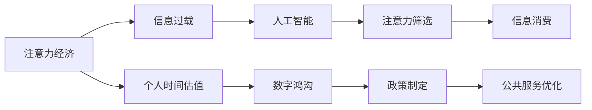

                 

# 注意力经济与个人时间估值的变化

> 关键词：注意力经济, 个人时间估值, 信息过载, 数字鸿沟, 人工智能, 数据隐私, 价值评估, 应用场景

## 1. 背景介绍

在数字化时代的浪潮中，信息的爆炸式增长使得人类面临前所未有的注意力过载问题。海量信息的充斥让个人和组织在决策、消费、创新等方面需要付出更多的时间和精力。在此背景下，注意力经济应运而生，成为新经济形态的重要组成部分。本文将探讨注意力经济的核心概念、个人时间估值的变化以及人工智能在这一变革中的作用。

### 1.1 问题由来

注意力经济的核心在于信息的价值，而信息的价值不仅仅体现在其内容的丰富性上，更在于消费者对它的关注和投入。随着互联网的普及，个人接触的信息量激增，消费者在决策和消费过程中耗费的时间和精力也显著增加。如何在信息海洋中筛选出对自己最有价值的内容，成为现代社会的普遍难题。

### 1.2 问题核心关键点

注意力经济与个人时间估值的变化主要体现在以下几个方面：

1. **信息过载与注意力稀缺**：海量信息的涌入使得个人注意力变得稀缺，有效筛选信息成为一种稀缺资源。
2. **个人时间估值变化**：个人在筛选和消费信息时投入的时间和精力变得更为昂贵。
3. **数据隐私与价值**：个人信息的获取和使用在数字时代变得更加复杂，如何在保证隐私的前提下最大化信息价值。
4. **技术驱动的变革**：人工智能、大数据等技术的应用，改变了信息的获取、筛选和消费方式，进而影响了个人时间估值。

### 1.3 问题研究意义

理解注意力经济和个人时间估值的变化，对于企业、政府和社会具有重要的指导意义。通过把握信息经济的新趋势，企业可以更好地制定产品和服务策略，政府可以优化公共服务和政策设计，社会则可以更好地应对数字鸿沟，促进信息公平和透明度。

## 2. 核心概念与联系

### 2.1 核心概念概述

为了深入理解注意力经济与个人时间估值的变化，首先需要明确以下几个核心概念：

- **注意力经济**：以注意力资源的获取、分配和消费为核心，通过经济手段激励注意力投入的经济模式。
- **个人时间估值**：个人在信息获取、消费和决策过程中投入的时间和精力的价值，是衡量信息价值的重要指标。
- **信息过载**：个人或组织面临的信息量超出了其处理能力，导致注意力分散和信息价值下降的现象。
- **数字鸿沟**：由于技术、教育、经济等因素导致不同群体在数字技术应用上的差距。
- **人工智能**：通过算法和数据处理能力，实现自动化和智能化决策的先进技术。

### 2.2 核心概念原理和架构的 Mermaid 流程图(Mermaid 流程节点中不要有括号、逗号等特殊字符)



上述Mermaid流程图展示了注意力经济与个人时间估值、信息过载、数字鸿沟和人工智能之间的联系和交互。

- **A** 至 **B** 表示信息过载是注意力经济面临的核心问题。
- **A** 至 **C** 表示个人时间估值是注意力经济的重要组成部分。
- **C** 至 **D** 表示数字鸿沟的存在影响了个人时间估值的变化。
- **B** 至 **E** 表示人工智能在处理信息过载和提高注意力筛选效率方面具有重要作用。
- **E** 至 **F** 和 **G** 表示人工智能通过提升注意力筛选和信息消费效率，影响个人时间估值。
- **D** 至 **H** 和 **I** 表示政策制定和公共服务优化需要通过理解注意力经济和个人时间估值的变化来实现。

## 3. 核心算法原理 & 具体操作步骤

### 3.1 算法原理概述

注意力经济的核心在于信息的筛选和消费，而人工智能在这一过程中扮演了重要角色。通过算法和数据处理能力，人工智能能够高效地筛选信息、个性化推荐内容，从而提升信息消费效率，优化个人时间估值。

### 3.2 算法步骤详解

基于人工智能的信息筛选和推荐系统一般包括以下关键步骤：

**Step 1: 数据收集与预处理**

- 收集用户的浏览、点击、评分等行为数据。
- 对数据进行清洗和预处理，如去重、填充缺失值、特征工程等。

**Step 2: 特征工程与模型训练**

- 根据用户行为数据，提取用户特征和内容特征。
- 选择合适的推荐算法，如协同过滤、内容推荐、混合推荐等。
- 在训练集上训练推荐模型，优化推荐效果。

**Step 3: 实时推荐与反馈**

- 将训练好的模型应用于实时数据，生成个性化推荐结果。
- 收集用户反馈数据，如点击率、满意度、转换率等。
- 根据反馈数据调整推荐模型，提高推荐效果。

**Step 4: 评估与优化**

- 在测试集上评估推荐模型的效果。
- 根据评估结果调整模型参数，优化推荐系统。
- 定期更新模型，确保推荐内容的时效性。

### 3.3 算法优缺点

基于人工智能的信息筛选和推荐系统具有以下优点：

1. **个性化推荐**：能够根据用户的历史行为和偏好，生成个性化的推荐内容，提升用户体验。
2. **高效筛选**：通过算法处理大量数据，快速筛选出对用户最有价值的信息。
3. **动态调整**：根据用户反馈和行为数据，实时调整推荐策略，提升推荐效果。

同时，这些系统也存在一些缺点：

1. **数据隐私**：在收集和处理用户数据时，可能涉及数据隐私和安全问题。
2. **算法偏见**：算法可能存在偏见，导致推荐结果不公或不准确。
3. **资源消耗**：大规模数据处理和模型训练需要大量计算资源。
4. **黑箱问题**：算法的决策过程不透明，难以解释和调试。

### 3.4 算法应用领域

基于人工智能的信息筛选和推荐系统在多个领域得到了广泛应用，例如：

1. **电子商务**：个性化商品推荐、购物行为预测、库存管理等。
2. **媒体与娱乐**：内容推荐、广告定向投放、用户行为分析等。
3. **金融科技**：信用评分、风险预测、投资建议等。
4. **健康医疗**：个性化诊疗方案、健康管理、疾病预测等。
5. **教育**：个性化学习推荐、课程推荐、学习行为分析等。

## 4. 数学模型和公式 & 详细讲解 & 举例说明

### 4.1 数学模型构建

基于人工智能的推荐系统可以通过多种数学模型进行建模，常用的包括协同过滤、矩阵分解、深度学习等。

以协同过滤为例，假设用户 $i$ 对物品 $j$ 的评分表示为 $r_{ij}$，构建用户-物品评分矩阵 $R$。推荐系统的目标是最小化预测评分与实际评分之间的误差，常用公式为：

$$
\min_{\hat{R}} \sum_{i,j} \| R_{ij} - \hat{R}_{ij} \|
$$

其中 $\hat{R}_{ij}$ 为模型预测的评分。

### 4.2 公式推导过程

以矩阵分解为例，假设 $R_{ij}$ 表示用户 $i$ 对物品 $j$ 的评分，$\hat{R}_{ij} = \hat{u}_i \hat{v}_j^T$，其中 $\hat{u}_i$ 和 $\hat{v}_j$ 分别为用户和物品的低维向量表示。

将 $\hat{R}_{ij}$ 代入目标函数，得到：

$$
\min_{\hat{u}, \hat{v}} \sum_{i,j} \| R_{ij} - \hat{u}_i \hat{v}_j^T \|
$$

通过奇异值分解(SVD)等方法，求解上述最小化问题，得到用户和物品的潜在因子表示，从而生成推荐结果。

### 4.3 案例分析与讲解

以Amazon的协同过滤推荐系统为例，该系统通过分析用户历史行为数据，生成个性化商品推荐。具体步骤如下：

1. 收集用户历史浏览、购买数据。
2. 构建用户-物品评分矩阵 $R$。
3. 对矩阵进行奇异值分解，得到用户和物品的低维向量表示。
4. 根据用户向量 $\hat{u}_i$ 和物品向量 $\hat{v}_j$，生成个性化推荐列表。
5. 根据用户反馈数据，调整模型参数，提升推荐效果。

## 5. 项目实践：代码实例和详细解释说明

### 5.1 开发环境搭建

在开始项目实践前，需要准备以下开发环境：

1. 安装Python：确保Python 3.x版本为最新版本。
2. 安装必要的库：如NumPy、Pandas、Scikit-learn、TensorFlow等。
3. 准备数据集：收集用户行为数据和物品信息，如商品评分、浏览记录等。

### 5.2 源代码详细实现

以下是一个基于TensorFlow的协同过滤推荐系统的代码实现：

```python
import tensorflow as tf
import numpy as np
from scipy.sparse import csr_matrix

# 构建用户-物品评分矩阵
R = csr_matrix(np.random.randint(1, 5, size=(10000, 1000)))

# 定义模型参数
num_factors = 10
num_users = 10000
num_items = 1000
learning_rate = 0.01

# 定义模型结构
users = tf.keras.layers.Dense(num_factors)
items = tf.keras.layers.Dense(num_factors)
predictions = tf.keras.layers.Dot(axes=1, normalize=True)

# 定义损失函数和优化器
loss_fn = tf.keras.losses.MeanSquaredError()
optimizer = tf.keras.optimizers.Adam(learning_rate)

# 定义模型训练过程
for epoch in range(10):
    with tf.GradientTape() as tape:
        predictions = predictions([users(R.indices).T, items(R.indices).T])
        loss = loss_fn(R.data, predictions)
    gradients = tape.gradient(loss, [users.kernel, users.bias, items.kernel, items.bias])
    optimizer.apply_gradients(zip(gradients, [users.kernel, users.bias, items.kernel, items.bias]))

# 生成推荐结果
user_indices = np.random.randint(num_users, size=10)
item_indices = np.random.randint(num_items, size=10)
recommendations = predictions([users(user_indices).T, items(item_indices).T]).numpy().T
print(recommendations)
```

### 5.3 代码解读与分析

上述代码实现了一个基于TensorFlow的协同过滤推荐系统。具体步骤如下：

1. 构建用户-物品评分矩阵 $R$。
2. 定义模型参数，包括用户和物品的因子表示维度。
3. 定义模型结构，包括用户和物品的因子表示层和预测层。
4. 定义损失函数和优化器，这里使用均方误差和Adam优化器。
5. 定义模型训练过程，通过反向传播更新模型参数。
6. 生成推荐结果，通过用户和物品的因子表示，计算预测评分。

## 6. 实际应用场景

### 6.1 电子商务

电子商务平台如Amazon、淘宝等，通过协同过滤、内容推荐等技术，为用户提供个性化的商品推荐。用户可以根据历史购买、浏览记录，获得感兴趣的商品推荐，提升购物体验和满意度。

### 6.2 媒体与娱乐

Netflix、YouTube等媒体平台，通过推荐系统为用户推荐电影、电视剧、音乐等娱乐内容。用户可以根据自己的喜好和历史行为，获取个性化内容推荐，增加用户粘性和平台活跃度。

### 6.3 金融科技

金融科技公司如Alipay、银行等，通过推荐系统为用户推荐信用评分、理财产品、投资建议等金融产品。用户可以根据自身财务状况和投资偏好，获得定制化的金融服务。

### 6.4 健康医疗

健康医疗平台如丁香医生、好大夫在线等，通过推荐系统为用户推荐个性化诊疗方案、健康管理计划等。用户可以获取与自身健康状况相关的专业建议，提高健康管理水平。

## 7. 工具和资源推荐

### 7.1 学习资源推荐

为了深入理解注意力经济与个人时间估值的变化，建议阅读以下学习资源：

1. 《注意力经济：数字时代的注意力机制》：探讨注意力经济的核心原理和应用。
2. 《信息素养与数字鸿沟》：分析信息过载和个人时间估值的变化。
3. 《人工智能与推荐系统》：介绍人工智能在推荐系统中的应用和挑战。
4. 《数据隐私与人工智能》：讨论数据隐私保护和人工智能技术的结合。

### 7.2 开发工具推荐

开发工具推荐包括：

1. TensorFlow：强大的深度学习框架，支持分布式训练和部署。
2. PyTorch：灵活的深度学习框架，支持动态计算图和高效的模型优化。
3. Jupyter Notebook：交互式编程环境，支持代码编写、执行和结果展示。
4. Git/GitHub：版本控制和协作工具，便于团队合作和代码管理。

### 7.3 相关论文推荐

相关论文推荐包括：

1. "Attention is All You Need"：Transformer模型的核心论文，引入自注意力机制，提升语言模型性能。
2. "Collaborative Filtering for Implicit Feedback Datasets"：协同过滤算法的经典论文，介绍了协同过滤的基本原理和优化方法。
3. "Adversarial Training Methods for Semi-Supervised Text Classification"：讨论对抗训练在文本分类中的应用，提升模型的鲁棒性和泛化能力。
4. "Large-Scale Information Retrieval with Latent Semantic Models"：介绍信息检索中的潜在语义模型，提升检索系统的准确性和效率。

## 8. 总结：未来发展趋势与挑战

### 8.1 总结

本文对注意力经济与个人时间估值的变化进行了全面系统的探讨，通过核心概念、算法原理和实践案例，揭示了信息过载、数字鸿沟等现象对个人时间和信息消费的影响。通过理解这些变化，可以帮助企业和政府更好地制定策略，提升公共服务的质量和效率。

### 8.2 未来发展趋势

未来，注意力经济与个人时间估值的变化将呈现出以下几个发展趋势：

1. **智能化推荐**：基于人工智能和大数据技术，推荐系统将变得更加智能化，能够根据用户行为实时调整推荐策略，提升推荐效果。
2. **跨模态融合**：通过融合视觉、语音、文本等多种模态信息，推荐系统将更加全面和准确。
3. **隐私保护**：随着数据隐私意识的增强，推荐系统将更加注重用户隐私保护，采用差分隐私、联邦学习等技术，减少数据泄露风险。
4. **模型公平性**：为了消除推荐系统中的偏见，模型公平性将成为一个重要的研究方向。
5. **边缘计算**：为了降低延迟和提升响应速度，推荐系统将更多地采用边缘计算技术，实现本地化推荐。

### 8.3 面临的挑战

尽管注意力经济与个人时间估值的变化带来了新的机遇，但同时也面临诸多挑战：

1. **数据隐私和安全**：如何在推荐系统中保护用户隐私，同时保证推荐效果，是一个复杂的问题。
2. **算法偏见**：推荐系统可能存在偏见，导致不公和不准确。
3. **计算资源**：推荐系统需要处理大量数据，需要强大的计算资源支持。
4. **模型复杂性**：大规模推荐系统需要处理复杂的模型，难以解释和调试。
5. **用户信任**：用户对推荐系统的信任度，直接影响其使用效果。

### 8.4 研究展望

未来的研究需要在以下几个方面寻求新的突破：

1. **隐私保护**：探索差分隐私、联邦学习等技术，保护用户隐私的同时提升推荐效果。
2. **模型公平性**：研究如何消除推荐系统中的偏见，确保推荐公平性。
3. **计算效率**：优化推荐系统算法和模型结构，提升计算效率和响应速度。
4. **解释性**：探索推荐系统的解释性技术，增强用户信任和透明度。
5. **跨模态融合**：研究跨模态信息融合方法，提升推荐系统的综合能力。

## 9. 附录：常见问题与解答

**Q1：推荐系统如何处理用户隐私问题？**

A: 推荐系统通常采用差分隐私、联邦学习等技术，保护用户隐私。具体来说，差分隐私通过加入噪声，使单个用户数据泄露的可能性极小；联邦学习则通过在本地设备上训练模型，减少数据集中传输和存储的风险。

**Q2：推荐系统如何消除偏见？**

A: 推荐系统中的偏见通常来源于数据和算法。为了消除偏见，可以采用多样性约束、平衡分类等方法，确保不同群体在推荐结果中的公平性。同时，使用多样化的数据源和算法，降低偏见的影响。

**Q3：推荐系统的计算效率如何提升？**

A: 推荐系统的计算效率可以通过优化算法和模型结构来实现。例如，使用高效的数据结构和计算图优化技术，减少计算开销；采用模型压缩、稀疏化存储等方法，降低内存占用和计算延迟。

**Q4：推荐系统的模型复杂性如何降低？**

A: 推荐系统的模型复杂性可以通过简化模型结构、减少模型参数等方式来降低。例如，使用轻量级的推荐算法，如基于矩阵分解的推荐模型；采用模型蒸馏技术，将复杂模型转换为轻量模型。

**Q5：推荐系统的解释性如何增强？**

A: 推荐系统的解释性可以通过增加模型的可解释性模块来实现。例如，使用可解释的推荐算法，如基于规则和知识库的推荐模型；采用模型可视化技术，展示推荐决策的依据和逻辑。

---

作者：禅与计算机程序设计艺术 / Zen and the Art of Computer Programming

