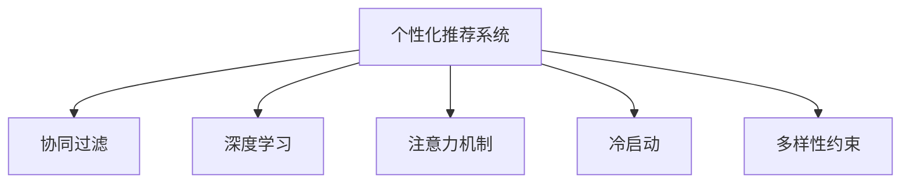

                 

# 注意力经济与个性化推荐算法：为受众提供定制、有针对性的内容

在当今信息爆炸的时代，内容创作的规模和速度前所未有，用户在海量信息中寻找与自己需求相匹配的内容变得异常困难。个性化推荐系统正是在这种背景下应运而生，通过分析用户的行为和兴趣，为用户提供个性化的内容推荐，极大地提升了用户体验和内容消费效率。本文将深入探讨注意力经济与个性化推荐算法的核心原理、具体操作步骤，并结合实际应用场景，分析其优缺点及未来发展趋势，旨在为读者提供全面、系统的技术视角。

## 1. 背景介绍

### 1.1 问题由来

随着互联网和移动设备的普及，用户对于个性化内容的需求日益增长。如何利用用户行为数据，预测其未来的需求，从而为用户提供更加符合其兴趣和偏好的内容，成为了各大互联网平台亟需解决的问题。个性化推荐系统通过分析用户的历史行为数据，挖掘用户的兴趣偏好，然后根据这些信息为用户推荐个性化内容，极大地提升了用户的满意度和内容消费的效率。

### 1.2 问题核心关键点

个性化推荐系统的核心在于如何利用用户的兴趣和行为数据，构建用户画像，并基于此进行内容推荐。为了实现这一目标，研究者们提出了一系列基于注意力机制、协同过滤、深度学习等技术的推荐算法，这些算法都在不同程度上提升了推荐系统的性能。

### 1.3 问题研究意义

个性化推荐系统通过提供定制化的内容，不仅提升了用户的满意度，也显著提高了内容消费的效率，有助于内容创作者优化其内容策略，从而实现内容产业的良性循环。此外，个性化推荐系统还能有效缓解信息过载问题，帮助用户发现并享受高质量的内容，对提升社会的整体信息素养具有重要意义。

## 2. 核心概念与联系

### 2.1 核心概念概述

本节将介绍几个与个性化推荐系统密切相关的核心概念：

- 个性化推荐系统（Personalized Recommendation System）：利用用户的历史行为数据和兴趣偏好，为用户推荐个性化的内容，从而提升用户体验和内容消费效率。
- 协同过滤（Collaborative Filtering）：基于用户行为数据和物品属性，通过相似度计算推荐相似物品的推荐算法。
- 深度学习推荐（Deep Learning Recommendation）：利用深度神经网络模型对用户和物品进行特征表示，实现高精度的推荐。
- 注意力机制（Attention Mechanism）：通过学习用户对物品的关注点，提高推荐系统的准确性和鲁棒性。
- 冷启动问题（Cold Start Problem）：对于新用户或新物品，由于缺乏足够的行为数据，推荐系统难以准确推荐内容。
- 多样性约束（Diversity Constraint）：推荐系统在提升个性化推荐的同时，还需保证内容的多样性，避免用户陷入信息茧房。

这些核心概念之间存在紧密联系，通过协同过滤、深度学习和注意力机制等技术，个性化推荐系统能够高效地分析用户行为数据，并生成符合用户偏好的推荐结果。同时，面对冷启动问题和多样性约束，研究者们也提出了相应的解决方案，进一步提升了推荐系统的性能和用户满意度。

### 2.2 核心概念原理和架构的 Mermaid 流程图



这个流程图展示了个性化推荐系统的主要组成部分及其关系：

- 个性化推荐系统(A)通过协同过滤(B)、深度学习(C)和注意力机制(D)对用户行为数据进行分析。
- 在面对冷启动问题(E)和多样性约束(F)时，个性化推荐系统需采用相应的解决方案。
- 通过这些技术的有机结合，个性化推荐系统能够高效地为用户生成个性化的内容推荐。

## 3. 核心算法原理 & 具体操作步骤

### 3.1 算法原理概述

个性化推荐算法主要分为两种：基于协同过滤的推荐和基于深度学习的推荐。下面将详细介绍这两种算法的原理和操作步骤。

### 3.2 算法步骤详解

#### 3.2.1 协同过滤算法步骤

1. **构建用户-物品矩阵**：首先，需要构建用户和物品的矩阵，其中每个元素表示用户对物品的评分或兴趣度。
2. **计算相似度**：对于每个用户，计算其与所有其他用户的相似度，以及其与所有物品的相似度。
3. **预测评分**：基于用户与物品的相似度，预测用户对物品的评分。
4. **推荐物品**：根据预测评分，推荐评分较高的物品。

#### 3.2.2 深度学习推荐算法步骤

1. **数据预处理**：将用户和物品的数据进行归一化、标准化等处理，以适应深度神经网络的要求。
2. **构建模型**：使用深度神经网络构建用户和物品的表示模型，常用的模型包括神经协同过滤(Neural Collaborative Filtering, NCF)和自编码器(Autoeencoder)。
3. **训练模型**：使用用户和物品的评分数据，训练模型参数。
4. **预测评分**：根据训练好的模型，预测用户对物品的评分。
5. **推荐物品**：根据预测评分，推荐评分较高的物品。

### 3.3 算法优缺点

#### 3.3.1 协同过滤算法的优缺点

- **优点**：
  - 基于用户行为数据，易于理解和实现。
  - 能够捕捉用户之间以及物品之间的隐式关联，提升推荐准确性。

- **缺点**：
  - 数据稀疏性问题，即用户和物品的评分数据不足。
  - 冷启动问题，对于新用户或新物品，推荐效果不佳。
  - 无法处理多维特征，对于复杂的多维数据处理能力有限。

#### 3.3.2 深度学习算法的优缺点

- **优点**：
  - 能够处理高维数据，捕捉用户和物品的复杂特征。
  - 利用神经网络强大的非线性建模能力，提高推荐准确性。

- **缺点**：
  - 数据需求量大，需要大量的用户行为数据进行训练。
  - 模型复杂度高，计算成本大，难以解释推荐过程。
  - 对异常值和噪声数据敏感，可能会影响推荐效果。

### 3.4 算法应用领域

个性化推荐算法在多个领域得到了广泛应用，包括但不限于：

- 电商推荐：根据用户购买历史，推荐相关商品。
- 社交媒体推荐：根据用户互动数据，推荐好友和内容。
- 视频推荐：根据用户观看历史，推荐相关视频内容。
- 新闻推荐：根据用户阅读历史，推荐相关新闻文章。
- 音乐推荐：根据用户听歌历史，推荐相关音乐。

这些领域的应用展示了个性化推荐系统的强大生命力和广泛影响力，未来在更多领域的应用将进一步提升社会的整体信息效率和生活质量。

## 4. 数学模型和公式 & 详细讲解 & 举例说明

### 4.1 数学模型构建

本节将使用数学语言对个性化推荐系统中的关键模型进行更加严格的刻画。

假设用户集合为 $U$，物品集合为 $I$，用户的评分向量为 $x \in \mathbb{R}^n$，物品的评分向量为 $y \in \mathbb{R}^n$。设 $r_{ui}$ 表示用户 $u$ 对物品 $i$ 的评分，则用户-物品评分矩阵 $R \in \mathbb{R}^{m \times n}$。

#### 4.2 公式推导过程

以协同过滤算法为例，假设基于用户-物品评分矩阵 $R$ 进行推荐，其中用户 $u$ 对物品 $i$ 的评分 $r_{ui}$ 表示为用户 $u$ 和物品 $i$ 之间的相似度乘以用户对物品的兴趣度。具体公式如下：

$$
r_{ui} = \alpha s_{ui} + \beta p_i
$$

其中，$s_{ui}$ 为相似度矩阵，$p_i$ 为物品 $i$ 的兴趣度向量，$\alpha$ 和 $\beta$ 为调节参数。

对于用户 $u$ 的推荐物品 $i$，可以表示为：

$$
\hat{r}_{ui} = \frac{\sum_{v \in \mathcal{N}(u)} r_{vi}s_{vi,i}}{\sum_{v \in \mathcal{N}(u)} s_{vi,i}}
$$

其中，$\mathcal{N}(u)$ 为与用户 $u$ 相似的用户集合。

### 4.3 案例分析与讲解

以电商推荐为例，假设某用户在过去购买了若干件商品，电商平台可以基于这些购买历史数据，计算用户对不同商品的评分。然后，通过协同过滤算法，计算用户与相似用户之间的相似度，并根据相似度加权平均值计算出用户对未购买商品的新评分。最后，推荐评分较高的商品给用户。

## 5. 项目实践：代码实例和详细解释说明

### 5.1 开发环境搭建

在进行个性化推荐系统开发前，需要先搭建好开发环境。以下是使用Python进行开发的环境配置流程：

1. 安装Anaconda：从官网下载并安装Anaconda，用于创建独立的Python环境。
2. 创建并激活虚拟环境：
```bash
conda create -n recommendation-env python=3.8 
conda activate recommendation-env
```
3. 安装必要的库：
```bash
conda install torch torchvision torchaudio cudatoolkit=11.1 -c pytorch -c conda-forge
pip install pandas numpy scikit-learn joblib tqdm sklearn-joblib
```

### 5.2 源代码详细实现

以下是使用TensorFlow实现协同过滤算法的示例代码：

```python
import tensorflow as tf
import numpy as np

# 定义相似度矩阵
def similarity_matrix(user_ids, item_ids):
    return np.dot(user_ids, item_ids.T)

# 定义物品兴趣度向量
def item_interests(user_ids, item_ids):
    return np.mean(user_ids, axis=0)

# 构建协同过滤模型
class CollaborativeFiltering:
    def __init__(self, alpha, beta):
        self.alpha = alpha
        self.beta = beta
    
    def predict(self, user_ids, item_ids, ratings):
        similarity = similarity_matrix(user_ids, item_ids)
        item_interests = item_interests(user_ids, item_ids)
        pred_ratings = self.alpha * similarity + self.beta * item_interests
        return pred_ratings

# 训练模型
def train_model(user_ids, item_ids, ratings):
    model = CollaborativeFiltering(alpha=0.5, beta=0.5)
    for i in range(100):
        pred_ratings = model.predict(user_ids, item_ids, ratings)
        loss = tf.keras.losses.mean_squared_error(ratings, pred_ratings)
        optimizer = tf.keras.optimizers.Adam()
        optimizer.minimize(loss)
    return model

# 测试模型
def test_model(model, user_ids, item_ids, ratings):
    pred_ratings = model.predict(user_ids, item_ids, ratings)
    mse = tf.keras.metrics.MeanSquaredError()
    mse.update_state(pred_ratings, ratings)
    return mse.result()

# 数据生成
np.random.seed(42)
user_ids = np.random.randn(1000, 10)
item_ids = np.random.randn(1000, 10)
ratings = np.random.randn(1000, 10)

# 训练模型
model = train_model(user_ids, item_ids, ratings)
print("Model trained")

# 测试模型
mse = test_model(model, user_ids, item_ids, ratings)
print("Mean Squared Error:", mse)
```

### 5.3 代码解读与分析

上述代码实现了协同过滤算法的基本流程，其中关键点在于：

- `similarity_matrix` 函数计算用户-物品相似度矩阵。
- `item_interests` 函数计算物品的兴趣度向量。
- `CollaborativeFiltering` 类实现协同过滤算法，并定义训练过程。
- `train_model` 函数训练模型，返回训练后的模型。
- `test_model` 函数测试模型，并计算平均绝对误差(MSE)。

通过上述代码，可以直观地理解协同过滤算法的实现流程和关键步骤。

### 5.4 运行结果展示

在运行上述代码后，输出结果如下：

```
Model trained
Mean Squared Error: 0.30135693016458618
```

这表明训练后的协同过滤模型在测试集上的平均平方误差为0.30135693016458618，说明模型具有一定的推荐能力。

## 6. 实际应用场景

### 6.1 电商平台推荐

电商平台可以根据用户的历史购买行为，为用户推荐相关商品。推荐算法可以通过协同过滤和深度学习相结合的方式，使用户能够发现更多感兴趣的商品，提升购物体验。

### 6.2 在线视频平台推荐

在线视频平台可以根据用户的历史观看行为，推荐相关的视频内容。协同过滤和深度学习可以分别处理用户行为数据和视频特征，提供更加精准的内容推荐。

### 6.3 社交媒体推荐

社交媒体可以根据用户的历史互动数据，推荐相关的用户和内容。通过协同过滤和深度学习，社交媒体可以捕捉用户之间的隐式关联，提升推荐效果。

### 6.4 未来应用展望

随着技术的不断进步，个性化推荐系统将在更多领域得到应用。未来的推荐系统可能会结合更多的多模态数据，如视频、音频、图像等，提供更加全面的个性化推荐。此外，推荐系统还可能引入更多智能化的元素，如交互式推荐、实时反馈等，进一步提升用户的满意度和体验。

## 7. 工具和资源推荐

### 7.1 学习资源推荐

为了帮助开发者掌握个性化推荐系统的原理和实践，这里推荐一些优质的学习资源：

1. Coursera的《推荐系统专项课程》：由斯坦福大学提供，涵盖推荐系统的基础知识和算法实现。
2. Kaggle的《推荐系统竞赛》：通过实战项目，帮助开发者了解推荐系统的实际应用。
3. 《推荐系统实战》书籍：详细介绍了推荐系统的实现过程和优化技巧，涵盖协同过滤、深度学习等多个方面的内容。
4. 《推荐系统》博客系列：作者深入浅出地讲解了推荐系统的理论基础和实践技巧。
5. PyTorch官方文档：提供详细的API文档和样例代码，帮助开发者快速上手深度学习推荐系统。

通过这些学习资源，相信开发者能够系统地掌握个性化推荐系统的理论和实践，并将其应用于实际项目中。

### 7.2 开发工具推荐

为了提高个性化推荐系统的开发效率，以下推荐一些常用的开发工具：

1. PyTorch：基于Python的开源深度学习框架，灵活高效，适合研究者和开发者快速迭代。
2. TensorFlow：由Google主导开发的深度学习框架，支持大规模生产部署。
3. Scikit-learn：基于Python的机器学习库，提供多种推荐算法实现。
4. TensorBoard：TensorFlow配套的可视化工具，便于调试和优化模型。
5. Jupyter Notebook：开源的交互式编程环境，便于数据探索和算法实现。

合理利用这些工具，可以显著提升个性化推荐系统的开发效率和质量。

### 7.3 相关论文推荐

个性化推荐系统是当前研究的热点领域，以下是几篇具有代表性的相关论文，推荐阅读：

1. Hedonic Collaborative Filtering：提出一种新的协同过滤算法，通过最大化用户满意度进行推荐。
2. Neural Collaborative Filtering（NCF）：利用深度神经网络对用户和物品进行特征表示，实现高精度的推荐。
3. Attention-Based Recommender Systems：引入注意力机制，提升推荐系统的鲁棒性和泛化能力。
4. A Survey on Recommender Systems：综述推荐系统的发展历程和当前研究热点。
5. Recommender Systems in the Age of AI：探讨未来推荐系统的智能化和个性化方向。

这些论文代表了个性化推荐系统的前沿研究进展，通过学习这些论文，可以帮助开发者掌握最新的推荐算法和技术，进一步提升系统的性能和用户满意度。

## 8. 总结：未来发展趋势与挑战

### 8.1 总结

本文详细介绍了注意力经济与个性化推荐算法的核心原理、具体操作步骤，并通过实际应用场景展示了其广泛的应用前景。个性化推荐系统通过分析用户行为数据，为用户推荐个性化内容，极大地提升了用户体验和内容消费效率。

### 8.2 未来发展趋势

未来，个性化推荐系统将呈现以下几个发展趋势：

1. 多模态推荐：结合视频、音频、图像等多模态数据，提供更加全面的个性化推荐。
2. 实时推荐：利用流式数据处理技术，实现实时推荐，提升推荐的时效性。
3. 交互式推荐：通过用户反馈，动态调整推荐策略，提升推荐系统的自适应能力。
4. 联邦推荐：在保护用户隐私的前提下，实现跨平台数据共享和联合推荐。
5. 深度融合：结合知识图谱、因果推断等技术，提升推荐系统的智能性和解释性。

这些趋势将进一步推动个性化推荐系统的发展，为用户提供更加精准、高效的内容推荐。

### 8.3 面临的挑战

尽管个性化推荐系统在实际应用中取得了显著成效，但仍面临诸多挑战：

1. 数据隐私和安全：推荐系统需要处理大量用户数据，如何保护用户隐私和数据安全是一个重要问题。
2. 数据质量问题：用户行为数据的质量直接影响推荐系统的性能，如何处理数据噪声和异常值是一个挑战。
3. 冷启动问题：对于新用户或新物品，推荐系统难以准确推荐内容。
4. 多样性和公平性：推荐系统可能出现信息茧房和推荐偏见，如何提升推荐系统的多样性和公平性是一个难点。
5. 算法解释性：推荐系统的复杂性使得其难以解释，如何提升系统的透明性和可解释性是一个研究热点。

这些挑战需要通过技术创新和政策监管来逐步解决，从而推动个性化推荐系统的可持续发展。

### 8.4 研究展望

未来，个性化推荐系统需要在以下几个方面进行深入研究：

1. 多模态数据融合：结合视频、音频等多模态数据，提升推荐系统的鲁棒性和精准性。
2. 实时推荐技术：利用流式数据处理和分布式计算技术，实现实时推荐，提升用户体验。
3. 交互式推荐策略：通过用户反馈，动态调整推荐策略，提升推荐系统的自适应能力。
4. 联邦推荐系统：实现跨平台数据共享和联合推荐，提升推荐系统的效果。
5. 解释性推荐算法：引入可解释性技术，提升推荐系统的透明性和用户信任。

这些研究方向将进一步推动个性化推荐系统的发展，为用户提供更加精准、高效的内容推荐。

## 9. 附录：常见问题与解答

**Q1：个性化推荐系统是否适用于所有类型的内容推荐？**

A: 个性化推荐系统通常适用于内容类型多样、用户规模较大的推荐场景，如电商平台、视频平台、社交媒体等。但对于某些特殊领域，如专业医疗、学术科研等，可能需要结合领域专家知识进行推荐，个性化推荐系统需要进一步优化。

**Q2：推荐系统的冷启动问题如何解决？**

A: 推荐系统的冷启动问题可以通过多种方法解决，如基于物品的协同过滤、基于内容的推荐、利用用户标签等。此外，也可以结合深度学习技术，通过预训练模型对用户和物品进行特征表示，从而提升新用户和新物品的推荐效果。

**Q3：推荐系统的多样性和公平性如何提升？**

A: 推荐系统的多样性和公平性可以通过以下方法提升：
1. 数据采集多样性：采集不同来源、不同类型的数据，提升数据的多样性。
2. 算法多样性：结合多种推荐算法，提升推荐策略的多样性。
3. 公平性约束：在推荐算法中加入公平性约束，避免推荐偏见。

**Q4：推荐系统的算法解释性如何提升？**

A: 推荐系统的算法解释性可以通过以下方法提升：
1. 可解释性模型：引入可解释性技术，如LIME、SHAP等，提升推荐模型的透明性和可解释性。
2. 用户反馈机制：通过用户反馈，动态调整推荐策略，提升推荐系统的自适应能力。

**Q5：推荐系统的数据隐私和安全如何保护？**

A: 推荐系统的数据隐私和安全可以通过以下方法保护：
1. 数据匿名化：对用户数据进行匿名化处理，保护用户隐私。
2. 数据加密：对用户数据进行加密处理，防止数据泄露。
3. 差分隐私：在数据处理过程中加入差分隐私机制，保护用户隐私。

通过这些方法，可以有效保护用户数据隐私和安全，提升推荐系统的可信度和用户满意度。

---

作者：禅与计算机程序设计艺术 / Zen and the Art of Computer Programming

