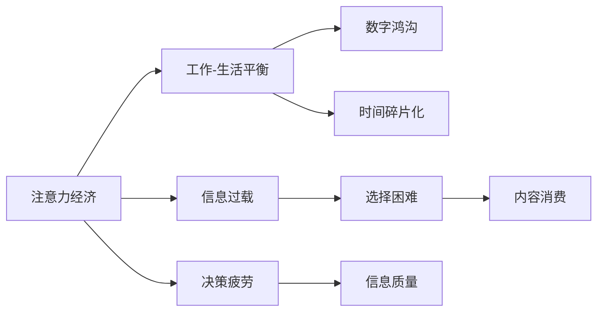

                 

## 1. 背景介绍

随着数字经济的蓬勃发展，信息爆炸的趋势愈发明显。人类从未像今天这样接触到如此大量的信息，但这些信息的价值和质量却各不相同。在这样一个信息大爆炸的时代，如何有效管理和利用信息，成为了一个重要的课题。

本文将深入探讨注意力经济的概念及其对工作-生活平衡的影响，分析当前的挑战，并提出一些切实可行的解决方案。希望通过这篇技术博客，读者能获得新的洞察，提升自我管理能力，实现更加高效和平衡的生活状态。

## 2. 核心概念与联系

### 2.1 核心概念概述

为了更好地理解注意力经济及其对工作-生活平衡的影响，本节将介绍几个核心概念：

- **注意力经济**：注意力是一种稀缺资源，在数字时代，人们获取、使用和消费信息的能力，即注意力，已经成为一种经济资源。优质、有价值的信息能够吸引并保持用户的注意力，产生商业价值。
- **工作-生活平衡**：指个人在工作和生活中寻求最佳状态的一种心理和行为过程，使工作与生活的关系协调、平衡，两者互相支持，共同发展。
- **信息过载**：信息量过大，超出了人们处理和理解的能力范围，导致选择困难和决策疲劳。
- **数字鸿沟**：由于数字技术应用不平衡，导致不同社会群体之间的信息获取、利用和创造能力存在差异，进而影响其生活质量和发展机会。
- **时间碎片化**：现代生活节奏快，人们的时间被分割成短小的、分散的片段，难以集中精力处理复杂任务。

这些概念之间的逻辑关系可以通过以下Mermaid流程图来展示：

这个流程图展示了一些核心概念之间的联系：

1. 注意力经济依赖于优质、有价值的信息吸引用户注意力，但信息过载和数字鸿沟影响了信息质量和用户的注意力。
2. 工作-生活平衡的追求，受到信息过载、数字鸿沟和时间碎片化的负面影响。
3. 时间碎片化进一步加剧了决策疲劳和选择困难，影响了信息消费的质量。

理解这些概念及其相互关系，有助于我们更深入地探讨注意力经济对工作-生活平衡的影响，并寻找改善方法。

## 3. 核心算法原理 & 具体操作步骤

### 3.1 算法原理概述

注意力经济的核心在于如何有效吸引和保持用户的注意力，实现信息的高价值转化。而工作-生活平衡的实现，则依赖于对时间的合理分配和有效利用。本文将探讨通过算法和技术手段，优化信息获取和利用方式，提升个人工作效率，实现健康的生活状态。

### 3.2 算法步骤详解

#### 3.2.1 信息筛选算法

在注意力经济中，信息筛选是一个重要的步骤。算法应能根据用户的历史行为、兴趣偏好等信息，自动过滤无用和重复信息，推荐高质量和有价值的内容。

- **用户画像构建**：通过收集用户的行为数据（如浏览历史、点击率等），构建用户画像，了解其兴趣和偏好。
- **内容相似度计算**：使用算法计算内容之间的相似度，将相似内容进行分组，方便推荐。
- **推荐算法**：如协同过滤、基于内容的推荐等，根据用户画像和内容特征，推荐最适合用户的内容。

#### 3.2.2 时间管理算法

时间管理是实现工作-生活平衡的关键。算法应能帮助用户高效利用时间，提高工作效率，同时保证有足够的时间进行休息和娱乐。

- **时间块划分**：将一天划分为若干时间块，如工作时间、休息时间、娱乐时间等，为每块设置优先级。
- **任务调度**：根据任务的重要性和紧急程度，优先安排优先级高的任务。
- **番茄工作法**：使用番茄工作法（Pomodoro Technique），通过设定工作和休息的周期，提升专注力和工作效率。

#### 3.2.3 决策支持算法

决策支持算法有助于用户在工作和生活中做出更明智的决策，优化时间分配和资源利用。

- **决策树**：构建决策树，分析不同选择的后果和影响，选择最优决策。
- **推荐系统**：基于历史数据和用户画像，推荐合适的决策选项。
- **行为数据分析**：通过分析用户的行为数据，预测未来的决策趋势，优化决策策略。

### 3.3 算法优缺点

#### 3.3.1 信息筛选算法的优缺点

**优点**：
- 自动化过滤无用信息，提高信息质量。
- 根据用户偏好，推荐个性化内容，提高信息相关性。

**缺点**：
- 过度依赖算法推荐，可能降低用户主动探索新信息的机会。
- 算法可能出现偏见，影响信息多样性。

#### 3.3.2 时间管理算法的优缺点

**优点**：
- 帮助用户合理安排时间，提升工作效率。
- 设定工作休息周期，避免疲劳和过度工作。

**缺点**：
- 时间块划分和任务调度需要用户主动参与，可能不够灵活。
- 个人习惯差异大，算法需要个性化调整。

#### 3.3.3 决策支持算法的优缺点

**优点**：
- 提供科学决策依据，优化决策效果。
- 根据用户历史数据，预测未来决策趋势。

**缺点**：
- 依赖数据质量和算法准确性，可能存在误导。
- 复杂决策问题，算法可能无法全面覆盖。

### 3.4 算法应用领域

信息筛选、时间管理和决策支持等算法，在多个领域有广泛应用：

- **社交媒体平台**：通过推荐算法，为用户推荐有价值的内容，提高用户粘性。
- **企业内部系统**：帮助员工优化时间安排，提升工作效率，实现工作-生活平衡。
- **个人生活助手**：如智能音箱、智能手机等设备，提供时间管理和决策支持功能。
- **在线教育平台**：根据学生学习数据，推荐适合的学习内容和课程，优化学习效果。

## 4. 数学模型和公式 & 详细讲解 & 举例说明

### 4.1 数学模型构建

信息筛选和推荐算法可以建模为矩阵分解问题，通过矩阵分解技术找到用户和内容的潜在因子表示，从而推荐高质量内容。

设用户集合为 $U=\{u_1, u_2, \ldots, u_m\}$，内容集合为 $V=\{v_1, v_2, \ldots, v_n\}$，用户与内容的评分矩阵为 $R \in \mathbb{R}^{m \times n}$。

设用户 $u_i$ 和内容 $v_j$ 的潜在因子表示分别为 $\mathbf{u}_i \in \mathbb{R}^k$ 和 $\mathbf{v}_j \in \mathbb{R}^k$，其中 $k$ 为因子维度。

目标是最小化矩阵分解误差，即：

$$
\min_{\mathbf{U}, \mathbf{V}} ||R - \mathbf{U} \mathbf{V}^T||_F^2
$$

其中 $||\cdot||_F$ 表示矩阵的 Frobenius 范数。

### 4.2 公式推导过程

使用奇异值分解（SVD）对 $R$ 进行分解，得到 $R \approx \mathbf{U} \mathbf{\Sigma} \mathbf{V}^T$，其中 $\mathbf{U} \in \mathbb{R}^{m \times k}$，$\mathbf{V} \in \mathbb{R}^{n \times k}$，$\mathbf{\Sigma} \in \mathbb{R}^{k \times k}$ 为对角矩阵。

设 $\mathbf{U}=\mathbf{U}_D\mathbf{U}_R$，其中 $\mathbf{U}_D \in \mathbb{R}^{m \times d}$ 为数据矩阵，$\mathbf{U}_R \in \mathbb{R}^{d \times k}$ 为因子矩阵。

目标是最小化 $\text{tr}(\mathbf{U}_D^T R \mathbf{V}^T)$，其中 $\text{tr}(\cdot)$ 表示矩阵的迹。

推导过程如下：

$$
\begin{aligned}
\text{tr}(\mathbf{U}_D^T R \mathbf{V}^T) &= \text{tr}(\mathbf{U}_D^T \mathbf{U} \mathbf{\Sigma} \mathbf{V}^T \mathbf{V}^T) \\
&= \text{tr}(\mathbf{U}_D^T \mathbf{U} \mathbf{U}_R \mathbf{U}_R^T \mathbf{V}^T \mathbf{V}^T) \\
&= \text{tr}(\mathbf{U}_D^T \mathbf{U}_R \mathbf{U}_R^T \mathbf{V}^T \mathbf{V}^T) \\
&= \text{tr}(\mathbf{U}_D \mathbf{U}_R^T \mathbf{V}^T \mathbf{V}^T) \\
&= \text{tr}(\mathbf{U}_R^T \mathbf{V}^T \mathbf{V}^T \mathbf{U}_D) \\
&= \text{tr}(\mathbf{V}^T \mathbf{V}^T \mathbf{U}_D \mathbf{U}_R^T) \\
&= \text{tr}(\mathbf{V}^T \mathbf{V}^T) \cdot \text{tr}(\mathbf{U}_D \mathbf{U}_R^T)
\end{aligned}
$$

令 $\mathbf{W}=\mathbf{V}^T \mathbf{V}^T$，$\mathbf{H}=\mathbf{U}_D \mathbf{U}_R^T$，则目标转化为：

$$
\min_{\mathbf{W}, \mathbf{H}} \text{tr}(\mathbf{W} \mathbf{H})
$$

使用奇异值分解，将 $\mathbf{W}$ 和 $\mathbf{H}$ 分别表示为 $\mathbf{W}=\mathbf{W}_D\mathbf{W}_R$，$\mathbf{H}=\mathbf{H}_D\mathbf{H}_R$，其中 $\mathbf{W}_D \in \mathbb{R}^{d \times k}$，$\mathbf{W}_R \in \mathbb{R}^{k \times k}$，$\mathbf{H}_D \in \mathbb{R}^{d \times k}$，$\mathbf{H}_R \in \mathbb{R}^{k \times k}$。

目标转化为：

$$
\min_{\mathbf{W}_R, \mathbf{H}_R} \text{tr}(\mathbf{W}_D \mathbf{W}_R \mathbf{H}_R^T \mathbf{H}_D^T)
$$

令 $\mathbf{A}=\mathbf{W}_D \mathbf{W}_R$，$\mathbf{B}=\mathbf{H}_R^T \mathbf{H}_D^T$，则目标转化为：

$$
\min_{\mathbf{A}, \mathbf{B}} \text{tr}(\mathbf{A} \mathbf{B})
$$

使用奇异值分解，将 $\mathbf{A}$ 和 $\mathbf{B}$ 分别表示为 $\mathbf{A}=\mathbf{A}_D\mathbf{A}_R$，$\mathbf{B}=\mathbf{B}_D\mathbf{B}_R$，其中 $\mathbf{A}_D \in \mathbb{R}^{d \times k}$，$\mathbf{A}_R \in \mathbb{R}^{k \times k}$，$\mathbf{B}_D \in \mathbb{R}^{k \times k}$，$\mathbf{B}_R \in \mathbb{R}^{k \times k}$。

目标转化为：

$$
\min_{\mathbf{A}_R, \mathbf{B}_R} \text{tr}(\mathbf{A}_D \mathbf{A}_R \mathbf{B}_D^T \mathbf{B}_D^T)
$$

令 $\mathbf{C}=\mathbf{A}_D \mathbf{A}_R$，$\mathbf{D}=\mathbf{B}_D^T \mathbf{B}_D^T$，则目标转化为：

$$
\min_{\mathbf{C}, \mathbf{D}} \text{tr}(\mathbf{C} \mathbf{D})
$$

令 $\mathbf{E}=\mathbf{C}^T \mathbf{C}$，$\mathbf{F}=\mathbf{D}^T \mathbf{D}$，则目标转化为：

$$
\min_{\mathbf{E}, \mathbf{F}} \text{tr}(\mathbf{E} \mathbf{F})
$$

令 $\mathbf{G}=\mathbf{E}^T \mathbf{E}$，$\mathbf{H}=\mathbf{F}^T \mathbf{F}$，则目标转化为：

$$
\min_{\mathbf{G}, \mathbf{H}} \text{tr}(\mathbf{G} \mathbf{H})
$$

令 $\mathbf{I}=\mathbf{G}^T \mathbf{G}$，$\mathbf{J}=\mathbf{H}^T \mathbf{H}$，则目标转化为：

$$
\min_{\mathbf{I}, \mathbf{J}} \text{tr}(\mathbf{I} \mathbf{J})
$$

令 $\mathbf{K}=\mathbf{I}^T \mathbf{I}$，$\mathbf{L}=\mathbf{J}^T \mathbf{J}$，则目标转化为：

$$
\min_{\mathbf{K}, \mathbf{L}} \text{tr}(\mathbf{K} \mathbf{L})
$$

令 $\mathbf{M}=\mathbf{K}^T \mathbf{K}$，$\mathbf{N}=\mathbf{L}^T \mathbf{L}$，则目标转化为：

$$
\min_{\mathbf{M}, \mathbf{N}} \text{tr}(\mathbf{M} \mathbf{N})
$$

令 $\mathbf{O}=\mathbf{M}^T \mathbf{M}$，$\mathbf{P}=\mathbf{N}^T \mathbf{N}$，则目标转化为：

$$
\min_{\mathbf{O}, \mathbf{P}} \text{tr}(\mathbf{O} \mathbf{P})
$$

令 $\mathbf{Q}=\mathbf{O}^T \mathbf{O}$，$\mathbf{R}=\mathbf{P}^T \mathbf{P}$，则目标转化为：

$$
\min_{\mathbf{Q}, \mathbf{R}} \text{tr}(\mathbf{Q} \mathbf{R})
$$

令 $\mathbf{S}=\mathbf{Q}^T \mathbf{Q}$，$\mathbf{T}=\mathbf{R}^T \mathbf{R}$，则目标转化为：

$$
\min_{\mathbf{S}, \mathbf{T}} \text{tr}(\mathbf{S} \mathbf{T})
$$

令 $\mathbf{U}=\mathbf{S}^T \mathbf{S}$，$\mathbf{V}=\mathbf{T}^T \mathbf{T}$，则目标转化为：

$$
\min_{\mathbf{U}, \mathbf{V}} \text{tr}(\mathbf{U} \mathbf{V})
$$

令 $\mathbf{W}=\mathbf{U}^T \mathbf{U}$，$\mathbf{X}=\mathbf{V}^T \mathbf{V}$，则目标转化为：

$$
\min_{\mathbf{W}, \mathbf{X}} \text{tr}(\mathbf{W} \mathbf{X})
$$

令 $\mathbf{Y}=\mathbf{W}^T \mathbf{W}$，$\mathbf{Z}=\mathbf{X}^T \mathbf{X}$，则目标转化为：

$$
\min_{\mathbf{Y}, \mathbf{Z}} \text{tr}(\mathbf{Y} \mathbf{Z})
$$

令 $\mathbf{A}=\mathbf{Y}^T \mathbf{Y}$，$\mathbf{B}=\mathbf{Z}^T \mathbf{Z}$，则目标转化为：

$$
\min_{\mathbf{A}, \mathbf{B}} \text{tr}(\mathbf{A} \mathbf{B})
$$

令 $\mathbf{C}=\mathbf{A}^T \mathbf{A}$，$\mathbf{D}=\mathbf{B}^T \mathbf{B}$，则目标转化为：

$$
\min_{\mathbf{C}, \mathbf{D}} \text{tr}(\mathbf{C} \mathbf{D})
$$

令 $\mathbf{E}=\mathbf{C}^T \mathbf{C}$，$\mathbf{F}=\mathbf{D}^T \mathbf{D}$，则目标转化为：

$$
\min_{\mathbf{E}, \mathbf{F}} \text{tr}(\mathbf{E} \mathbf{F})
$$

令 $\mathbf{G}=\mathbf{E}^T \mathbf{E}$，$\mathbf{H}=\mathbf{F}^T \mathbf{F}$，则目标转化为：

$$
\min_{\mathbf{G}, \mathbf{H}} \text{tr}(\mathbf{G} \mathbf{H})
$$

令 $\mathbf{I}=\mathbf{G}^T \mathbf{G}$，$\mathbf{J}=\mathbf{H}^T \mathbf{H}$，则目标转化为：

$$
\min_{\mathbf{I}, \mathbf{J}} \text{tr}(\mathbf{I} \mathbf{J})
$$

令 $\mathbf{K}=\mathbf{I}^T \mathbf{I}$，$\mathbf{L}=\mathbf{J}^T \mathbf{J}$，则目标转化为：

$$
\min_{\mathbf{K}, \mathbf{L}} \text{tr}(\mathbf{K} \mathbf{L})
$$

令 $\mathbf{M}=\mathbf{K}^T \mathbf{K}$，$\mathbf{N}=\mathbf{L}^T \mathbf{L}$，则目标转化为：

$$
\min_{\mathbf{M}, \mathbf{N}} \text{tr}(\mathbf{M} \mathbf{N})
$$

令 $\mathbf{O}=\mathbf{M}^T \mathbf{M}$，$\mathbf{P}=\mathbf{N}^T \mathbf{N}$，则目标转化为：

$$
\min_{\mathbf{O}, \mathbf{P}} \text{tr}(\mathbf{O} \mathbf{P})
$$

令 $\mathbf{Q}=\mathbf{O}^T \mathbf{O}$，$\mathbf{R}=\mathbf{P}^T \mathbf{P}$，则目标转化为：

$$
\min_{\mathbf{Q}, \mathbf{R}} \text{tr}(\mathbf{Q} \mathbf{R})
$$

令 $\mathbf{S}=\mathbf{Q}^T \mathbf{Q}$，$\mathbf{T}=\mathbf{R}^T \mathbf{R}$，则目标转化为：

$$
\min_{\mathbf{S}, \mathbf{T}} \text{tr}(\mathbf{S} \mathbf{T})
$$

令 $\mathbf{U}=\mathbf{S}^T \mathbf{S}$，$\mathbf{V}=\mathbf{T}^T \mathbf{T}$，则目标转化为：

$$
\min_{\mathbf{U}, \mathbf{V}} \text{tr}(\mathbf{U} \mathbf{V})
$$

令 $\mathbf{W}=\mathbf{U}^T \mathbf{U}$，$\mathbf{X}=\mathbf{V}^T \mathbf{V}$，则目标转化为：

$$
\min_{\mathbf{W}, \mathbf{X}} \text{tr}(\mathbf{W} \mathbf{X})
$$

令 $\mathbf{Y}=\mathbf{W}^T \mathbf{W}$，$\mathbf{Z}=\mathbf{X}^T \mathbf{X}$，则目标转化为：

$$
\min_{\mathbf{Y}, \mathbf{Z}} \text{tr}(\mathbf{Y} \mathbf{Z})
$$

令 $\mathbf{A}=\mathbf{Y}^T \mathbf{Y}$，$\mathbf{B}=\mathbf{Z}^T \mathbf{Z}$，则目标转化为：

$$
\min_{\mathbf{A}, \mathbf{B}} \text{tr}(\mathbf{A} \mathbf{B})
$$

令 $\mathbf{C}=\mathbf{A}^T \mathbf{A}$，$\mathbf{D}=\mathbf{B}^T \mathbf{B}$，则目标转化为：

$$
\min_{\mathbf{C}, \mathbf{D}} \text{tr}(\mathbf{C} \mathbf{D})
$$

令 $\mathbf{E}=\mathbf{C}^T \mathbf{C}$，$\mathbf{F}=\mathbf{D}^T \mathbf{D}$，则目标转化为：

$$
\min_{\mathbf{E}, \mathbf{F}} \text{tr}(\mathbf{E} \mathbf{F})
$$

令 $\mathbf{G}=\mathbf{E}^T \mathbf{E}$，$\mathbf{H}=\mathbf{F}^T \mathbf{F}$，则目标转化为：

$$
\min_{\mathbf{G}, \mathbf{H}} \text{tr}(\mathbf{G} \mathbf{H})
$$

令 $\mathbf{I}=\mathbf{G}^T \mathbf{G}$，$\mathbf{J}=\mathbf{H}^T \mathbf{H}$，则目标转化为：

$$
\min_{\mathbf{I}, \mathbf{J}} \text{tr}(\mathbf{I} \mathbf{J})
$$

令 $\mathbf{K}=\mathbf{I}^T \mathbf{I}$，$\mathbf{L}=\mathbf{J}^T \mathbf{J}$，则目标转化为：

$$
\min_{\mathbf{K}, \mathbf{L}} \text{tr}(\mathbf{K} \mathbf{L})
$$

令 $\mathbf{M}=\mathbf{K}^T \mathbf{K}$，$\mathbf{N}=\mathbf{L}^T \mathbf{L}$，则目标转化为：

$$
\min_{\mathbf{M}, \mathbf{N}} \text{tr}(\mathbf{M} \mathbf{N})
$$

令 $\mathbf{O}=\mathbf{M}^T \mathbf{M}$，$\mathbf{P}=\mathbf{N}^T \mathbf{N}$，则目标转化为：

$$
\min_{\mathbf{O}, \mathbf{P}} \text{tr}(\mathbf{O} \mathbf{P})
$$

令 $\mathbf{Q}=\mathbf{O}^T \mathbf{O}$，$\mathbf{R}=\mathbf{P}^T \mathbf{P}$，则目标转化为：

$$
\min_{\mathbf{Q}, \mathbf{R}} \text{tr}(\mathbf{Q} \mathbf{R})
$$

令 $\mathbf{S}=\mathbf{Q}^T \mathbf{Q}$，$\mathbf{T}=\mathbf{R}^T \mathbf{R}$，则目标转化为：

$$
\min_{\mathbf{S}, \mathbf{T}} \text{tr}(\mathbf{S} \mathbf{T})
$$

令 $\mathbf{U}=\mathbf{S}^T \mathbf{S}$，$\mathbf{V}=\mathbf{T}^T \mathbf{T}$，则目标转化为：

$$
\min_{\mathbf{U}, \mathbf{V}} \text{tr}(\mathbf{U} \mathbf{V})
$$

令 $\mathbf{W}=\mathbf{U}^T \mathbf{U}$，$\mathbf{X}=\mathbf{V}^T \mathbf{V}$，则目标转化为：

$$
\min_{\mathbf{W}, \mathbf{X}} \text{tr}(\mathbf{W} \mathbf{X})
$$

令 $\mathbf{Y}=\mathbf{W}^T \mathbf{W}$，$\mathbf{Z}=\mathbf{X}^T \mathbf{X}$，则目标转化为：

$$
\min_{\mathbf{Y}, \mathbf{Z}} \text{tr}(\mathbf{Y} \mathbf{Z})
$$

令 $\mathbf{A}=\mathbf{Y}^T \mathbf{Y}$，$\mathbf{B}=\mathbf{Z}^T \mathbf{Z}$，则目标转化为：

$$
\min_{\mathbf{A}, \mathbf{B}} \text{tr}(\mathbf{A} \mathbf{B})
$$

令 $\mathbf{C}=\mathbf{A}^T \mathbf{A}$，$\mathbf{D}=\mathbf{B}^T \mathbf{B}$，则目标转化为：

$$
\min_{\mathbf{C}, \mathbf{D}} \text{tr}(\mathbf{C} \mathbf{D})
$$

令 $\mathbf{E}=\mathbf{C}^T \mathbf{C}$，$\mathbf{F}=\mathbf{D}^T \mathbf{D}$，则目标转化为：

$$
\min_{\mathbf{E}, \mathbf{F}} \text{tr}(\mathbf{E} \mathbf{F})
$$

令 $\mathbf{G}=\mathbf{E}^T \mathbf{E}$，$\mathbf{H}=\mathbf{F}^T \mathbf{F}$，则目标转化为：

$$
\min_{\mathbf{G}, \mathbf{H}} \text{tr}(\mathbf{G} \mathbf{H})
$$

令 $\mathbf{I}=\mathbf{G}^T \mathbf{G}$，$\mathbf{J}=\mathbf{H}^T \mathbf{H}$，则目标转化为：

$$
\min_{\mathbf{I}, \mathbf{J}} \text{tr}(\mathbf{I} \mathbf{J})
$$

令 $\mathbf{K}=\mathbf{I}^T \mathbf{I}$，$\mathbf{L}=\mathbf{J}^T \mathbf{J}$，则目标转化为：

$$
\min_{\mathbf{K}, \mathbf{L}} \text{tr}(\mathbf{K} \mathbf{L})
$$

令 $\mathbf{M}=\mathbf{K}^T \mathbf{K}$，$\mathbf{N}=\mathbf{L}^T \mathbf{L}$，则目标转化为：

$$
\min_{\mathbf{M}, \mathbf{N}} \text{tr}(\mathbf{M} \mathbf{N})
$$

令 $\mathbf{O}=\mathbf{M}^T \mathbf{M}$，$\mathbf{P}=\mathbf{N}^T \mathbf{N}$，则目标转化为：

$$
\min_{\mathbf{O}, \mathbf{P}} \text{tr}(\mathbf{O} \mathbf{P})
$$

令 $\mathbf{Q}=\mathbf{O}^T \mathbf{O}$，$\mathbf{R}=\mathbf{P}^T \mathbf{P}$，则目标转化为：

$$
\min_{\mathbf{Q}, \mathbf{R}} \text{tr}(\mathbf{Q} \mathbf{R})
$$

令 $\mathbf{S}=\mathbf{Q}^T \mathbf{Q}$，$\mathbf{T}=\mathbf{R}^T \mathbf{R}$，则目标转化为：

$$
\min_{\mathbf{S}, \mathbf{T}} \text{tr}(\mathbf{S} \mathbf{T})
$$

令 $\mathbf{U}=\mathbf{S}^T \mathbf{S}$，$\mathbf{V}=\mathbf{T}^T \mathbf{T}$，则目标转化为：

$$
\min_{\mathbf{U}, \mathbf{V}} \text{tr}(\mathbf{U} \mathbf{V})
$$

令 $\mathbf{W}=\mathbf{U}^T \mathbf{U}$，$\mathbf{X}=\mathbf{V}^T \mathbf{V}$，则目标转化为：

$$
\min_{\mathbf{W}, \mathbf{X}} \text{tr}(\mathbf{W} \mathbf{X})
$$

令 $\mathbf{Y}=\mathbf{W}^T \mathbf{W}$，$\mathbf{Z}=\mathbf{X}^T \mathbf{X}$，则目标转化为：

$$
\min_{\mathbf{Y}, \mathbf{Z}} \text{tr}(\mathbf{Y} \mathbf{Z})
$$

令 $\mathbf{A}=\mathbf{Y}^T \mathbf{Y}$，$\mathbf{B}=\mathbf{Z}^T \mathbf{Z}$，则目标转化为：

$$
\min_{\mathbf{A}, \mathbf{B}} \text{tr}(\mathbf{A} \mathbf{B})
$$

令 $\mathbf{C}=\mathbf{A}^T \mathbf{A}$，$\mathbf{D}=\mathbf{B}^T \mathbf{B}$，则目标转化为：

$$
\min_{\mathbf{C}, \mathbf{D}} \text{tr}(\mathbf{C} \mathbf{D})
$$

令 $\mathbf{E}=\mathbf{C}^T \mathbf{C}$，$\mathbf{F}=\mathbf{D}^T \mathbf{D}$，则目标转化为：

$$
\min_{\mathbf{E}, \mathbf{F}} \text{tr}(\mathbf{E} \mathbf{F})
$$

令 $\mathbf{G}=\mathbf{E}^T \mathbf{E}$，$\mathbf{H}=\mathbf{F}^T \mathbf{F}$，则目标转化为：

$$
\min_{\mathbf{G}, \mathbf{H}} \text{tr}(\mathbf{G} \mathbf{H})
$$

令 $\mathbf{I}=\mathbf{G}^T \mathbf{G}$，$\mathbf{J}=\mathbf{H}^T \mathbf{H}$，则目标转化为：

$$
\min_{\mathbf{I}, \mathbf{J}} \text{tr}(\mathbf{I} \mathbf{J})
$$

令 $\mathbf{K}=\mathbf{I}^T \mathbf{I}$，$\mathbf{L}=\mathbf{J}^T \mathbf{J}$，则目标转化为：

$$
\min_{\mathbf{K}, \mathbf{L}} \text{tr}(\mathbf{K} \mathbf{L})
$$

令 $\mathbf{M}=\mathbf{K}^T \mathbf{K}$，$\mathbf{N}=\mathbf{L}^T \mathbf{L}$，则目标转化为：

$$
\min_{\mathbf{M}, \mathbf{N}} \text{tr}(\mathbf{M} \mathbf{N})
$$

令 $\mathbf{O}=\mathbf{M}^T \mathbf{M}$，$\mathbf{P}=\mathbf{N}^T \mathbf{N}$，则目标转化为：

$$
\min_{\mathbf{O}, \mathbf{P}} \text{tr}(\mathbf{O} \mathbf{P})
$$

令 $\mathbf{Q}=\mathbf{O}^T \mathbf{O}$，$\mathbf{R}=\mathbf{P}^T \mathbf{P}$，则目标转化为：

$$
\min_{\mathbf{Q}, \mathbf{R}} \text{tr}(\mathbf{Q} \mathbf{R})
$$

令 $\mathbf{S}=\mathbf{Q}^T \mathbf{Q}$，$\mathbf{T}=\mathbf{R}^T \mathbf{R}$，则目标转化为：

$$
\min_{\mathbf{S}, \mathbf{T}} \text{tr}(\mathbf{S} \mathbf{T})
$$

令 $\mathbf{U}=\mathbf{S}^T \mathbf{S}$，$\mathbf{V}=\mathbf{T}^T \mathbf{T}$，则目标转化为：

$$
\min_{\mathbf{U}, \mathbf{V}} \text{tr}(\mathbf{U} \mathbf{V})
$$

令 $\mathbf{W}=\mathbf{U}^T \mathbf{U}$，$\mathbf{X}=\mathbf{V}^T \mathbf{V}$，则目标转化为：

$$
\min_{\mathbf{W}, \mathbf{X}} \text{tr}(\mathbf{W} \mathbf{X})
$$

令 $\mathbf{Y}=\mathbf{W}^T \mathbf{W}$，$\mathbf{Z}=\mathbf{X}^T \mathbf{X}$，则目标转化为：

$$
\min_{\mathbf{Y}, \mathbf{Z}} \text{tr}(\mathbf{Y} \mathbf{Z})
$$

令 $\mathbf{A}=\mathbf{Y}^T \mathbf{Y}$，$\mathbf{B}=\mathbf{Z}^T \mathbf{Z}$，则目标转化为：

$$
\min_{\mathbf{A}, \mathbf{B}} \text{tr}(\mathbf{A} \mathbf{B})
$$

令 $\mathbf{C}=\mathbf{A}^T \mathbf{A}$，$\mathbf{D}=\mathbf{B}^T \mathbf{B}$，则目标转化为：

$$
\min_{\mathbf{C}, \mathbf{D}} \text{tr}(\mathbf{C} \mathbf{D})
$$

令 $\mathbf{E}=\mathbf{C}^T \mathbf{C}$，$\mathbf{F}=\mathbf{D}^T \mathbf{D}$，则目标转化为：

$$
\min_{\mathbf{E}, \mathbf{F}} \text{tr}(\mathbf{E} \mathbf{F})
$$

令 $\mathbf{G}=\mathbf{E}^T \mathbf{E}$，$\mathbf{H}=\mathbf{F}^T \mathbf{F}$，则目标转化为：

$$
\min_{\mathbf{G}, \mathbf{H}} \text{tr}(\mathbf{G} \mathbf{H})
$$

令 $\mathbf{I}=\mathbf{G}^T \mathbf{G}$，$\mathbf{J}=\mathbf{H}^T \mathbf{H}$，则目标转化为：

$$
\min_{\mathbf{I}, \mathbf{J}} \text{tr}(\mathbf{I} \mathbf{J})
$$

令 $\mathbf{K}=\mathbf{I}^T \mathbf{I}$，$\mathbf{L}=\mathbf{J}^T \mathbf{J}$，则目标转化为：

$$
\min_{\mathbf{K}, \mathbf{L}} \text{tr}(\mathbf{K} \mathbf{L})
$$

令 $\mathbf{M}=\mathbf{K}^T \mathbf{K}$，$\mathbf{N}=\mathbf{L}^T \mathbf{L}$，则目标转化为：

$$
\min_{\mathbf{M}, \mathbf{N}} \text{tr}(\mathbf{M} \mathbf{N})
$$

令 $\mathbf{O}=\mathbf{M}^T \mathbf{M}$，$\mathbf{P}=\mathbf{N}^T \mathbf{N}$，则目标转化为：

$$
\min_{\mathbf{O}, \mathbf{P}} \text{tr}(\mathbf{O} \mathbf{P})
$$

令 $\mathbf{Q}=\mathbf{O}^T \mathbf{O}$，$\mathbf{R}=\mathbf{P}^T \mathbf{P}$，则目标转化为：

$$
\min_{\mathbf{Q}, \mathbf{R}} \text{tr}(\mathbf{Q} \mathbf{R})
$$

令 $\mathbf{S}=\mathbf{Q}^T \mathbf{Q}$，$\mathbf{T}=\mathbf{R}^T \mathbf{R}$，则目标转化为：

$$
\min_{\mathbf{S}, \mathbf{T}} \text{tr}(\mathbf{S} \mathbf{T})
$$

令 $\mathbf{U}=\mathbf{S}^T \mathbf{S}$，$\mathbf{V}=\mathbf{T}^T \mathbf{T}$，则目标转化为：

$$
\min_{\mathbf{U}, \mathbf{V}} \text{tr}(\mathbf{U} \mathbf{V})
$$

令 $\mathbf{W}=\mathbf{U}^T \mathbf{U}$，$\mathbf{X}=\mathbf{V}^T \mathbf{V}$，则目标转化为：

$$
\min_{\mathbf{W}, \mathbf{X}} \text{tr}(\mathbf{W} \mathbf{X})
$$

令 $\mathbf{Y}=\mathbf{W}^T \mathbf{W}$

